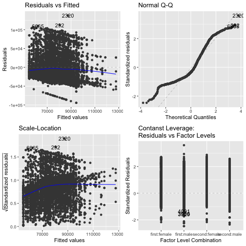
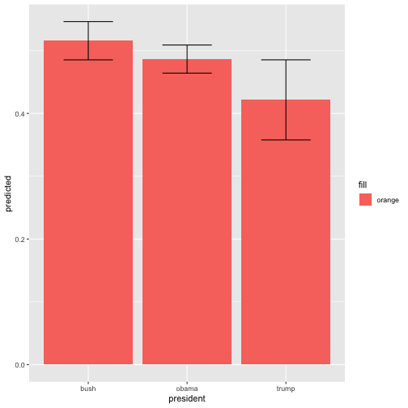

<style>
.small-code pre code {
  font-size: 1em;
}
</style>

Modeling in R
========================================================
author: Ben Bellman
date: August 28, 2018
autosize: true

The stats package
========================================================

- `stats` is one of the eight base packages
- Huge list of models, statistics, tests, distributions, etc.
    - [Full list for R version 3.5.1](https://www.rdocumentation.org/packages/stats/versions/3.5.1)
- Lots of packages are devoted to implementing specific models
- Range of available methods is a major strength of R
- However, much less support compared to Stata, no warranty!

Setting up the data
========================================================
class: small-code

```r
library(tidyverse)
library(here)

salaries <- read_csv(here("data","white-house-salaries.csv")) %>%
  rename(name = employee_name) %>%
  group_by(name) %>%
  mutate(tenure = rank(year) - 1,   # make intercept interpretable to first year
         gender = factor(gender),
         term = factor(term),
         year = year - 2001)   # make intercept interpretable to 2001
```

OLS Models
========================================================
class: small-code
- Estaimte OLS regression models with `lm()`
- You'll need to center/scale variables yourself

```r
ols_1 <- lm(salary ~ tenure + year + term + gender, data = salaries)

summary(ols_1)
```

```

Call:
lm(formula = salary ~ tenure + year + term + gender, data = salaries)

Residuals:
   Min     1Q Median     3Q    Max 
-94355 -29009 -13198  24863 137614 

Coefficients:
            Estimate Std. Error t value Pr(>|t|)    
(Intercept)  54982.4     1088.9  50.494  < 2e-16 ***
tenure        2222.7      224.6   9.896  < 2e-16 ***
year          1742.3      101.8  17.112  < 2e-16 ***
termsecond   -4979.9      929.8  -5.356 8.79e-08 ***
gendermale   11495.9      907.6  12.667  < 2e-16 ***
---
Signif. codes:  0 '***' 0.001 '**' 0.01 '*' 0.05 '.' 0.1 ' ' 1

Residual standard error: 38230 on 7103 degrees of freedom
Multiple R-squared:  0.08555,	Adjusted R-squared:  0.08504 
F-statistic: 166.1 on 4 and 7103 DF,  p-value: < 2.2e-16
```

OLS Models
========================================================
class: small-code
- `anova()` provides analysis of variance across model specifications

```r
ols_2 <- lm(salary ~ tenure + year + term, data = salaries)

anova(ols_1, ols_2)
```

```
Analysis of Variance Table

Model 1: salary ~ tenure + year + term + gender
Model 2: salary ~ tenure + year + term
  Res.Df        RSS Df   Sum of Sq      F    Pr(>F)    
1   7103 1.0380e+13                                    
2   7104 1.0615e+13 -1 -2.3448e+11 160.45 < 2.2e-16 ***
---
Signif. codes:  0 '***' 0.001 '**' 0.01 '*' 0.05 '.' 0.1 ' ' 1
```

Diagnostic plots
========================================================
class: small-code
- The `ggfortify()` package provide a simple function for diagnostic plots

```r
library(ggfortify)
autoplot(ols_1)
```

Diagnostic plots
========================================================
class: small-code


The broom package
========================================================

- Most model functions output lists with lots of different data types and results
    - Hard to work with these custom classes
- `broom` package converts model results into a tidy data frame
    - Useful for analysis and visualizing
- Two main functions: `tidy()` and `augment()`
    - ```tidy()``` describes the model and coefficients
    - ```augment()``` collects observation-level attributes


The broom package
========================================================
class: small-code
- Let's look at the `lm()` output

```r
str(ols_1)
```

```
List of 13
 $ coefficients : Named num [1:5] 54982 2223 1742 -4980 11496
  ..- attr(*, "names")= chr [1:5] "(Intercept)" "tenure" "year" "termsecond" ...
 $ residuals    : Named num [1:7108] -40417 -15417 -44417 11583 -28343 ...
  ..- attr(*, "names")= chr [1:7108] "1" "2" "3" "4" ...
 $ effects      : Named num [1:7108] -6442223 520137 -647660 -215921 484232 ...
  ..- attr(*, "names")= chr [1:7108] "(Intercept)" "tenure" "year" "termsecond" ...
 $ rank         : int 5
 $ fitted.values: Named num [1:7108] 80417 80417 80417 80417 71143 ...
  ..- attr(*, "names")= chr [1:7108] "1" "2" "3" "4" ...
 $ assign       : int [1:5] 0 1 2 3 4
 $ qr           :List of 5
  ..$ qr   : num [1:7108, 1:5] -84.309 0.0119 0.0119 0.0119 0.0119 ...
  .. ..- attr(*, "dimnames")=List of 2
  .. .. ..$ : chr [1:7108] "1" "2" "3" "4" ...
  .. .. ..$ : chr [1:5] "(Intercept)" "tenure" "year" "termsecond" ...
  .. ..- attr(*, "assign")= int [1:5] 0 1 2 3 4
  .. ..- attr(*, "contrasts")=List of 2
  .. .. ..$ term  : chr "contr.treatment"
  .. .. ..$ gender: chr "contr.treatment"
  ..$ qraux: num [1:5] 1.01 1.01 1 1.01 1.01
  ..$ pivot: int [1:5] 1 2 3 4 5
  ..$ tol  : num 1e-07
  ..$ rank : int 5
  ..- attr(*, "class")= chr "qr"
 $ df.residual  : int 7103
 $ contrasts    :List of 2
  ..$ term  : chr "contr.treatment"
  ..$ gender: chr "contr.treatment"
 $ xlevels      :List of 2
  ..$ term  : chr [1:2] "first" "second"
  ..$ gender: chr [1:2] "female" "male"
 $ call         : language lm(formula = salary ~ tenure + year + term + gender, data = salaries)
 $ terms        :Classes 'terms', 'formula'  language salary ~ tenure + year + term + gender
  .. ..- attr(*, "variables")= language list(salary, tenure, year, term, gender)
  .. ..- attr(*, "factors")= int [1:5, 1:4] 0 1 0 0 0 0 0 1 0 0 ...
  .. .. ..- attr(*, "dimnames")=List of 2
  .. .. .. ..$ : chr [1:5] "salary" "tenure" "year" "term" ...
  .. .. .. ..$ : chr [1:4] "tenure" "year" "term" "gender"
  .. ..- attr(*, "term.labels")= chr [1:4] "tenure" "year" "term" "gender"
  .. ..- attr(*, "order")= int [1:4] 1 1 1 1
  .. ..- attr(*, "intercept")= int 1
  .. ..- attr(*, "response")= int 1
  .. ..- attr(*, ".Environment")=<environment: R_GlobalEnv> 
  .. ..- attr(*, "predvars")= language list(salary, tenure, year, term, gender)
  .. ..- attr(*, "dataClasses")= Named chr [1:5] "numeric" "numeric" "numeric" "character" ...
  .. .. ..- attr(*, "names")= chr [1:5] "salary" "tenure" "year" "term" ...
 $ model        :'data.frame':	7108 obs. of  5 variables:
  ..$ salary: num [1:7108] 40000 65000 36000 92000 42800 ...
  ..$ tenure: num [1:7108] 0 0 0 0 1 0 0 0 0 0 ...
  ..$ year  : num [1:7108] 8 8 8 8 8 8 8 8 8 8 ...
  ..$ term  : chr [1:7108] "first" "first" "first" "first" ...
  ..$ gender: chr [1:7108] "male" "male" "male" "male" ...
  ..- attr(*, "terms")=Classes 'terms', 'formula'  language salary ~ tenure + year + term + gender
  .. .. ..- attr(*, "variables")= language list(salary, tenure, year, term, gender)
  .. .. ..- attr(*, "factors")= int [1:5, 1:4] 0 1 0 0 0 0 0 1 0 0 ...
  .. .. .. ..- attr(*, "dimnames")=List of 2
  .. .. .. .. ..$ : chr [1:5] "salary" "tenure" "year" "term" ...
  .. .. .. .. ..$ : chr [1:4] "tenure" "year" "term" "gender"
  .. .. ..- attr(*, "term.labels")= chr [1:4] "tenure" "year" "term" "gender"
  .. .. ..- attr(*, "order")= int [1:4] 1 1 1 1
  .. .. ..- attr(*, "intercept")= int 1
  .. .. ..- attr(*, "response")= int 1
  .. .. ..- attr(*, ".Environment")=<environment: R_GlobalEnv> 
  .. .. ..- attr(*, "predvars")= language list(salary, tenure, year, term, gender)
  .. .. ..- attr(*, "dataClasses")= Named chr [1:5] "numeric" "numeric" "numeric" "character" ...
  .. .. .. ..- attr(*, "names")= chr [1:5] "salary" "tenure" "year" "term" ...
 - attr(*, "class")= chr "lm"
```

The broom package
========================================================
class: small-code
- Make coefficients a tidy table!

```r
library(broom)
tidy(ols_1)
```

```
         term  estimate std.error statistic      p.value
1 (Intercept) 54982.444 1088.8937 50.493857 0.000000e+00
2      tenure  2222.665  224.6020  9.896014 6.094064e-23
3        year  1742.287  101.8139 17.112472 2.307155e-64
4  termsecond -4979.871  929.8206 -5.355733 8.788168e-08
5  gendermale 11495.925  907.5524 12.666955 2.225757e-36
```

The broom package
========================================================
class: small-code
- Look at predictions and residuals

```r
augment(ols_1)
```

```
     salary tenure year   term gender   .fitted   .se.fit        .resid
1     40000      0    8  first   male  80416.66  784.9973 -40416.664219
2     65000      0    8  first   male  80416.66  784.9973 -15416.664219
3     36000      0    8  first   male  80416.66  784.9973 -44416.664219
4     92000      0    8  first   male  80416.66  784.9973  11583.335781
5     42800      1    8  first female  71143.40  764.9879 -28343.403771
6    130500      0    8  first   male  80416.66  784.9973  50083.335781
7     57000      0    8  first female  68920.74  803.7898 -11920.738735
8     54768      0    8  first   male  80416.66  784.9973 -25648.664219
9     55000      0    8  first female  68920.74  803.7898 -13920.738735
10    50000      0    8  first   male  80416.66  784.9973 -30416.664219
11    65000      0    8  first   male  80416.66  784.9973 -15416.664219
12    72000      0    8  first female  68920.74  803.7898   3079.261265
13    36000      0    8  first female  68920.74  803.7898 -32920.738735
14    95000      0    8  first female  68920.74  803.7898  26079.261265
15    57129      5    8  first female  80034.06 1162.1711 -22905.063917
16   162326      0    8  first female  68920.74  803.7898  93405.261265
17   172200      0    8  first   male  80416.66  784.9973  91783.335781
18   141000      0    8  first   male  80416.66  784.9973  60583.335781
19    36000      0    8  first female  68920.74  803.7898 -32920.738735
20    36000      0    8  first female  68920.74  803.7898 -32920.738735
21   172200      0    8  first female  68920.74  803.7898 103279.261265
22    46600      0    8  first   male  80416.66  784.9973 -33816.664219
23    95000      0    8  first   male  80416.66  784.9973  14583.335781
24    44000      0    8  first   male  80416.66  784.9973 -36416.664219
25    75000      0    8  first female  68920.74  803.7898   6079.261265
26   132914      0    8  first female  68920.74  803.7898  63993.261265
27    40000      0    8  first female  68920.74  803.7898 -28920.738735
28   130000      0    8  first   male  80416.66  784.9973  49583.335781
29    70000      0    8  first female  68920.74  803.7898   1079.261265
30    99000      0    8  first female  68920.74  803.7898  30079.261265
31    68463      7    8  first female  84479.39 1529.2848 -16016.393990
32    45000      0    8  first female  68920.74  803.7898 -23920.738735
33    60000      0    8  first   male  80416.66  784.9973 -20416.664219
34   140000      0    8  first   male  80416.66  784.9973  59583.335781
35    36000      0    8  first   male  80416.66  784.9973 -44416.664219
36    41210      1    8  first female  71143.40  764.9879 -29933.403771
37    92000      0    8  first   male  80416.66  784.9973  11583.335781
38    36000      0    8  first female  68920.74  803.7898 -32920.738735
39    40000      0    8  first   male  80416.66  784.9973 -40416.664219
40    40000      0    8  first female  68920.74  803.7898 -28920.738735
41    60000      0    8  first female  68920.74  803.7898  -8920.738735
42    38000      0    8  first female  68920.74  803.7898 -30920.738735
43   172200      0    8  first   male  80416.66  784.9973  91783.335781
44    36000      0    8  first female  68920.74  803.7898 -32920.738735
45    85281      7    8  first female  84479.39 1529.2848    801.606010
46    45000      0    8  first female  68920.74  803.7898 -23920.738735
47   172200      0    8  first female  68920.74  803.7898 103279.261265
48    91259      0    8  first   male  80416.66  784.9973  10842.335781
49   172200      0    8  first female  68920.74  803.7898 103279.261265
50    65000      0    8  first female  68920.74  803.7898  -3920.738735
51    55000      0    8  first   male  80416.66  784.9973 -25416.664219
52    55000      0    8  first female  68920.74  803.7898 -13920.738735
53   130500      0    8  first female  68920.74  803.7898  61579.261265
54    65000      0    8  first female  68920.74  803.7898  -3920.738735
55   113000      0    8  first   male  80416.66  784.9973  32583.335781
56   158500      0    8  first female  68920.74  803.7898  89579.261265
57    98518      7    8  first female  84479.39 1529.2848  14038.606010
58    45000      0    8  first   male  80416.66  784.9973 -35416.664219
59    55000      0    8  first female  68920.74  803.7898 -13920.738735
60   129000      0    8  first   male  80416.66  784.9973  48583.335781
61    55449      1    8  first female  71143.40  764.9879 -15694.403771
62   163940      0    8  first female  68920.74  803.7898  95019.261265
63   158500      0    8  first   male  80416.66  784.9973  78083.335781
64    50000      0    8  first female  68920.74  803.7898 -18920.738735
65    55000      0    8  first   male  80416.66  784.9973 -25416.664219
66    36000      0    8  first female  68920.74  803.7898 -32920.738735
67    36000      0    8  first female  68920.74  803.7898 -32920.738735
68   136941      0    8  first female  68920.74  803.7898  68020.261265
69   120000      0    8  first female  68920.74  803.7898  51079.261265
70    57500      0    8  first   male  80416.66  784.9973 -22916.664219
71    50000      0    8  first   male  80416.66  784.9973 -30416.664219
72    60000      0    8  first female  68920.74  803.7898  -8920.738735
73    55000      0    8  first   male  80416.66  784.9973 -25416.664219
74   136941      0    8  first female  68920.74  803.7898  68020.261265
75    84000      0    8  first female  68920.74  803.7898  15079.261265
76    61063      7    8  first female  84479.39 1529.2848 -23416.393990
77    55449      4    8  first female  77811.40 1003.9644 -22362.398880
78    45000      0    8  first female  68920.74  803.7898 -23920.738735
79    60000      0    8  first   male  80416.66  784.9973 -20416.664219
80    41000      0    8  first   male  80416.66  784.9973 -39416.664219
81   120830      0    8  first female  68920.74  803.7898  51909.261265
82    36000      0    8  first female  68920.74  803.7898 -32920.738735
83   120000      0    8  first female  68920.74  803.7898  51079.261265
84    80000      0    8  first female  68920.74  803.7898  11079.261265
85   172200      0    8  first   male  80416.66  784.9973  91783.335781
86   130500      0    8  first female  68920.74  803.7898  61579.261265
87   102900      1    8  first   male  82639.33  749.3965  20260.670744
88    65000      0    8  first female  68920.74  803.7898  -3920.738735
89   102000      0    8  first   male  80416.66  784.9973  21583.335781
90   130000      0    8  first female  68920.74  803.7898  61079.261265
91    36000      0    8  first   male  80416.66  784.9973 -44416.664219
92    98000      0    8  first   male  80416.66  784.9973  17583.335781
93    90000      0    8  first   male  80416.66  784.9973   9583.335781
94   102000      0    8  first   male  80416.66  784.9973  21583.335781
95    45000      0    8  first   male  80416.66  784.9973 -35416.664219
96   153200      0    8  first female  68920.74  803.7898  84279.261265
97    60000      0    8  first   male  80416.66  784.9973 -20416.664219
98   137201      0    8  first female  68920.74  803.7898  68280.261265
99    86927      0    8  first female  68920.74  803.7898  18006.261265
100  130500      0    8  first female  68920.74  803.7898  61579.261265
101   75000      0    8  first   male  80416.66  784.9973  -5416.664219
102  153300      0    8  first   male  80416.66  784.9973  72883.335781
103   60000      0    8  first   male  80416.66  784.9973 -20416.664219
104  130500      0    8  first   male  80416.66  784.9973  50083.335781
105   41900      1    8  first   male  82639.33  749.3965 -40739.329256
106   69118      0    8  first   male  80416.66  784.9973 -11298.664219
107   40000      0    8  first female  68920.74  803.7898 -28920.738735
108  158500      0    8  first   male  80416.66  784.9973  78083.335781
109  158500      0    8  first female  68920.74  803.7898  89579.261265
110   54000      0    8  first female  68920.74  803.7898 -14920.738735
111   55000      0    8  first female  68920.74  803.7898 -13920.738735
112  113000      0    8  first   male  80416.66  784.9973  32583.335781
113   62500      0    8  first   male  80416.66  784.9973 -17916.664219
114  120830      0    8  first   male  80416.66  784.9973  40413.335781
115  162406      0    8  first   male  80416.66  784.9973  81989.335781
116  172200      0    8  first   male  80416.66  784.9973  91783.335781
117   45000      0    8  first   male  80416.66  784.9973 -35416.664219
118  120000      0    8  first   male  80416.66  784.9973  39583.335781
119  132914      7    8  first   male  95975.32 1533.8109  36938.680526
120   98000      0    8  first   male  80416.66  784.9973  17583.335781
121  172200      0    8  first female  68920.74  803.7898 103279.261265
122  130500      0    8  first female  68920.74  803.7898  61579.261265
123   45000      0    8  first female  68920.74  803.7898 -23920.738735
124   62000      0    8  first   male  80416.66  784.9973 -18416.664219
125   40000      0    8  first female  68920.74  803.7898 -28920.738735
126   78000      0    8  first   male  80416.66  784.9973  -2416.664219
127  113000      0    8  first   male  80416.66  784.9973  32583.335781
128   45639      2    8  first female  73366.07  790.7130 -27727.068808
129  149000      0    8  first   male  80416.66  784.9973  68583.335781
130   72000      0    8  first female  68920.74  803.7898   3079.261265
131   38000      0    8  first female  68920.74  803.7898 -30920.738735
132  172200      0    8  first   male  80416.66  784.9973  91783.335781
133   36000      0    8  first female  68920.74  803.7898 -32920.738735
134  147500      0    8  first female  68920.74  803.7898  78579.261265
135   36000      0    8  first   male  80416.66  784.9973 -44416.664219
136  172200      0    8  first   male  80416.66  784.9973  91783.335781
137  120000      0    8  first female  68920.74  803.7898  51079.261265
138   36000      0    8  first female  68920.74  803.7898 -32920.738735
139   41000      0    8  first   male  80416.66  784.9973 -39416.664219
140  102000      0    8  first female  68920.74  803.7898  33079.261265
141   45000      0    8  first   male  80416.66  784.9973 -35416.664219
142   36000      0    8  first   male  80416.66  784.9973 -44416.664219
143   42000      0    8  first female  68920.74  803.7898 -26920.738735
144   60000      0    8  first   male  80416.66  784.9973 -20416.664219
145  102721      0    8  first   male  80416.66  784.9973  22304.335781
146   40000      0    8  first   male  80416.66  784.9973 -40416.664219
147   85000      0    8  first   male  80416.66  784.9973   4583.335781
148   41000      0    8  first female  68920.74  803.7898 -27920.738735
149   65000      0    8  first   male  80416.66  784.9973 -15416.664219
150   40000      0    8  first female  68920.74  803.7898 -28920.738735
151  108000      0    8  first female  68920.74  803.7898  39079.261265
152   72164      7    8  first female  84479.39 1529.2848 -12315.393990
153   75000      0    8  first   male  80416.66  784.9973  -5416.664219
154  140000      0    8  first female  68920.74  803.7898  71079.261265
155  147500      0    8  first   male  80416.66  784.9973  67083.335781
156   40000      0    8  first female  68920.74  803.7898 -28920.738735
157   40000      0    8  first   male  80416.66  784.9973 -40416.664219
158  172200      0    8  first   male  80416.66  784.9973  91783.335781
159  172200      0    8  first   male  80416.66  784.9973  91783.335781
160   70000      0    8  first female  68920.74  803.7898   1079.261265
161  162900      0    8  first   male  80416.66  784.9973  82483.335781
162   80000      0    8  first   male  80416.66  784.9973   -416.664219
163   38000      0    8  first   male  80416.66  784.9973 -42416.664219
164  153200      0    8  first female  68920.74  803.7898  84279.261265
165   36000      0    8  first   male  80416.66  784.9973 -44416.664219
166  114000      0    8  first   male  80416.66  784.9973  33583.335781
167   62000      0    8  first female  68920.74  803.7898  -6920.738735
168  130500      0    8  first female  68920.74  803.7898  61579.261265
169  102727      0    8  first   male  80416.66  784.9973  22310.335781
170  114000      0    8  first   male  80416.66  784.9973  33583.335781
171  132914      0    8  first female  68920.74  803.7898  63993.261265
172   45000      0    8  first   male  80416.66  784.9973 -35416.664219
173   60490      7    8  first female  84479.39 1529.2848 -23989.393990
174  130500      0    8  first female  68920.74  803.7898  61579.261265
175   95000      0    8  first   male  80416.66  784.9973  14583.335781
176   90000      0    8  first female  68920.74  803.7898  21079.261265
177   65000      0    8  first   male  80416.66  784.9973 -15416.664219
178   65000      0    8  first   male  80416.66  784.9973 -15416.664219
179   42000      0    8  first   male  80416.66  784.9973 -38416.664219
180   40000      0    8  first female  68920.74  803.7898 -28920.738735
181  133437      0    8  first female  68920.74  803.7898  64516.261265
182   45000      0    8  first female  68920.74  803.7898 -23920.738735
183   80000      0    8  first   male  80416.66  784.9973   -416.664219
184   40000      0    8  first   male  80416.66  784.9973 -40416.664219
185  130500      0    8  first   male  80416.66  784.9973  50083.335781
186   45000      0    8  first female  68920.74  803.7898 -23920.738735
187  150000      0    8  first female  68920.74  803.7898  81079.261265
188   75000      0    8  first   male  80416.66  784.9973  -5416.664219
189   45000      0    8  first female  68920.74  803.7898 -23920.738735
190   50000      0    8  first   male  80416.66  784.9973 -30416.664219
191   41210      1    8  first female  71143.40  764.9879 -29933.403771
192   45000      0    8  first female  68920.74  803.7898 -23920.738735
193  115000      0    8  first female  68920.74  803.7898  46079.261265
194  128866      0    8  first female  68920.74  803.7898  59945.261265
195   50000      0    8  first   male  80416.66  784.9973 -30416.664219
196   57500      0    8  first female  68920.74  803.7898 -11420.738735
197   65000      0    8  first   male  80416.66  784.9973 -15416.664219
198   75000      0    8  first   male  80416.66  784.9973  -5416.664219
199   45000      0    8  first female  68920.74  803.7898 -23920.738735
200   85000      0    8  first female  68920.74  803.7898  16079.261265
201   95000      0    8  first   male  80416.66  784.9973  14583.335781
202   36000      0    8  first female  68920.74  803.7898 -32920.738735
203   65000      0    8  first   male  80416.66  784.9973 -15416.664219
204   36000      0    8  first   male  80416.66  784.9973 -44416.664219
205   61063      1    8  first female  71143.40  764.9879 -10080.403771
206  102000      0    8  first   male  80416.66  784.9973  21583.335781
207   38000      0    8  first female  68920.74  803.7898 -30920.738735
208  172200      0    8  first female  68920.74  803.7898 103279.261265
209   50000      0    8  first female  68920.74  803.7898 -18920.738735
210   75000      0    8  first female  68920.74  803.7898   6079.261265
211   75000      0    8  first female  68920.74  803.7898   6079.261265
212   40000      0    8  first   male  80416.66  784.9973 -40416.664219
213   75000      0    8  first female  68920.74  803.7898   6079.261265
214   50000      0    8  first female  68920.74  803.7898 -18920.738735
215   64763      2    8  first female  73366.07  790.7130  -8603.068808
216  102000      0    8  first female  68920.74  803.7898  33079.261265
217   50000      0    8  first female  68920.74  803.7898 -18920.738735
218   82845      7    8  first female  84479.39 1529.2848  -1634.393990
219   75000      0    8  first female  68920.74  803.7898   6079.261265
220  172200      0    8  first   male  80416.66  784.9973  91783.335781
221   50000      0    8  first female  68920.74  803.7898 -18920.738735
222   45000      0    8  first   male  80416.66  784.9973 -35416.664219
223   40000      0    8  first female  68920.74  803.7898 -28920.738735
224   38000      0    8  first female  68920.74  803.7898 -30920.738735
225  126693      7    8  first   male  95975.32 1533.8109  30717.680526
226  130500      0    8  first female  68920.74  803.7898  61579.261265
227   55000      0    8  first female  68920.74  803.7898 -13920.738735
228  123269      0    8  first female  68920.74  803.7898  54348.261265
229  130500      0    8  first   male  80416.66  784.9973  50083.335781
230   47151      0    8  first   male  80416.66  784.9973 -33265.664219
231   80000      0    8  first   male  80416.66  784.9973   -416.664219
232   80000      0    8  first female  68920.74  803.7898  11079.261265
233   90000      0    8  first   male  80416.66  784.9973   9583.335781
234   45000      0    8  first   male  80416.66  784.9973 -35416.664219
235  110000      0    8  first   male  80416.66  784.9973  29583.335781
236   36000      0    8  first female  68920.74  803.7898 -32920.738735
237   36000      0    8  first   male  80416.66  784.9973 -44416.664219
238   62000      0    8  first   male  80416.66  784.9973 -18416.664219
239  130500      0    8  first   male  80416.66  784.9973  50083.335781
240  162900      0    8  first   male  80416.66  784.9973  82483.335781
241   40000      0    8  first female  68920.74  803.7898 -28920.738735
242   75000      0    8  first female  68920.74  803.7898   6079.261265
243   57129      0    8  first   male  80416.66  784.9973 -23287.664219
244  153200      0    8  first   male  80416.66  784.9973  72783.335781
245   86927      0    8  first   male  80416.66  784.9973   6510.335781
246  130500      0    8  first   male  80416.66  784.9973  50083.335781
247   40000      0    8  first female  68920.74  803.7898 -28920.738735
248   55000      0    8  first female  68920.74  803.7898 -13920.738735
249   70000      0    8  first female  68920.74  803.7898   1079.261265
250  158500      0    8  first female  68920.74  803.7898  89579.261265
251  130500      0    8  first female  68920.74  803.7898  61579.261265
252  130500      0    8  first   male  80416.66  784.9973  50083.335781
253   99000      0    8  first   male  80416.66  784.9973  18583.335781
254  102000      0    8  first   male  80416.66  784.9973  21583.335781
255   57500      0    8  first   male  80416.66  784.9973 -22916.664219
256   54768      6    8  first   male  93752.65 1342.3296 -38984.654438
257   55000      0    8  first female  68920.74  803.7898 -13920.738735
258   45000      0    8  first   male  80416.66  784.9973 -35416.664219
259   36000      0    8  first   male  80416.66  784.9973 -44416.664219
260   36000      0    8  first   male  80416.66  784.9973 -44416.664219
261   70000      0    8  first   male  80416.66  784.9973 -10416.664219
262  102000      0    8  first female  68920.74  803.7898  33079.261265
263   40000      0    8  first   male  80416.66  784.9973 -40416.664219
264   84000      0    8  first female  68920.74  803.7898  15079.261265
265   45000      0    8  first   male  80416.66  784.9973 -35416.664219
266   75000      0    8  first   male  80416.66  784.9973  -5416.664219
267   45000      0    8  first   male  80416.66  784.9973 -35416.664219
268   36000      0    8  first   male  80416.66  784.9973 -44416.664219
269  130500      0    8  first female  68920.74  803.7898  61579.261265
270   36000      0    8  first   male  80416.66  784.9973 -44416.664219
271   60000      0    8  first female  68920.74  803.7898  -8920.738735
272   38000      0    8  first female  68920.74  803.7898 -30920.738735
273   36000      0    8  first   male  80416.66  784.9973 -44416.664219
274   58810      6    8  first   male  93752.65 1342.3296 -34942.654438
275   36000      0    8  first   male  80416.66  784.9973 -44416.664219
276   62000      0    8  first female  68920.74  803.7898  -6920.738735
277   40000      0    8  first   male  80416.66  784.9973 -40416.664219
278  147500      0    8  first   male  80416.66  784.9973  67083.335781
279  149000      0    8  first   male  80416.66  784.9973  68583.335781
280   41210      0    8  first   male  80416.66  784.9973 -39206.664219
281   85000      0    8  first   male  80416.66  784.9973   4583.335781
282   38000      0    8  first   male  80416.66  784.9973 -42416.664219
283   45000      0    8  first   male  80416.66  784.9973 -35416.664219
284  102000      0    8  first   male  80416.66  784.9973  21583.335781
285   55000      0    8  first   male  80416.66  784.9973 -25416.664219
286   45000      0    8  first   male  80416.66  784.9973 -35416.664219
287  172200      0    8  first   male  80416.66  784.9973  91783.335781
288   43000      1    8  first female  71143.40  764.9879 -28143.403771
289   45000      0    8  first female  68920.74  803.7898 -23920.738735
290   55000      0    8  first female  68920.74  803.7898 -13920.738735
291  158500      0    8  first   male  80416.66  784.9973  78083.335781
292  192934      0    8  first   male  80416.66  784.9973 112517.335781
293   85000      0    8  first female  68920.74  803.7898  16079.261265
294   55000      0    8  first female  68920.74  803.7898 -13920.738735
295  172200      0    8  first female  68920.74  803.7898 103279.261265
296   58810      7    8  first   male  95975.32 1533.8109 -37165.319474
297   40000      0    8  first   male  80416.66  784.9973 -40416.664219
298  112995      0    8  first female  68920.74  803.7898  44074.261265
299  104314      7    8  first   male  95975.32 1533.8109   8338.680526
300   36000      0    8  first female  68920.74  803.7898 -32920.738735
301  147500      0    8  first   male  80416.66  784.9973  67083.335781
302       0      0    8  first female  68920.74  803.7898 -68920.738735
303   92000      0    8  first   male  80416.66  784.9973  11583.335781
304   80000      0    8  first female  68920.74  803.7898  11079.261265
305   50000      0    8  first female  68920.74  803.7898 -18920.738735
306   40000      0    8  first   male  80416.66  784.9973 -40416.664219
307   90000      0    8  first   male  80416.66  784.9973   9583.335781
308  158500      0    8  first   male  80416.66  784.9973  78083.335781
309  153200      0    8  first   male  80416.66  784.9973  72783.335781
310  172200      0    8  first   male  80416.66  784.9973  91783.335781
311  122200      0    8  first female  68920.74  803.7898  53279.261265
312   40000      0    8  first   male  80416.66  784.9973 -40416.664219
313  113000      0    8  first   male  80416.66  784.9973  32583.335781
314   58810      5    8  first   male  91529.99 1162.7612 -32719.989401
315   65000      0    8  first   male  80416.66  784.9973 -15416.664219
316   90000      0    8  first   male  80416.66  784.9973   9583.335781
317   60000      0    8  first   male  80416.66  784.9973 -20416.664219
318  130500      0    8  first   male  80416.66  784.9973  50083.335781
319   75000      0    8  first   male  80416.66  784.9973  -5416.664219
320   55000      0    8  first female  68920.74  803.7898 -13920.738735
321   36000      0    8  first   male  80416.66  784.9973 -44416.664219
322  153500      0    8  first female  68920.74  803.7898  84579.261265
323   65000      0    8  first female  68920.74  803.7898  -3920.738735
324   40000      0    8  first female  68920.74  803.7898 -28920.738735
325   52500      0    8  first   male  80416.66  784.9973 -27916.664219
326   38000      0    8  first female  68920.74  803.7898 -30920.738735
327   36000      0    8  first female  68920.74  803.7898 -32920.738735
328  130500      0    8  first female  68920.74  803.7898  61579.261265
329   71151      1    8  first female  71143.40  764.9879      7.596229
330   45000      0    8  first female  68920.74  803.7898 -23920.738735
331   36000      0    8  first   male  80416.66  784.9973 -44416.664219
332   74000      0    8  first   male  80416.66  784.9973  -6416.664219
333   70000      0    8  first   male  80416.66  784.9973 -10416.664219
334   55449      0    8  first female  68920.74  803.7898 -13471.738735
335  130000      0    8  first   male  80416.66  784.9973  49583.335781
336   58000      0    8  first   male  80416.66  784.9973 -22416.664219
337   40000      0    8  first female  68920.74  803.7898 -28920.738735
338   36000      0    8  first female  68920.74  803.7898 -32920.738735
339   36000      0    8  first   male  80416.66  784.9973 -44416.664219
340   89825      0    8  first   male  80416.66  784.9973   9408.335781
341   55000      0    8  first   male  80416.66  784.9973 -25416.664219
342   43000      0    8  first female  68920.74  803.7898 -25920.738735
343  102000      0    8  first female  68920.74  803.7898  33079.261265
344  114000      0    8  first   male  80416.66  784.9973  33583.335781
345   50000      0    8  first female  68920.74  803.7898 -18920.738735
346   75000      0    8  first female  68920.74  803.7898   6079.261265
347   80000      0    8  first   male  80416.66  784.9973   -416.664219
348  110000      0    8  first   male  80416.66  784.9973  29583.335781
349   40000      0    8  first   male  80416.66  784.9973 -40416.664219
350   36000      0    8  first   male  80416.66  784.9973 -44416.664219
351   36000      0    8  first   male  80416.66  784.9973 -44416.664219
352   36000      0    8  first female  68920.74  803.7898 -32920.738735
353   60000      0    8  first female  68920.74  803.7898  -8920.738735
354   36000      0    8  first female  68920.74  803.7898 -32920.738735
355  130500      0    8  first   male  80416.66  784.9973  50083.335781
356   75537      6    8  first female  82256.73 1339.4890  -6719.728953
357   41210      1    8  first   male  82639.33  749.3965 -41429.329256
358   65000      0    8  first female  68920.74  803.7898  -3920.738735
359   55000      0    8  first   male  80416.66  784.9973 -25416.664219
360   38000      0    8  first female  68920.74  803.7898 -30920.738735
361  130500      0    8  first   male  80416.66  784.9973  50083.335781
362   72000      0    8  first   male  80416.66  784.9973  -8416.664219
363   86927      0    8  first   male  80416.66  784.9973   6510.335781
364  150000      0    8  first   male  80416.66  784.9973  69583.335781
365  115000      0    8  first   male  80416.66  784.9973  34583.335781
366   45000      0    8  first female  68920.74  803.7898 -23920.738735
367   50000      0    8  first   male  80416.66  784.9973 -30416.664219
368  113000      0    8  first female  68920.74  803.7898  44079.261265
369  109600      2    8  first   male  84861.99  779.6547  24738.005708
370   86927      0    8  first   male  80416.66  784.9973   6510.335781
371   40000      0    8  first female  68920.74  803.7898 -28920.738735
372   70000      0    8  first   male  80416.66  784.9973 -10416.664219
373   45000      0    8  first   male  80416.66  784.9973 -35416.664219
374  139380      0    8  first   male  80416.66  784.9973  58963.335781
375   36000      0    8  first female  68920.74  803.7898 -32920.738735
376   85000      0    8  first   male  80416.66  784.9973   4583.335781
377   65000      0    8  first   male  80416.66  784.9973 -15416.664219
378  102000      0    8  first female  68920.74  803.7898  33079.261265
379  102000      0    8  first   male  80416.66  784.9973  21583.335781
380   98518      4    8  first female  77811.40 1003.9644  20706.601120
381   95000      0    8  first   male  80416.66  784.9973  14583.335781
382   36000      0    8  first   male  80416.66  784.9973 -44416.664219
383   85281      7    8  first female  84479.39 1529.2848    801.606010
384  120000      0    8  first   male  80416.66  784.9973  39583.335781
385  113000      0    8  first female  68920.74  803.7898  44079.261265
386   60000      0    8  first   male  80416.66  784.9973 -20416.664219
387   36000      0    8  first   male  80416.66  784.9973 -44416.664219
388  172200      0    8  first   male  80416.66  784.9973  91783.335781
389   55000      0    8  first   male  80416.66  784.9973 -25416.664219
390  158500      0    8  first   male  80416.66  784.9973  78083.335781
391   50000      0    8  first   male  80416.66  784.9973 -30416.664219
392  130500      0    8  first   male  80416.66  784.9973  50083.335781
393   57129      0    8  first   male  80416.66  784.9973 -23287.664219
394   70000      0    8  first   male  80416.66  784.9973 -10416.664219
395   65000      0    8  first female  68920.74  803.7898  -3920.738735
396   55449      4    8  first female  77811.40 1003.9644 -22362.398880
397  153053      4    8  first   male  89307.32 1001.5342  63745.675635
398   70000      0    8  first female  68920.74  803.7898   1079.261265
399  172200      0    8  first   male  80416.66  784.9973  91783.335781
400   36000      0    8  first   male  80416.66  784.9973 -44416.664219
401   47500      0    8  first female  68920.74  803.7898 -21420.738735
402  120000      0    8  first female  68920.74  803.7898  51079.261265
403   60000      0    8  first   male  80416.66  784.9973 -20416.664219
404  130500      0    8  first female  68920.74  803.7898  61579.261265
405   55000      0    8  first female  68920.74  803.7898 -13920.738735
406  172200      0    8  first female  68920.74  803.7898 103279.261265
407   80409      7    8  first female  84479.39 1529.2848  -4070.393990
408   36000      0    8  first female  68920.74  803.7898 -32920.738735
409   45000      0    8  first female  68920.74  803.7898 -23920.738735
410   80000      0    8  first   male  80416.66  784.9973   -416.664219
411  107211      6    8  first female  82256.73 1339.4890  24954.271047
412   36000      0    8  first female  68920.74  803.7898 -32920.738735
413  130500      0    8  first female  68920.74  803.7898  61579.261265
414   36000      0    8  first   male  80416.66  784.9973 -44416.664219
415  130000      0    8  first female  68920.74  803.7898  61079.261265
416   36000      0    8  first female  68920.74  803.7898 -32920.738735
417   40000      0    8  first   male  80416.66  784.9973 -40416.664219
418   79280      7    8  first female  84479.39 1529.2848  -5199.393990
419   75000      0    8  first female  68920.74  803.7898   6079.261265
420   40000      0    8  first   male  80416.66  784.9973 -40416.664219
421   82500      0    8  first female  68920.74  803.7898  13579.261265
422   75000      0    8  first female  68920.74  803.7898   6079.261265
423   45000      0    8  first   male  80416.66  784.9973 -35416.664219
424   36000      0    8  first female  68920.74  803.7898 -32920.738735
425   36000      0    8  first   male  80416.66  784.9973 -44416.664219
426  130500      0    8  first female  68920.74  803.7898  61579.261265
427   50000      0    8  first female  68920.74  803.7898 -18920.738735
428  139500      0    8  first   male  80416.66  784.9973  59083.335781
429  172200      0    8  first   male  80416.66  784.9973  91783.335781
430  172200      0    8  first female  68920.74  803.7898 103279.261265
431   38000      0    8  first   male  80416.66  784.9973 -42416.664219
432   36000      0    8  first   male  80416.66  784.9973 -44416.664219
433  120000      0    8  first   male  80416.66  784.9973  39583.335781
434   90154      0    8  first   male  80416.66  784.9973   9737.335781
435   95000      0    8  first   male  80416.66  784.9973  14583.335781
436   45000      0    8  first female  68920.74  803.7898 -23920.738735
437  153500      0    8  first female  68920.74  803.7898  84579.261265
438  130500      0    8  first female  68920.74  803.7898  61579.261265
439   55000      0    8  first female  68920.74  803.7898 -13920.738735
440   95620      0    8  first   male  80416.66  784.9973  15203.335781
441   36000      0    8  first female  68920.74  803.7898 -32920.738735
442   55000      0    8  first   male  80416.66  784.9973 -25416.664219
443   38000      0    8  first female  68920.74  803.7898 -30920.738735
444  113000      0    8  first   male  80416.66  784.9973  32583.335781
445   36000      0    8  first female  68920.74  803.7898 -32920.738735
446   64763      7    8  first   male  95975.32 1533.8109 -31212.319474
447   55000      0    8  first female  68920.74  803.7898 -13920.738735
448   36000      0    8  first   male  80416.66  784.9973 -44416.664219
449   40000      0    8  first female  68920.74  803.7898 -28920.738735
450   65000      0    8  first   male  80416.66  784.9973 -15416.664219
451   45000      0    8  first female  68920.74  803.7898 -23920.738735
452   50000      0    8  first female  68920.74  803.7898 -18920.738735
453   85281      7    8  first female  84479.39 1529.2848    801.606010
454  158500      0    8  first   male  80416.66  784.9973  78083.335781
455  145000      0    8  first female  68920.74  803.7898  76079.261265
456   60000      0    8  first female  68920.74  803.7898  -8920.738735
457   75000      0    8  first   male  80416.66  784.9973  -5416.664219
458   57500      0    8  first   male  80416.66  784.9973 -22916.664219
459   70000      0    8  first   male  80416.66  784.9973 -10416.664219
460   41200      2    8  first   male  84861.99  779.6547 -43661.994292
461   44000      0    8  first   male  80416.66  784.9973 -36416.664219
462   41210      1    8  first female  71143.40  764.9879 -29933.403771
463   55000      0    8  first female  68920.74  803.7898 -13920.738735
464       0      0    8  first   male  80416.66  784.9973 -80416.664219
465   40000      0    8  first   male  80416.66  784.9973 -40416.664219
466   43000      1    8  first female  71143.40  764.9879 -28143.403771
467   45000      0    8  first   male  80416.66  784.9973 -35416.664219
468  130500      0    8  first   male  80416.66  784.9973  50083.335781
469   45000      0    8  first   male  80416.66  784.9973 -35416.664219
470   73800      0    8  first female  68920.74  803.7898   4879.261265
471   36000      0    8  first   male  80416.66  784.9973 -44416.664219
472   92000      0    8  first female  68920.74  803.7898  23079.261265
473   50000      0    8  first female  68920.74  803.7898 -18920.738735
474   40000      0    8  first female  68920.74  803.7898 -28920.738735
475   73183      7    8  first   male  95975.32 1533.8109 -22792.319474
476  130000      0    8  first   male  80416.66  784.9973  49583.335781
477  130500      0    8  first female  68920.74  803.7898  61579.261265
478   40000      0    8  first   male  80416.66  784.9973 -40416.664219
479  102000      0    8  first female  68920.74  803.7898  33079.261265
480   80000      0    8  first   male  80416.66  784.9973   -416.664219
481   40000      0    8  first female  68920.74  803.7898 -28920.738735
482   95000      0    8  first female  68920.74  803.7898  26079.261265
483   60000      0    8  first   male  80416.66  784.9973 -20416.664219
484   65000      0    8  first female  68920.74  803.7898  -3920.738735
485   58810      0    8  first   male  80416.66  784.9973 -21606.664219
486   57129      4    8  first female  77811.40 1003.9644 -20682.398880
487  100000      0    8  first female  68920.74  803.7898  31079.261265
488   66300      1    9  first   male  84381.62  755.9935 -18081.616129
489   45000      1    9  first   male  84381.62  755.9935 -39381.616129
490   93840      1    9  first   male  84381.62  755.9935   9458.383871
491   91800      0    9  first   male  82158.95  797.7279   9641.048907
492  130500      1    9  first   male  84381.62  755.9935  46118.383871
493   42000      0    9  first female  70663.03  819.7080 -28663.025608
494   56092      1    9  first   male  84381.62  755.9935 -28289.616129
495   60000      1    9  first female  72885.69  775.1334 -12885.690645
496   51000      1    9  first   male  84381.62  755.9935 -33381.616129
497  130500      0    9  first female  70663.03  819.7080  59836.974392
498   66300      1    9  first   male  84381.62  755.9935 -18081.616129
499   42000      0    9  first   male  82158.95  797.7279 -40158.951093
500   58511      6    9  first female  83999.02 1326.1851 -25488.015827
501  172200      1    9  first   male  84381.62  755.9935  87818.383871
502   42000      0    9  first female  70663.03  819.7080 -28663.025608
503   42000      1    9  first female  72885.69  775.1334 -30885.690645
504  122744      0    9  first   male  82158.95  797.7279  40585.048907
505  172200      1    9  first female  72885.69  775.1334  99314.309355
506   47532      1    9  first   male  84381.62  755.9935 -36849.616129
507   99000      1    9  first   male  84381.62  755.9935  14618.383871
508   42000      0    9  first   male  82158.95  797.7279 -40158.951093
509   55000      1    9  first   male  84381.62  755.9935 -29381.616129
510  172200      0    9  first   male  82158.95  797.7279  90041.048907
511   55000      0    9  first   male  82158.95  797.7279 -27158.951093
512   90000      1    9  first female  72885.69  775.1334  17114.309355
513  130500      1    9  first female  72885.69  775.1334  57614.309355
514   45000      1    9  first female  72885.69  775.1334 -27885.690645
515  130000      1    9  first   male  84381.62  755.9935  45618.383871
516   70000      0    9  first female  70663.03  819.7080   -663.025608
517   71400      1    9  first female  72885.69  775.1334  -1485.690645
518  100000      1    9  first female  72885.69  775.1334  27114.309355
519   70126      8    9  first female  88444.35 1711.1944 -18318.345900
520   45900      1    9  first female  72885.69  775.1334 -26985.690645
521   42000      0    9  first female  70663.03  819.7080 -28663.025608
522   61200      1    9  first   male  84381.62  755.9935 -23181.616129
523   42000      1    9  first   male  84381.62  755.9935 -42381.616129
524   44402      2    9  first female  75108.36  794.1250 -30706.355681
525   93840      1    9  first   male  84381.62  755.9935   9458.383871
526   45000      0    9  first female  70663.03  819.7080 -25663.025608
527   61200      1    9  first female  72885.69  775.1334 -11685.690645
528  172200      1    9  first   male  84381.62  755.9935  87818.383871
529  148510      0    9  first   male  82158.95  797.7279  66351.048907
530   45000      1    9  first female  72885.69  775.1334 -27885.690645
531   89033      8    9  first female  88444.35 1711.1944    588.654100
532  172200      1    9  first female  72885.69  775.1334  99314.309355
533  172200      1    9  first female  72885.69  775.1334  99314.309355
534   78000      1    9  first female  72885.69  775.1334   5114.309355
535   56100      1    9  first   male  84381.62  755.9935 -28281.616129
536   51630      0    9  first   male  82158.95  797.7279 -30528.951093
537  130500      1    9  first female  72885.69  775.1334  57614.309355
538   66300      1    9  first female  72885.69  775.1334  -6585.690645
539  113000      1    9  first   male  84381.62  755.9935  28618.383871
540  100904      8    9  first female  88444.35 1711.1944  12459.654100
541   45900      1    9  first   male  84381.62  755.9935 -38481.616129
542   42000      0    9  first   male  82158.95  797.7279 -40158.951093
543   42000      0    9  first   male  82158.95  797.7279 -40158.951093
544   60000      1    9  first female  72885.69  775.1334 -12885.690645
545  140000      1    9  first   male  84381.62  755.9935  55618.383871
546   58511      2    9  first female  75108.36  794.1250 -16597.355681
547   42000      0    9  first female  70663.03  819.7080 -28663.025608
548   43656      0    9  first female  70663.03  819.7080 -27007.025608
549   94969      0    9  first   male  82158.95  797.7279  12810.048907
550   57000      1    9  first female  72885.69  775.1334 -15885.690645
551   42000      1    9  first female  72885.69  775.1334 -30885.690645
552  123758      0    9  first female  70663.03  819.7080  53094.974392
553  120000      1    9  first female  72885.69  775.1334  47114.309355
554       0      0    9  first female  70663.03  819.7080 -70663.025608
555   78000      1    9  first   male  84381.62  755.9935  -6381.616129
556   42000      1    9  first   male  84381.62  755.9935 -42381.616129
557   60000      1    9  first   male  84381.62  755.9935 -24381.616129
558   85680      1    9  first female  72885.69  775.1334  12794.309355
559   64439      8    9  first female  88444.35 1711.1944 -24005.345900
560   58511      5    9  first female  81776.35 1151.2583 -23265.350790
561   42000      0    9  first   male  82158.95  797.7279 -40158.951093
562   45900      1    9  first female  72885.69  775.1334 -26985.690645
563   72000      0    9  first female  70663.03  819.7080   1336.974392
564   63240      1    9  first   male  84381.62  755.9935 -21141.616129
565   42000      0    9  first   male  82158.95  797.7279 -40158.951093
566   45000      1    9  first female  72885.69  775.1334 -27885.690645
567  120000      1    9  first female  72885.69  775.1334  47114.309355
568  102000      1    9  first   male  84381.62  755.9935  17618.383871
569  130000      1    9  first female  72885.69  775.1334  57114.309355
570   42000      1    9  first   male  84381.62  755.9935 -42381.616129
571   91800      1    9  first   male  84381.62  755.9935   7418.383871
572   64548      0    9  first   male  82158.95  797.7279 -17610.951093
573   42000      0    9  first   male  82158.95  797.7279 -40158.951093
574  102000      1    9  first   male  84381.62  755.9935  17618.383871
575   45900      1    9  first   male  84381.62  755.9935 -38481.616129
576  172200      0    9  first female  70663.03  819.7080 101536.974392
577   61200      1    9  first   male  84381.62  755.9935 -23181.616129
578  148510      1    9  first female  72885.69  775.1334  75624.309355
579  158500      1    9  first female  72885.69  775.1334  85614.309355
580   76500      1    9  first   male  84381.62  755.9935  -7881.616129
581  153300      1    9  first   male  84381.62  755.9935  68918.383871
582  130500      1    9  first   male  84381.62  755.9935  46118.383871
583   72876      1    9  first   male  84381.62  755.9935 -11505.616129
584   42738      2    9  first   male  86604.28  779.4709 -43866.281166
585  158500      0    9  first   male  82158.95  797.7279  76341.048907
586  158500      1    9  first female  72885.69  775.1334  85614.309355
587   56100      1    9  first female  72885.69  775.1334 -16785.690645
588  113000      1    9  first   male  84381.62  755.9935  28618.383871
589  172200      1    9  first   male  84381.62  755.9935  87818.383871
590   45900      1    9  first   male  84381.62  755.9935 -38481.616129
591   42000      0    9  first   male  82158.95  797.7279 -40158.951093
592   42000      0    9  first   male  82158.95  797.7279 -40158.951093
593  120000      0    9  first   male  82158.95  797.7279  37841.048907
594  140259      8    9  first   male  99940.27 1715.4013  40318.728616
595  100000      1    9  first   male  84381.62  755.9935  15618.383871
596   50000      1    9  first female  72885.69  775.1334 -22885.690645
597   45000      0    9  first female  70663.03  819.7080 -25663.025608
598   79560      1    9  first   male  84381.62  755.9935  -4821.616129
599  113000      1    9  first   male  84381.62  755.9935  28618.383871
600   89033      0    9  first female  70663.03  819.7080  18369.974392
601   49069      3    9  first female  77331.02  872.5419 -28262.020717
602  155500      0    9  first female  70663.03  819.7080  84836.974392
603  149000      1    9  first   male  84381.62  755.9935  64618.383871
604  172200      1    9  first   male  84381.62  755.9935  87818.383871
605   90000      0    9  first female  70663.03  819.7080  19336.974392
606  130500      0    9  first   male  82158.95  797.7279  48341.048907
607  147500      1    9  first female  72885.69  775.1334  74614.309355
608   42000      1    9  first   male  84381.62  755.9935 -42381.616129
609  172200      1    9  first   male  84381.62  755.9935  87818.383871
610   42000      1    9  first female  72885.69  775.1334 -30885.690645
611   42000      1    9  first   male  84381.62  755.9935 -42381.616129
612  102000      1    9  first female  72885.69  775.1334  29114.309355
613  126251      0    9  first female  70663.03  819.7080  55587.974392
614   45900      1    9  first   male  84381.62  755.9935 -38481.616129
615   50000      1    9  first   male  84381.62  755.9935 -34381.616129
616  105211      0    9  first   male  82158.95  797.7279  23052.048907
617   45000      1    9  first female  72885.69  775.1334 -27885.690645
618   61200      1    9  first   male  84381.62  755.9935 -23181.616129
619   55000      1    9  first   male  84381.62  755.9935 -29381.616129
620   42000      0    9  first   male  82158.95  797.7279 -40158.951093
621   42000      1    9  first female  72885.69  775.1334 -30885.690645
622  100000      1    9  first   male  84381.62  755.9935  15618.383871
623   73917      8    9  first female  88444.35 1711.1944 -14527.345900
624  140000      1    9  first female  72885.69  775.1334  67114.309355
625  147500      1    9  first   male  84381.62  755.9935  63118.383871
626   94969      0    9  first   male  82158.95  797.7279  12810.048907
627   45000      1    9  first female  72885.69  775.1334 -27885.690645
628   50000      1    9  first   male  84381.62  755.9935 -34381.616129
629  172200      1    9  first   male  84381.62  755.9935  87818.383871
630  102000      0    9  first   male  82158.95  797.7279  19841.048907
631  172200      1    9  first   male  84381.62  755.9935  87818.383871
632   71400      1    9  first female  72885.69  775.1334  -1485.690645
633   42000      1    9  first   male  84381.62  755.9935 -42381.616129
634   45000      1    9  first   male  84381.62  755.9935 -39381.616129
635  114000      1    9  first   male  84381.62  755.9935  29618.383871
636   63240      0    9  first female  70663.03  819.7080  -7423.025608
637  130500      1    9  first female  72885.69  775.1334  57614.309355
638   42000      0    9  first   male  82158.95  797.7279 -40158.951093
639  114000      1    9  first   male  84381.62  755.9935  29618.383871
640  136134      1    9  first female  72885.69  775.1334  63248.309355
641   63673      8    9  first female  88444.35 1711.1944 -24771.345900
642   42000      0    9  first female  70663.03  819.7080 -28663.025608
643  130500      1    9  first female  72885.69  775.1334  57614.309355
644   99000      1    9  first   male  84381.62  755.9935  14618.383871
645  113000      1    9  first female  72885.69  775.1334  40114.309355
646   80000      1    9  first   male  84381.62  755.9935  -4381.616129
647   66300      1    9  first   male  84381.62  755.9935 -18081.616129
648   42840      1    9  first   male  84381.62  755.9935 -41541.616129
649   45000      1    9  first female  72885.69  775.1334 -27885.690645
650   42000      0    9  first   male  82158.95  797.7279 -40158.951093
651   56100      1    9  first   male  84381.62  755.9935 -28281.616129
652  130500      0    9  first female  70663.03  819.7080  59836.974392
653   42000      0    9  first   male  82158.95  797.7279 -40158.951093
654  179700      0    9  first   male  82158.95  797.7279  97541.048907
655   42000      0    9  first female  70663.03  819.7080 -28663.025608
656  130500      1    9  first   male  84381.62  755.9935  46118.383871
657   45900      1    9  first female  72885.69  775.1334 -26985.690645
658   42000      0    9  first   male  82158.95  797.7279 -40158.951093
659   42000      0    9  first female  70663.03  819.7080 -28663.025608
660  150000      1    9  first female  72885.69  775.1334  77114.309355
661   51000      1    9  first   male  84381.62  755.9935 -33381.616129
662   44402      2    9  first female  75108.36  794.1250 -30706.355681
663   45900      1    9  first female  72885.69  775.1334 -26985.690645
664  145000      1    9  first female  72885.69  775.1334  72114.309355
665   60000      1    9  first female  72885.69  775.1334 -12885.690645
666   66300      1    9  first   male  84381.62  755.9935 -18081.616129
667   42000      0    9  first female  70663.03  819.7080 -28663.025608
668   60000      1    9  first female  72885.69  775.1334 -12885.690645
669  100000      1    9  first female  72885.69  775.1334  27114.309355
670   78000      1    9  first   male  84381.62  755.9935  -6381.616129
671   80000      0    9  first female  70663.03  819.7080   9336.974392
672   42000      0    9  first   male  82158.95  797.7279 -40158.951093
673   37983      0    9  first female  70663.03  819.7080 -32680.025608
674   64439      2    9  first female  75108.36  794.1250 -10669.355681
675  113000      0    9  first female  70663.03  819.7080  42336.974392
676  172200      1    9  first female  72885.69  775.1334  99314.309355
677   51000      1    9  first female  72885.69  775.1334 -21885.690645
678  100000      1    9  first female  72885.69  775.1334  27114.309355
679   89033      0    9  first   male  82158.95  797.7279   6874.048907
680   76500      1    9  first female  72885.69  775.1334   3614.309355
681   90000      1    9  first female  72885.69  775.1334  17114.309355
682   66335      3    9  first female  77331.02  872.5419 -10996.020717
683  102000      1    9  first female  72885.69  775.1334  29114.309355
684   84855      8    9  first female  88444.35 1711.1944  -3589.345900
685  100000      1    9  first female  72885.69  775.1334  27114.309355
686  172200      1    9  first   male  84381.62  755.9935  87818.383871
687   42000      0    9  first female  70663.03  819.7080 -28663.025608
688   50000      1    9  first   male  84381.62  755.9935 -34381.616129
689   45000      1    9  first female  72885.69  775.1334 -27885.690645
690  129758      8    9  first   male  99940.27 1715.4013  29817.728616
691  130500      1    9  first female  72885.69  775.1334  57614.309355
692   56100      1    9  first female  72885.69  775.1334 -16785.690645
693  130500      1    9  first   male  84381.62  755.9935  46118.383871
694   48095      1    9  first   male  84381.62  755.9935 -36286.616129
695   75000      1    9  first   male  84381.62  755.9935  -9381.616129
696  110000      1    9  first   male  84381.62  755.9935  25618.383871
697   45000      1    9  first female  72885.69  775.1334 -27885.690645
698   42000      1    9  first   male  84381.62  755.9935 -42381.616129
699  130500      1    9  first   male  84381.62  755.9935  46118.383871
700  162900      1    9  first   male  84381.62  755.9935  78518.383871
701   60000      1    9  first female  72885.69  775.1334 -12885.690645
702   85000      1    9  first female  72885.69  775.1334  12114.309355
703   60232      1    9  first   male  84381.62  755.9935 -24149.616129
704  130500      1    9  first   male  84381.62  755.9935  46118.383871
705   45000      1    9  first female  72885.69  775.1334 -27885.690645
706   60000      1    9  first female  72885.69  775.1334 -12885.690645
707   71400      1    9  first female  72885.69  775.1334  -1485.690645
708  158500      1    9  first female  72885.69  775.1334  85614.309355
709   55000      0    9  first female  70663.03  819.7080 -15663.025608
710  155500      0    9  first   male  82158.95  797.7279  73341.048907
711  130500      1    9  first female  72885.69  775.1334  57614.309355
712  130500      1    9  first   male  84381.62  755.9935  46118.383871
713   50000      0    9  first   male  82158.95  797.7279 -32158.951093
714   78000      1    9  first   male  84381.62  755.9935  -6381.616129
715   56092      7    9  first   male  97717.61 1516.9707 -41625.606348
716   56100      1    9  first female  72885.69  775.1334 -16785.690645
717   50000      1    9  first   male  84381.62  755.9935 -34381.616129
718   42000      1    9  first   male  84381.62  755.9935 -42381.616129
719   42000      1    9  first   male  84381.62  755.9935 -42381.616129
720   71400      1    9  first   male  84381.62  755.9935 -12981.616129
721  102000      1    9  first female  72885.69  775.1334  29114.309355
722   65000      1    9  first   male  84381.62  755.9935 -19381.616129
723   21000      0    9  first female  70663.03  819.7080 -49663.025608
724   85680      1    9  first female  72885.69  775.1334  12794.309355
725   55000      1    9  first   male  84381.62  755.9935 -29381.616129
726   76500      0    9  first   male  82158.95  797.7279  -5658.951093
727   60000      1    9  first   male  84381.62  755.9935 -24381.616129
728   45000      1    9  first   male  84381.62  755.9935 -39381.616129
729  130500      1    9  first female  72885.69  775.1334  57614.309355
730   42000      1    9  first   male  84381.62  755.9935 -42381.616129
731   66000      1    9  first female  72885.69  775.1334  -6885.690645
732   45000      1    9  first female  72885.69  775.1334 -27885.690645
733   42000      1    9  first   male  84381.62  755.9935 -42381.616129
734   62544      7    9  first   male  97717.61 1516.9707 -35173.606348
735   50000      1    9  first   male  84381.62  755.9935 -34381.616129
736   37826      0    9  first   male  82158.95  797.7279 -44332.951093
737   70000      1    9  first female  72885.69  775.1334  -2885.690645
738   42000      1    9  first   male  84381.62  755.9935 -42381.616129
739  147500      1    9  first   male  84381.62  755.9935  63118.383871
740   45000      0    9  first   male  82158.95  797.7279 -37158.951093
741  149000      1    9  first   male  84381.62  755.9935  64618.383871
742   60000      0    9  first female  70663.03  819.7080 -10663.025608
743   45000      1    9  first   male  84381.62  755.9935 -39381.616129
744   45900      1    9  first   male  84381.62  755.9935 -38481.616129
745  102000      1    9  first   male  84381.62  755.9935  17618.383871
746  179700      0    9  first   male  82158.95  797.7279  97541.048907
747   75000      1    9  first   male  84381.62  755.9935  -9381.616129
748  172200      1    9  first   male  84381.62  755.9935  87818.383871
749   43860      2    9  first female  75108.36  794.1250 -31248.355681
750   45000      0    9  first   male  82158.95  797.7279 -37158.951093
751   80000      0    9  first   male  82158.95  797.7279  -2158.951093
752   66300      1    9  first female  72885.69  775.1334  -6585.690645
753  158500      1    9  first   male  84381.62  755.9935  74118.383871
754   80000      0    9  first female  70663.03  819.7080   9336.974392
755  102000      1    9  first female  72885.69  775.1334  29114.309355
756   56100      1    9  first female  72885.69  775.1334 -16785.690645
757  165000      0    9  first female  70663.03  819.7080  94336.974392
758  172200      1    9  first female  72885.69  775.1334  99314.309355
759   60232      8    9  first   male  99940.27 1715.4013 -39708.271384
760   56100      1    9  first   male  84381.62  755.9935 -28281.616129
761  130000      0    9  first   male  82158.95  797.7279  47841.048907
762  155500      0    9  first female  70663.03  819.7080  84836.974392
763  106839      8    9  first   male  99940.27 1715.4013   6898.728616
764  147500      1    9  first   male  84381.62  755.9935  63118.383871
765       0      1    9  first female  72885.69  775.1334 -72885.690645
766   93840      1    9  first   male  84381.62  755.9935   9458.383871
767   91800      0    9  first female  70663.03  819.7080  21136.974392
768  120000      1    9  first female  72885.69  775.1334  47114.309355
769   51000      1    9  first female  72885.69  775.1334 -21885.690645
770   80000      0    9  first   male  82158.95  797.7279  -2158.951093
771  172200      1    9  first   male  84381.62  755.9935  87818.383871
772   42000      0    9  first   male  82158.95  797.7279 -40158.951093
773   45000      1    9  first   male  84381.62  755.9935 -39381.616129
774  115731      0    9  first   male  82158.95  797.7279  33572.048907
775   60232      6    9  first   male  95494.94 1326.9103 -35262.941311
776   78000      1    9  first   male  84381.62  755.9935  -6381.616129
777   45000      0    9  first   male  82158.95  797.7279 -37158.951093
778   91800      1    9  first   male  84381.62  755.9935   7418.383871
779   61200      1    9  first   male  84381.62  755.9935 -23181.616129
780   90000      1    9  first   male  84381.62  755.9935   5618.383871
781   42000      0    9  first female  70663.03  819.7080 -28663.025608
782   66300      1    9  first female  72885.69  775.1334  -6585.690645
783  153500      1    9  first female  72885.69  775.1334  80614.309355
784   66300      0    9  first female  70663.03  819.7080  -4363.025608
785   50000      1    9  first female  72885.69  775.1334 -22885.690645
786  162500      0    9  first   male  82158.95  797.7279  80341.048907
787   50000      1    9  first female  72885.69  775.1334 -22885.690645
788   50000      1    9  first female  72885.69  775.1334 -22885.690645
789  130500      1    9  first female  72885.69  775.1334  57614.309355
790   74958      2    9  first female  75108.36  794.1250   -150.355681
791   45900      1    9  first female  72885.69  775.1334 -26985.690645
792   75480      1    9  first   male  84381.62  755.9935  -8901.616129
793   71400      1    9  first   male  84381.62  755.9935 -12981.616129
794  102829      0    9  first   male  82158.95  797.7279  20670.048907
795  130000      1    9  first   male  84381.62  755.9935  45618.383871
796   59160      1    9  first   male  84381.62  755.9935 -25221.616129
797   42000      1    9  first female  72885.69  775.1334 -30885.690645
798   42000      1    9  first female  72885.69  775.1334 -30885.690645
799   42000      1    9  first   male  84381.62  755.9935 -42381.616129
800  155500      0    9  first   male  82158.95  797.7279  73341.048907
801   56100      1    9  first   male  84381.62  755.9935 -28281.616129
802   45000      1    9  first female  72885.69  775.1334 -27885.690645
803  114000      0    9  first   male  82158.95  797.7279  31841.048907
804   65000      1    9  first female  72885.69  775.1334  -7885.690645
805   76500      1    9  first female  72885.69  775.1334   3614.309355
806   81600      1    9  first   male  84381.62  755.9935  -2781.616129
807  110000      1    9  first   male  84381.62  755.9935  25618.383871
808   45000      1    9  first   male  84381.62  755.9935 -39381.616129
809   42000      1    9  first   male  84381.62  755.9935 -42381.616129
810   42000      1    9  first female  72885.69  775.1334 -30885.690645
811   62000      1    9  first female  72885.69  775.1334 -10885.690645
812  130500      1    9  first   male  84381.62  755.9935  46118.383871
813   92001      0    9  first   male  82158.95  797.7279   9842.048907
814   79864      7    9  first female  86221.68 1514.2756  -6357.680863
815   46745      2    9  first   male  86604.28  779.4709 -39859.281166
816   56100      1    9  first   male  84381.62  755.9935 -28281.616129
817  130500      1    9  first   male  84381.62  755.9935  46118.383871
818  172200      1    9  first   male  84381.62  755.9935  87818.383871
819   80000      0    9  first female  70663.03  819.7080   9336.974392
820  115000      1    9  first   male  84381.62  755.9935  30618.383871
821   50000      1    9  first female  72885.69  775.1334 -22885.690645
822   45900      0    9  first female  70663.03  819.7080 -24763.025608
823   51000      1    9  first   male  84381.62  755.9935 -33381.616129
824   42000      0    9  first   male  82158.95  797.7279 -40158.951093
825   42000      0    9  first   male  82158.95  797.7279 -40158.951093
826   42000      0    9  first female  70663.03  819.7080 -28663.025608
827   45000      0    9  first   male  82158.95  797.7279 -37158.951093
828  150000      1    9  first female  72885.69  775.1334  77114.309355
829   42000      0    9  first female  70663.03  819.7080 -28663.025608
830   45000      0    9  first   male  82158.95  797.7279 -37158.951093
831  113605      3    9  first   male  88826.95  862.8532  24778.053798
832   71400      1    9  first   male  84381.62  755.9935 -12981.616129
833   45900      1    9  first   male  84381.62  755.9935 -38481.616129
834   51000      1    9  first female  72885.69  775.1334 -21885.690645
835   66300      1    9  first   male  84381.62  755.9935 -18081.616129
836   92001      0    9  first female  70663.03  819.7080  21337.974392
837  144868      0    9  first female  70663.03  819.7080  74204.974392
838   55000      0    9  first female  70663.03  819.7080 -15663.025608
839  100904      5    9  first female  81776.35 1151.2583  19127.649210
840   99000      1    9  first   male  84381.62  755.9935  14618.383871
841   42000      0    9  first   male  82158.95  797.7279 -40158.951093
842   60000      0    9  first female  70663.03  819.7080 -10663.025608
843   89846      8    9  first female  88444.35 1711.1944   1401.654100
844  120000      1    9  first   male  84381.62  755.9935  35618.383871
845   45000      1    9  first   male  84381.62  755.9935 -39381.616129
846  172200      1    9  first   male  84381.62  755.9935  87818.383871
847  158500      0    9  first female  70663.03  819.7080  87836.974392
848   56100      1    9  first   male  84381.62  755.9935 -28281.616129
849  158500      1    9  first   male  84381.62  755.9935  74118.383871
850   71400      0    9  first   male  82158.95  797.7279 -10758.951093
851   62500      0    9  first female  70663.03  819.7080  -8163.025608
852   66300      0    9  first   male  82158.95  797.7279 -15858.951093
853   60232      1    9  first   male  84381.62  755.9935 -24149.616129
854  130500      1    9  first   male  84381.62  755.9935  46118.383871
855   85000      1    9  first   male  84381.62  755.9935    618.383871
856   70000      1    9  first female  72885.69  775.1334  -2885.690645
857   56791      5    9  first female  81776.35 1151.2583 -24985.350790
858   70000      0    9  first   male  82158.95  797.7279 -12158.951093
859  155500      5    9  first   male  93272.28 1149.3797  62227.723725
860   71400      1    9  first female  72885.69  775.1334  -1485.690645
861   42000      0    9  first   male  82158.95  797.7279 -40158.951093
862  172200      1    9  first   male  84381.62  755.9935  87818.383871
863   42000      1    9  first   male  84381.62  755.9935 -42381.616129
864   55080      0    9  first   male  82158.95  797.7279 -27078.951093
865   48450      1    9  first female  72885.69  775.1334 -24435.690645
866   75000      0    9  first female  70663.03  819.7080   4336.974392
867  110500      0    9  first   male  82158.95  797.7279  28341.048907
868  107770      0    9  first female  70663.03  819.7080  37106.974392
869  120000      1    9  first female  72885.69  775.1334  47114.309355
870   78000      1    9  first   male  84381.62  755.9935  -6381.616129
871  130500      0    9  first female  70663.03  819.7080  59836.974392
872   60000      1    9  first female  72885.69  775.1334 -12885.690645
873  172200      1    9  first female  72885.69  775.1334  99314.309355
874   84855      8    9  first female  88444.35 1711.1944  -3589.345900
875   50000      1    9  first female  72885.69  775.1334 -22885.690645
876   50000      1    9  first female  72885.69  775.1334 -22885.690645
877  100000      1    9  first   male  84381.62  755.9935  15618.383871
878  130500      1    9  first female  72885.69  775.1334  57614.309355
879   42000      0    9  first   male  82158.95  797.7279 -40158.951093
880   42000      0    9  first female  70663.03  819.7080 -28663.025608
881   45000      1    9  first   male  84381.62  755.9935 -39381.616129
882  130000      1    9  first female  72885.69  775.1334  57114.309355
883   42000      0    9  first   male  82158.95  797.7279 -40158.951093
884   42000      1    9  first female  72885.69  775.1334 -30885.690645
885  150000      0    9  first female  70663.03  819.7080  79336.974392
886   55000      1    9  first   male  84381.62  755.9935 -29381.616129
887   76500      1    9  first female  72885.69  775.1334   3614.309355
888   80000      1    9  first female  72885.69  775.1334   7114.309355
889   75000      1    9  first   male  84381.62  755.9935  -9381.616129
890   53550      0    9  first   male  82158.95  797.7279 -28608.951093
891   42000      1    9  first female  72885.69  775.1334 -30885.690645
892   50000      0    9  first   male  82158.95  797.7279 -32158.951093
893  112774      0    9  first female  70663.03  819.7080  42110.974392
894  130500      1    9  first female  72885.69  775.1334  57614.309355
895   51000      1    9  first female  72885.69  775.1334 -21885.690645
896  139500      1    9  first   male  84381.62  755.9935  55118.383871
897  172200      1    9  first   male  84381.62  755.9935  87818.383871
898  172200      1    9  first female  72885.69  775.1334  99314.309355
899   47500      0    9  first female  70663.03  819.7080 -23163.025608
900   42000      1    9  first   male  84381.62  755.9935 -42381.616129
901  120000      1    9  first   male  84381.62  755.9935  35618.383871
902  130500      0    9  first   male  82158.95  797.7279  48341.048907
903   92341      1    9  first   male  84381.62  755.9935   7959.383871
904   96900      1    9  first   male  84381.62  755.9935  12518.383871
905   45900      1    9  first female  72885.69  775.1334 -26985.690645
906  153500      1    9  first female  72885.69  775.1334  80614.309355
907  100000      0    9  first female  70663.03  819.7080  29336.974392
908   42000      0    9  first female  70663.03  819.7080 -28663.025608
909  130500      1    9  first female  72885.69  775.1334  57614.309355
910   65000      1    9  first female  72885.69  775.1334  -7885.690645
911   97936      1    9  first   male  84381.62  755.9935  13554.383871
912   42000      1    9  first female  72885.69  775.1334 -30885.690645
913   45000      1    9  first female  72885.69  775.1334 -27885.690645
914   68230      8    9  first   male  99940.27 1715.4013 -31710.271384
915   42000      1    9  first   male  84381.62  755.9935 -42381.616129
916   66300      1    9  first   male  84381.62  755.9935 -18081.616129
917   49000      1    9  first female  72885.69  775.1334 -23885.690645
918   51000      1    9  first female  72885.69  775.1334 -21885.690645
919   89033      8    9  first female  88444.35 1711.1944    588.654100
920   50000      0    9  first female  70663.03  819.7080 -20663.025608
921  158500      1    9  first   male  84381.62  755.9935  74118.383871
922  130000      0    9  first   male  82158.95  797.7279  47841.048907
923  132009      0    9  first female  70663.03  819.7080  61345.974392
924   61200      1    9  first female  72885.69  775.1334 -11685.690645
925   92001      0    9  first female  70663.03  819.7080  21337.974392
926  100000      1    9  first   male  84381.62  755.9935  15618.383871
927  158500      0    9  first   male  82158.95  797.7279  76341.048907
928   78000      1    9  first   male  84381.62  755.9935  -6381.616129
929   71400      1    9  first   male  84381.62  755.9935 -12981.616129
930   45594      3    9  first   male  88826.95  862.8532 -43232.946202
931   55000      1    9  first   male  84381.62  755.9935 -29381.616129
932   44402      2    9  first female  75108.36  794.1250 -30706.355681
933   60000      1    9  first female  72885.69  775.1334 -12885.690645
934   55080      0    9  first   male  82158.95  797.7279 -27078.951093
935   45000      1    9  first   male  84381.62  755.9935 -39381.616129
936   43860      2    9  first female  75108.36  794.1250 -31248.355681
937   45900      1    9  first   male  84381.62  755.9935 -38481.616129
938  120000      0    9  first female  70663.03  819.7080  49336.974392
939  172000      0    9  first   male  82158.95  797.7279  89841.048907
940   45900      1    9  first   male  84381.62  755.9935 -38481.616129
941   65393      0    9  first female  70663.03  819.7080  -5270.025608
942   45000      1    9  first   male  84381.62  755.9935 -39381.616129
943   55000      1    9  first female  72885.69  775.1334 -17885.690645
944   74958      8    9  first   male  99940.27 1715.4013 -24982.271384
945  130500      1    9  first female  72885.69  775.1334  57614.309355
946   45000      1    9  first   male  84381.62  755.9935 -39381.616129
947  102000      0    9  first female  70663.03  819.7080  31336.974392
948   45000      0    9  first female  70663.03  819.7080 -25663.025608
949       0      0    9  first   male  82158.95  797.7279 -82158.951093
950   96900      1    9  first female  72885.69  775.1334  24014.309355
951   66300      0    9  first   male  82158.95  797.7279 -15858.951093
952   60232      1    9  first   male  84381.62  755.9935 -24149.616129
953   42000      0    9  first female  70663.03  819.7080 -28663.025608
954   58511      5    9  first female  81776.35 1151.2583 -23265.350790
955   50000      0    9  first female  70663.03  819.7080 -20663.025608
956  100000      1    9  first female  72885.69  775.1334  27114.309355
957   70000      2   10  first   male  88346.57  792.4773 -18346.568039
958   90000      0   10  first female  72405.31  847.6417  17594.687518
959   93840      2   10  first   male  88346.57  792.4773   5493.431961
960   93000      0   10  first   male  83901.24  822.9525   9098.762034
961   45000      1   10  first female  74627.98  798.2413 -29627.977518
962   80000      2   10  first female  76850.64  810.4160   3149.357446
963  147500      0   10  first female  72405.31  847.6417  75094.687518
964  108717      0   10  first female  72405.31  847.6417  36311.687518
965  102000      0   10  first   male  83901.24  822.9525  18098.762034
966   45000      1   10  first   male  86123.90  776.0087 -41123.903003
967   70000      0   10  first female  72405.31  847.6417  -2405.312482
968   42565      1   10  first female  74627.98  798.2413 -32062.977518
969   50000      2   10  first female  76850.64  810.4160 -26850.642554
970   53350      1   10  first female  74627.98  798.2413 -21277.977518
971  172200      2   10  first female  76850.64  810.4160  95349.357446
972   45000      0   10  first female  72405.31  847.6417 -27405.312482
973   45000      0   10  first female  72405.31  847.6417 -27405.312482
974  114000      2   10  first   male  88346.57  792.4773  25653.431961
975   45000      1   10  first   male  86123.90  776.0087 -41123.903003
976   57000      1   10  first   male  86123.90  776.0087 -29123.903003
977   90000      2   10  first female  76850.64  810.4160  13149.357446
978   45000      0   10  first female  72405.31  847.6417 -27405.312482
979  119238      0   10  first   male  83901.24  822.9525  35336.762034
980   45000      2   10  first female  76850.64  810.4160 -31850.642554
981  130000      2   10  first   male  88346.57  792.4773  41653.431961
982  118000      0   10  first   male  83901.24  822.9525  34098.762034
983   80000      1   10  first female  74627.98  798.2413   5372.022482
984   42000      0   10  first female  72405.31  847.6417 -30405.312482
985  130500      0   10  first   male  83901.24  822.9525  46598.762034
986  100000      2   10  first female  76850.64  810.4160  23149.357446
987   72022      9   10  first female  92409.30 1902.3273 -20387.297810
988   42000      1   10  first female  74627.98  798.2413 -32627.977518
989   61200      2   10  first   male  88346.57  792.4773 -27146.568039
990   50000      2   10  first   male  88346.57  792.4773 -38346.568039
991  163000      0   10  first   male  83901.24  822.9525  79098.762034
992   46745      3   10  first female  79073.31  881.6185 -32328.307591
993   93840      2   10  first   male  88346.57  792.4773   5493.431961
994   55000      0   10  first female  72405.31  847.6417 -17405.312482
995   61200      2   10  first female  76850.64  810.4160 -15650.642554
996   95000      0   10  first female  72405.31  847.6417  22594.687518
997  172200      2   10  first   male  88346.57  792.4773  83853.431961
998   92001      0   10  first female  72405.31  847.6417  19595.687518
999   92001      9   10  first female  92409.30 1902.3273   -408.297810
1000  84250      2   10  first female  76850.64  810.4160   7399.357446
1001  47000      0   10  first   male  83901.24  822.9525 -36901.237966
1002  65000      2   10  first   male  88346.57  792.4773 -23346.568039
1003  45000      0   10  first   male  83901.24  822.9525 -38901.237966
1004  60000      0   10  first   male  83901.24  822.9525 -23901.237966
1005 103872      9   10  first female  92409.30 1902.3273  11462.702190
1006  50000      2   10  first   male  88346.57  792.4773 -38346.568039
1007  45000      1   10  first   male  86123.90  776.0087 -41123.903003
1008  42565      1   10  first   male  86123.90  776.0087 -43558.903003
1009  65000      2   10  first female  76850.64  810.4160 -11850.642554
1010  58511      3   10  first female  79073.31  881.6185 -20562.307591
1011  55000      0   10  first female  72405.31  847.6417 -17405.312482
1012 172200      0   10  first   male  83901.24  822.9525  88298.762034
1013 153500      0   10  first   male  83901.24  822.9525  69598.762034
1014  63240      2   10  first female  76850.64  810.4160 -13610.642554
1015  50000      0   10  first   male  83901.24  822.9525 -33901.237966
1016  45000      2   10  first   male  88346.57  792.4773 -43346.568039
1017 108717      0   10  first female  72405.31  847.6417  36311.687518
1018  65000      2   10  first   male  88346.57  792.4773 -23346.568039
1019  58511      6   10  first female  85741.30 1320.6193 -27230.302700
1020  66300      0   10  first female  72405.31  847.6417  -6105.312482
1021  42000      0   10  first   male  83901.24  822.9525 -41901.237966
1022  80000      0   10  first   male  83901.24  822.9525  -3901.237966
1023  65000      1   10  first   male  86123.90  776.0087 -21123.903003
1024  47500      0   10  first female  72405.31  847.6417 -24905.312482
1025  72000      1   10  first female  74627.98  798.2413  -2627.977518
1026  42000      1   10  first   male  86123.90  776.0087 -44123.903003
1027  45000      0   10  first female  72405.31  847.6417 -27405.312482
1028  66630      0   10  first   male  83901.24  822.9525 -17271.237966
1029 100000      0   10  first   male  83901.24  822.9525  16098.762034
1030 102000      2   10  first   male  88346.57  792.4773  13653.431961
1031 140000      2   10  first female  76850.64  810.4160  63149.357446
1032  91800      2   10  first   male  88346.57  792.4773   3453.431961
1033  42000      0   10  first   male  83901.24  822.9525 -41901.237966
1034  42000      1   10  first   male  86123.90  776.0087 -44123.903003
1035 130000      2   10  first   male  88346.57  792.4773  41653.431961
1036  58000      2   10  first   male  88346.57  792.4773 -30346.568039
1037 172200      0   10  first female  72405.31  847.6417  99794.687518
1038  80000      2   10  first   male  88346.57  792.4773  -8346.568039
1039 172200      0   10  first   male  83901.24  822.9525  88298.762034
1040 158500      2   10  first female  76850.64  810.4160  81649.357446
1041 153300      2   10  first   male  88346.57  792.4773  64953.431961
1042 158500      0   10  first   male  83901.24  822.9525  74598.762034
1043 130500      2   10  first   male  88346.57  792.4773  42153.431961
1044  72876      2   10  first   male  88346.57  792.4773 -15470.568039
1045  46745      3   10  first   male  90569.23  868.7596 -43824.233075
1046 172200      1   10  first   male  86123.90  776.0087  86076.096997
1047 172200      2   10  first   male  88346.57  792.4773  83853.431961
1048  54000      2   10  first   male  88346.57  792.4773 -34346.568039
1049  55000      1   10  first   male  86123.90  776.0087 -31123.903003
1050  42000      0   10  first female  72405.31  847.6417 -30405.312482
1051  42000      0   10  first female  72405.31  847.6417 -30405.312482
1052  50000      1   10  first   male  86123.90  776.0087 -36123.903003
1053 120000      0   10  first   male  83901.24  822.9525  36098.762034
1054  42000      0   10  first   male  83901.24  822.9525 -41901.237966
1055 140259      9   10  first   male 103905.22 1906.2571  36353.776706
1056 100000      2   10  first   male  88346.57  792.4773  11653.431961
1057  42000      0   10  first female  72405.31  847.6417 -30405.312482
1058  50000      2   10  first female  76850.64  810.4160 -26850.642554
1059  55000      1   10  first female  74627.98  798.2413 -19627.977518
1060 123000      2   10  first   male  88346.57  792.4773  34653.431961
1061  45000      0   10  first female  72405.31  847.6417 -27405.312482
1062  49069      4   10  first female  81295.97  999.3100 -32226.972627
1063 136134      0   10  first   male  83901.24  822.9525  52232.762034
1064  93000      1   10  first female  74627.98  798.2413  18372.022482
1065 130500      1   10  first   male  86123.90  776.0087  44376.096997
1066 172200      2   10  first   male  88346.57  792.4773  83853.431961
1067  60000      2   10  first female  76850.64  810.4160 -16850.642554
1068 102000      2   10  first female  76850.64  810.4160  25149.357446
1069  42000      0   10  first female  72405.31  847.6417 -30405.312482
1070  92000      0   10  first female  72405.31  847.6417  19594.687518
1071  50000      0   10  first female  72405.31  847.6417 -22405.312482
1072  50000      2   10  first   male  88346.57  792.4773 -38346.568039
1073  66300      0   10  first   male  83901.24  822.9525 -17601.237966
1074  55000      2   10  first   male  88346.57  792.4773 -33346.568039
1075  50000      1   10  first   male  86123.90  776.0087 -36123.903003
1076 130500      0   10  first female  72405.31  847.6417  58094.687518
1077 100000      2   10  first   male  88346.57  792.4773  11653.431961
1078  73917      9   10  first female  92409.30 1902.3273 -18492.297810
1079 123758      0   10  first   male  83901.24  822.9525  39856.762034
1080 140000      2   10  first female  76850.64  810.4160  63149.357446
1081 147500      2   10  first   male  88346.57  792.4773  59153.431961
1082  70000      0   10  first   male  83901.24  822.9525 -13901.237966
1083  75000      2   10  first   male  88346.57  792.4773 -13346.568039
1084 102000      1   10  first   male  86123.90  776.0087  15876.096997
1085  55000      0   10  first female  72405.31  847.6417 -17405.312482
1086 108717      1   10  first   male  86123.90  776.0087  22593.096997
1087  45000      2   10  first   male  88346.57  792.4773 -43346.568039
1088  42565      0   10  first   male  83901.24  822.9525 -41336.237966
1089  42000      1   10  first   male  86123.90  776.0087 -44123.903003
1090 130500      2   10  first   male  88346.57  792.4773  42153.431961
1091 140259      2   10  first female  76850.64  810.4160  63408.357446
1092  42000      0   10  first   male  83901.24  822.9525 -41901.237966
1093  63673      9   10  first female  92409.30 1902.3273 -28736.297810
1094  50000      1   10  first female  74627.98  798.2413 -24627.977518
1095  42000      0   10  first female  72405.31  847.6417 -30405.312482
1096 147500      2   10  first female  76850.64  810.4160  70649.357446
1097 114000      2   10  first   male  88346.57  792.4773  25653.431961
1098  80000      2   10  first   male  88346.57  792.4773  -8346.568039
1099  70000      2   10  first   male  88346.57  792.4773 -18346.568039
1100  45000      0   10  first female  72405.31  847.6417 -27405.312482
1101  42000      0   10  first   male  83901.24  822.9525 -41901.237966
1102  48000      2   10  first   male  88346.57  792.4773 -40346.568039
1103  42000      0   10  first   male  83901.24  822.9525 -41901.237966
1104  50000      2   10  first female  76850.64  810.4160 -26850.642554
1105 158500      0   10  first female  72405.31  847.6417  86094.687518
1106  42000      1   10  first   male  86123.90  776.0087 -44123.903003
1107 158500      1   10  first female  74627.98  798.2413  83872.022482
1108 130500      0   10  first female  72405.31  847.6417  58094.687518
1109  72000      0   10  first   male  83901.24  822.9525 -11901.237966
1110  42000      0   10  first   male  83901.24  822.9525 -41901.237966
1111  50000      1   10  first female  74627.98  798.2413 -24627.977518
1112  74872      0   10  first female  72405.31  847.6417   2466.687518
1113  42000      0   10  first female  72405.31  847.6417 -30405.312482
1114  45000      1   10  first   male  86123.90  776.0087 -41123.903003
1115 127883      0   10  first female  72405.31  847.6417  55477.687518
1116  46745      3   10  first female  79073.31  881.6185 -32328.307591
1117 145000      2   10  first female  76850.64  810.4160  68149.357446
1118 100000      0   10  first   male  83901.24  822.9525  16098.762034
1119  60000      2   10  first female  76850.64  810.4160 -16850.642554
1120  50000      0   10  first   male  83901.24  822.9525 -33901.237966
1121  42000      0   10  first female  72405.31  847.6417 -30405.312482
1122  45000      1   10  first female  74627.98  798.2413 -29627.977518
1123  42000      0   10  first female  72405.31  847.6417 -30405.312482
1124  60000      2   10  first female  76850.64  810.4160 -16850.642554
1125 100000      2   10  first female  76850.64  810.4160  23149.357446
1126  55070      0   10  first   male  83901.24  822.9525 -28831.237966
1127  78000      2   10  first   male  88346.57  792.4773 -10346.568039
1128  42000      1   10  first female  74627.98  798.2413 -32627.977518
1129  64439      3   10  first female  79073.31  881.6185 -14634.307591
1130 113000      1   10  first female  74627.98  798.2413  38372.022482
1131 172200      2   10  first female  76850.64  810.4160  95349.357446
1132  60000      0   10  first female  72405.31  847.6417 -12405.312482
1133  50000      0   10  first   male  83901.24  822.9525 -33901.237966
1134  68230      4   10  first female  81295.97  999.3100 -13065.972627
1135  87350      9   10  first female  92409.30 1902.3273  -5059.297810
1136  50000      1   10  first female  74627.98  798.2413 -24627.977518
1137 112224      0   10  first   male  83901.24  822.9525  28322.762034
1138  60000      2   10  first   male  88346.57  792.4773 -28346.568039
1139  50000      2   10  first female  76850.64  810.4160 -26850.642554
1140 129758      9   10  first   male 103905.22 1906.2571  25852.776706
1141 130500      2   10  first female  76850.64  810.4160  53649.357446
1142 130500      0   10  first   male  83901.24  822.9525  46598.762034
1143 130500      2   10  first   male  88346.57  792.4773  42153.431961
1144  50000      2   10  first   male  88346.57  792.4773 -38346.568039
1145  92001      0   10  first   male  83901.24  822.9525   8099.762034
1146  75000      2   10  first   male  88346.57  792.4773 -13346.568039
1147  42000      0   10  first   male  83901.24  822.9525 -41901.237966
1148  42565      0   10  first female  72405.31  847.6417 -29840.312482
1149 130000      0   10  first female  72405.31  847.6417  57594.687518
1150  45000      2   10  first female  76850.64  810.4160 -31850.642554
1151  53350      0   10  first female  72405.31  847.6417 -19055.312482
1152 130500      2   10  first   male  88346.57  792.4773  42153.431961
1153 130500      0   10  first   male  83901.24  822.9525  46598.762034
1154 123758      0   10  first female  72405.31  847.6417  51352.687518
1155 162900      2   10  first   male  88346.57  792.4773  74553.431961
1156  70000      2   10  first female  76850.64  810.4160  -6850.642554
1157  42000      0   10  first female  72405.31  847.6417 -30405.312482
1158  42000      0   10  first female  72405.31  847.6417 -30405.312482
1159  60232      2   10  first   male  88346.57  792.4773 -28114.568039
1160  50000      0   10  first female  72405.31  847.6417 -22405.312482
1161  70000      2   10  first female  76850.64  810.4160  -6850.642554
1162  45000      0   10  first female  72405.31  847.6417 -27405.312482
1163 158500      2   10  first female  76850.64  810.4160  81649.357446
1164  42000      0   10  first female  72405.31  847.6417 -30405.312482
1165  75000      1   10  first female  74627.98  798.2413    372.022482
1166  42000      0   10  first female  72405.31  847.6417 -30405.312482
1167 130500      0   10  first female  72405.31  847.6417  58094.687518
1168 130500      1   10  first   male  86123.90  776.0087  44376.096997
1169  42000      0   10  first female  72405.31  847.6417 -30405.312482
1170  50000      0   10  first female  72405.31  847.6417 -22405.312482
1171 158500      0   10  first female  72405.31  847.6417  86094.687518
1172 172200      0   10  first   male  83901.24  822.9525  88298.762034
1173  56092      8   10  first   male 101682.56 1703.4495 -45590.558258
1174  42000      0   10  first   male  83901.24  822.9525 -41901.237966
1175  65000      0   10  first   male  83901.24  822.9525 -18901.237966
1176  50000      2   10  first   male  88346.57  792.4773 -38346.568039
1177  50000      2   10  first   male  88346.57  792.4773 -38346.568039
1178  72500      2   10  first   male  88346.57  792.4773 -15846.568039
1179  42000      0   10  first female  72405.31  847.6417 -30405.312482
1180  45000      0   10  first female  72405.31  847.6417 -27405.312482
1181  84250      2   10  first   male  88346.57  792.4773  -4096.568039
1182  70000      0   10  first   male  83901.24  822.9525 -13901.237966
1183  60000      2   10  first   male  88346.57  792.4773 -28346.568039
1184  89000      0   10  first female  72405.31  847.6417  16594.687518
1185  42000      2   10  first   male  88346.57  792.4773 -46346.568039
1186  78000      2   10  first   male  88346.57  792.4773 -10346.568039
1187  62544      8   10  first   male 101682.56 1703.4495 -39138.558258
1188  42000      1   10  first   male  86123.90  776.0087 -44123.903003
1189  42000      0   10  first   male  83901.24  822.9525 -41901.237966
1190  47500      0   10  first female  72405.31  847.6417 -24905.312482
1191 147500      2   10  first   male  88346.57  792.4773  59153.431961
1192  50000      1   10  first   male  86123.90  776.0087 -36123.903003
1193 149000      2   10  first   male  88346.57  792.4773  60653.431961
1194  60000      0   10  first   male  83901.24  822.9525 -23901.237966
1195  58000      2   10  first   male  88346.57  792.4773 -30346.568039
1196 102000      2   10  first   male  88346.57  792.4773  13653.431961
1197  75000      2   10  first   male  88346.57  792.4773 -13346.568039
1198 172200      2   10  first   male  88346.57  792.4773  83853.431961
1199  45024      3   10  first female  79073.31  881.6185 -34049.307591
1200  80000      1   10  first   male  86123.90  776.0087  -6123.903003
1201 158500      2   10  first   male  88346.57  792.4773  70153.431961
1202  45000      0   10  first   male  83901.24  822.9525 -38901.237966
1203  42000      0   10  first female  72405.31  847.6417 -30405.312482
1204  80000      1   10  first female  74627.98  798.2413   5372.022482
1205 102000      2   10  first female  76850.64  810.4160  25149.357446
1206  80000      2   10  first female  76850.64  810.4160   3149.357446
1207 172200      2   10  first female  76850.64  810.4160  95349.357446
1208  61952      9   10  first   male 103905.22 1906.2571 -41953.223294
1209 130000      1   10  first   male  86123.90  776.0087  43876.096997
1210  80000      1   10  first female  74627.98  798.2413   5372.022482
1211 106839      9   10  first   male 103905.22 1906.2571   2933.776706
1212  42000      0   10  first   male  83901.24  822.9525 -41901.237966
1213  45000      0   10  first female  72405.31  847.6417 -27405.312482
1214 172200      2   10  first   male  88346.57  792.4773  83853.431961
1215      0      2   10  first female  76850.64  810.4160 -76850.642554
1216  45000      0   10  first   male  83901.24  822.9525 -38901.237966
1217 165300      0   10  first   male  83901.24  822.9525  81398.762034
1218 120000      2   10  first female  76850.64  810.4160  43149.357446
1219  55000      0   10  first   male  83901.24  822.9525 -28901.237966
1220  41000      0   10  first   male  83901.24  822.9525 -42901.237966
1221  90000      1   10  first   male  86123.90  776.0087   3876.096997
1222  42565      1   10  first   male  86123.90  776.0087 -43558.903003
1223  50000      2   10  first   male  88346.57  792.4773 -38346.568039
1224 120000      0   10  first   male  83901.24  822.9525  36098.762034
1225  61952      7   10  first   male  99459.89 1506.8366 -37507.893221
1226  78000      2   10  first   male  88346.57  792.4773 -10346.568039
1227  41000      0   10  first   male  83901.24  822.9525 -42901.237966
1228  45000      1   10  first   male  86123.90  776.0087 -41123.903003
1229 120000      2   10  first   male  88346.57  792.4773  31653.431961
1230  61200      2   10  first   male  88346.57  792.4773 -27146.568039
1231  50000      0   10  first female  72405.31  847.6417 -22405.312482
1232  57000      0   10  first female  72405.31  847.6417 -15405.312482
1233  95000      2   10  first   male  88346.57  792.4773   6653.431961
1234 153500      2   10  first female  76850.64  810.4160  76649.357446
1235 172200      1   10  first   male  86123.90  776.0087  86076.096997
1236  60000      2   10  first female  76850.64  810.4160 -16850.642554
1237  42000      0   10  first   male  83901.24  822.9525 -41901.237966
1238  74958      3   10  first female  79073.31  881.6185  -4115.307591
1239  75000      2   10  first female  76850.64  810.4160  -1850.642554
1240  92000      0   10  first   male  83901.24  822.9525   8098.762034
1241 130000      2   10  first   male  88346.57  792.4773  41653.431961
1242  70000      2   10  first   male  88346.57  792.4773 -18346.568039
1243  42000      0   10  first female  72405.31  847.6417 -30405.312482
1244  50000      0   10  first female  72405.31  847.6417 -22405.312482
1245  50000      2   10  first   male  88346.57  792.4773 -38346.568039
1246  55000      2   10  first female  76850.64  810.4160 -21850.642554
1247 115731      0   10  first   male  83901.24  822.9525  31829.762034
1248  70000      2   10  first female  76850.64  810.4160  -6850.642554
1249 110000      2   10  first female  76850.64  810.4160  33149.357446
1250 100000      2   10  first   male  88346.57  792.4773  11653.431961
1251  42000      0   10  first   male  83901.24  822.9525 -41901.237966
1252  50000      2   10  first   male  88346.57  792.4773 -38346.568039
1253  42000      0   10  first   male  83901.24  822.9525 -41901.237966
1254 150000      0   10  first female  72405.31  847.6417  77594.687518
1255  50000      2   10  first female  76850.64  810.4160 -26850.642554
1256  95000      2   10  first female  76850.64  810.4160  18149.357446
1257 130500      2   10  first   male  88346.57  792.4773  42153.431961
1258  84250      1   10  first   male  86123.90  776.0087  -1873.903003
1259  82359      8   10  first female  90186.63 1700.8877  -7827.632773
1260 140259      0   10  first   male  83901.24  822.9525  56357.762034
1261  51630      3   10  first   male  90569.23  868.7596 -38939.233075
1262  60000      2   10  first   male  88346.57  792.4773 -28346.568039
1263  42000      0   10  first   male  83901.24  822.9525 -41901.237966
1264  50000      0   10  first   male  83901.24  822.9525 -33901.237966
1265 130500      0   10  first   male  83901.24  822.9525  46598.762034
1266 172200      2   10  first   male  88346.57  792.4773  83853.431961
1267  80000      0   10  first female  72405.31  847.6417   7594.687518
1268 115000      2   10  first   male  88346.57  792.4773  26653.431961
1269  42565      0   10  first   male  83901.24  822.9525 -41336.237966
1270  75000      0   10  first female  72405.31  847.6417   2594.687518
1271 172200      0   10  first   male  83901.24  822.9525  88298.762034
1272  50000      1   10  first female  74627.98  798.2413 -24627.977518
1273  95000      0   10  first   male  83901.24  822.9525  11098.762034
1274  42000      1   10  first   male  86123.90  776.0087 -44123.903003
1275  45000      1   10  first female  74627.98  798.2413 -29627.977518
1276  55000      0   10  first   male  83901.24  822.9525 -28901.237966
1277 150000      2   10  first female  76850.64  810.4160  73149.357446
1278 130500      0   10  first   male  83901.24  822.9525  46598.762034
1279  47000      1   10  first   male  86123.90  776.0087 -39123.903003
1280 113605      4   10  first   male  92791.90  991.1399  20813.101888
1281  42000      0   10  first female  72405.31  847.6417 -30405.312482
1282  45000      0   10  first   male  83901.24  822.9525 -38901.237966
1283  42000      0   10  first female  72405.31  847.6417 -30405.312482
1284  92000      2   10  first   male  88346.57  792.4773   3653.431961
1285  42000      0   10  first   male  83901.24  822.9525 -41901.237966
1286  50000      2   10  first   male  88346.57  792.4773 -38346.568039
1287  51000      2   10  first female  76850.64  810.4160 -25850.642554
1288  66300      2   10  first   male  88346.57  792.4773 -22046.568039
1289 155500      0   10  first   male  83901.24  822.9525  71598.762034
1290  60000      1   10  first female  74627.98  798.2413 -14627.977518
1291  55000      1   10  first female  74627.98  798.2413 -19627.977518
1292 103872      6   10  first female  85741.30 1320.6193  18130.697300
1293 114000      2   10  first   male  88346.57  792.4773  25653.431961
1294  45000      0   10  first   male  83901.24  822.9525 -38901.237966
1295  45000      0   10  first   male  83901.24  822.9525 -38901.237966
1296  89846      9   10  first female  92409.30 1902.3273  -2563.297810
1297 120000      2   10  first   male  88346.57  792.4773  31653.431961
1298 119238      0   10  first female  72405.31  847.6417  46832.687518
1299  70000      0   10  first female  72405.31  847.6417  -2405.312482
1300  42000      0   10  first female  72405.31  847.6417 -30405.312482
1301 172200      2   10  first   male  88346.57  792.4773  83853.431961
1302 172200      1   10  first female  74627.98  798.2413  97572.022482
1303 120000      0   10  first female  72405.31  847.6417  47594.687518
1304  87000      1   10  first   male  86123.90  776.0087    876.096997
1305  43616      0   10  first female  72405.31  847.6417 -28789.312482
1306  72500      1   10  first female  74627.98  798.2413  -2127.977518
1307  75000      1   10  first   male  86123.90  776.0087 -11123.903003
1308  64439      2   10  first   male  88346.57  792.4773 -23907.568039
1309 158500      2   10  first   male  88346.57  792.4773  70153.431961
1310  45000      0   10  first   male  83901.24  822.9525 -38901.237966
1311  85000      2   10  first   male  88346.57  792.4773  -3346.568039
1312  58511      6   10  first female  85741.30 1320.6193 -27230.302700
1313  70000      1   10  first   male  86123.90  776.0087 -16123.903003
1314  45000      0   10  first female  72405.31  847.6417 -27405.312482
1315 155500      6   10  first   male  97237.23 1319.1911  58262.771815
1316  80000      2   10  first female  76850.64  810.4160   3149.357446
1317 114000      0   10  first female  72405.31  847.6417  41594.687518
1318  50000      1   10  first   male  86123.90  776.0087 -36123.903003
1319 172200      2   10  first   male  88346.57  792.4773  83853.431961
1320  50000      2   10  first   male  88346.57  792.4773 -38346.568039
1321  62500      2   10  first female  76850.64  810.4160 -14350.642554
1322  90000      0   10  first   male  83901.24  822.9525   6098.762034
1323      0      0   10  first female  72405.31  847.6417 -72405.312482
1324  42000      0   10  first female  72405.31  847.6417 -30405.312482
1325  57500      0   10  first female  72405.31  847.6417 -14905.312482
1326 102000      0   10  first   male  83901.24  822.9525  18098.762034
1327 110500      1   10  first   male  86123.90  776.0087  24376.096997
1328 120000      2   10  first female  76850.64  810.4160  43149.357446
1329  42000      0   10  first female  72405.31  847.6417 -30405.312482
1330 130500      1   10  first female  74627.98  798.2413  55872.022482
1331  84855      9   10  first female  92409.30 1902.3273  -7554.297810
1332  60000      2   10  first female  76850.64  810.4160 -16850.642554
1333  50000      2   10  first female  76850.64  810.4160 -26850.642554
1334  60000      0   10  first female  72405.31  847.6417 -12405.312482
1335 130500      2   10  first female  76850.64  810.4160  53649.357446
1336 130500      0   10  first   male  83901.24  822.9525  46598.762034
1337 140259      0   10  first   male  83901.24  822.9525  56357.762034
1338 130000      2   10  first female  76850.64  810.4160  53149.357446
1339 110500      0   10  first female  72405.31  847.6417  38094.687518
1340  45000      1   10  first   male  86123.90  776.0087 -41123.903003
1341  42565      2   10  first female  76850.64  810.4160 -34285.642554
1342  45000      0   10  first female  72405.31  847.6417 -27405.312482
1343  93000      0   10  first female  72405.31  847.6417  20594.687518
1344  55000      2   10  first   male  88346.57  792.4773 -33346.568039
1345 172200      0   10  first   male  83901.24  822.9525  88298.762034
1346  42000      0   10  first female  72405.31  847.6417 -30405.312482
1347 113000      0   10  first female  72405.31  847.6417  40594.687518
1348  99000      0   10  first female  72405.31  847.6417  26594.687518
1349  90000      2   10  first female  76850.64  810.4160  13149.357446
1350  72500      0   10  first   male  83901.24  822.9525 -11401.237966
1351  76500      2   10  first   male  88346.57  792.4773 -11846.568039
1352  75000      1   10  first   male  86123.90  776.0087 -11123.903003
1353  84250      0   10  first   male  83901.24  822.9525    348.762034
1354  50000      1   10  first   male  86123.90  776.0087 -36123.903003
1355 112774      1   10  first female  74627.98  798.2413  38146.022482
1356 150000      2   10  first   male  88346.57  792.4773  61653.431961
1357  62500      1   10  first female  74627.98  798.2413 -12127.977518
1358  42565      2   10  first   male  88346.57  792.4773 -45781.568039
1359  92341      2   10  first   male  88346.57  792.4773   3994.431961
1360  96900      2   10  first   male  88346.57  792.4773   8553.431961
1361  75000      2   10  first female  76850.64  810.4160  -1850.642554
1362 172200      2   10  first female  76850.64  810.4160  95349.357446
1363  57000      0   10  first   male  83901.24  822.9525 -26901.237966
1364 100000      1   10  first female  74627.98  798.2413  25372.022482
1365 130500      2   10  first female  76850.64  810.4160  53649.357446
1366 100904      2   10  first   male  88346.57  792.4773  12557.431961
1367  50000      0   10  first   male  83901.24  822.9525 -33901.237966
1368  68230      9   10  first   male 103905.22 1906.2571 -35675.223294
1369  78000      2   10  first   male  88346.57  792.4773 -10346.568039
1370  65000      2   10  first female  76850.64  810.4160 -11850.642554
1371  92001      9   10  first female  92409.30 1902.3273   -408.297810
1372  70000      1   10  first female  74627.98  798.2413  -4627.977518
1373  60000      0   10  first female  72405.31  847.6417 -12405.312482
1374  42000      0   10  first   male  83901.24  822.9525 -41901.237966
1375  95000      0   10  first female  72405.31  847.6417  22594.687518
1376 100000      0   10  first   male  83901.24  822.9525  16098.762034
1377  61200      2   10  first female  76850.64  810.4160 -15650.642554
1378  42000      0   10  first   male  83901.24  822.9525 -41901.237966
1379  55000      0   10  first   male  83901.24  822.9525 -28901.237966
1380 100000      2   10  first   male  88346.57  792.4773  11653.431961
1381  42000      0   10  first female  72405.31  847.6417 -30405.312482
1382 105000      2   10  first   male  88346.57  792.4773  16653.431961
1383 130500      2   10  first   male  88346.57  792.4773  42153.431961
1384 144385      0   10  first female  72405.31  847.6417  71979.687518
1385  42000      0   10  first female  72405.31  847.6417 -30405.312482
1386  60000      2   10  first   male  88346.57  792.4773 -28346.568039
1387  46745      3   10  first female  79073.31  881.6185 -32328.307591
1388  50000      0   10  first female  72405.31  847.6417 -22405.312482
1389  80000      0   10  first   male  83901.24  822.9525  -3901.237966
1390  55080      1   10  first   male  86123.90  776.0087 -31043.903003
1391  50000      0   10  first female  72405.31  847.6417 -22405.312482
1392  45024      3   10  first female  79073.31  881.6185 -34049.307591
1393  47000      2   10  first   male  88346.57  792.4773 -41346.568039
1394  62500      0   10  first   male  83901.24  822.9525 -21401.237966
1395  50000      2   10  first   male  88346.57  792.4773 -38346.568039
1396  50000      0   10  first   male  83901.24  822.9525 -33901.237966
1397  45000      2   10  first   male  88346.57  792.4773 -43346.568039
1398  77040      9   10  first   male 103905.22 1906.2571 -26865.223294
1399 130500      2   10  first female  76850.64  810.4160  53649.357446
1400 120000      1   10  first female  74627.98  798.2413  45372.022482
1401      0      1   10  first   male  86123.90  776.0087 -86123.903003
1402 130500      0   10  first   male  83901.24  822.9525  46598.762034
1403 130000      2   10  first female  76850.64  810.4160  53149.357446
1404  61952      2   10  first   male  88346.57  792.4773 -26394.568039
1405  42000      1   10  first female  74627.98  798.2413 -32627.977518
1406  60232      6   10  first female  85741.30 1320.6193 -25509.302700
1407  42000      0   10  first female  72405.31  847.6417 -30405.312482
1408  50000      1   10  first female  74627.98  798.2413 -24627.977518
1409 140000      2   10  first female  76850.64  810.4160  63149.357446
1410 158500      0   10  first   male  83901.24  822.9525  74598.762034
1411  42000      0   11  first female  74147.60  886.4558 -32147.599355
1412  90000      1   11  first female  76370.26  833.2339  13629.735609
1413 153500      3   11  first   male  92311.52  886.3989  61188.480051
1414  42565      0   11  first female  74147.60  886.4558 -31582.599355
1415  93000      1   11  first   male  87866.19  808.4460   5133.810124
1416  42000      0   11  first   male  85643.52  859.5720 -43643.524840
1417 102000      3   11  first female  80815.59  902.1669  21184.405536
1418  92001      2   11  first   male  90088.85  818.0452   1912.145088
1419 102000      1   11  first   male  87866.19  808.4460  14133.810124
1420 130500      0   11  first female  74147.60  886.4558  56352.400645
1421  50000      2   11  first   male  90088.85  818.0452 -40088.854912
1422 130500      0   11  first female  74147.60  886.4558  56352.400645
1423  70000      1   11  first female  76370.26  833.2339  -6370.264391
1424  42000      0   11  first   male  85643.52  859.5720 -43643.524840
1425  50000      2   11  first female  78592.93  838.8360 -28592.929428
1426  42000      0   11  first   male  85643.52  859.5720 -43643.524840
1427  80000      0   11  first female  74147.60  886.4558   5852.400645
1428  55000      1   11  first female  76370.26  833.2339 -21370.264391
1429  47000      1   11  first female  76370.26  833.2339 -29370.264391
1430  45000      2   11  first   male  90088.85  818.0452 -45088.854912
1431  45000      1   11  first female  76370.26  833.2339 -31370.264391
1432  90000      1   11  first   male  87866.19  808.4460   2133.810124
1433 130000      3   11  first   male  92311.52  886.3989  37688.480051
1434 118000      1   11  first   male  87866.19  808.4460  30133.810124
1435 138000      0   11  first   male  85643.52  859.5720  52356.475160
1436 130000      3   11  first female  80815.59  902.1669  49184.405536
1437  72022     10   11  first female  96374.25 2100.1668 -24352.249720
1438  42000      2   11  first female  78592.93  838.8360 -36592.929428
1439  96725      0   11  first female  74147.60  886.4558  22577.400645
1440  60000      0   11  first female  74147.60  886.4558 -14147.599355
1441  60000      3   11  first   male  92311.52  886.3989 -32311.519949
1442  51630      4   11  first female  83038.26 1012.4508 -31408.259501
1443  42000      0   11  first female  74147.60  886.4558 -32147.599355
1444  55000      1   11  first female  76370.26  833.2339 -21370.264391
1445  61200      3   11  first female  80815.59  902.1669 -19615.594464
1446  95000      1   11  first female  76370.26  833.2339  18629.735609
1447 172200      3   11  first   male  92311.52  886.3989  79888.480051
1448  94969     10   11  first female  96374.25 2100.1668  -1405.249720
1449  50000      0   11  first   male  85643.52  859.5720 -35643.524840
1450  85953      0   11  first female  74147.60  886.4558  11805.400645
1451 103000      3   11  first female  80815.59  902.1669  22184.405536
1452  60000      1   11  first   male  87866.19  808.4460 -27866.189876
1453 102000      3   11  first   male  92311.52  886.3989   9688.480051
1454  45000      1   11  first   male  87866.19  808.4460 -42866.189876
1455  80000      0   11  first female  74147.60  886.4558   5852.400645
1456  42000      0   11  first female  74147.60  886.4558 -32147.599355
1457  82500      1   11  first   male  87866.19  808.4460  -5366.189876
1458 103872     10   11  first female  96374.25 2100.1668   7497.750280
1459  42565      2   11  first   male  90088.85  818.0452 -47523.854912
1460  65000      3   11  first female  80815.59  902.1669 -15815.594464
1461 172200      1   11  first   male  87866.19  808.4460  84333.810124
1462  78000      0   11  first   male  85643.52  859.5720  -7643.524840
1463 153500      1   11  first   male  87866.19  808.4460  65633.810124
1464  50000      1   11  first   male  87866.19  808.4460 -37866.189876
1465  55000      0   11  first female  74147.60  886.4558 -19147.599355
1466  42000      0   11  first female  74147.60  886.4558 -32147.599355
1467 113000      0   11  first female  74147.60  886.4558  38852.400645
1468 158500      0   11  first female  74147.60  886.4558  84352.400645
1469 172200      0   11  first   male  85643.52  859.5720  86556.475160
1470  90000      3   11  first   male  92311.52  886.3989  -2311.519949
1471  65000      0   11  first   male  85643.52  859.5720 -20643.524840
1472  60232      7   11  first female  89706.25 1504.6142 -29474.254610
1473  43616      1   11  first   male  87866.19  808.4460 -44250.189876
1474  65000      2   11  first   male  90088.85  818.0452 -25088.854912
1475  47500      1   11  first female  76370.26  833.2339 -28870.264391
1476  42000      0   11  first   male  85643.52  859.5720 -43643.524840
1477  72000      2   11  first female  78592.93  838.8360  -6592.929428
1478 100000      0   11  first   male  85643.52  859.5720  14356.475160
1479  67500      0   11  first   male  85643.52  859.5720 -18143.524840
1480 115800      0   11  first   male  85643.52  859.5720  30156.475160
1481  50000      0   11  first female  74147.60  886.4558 -24147.599355
1482  42000      0   11  first   male  85643.52  859.5720 -43643.524840
1483 135000      1   11  first   male  87866.19  808.4460  47133.810124
1484 140000      3   11  first female  80815.59  902.1669  59184.405536
1485  91800      3   11  first   male  92311.52  886.3989   -511.519949
1486  42000      1   11  first   male  87866.19  808.4460 -45866.189876
1487  72500      0   11  first female  74147.60  886.4558  -1647.599355
1488  58000      3   11  first   male  92311.52  886.3989 -34311.519949
1489  80000      3   11  first   male  92311.52  886.3989 -12311.519949
1490  42000      0   11  first female  74147.60  886.4558 -32147.599355
1491  50000      0   11  first   male  85643.52  859.5720 -35643.524840
1492  50000      0   11  first female  74147.60  886.4558 -24147.599355
1493 147500      3   11  first   male  92311.52  886.3989  55188.480051
1494  55000      4   11  first   male  94534.18 1001.5490 -39534.184985
1495  74958      3   11  first   male  92311.52  886.3989 -17353.519949
1496 172200      0   11  first   male  85643.52  859.5720  86556.475160
1497 172200      3   11  first   male  92311.52  886.3989  79888.480051
1498  54000      3   11  first   male  92311.52  886.3989 -38311.519949
1499  50000      1   11  first female  76370.26  833.2339 -26370.264391
1500  50000      1   11  first female  76370.26  833.2339 -26370.264391
1501  50000      2   11  first   male  90088.85  818.0452 -40088.854912
1502  50000      1   11  first   male  87866.19  808.4460 -37866.189876
1503 140259     10   11  first   male 107870.18 2103.8582  32388.824796
1504 100000      3   11  first   male  92311.52  886.3989   7688.480051
1505  42000      0   11  first female  74147.60  886.4558 -32147.599355
1506  42000      1   11  first female  76370.26  833.2339 -34370.264391
1507  80000      0   11  first female  74147.60  886.4558   5852.400645
1508  42000      0   11  first   male  85643.52  859.5720 -43643.524840
1509  51630      0   11  first female  74147.60  886.4558 -22517.599355
1510  60000      2   11  first female  78592.93  838.8360 -18592.929428
1511 123000      3   11  first   male  92311.52  886.3989  30688.480051
1512  51630      5   11  first female  85260.92 1156.3305 -33630.924537
1513 130500      0   11  first   male  85643.52  859.5720  44856.475160
1514 130500      0   11  first   male  85643.52  859.5720  44856.475160
1515  55000      0   11  first   male  85643.52  859.5720 -30643.524840
1516  93000      2   11  first female  78592.93  838.8360  14407.070572
1517 130500      2   11  first   male  90088.85  818.0452  40411.145088
1518 172200      3   11  first   male  92311.52  886.3989  79888.480051
1519  85000      0   11  first female  74147.60  886.4558  10852.400645
1520  60000      3   11  first female  80815.59  902.1669 -20815.594464
1521 102000      3   11  first female  80815.59  902.1669  21184.405536
1522  42000      1   11  first female  76370.26  833.2339 -34370.264391
1523  92000      1   11  first female  76370.26  833.2339  15629.735609
1524 132009      0   11  first   male  85643.52  859.5720  46365.475160
1525  52500      1   11  first female  76370.26  833.2339 -23870.264391
1526 115000      0   11  first female  74147.60  886.4558  40852.400645
1527  42000      0   11  first   male  85643.52  859.5720 -43643.524840
1528 114000      0   11  first   male  85643.52  859.5720  28356.475160
1529  65000      2   11  first   male  90088.85  818.0452 -25088.854912
1530  60000      0   11  first female  74147.60  886.4558 -14147.599355
1531 130500      1   11  first female  76370.26  833.2339  54129.735609
1532  73917     10   11  first female  96374.25 2100.1668 -22457.249720
1533  50000      0   11  first female  74147.60  886.4558 -24147.599355
1534 172200      0   11  first   male  85643.52  859.5720  86556.475160
1535 140000      3   11  first female  80815.59  902.1669  59184.405536
1536 147500      3   11  first   male  92311.52  886.3989  55188.480051
1537  70000      1   11  first   male  87866.19  808.4460 -17866.189876
1538  62500      0   11  first   male  85643.52  859.5720 -23143.524840
1539  75000      3   11  first   male  92311.52  886.3989 -17311.519949
1540  95000      0   11  first female  74147.60  886.4558  20852.400645
1541  55000      0   11  first   male  85643.52  859.5720 -30643.524840
1542  55000      1   11  first female  76370.26  833.2339 -21370.264391
1543 100000      2   11  first female  78592.93  838.8360  21407.070572
1544 102000      0   11  first female  74147.60  886.4558  27852.400645
1545  50000      1   11  first   male  87866.19  808.4460 -37866.189876
1546  45000      0   11  first female  74147.60  886.4558 -29147.599355
1547  42000      2   11  first   male  90088.85  818.0452 -48088.854912
1548 130500      3   11  first   male  92311.52  886.3989  38188.480051
1549 140259      3   11  first female  80815.59  902.1669  59443.405536
1550  42000      0   11  first female  74147.60  886.4558 -32147.599355
1551  42565      1   11  first   male  87866.19  808.4460 -45301.189876
1552  45000      0   11  first   male  85643.52  859.5720 -40643.524840
1553  63673     10   11  first female  96374.25 2100.1668 -32701.249720
1554  45000      0   11  first   male  85643.52  859.5720 -40643.524840
1555  45000      2   11  first female  78592.93  838.8360 -33592.929428
1556 147500      3   11  first female  80815.59  902.1669  66684.405536
1557 114000      3   11  first   male  92311.52  886.3989  21688.480051
1558 100000      3   11  first   male  92311.52  886.3989   7688.480051
1559 120000      0   11  first   male  85643.52  859.5720  34356.475160
1560  70000      3   11  first   male  92311.52  886.3989 -22311.519949
1561  45000      1   11  first female  76370.26  833.2339 -31370.264391
1562  50000      1   11  first   male  87866.19  808.4460 -37866.189876
1563 100000      0   11  first   male  85643.52  859.5720  14356.475160
1564  48000      3   11  first   male  92311.52  886.3989 -44311.519949
1565  70000      0   11  first   male  85643.52  859.5720 -15643.524840
1566  43616      1   11  first   male  87866.19  808.4460 -44250.189876
1567  42000      0   11  first   male  85643.52  859.5720 -43643.524840
1568 158500      1   11  first female  76370.26  833.2339  82129.735609
1569  47500      0   11  first female  74147.60  886.4558 -26647.599355
1570  42000      0   11  first female  74147.60  886.4558 -32147.599355
1571  55000      0   11  first   male  85643.52  859.5720 -30643.524840
1572  42000      0   11  first female  74147.60  886.4558 -32147.599355
1573 130500      1   11  first female  76370.26  833.2339  54129.735609
1574  55000      1   11  first   male  87866.19  808.4460 -32866.189876
1575  42000      1   11  first   male  87866.19  808.4460 -45866.189876
1576  47500      0   11  first   male  85643.52  859.5720 -38143.524840
1577  70000      1   11  first female  76370.26  833.2339  -6370.264391
1578  42000      0   11  first female  74147.60  886.4558 -32147.599355
1579  50000      2   11  first   male  90088.85  818.0452 -40088.854912
1580  50000      0   11  first   male  85643.52  859.5720 -35643.524840
1581  51630      4   11  first female  83038.26 1012.4508 -31408.259501
1582 162900      3   11  first female  80815.59  902.1669  82084.405536
1583 100000      1   11  first   male  87866.19  808.4460  12133.810124
1584  50000      1   11  first   male  87866.19  808.4460 -37866.189876
1585  55000      1   11  first female  76370.26  833.2339 -21370.264391
1586  70000      2   11  first female  78592.93  838.8360  -8592.929428
1587  42565      1   11  first female  76370.26  833.2339 -33805.264391
1588  60000      3   11  first female  80815.59  902.1669 -20815.594464
1589 100000      3   11  first female  80815.59  902.1669  19184.405536
1590  78000      3   11  first   male  92311.52  886.3989 -14311.519949
1591 115000      0   11  first female  74147.60  886.4558  40852.400645
1592  45000      0   11  first   male  85643.52  859.5720 -40643.524840
1593  43616      2   11  first female  78592.93  838.8360 -34976.929428
1594  66335      4   11  first female  83038.26 1012.4508 -16703.259501
1595 140259      0   11  first   male  85643.52  859.5720  54615.475160
1596  92000      0   11  first female  74147.60  886.4558  17852.400645
1597 172200      3   11  first female  80815.59  902.1669  91384.405536
1598  65000      2   11  first female  78592.93  838.8360 -13592.929428
1599  65000      0   11  first   male  85643.52  859.5720 -20643.524840
1600 130500      0   11  first   male  85643.52  859.5720  44856.475160
1601  89033      0   11  first female  74147.60  886.4558  14885.400645
1602  74958      0   11  first female  74147.60  886.4558    810.400645
1603 155500      0   11  first female  74147.60  886.4558  81352.400645
1604  68230      5   11  first female  85260.92 1156.3305 -17030.924537
1605  42000      0   11  first   male  85643.52  859.5720 -43643.524840
1606  87350     10   11  first female  96374.25 2100.1668  -9024.249720
1607  42000      0   11  first female  74147.60  886.4558 -32147.599355
1608  50000      2   11  first female  78592.93  838.8360 -28592.929428
1609      0      0   11  first   male  85643.52  859.5720 -85643.524840
1610 140259     10   11  first   male 107870.18 2103.8582  32388.824796
1611 153300      3   11  first female  80815.59  902.1669  72484.405536
1612 135000      3   11  first   male  92311.52  886.3989  42688.480051
1613  60000      3   11  first   male  92311.52  886.3989 -32311.519949
1614 100000      3   11  first   male  92311.52  886.3989   7688.480051
1615  42565      1   11  first   male  87866.19  808.4460 -45301.189876
1616  42565      1   11  first female  76370.26  833.2339 -33805.264391
1617  50000      3   11  first female  80815.59  902.1669 -30815.594464
1618  55000      1   11  first female  76370.26  833.2339 -21370.264391
1619 127883      0   11  first female  74147.60  886.4558  53735.400645
1620  42000      0   11  first female  74147.60  886.4558 -32147.599355
1621  50000      0   11  first   male  85643.52  859.5720 -35643.524840
1622 130500      1   11  first   male  87866.19  808.4460  42633.810124
1623 158500      0   11  first female  74147.60  886.4558  84352.400645
1624 162900      3   11  first   male  92311.52  886.3989  70588.480051
1625  42565      0   11  first female  74147.60  886.4558 -31582.599355
1626  45000      1   11  first female  76370.26  833.2339 -31370.264391
1627  61952      3   11  first   male  92311.52  886.3989 -30359.519949
1628  50000      0   11  first female  74147.60  886.4558 -24147.599355
1629  50000      1   11  first female  76370.26  833.2339 -26370.264391
1630  45000      1   11  first female  76370.26  833.2339 -31370.264391
1631  75000      2   11  first female  78592.93  838.8360  -3592.929428
1632  42000      1   11  first female  76370.26  833.2339 -34370.264391
1633 158500      2   11  first   male  90088.85  818.0452  68411.145088
1634  42000      1   11  first female  76370.26  833.2339 -34370.264391
1635  42000      0   11  first female  74147.60  886.4558 -32147.599355
1636 158500      1   11  first female  76370.26  833.2339  82129.735609
1637  74872      0   11  first   male  85643.52  859.5720 -10771.524840
1638  60000      0   11  first female  74147.60  886.4558 -14147.599355
1639  42000      0   11  first   male  85643.52  859.5720 -43643.524840
1640  60232      9   11  first   male 105647.51 1898.2806 -45415.510168
1641  50000      0   11  first female  74147.60  886.4558 -24147.599355
1642  57500      3   11  first   male  92311.52  886.3989 -34811.519949
1643  72500      3   11  first   male  92311.52  886.3989 -19811.519949
1644  42000      1   11  first female  76370.26  833.2339 -34370.264391
1645  92001      0   11  first female  74147.60  886.4558  17853.400645
1646  60000      1   11  first female  76370.26  833.2339 -16370.264391
1647  84250      3   11  first   male  92311.52  886.3989  -8061.519949
1648  70000      3   11  first   male  92311.52  886.3989 -22311.519949
1649 172200      0   11  first   male  85643.52  859.5720  86556.475160
1650  42000      3   11  first   male  92311.52  886.3989 -50311.519949
1651  78000      3   11  first   male  92311.52  886.3989 -14311.519949
1652  64439      9   11  first   male 105647.51 1898.2806 -41208.510168
1653  60000      0   11  first   male  85643.52  859.5720 -25643.524840
1654  42000      1   11  first   male  87866.19  808.4460 -45866.189876
1655  45000      0   11  first   male  85643.52  859.5720 -40643.524840
1656  62500      1   11  first female  76370.26  833.2339 -13870.264391
1657  60000      1   11  first   male  87866.19  808.4460 -27866.189876
1658 112224      0   11  first   male  85643.52  859.5720  26580.475160
1659  58000      3   11  first   male  92311.52  886.3989 -34311.519949
1660 172200      3   11  first   male  92311.52  886.3989  79888.480051
1661  46745      4   11  first female  83038.26 1012.4508 -36293.259501
1662 110500      0   11  first   male  85643.52  859.5720  24856.475160
1663 115000      0   11  first female  74147.60  886.4558  40852.400645
1664  50000      1   11  first   male  87866.19  808.4460 -37866.189876
1665  42000      1   11  first female  76370.26  833.2339 -34370.264391
1666  80000      3   11  first female  80815.59  902.1669   -815.594464
1667 132009      0   11  first female  74147.60  886.4558  57861.400645
1668 172200      3   11  first female  80815.59  902.1669  91384.405536
1669  61952     10   11  first   male 107870.18 2103.8582 -45918.175204
1670 108717      0   11  first   male  85643.52  859.5720  23073.475160
1671  42000      0   11  first female  74147.60  886.4558 -32147.599355
1672  42000      0   11  first   male  85643.52  859.5720 -43643.524840
1673 130000      2   11  first   male  90088.85  818.0452  39911.145088
1674  80000      2   11  first female  78592.93  838.8360   1407.070572
1675 106839     10   11  first   male 107870.18 2103.8582  -1031.175204
1676  42565      1   11  first   male  87866.19  808.4460 -45301.189876
1677  45000      1   11  first female  76370.26  833.2339 -31370.264391
1678 172200      3   11  first   male  92311.52  886.3989  79888.480051
1679 165300      1   11  first   male  87866.19  808.4460  77433.810124
1680 120000      3   11  first female  80815.59  902.1669  39184.405536
1681 113000      1   11  first   male  87866.19  808.4460  25133.810124
1682  42000      0   11  first   male  85643.52  859.5720 -43643.524840
1683  42000      0   11  first   male  85643.52  859.5720 -43643.524840
1684  41000      0   11  first   male  85643.52  859.5720 -44643.524840
1685  41000      0   11  first   male  85643.52  859.5720 -44643.524840
1686 120000      1   11  first   male  87866.19  808.4460  32133.810124
1687  61952      8   11  first   male 103424.85 1697.5309 -41472.845131
1688  78000      3   11  first   male  92311.52  886.3989 -14311.519949
1689  90000      0   11  first female  74147.60  886.4558  15852.400645
1690 120000      3   11  first   male  92311.52  886.3989  27688.480051
1691  61200      3   11  first   male  92311.52  886.3989 -31111.519949
1692  50000      1   11  first female  76370.26  833.2339 -26370.264391
1693 113000      0   11  first female  74147.60  886.4558  38852.400645
1694  80000      0   11  first   male  85643.52  859.5720  -5643.524840
1695  45000      0   11  first female  74147.60  886.4558 -29147.599355
1696  62000      1   11  first female  76370.26  833.2339 -14370.264391
1697  95000      3   11  first   male  92311.52  886.3989   2688.480051
1698  94372      0   11  first   male  85643.52  859.5720   8728.475160
1699 172200      3   11  first female  80815.59  902.1669  91384.405536
1700  42000      0   11  first female  74147.60  886.4558 -32147.599355
1701 172200      0   11  first   male  85643.52  859.5720  86556.475160
1702  74958      4   11  first female  83038.26 1012.4508  -8080.259501
1703  80000      3   11  first female  80815.59  902.1669   -815.594464
1704 120000      1   11  first   male  87866.19  808.4460  32133.810124
1705 130000      3   11  first   male  92311.52  886.3989  37688.480051
1706 113000      0   11  first   male  85643.52  859.5720  27356.475160
1707  42000      1   11  first female  76370.26  833.2339 -34370.264391
1708  50000      1   11  first female  76370.26  833.2339 -26370.264391
1709  75000      3   11  first   male  92311.52  886.3989 -17311.519949
1710  95000      1   11  first   male  87866.19  808.4460   7133.810124
1711 140259      0   11  first   male  85643.52  859.5720  54615.475160
1712 110000      3   11  first female  80815.59  902.1669  29184.405536
1713 100000      3   11  first   male  92311.52  886.3989   7688.480051
1714  45000      1   11  first   male  87866.19  808.4460 -42866.189876
1715  42565      1   11  first   male  87866.19  808.4460 -45301.189876
1716 158500      0   11  first   male  85643.52  859.5720  72856.475160
1717  50000      3   11  first female  80815.59  902.1669 -30815.594464
1718  95000      3   11  first female  80815.59  902.1669  14184.405536
1719  50000      0   11  first female  74147.60  886.4558 -24147.599355
1720 158500      0   11  first female  74147.60  886.4558  84352.400645
1721  42000      0   11  first female  74147.60  886.4558 -32147.599355
1722  84250      2   11  first   male  90088.85  818.0452  -5838.854912
1723  60000      0   11  first   male  85643.52  859.5720 -25643.524840
1724      0      0   11  first   male  85643.52  859.5720 -85643.524840
1725  82359      9   11  first female  94151.58 1895.8365 -11792.584683
1726 144385      1   11  first   male  87866.19  808.4460  56518.810124
1727  53350      4   11  first   male  94534.18 1001.5490 -41184.184985
1728  60000      3   11  first   male  92311.52  886.3989 -32311.519949
1729  42000      1   11  first   male  87866.19  808.4460 -45866.189876
1730  50000      1   11  first   male  87866.19  808.4460 -37866.189876
1731 130500      1   11  first   male  87866.19  808.4460  42633.810124
1732  42000      0   11  first   male  85643.52  859.5720 -43643.524840
1733  47500      0   11  first   male  85643.52  859.5720 -38143.524840
1734 172200      3   11  first   male  92311.52  886.3989  79888.480051
1735  80000      1   11  first female  76370.26  833.2339   3629.735609
1736 115000      3   11  first   male  92311.52  886.3989  22688.480051
1737  42000      0   11  first female  74147.60  886.4558 -32147.599355
1738  70000      0   11  first female  74147.60  886.4558  -4147.599355
1739  85000      1   11  first female  76370.26  833.2339   8629.735609
1740 172200      1   11  first   male  87866.19  808.4460  84333.810124
1741  55000      2   11  first female  78592.93  838.8360 -23592.929428
1742  95000      1   11  first   male  87866.19  808.4460   7133.810124
1743  45000      2   11  first female  78592.93  838.8360 -33592.929428
1744  65000      1   11  first   male  87866.19  808.4460 -22866.189876
1745 130500      1   11  first   male  87866.19  808.4460  42633.810124
1746  60000      0   11  first   male  85643.52  859.5720 -25643.524840
1747 113605      5   11  first   male  96756.85 1149.5172  16848.149978
1748  45000      0   11  first female  74147.60  886.4558 -29147.599355
1749  70000      0   11  first   male  85643.52  859.5720 -15643.524840
1750  55000      0   11  first   male  85643.52  859.5720 -30643.524840
1751  43616      1   11  first female  76370.26  833.2339 -32754.264391
1752  47000      1   11  first   male  87866.19  808.4460 -40866.189876
1753  42000      1   11  first female  76370.26  833.2339 -34370.264391
1754  76500      3   11  first female  80815.59  902.1669  -4315.594464
1755  55000      0   11  first   male  85643.52  859.5720 -30643.524840
1756  60000      2   11  first female  78592.93  838.8360 -18592.929428
1757 103872      7   11  first female  89706.25 1504.6142  14165.745390
1758  42000      0   11  first   male  85643.52  859.5720 -43643.524840
1759  42000      0   11  first female  74147.60  886.4558 -32147.599355
1760  45000      1   11  first   male  87866.19  808.4460 -42866.189876
1761  45000      1   11  first   male  87866.19  808.4460 -42866.189876
1762 100000      0   11  first female  74147.60  886.4558  25852.400645
1763  89846     10   11  first female  96374.25 2100.1668  -6528.249720
1764  60000      0   11  first female  74147.60  886.4558 -14147.599355
1765 130500      0   11  first   male  85643.52  859.5720  44856.475160
1766 120000      3   11  first   male  92311.52  886.3989  27688.480051
1767  45000      0   11  first   male  85643.52  859.5720 -40643.524840
1768  70000      1   11  first female  76370.26  833.2339  -6370.264391
1769 172200      3   11  first   male  92311.52  886.3989  79888.480051
1770 172200      2   11  first female  78592.93  838.8360  93607.070572
1771  45000      0   11  first female  74147.60  886.4558 -29147.599355
1772 120000      1   11  first female  76370.26  833.2339  43629.735609
1773  80000      2   11  first female  78592.93  838.8360   1407.070572
1774  99000      2   11  first   male  90088.85  818.0452   8911.145088
1775 158500      3   11  first   male  92311.52  886.3989  66188.480051
1776  64439      3   11  first   male  92311.52  886.3989 -27872.519949
1777  45000      1   11  first   male  87866.19  808.4460 -42866.189876
1778  99000      0   11  first   male  85643.52  859.5720  13356.475160
1779  58511      7   11  first female  89706.25 1504.6142 -31195.254610
1780  45000      1   11  first female  76370.26  833.2339 -31370.264391
1781 100000      3   11  first female  80815.59  902.1669  19184.405536
1782 114000      1   11  first female  76370.26  833.2339  37629.735609
1783  50000      2   11  first   male  90088.85  818.0452 -40088.854912
1784  60000      3   11  first   male  92311.52  886.3989 -32311.519949
1785  65000      0   11  first female  74147.60  886.4558  -9147.599355
1786  42000      0   11  first   male  85643.52  859.5720 -43643.524840
1787  42000      0   11  first   male  85643.52  859.5720 -43643.524840
1788  72500      3   11  first female  80815.59  902.1669  -8315.594464
1789  90000      1   11  first   male  87866.19  808.4460   2133.810124
1790  60000      1   11  first female  76370.26  833.2339 -16370.264391
1791  57500      1   11  first female  76370.26  833.2339 -18870.264391
1792 130000      1   11  first   male  87866.19  808.4460  42133.810124
1793  55000      0   11  first   male  85643.52  859.5720 -30643.524840
1794  62000      0   11  first female  74147.60  886.4558 -12147.599355
1795  87350     10   11  first female  96374.25 2100.1668  -9024.249720
1796  65000      3   11  first female  80815.59  902.1669 -15815.594464
1797  85000      0   11  first female  74147.60  886.4558  10852.400645
1798 130500      1   11  first   male  87866.19  808.4460  42633.810124
1799  47500      0   11  first female  74147.60  886.4558 -26647.599355
1800 130500      0   11  first female  74147.60  886.4558  56352.400645
1801 110500      1   11  first female  76370.26  833.2339  34129.735609
1802  65000      2   11  first   male  90088.85  818.0452 -25088.854912
1803  93000      1   11  first female  76370.26  833.2339  16629.735609
1804  72000      3   11  first   male  92311.52  886.3989 -20311.519949
1805 172200      1   11  first   male  87866.19  808.4460  84333.810124
1806  42565      1   11  first female  76370.26  833.2339 -33805.264391
1807 113000      1   11  first female  76370.26  833.2339  36629.735609
1808  72500      1   11  first   male  87866.19  808.4460 -15366.189876
1809  75000      2   11  first   male  90088.85  818.0452 -15088.854912
1810  84250      1   11  first   male  87866.19  808.4460  -3616.189876
1811  50000      2   11  first   male  90088.85  818.0452 -40088.854912
1812 112774      2   11  first female  78592.93  838.8360  34181.070572
1813 150000      3   11  first   male  92311.52  886.3989  57688.480051
1814 130500      0   11  first   male  85643.52  859.5720  44856.475160
1815  41000      0   11  first female  74147.60  886.4558 -33147.599355
1816  45000      3   11  first   male  92311.52  886.3989 -47311.519949
1817  94837      3   11  first   male  92311.52  886.3989   2525.480051
1818  96900      3   11  first   male  92311.52  886.3989   4588.480051
1819  75000      3   11  first female  80815.59  902.1669  -5815.594464
1820 172200      3   11  first female  80815.59  902.1669  91384.405536
1821  62000      1   11  first   male  87866.19  808.4460 -25866.189876
1822  42000      0   11  first   male  85643.52  859.5720 -43643.524840
1823  50000      0   11  first female  74147.60  886.4558 -24147.599355
1824 100904      3   11  first   male  92311.52  886.3989   8592.480051
1825  55000      1   11  first   male  87866.19  808.4460 -32866.189876
1826  60000      0   11  first   male  85643.52  859.5720 -25643.524840
1827 127883      0   11  first   male  85643.52  859.5720  42239.475160
1828  68230     10   11  first   male 107870.18 2103.8582 -39640.175204
1829  45000      0   11  first   male  85643.52  859.5720 -40643.524840
1830  65000      3   11  first female  80815.59  902.1669 -15815.594464
1831  94969     10   11  first female  96374.25 2100.1668  -1405.249720
1832  85000      2   11  first female  78592.93  838.8360   6407.070572
1833  60000      1   11  first female  76370.26  833.2339 -16370.264391
1834  42000      1   11  first   male  87866.19  808.4460 -45866.189876
1835 100000      1   11  first   male  87866.19  808.4460  12133.810124
1836  92000      3   11  first female  80815.59  902.1669  11184.405536
1837  42000      1   11  first   male  87866.19  808.4460 -45866.189876
1838  80000      0   11  first   male  85643.52  859.5720  -5643.524840
1839  60000      1   11  first   male  87866.19  808.4460 -27866.189876
1840 100000      3   11  first   male  92311.52  886.3989   7688.480051
1841 136134      0   11  first female  74147.60  886.4558  61986.400645
1842 105000      3   11  first   male  92311.52  886.3989  12688.480051
1843 130500      3   11  first   male  92311.52  886.3989  38188.480051
1844  42000      1   11  first female  76370.26  833.2339 -34370.264391
1845  45000      0   11  first female  74147.60  886.4558 -29147.599355
1846  55000      0   11  first   male  85643.52  859.5720 -30643.524840
1847 130500      0   11  first female  74147.60  886.4558  56352.400645
1848  50000      1   11  first female  76370.26  833.2339 -26370.264391
1849 136134      0   11  first female  74147.60  886.4558  61986.400645
1850  90000      1   11  first   male  87866.19  808.4460   2133.810124
1851  55080      0   11  first   male  85643.52  859.5720 -30563.524840
1852  50000      1   11  first female  76370.26  833.2339 -26370.264391
1853  46745      4   11  first female  83038.26 1012.4508 -36293.259501
1854  62500      1   11  first   male  87866.19  808.4460 -25366.189876
1855  55000      0   11  first   male  85643.52  859.5720 -30643.524840
1856  50000      1   11  first   male  87866.19  808.4460 -37866.189876
1857  88350      0   11  first female  74147.60  886.4558  14202.400645
1858 157500      0   11  first   male  85643.52  859.5720  71856.475160
1859  77040     10   11  first   male 107870.18 2103.8582 -30830.175204
1860  42000      0   11  first female  74147.60  886.4558 -32147.599355
1861  80000      0   11  first   male  85643.52  859.5720  -5643.524840
1862 120000      2   11  first female  78592.93  838.8360  41407.070572
1863  42000      0   11  first female  74147.60  886.4558 -32147.599355
1864  42000      0   11  first   male  85643.52  859.5720 -43643.524840
1865  42000      0   11  first female  74147.60  886.4558 -32147.599355
1866 130500      1   11  first   male  87866.19  808.4460  42633.810124
1867 130000      3   11  first female  80815.59  902.1669  49184.405536
1868 100000      0   11  first female  74147.60  886.4558  25852.400645
1869  42000      0   11  first female  74147.60  886.4558 -32147.599355
1870  42000      0   11  first   male  85643.52  859.5720 -43643.524840
1871  61952      3   11  first   male  92311.52  886.3989 -30359.519949
1872  60232      7   11  first female  89706.25 1504.6142 -29474.254610
1873  42000      0   11  first female  74147.60  886.4558 -32147.599355
1874  89033      0   11  first female  74147.60  886.4558  14885.400645
1875  68712      0   11  first   male  85643.52  859.5720 -16931.524840
1876  50000      0   11  first female  74147.60  886.4558 -24147.599355
1877 140000      3   11  first female  80815.59  902.1669  59184.405536
1878 158500      1   11  first   male  87866.19  808.4460  70633.810124
1879  42000      1   12  first female  78112.55  878.6925 -36112.551265
1880 120000      1   12  first   male  89608.48  851.8876  30391.523250
1881  75000      0   12  first female  75889.89  934.7959   -889.886228
1882 153500      4   12  first   male  96276.47 1022.0442  57223.528141
1883  90000      0   12  first female  75889.89  934.7959  14110.113772
1884  42565      1   12  first female  78112.55  878.6925 -35547.551265
1885  93000      2   12  first   male  91831.14  855.0483   1168.858214
1886  42000      1   12  first   male  89608.48  851.8876 -47608.476750
1887  42000      0   12  first   male  87385.81  906.2061 -45385.811713
1888 102000      4   12  first female  84780.55 1035.4829  17219.453626
1889 153500      1   12  first female  78112.55  878.6925  75387.448735
1890 102000      2   12  first   male  91831.14  855.0483  10168.858214
1891  55000      3   12  first   male  94053.81  915.0929 -39053.806822
1892 130500      1   12  first female  78112.55  878.6925  52387.448735
1893  70000      2   12  first female  80335.22  878.2083 -10335.216301
1894  42000      1   12  first   male  89608.48  851.8876 -47608.476750
1895  50000      3   12  first female  82557.88  933.4298 -32557.881338
1896 134999      0   12  first   male  87385.81  906.2061  47613.188287
1897  42000      0   12  first female  75889.89  934.7959 -33889.886228
1898  78000      0   12  first female  75889.89  934.7959   2110.113772
1899  55000      2   12  first female  80335.22  878.2083 -25335.216301
1900  47000      2   12  first female  80335.22  878.2083 -33335.216301
1901  45000      3   12  first   male  94053.81  915.0929 -49053.806822
1902  45000      2   12  first female  80335.22  878.2083 -35335.216301
1903  90000      2   12  first   male  91831.14  855.0483  -1831.141786
1904 158500      4   12  first   male  96276.47 1022.0442  62223.528141
1905 118000      2   12  first   male  91831.14  855.0483  26168.858214
1906  55000      0   12  first   male  87385.81  906.2061 -32385.811713
1907 152635      0   12  first female  75889.89  934.7959  76745.113772
1908  72022     11   12  first female 100339.20 2302.9851 -28317.201629
1909  96725      1   12  first female  78112.55  878.6925  18612.448735
1910  60000      1   12  first female  78112.55  878.6925 -18112.551265
1911 172200      0   12  first   male  87385.81  906.2061  84814.188287
1912  70000      0   12  first female  75889.89  934.7959  -5889.886228
1913  51630      5   12  first female  87003.21 1172.1991 -35373.211411
1914  42000      1   12  first female  78112.55  878.6925 -36112.551265
1915  70000      4   12  first female  84780.55 1035.4829 -14780.546374
1916  92001      1   12  first female  78112.55  878.6925  13888.448735
1917 120000      2   12  first female  80335.22  878.2083  39664.783699
1918  45000      0   12  first female  75889.89  934.7959 -30889.886228
1919  97936     11   12  first female 100339.20 2302.9851  -2403.201629
1920  50000      1   12  first   male  89608.48  851.8876 -39608.476750
1921  85953      1   12  first female  78112.55  878.6925   7840.448735
1922  50000      0   12  first   male  87385.81  906.2061 -37385.811713
1923 103000      4   12  first female  84780.55 1035.4829  18219.453626
1924 102000      4   12  first   male  96276.47 1022.0442   5723.528141
1925  45000      2   12  first   male  91831.14  855.0483 -46831.141786
1926  42000      1   12  first female  78112.55  878.6925 -36112.551265
1927  82500      2   12  first   male  91831.14  855.0483  -9331.141786
1928 155500      0   12  first female  75889.89  934.7959  79610.113772
1929 103872     11   12  first female 100339.20 2302.9851   3532.798371
1930  42565      3   12  first   male  94053.81  915.0929 -51488.806822
1931 120000      0   12  first female  75889.89  934.7959  44110.113772
1932  42000      0   12  first female  75889.89  934.7959 -33889.886228
1933  42000      0   12  first   male  87385.81  906.2061 -45385.811713
1934 172200      2   12  first   male  91831.14  855.0483  80368.858214
1935  78000      1   12  first   male  89608.48  851.8876 -11608.476750
1936  55000      1   12  first female  78112.55  878.6925 -23112.551265
1937 113000      1   12  first female  78112.55  878.6925  34887.448735
1938 172200      1   12  first   male  89608.48  851.8876  82591.523250
1939  90000      4   12  first   male  96276.47 1022.0442  -6276.471859
1940  65000      1   12  first   male  89608.48  851.8876 -24608.476750
1941 140259      0   12  first   male  87385.81  906.2061  52873.188287
1942  60232      8   12  first female  93671.21 1698.4937 -33439.206520
1943  45024      2   12  first   male  91831.14  855.0483 -46807.141786
1944  95000      3   12  first   male  94053.81  915.0929    946.193178
1945  47500      2   12  first female  80335.22  878.2083 -32835.216301
1946  50000      1   12  first   male  89608.48  851.8876 -39608.476750
1947      0      0   12  first female  75889.89  934.7959 -75889.886228
1948  42000      0   12  first   male  87385.81  906.2061 -45385.811713
1949 130500      0   12  first female  75889.89  934.7959  54610.113772
1950  55000      0   12  first female  75889.89  934.7959 -20889.886228
1951  55000      0   12  first female  75889.89  934.7959 -20889.886228
1952 100000      1   12  first   male  89608.48  851.8876  10391.523250
1953  67500      1   12  first   male  89608.48  851.8876 -22108.476750
1954  65000      2   12  first female  80335.22  878.2083 -15335.216301
1955  50000      1   12  first female  78112.55  878.6925 -28112.551265
1956  42000      1   12  first   male  89608.48  851.8876 -47608.476750
1957  47000      0   12  first female  75889.89  934.7959 -28889.886228
1958  43616      2   12  first   male  91831.14  855.0483 -48215.141786
1959 158500      2   12  first   male  91831.14  855.0483  66668.858214
1960 172200      4   12  first female  84780.55 1035.4829  87419.453626
1961  42000      2   12  first   male  91831.14  855.0483 -49831.141786
1962  68000      4   12  first   male  96276.47 1022.0442 -28276.471859
1963  50000      1   12  first   male  89608.48  851.8876 -39608.476750
1964 136134      0   12  first   male  87385.81  906.2061  48748.188287
1965  50000      1   12  first female  78112.55  878.6925 -28112.551265
1966  56791      5   12  first   male  98499.14 1163.0331 -41708.136895
1967  74958      4   12  first   male  96276.47 1022.0442 -21318.471859
1968  42000      0   12  first female  75889.89  934.7959 -33889.886228
1969  42000      0   12  first   male  87385.81  906.2061 -45385.811713
1970 114000      0   12  first   male  87385.81  906.2061  26614.188287
1971 172200      4   12  first   male  96276.47 1022.0442  75923.528141
1972  64000      4   12  first   male  96276.47 1022.0442 -32276.471859
1973  50000      2   12  first female  80335.22  878.2083 -30335.216301
1974  68500      2   12  first   male  91831.14  855.0483 -23331.141786
1975 140259     11   12  first   male 111835.13 2306.4716  28423.872886
1976  42000      1   12  first female  78112.55  878.6925 -36112.551265
1977  60000      0   12  first   male  87385.81  906.2061 -27385.811713
1978  42000      2   12  first female  80335.22  878.2083 -38335.216301
1979  42565      1   12  first   male  89608.48  851.8876 -47043.476750
1980  65000      3   12  first female  82557.88  933.4298 -17557.881338
1981 135000      4   12  first   male  96276.47 1022.0442  38723.528141
1982  53350      6   12  first female  89225.88 1332.9548 -35875.876447
1983 130500      1   12  first   male  89608.48  851.8876  40891.523250
1984  80223      0   12  first female  75889.89  934.7959   4333.113772
1985  55000      1   12  first   male  89608.48  851.8876 -34608.476750
1986  93000      3   12  first female  82557.88  933.4298  10442.118662
1987 140000      0   12  first female  75889.89  934.7959  64110.113772
1988 100000      1   12  first female  78112.55  878.6925  21887.448735
1989 132009      0   12  first female  75889.89  934.7959  56119.113772
1990  60000      4   12  first female  84780.55 1035.4829 -24780.546374
1991 102000      4   12  first female  84780.55 1035.4829  17219.453626
1992 136134      0   12  first female  75889.89  934.7959  60244.113772
1993  42000      2   12  first female  80335.22  878.2083 -38335.216301
1994  45000      0   12  first   male  87385.81  906.2061 -42385.811713
1995  42000      1   12  first   male  89608.48  851.8876 -47608.476750
1996 114000      0   12  first   male  87385.81  906.2061  26614.188287
1997  51630      0   12  first female  75889.89  934.7959 -24259.886228
1998 114000      0   12  first   male  87385.81  906.2061  26614.188287
1999  65000      3   12  first   male  94053.81  915.0929 -29053.806822
2000  65000      1   12  first female  78112.55  878.6925 -13112.551265
2001  73917     11   12  first female 100339.20 2302.9851 -26422.201629
2002  50000      1   12  first female  78112.55  878.6925 -28112.551265
2003  99000      0   12  first   male  87385.81  906.2061  11614.188287
2004 147500      4   12  first   male  96276.47 1022.0442  51223.528141
2005  70000      2   12  first   male  91831.14  855.0483 -21831.141786
2006  62500      1   12  first   male  89608.48  851.8876 -27108.476750
2007  75000      4   12  first   male  96276.47 1022.0442 -21276.471859
2008  55000      1   12  first   male  89608.48  851.8876 -34608.476750
2009  55000      2   12  first female  80335.22  878.2083 -25335.216301
2010 100000      3   12  first female  82557.88  933.4298  17442.118662
2011  50000      0   12  first female  75889.89  934.7959 -25889.886228
2012 102000      1   12  first female  78112.55  878.6925  23887.448735
2013  50000      2   12  first   male  91831.14  855.0483 -41831.141786
2014  55000      1   12  first female  78112.55  878.6925 -23112.551265
2015 114000      0   12  first   male  87385.81  906.2061  26614.188287
2016  42565      2   12  first   male  91831.14  855.0483 -49266.141786
2017  45000      1   12  first   male  89608.48  851.8876 -44608.476750
2018  45000      3   12  first female  82557.88  933.4298 -37557.881338
2019 172200      4   12  first female  84780.55 1035.4829  87419.453626
2020  42000      0   12  first   male  87385.81  906.2061 -45385.811713
2021 120000      1   12  first   male  89608.48  851.8876  30391.523250
2022  42000      0   12  first female  75889.89  934.7959 -33889.886228
2023  45000      2   12  first female  80335.22  878.2083 -35335.216301
2024  50000      2   12  first   male  91831.14  855.0483 -41831.141786
2025 100000      1   12  first   male  89608.48  851.8876  10391.523250
2026  55000      4   12  first   male  96276.47 1022.0442 -41276.471859
2027 100206      0   12  first female  75889.89  934.7959  24316.113772
2028  70000      1   12  first   male  89608.48  851.8876 -19608.476750
2029  80000      0   12  first   male  87385.81  906.2061  -7385.811713
2030  45024      2   12  first   male  91831.14  855.0483 -46807.141786
2031  43616      1   12  first   male  89608.48  851.8876 -45992.476750
2032 158500      2   12  first female  80335.22  878.2083  78164.783699
2033  47500      1   12  first female  78112.55  878.6925 -30612.551265
2034  42000      1   12  first female  78112.55  878.6925 -36112.551265
2035  42565      1   12  first female  78112.55  878.6925 -35547.551265
2036  60000      2   12  first   male  91831.14  855.0483 -31831.141786
2037  42000      0   12  first female  75889.89  934.7959 -33889.886228
2038  42000      0   12  first   male  87385.81  906.2061 -45385.811713
2039  50000      0   12  first female  75889.89  934.7959 -25889.886228
2040  60000      2   12  first female  80335.22  878.2083 -20335.216301
2041 112000      0   12  first female  75889.89  934.7959  36110.113772
2042  42000      1   12  first female  78112.55  878.6925 -36112.551265
2043 114000      0   12  first female  75889.89  934.7959  38110.113772
2044  50000      1   12  first   male  89608.48  851.8876 -39608.476750
2045  53350      5   12  first female  87003.21 1172.1991 -33653.211411
2046 162900      4   12  first female  84780.55 1035.4829  78119.453626
2047 100000      2   12  first   male  91831.14  855.0483   8168.858214
2048  60000      2   12  first   male  91831.14  855.0483 -31831.141786
2049  55000      2   12  first female  80335.22  878.2083 -25335.216301
2050  42565      2   12  first female  80335.22  878.2083 -37770.216301
2051  42000      0   12  first female  75889.89  934.7959 -33889.886228
2052  42000      0   12  first   male  87385.81  906.2061 -45385.811713
2053 100000      4   12  first female  84780.55 1035.4829  15219.453626
2054  78000      4   12  first   male  96276.47 1022.0442 -18276.471859
2055 115000      1   12  first female  78112.55  878.6925  36887.448735
2056  45000      1   12  first   male  89608.48  851.8876 -44608.476750
2057  66335      5   12  first female  87003.21 1172.1991 -20668.211411
2058  92000      1   12  first female  78112.55  878.6925  13887.448735
2059 172200      4   12  first female  84780.55 1035.4829  87419.453626
2060  65000      3   12  first female  82557.88  933.4298 -17557.881338
2061  65000      1   12  first   male  89608.48  851.8876 -24608.476750
2062 130500      1   12  first   male  89608.48  851.8876  40891.523250
2063  92001      0   12  first   male  87385.81  906.2061   4615.188287
2064  68230      6   12  first female  89225.88 1332.9548 -20995.876447
2065  89846     11   12  first female 100339.20 2302.9851 -10493.201629
2066  42000      1   12  first female  78112.55  878.6925 -36112.551265
2067  55000      3   12  first female  82557.88  933.4298 -27557.881338
2068  48303      0   12  first female  75889.89  934.7959 -27586.886228
2069 140259     11   12  first   male 111835.13 2306.4716  28423.872886
2070 172200      4   12  first female  84780.55 1035.4829  87419.453626
2071 135000      4   12  first   male  96276.47 1022.0442  38723.528141
2072 125000      0   12  first   male  87385.81  906.2061  37614.188287
2073  42000      0   12  first female  75889.89  934.7959 -33889.886228
2074 172200      4   12  first   male  96276.47 1022.0442  75923.528141
2075  45000      2   12  first   male  91831.14  855.0483 -46831.141786
2076  45000      2   12  first female  80335.22  878.2083 -35335.216301
2077  50000      4   12  first female  84780.55 1035.4829 -34780.546374
2078      0      0   12  first female  75889.89  934.7959 -75889.886228
2079  55000      2   12  first female  80335.22  878.2083 -25335.216301
2080  43616      1   12  first female  78112.55  878.6925 -34496.551265
2081  50000      1   12  first   male  89608.48  851.8876 -39608.476750
2082 158500      1   12  first female  78112.55  878.6925  80387.448735
2083  42000      0   12  first   male  87385.81  906.2061 -45385.811713
2084  42565      1   12  first female  78112.55  878.6925 -35547.551265
2085  61952      4   12  first   male  96276.47 1022.0442 -34324.471859
2086  42000      0   12  first female  75889.89  934.7959 -33889.886228
2087  50000      1   12  first female  78112.55  878.6925 -28112.551265
2088  45000      2   12  first female  80335.22  878.2083 -35335.216301
2089  75000      3   12  first female  82557.88  933.4298  -7557.881338
2090 158500      3   12  first   male  94053.81  915.0929  64446.193178
2091  42000      0   12  first   male  87385.81  906.2061 -45385.811713
2092  47500      1   12  first female  78112.55  878.6925 -30612.551265
2093 158500      1   12  first   male  89608.48  851.8876  68891.523250
2094 158500      2   12  first female  80335.22  878.2083  78164.783699
2095  60000      1   12  first female  78112.55  878.6925 -18112.551265
2096  42000      1   12  first   male  89608.48  851.8876 -47608.476750
2097  60232     10   12  first   male 109612.46 2099.1395 -49380.462078
2098  70000      3   12  first   male  94053.81  915.0929 -24053.806822
2099  57500      4   12  first   male  96276.47 1022.0442 -38776.471859
2100  72500      4   12  first   male  96276.47 1022.0442 -23776.471859
2101 105211      0   12  first female  75889.89  934.7959  29321.113772
2102  42000      2   12  first female  80335.22  878.2083 -38335.216301
2103  60000      2   12  first female  80335.22  878.2083 -20335.216301
2104  84250      4   12  first   male  96276.47 1022.0442 -12026.471859
2105 105000      1   12  first   male  89608.48  851.8876  15391.523250
2106  99000      0   12  first female  75889.89  934.7959  23110.113772
2107 123758      0   12  first female  75889.89  934.7959  47868.113772
2108  55000      0   12  first   male  87385.81  906.2061 -32385.811713
2109  50000      0   12  first female  75889.89  934.7959 -25889.886228
2110 130500      0   12  first female  75889.89  934.7959  54610.113772
2111  45000      0   12  first female  75889.89  934.7959 -30889.886228
2112  78000      4   12  first   male  96276.47 1022.0442 -18276.471859
2113  64439     10   12  first   male 109612.46 2099.1395 -45173.462078
2114  60000      1   12  first   male  89608.48  851.8876 -29608.476750
2115  42000      2   12  first   male  91831.14  855.0483 -49831.141786
2116  50000      1   12  first   male  89608.48  851.8876 -39608.476750
2117  62500      2   12  first female  80335.22  878.2083 -17835.216301
2118  65000      2   12  first   male  91831.14  855.0483 -26831.141786
2119  68000      4   12  first   male  96276.47 1022.0442 -28276.471859
2120  80000      0   12  first   male  87385.81  906.2061  -7385.811713
2121  48303      5   12  first female  87003.21 1172.1991 -38700.211411
2122 110500      1   12  first   male  89608.48  851.8876  20891.523250
2123 115000      1   12  first female  78112.55  878.6925  36887.448735
2124  50000      0   12  first female  75889.89  934.7959 -25889.886228
2125  50000      2   12  first   male  91831.14  855.0483 -41831.141786
2126  70000      0   12  first   male  87385.81  906.2061 -17385.811713
2127 135000      0   12  first   male  87385.81  906.2061  47614.188287
2128 132009      0   12  first female  75889.89  934.7959  56119.113772
2129  42000      0   12  first   male  87385.81  906.2061 -45385.811713
2130  80000      4   12  first female  84780.55 1035.4829  -4780.546374
2131 172200      4   12  first female  84780.55 1035.4829  87419.453626
2132  61952     11   12  first   male 111835.13 2306.4716 -49883.127114
2133 115000      1   12  first   male  89608.48  851.8876  25391.523250
2134  42000      1   12  first   male  89608.48  851.8876 -47608.476750
2135 130000      3   12  first   male  94053.81  915.0929  35946.193178
2136  60000      0   12  first   male  87385.81  906.2061 -27385.811713
2137 106839     11   12  first   male 111835.13 2306.4716  -4996.127114
2138  50000      0   12  first female  75889.89  934.7959 -25889.886228
2139  45000      2   12  first   male  91831.14  855.0483 -46831.141786
2140 172200      4   12  first   male  96276.47 1022.0442  75923.528141
2141 100000      0   12  first female  75889.89  934.7959  24110.113772
2142  42000      0   12  first female  75889.89  934.7959 -33889.886228
2143 120000      4   12  first female  84780.55 1035.4829  35219.453626
2144 113000      2   12  first   male  91831.14  855.0483  21168.858214
2145  42000      1   12  first   male  89608.48  851.8876 -47608.476750
2146  42000      1   12  first   male  89608.48  851.8876 -47608.476750
2147 117637      0   12  first   male  87385.81  906.2061  30251.188287
2148  41000      1   12  first   male  89608.48  851.8876 -48608.476750
2149  41000      1   12  first   male  89608.48  851.8876 -48608.476750
2150 132009      2   12  first   male  91831.14  855.0483  40177.858214
2151  50000      0   12  first female  75889.89  934.7959 -25889.886228
2152 120000      2   12  first   male  91831.14  855.0483  28168.858214
2153  61952      9   12  first   male 107389.80 1895.7463 -45437.797041
2154 130500      0   12  first   male  87385.81  906.2061  43114.188287
2155  55000      0   12  first female  75889.89  934.7959 -20889.886228
2156 103000      1   12  first female  78112.55  878.6925  24887.448735
2157 172200      0   12  first female  75889.89  934.7959  96310.113772
2158 120000      4   12  first   male  96276.47 1022.0442  23723.528141
2159  65000      4   12  first   male  96276.47 1022.0442 -31276.471859
2160 162400      0   12  first female  75889.89  934.7959  86510.113772
2161  70000      2   12  first female  80335.22  878.2083 -10335.216301
2162 113000      1   12  first female  78112.55  878.6925  34887.448735
2163 108717      0   12  first female  75889.89  934.7959  32827.113772
2164 116535      0   12  first   male  87385.81  906.2061  29149.188287
2165  80000      1   12  first   male  89608.48  851.8876  -9608.476750
2166  45000      1   12  first female  78112.55  878.6925 -33112.551265
2167  95000      4   12  first   male  96276.47 1022.0442  -1276.471859
2168  94372      1   12  first   male  89608.48  851.8876   4763.523250
2169  50000      0   12  first female  75889.89  934.7959 -25889.886228
2170 172200      4   12  first female  84780.55 1035.4829  87419.453626
2171  43616      1   12  first female  78112.55  878.6925 -34496.551265
2172 172200      1   12  first   male  89608.48  851.8876  82591.523250
2173  77040      5   12  first female  87003.21 1172.1991  -9963.211411
2174  83000      4   12  first female  84780.55 1035.4829  -1780.546374
2175 120000      2   12  first   male  91831.14  855.0483  28168.858214
2176 130000      4   12  first   male  96276.47 1022.0442  33723.528141
2177 113000      1   12  first   male  89608.48  851.8876  23391.523250
2178  42000      2   12  first female  80335.22  878.2083 -38335.216301
2179  60000      2   12  first female  80335.22  878.2083 -20335.216301
2180 100000      4   12  first   male  96276.47 1022.0442   3723.528141
2181  95000      2   12  first   male  91831.14  855.0483   3168.858214
2182 100000      4   12  first   male  96276.47 1022.0442   3723.528141
2183  60000      0   12  first   male  87385.81  906.2061 -27385.811713
2184  42565      2   12  first   male  91831.14  855.0483 -49266.141786
2185 158500      1   12  first   male  89608.48  851.8876  68891.523250
2186  95000      4   12  first female  84780.55 1035.4829  10219.453626
2187 172200      1   12  first female  78112.55  878.6925  94087.448735
2188  42000      1   12  first female  78112.55  878.6925 -36112.551265
2189  60000      1   12  first   male  89608.48  851.8876 -29608.476750
2190  84855     10   12  first female  98116.54 2096.7980 -13261.536593
2191 108717      0   12  first   male  87385.81  906.2061  21331.188287
2192  55070      5   12  first   male  98499.14 1163.0331 -43429.136895
2193  85000      4   12  first   male  96276.47 1022.0442 -11276.471859
2194  42565      2   12  first   male  91831.14  855.0483 -49266.141786
2195  74872      0   12  first female  75889.89  934.7959  -1017.886228
2196  65000      2   12  first   male  91831.14  855.0483 -26831.141786
2197 130500      2   12  first   male  91831.14  855.0483  38668.858214
2198  50000      1   12  first   male  89608.48  851.8876 -39608.476750
2199  47500      1   12  first   male  89608.48  851.8876 -42108.476750
2200 172200      4   12  first   male  96276.47 1022.0442  75923.528141
2201 110000      2   12  first female  80335.22  878.2083  29664.783699
2202  42000      1   12  first female  78112.55  878.6925 -36112.551265
2203 115000      4   12  first   male  96276.47 1022.0442  18723.528141
2204  70000      1   12  first female  78112.55  878.6925  -8112.551265
2205 115000      2   12  first female  80335.22  878.2083  34664.783699
2206  55000      3   12  first female  82557.88  933.4298 -27557.881338
2207 102000      2   12  first   male  91831.14  855.0483  10168.858214
2208  80000      0   12  first   male  87385.81  906.2061  -7385.811713
2209 130500      2   12  first   male  91831.14  855.0483  38668.858214
2210 120000      0   12  first female  75889.89  934.7959  44110.113772
2211  87000      0   12  first female  75889.89  934.7959  11110.113772
2212  65000      1   12  first   male  89608.48  851.8876 -24608.476750
2213 113605      6   12  first   male 100721.80 1327.2565  12883.198068
2214  45000      1   12  first female  78112.55  878.6925 -33112.551265
2215  70000      1   12  first   male  89608.48  851.8876 -19608.476750
2216  55000      1   12  first   male  89608.48  851.8876 -34608.476750
2217  45024      2   12  first female  80335.22  878.2083 -35311.216301
2218  47000      2   12  first   male  91831.14  855.0483 -44831.141786
2219  55000      2   12  first female  80335.22  878.2083 -25335.216301
2220 110000      4   12  first female  84780.55 1035.4829  25219.453626
2221  55000      1   12  first   male  89608.48  851.8876 -34608.476750
2222 150000      1   12  first   male  89608.48  851.8876  60391.523250
2223  65000      3   12  first female  82557.88  933.4298 -17557.881338
2224 148510      0   12  first   male  87385.81  906.2061  61124.188287
2225 103872      8   12  first female  93671.21 1698.4937  10200.793480
2226  42000      1   12  first   male  89608.48  851.8876 -47608.476750
2227  42000      1   12  first female  78112.55  878.6925 -36112.551265
2228 120000      0   12  first   male  87385.81  906.2061  32614.188287
2229  45000      2   12  first   male  91831.14  855.0483 -46831.141786
2230 100000      1   12  first female  78112.55  878.6925  21887.448735
2231  92341     11   12  first female 100339.20 2302.9851  -7998.201629
2232  65000      1   12  first female  78112.55  878.6925 -13112.551265
2233 172200      1   12  first   male  89608.48  851.8876  82591.523250
2234 120000      4   12  first   male  96276.47 1022.0442  23723.528141
2235  42565      2   12  first female  80335.22  878.2083 -37770.216301
2236 100000      0   12  first female  75889.89  934.7959  24110.113772
2237  75000      0   12  first female  75889.89  934.7959   -889.886228
2238  45000      1   12  first   male  89608.48  851.8876 -44608.476750
2239  70000      2   12  first female  80335.22  878.2083 -10335.216301
2240 172200      4   12  first   male  96276.47 1022.0442  75923.528141
2241 172200      3   12  first female  82557.88  933.4298  89642.118662
2242 120000      2   12  first female  80335.22  878.2083  39664.783699
2243  99000      3   12  first   male  94053.81  915.0929   4946.193178
2244 158500      4   12  first   male  96276.47 1022.0442  62223.528141
2245  66335      4   12  first   male  96276.47 1022.0442 -29941.471859
2246 123758      0   12  first female  75889.89  934.7959  47868.113772
2247  45000      2   12  first   male  91831.14  855.0483 -46831.141786
2248 114000      1   12  first   male  89608.48  851.8876  24391.523250
2249  60232      8   12  first female  93671.21 1698.4937 -33439.206520
2250  45000      2   12  first female  80335.22  878.2083 -35335.216301
2251 100000      4   12  first female  84780.55 1035.4829  15219.453626
2252 114000      2   12  first female  80335.22  878.2083  33664.783699
2253  50000      3   12  first   male  94053.81  915.0929 -44053.806822
2254  85000      4   12  first   male  96276.47 1022.0442 -11276.471859
2255  65000      1   12  first female  78112.55  878.6925 -13112.551265
2256  42000      1   12  first   male  89608.48  851.8876 -47608.476750
2257  72500      4   12  first female  84780.55 1035.4829 -12280.546374
2258 103000      2   12  first   male  91831.14  855.0483  11168.858214
2259  70000      2   12  first female  80335.22  878.2083 -10335.216301
2260  57500      2   12  first female  80335.22  878.2083 -22835.216301
2261 130000      2   12  first   male  91831.14  855.0483  38168.858214
2262 119238      0   12  first   male  87385.81  906.2061  31852.188287
2263  60000      0   12  first female  75889.89  934.7959 -15889.886228
2264  87350     11   12  first female 100339.20 2302.9851 -12989.201629
2265  65000      4   12  first female  84780.55 1035.4829 -19780.546374
2266 172200      2   12  first   male  91831.14  855.0483  80368.858214
2267  90000      1   12  first female  78112.55  878.6925  11887.448735
2268 158500      2   12  first   male  91831.14  855.0483  66668.858214
2269  62500      1   12  first female  78112.55  878.6925 -15612.551265
2270 110500      2   12  first female  80335.22  878.2083  30164.783699
2271  90000      3   12  first   male  94053.81  915.0929  -4053.806822
2272  72000      4   12  first   male  96276.47 1022.0442 -24276.471859
2273 172200      2   12  first   male  91831.14  855.0483  80368.858214
2274  72500      2   12  first   male  91831.14  855.0483 -19331.141786
2275  90000      3   12  first   male  94053.81  915.0929  -4053.806822
2276 112774      3   12  first female  82557.88  933.4298  30216.118662
2277 130500      0   12  first female  75889.89  934.7959  54610.113772
2278 130500      1   12  first   male  89608.48  851.8876  40891.523250
2279  41000      1   12  first female  78112.55  878.6925 -37112.551265
2280  89033      0   12  first   male  87385.81  906.2061   1647.188287
2281  45000      4   12  first   male  96276.47 1022.0442 -51276.471859
2282  50000      0   12  first   male  87385.81  906.2061 -37385.811713
2283  94837      4   12  first   male  96276.47 1022.0442  -1439.471859
2284  93000      0   12  first female  75889.89  934.7959  17110.113772
2285  85000      0   12  first   male  87385.81  906.2061  -2385.811713
2286  75000      4   12  first female  84780.55 1035.4829  -9780.546374
2287 172200      4   12  first female  84780.55 1035.4829  87419.453626
2288  62000      2   12  first   male  91831.14  855.0483 -29831.141786
2289  42000      1   12  first   male  89608.48  851.8876 -47608.476750
2290  50000      1   12  first female  78112.55  878.6925 -28112.551265
2291  80000      0   12  first   male  87385.81  906.2061  -7385.811713
2292 100904      4   12  first   male  96276.47 1022.0442   4627.528141
2293 119238      0   12  first female  75889.89  934.7959  43348.113772
2294  55000      2   12  first   male  91831.14  855.0483 -36831.141786
2295  60000      1   12  first   male  89608.48  851.8876 -29608.476750
2296  70126     11   12  first   male 111835.13 2306.4716 -41709.127114
2297  45000      1   12  first   male  89608.48  851.8876 -44608.476750
2298  85000      0   12  first female  75889.89  934.7959   9110.113772
2299  97936     11   12  first female 100339.20 2302.9851  -2403.201629
2300  85000      3   12  first female  82557.88  933.4298   2442.118662
2301 100000      2   12  first   male  91831.14  855.0483   8168.858214
2302 120000      4   12  first female  84780.55 1035.4829  35219.453626
2303  78000      0   12  first female  75889.89  934.7959   2110.113772
2304  46745      0   12  first female  75889.89  934.7959 -29144.886228
2305  60000      2   12  first   male  91831.14  855.0483 -31831.141786
2306 113000      0   12  first female  75889.89  934.7959  37110.113772
2307 100000      4   12  first   male  96276.47 1022.0442   3723.528141
2308  42000      0   12  first   male  87385.81  906.2061 -45385.811713
2309 130500      4   12  first   male  96276.47 1022.0442  34223.528141
2310  42000      2   12  first female  80335.22  878.2083 -38335.216301
2311  45000      1   12  first female  78112.55  878.6925 -33112.551265
2312  47500      0   12  first   male  87385.81  906.2061 -39885.811713
2313 130500      1   12  first female  78112.55  878.6925  52387.448735
2314  50000      2   12  first female  80335.22  878.2083 -30335.216301
2315  75000      0   12  first female  75889.89  934.7959   -889.886228
2316  55080      1   12  first   male  89608.48  851.8876 -34528.476750
2317  50000      2   12  first female  80335.22  878.2083 -30335.216301
2318  62500      2   12  first   male  91831.14  855.0483 -29331.141786
2319  55000      1   12  first   male  89608.48  851.8876 -34608.476750
2320 225000      0   12  first   male  87385.81  906.2061 137614.188287
2321  50000      2   12  first   male  91831.14  855.0483 -41831.141786
2322  77040     11   12  first   male 111835.13 2306.4716 -34795.127114
2323  45000      1   12  first female  78112.55  878.6925 -33112.551265
2324  80000      1   12  first   male  89608.48  851.8876  -9608.476750
2325 132000      3   12  first female  82557.88  933.4298  49442.118662
2326  60000      0   12  first female  75889.89  934.7959 -15889.886228
2327  42000      1   12  first   male  89608.48  851.8876 -47608.476750
2328  42000      1   12  first female  78112.55  878.6925 -36112.551265
2329  42000      0   12  first   male  87385.81  906.2061 -45385.811713
2330 130000      4   12  first female  84780.55 1035.4829  45219.453626
2331 100000      1   12  first female  78112.55  878.6925  21887.448735
2332  42000      1   12  first female  78112.55  878.6925 -36112.551265
2333  61952      8   12  first female  93671.21 1698.4937 -31719.206520
2334  61952      4   12  first   male  96276.47 1022.0442 -34324.471859
2335  43616      1   12  first female  78112.55  878.6925 -34496.551265
2336  80000      1   12  first   male  89608.48  851.8876  -9608.476750
2337  50000      1   12  first female  78112.55  878.6925 -28112.551265
2338 140000      4   12  first female  84780.55 1035.4829  55219.453626
2339 120000      2   13 second   male  88593.56  895.4941  31406.442254
2340  75750      1   13 second female  74874.97  929.7227    875.032776
2341 153500      5   13 second   male  95261.55 1122.3909  58238.447145
2342  90900      1   13 second female  74874.97  929.7227  16025.032776
2343  42420      2   13 second   male  88593.56  895.4941 -46173.557746
2344  42420      0   13 second female  72652.30 1010.2917 -30232.302188
2345  42000      0   13 second   male  84148.23 1000.5678 -42148.227673
2346  42420      1   13 second   male  86370.89  922.5382 -43950.892709
2347 125000      5   13 second female  83765.63 1117.1775  41234.372630
2348 153500      2   13 second female  77097.63  899.4284  76402.367739
2349  90000      4   13 second   male  93038.89 1003.1211  -3038.887818
2350 147500      0   13 second   male  84148.23 1000.5678  63351.772327
2351 158500      0   13 second   male  84148.23 1000.5678  74351.772327
2352  72500      0   13 second female  72652.30 1010.2917   -152.302188
2353  50500      4   13 second female  81542.96 1000.4109 -31042.962334
2354  65194      0   13 second   male  84148.23 1000.5678 -18954.227673
2355 130500      1   13 second   male  86370.89  922.5382  44129.107291
2356  42420      1   13 second female  74874.97  929.7227 -32454.967224
2357  78780      1   13 second female  74874.97  929.7227   3905.032776
2358  55550      3   13 second female  79320.30  924.3650 -23770.297297
2359 147500      0   13 second female  72652.30 1010.2917  74847.697812
2360 158500      5   13 second   male  95261.55 1122.3909  63238.447145
2361  45000      0   13 second female  72652.30 1010.2917 -27652.302188
2362 118000      3   13 second   male  90816.22  923.9236  27183.777218
2363  55550      1   13 second   male  86370.89  922.5382 -30820.892709
2364  42420      0   13 second   male  84148.23 1000.5678 -41728.227673
2365  74654     12   13 second female  99324.28 2409.1307 -24670.282625
2366  97692      2   13 second female  77097.63  899.4284  20594.367739
2367  50000      0   13 second female  72652.30 1010.2917 -22652.302188
2368  45000      0   13 second   male  84148.23 1000.5678 -39148.227673
2369 172200      1   13 second   male  86370.89  922.5382  85829.107291
2370  53883      6   13 second female  85988.29 1263.4244 -32105.292407
2371  92922      0   13 second female  72652.30 1010.2917  20269.697812
2372  52000      2   13 second female  77097.63  899.4284 -25097.632261
2373 158500      0   13 second   male  84148.23 1000.5678  74351.772327
2374  47000      1   13 second female  74874.97  929.7227 -27874.967224
2375  70700      5   13 second female  83765.63 1117.1775 -13065.627370
2376  50000      0   13 second female  72652.30 1010.2917 -22652.302188
2377 172200      3   13 second female  79320.30  924.3650  92879.702703
2378  55000      0   13 second   male  84148.23 1000.5678 -29148.227673
2379 124995      0   13 second female  72652.30 1010.2917  52342.697812
2380 113000      0   13 second female  72652.30 1010.2917  40347.697812
2381  50500      1   13 second female  74874.97  929.7227 -24374.967224
2382  98916     12   13 second female  99324.28 2409.1307   -408.282625
2383 100000      0   13 second   male  84148.23 1000.5678  15851.772327
2384  50500      2   13 second   male  88593.56  895.4941 -38093.557746
2385  65650      0   13 second   male  84148.23 1000.5678 -18498.227673
2386 158118      0   13 second female  72652.30 1010.2917  85465.697812
2387  86812      2   13 second female  77097.63  899.4284   9714.367739
2388  65650      0   13 second   male  84148.23 1000.5678 -18498.227673
2389  50500      1   13 second   male  86370.89  922.5382 -35870.892709
2390 140000      5   13 second female  83765.63 1117.1775  56234.372630
2391 130000      5   13 second   male  95261.55 1122.3909  34738.447145
2392  80662      0   13 second   male  84148.23 1000.5678  -3486.227673
2393 107909      0   13 second female  72652.30 1010.2917  35256.697812
2394  42990      2   13 second female  77097.63  899.4284 -34107.632261
2395  42000      0   13 second female  72652.30 1010.2917 -30652.302188
2396  83325      3   13 second   male  90816.22  923.9236  -7491.222782
2397 104911     12   13 second female  99324.28 2409.1307   5586.717375
2398 172200      1   13 second female  74874.97  929.7227  97325.032776
2399  42000      0   13 second   male  84148.23 1000.5678 -42148.227673
2400  42420      1   13 second female  74874.97  929.7227 -32454.967224
2401  42565      1   13 second   male  86370.89  922.5382 -43805.892709
2402  50000      0   13 second female  72652.30 1010.2917 -22652.302188
2403 113000      2   13 second female  77097.63  899.4284  35902.367739
2404  90900      5   13 second   male  95261.55 1122.3909  -4361.552855
2405  62573      9   13 second female  92656.29 1801.6829 -30083.287516
2406  45474      3   13 second   male  90816.22  923.9236 -45342.222782
2407  45000      0   13 second female  72652.30 1010.2917 -27652.302188
2408  95950      4   13 second   male  93038.89 1003.1211   2911.112182
2409  62500      3   13 second female  79320.30  924.3650 -16820.297297
2410      0      1   13 second female  74874.97  929.7227 -74874.967224
2411  45450      1   13 second   male  86370.89  922.5382 -40920.892709
2412 130500      1   13 second female  74874.97  929.7227  55625.032776
2413  42565      0   13 second   male  84148.23 1000.5678 -41583.227673
2414  55550      1   13 second female  74874.97  929.7227 -19324.967224
2415  65650      3   13 second female  79320.30  924.3650 -13670.297297
2416  55000      2   13 second female  77097.63  899.4284 -22097.632261
2417  60000      0   13 second female  72652.30 1010.2917 -12652.302188
2418  65650      1   13 second female  74874.97  929.7227  -9224.967224
2419  55000      3   13 second   male  90816.22  923.9236 -35816.222782
2420 130000      5   13 second   male  95261.55 1122.3909  34738.447145
2421  75000      0   13 second   male  84148.23 1000.5678  -9148.227673
2422  60000      0   13 second   male  84148.23 1000.5678 -24148.227673
2423  57358      6   13 second   male  97484.22 1270.4971 -40126.217891
2424  75710      5   13 second   male  95261.55 1122.3909 -19551.552855
2425  42420      1   13 second   male  86370.89  922.5382 -43950.892709
2426  45000      0   13 second female  72652.30 1010.2917 -27652.302188
2427  55550      0   13 second   male  84148.23 1000.5678 -28598.227673
2428 114000      1   13 second   male  86370.89  922.5382  27629.107291
2429  68000      5   13 second   male  95261.55 1122.3909 -27261.552855
2430  63000      0   13 second female  72652.30 1010.2917  -9652.302188
2431  60600      3   13 second female  79320.30  924.3650 -18720.297297
2432 141660     12   13 second   male 110820.21 2420.6007  30839.791890
2433  60600      1   13 second   male  86370.89  922.5382 -25770.892709
2434  50500      2   13 second   male  88593.56  895.4941 -38093.557746
2435  65650      4   13 second female  81542.96 1000.4109 -15892.962334
2436 172200      5   13 second   male  95261.55 1122.3909  76938.447145
2437  55620      7   13 second female  88210.96 1430.1361 -32590.957443
2438 158500      1   13 second   male  86370.89  922.5382  72129.107291
2439 172200      0   13 second   male  84148.23 1000.5678  88051.772327
2440 130500      2   13 second   male  88593.56  895.4941  41906.442254
2441 100000      4   13 second female  81542.96 1000.4109  18457.037666
2442  65000      1   13 second female  74874.97  929.7227  -9874.967224
2443  50000      0   13 second female  72652.30 1010.2917 -22652.302188
2444  45450      0   13 second   male  84148.23 1000.5678 -38698.227673
2445 172200      1   13 second female  74874.97  929.7227  97325.032776
2446  42000      0   13 second female  72652.30 1010.2917 -30652.302188
2447 100000      2   13 second female  77097.63  899.4284  22902.367739
2448  90000      1   13 second female  74874.97  929.7227  15125.032776
2449  72000      5   13 second female  83765.63 1117.1775 -11765.627370
2450  42420      3   13 second female  79320.30  924.3650 -36900.297297
2451  42000      0   13 second female  72652.30 1010.2917 -30652.302188
2452  45450      1   13 second   male  86370.89  922.5382 -40920.892709
2453  42420      2   13 second   male  88593.56  895.4941 -46173.557746
2454 114000      1   13 second   male  86370.89  922.5382  27629.107291
2455 114000      1   13 second   male  86370.89  922.5382  27629.107291
2456  55550      4   13 second   male  93038.89 1003.1211 -37488.887818
2457  65650      2   13 second female  77097.63  899.4284 -11447.632261
2458  74654     12   13 second female  99324.28 2409.1307 -24670.282625
2459  50500      2   13 second female  77097.63  899.4284 -26597.632261
2460 103000      0   13 second female  72652.30 1010.2917  30347.697812
2461 130500      0   13 second   male  84148.23 1000.5678  46351.772327
2462  99990      1   13 second   male  86370.89  922.5382  13619.107291
2463  42000      0   13 second   male  84148.23 1000.5678 -42148.227673
2464  42000      0   13 second female  72652.30 1010.2917 -30652.302188
2465 120000      0   13 second   male  84148.23 1000.5678  35851.772327
2466  72500      2   13 second   male  88593.56  895.4941 -16093.557746
2467  42420      0   13 second female  72652.30 1010.2917 -30232.302188
2468  92922      0   13 second female  72652.30 1010.2917  20269.697812
2469  45450      0   13 second female  72652.30 1010.2917 -27202.302188
2470  45000      0   13 second female  72652.30 1010.2917 -27652.302188
2471 100000      4   13 second female  81542.96 1000.4109  18457.037666
2472  50500      1   13 second female  74874.97  929.7227 -24374.967224
2473  75750      3   13 second   male  90816.22  923.9236 -15066.222782
2474 130000      0   13 second female  72652.30 1010.2917  57347.697812
2475  55550      2   13 second female  77097.63  899.4284 -21547.632261
2476 114000      1   13 second   male  86370.89  922.5382  27629.107291
2477 108000      1   13 second   male  86370.89  922.5382  21629.107291
2478  42990      3   13 second   male  90816.22  923.9236 -47826.222782
2479  92922      0   13 second female  72652.30 1010.2917  20269.697812
2480  70700      2   13 second   male  88593.56  895.4941 -17893.557746
2481 137494      0   13 second   male  84148.23 1000.5678  53345.772327
2482  42420      1   13 second   male  86370.89  922.5382 -43950.892709
2483 120000      2   13 second   male  88593.56  895.4941  31406.442254
2484  50500      3   13 second   male  90816.22  923.9236 -40316.222782
2485 100000      2   13 second   male  88593.56  895.4941  11406.442254
2486  85000      1   13 second   male  86370.89  922.5382  -1370.892709
2487  46895      3   13 second   male  90816.22  923.9236 -43921.222782
2488  44052      2   13 second   male  88593.56  895.4941 -44541.557746
2489  45000      0   13 second female  72652.30 1010.2917 -27652.302188
2490  42420      2   13 second female  77097.63  899.4284 -34677.632261
2491 141660      0   13 second   male  84148.23 1000.5678  57511.772327
2492  45450      2   13 second female  77097.63  899.4284 -31647.632261
2493  65000      3   13 second   male  90816.22  923.9236 -25816.222782
2494  80000      0   13 second   male  84148.23 1000.5678  -4148.227673
2495  42420      1   13 second female  74874.97  929.7227 -32454.967224
2496  47212      3   13 second   male  90816.22  923.9236 -43604.222782
2497  42420      1   13 second   male  86370.89  922.5382 -43950.892709
2498  50500      1   13 second female  74874.97  929.7227 -24374.967224
2499 125000      0   13 second   male  84148.23 1000.5678  40851.772327
2500  60600      3   13 second female  79320.30  924.3650 -18720.297297
2501 112000      1   13 second female  74874.97  929.7227  37125.032776
2502  42565      2   13 second female  77097.63  899.4284 -34532.632261
2503 114000      1   13 second female  74874.97  929.7227  39125.032776
2504  42420      0   13 second female  72652.30 1010.2917 -30232.302188
2505  60000      0   13 second   male  84148.23 1000.5678 -24148.227673
2506  50500      2   13 second   male  88593.56  895.4941 -38093.557746
2507  42420      0   13 second female  72652.30 1010.2917 -30232.302188
2508  55622      6   13 second female  85988.29 1263.4244 -30366.292407
2509  73225      0   13 second female  72652.30 1010.2917    572.697812
2510 100000      3   13 second   male  90816.22  923.9236   9183.777218
2511  45000      0   13 second   male  84148.23 1000.5678 -39148.227673
2512  72000      3   13 second   male  90816.22  923.9236 -18816.222782
2513  60600      3   13 second female  79320.30  924.3650 -18720.297297
2514  47500      0   13 second   male  84148.23 1000.5678 -36648.227673
2515  42420      1   13 second female  74874.97  929.7227 -32454.967224
2516  52520      1   13 second   male  86370.89  922.5382 -33850.892709
2517 100000      5   13 second female  83765.63 1117.1775  16234.372630
2518  42420      0   13 second   male  84148.23 1000.5678 -41728.227673
2519  78780      5   13 second   male  95261.55 1122.3909 -16481.552855
2520  45450      2   13 second   male  88593.56  895.4941 -43143.557746
2521  66997      6   13 second female  85988.29 1263.4244 -18991.292407
2522  50000      0   13 second female  72652.30 1010.2917 -22652.302188
2523  42000      0   13 second   male  84148.23 1000.5678 -42148.227673
2524  80000      0   13 second female  72652.30 1010.2917   7347.697812
2525 172200      5   13 second female  83765.63 1117.1775  88434.372630
2526  85000      4   13 second female  81542.96 1000.4109   3457.037666
2527  65650      2   13 second   male  88593.56  895.4941 -22943.557746
2528 172200      0   13 second   male  84148.23 1000.5678  88051.772327
2529  70825      7   13 second female  88210.96 1430.1361 -17385.957443
2530 113346      0   13 second   male  84148.23 1000.5678  29197.772327
2531  90744     12   13 second female  99324.28 2409.1307  -8580.282625
2532  55550      4   13 second female  81542.96 1000.4109 -25992.962334
2533  50360      1   13 second female  74874.97  929.7227 -24514.967224
2534  45000      0   13 second female  72652.30 1010.2917 -27652.302188
2535  50000      0   13 second   male  84148.23 1000.5678 -34148.227673
2536 141660     12   13 second   male 110820.21 2420.6007  30839.791890
2537 172200      5   13 second female  83765.63 1117.1775  88434.372630
2538 158500      5   13 second   male  95261.55 1122.3909  63238.447145
2539  99000      1   13 second female  74874.97  929.7227  24125.032776
2540 125000      1   13 second   male  86370.89  922.5382  38629.107291
2541  42420      1   13 second female  74874.97  929.7227 -32454.967224
2542  45000      0   13 second female  72652.30 1010.2917 -27652.302188
2543 172200      5   13 second   male  95261.55 1122.3909  76938.447145
2544  45450      3   13 second   male  90816.22  923.9236 -45366.222782
2545  55550      3   13 second female  79320.30  924.3650 -23770.297297
2546  44052      2   13 second female  77097.63  899.4284 -33045.632261
2547  60600      1   13 second   male  86370.89  922.5382 -25770.892709
2548  50500      2   13 second female  77097.63  899.4284 -26597.632261
2549  62573      5   13 second   male  95261.55 1122.3909 -32688.552855
2550  42420      1   13 second female  74874.97  929.7227 -32454.967224
2551  52520      2   13 second female  77097.63  899.4284 -24577.632261
2552 120000      2   13 second female  77097.63  899.4284  42902.367739
2553  85850      4   13 second female  81542.96 1000.4109   4307.037666
2554  42420      1   13 second   male  86370.89  922.5382 -43950.892709
2555  65650      2   13 second female  77097.63  899.4284 -11447.632261
2556 158500      2   13 second   male  88593.56  895.4941  69906.442254
2557 157100      0   13 second female  72652.30 1010.2917  84447.697812
2558 158500      3   13 second female  79320.30  924.3650  79179.702703
2559 141400      0   13 second   male  84148.23 1000.5678  57251.772327
2560  60600      2   13 second female  77097.63  899.4284 -16497.632261
2561  42990      2   13 second   male  88593.56  895.4941 -45603.557746
2562  60836     11   13 second   male 108597.54 2213.4934 -47761.543074
2563  45000      0   13 second   male  84148.23 1000.5678 -39148.227673
2564  70700      4   13 second   male  93038.89 1003.1211 -22338.887818
2565  85092      5   13 second   male  95261.55 1122.3909 -10169.552855
2566  42420      0   13 second female  72652.30 1010.2917 -30232.302188
2567  95950      5   13 second   male  95261.55 1122.3909    688.447145
2568  85092      5   13 second   male  95261.55 1122.3909 -10169.552855
2569 105000      2   13 second   male  88593.56  895.4941  16406.442254
2570  55550      1   13 second   male  86370.89  922.5382 -30820.892709
2571  50500      1   13 second female  74874.97  929.7227 -24374.967224
2572 130500      1   13 second female  74874.97  929.7227  55625.032776
2573  45450      1   13 second female  74874.97  929.7227 -29424.967224
2574  66997     11   13 second   male 108597.54 2213.4934 -41600.543074
2575  55000      0   13 second   male  84148.23 1000.5678 -29148.227673
2576  42420      0   13 second   male  84148.23 1000.5678 -41728.227673
2577  65000      3   13 second   male  90816.22  923.9236 -25816.222782
2578  50500      2   13 second   male  88593.56  895.4941 -38093.557746
2579  42000      0   13 second   male  84148.23 1000.5678 -42148.227673
2580  65650      3   13 second   male  90816.22  923.9236 -25166.222782
2581      0      0   13 second   male  84148.23 1000.5678 -84148.227673
2582  50000      0   13 second   male  84148.23 1000.5678 -34148.227673
2583  92922      0   13 second female  72652.30 1010.2917  20269.697812
2584 102000      5   13 second   male  95261.55 1122.3909   6738.447145
2585  80800      1   13 second   male  86370.89  922.5382  -5570.892709
2586  45000      0   13 second female  72652.30 1010.2917 -27652.302188
2587 130500      2   13 second   male  88593.56  895.4941  41906.442254
2588 125000      2   13 second female  77097.63  899.4284  47902.367739
2589  50500      1   13 second female  74874.97  929.7227 -24374.967224
2590  77265      3   13 second   male  90816.22  923.9236 -13551.222782
2591  70700      1   13 second   male  86370.89  922.5382 -15670.892709
2592 135000      1   13 second   male  86370.89  922.5382  48629.107291
2593  42000      0   13 second female  72652.30 1010.2917 -30652.302188
2594 115000      0   13 second   male  84148.23 1000.5678  30851.772327
2595 120000      0   13 second   male  84148.23 1000.5678  35851.772327
2596  45450      1   13 second   male  86370.89  922.5382 -40920.892709
2597  80800      5   13 second female  83765.63 1117.1775  -2965.627370
2598  64311     12   13 second   male 110820.21 2420.6007 -46509.208110
2599 115000      2   13 second   male  88593.56  895.4941  26406.442254
2600  42000      0   13 second female  72652.30 1010.2917 -30652.302188
2601 162900      4   13 second   male  93038.89 1003.1211  69861.112182
2602 107909     12   13 second   male 110820.21 2420.6007  -2911.208110
2603  60600      1   13 second female  74874.97  929.7227 -14274.967224
2604  75000      0   13 second   male  84148.23 1000.5678  -9148.227673
2605 172200      5   13 second   male  95261.55 1122.3909  76938.447145
2606 100000      1   13 second female  74874.97  929.7227  25125.032776
2607 130000      5   13 second female  83765.63 1117.1775  46234.372630
2608 113000      3   13 second   male  90816.22  923.9236  22183.777218
2609  42420      2   13 second   male  88593.56  895.4941 -46173.557746
2610 114000      1   13 second   male  86370.89  922.5382  27629.107291
2611  55550      2   13 second   male  88593.56  895.4941 -33043.557746
2612  63125      2   13 second   male  88593.56  895.4941 -25468.557746
2613 130500      3   13 second   male  90816.22  923.9236  39683.777218
2614  93930      0   13 second female  72652.30 1010.2917  21277.697812
2615  58000      1   13 second female  74874.97  929.7227 -16874.967224
2616  47500      0   13 second   male  84148.23 1000.5678 -36648.227673
2617  55000      0   13 second female  72652.30 1010.2917 -17652.302188
2618 130500      3   13 second   male  90816.22  923.9236  39683.777218
2619  64311     10   13 second   male 106374.88 2010.1470 -42063.878037
2620 130500      1   13 second   male  86370.89  922.5382  44129.107291
2621  55550      1   13 second female  74874.97  929.7227 -19324.967224
2622 103000      2   13 second female  77097.63  899.4284  25902.367739
2623 172200      1   13 second female  74874.97  929.7227  97325.032776
2624  60600      0   13 second   male  84148.23 1000.5678 -23548.227673
2625 113000      2   13 second female  77097.63  899.4284  35902.367739
2626 129161      0   13 second female  72652.30 1010.2917  56508.697812
2627  95950      5   13 second   male  95261.55 1122.3909    688.447145
2628  50500      0   13 second female  72652.30 1010.2917 -22152.302188
2629  50500      1   13 second female  74874.97  929.7227 -24374.967224
2630 172200      5   13 second female  83765.63 1117.1775  88434.372630
2631  45474      2   13 second female  77097.63  899.4284 -31623.632261
2632  77813      6   13 second female  85988.29 1263.4244  -8175.292407
2633 130500      3   13 second   male  90816.22  923.9236  39683.777218
2634  65000      0   13 second   male  84148.23 1000.5678 -19148.227673
2635 130000      5   13 second   male  95261.55 1122.3909  34738.447145
2636 130000      2   13 second   male  88593.56  895.4941  41406.442254
2637  52520      3   13 second female  79320.30  924.3650 -26800.297297
2638 158500      0   13 second female  72652.30 1010.2917  85847.697812
2639 100000      5   13 second   male  95261.55 1122.3909   4738.447145
2640  93000      0   13 second   male  84148.23 1000.5678   8851.772327
2641 100000      5   13 second   male  95261.55 1122.3909   4738.447145
2642  60600      1   13 second   male  86370.89  922.5382 -25770.892709
2643  42990      3   13 second   male  90816.22  923.9236 -47826.222782
2644  63000      0   13 second   male  84148.23 1000.5678 -21148.227673
2645 172200      2   13 second female  77097.63  899.4284  95102.367739
2646  42420      2   13 second female  77097.63  899.4284 -34677.632261
2647  85703     11   13 second female  97101.62 2202.3629 -11398.617589
2648 121615      0   13 second   male  84148.23 1000.5678  37466.772327
2649  57360      6   13 second   male  97484.22 1270.4971 -40124.217891
2650  92000      0   13 second   male  84148.23 1000.5678   7851.772327
2651 105000      0   13 second   male  84148.23 1000.5678  20851.772327
2652  45450      3   13 second   male  90816.22  923.9236 -45366.222782
2653  65650      3   13 second   male  90816.22  923.9236 -25166.222782
2654 130500      3   13 second   male  90816.22  923.9236  39683.777218
2655  42420      0   13 second female  72652.30 1010.2917 -30232.302188
2656  50500      2   13 second   male  88593.56  895.4941 -38093.557746
2657  55550      0   13 second female  72652.30 1010.2917 -17102.302188
2658 172200      5   13 second   male  95261.55 1122.3909  76938.447145
2659 110000      3   13 second female  79320.30  924.3650  30679.702703
2660  80000      0   13 second   male  84148.23 1000.5678  -4148.227673
2661  70700      2   13 second female  77097.63  899.4284  -6397.632261
2662 153000      3   13 second female  79320.30  924.3650  73679.702703
2663 172200      0   13 second   male  84148.23 1000.5678  88051.772327
2664 125000      3   13 second   male  90816.22  923.9236  34183.777218
2665  80800      1   13 second   male  86370.89  922.5382  -5570.892709
2666  45450      0   13 second   male  84148.23 1000.5678 -38698.227673
2667 120000      1   13 second female  74874.97  929.7227  45125.032776
2668  87870      1   13 second female  74874.97  929.7227  12995.032776
2669  42420      0   13 second female  72652.30 1010.2917 -30232.302188
2670  65650      2   13 second   male  88593.56  895.4941 -22943.557746
2671 114741      7   13 second   male  99706.88 1438.5606  15034.117072
2672  45474      3   13 second female  79320.30  924.3650 -33846.297297
2673  58000      0   13 second female  72652.30 1010.2917 -14652.302188
2674 110000      5   13 second female  83765.63 1117.1775  26234.372630
2675 172200      2   13 second   male  88593.56  895.4941  83606.442254
2676 172200      0   13 second female  72652.30 1010.2917  99547.697812
2677  70000      0   13 second   male  84148.23 1000.5678 -14148.227673
2678  55550      0   13 second   male  84148.23 1000.5678 -28598.227673
2679 104911      9   13 second female  92656.29 1801.6829  12254.712484
2680  42420      2   13 second   male  88593.56  895.4941 -46173.557746
2681 120000      1   13 second   male  86370.89  922.5382  33629.107291
2682 100000      2   13 second female  77097.63  899.4284  22902.367739
2683  93264     12   13 second female  99324.28 2409.1307  -6060.282625
2684  72500      0   13 second   male  84148.23 1000.5678 -11648.227673
2685  92920      2   13 second female  77097.63  899.4284  15822.367739
2686 120000      5   13 second   male  95261.55 1122.3909  24738.447145
2687 100000      1   13 second female  74874.97  929.7227  25125.032776
2688  75750      1   13 second female  74874.97  929.7227    875.032776
2689  47975      2   13 second   male  88593.56  895.4941 -40618.557746
2690 158500      0   13 second female  72652.30 1010.2917  85847.697812
2691  42000      0   13 second female  72652.30 1010.2917 -30652.302188
2692  70700      3   13 second female  79320.30  924.3650  -8620.297297
2693  42000      0   13 second female  72652.30 1010.2917 -30652.302188
2694  45450      0   13 second female  72652.30 1010.2917 -27202.302188
2695  42000      1   13 second female  74874.97  929.7227 -32874.967224
2696  42420      0   13 second female  72652.30 1010.2917 -30232.302188
2697 120429      0   13 second female  72652.30 1010.2917  47776.697812
2698  42000      0   13 second female  72652.30 1010.2917 -30652.302188
2699  42000      0   13 second female  72652.30 1010.2917 -30652.302188
2700  92920      0   13 second   male  84148.23 1000.5678   8771.772327
2701  99990      4   13 second   male  93038.89 1003.1211   6951.112182
2702 158500      5   13 second   male  95261.55 1122.3909  63238.447145
2703  66997      5   13 second   male  95261.55 1122.3909 -28264.552855
2704  92922      0   13 second   male  84148.23 1000.5678   8773.772327
2705 114000      2   13 second   male  88593.56  895.4941  25406.442254
2706  85092      0   13 second female  72652.30 1010.2917  12439.697812
2707  45000      0   13 second female  72652.30 1010.2917 -27652.302188
2708  60836      9   13 second female  92656.29 1801.6829 -31820.287516
2709  55000      3   13 second female  79320.30  924.3650 -24320.297297
2710 100000      5   13 second female  83765.63 1117.1775  16234.372630
2711  50500      4   13 second   male  93038.89 1003.1211 -42538.887818
2712  42000      0   13 second   male  84148.23 1000.5678 -42148.227673
2713 105000      5   13 second   male  95261.55 1122.3909   9738.447145
2714  42000      0   13 second   male  84148.23 1000.5678 -42148.227673
2715  65650      2   13 second female  77097.63  899.4284 -11447.632261
2716  73225      5   13 second female  83765.63 1117.1775 -10540.627370
2717 103000      3   13 second   male  90816.22  923.9236  12183.777218
2718 106263      0   13 second   male  84148.23 1000.5678  22114.772327
2719  55000      0   13 second female  72652.30 1010.2917 -17652.302188
2720  42420      0   13 second   male  84148.23 1000.5678 -41728.227673
2721  70000      1   13 second female  74874.97  929.7227  -4874.967224
2722 157100      0   13 second female  72652.30 1010.2917  84447.697812
2723  90744     12   13 second female  99324.28 2409.1307  -8580.282625
2724  55000      0   13 second female  72652.30 1010.2917 -17652.302188
2725  65650      5   13 second female  83765.63 1117.1775 -18115.627370
2726 172200      3   13 second   male  90816.22  923.9236  81383.777218
2727  90900      2   13 second female  77097.63  899.4284  13802.367739
2728 125000      0   13 second   male  84148.23 1000.5678  40851.772327
2729  55000      0   13 second female  72652.30 1010.2917 -17652.302188
2730 130500      0   13 second   male  84148.23 1000.5678  46351.772327
2731  90900      4   13 second   male  93038.89 1003.1211  -2138.887818
2732  60000      0   13 second female  72652.30 1010.2917 -12652.302188
2733  45000      0   13 second female  72652.30 1010.2917 -27652.302188
2734  45450      3   13 second female  79320.30  924.3650 -33870.297297
2735  90900      4   13 second   male  93038.89 1003.1211  -2138.887818
2736 113904      4   13 second female  81542.96 1000.4109  32361.037666
2737  45000      0   13 second female  72652.30 1010.2917 -27652.302188
2738  42420      0   13 second   male  84148.23 1000.5678 -41728.227673
2739  50500      2   13 second female  77097.63  899.4284 -26597.632261
2740 115000      0   13 second female  72652.30 1010.2917  42347.697812
2741 116887      0   13 second female  72652.30 1010.2917  44234.697812
2742  45450      5   13 second   male  95261.55 1122.3909 -49811.552855
2743  50500      1   13 second   male  86370.89  922.5382 -35870.892709
2744  95785      5   13 second   male  95261.55 1122.3909    523.447145
2745  85850      1   13 second   male  86370.89  922.5382   -520.892709
2746  75750      5   13 second female  83765.63 1117.1775  -8015.627370
2747 172200      5   13 second female  83765.63 1117.1775  88434.372630
2748  67000      3   13 second   male  90816.22  923.9236 -23816.222782
2749  50000      2   13 second   male  88593.56  895.4941 -38593.557746
2750  55000      2   13 second female  77097.63  899.4284 -22097.632261
2751 137494      0   13 second   male  84148.23 1000.5678  53345.772327
2752  80800      1   13 second   male  86370.89  922.5382  -5570.892709
2753  65000      0   13 second female  72652.30 1010.2917  -7652.302188
2754  42000      0   13 second female  72652.30 1010.2917 -30652.302188
2755 101914      5   13 second   male  95261.55 1122.3909   6652.447145
2756  58075      3   13 second   male  90816.22  923.9236 -32741.222782
2757  70825     12   13 second   male 110820.21 2420.6007 -39995.208110
2758  85850      1   13 second female  74874.97  929.7227  10975.032776
2759  98916     12   13 second female  99324.28 2409.1307   -408.282625
2760 113000      0   13 second   male  84148.23 1000.5678  28851.772327
2761 165353      0   13 second   male  84148.23 1000.5678  81204.772327
2762  65650      0   13 second female  72652.30 1010.2917  -7002.302188
2763 120000      3   13 second   male  90816.22  923.9236  29183.777218
2764  57500      0   13 second female  72652.30 1010.2917 -15152.302188
2765  78780      1   13 second female  74874.97  929.7227   3905.032776
2766  52146      1   13 second female  74874.97  929.7227 -22728.967224
2767 102000      3   13 second   male  90816.22  923.9236  11183.777218
2768 100000      5   13 second   male  95261.55 1122.3909   4738.447145
2769  42420      1   13 second   male  86370.89  922.5382 -43950.892709
2770  42420      3   13 second female  79320.30  924.3650 -36900.297297
2771  45450      2   13 second female  77097.63  899.4284 -31647.632261
2772 141660      0   13 second   male  84148.23 1000.5678  57511.772327
2773  62500      1   13 second   male  86370.89  922.5382 -23870.892709
2774 158500      2   13 second female  77097.63  899.4284  81402.367739
2775 146660      0   13 second   male  84148.23 1000.5678  62511.772327
2776 158500      2   13 second female  77097.63  899.4284  81402.367739
2777  75750      1   13 second female  74874.97  929.7227    875.032776
2778  45000      0   13 second   male  84148.23 1000.5678 -39148.227673
2779  55550      3   13 second female  79320.30  924.3650 -23770.297297
2780  55550      2   13 second   male  88593.56  895.4941 -33043.557746
2781 130500      1   13 second   male  86370.89  922.5382  44129.107291
2782  78000      0   13 second female  72652.30 1010.2917   5347.697812
2783 172200      0   13 second female  72652.30 1010.2917  99547.697812
2784  42000      0   13 second   male  84148.23 1000.5678 -42148.227673
2785  79916     12   13 second   male 110820.21 2420.6007 -30904.208110
2786 132000      4   13 second female  81542.96 1000.4109  50457.037666
2787  42420      2   13 second   male  88593.56  895.4941 -46173.557746
2788  52000      1   13 second   male  86370.89  922.5382 -34370.892709
2789  63000      0   13 second female  72652.30 1010.2917  -9652.302188
2790  90000      0   13 second female  72652.30 1010.2917  17347.697812
2791  64311      5   13 second   male  95261.55 1122.3909 -30950.552855
2792  47212      2   13 second female  77097.63  899.4284 -29885.632261
2793 100000      2   13 second   male  88593.56  895.4941  11406.442254
2794 172200      0   13 second   male  84148.23 1000.5678  88051.772327
2795 105960      0   14 second   male  85890.51 1049.4681  20069.485454
2796  55000      0   14 second   male  85890.51 1049.4681 -30890.514546
2797 121200      3   14 second   male  92558.51  960.8479  28641.490345
2798 155035      0   14 second   male  85890.51 1049.4681  69144.485454
2799 114000      2   14 second female  78839.92  945.7681  35160.080866
2800 134662      0   14 second   male  85890.51 1049.4681  48771.485454
2801  65650      3   14 second   male  92558.51  960.8479 -26908.509655
2802  42000      0   14 second   male  85890.51 1049.4681 -43890.514546
2803  50000      0   14 second female  74394.59 1061.4287 -24394.589061
2804 103000      0   14 second female  74394.59 1061.4287  28605.410939
2805  42844      1   14 second female  76617.25  979.8510 -33773.254098
2806  97000      0   14 second female  74394.59 1061.4287  22605.410939
2807  42420      1   14 second   male  88113.18  970.1063 -45693.179583
2808 116804      0   14 second female  74394.59 1061.4287  42409.410939
2809 126250      6   14 second female  87730.58 1280.9668  38519.420720
2810 101000      2   14 second   male  90335.84  939.0002  10664.155381
2811 155035      3   14 second female  81062.58  964.2296  73972.415829
2812  42000      0   14 second   male  85890.51 1049.4681 -43890.514546
2813 160085      1   14 second   male  88113.18  970.1063  71971.820417
2814  73225      1   14 second female  76617.25  979.8510  -3392.254098
2815 114480      0   14 second   male  85890.51 1049.4681  28589.485454
2816  44000      0   14 second female  74394.59 1061.4287 -30394.589061
2817 131805      1   14 second female  76617.25  979.8510  55187.745902
2818 120000      0   14 second   male  85890.51 1049.4681  34109.485454
2819  42844      2   14 second female  78839.92  945.7681 -35995.919134
2820  70000      4   14 second female  83285.25 1032.4206 -13285.249207
2821  42000      0   14 second   male  85890.51 1049.4681 -43890.514546
2822 160085      6   14 second   male  99226.50 1285.7307  60858.495235
2823  84840      0   14 second   male  85890.51 1049.4681  -1050.514546
2824  50000      1   14 second female  76617.25  979.8510 -26617.254098
2825  45450      0   14 second female  74394.59 1061.4287 -28944.589061
2826  45450      0   14 second female  74394.59 1061.4287 -28944.589061
2827  95000      0   14 second   male  85890.51 1049.4681   9109.485454
2828  52000      0   14 second female  74394.59 1061.4287 -22394.589061
2829  50500      1   14 second   male  88113.18  970.1063 -37613.179583
2830 125000      0   14 second female  74394.59 1061.4287  50605.410939
2831  65000      0   14 second   male  85890.51 1049.4681 -20890.514546
2832  98669      3   14 second female  81062.58  964.2296  17606.415829
2833  50500      1   14 second female  76617.25  979.8510 -26117.254098
2834  45450      1   14 second   male  88113.18  970.1063 -42663.179583
2835 163000      0   14 second female  74394.59 1061.4287  88605.410939
2836  56178      7   14 second female  89953.24 1442.1186 -33775.244317
2837  42420      0   14 second female  74394.59 1061.4287 -31974.589061
2838  55000      3   14 second female  81062.58  964.2296 -26062.584171
2839 160085      1   14 second   male  88113.18  970.1063  71971.820417
2840  42000      0   14 second female  74394.59 1061.4287 -32394.589061
2841  50000      0   14 second   male  85890.51 1049.4681 -35890.514546
2842  45000      0   14 second female  74394.59 1061.4287 -29394.589061
2843  71407      6   14 second female  87730.58 1280.9668 -16323.579280
2844  50500      1   14 second female  76617.25  979.8510 -26117.254098
2845  50500      0   14 second   male  85890.51 1049.4681 -35390.514546
2846  47975      0   14 second female  74394.59 1061.4287 -26419.589061
2847 173922      4   14 second female  83285.25 1032.4206  90636.750793
2848  55550      1   14 second   male  88113.18  970.1063 -32563.179583
2849  42420      0   14 second female  74394.59 1061.4287 -31974.589061
2850 114130      1   14 second female  76617.25  979.8510  37512.745902
2851  51005      2   14 second female  78839.92  945.7681 -27834.919134
2852  99905     13   14 second female 103289.23 2613.6988  -3384.234535
2853 101000      1   14 second   male  88113.18  970.1063  12886.820417
2854  55000      3   14 second   male  92558.51  960.8479 -37558.509655
2855  66307      1   14 second   male  88113.18  970.1063 -21806.179583
2856  87680      3   14 second female  81062.58  964.2296   6617.415829
2857  55000      2   14 second   male  90335.84  939.0002 -35335.844619
2858 141400      6   14 second female  87730.58 1280.9668  53669.420720
2859 131300      6   14 second   male  99226.50 1285.7307  32073.495235
2860  50000      3   14 second female  81062.58  964.2296 -31062.584171
2861  52000      1   14 second female  76617.25  979.8510 -24617.254098
2862  50500      0   14 second female  74394.59 1061.4287 -23894.589061
2863 118057      0   14 second female  74394.59 1061.4287  43662.410939
2864 105960     13   14 second female 103289.23 2613.6988   2670.765465
2865 173922      2   14 second female  78839.92  945.7681  95082.080866
2866  75000      0   14 second   male  85890.51 1049.4681 -10890.514546
2867  44440      2   14 second   male  90335.84  939.0002 -45895.844619
2868  50500      1   14 second female  76617.25  979.8510 -26117.254098
2869 100000      0   14 second female  74394.59 1061.4287  25605.410939
2870  42420      0   14 second   male  85890.51 1049.4681 -43470.514546
2871  42420      0   14 second female  74394.59 1061.4287 -31974.589061
2872  63199     10   14 second female  96621.24 2000.3872 -33422.239426
2873  47363      4   14 second   male  94781.17 1032.2926 -47418.174692
2874  50000      1   14 second female  76617.25  979.8510 -26617.254098
2875  96910      5   14 second   male  97003.84 1144.0803    -93.839728
2876 131805      2   14 second female  78839.92  945.7681  52965.080866
2877  50500      1   14 second   male  88113.18  970.1063 -37613.179583
2878  56106      2   14 second female  78839.92  945.7681 -22733.919134
2879 114130      1   14 second female  76617.25  979.8510  37512.745902
2880  42000      0   14 second female  74394.59 1061.4287 -32394.589061
2881  60000      0   14 second female  74394.59 1061.4287 -14394.589061
2882  42000      0   14 second female  74394.59 1061.4287 -32394.589061
2883  60600      1   14 second female  76617.25  979.8510 -16017.254098
2884  57550      4   14 second   male  94781.17 1032.2926 -37231.174692
2885 173922      6   14 second   male  99226.50 1285.7307  74695.495235
2886  42000      0   14 second   male  85890.51 1049.4681 -43890.514546
2887  75750      1   14 second   male  88113.18  970.1063 -12363.179583
2888  42420      0   14 second female  74394.59 1061.4287 -31974.589061
2889  45450      0   14 second   male  85890.51 1049.4681 -40440.514546
2890 134662      0   14 second   male  85890.51 1049.4681  48771.485454
2891 172200      4   14 second   male  94781.17 1032.2926  77418.825308
2892  70700      1   14 second   male  88113.18  970.1063 -17413.179583
2893  65000      7   14 second   male 101449.17 1448.5093 -36449.169801
2894  78592      6   14 second   male  99226.50 1285.7307 -20634.504765
2895  42000      0   14 second female  74394.59 1061.4287 -32394.589061
2896 165300      0   14 second   male  85890.51 1049.4681  79409.485454
2897 110902      0   14 second female  74394.59 1061.4287  36507.410939
2898  97000      0   14 second   male  85890.51 1049.4681  11109.485454
2899  42844      2   14 second   male  90335.84  939.0002 -47491.844619
2900  45450      1   14 second female  76617.25  979.8510 -31167.254098
2901 130032      0   14 second female  74394.59 1061.4287  55637.410939
2902 115140      2   14 second   male  90335.84  939.0002  24804.155381
2903  42000      0   14 second female  74394.59 1061.4287 -32394.589061
2904 103020      6   14 second   male  99226.50 1285.7307   3793.495235
2905  63630      1   14 second female  76617.25  979.8510 -12987.254098
2906  61206      4   14 second female  83285.25 1032.4206 -22079.249207
2907  65000      0   14 second female  74394.59 1061.4287  -9394.589061
2908 143079     13   14 second   male 114785.16 2624.3799  28293.839980
2909  80000      2   14 second   male  90335.84  939.0002 -10335.844619
2910  60600      3   14 second   male  92558.51  960.8479 -31958.509655
2911 118000      5   14 second female  85507.91 1141.4631  32492.085756
2912 173922      6   14 second   male  99226.50 1285.7307  74695.495235
2913 120000      0   14 second   male  85890.51 1049.4681  34109.485454
2914  57934      8   14 second female  92175.91 1618.4647 -34241.909353
2915 160085      2   14 second   male  90335.84  939.0002  69749.155381
2916 173922      1   14 second   male  88113.18  970.1063  85808.820417
2917  99990      0   14 second female  74394.59 1061.4287  25595.410939
2918 138871      0   14 second   male  85890.51 1049.4681  52980.485454
2919 115000      0   14 second female  74394.59 1061.4287  40605.410939
2920 101000      5   14 second female  85507.91 1141.4631  15492.085756
2921 103020      0   14 second female  74394.59 1061.4287  28625.410939
2922  65650      2   14 second female  78839.92  945.7681 -13189.919134
2923  50500      1   14 second female  76617.25  979.8510 -26117.254098
2924  55550      1   14 second   male  88113.18  970.1063 -32563.179583
2925 173922      2   14 second female  78839.92  945.7681  95082.080866
2926  44000      1   14 second female  76617.25  979.8510 -32617.254098
2927 115000      3   14 second female  81062.58  964.2296  33937.415829
2928 126245      0   14 second female  74394.59 1061.4287  51850.410939
2929 141400      0   14 second female  74394.59 1061.4287  67005.410939
2930  42420      1   14 second female  76617.25  979.8510 -34197.254098
2931  55550      0   14 second   male  85890.51 1049.4681 -30340.514546
2932  45905      2   14 second   male  90335.84  939.0002 -44430.844619
2933  42844      3   14 second   male  92558.51  960.8479 -49714.509655
2934  42000      0   14 second female  74394.59 1061.4287 -32394.589061
2935 115140      2   14 second   male  90335.84  939.0002  24804.155381
2936  56106      5   14 second   male  97003.84 1144.0803 -40897.839728
2937  66307      3   14 second female  81062.58  964.2296 -14755.584171
2938  75395     13   14 second female 103289.23 2613.6988 -27894.234535
2939 111100      1   14 second female  76617.25  979.8510  34482.745902
2940 112000      2   14 second   male  90335.84  939.0002  21664.155381
2941  45450      1   14 second   male  88113.18  970.1063 -42663.179583
2942  42000      0   14 second   male  85890.51 1049.4681 -43890.514546
2943  45000      0   14 second   male  85890.51 1049.4681 -40890.514546
2944  42420      1   14 second female  76617.25  979.8510 -34197.254098
2945 121200      1   14 second   male  88113.18  970.1063  33086.820417
2946  73225      3   14 second   male  92558.51  960.8479 -19333.509655
2947  55550      1   14 second female  76617.25  979.8510 -21067.254098
2948 130453      0   14 second female  74394.59 1061.4287  56058.410939
2949  45450      1   14 second female  76617.25  979.8510 -31167.254098
2950  51005      2   14 second female  78839.92  945.7681 -27834.919134
2951 140000      0   14 second   male  85890.51 1049.4681  54109.485454
2952  62620      3   14 second female  81062.58  964.2296 -18442.584171
2953  45000      0   14 second female  74394.59 1061.4287 -29394.589061
2954 109080      2   14 second   male  90335.84  939.0002  18744.155381
2955  45450      0   14 second   male  85890.51 1049.4681 -40440.514546
2956 162900      2   14 second female  78839.92  945.7681  84060.080866
2957  80000      0   14 second female  74394.59 1061.4287   5605.410939
2958  60600      4   14 second   male  94781.17 1032.2926 -34181.174692
2959 111100      2   14 second   male  90335.84  939.0002  20764.155381
2960  50864      4   14 second   male  94781.17 1032.2926 -43917.174692
2961  45928      3   14 second   male  92558.51  960.8479 -46630.509655
2962 172200      3   14 second female  81062.58  964.2296  91137.415829
2963  45450      1   14 second female  76617.25  979.8510 -31167.254098
2964  60000      3   14 second female  81062.58  964.2296 -21062.584171
2965 120000      0   14 second   male  85890.51 1049.4681  34109.485454
2966  65650      0   14 second female  74394.59 1061.4287  -8744.589061
2967 120000      0   14 second female  74394.59 1061.4287  45605.410939
2968  45905      3   14 second female  81062.58  964.2296 -35157.584171
2969  65650      4   14 second   male  94781.17 1032.2926 -29131.174692
2970  52667      4   14 second   male  94781.17 1032.2926 -42114.174692
2971  42844      2   14 second   male  90335.84  939.0002 -47491.844619
2972  80800      4   14 second female  83285.25 1032.4206  -2485.249207
2973 115140      2   14 second female  78839.92  945.7681  36300.080866
2974 158700      0   14 second   male  85890.51 1049.4681  72809.485454
2975  55550      0   14 second   male  85890.51 1049.4681 -30340.514546
2976  60600      1   14 second   male  88113.18  970.1063 -27513.179583
2977  42000      1   14 second female  76617.25  979.8510 -34617.254098
2978  56178      7   14 second female  89953.24 1442.1186 -33775.244317
2979  63125      0   14 second   male  85890.51 1049.4681 -22765.514546
2980  84840      0   14 second female  74394.59 1061.4287  10445.410939
2981  73957      1   14 second female  76617.25  979.8510  -2660.254098
2982  45450      1   14 second   male  88113.18  970.1063 -42663.179583
2983  64000      0   14 second   male  85890.51 1049.4681 -21890.514546
2984  80000      4   14 second   male  94781.17 1032.2926 -14781.174692
2985  61206      4   14 second female  83285.25 1032.4206 -22079.249207
2986  47975      1   14 second   male  88113.18  970.1063 -40138.179583
2987  65000      2   14 second   male  90335.84  939.0002 -25335.844619
2988 116150      6   14 second female  87730.58 1280.9668  28419.420720
2989  45450      0   14 second female  74394.59 1061.4287 -28944.589061
2990  55000      3   14 second   male  92558.51  960.8479 -37558.509655
2991  78924      0   14 second female  74394.59 1061.4287   4529.410939
2992  67664      7   14 second female  89953.24 1442.1186 -22289.244317
2993  50500      1   14 second female  76617.25  979.8510 -26117.254098
2994  72000      0   14 second   male  85890.51 1049.4681 -13890.514546
2995 173922      6   14 second female  87730.58 1280.9668  86191.420720
2996 173922      1   14 second   male  88113.18  970.1063  85808.820417
2997  71530      8   14 second female  92175.91 1618.4647 -20645.909353
2998  91657     13   14 second female 103289.23 2613.6988 -11632.234535
2999  70000      5   14 second female  85507.91 1141.4631 -15507.914244
3000  42420      0   14 second   male  85890.51 1049.4681 -43470.514546
3001  42420      0   14 second female  74394.59 1061.4287 -31974.589061
3002  52454      2   14 second female  78839.92  945.7681 -26385.919134
3003  60000      1   14 second   male  88113.18  970.1063 -28113.179583
3004 143079     13   14 second   male 114785.16 2624.3799  28293.839980
3005 173922      6   14 second female  87730.58 1280.9668  86191.420720
3006  80000      0   14 second female  74394.59 1061.4287   5605.410939
3007 160085      6   14 second   male  99226.50 1285.7307  60858.495235
3008  42844      2   14 second female  78839.92  945.7681 -35995.919134
3009  45450      1   14 second female  76617.25  979.8510 -31167.254098
3010  42420      0   14 second female  74394.59 1061.4287 -31974.589061
3011 173922      6   14 second   male  99226.50 1285.7307  74695.495235
3012  45905      4   14 second   male  94781.17 1032.2926 -48876.174692
3013  58580      1   14 second female  76617.25  979.8510 -18037.254098
3014  65000      4   14 second female  83285.25 1032.4206 -18285.249207
3015  47361      3   14 second female  81062.58  964.2296 -33701.584171
3016 114000      0   14 second   male  85890.51 1049.4681  28109.485454
3017  42420      0   14 second female  74394.59 1061.4287 -31974.589061
3018  64955      6   14 second   male  99226.50 1285.7307 -34271.504765
3019  42844      2   14 second female  78839.92  945.7681 -35995.919134
3020  65000      3   14 second female  81062.58  964.2296 -16062.584171
3021  65000      0   14 second female  74394.59 1061.4287  -9394.589061
3022 121200      3   14 second female  81062.58  964.2296  40137.415829
3023 114130      5   14 second female  85507.91 1141.4631  28622.085756
3024 125000      0   14 second   male  85890.51 1049.4681  39109.485454
3025  42844      2   14 second   male  90335.84  939.0002 -47491.844619
3026  54423      0   14 second female  74394.59 1061.4287 -19971.589061
3027 160085      3   14 second   male  92558.51  960.8479  67526.490345
3028 150776      0   14 second female  74394.59 1061.4287  76381.410939
3029 160085      4   14 second female  83285.25 1032.4206  76799.750793
3030  41000      0   14 second   male  85890.51 1049.4681 -44890.514546
3031  80800      3   14 second female  81062.58  964.2296   -262.584171
3032  67670      0   14 second female  74394.59 1061.4287  -6724.589061
3033 126250      0   14 second female  74394.59 1061.4287  51855.410939
3034  44440      3   14 second   male  92558.51  960.8479 -48118.509655
3035  63199     12   14 second   male 112562.49 2415.9762 -49363.494983
3036  50000      1   14 second   male  88113.18  970.1063 -38113.179583
3037 114130      0   14 second   male  85890.51 1049.4681  28239.485454
3038      0      0   14 second female  74394.59 1061.4287 -74394.589061
3039  85850      5   14 second   male  97003.84 1144.0803 -11153.839728
3040  55550      1   14 second female  76617.25  979.8510 -21067.254098
3041  96910      6   14 second   male  99226.50 1285.7307  -2316.504765
3042  42420      0   14 second   male  85890.51 1049.4681 -43470.514546
3043  42420      0   14 second female  74394.59 1061.4287 -31974.589061
3044 120000      3   14 second   male  92558.51  960.8479  27441.490345
3045  60600      2   14 second female  78839.92  945.7681 -18239.919134
3046 131805      2   14 second female  78839.92  945.7681  52965.080866
3047  72219     12   14 second   male 112562.49 2415.9762 -40343.494983
3048  65650      4   14 second   male  94781.17 1032.2926 -29131.174692
3049  50500      0   14 second female  74394.59 1061.4287 -23894.589061
3050  75000      3   14 second   male  92558.51  960.8479 -17558.509655
3051  52000      1   14 second   male  88113.18  970.1063 -36113.179583
3052 101000      4   14 second   male  94781.17 1032.2926   6218.825308
3053 112000      2   14 second female  78839.92  945.7681  33160.080866
3054  58580      1   14 second   male  88113.18  970.1063 -29533.179583
3055  50500      1   14 second   male  88113.18  970.1063 -37613.179583
3056 131300      6   14 second   male  99226.50 1285.7307  32073.495235
3057  45450      1   14 second female  76617.25  979.8510 -31167.254098
3058 128790      0   14 second   male  85890.51 1049.4681  42899.485454
3059 131805      0   14 second   male  85890.51 1049.4681  45914.485454
3060  65000      0   14 second female  74394.59 1061.4287  -9394.589061
3061  70000      2   14 second female  78839.92  945.7681  -8839.919134
3062  78038      4   14 second   male  94781.17 1032.2926 -16743.174692
3063 136406      0   14 second female  74394.59 1061.4287  62011.410939
3064  76407      2   14 second   male  90335.84  939.0002 -13928.844619
3065  45450      0   14 second   male  85890.51 1049.4681 -40440.514546
3066  42420      1   14 second female  76617.25  979.8510 -34197.254098
3067 116150      1   14 second   male  88113.18  970.1063  28036.820417
3068  50500      2   14 second   male  90335.84  939.0002 -39835.844619
3069 136350      0   14 second female  74394.59 1061.4287  61955.410939
3070  64955     13   14 second   male 114785.16 2624.3799 -49830.160020
3071 108987     13   14 second   male 114785.16 2624.3799  -5798.160020
3072  75750      2   14 second female  78839.92  945.7681  -3089.919134
3073  75750      1   14 second   male  88113.18  970.1063 -12363.179583
3074  45000      0   14 second   male  85890.51 1049.4681 -40890.514546
3075 173922      6   14 second   male  99226.50 1285.7307  74695.495235
3076  42000      0   14 second female  74394.59 1061.4287 -32394.589061
3077 131300      6   14 second female  87730.58 1280.9668  43569.420720
3078  45450      0   14 second female  74394.59 1061.4287 -28944.589061
3079 135000      0   14 second   male  85890.51 1049.4681  49109.485454
3080 126250      0   14 second female  74394.59 1061.4287  51855.410939
3081  94869      1   14 second female  76617.25  979.8510  18251.745902
3082 100000      2   14 second female  78839.92  945.7681  21160.080866
3083 107325      0   14 second   male  85890.51 1049.4681  21434.485454
3084 125000      0   14 second female  74394.59 1061.4287  50605.410939
3085  47975      1   14 second   male  88113.18  970.1063 -40138.179583
3086 147500      4   14 second   male  94781.17 1032.2926  52718.825308
3087  64955     11   14 second   male 110339.83 2210.7475 -45384.829947
3088  42420      0   14 second female  74394.59 1061.4287 -31974.589061
3089  42420      0   14 second female  74394.59 1061.4287 -31974.589061
3090  56106      2   14 second female  78839.92  945.7681 -22733.919134
3091 104030      3   14 second female  81062.58  964.2296  22967.415829
3092 173922      2   14 second female  78839.92  945.7681  95082.080866
3093  61206      1   14 second   male  88113.18  970.1063 -26907.179583
3094  80000      0   14 second   male  85890.51 1049.4681  -5890.514546
3095 114130      3   14 second female  81062.58  964.2296  33067.415829
3096 102000      6   14 second   male  99226.50 1285.7307   2773.495235
3097  80000      2   14 second female  78839.92  945.7681   1160.080866
3098  90823      0   14 second female  74394.59 1061.4287  16428.410939
3099 173922      6   14 second female  87730.58 1280.9668  86191.420720
3100  42000      0   14 second female  74394.59 1061.4287 -32394.589061
3101 126245      0   14 second female  74394.59 1061.4287  51850.410939
3102 172200      0   14 second   male  85890.51 1049.4681  86309.485454
3103  78592      7   14 second female  89953.24 1442.1186 -11361.244317
3104 131805      4   14 second   male  94781.17 1032.2926  37023.825308
3105 138871      0   14 second   male  85890.51 1049.4681  52980.485454
3106 114000      0   14 second   male  85890.51 1049.4681  28109.485454
3107 112000      0   14 second   male  85890.51 1049.4681  26109.485454
3108 131300      6   14 second   male  99226.50 1285.7307  32073.495235
3109 131300      3   14 second   male  92558.51  960.8479  38741.490345
3110  44492      0   14 second female  74394.59 1061.4287 -29902.589061
3111  53045      4   14 second female  83285.25 1032.4206 -30240.249207
3112 158700      0   14 second   male  85890.51 1049.4681  72809.485454
3113 130453      0   14 second female  74394.59 1061.4287  56058.410939
3114 160085      1   14 second female  76617.25  979.8510  83467.745902
3115  42420      0   14 second female  74394.59 1061.4287 -31974.589061
3116  93930      1   14 second   male  88113.18  970.1063   5816.820417
3117 118057      0   14 second   male  85890.51 1049.4681  32166.485454
3118  44440      4   14 second   male  94781.17 1032.2926 -50341.174692
3119  55550      3   14 second female  81062.58  964.2296 -25512.584171
3120 158500      0   14 second   male  85890.51 1049.4681  72609.485454
3121      0      0   14 second   male  85890.51 1049.4681 -85890.514546
3122  70700      0   14 second   male  85890.51 1049.4681 -15190.514546
3123  97970      0   14 second   male  85890.51 1049.4681  12079.485454
3124  42420      0   14 second   male  85890.51 1049.4681 -43470.514546
3125 115000      1   14 second   male  88113.18  970.1063  26886.820417
3126  45905      4   14 second   male  94781.17 1032.2926 -48876.174692
3127 160085      0   14 second   male  85890.51 1049.4681  74194.485454
3128  85850      0   14 second female  74394.59 1061.4287  11455.410939
3129  90900      3   14 second   male  92558.51  960.8479  -1658.509655
3130  56106      1   14 second female  76617.25  979.8510 -20511.254098
3131  42000      0   14 second female  74394.59 1061.4287 -32394.589061
3132  55550      0   14 second female  74394.59 1061.4287 -18844.589061
3133 100000      3   14 second female  81062.58  964.2296  18937.415829
3134 154530      4   14 second female  83285.25 1032.4206  71244.750793
3135  42420      0   14 second female  74394.59 1061.4287 -31974.589061
3136 126250      4   14 second   male  94781.17 1032.2926  31468.825308
3137  90900      2   14 second   male  90335.84  939.0002    564.155381
3138  42420      0   14 second   male  85890.51 1049.4681 -43470.514546
3139  65650      1   14 second   male  88113.18  970.1063 -22463.179583
3140 130453      0   14 second   male  85890.51 1049.4681  44562.485454
3141 172200      3   14 second female  81062.58  964.2296  91137.415829
3142 101000      0   14 second female  74394.59 1061.4287  26605.410939
3143 140000      2   14 second female  78839.92  945.7681  61160.080866
3144  98000      2   14 second female  78839.92  945.7681  19160.080866
3145  44493      1   14 second female  76617.25  979.8510 -32124.254098
3146 125210      8   14 second   male 103671.83 1626.0835  21538.165162
3147  47363      4   14 second female  83285.25 1032.4206 -35922.249207
3148  57500      3   14 second female  81062.58  964.2296 -23562.584171
3149  55000      0   14 second   male  85890.51 1049.4681 -30890.514546
3150 120000      1   14 second female  76617.25  979.8510  43382.745902
3151 120000      0   14 second   male  85890.51 1049.4681  34109.485454
3152 111100      6   14 second female  87730.58 1280.9668  23369.420720
3153 173922      3   14 second   male  92558.51  960.8479  81363.490345
3154 173922      1   14 second female  76617.25  979.8510  97304.745902
3155  70700      1   14 second   male  88113.18  970.1063 -17413.179583
3156  95000      0   14 second female  74394.59 1061.4287  20605.410939
3157 105960     10   14 second female  96621.24 2000.3872   9338.760574
3158  60000      3   14 second   male  92558.51  960.8479 -32558.509655
3159  65847      0   14 second   male  85890.51 1049.4681 -20043.514546
3160  94203     13   14 second female 103289.23 2613.6988  -9086.234535
3161  97970      3   14 second female  81062.58  964.2296  16907.415829
3162 160085      6   14 second   male  99226.50 1285.7307  60858.495235
3163 101000      2   14 second female  78839.92  945.7681  22160.080866
3164  76508      2   14 second female  78839.92  945.7681  -2331.919134
3165  50500      3   14 second   male  92558.51  960.8479 -42058.509655
3166 160085      1   14 second female  76617.25  979.8510  83467.745902
3167  77000      4   14 second female  83285.25 1032.4206  -6285.249207
3168  55550      1   14 second female  76617.25  979.8510 -21067.254098
3169  45450      2   14 second female  78839.92  945.7681 -33389.919134
3170  45450      0   14 second female  74394.59 1061.4287 -28944.589061
3171  87000      0   14 second female  74394.59 1061.4287  12605.410939
3172  44493      1   14 second female  76617.25  979.8510 -32124.254098
3173  45000      0   14 second   male  85890.51 1049.4681 -40890.514546
3174  45450      0   14 second female  74394.59 1061.4287 -28944.589061
3175  42420      1   14 second female  76617.25  979.8510 -34197.254098
3176  97970      1   14 second   male  88113.18  970.1063   9856.820417
3177  72219      6   14 second   male  99226.50 1285.7307 -27007.504765
3178  45450      0   14 second   male  85890.51 1049.4681 -40440.514546
3179  45450      1   14 second female  76617.25  979.8510 -31167.254098
3180  42000      0   14 second female  74394.59 1061.4287 -32394.589061
3181  63199     10   14 second female  96621.24 2000.3872 -33422.239426
3182  55550      4   14 second female  83285.25 1032.4206 -27735.249207
3183 115000      6   14 second female  87730.58 1280.9668  27269.420720
3184  50000      1   14 second   male  88113.18  970.1063 -38113.179583
3185 106050      6   14 second   male  99226.50 1285.7307   6823.495235
3186  42420      1   14 second   male  88113.18  970.1063 -45693.179583
3187  97970      3   14 second female  81062.58  964.2296  16907.415829
3188  42420      0   14 second   male  85890.51 1049.4681 -43470.514546
3189  73957      6   14 second female  87730.58 1280.9668 -13773.579280
3190 122210      4   14 second   male  94781.17 1032.2926  27428.825308
3191  50500      0   14 second female  74394.59 1061.4287 -23894.589061
3192  50000      0   14 second   male  85890.51 1049.4681 -35890.514546
3193  45000      0   14 second   male  85890.51 1049.4681 -40890.514546
3194  50500      1   14 second   male  88113.18  970.1063 -37613.179583
3195 120000      2   14 second female  78839.92  945.7681  41160.080866
3196  96878     13   14 second female 103289.23 2613.6988  -6411.234535
3197  58075      0   14 second   male  85890.51 1049.4681 -27815.514546
3198 173922      4   14 second   male  94781.17 1032.2926  79140.825308
3199 126250      1   14 second   male  88113.18  970.1063  38136.820417
3200 126250      0   14 second   male  85890.51 1049.4681  40359.485454
3201  58000      1   14 second female  76617.25  979.8510 -18617.254098
3202 131805      1   14 second   male  88113.18  970.1063  43691.820417
3203 111100      0   14 second   male  85890.51 1049.4681  25209.485454
3204  91809      5   14 second   male  97003.84 1144.0803  -5194.839728
3205  65000      1   14 second female  76617.25  979.8510 -11617.254098
3206  63125      0   14 second female  74394.59 1061.4287 -11269.589061
3207  42420      1   14 second female  76617.25  979.8510 -34197.254098
3208 138871      0   14 second female  74394.59 1061.4287  64476.410939
3209  45905      4   14 second female  83285.25 1032.4206 -37380.249207
3210 165300      0   14 second   male  85890.51 1049.4681  79409.485454
3211 111100      5   14 second   male  97003.84 1144.0803  14096.160272
3212  90823      0   14 second female  74394.59 1061.4287  16428.410939
3213  63125      0   14 second female  74394.59 1061.4287 -11269.589061
3214  60000      1   14 second female  76617.25  979.8510 -16617.254098
3215  45000      0   14 second   male  85890.51 1049.4681 -40890.514546
3216 116150      1   14 second female  76617.25  979.8510  39532.745902
3217  58000      0   14 second   male  85890.51 1049.4681 -27890.514546
3218  99296      6   14 second   male  99226.50 1285.7307     69.495235
3219 101000      2   14 second   male  90335.84  939.0002  10664.155381
3220  76508      6   14 second female  87730.58 1280.9668 -11222.579280
3221 173922      6   14 second female  87730.58 1280.9668  86191.420720
3222  67670      4   14 second   male  94781.17 1032.2926 -27111.174692
3223  60000      3   14 second   male  92558.51  960.8479 -32558.509655
3224  55550      3   14 second female  81062.58  964.2296 -25512.584171
3225 114130      2   14 second   male  90335.84  939.0002  23794.155381
3226  65650      1   14 second female  76617.25  979.8510 -10967.254098
3227  50000      1   14 second female  76617.25  979.8510 -26617.254098
3228 110902      6   14 second   male  99226.50 1285.7307  11675.495235
3229  78000      4   14 second   male  94781.17 1032.2926 -16781.174692
3230  65000      0   14 second female  74394.59 1061.4287  -9394.589061
3231  71530     13   14 second   male 114785.16 2624.3799 -43255.160020
3232  99905     13   14 second female 103289.23 2613.6988  -3384.234535
3233 160085      4   14 second   male  94781.17 1032.2926  65303.825308
3234  58075      1   14 second female  76617.25  979.8510 -18542.254098
3235  79568      2   14 second female  78839.92  945.7681    728.080866
3236  58000      2   14 second female  78839.92  945.7681 -20839.919134
3237 103020      4   14 second   male  94781.17 1032.2926   8238.825308
3238  42844      2   14 second   male  90335.84  939.0002 -47491.844619
3239  90000      0   14 second   male  85890.51 1049.4681   4109.485454
3240  42420      0   14 second   male  85890.51 1049.4681 -43470.514546
3241 111100      0   14 second   male  85890.51 1049.4681  25209.485454
3242  55000      4   14 second female  83285.25 1032.4206 -28285.249207
3243  45905      3   14 second female  81062.58  964.2296 -35157.584171
3244  80800      0   14 second female  74394.59 1061.4287   6405.410939
3245 134662      0   14 second   male  85890.51 1049.4681  48771.485454
3246  47470      0   14 second female  74394.59 1061.4287 -26924.589061
3247  63125      2   14 second   male  90335.84  939.0002 -27210.844619
3248 171871      0   14 second   male  85890.51 1049.4681  85980.485454
3249 160085      3   14 second female  81062.58  964.2296  79022.415829
3250  85000      0   14 second female  74394.59 1061.4287  10605.410939
3251  78780      1   14 second female  76617.25  979.8510   2162.745902
3252  44000      1   14 second   male  88113.18  970.1063 -44113.179583
3253 100000      0   14 second   male  85890.51 1049.4681  14109.485454
3254  80716     13   14 second   male 114785.16 2624.3799 -34069.160020
3255 133320      5   14 second female  85507.91 1141.4631  47812.085756
3256  58075      0   14 second female  74394.59 1061.4287 -16319.589061
3257  65000      2   14 second   male  90335.84  939.0002 -25335.844619
3258  52520      0   14 second   male  85890.51 1049.4681 -33370.514546
3259  42420      0   14 second   male  85890.51 1049.4681 -43470.514546
3260  42000      0   14 second   male  85890.51 1049.4681 -43890.514546
3261  63630      1   14 second female  76617.25  979.8510 -12987.254098
3262  69597      6   14 second   male  99226.50 1285.7307 -29629.504765
3263  45000      0   14 second female  74394.59 1061.4287 -29394.589061
3264  87870      0   14 second female  74394.59 1061.4287  13475.410939
3265  52667      3   14 second female  81062.58  964.2296 -28395.584171
3266  42000      0   14 second   male  85890.51 1049.4681 -43890.514546
3267 158700      0   14 second   male  85890.51 1049.4681  72809.485454
3268 173922      1   14 second   male  88113.18  970.1063  85808.820417
3269 156552      0   15 second female  76136.88 1119.5108  80415.124065
3270 132000      4   15 second   male  96523.46 1070.3907  35476.538435
3271 157299      1   15 second   male  89855.47 1025.6061  67443.533544
3272  45613      0   15 second   male  87632.80 1105.6051 -42019.801420
3273 115664      3   15 second female  82804.87 1012.7975  32859.128956
3274  65000      0   15 second   male  87632.80 1105.6051 -22632.801420
3275  75000      4   15 second   male  96523.46 1070.3907 -21523.461565
3276  48500      1   15 second   male  89855.47 1025.6061 -41355.466456
3277  50730      1   15 second female  78359.54 1037.5759 -27629.540971
3278 142044      1   15 second female  78359.54 1037.5759  63684.459029
3279  48470      2   15 second female  80582.21 1000.3576 -32112.206008
3280  98416      1   15 second female  78359.54 1037.5759  20056.459029
3281  75000      2   15 second   male  92078.13  991.0929 -17078.131492
3282 110000      3   15 second   male  94300.80 1006.7545  15699.203471
3283 157299      4   15 second female  85027.54 1073.1704  72271.463919
3284  42000      0   15 second female  76136.88 1119.5108 -34136.875935
3285  42613      0   15 second female  76136.88 1119.5108 -33523.875935
3286  60876      0   15 second female  76136.88 1119.5108 -15260.875935
3287  42613      0   15 second female  76136.88 1119.5108 -33523.875935
3288  47000      1   15 second   male  89855.47 1025.6061 -42855.466456
3289 162422      2   15 second   male  92078.13  991.0929  70343.868508
3290 104032      0   15 second   male  87632.80 1105.6051  16399.198580
3291  65000      1   15 second   male  89855.47 1025.6061 -24855.466456
3292  50000      0   15 second   male  87632.80 1105.6051 -37632.801420
3293  60000      1   15 second female  78359.54 1037.5759 -18359.540971
3294  44500      0   15 second female  76136.88 1119.5108 -31636.875935
3295 133729      2   15 second female  80582.21 1000.3576  53146.793992
3296 121752      1   15 second   male  89855.47 1025.6061  31896.533544
3297  62845      3   15 second female  82804.87 1012.7975 -19959.871044
3298  75000      5   15 second female  87250.20 1174.1050 -12250.201117
3299 125000      0   15 second   male  87632.80 1105.6051  37367.198580
3300  42613      1   15 second   male  89855.47 1025.6061 -47242.466456
3301  42000      0   15 second   male  87632.80 1105.6051 -45632.801420
3302  50730      2   15 second female  80582.21 1000.3576 -29852.206008
3303  50730      1   15 second female  78359.54 1037.5759 -27629.540971
3304  96387      1   15 second   male  89855.47 1025.6061   6531.533544
3305 126825      1   15 second female  78359.54 1037.5759  48465.459029
3306 100110      4   15 second female  85027.54 1073.1704  15082.463919
3307  95000      2   15 second female  80582.21 1000.3576  14417.793992
3308  48000      2   15 second   male  92078.13  991.0929 -44078.131492
3309  58780      8   15 second female  93918.20 1632.2865 -35138.196227
3310  50730      1   15 second female  78359.54 1037.5759 -27629.540971
3311  47282      0   15 second female  76136.88 1119.5108 -28854.875935
3312  55803      4   15 second female  85027.54 1073.1704 -29224.536081
3313  85238      0   15 second   male  87632.80 1105.6051  -2394.801420
3314 162422      2   15 second   male  92078.13  991.0929  70343.868508
3315  50730      1   15 second female  78359.54 1037.5759 -27629.540971
3316  50730      1   15 second   male  89855.47 1025.6061 -39125.466456
3317  55000      1   15 second female  78359.54 1037.5759 -23359.540971
3318  72450      7   15 second female  91695.53 1461.1143 -19245.531190
3319  55803      0   15 second   male  87632.80 1105.6051 -31829.801420
3320 123406      0   15 second female  76136.88 1119.5108  47269.124065
3321 176461      5   15 second female  87250.20 1174.1050  89210.798883
3322  65949      2   15 second   male  92078.13  991.0929 -26129.131492
3323 114000      0   15 second female  76136.88 1119.5108  37863.124065
3324  55803      3   15 second female  82804.87 1012.7975 -27001.871044
3325 101361     14   15 second female 107254.19 2821.3686  -5893.186445
3326  65949      4   15 second   male  96523.46 1070.3907 -30574.461565
3327  67275      2   15 second   male  92078.13  991.0929 -24803.131492
3328  88960      4   15 second female  85027.54 1073.1704   3932.463919
3329 128082      0   15 second female  76136.88 1119.5108  51945.124065
3330 133217      7   15 second   male 103191.46 1465.4808  30025.543325
3331  42613      0   15 second female  76136.88 1119.5108 -33523.875935
3332  85000      1   15 second female  78359.54 1037.5759   6640.459029
3333 149432      0   15 second female  76136.88 1119.5108  73295.124065
3334  60876      0   15 second   male  87632.80 1105.6051 -26756.801420
3335 107505     14   15 second female 107254.19 2821.3686    250.813555
3336  60000      0   15 second female  76136.88 1119.5108 -16136.875935
3337 176461      3   15 second female  82804.87 1012.7975  93656.128956
3338  76095      1   15 second   male  89855.47 1025.6061 -13760.466456
3339  45657      3   15 second   male  94300.80 1006.7545 -48643.796529
3340  63325      2   15 second female  80582.21 1000.3576 -17257.206008
3341  76095      0   15 second   male  87632.80 1105.6051 -11537.801420
3342 115664      1   15 second female  78359.54 1037.5759  37304.459029
3343  50730      1   15 second   male  89855.47 1025.6061 -39125.466456
3344 132352      0   15 second   male  87632.80 1105.6051  44719.198580
3345  42000      0   15 second female  76136.88 1119.5108 -34136.875935
3346  87000      0   15 second female  76136.88 1119.5108  10863.124065
3347 128082      0   15 second female  76136.88 1119.5108  51945.124065
3348  64118     11   15 second female 100586.19 2204.1382 -36468.191336
3349  65949      0   15 second female  76136.88 1119.5108 -10187.875935
3350  48054      5   15 second   male  98746.13 1174.2274 -50692.126602
3351  55803      2   15 second female  80582.21 1000.3576 -24779.206008
3352 120000      2   15 second female  80582.21 1000.3576  39417.793992
3353  50730      1   15 second female  78359.54 1037.5759 -27629.540971
3354  60876      1   15 second female  78359.54 1037.5759 -17483.540971
3355 113346      0   15 second female  76136.88 1119.5108  37209.124065
3356  87000      3   15 second female  82804.87 1012.7975   4195.128956
3357  47000      0   15 second female  76136.88 1119.5108 -29136.875935
3358  44000      0   15 second   male  87632.80 1105.6051 -43632.801420
3359  42613      0   15 second female  76136.88 1119.5108 -33523.875935
3360  68390      5   15 second   male  98746.13 1174.2274 -30356.126602
3361  96387      3   15 second   male  94300.80 1006.7545   2086.203471
3362 176461      7   15 second   male 103191.46 1465.4808  73269.543325
3363  42613      0   15 second female  76136.88 1119.5108 -33523.875935
3364 112517      0   15 second   male  87632.80 1105.6051  24884.198580
3365  42000      0   15 second female  76136.88 1119.5108 -34136.875935
3366  76856      2   15 second   male  92078.13  991.0929 -15222.131492
3367  45142      1   15 second female  78359.54 1037.5759 -33217.540971
3368      0      3   15 second female  82804.87 1012.7975 -82804.871044
3369  50730      0   15 second   male  87632.80 1105.6051 -36902.801420
3370 174714      5   15 second   male  98746.13 1174.2274  75967.873398
3371  45657      0   15 second female  76136.88 1119.5108 -30479.875935
3372  86241      2   15 second   male  92078.13  991.0929  -5837.131492
3373  65949      8   15 second   male 105414.12 1638.1039 -39465.121711
3374  79734      7   15 second   male 103191.46 1465.4808 -23457.456675
3375  50730      1   15 second female  78359.54 1037.5759 -27629.540971
3376  98416      1   15 second   male  89855.47 1025.6061   8560.533544
3377  42000      0   15 second female  76136.88 1119.5108 -34136.875935
3378 156786      0   15 second female  76136.88 1119.5108  80649.124065
3379  50000      2   15 second female  80582.21 1000.3576 -30582.206008
3380  98416      0   15 second female  76136.88 1119.5108  22279.124065
3381  42613      1   15 second female  78359.54 1037.5759 -35746.540971
3382 104524      7   15 second   male 103191.46 1465.4808   1332.543325
3383  47000      0   15 second female  76136.88 1119.5108 -29136.875935
3384  64559      2   15 second female  80582.21 1000.3576 -16023.206008
3385  76095      5   15 second female  87250.20 1174.1050 -11155.201117
3386  42613      0   15 second   male  87632.80 1105.6051 -45019.801420
3387  75000      1   15 second female  78359.54 1037.5759  -3359.540971
3388  92145      0   15 second female  76136.88 1119.5108  16008.124065
3389 145162     14   15 second   male 118750.11 2831.3638  26411.888070
3390  55000      0   15 second   male  87632.80 1105.6051 -32632.801420
3391  81168      3   15 second   male  94300.80 1006.7545 -13132.796529
3392  61485      4   15 second   male  96523.46 1070.3907 -35038.461565
3393 119723      6   15 second female  89472.87 1306.2322  30250.133846
3394 176461      7   15 second   male 103191.46 1465.4808  73269.543325
3395 121752      1   15 second   male  89855.47 1025.6061  31896.533544
3396  62767      9   15 second female  96140.86 1815.1462 -33373.861263
3397 176461      2   15 second   male  92078.13  991.0929  84382.868508
3398 105000      1   15 second female  78359.54 1037.5759  26640.459029
3399 116679      1   15 second female  78359.54 1037.5759  38319.459029
3400 102475      6   15 second female  89472.87 1306.2322  13002.133846
3401 104524      1   15 second female  78359.54 1037.5759  26164.459029
3402  81168      3   15 second female  82804.87 1012.7975  -1636.871044
3403  51237      2   15 second female  80582.21 1000.3576 -29345.206008
3404  95217      0   15 second   male  87632.80 1105.6051   7584.198580
3405  56361      2   15 second   male  92078.13  991.0929 -35717.131492
3406  42000      0   15 second   male  87632.80 1105.6051 -45632.801420
3407  50730      2   15 second female  80582.21 1000.3576 -29852.206008
3408 116679      4   15 second female  85027.54 1073.1704  31651.463919
3409 120000      1   15 second female  78359.54 1037.5759  41640.459029
3410  50730      3   15 second   male  94300.80 1006.7545 -43570.796529
3411  42000      0   15 second   male  87632.80 1105.6051 -45632.801420
3412  47000      1   15 second female  78359.54 1037.5759 -31359.540971
3413 158500      3   15 second   male  94300.80 1006.7545  64199.203471
3414  56925      6   15 second   male 100968.79 1308.7307 -44043.791638
3415  65000      0   15 second   male  87632.80 1105.6051 -22632.801420
3416 116105      2   15 second female  80582.21 1000.3576  35522.793992
3417 115664      3   15 second   male  94300.80 1006.7545  21363.203471
3418  77490      0   15 second female  76136.88 1119.5108   1353.124065
3419  45657      0   15 second female  76136.88 1119.5108 -30479.875935
3420  47613      1   15 second   male  89855.47 1025.6061 -42242.466456
3421  45657      1   15 second   male  89855.47 1025.6061 -44198.466456
3422  50730      2   15 second female  80582.21 1000.3576 -29852.206008
3423  76095      4   15 second   male  96523.46 1070.3907 -20428.461565
3424  44000      0   15 second female  76136.88 1119.5108 -32136.875935
3425  55803      0   15 second female  76136.88 1119.5108 -20333.875935
3426  60000      2   15 second female  80582.21 1000.3576 -20582.206008
3427  51700      2   15 second female  80582.21 1000.3576 -28882.206008
3428  42000      0   15 second female  76136.88 1119.5108 -34136.875935
3429  45657      0   15 second   male  87632.80 1105.6051 -41975.801420
3430 142044      1   15 second   male  89855.47 1025.6061  52188.533544
3431  65000      4   15 second female  85027.54 1073.1704 -20027.536081
3432  48500      1   15 second female  78359.54 1037.5759 -29859.540971
3433 110673      3   15 second   male  94300.80 1006.7545  16372.203471
3434  50000      1   15 second   male  89855.47 1025.6061 -39855.466456
3435  42000      0   15 second   male  87632.80 1105.6051 -45632.801420
3436  42000      0   15 second female  76136.88 1119.5108 -34136.875935
3437  61485      5   15 second   male  98746.13 1174.2274 -37261.126602
3438 112722      3   15 second   male  94300.80 1006.7545  18421.203471
3439  48053      4   15 second   male  96523.46 1070.3907 -48470.461565
3440 174714      4   15 second female  85027.54 1073.1704  89686.463919
3441  76095      0   15 second female  76136.88 1119.5108    -41.875935
3442  70000      4   15 second female  85027.54 1073.1704 -15027.536081
3443 121752      1   15 second   male  89855.47 1025.6061  31896.533544
3444 121752      1   15 second female  78359.54 1037.5759  43392.459029
3445  42613      0   15 second   male  87632.80 1105.6051 -45019.801420
3446 103489      5   15 second   male  98746.13 1174.2274   4742.873398
3447  55218      5   15 second   male  98746.13 1174.2274 -43528.126602
3448  50730      3   15 second   male  94300.80 1006.7545 -43570.796529
3449  42613      0   15 second   male  87632.80 1105.6051 -45019.801420
3450  44000      0   15 second   male  87632.80 1105.6051 -43632.801420
3451  63500      2   15 second   male  92078.13  991.0929 -28578.131492
3452  60876      2   15 second female  80582.21 1000.3576 -19706.206008
3453  88559      0   15 second female  76136.88 1119.5108  12422.124065
3454 158700      0   15 second female  76136.88 1119.5108  82563.124065
3455  58780      8   15 second female  93918.20 1632.2865 -35138.196227
3456  89412      1   15 second female  78359.54 1037.5759  11052.459029
3457  72000      2   15 second   male  92078.13  991.0929 -20078.131492
3458  95000      1   15 second   male  89855.47 1025.6061   5144.533544
3459  62100      5   15 second female  87250.20 1174.1050 -25150.201117
3460 117846      7   15 second female  91695.53 1461.1143  26150.468810
3461  48500      1   15 second female  78359.54 1037.5759 -29859.540971
3462  68651      8   15 second female  93918.20 1632.2865 -25267.196227
3463  51237      2   15 second female  80582.21 1000.3576 -29345.206008
3464  73051      1   15 second   male  89855.47 1025.6061 -16804.466456
3465  53435      0   15 second   male  87632.80 1105.6051 -34197.801420
3466 120000      1   15 second female  78359.54 1037.5759  41640.459029
3467 176461      7   15 second female  91695.53 1461.1143  84765.468810
3468  64500      0   15 second female  76136.88 1119.5108 -11636.875935
3469 176461      2   15 second   male  92078.13  991.0929  84382.868508
3470  72575      9   15 second female  96140.86 1815.1462 -23565.861263
3471 119887      0   15 second   male  87632.80 1105.6051  32254.198580
3472  95570     14   15 second female 107254.19 2821.3686 -11684.186445
3473  71022      6   15 second female  89472.87 1306.2322 -18450.866154
3474  45142      1   15 second   male  89855.47 1025.6061 -44713.466456
3475  43039      1   15 second female  78359.54 1037.5759 -35320.540971
3476  53220      3   15 second female  82804.87 1012.7975 -29584.871044
3477 121752      0   15 second female  76136.88 1119.5108  45615.124065
3478  60876      2   15 second   male  92078.13  991.0929 -31202.131492
3479 145162     14   15 second   male 118750.11 2831.3638  26411.888070
3480  86168      1   15 second female  78359.54 1037.5759   7808.459029
3481 116146      0   15 second female  76136.88 1119.5108  40009.124065
3482  48000      3   15 second female  82804.87 1012.7975 -34804.871044
3483 176461      7   15 second   male 103191.46 1465.4808  73269.543325
3484  46575      5   15 second   male  98746.13 1174.2274 -52171.126602
3485 121752      0   15 second female  76136.88 1119.5108  45615.124065
3486 111606      2   15 second female  80582.21 1000.3576  31023.793992
3487  65949      5   15 second female  87250.20 1174.1050 -21301.201117
3488  48052      4   15 second female  85027.54 1073.1704 -36975.536081
3489  60000      0   15 second   male  87632.80 1105.6051 -27632.801420
3490  70000      0   15 second female  76136.88 1119.5108  -6136.875935
3491 115664      1   15 second   male  89855.47 1025.6061  25808.533544
3492  81168      0   15 second female  76136.88 1119.5108   5031.124065
3493  65899      7   15 second   male 103191.46 1465.4808 -37292.456675
3494  70000      4   15 second female  85027.54 1073.1704 -15027.536081
3495 159000      0   15 second female  76136.88 1119.5108  82863.124065
3496  75000      1   15 second female  78359.54 1037.5759  -3359.540971
3497 158500      4   15 second female  85027.54 1073.1704  73472.463919
3498 120000      6   15 second female  89472.87 1306.2322  30527.133846
3499  60876      0   15 second female  76136.88 1119.5108 -15260.875935
3500 126825      1   15 second   male  89855.47 1025.6061  36969.533544
3501  44642      3   15 second   male  94300.80 1006.7545 -49658.796529
3502  85000      0   15 second   male  87632.80 1105.6051  -2632.801420
3503 162422      5   15 second female  87250.20 1174.1050  75171.798883
3504  45000      1   15 second   male  89855.47 1025.6061 -44855.466456
3505  68658      1   15 second female  78359.54 1037.5759  -9701.540971
3506 128093      1   15 second female  78359.54 1037.5759  49733.459029
3507  50730      4   15 second   male  96523.46 1070.3907 -45793.461565
3508  64118     13   15 second   male 116527.45 2622.1209 -52409.446893
3509  50730      2   15 second   male  92078.13  991.0929 -41348.131492
3510 120000      1   15 second   male  89855.47 1025.6061  30144.533544
3511  87103      6   15 second   male 100968.79 1308.7307 -13865.791638
3512 100445      7   15 second   male 103191.46 1465.4808  -2746.456675
3513  43039      1   15 second   male  89855.47 1025.6061 -46816.466456
3514  44000      1   15 second female  78359.54 1037.5759 -34359.540971
3515  45000      0   15 second female  76136.88 1119.5108 -31136.875935
3516  47500      0   15 second female  76136.88 1119.5108 -28636.875935
3517  80073     13   15 second   male 116527.45 2622.1209 -36454.446893
3518  74066      5   15 second   male  98746.13 1174.2274 -24680.126602
3519  51237      1   15 second female  78359.54 1037.5759 -27122.540971
3520  65000      2   15 second   male  92078.13  991.0929 -27078.131492
3521  42000      0   15 second female  76136.88 1119.5108 -34136.875935
3522  85000      2   15 second   male  92078.13  991.0929  -7078.131492
3523  72000      2   15 second   male  92078.13  991.0929 -20078.131492
3524 133217      7   15 second   male 103191.46 1465.4808  30025.543325
3525  65949      0   15 second female  76136.88 1119.5108 -10187.875935
3526 100000      3   15 second female  82804.87 1012.7975  17195.128956
3527  45657      0   15 second   male  87632.80 1105.6051 -41975.801420
3528  88168      3   15 second   male  94300.80 1006.7545  -6132.796529
3529  46740      2   15 second female  80582.21 1000.3576 -33842.206008
3530  42613      0   15 second female  76136.88 1119.5108 -33523.875935
3531 128093      2   15 second   male  92078.13  991.0929  36014.868508
3532  64500      0   15 second female  76136.88 1119.5108 -11636.875935
3533  52000      3   15 second   male  94300.80 1006.7545 -42300.796529
3534  75000      0   15 second female  76136.88 1119.5108  -1136.875935
3535  42000      0   15 second   male  87632.80 1105.6051 -45632.801420
3536  65899     14   15 second   male 118750.11 2831.3638 -52851.111930
3537  50000      1   15 second female  78359.54 1037.5759 -28359.540971
3538  42613      0   15 second   male  87632.80 1105.6051 -45019.801420
3539 110578     14   15 second   male 118750.11 2831.3638  -8172.111930
3540  85000      3   15 second female  82804.87 1012.7975   2195.128956
3541  76856      2   15 second   male  92078.13  991.0929 -15222.131492
3542  64650      0   15 second female  76136.88 1119.5108 -11486.875935
3543  45657      1   15 second   male  89855.47 1025.6061 -44198.466456
3544 176461      7   15 second   male 103191.46 1465.4808  73269.543325
3545  45000      1   15 second female  78359.54 1037.5759 -33359.540971
3546 135000      7   15 second female  91695.53 1461.1143  43304.468810
3547 160814      2   15 second   male  92078.13  991.0929  68735.868508
3548 112516      0   15 second female  76136.88 1119.5108  36379.124065
3549 172200      4   15 second   male  96523.46 1070.3907  75676.538435
3550 128093      1   15 second female  78359.54 1037.5759  49733.459029
3551  98416      2   15 second female  80582.21 1000.3576  17833.793992
3552 100000      0   15 second female  76136.88 1119.5108  23863.124065
3553 112517      0   15 second female  76136.88 1119.5108  36380.124065
3554 126825      1   15 second female  78359.54 1037.5759  48465.459029
3555  64500      2   15 second   male  92078.13  991.0929 -27578.131492
3556 125000      1   15 second female  78359.54 1037.5759  46640.459029
3557 149654      5   15 second   male  98746.13 1174.2274  50907.873398
3558  73051      0   15 second   male  87632.80 1105.6051 -14581.801420
3559  65442      0   15 second female  76136.88 1119.5108 -10694.875935
3560  70613     12   15 second   male 114304.78 2415.6380 -43691.781857
3561  47000      1   15 second female  78359.54 1037.5759 -31359.540971
3562  45142      1   15 second female  78359.54 1037.5759 -33217.540971
3563  60876      3   15 second female  82804.87 1012.7975 -21928.871044
3564 176461      3   15 second female  82804.87 1012.7975  93656.128956
3565  50469      0   15 second female  76136.88 1119.5108 -25667.875935
3566  65949      2   15 second   male  92078.13  991.0929 -26129.131492
3567  86168      1   15 second   male  89855.47 1025.6061  -3687.466456
3568 120000      4   15 second female  85027.54 1073.1704  34972.463919
3569  42613      0   15 second female  76136.88 1119.5108 -33523.875935
3570  42613      0   15 second female  76136.88 1119.5108 -33523.875935
3571 103489      7   15 second   male 103191.46 1465.4808    297.543325
3572  81168      3   15 second female  82804.87 1012.7975  -1636.871044
3573 176461      7   15 second female  91695.53 1461.1143  84765.468810
3574  45140      1   15 second female  78359.54 1037.5759 -33219.540971
3575  44000      0   15 second female  76136.88 1119.5108 -32136.875935
3576 174714      1   15 second   male  89855.47 1025.6061  84858.533544
3577  50000      0   15 second female  76136.88 1119.5108 -26136.875935
3578 125000      0   15 second female  76136.88 1119.5108  48863.124065
3579  81889      8   15 second female  93918.20 1632.2865 -12029.196227
3580 115664      1   15 second   male  89855.47 1025.6061  25808.533544
3581 115664      1   15 second   male  89855.47 1025.6061  25808.533544
3582 133217      7   15 second   male 103191.46 1465.4808  30025.543325
3583 135000      4   15 second   male  96523.46 1070.3907  38476.538435
3584      0      1   15 second female  78359.54 1037.5759 -78359.540971
3585 101460      0   15 second   male  87632.80 1105.6051  13827.198580
3586  55996      0   15 second   male  87632.80 1105.6051 -31636.801420
3587  98416      2   15 second   male  92078.13  991.0929   6337.868508
3588  56361      4   15 second female  85027.54 1073.1704 -28666.536081
3589 160814      1   15 second   male  89855.47 1025.6061  70958.533544
3590      0      1   15 second   male  89855.47 1025.6061 -89855.466456
3591  66805      0   15 second   male  87632.80 1105.6051 -20827.801420
3592  71732      7   15 second   male 103191.46 1465.4808 -31459.456675
3593  99400      1   15 second   male  89855.47 1025.6061   9544.533544
3594  44642      1   15 second   male  89855.47 1025.6061 -45213.466456
3595 116679      5   15 second   male  98746.13 1174.2274  17932.873398
3596  46575      5   15 second   male  98746.13 1174.2274 -52171.126602
3597 162422      4   15 second   male  96523.46 1070.3907  65898.538435
3598 100000      1   15 second female  78359.54 1037.5759  21640.459029
3599  52000      1   15 second female  78359.54 1037.5759 -26359.540971
3600  42000      0   15 second   male  87632.80 1105.6051 -45632.801420
3601  60876      1   15 second female  78359.54 1037.5759 -17483.540971
3602  42613      0   15 second female  76136.88 1119.5108 -33523.875935
3603 101460      4   15 second female  85027.54 1073.1704  16432.463919
3604  45142      1   15 second female  78359.54 1037.5759 -33217.540971
3605 128093      5   15 second   male  98746.13 1174.2274  29346.873398
3606  50730      0   15 second   male  87632.80 1105.6051 -36902.801420
3607  45000      0   15 second female  76136.88 1119.5108 -31136.875935
3608  81168      3   15 second   male  94300.80 1006.7545 -13132.796529
3609  45000      1   15 second   male  89855.47 1025.6061 -44855.466456
3610  66608      2   15 second   male  92078.13  991.0929 -25470.131492
3611 174714      4   15 second female  85027.54 1073.1704  89686.463919
3612 142044      3   15 second female  82804.87 1012.7975  59239.128956
3613 104431      3   15 second female  82804.87 1012.7975  21626.128956
3614  50965      2   15 second female  80582.21 1000.3576 -29617.206008
3615 127038      9   15 second   male 107636.79 1822.0941  19401.213252
3616 111606      2   15 second   male  92078.13  991.0929  19527.868508
3617 120000      1   15 second   male  89855.47 1025.6061  30144.533544
3618  60876      0   15 second female  76136.88 1119.5108 -15260.875935
3619 121752      2   15 second female  80582.21 1000.3576  41169.793992
3620 121752      1   15 second   male  89855.47 1025.6061  31896.533544
3621 112722      7   15 second female  91695.53 1461.1143  21026.468810
3622 136971      0   15 second female  76136.88 1119.5108  60834.124065
3623  92145      0   15 second   male  87632.80 1105.6051   4512.198580
3624 176461      4   15 second   male  96523.46 1070.3907  79937.538435
3625 176461      2   15 second female  80582.21 1000.3576  95878.793992
3626  76032      2   15 second   male  92078.13  991.0929 -16046.131492
3627  96387      1   15 second female  78359.54 1037.5759  18027.459029
3628  53000      0   15 second female  76136.88 1119.5108 -23136.875935
3629  98153     14   15 second female 107254.19 2821.3686  -9101.186445
3630  99400      4   15 second female  85027.54 1073.1704  14372.463919
3631 162422      7   15 second   male 103191.46 1465.4808  59230.543325
3632 102475      3   15 second female  82804.87 1012.7975  19670.128956
3633  51237      4   15 second   male  96523.46 1070.3907 -45286.461565
3634 172200      2   15 second female  80582.21 1000.3576  91617.793992
3635  78124      5   15 second female  87250.20 1174.1050  -9126.201117
3636  52000      0   15 second female  76136.88 1119.5108 -24136.875935
3637  60000      2   15 second female  80582.21 1000.3576 -20582.206008
3638 104504      1   15 second female  78359.54 1037.5759  26144.459029
3639  48380      2   15 second female  80582.21 1000.3576 -32202.206008
3640  47282      1   15 second   male  89855.47 1025.6061 -42573.466456
3641  50000      1   15 second female  78359.54 1037.5759 -28359.540971
3642  42613      0   15 second female  76136.88 1119.5108 -33523.875935
3643  70949      2   15 second female  80582.21 1000.3576  -9633.206008
3644  99400      2   15 second   male  92078.13  991.0929   7321.868508
3645  73270      7   15 second   male 103191.46 1465.4808 -29921.456675
3646  42613      0   15 second   male  87632.80 1105.6051 -45019.801420
3647 114000      0   15 second   male  87632.80 1105.6051  26367.198580
3648  46114      1   15 second   male  89855.47 1025.6061 -43741.466456
3649  54114      2   15 second female  80582.21 1000.3576 -26468.206008
3650  64118     11   15 second female 100586.19 2204.1382 -36468.191336
3651 116679      7   15 second female  91695.53 1461.1143  24983.468810
3652  50730      2   15 second   male  92078.13  991.0929 -41348.131492
3653  44642      1   15 second   male  89855.47 1025.6061 -45213.466456
3654 111606      7   15 second female  91695.53 1461.1143  19910.468810
3655 127327      5   15 second   male  98746.13 1174.2274  28580.873398
3656  51237      1   15 second female  78359.54 1037.5759 -27122.540971
3657  50730      1   15 second   male  89855.47 1025.6061 -39125.466456
3658  55000      1   15 second   male  89855.47 1025.6061 -34855.466456
3659  42613      0   15 second female  76136.88 1119.5108 -33523.875935
3660  50000      0   15 second female  76136.88 1119.5108 -26136.875935
3661  42613      0   15 second   male  87632.80 1105.6051 -45019.801420
3662 101361     14   15 second female 107254.19 2821.3686  -5893.186445
3663  52000      0   15 second female  76136.88 1119.5108 -24136.875935
3664 176461      5   15 second   male  98746.13 1174.2274  77714.873398
3665  81168      0   15 second   male  87632.80 1105.6051  -6464.801420
3666  55000      0   15 second female  76136.88 1119.5108 -21136.875935
3667  93149      6   15 second   male 100968.79 1308.7307  -7819.791638
3668  64500      0   15 second   male  87632.80 1105.6051 -23132.801420
3669  50730      0   15 second female  76136.88 1119.5108 -25406.875935
3670 104504      2   15 second female  80582.21 1000.3576  23921.793992
3671 112722      1   15 second   male  89855.47 1025.6061  22866.533544
3672  73051      1   15 second female  78359.54 1037.5759  -5308.540971
3673  45000      2   15 second female  80582.21 1000.3576 -35582.206008
3674  46575      5   15 second female  87250.20 1174.1050 -40675.201117
3675 138871      0   15 second female  76136.88 1119.5108  62734.124065
3676  50000      0   15 second female  76136.88 1119.5108 -26136.875935
3677 112517      0   15 second   male  87632.80 1105.6051  24884.198580
3678  64500      1   15 second female  78359.54 1037.5759 -13859.540971
3679  75000      2   15 second female  80582.21 1000.3576  -5582.206008
3680  50730      0   15 second   male  87632.80 1105.6051 -36902.801420
3681  47282      1   15 second   male  89855.47 1025.6061 -42573.466456
3682 117846      2   15 second female  80582.21 1000.3576  37263.793992
3683  47000      0   15 second   male  87632.80 1105.6051 -40632.801420
3684 100736      7   15 second   male 103191.46 1465.4808  -2455.456675
3685 102475      3   15 second   male  94300.80 1006.7545   8174.203471
3686  77625      7   15 second female  91695.53 1461.1143 -14070.531190
3687  42613      0   15 second   male  87632.80 1105.6051 -45019.801420
3688 176461      7   15 second female  91695.53 1461.1143  84765.468810
3689  68658      5   15 second   male  98746.13 1174.2274 -30088.126602
3690  56361      4   15 second female  85027.54 1073.1704 -28666.536081
3691 114000      1   15 second   male  89855.47 1025.6061  24144.533544
3692  66608      2   15 second female  80582.21 1000.3576 -13974.206008
3693 112517      7   15 second   male 103191.46 1465.4808   9325.543325
3694  88271      5   15 second   male  98746.13 1174.2274 -10475.126602
3695  55803      0   15 second   male  87632.80 1105.6051 -31829.801420
3696  65949      1   15 second female  78359.54 1037.5759 -12410.540971
3697  74536     14   15 second   male 118750.11 2831.3638 -44214.111930
3698 101361     14   15 second female 107254.19 2821.3686  -5893.186445
3699  50000      0   15 second female  76136.88 1119.5108 -26136.875935
3700 162422      5   15 second   male  98746.13 1174.2274  63675.873398
3701  75000      2   15 second female  80582.21 1000.3576  -5582.206008
3702  88054      0   15 second   male  87632.80 1105.6051    421.198580
3703  64652      3   15 second female  82804.87 1012.7975 -18152.871044
3704 174714      5   15 second   male  98746.13 1174.2274  75967.873398
3705 126825      0   15 second female  76136.88 1119.5108  50688.124065
3706  50470      3   15 second   male  94300.80 1006.7545 -43830.796529
3707  91314      1   15 second   male  89855.47 1025.6061   1458.533544
3708 112722      1   15 second   male  89855.47 1025.6061  22866.533544
3709  55803      5   15 second female  87250.20 1174.1050 -31447.201117
3710  81980      1   15 second female  78359.54 1037.5759   3620.459029
3711  80000      1   15 second   male  89855.47 1025.6061  -9855.466456
3712  50000      1   15 second female  78359.54 1037.5759 -28359.540971
3713 132405      1   15 second   male  89855.47 1025.6061  42549.533544
3714 162422      4   15 second female  85027.54 1073.1704  77394.463919
3715  86241      1   15 second female  78359.54 1037.5759   7881.459029
3716  72000      0   15 second   male  87632.80 1105.6051 -15632.801420
3717 108887      0   15 second   male  87632.80 1105.6051  21254.198580
3718  86241      0   15 second   male  87632.80 1105.6051  -1391.801420
3719  88212      2   15 second female  80582.21 1000.3576   7629.793992
3720 136971      0   15 second female  76136.88 1119.5108  60834.124065
3721 115664      0   15 second   male  87632.80 1105.6051  28031.198580
3722  60000      2   15 second   male  92078.13  991.0929 -32078.131492
3723 101460      1   15 second   male  89855.47 1025.6061  11604.533544
3724 132405      0   15 second female  76136.88 1119.5108  56268.124065
3725  81889     14   15 second   male 118750.11 2831.3638 -36861.111930
3726 135266      6   15 second female  89472.87 1306.2322  45793.133846
3727  92145      0   15 second   male  87632.80 1105.6051   4512.198580
3728  60876      0   15 second   male  87632.80 1105.6051 -26756.801420
3729  75000      1   15 second female  78359.54 1037.5759  -3359.540971
3730  77000      3   15 second   male  94300.80 1006.7545 -17300.796529
3731  45657      1   15 second   male  89855.47 1025.6061 -44198.466456
3732  65500      1   15 second   male  89855.47 1025.6061 -24355.466456
3733 113635      0   15 second female  76136.88 1119.5108  37498.124065
3734  64559      2   15 second female  80582.21 1000.3576 -16023.206008
3735  48500      1   15 second female  78359.54 1037.5759 -29859.540971
3736  70613      7   15 second   male 103191.46 1465.4808 -32578.456675
3737  75000      1   15 second female  78359.54 1037.5759  -3359.540971
3738  45000      1   15 second   male  89855.47 1025.6061 -44855.466456
3739 115664      1   15 second   male  89855.47 1025.6061  25808.533544
3740 176461      2   15 second   male  92078.13  991.0929  84382.868508
3741  56000      0   16  first female  82859.03 1197.2145 -26859.033722
3742  95000      0   16  first   male  94354.96 1165.2948    645.040793
3743 140000      0   16  first female  82859.03 1197.2145  57140.966278
3744  94000      0   16  first female  82859.03 1197.2145  11140.966278
3745  77000      0   16  first   male  94354.96 1165.2948 -17354.959207
3746  95000      0   16  first   male  94354.96 1165.2948    645.040793
3747 140000      0   16  first   male  94354.96 1165.2948  45645.040793
3748  62000      0   16  first female  82859.03 1197.2145 -20859.033722
3749  70000      0   16  first female  82859.03 1197.2145 -12859.033722
3750 140000      0   16  first   male  94354.96 1165.2948  45645.040793
3751 179700      0   16  first   male  94354.96 1165.2948  85345.040793
3752  83000      0   16  first female  82859.03 1197.2145    140.966278
3753 130000      0   16  first   male  94354.96 1165.2948  35645.040793
3754 140000      0   16  first female  82859.03 1197.2145  57140.966278
3755  47000      0   16  first   male  94354.96 1165.2948 -47354.959207
3756 115000      0   16  first   male  94354.96 1165.2948  20645.040793
3757  70000      0   16  first female  82859.03 1197.2145 -12859.033722
3758  62000      0   16  first   male  94354.96 1165.2948 -32354.959207
3759 102212      5   16  first female  93972.36 1314.9805   8239.641095
3760 115000      0   16  first   male  94354.96 1165.2948  20645.040793
3761 140000      0   16  first female  82859.03 1197.2145  57140.966278
3762  40000      0   16  first female  82859.03 1197.2145 -42859.033722
3763  61829      9   16  first female 102863.02 1944.7142 -41034.019050
3764 115000      0   16  first female  82859.03 1197.2145  32140.966278
3765 115000      0   16  first female  82859.03 1197.2145  32140.966278
3766  77000      0   16  first   male  94354.96 1165.2948 -17354.959207
3767 179700      3   16  first   male 101022.95 1118.6974  78677.045684
3768  62000      0   16  first female  82859.03 1197.2145 -20859.033722
3769  47000      0   16  first   male  94354.96 1165.2948 -47354.959207
3770 179700      0   16  first   male  94354.96 1165.2948  85345.040793
3771 107435     15   16  first female 116199.01 3144.4852  -8764.009269
3772  90828      5   16  first female  93972.36 1314.9805  -3144.358905
3773  47000      0   16  first female  82859.03 1197.2145 -35859.033722
3774 115000      7   16  first female  98417.69 1598.0485  16582.311023
3775 140000      0   16  first   male  94354.96 1165.2948  45645.040793
3776  70000      0   16  first   male  94354.96 1165.2948 -24354.959207
3777  42000      0   16  first female  82859.03 1197.2145 -40859.033722
3778 165000      0   16  first   male  94354.96 1165.2948  70645.040793
3779  47000      0   16  first female  82859.03 1197.2145 -35859.033722
3780 115000      0   16  first female  82859.03 1197.2145  32140.966278
3781 113755     15   16  first female 116199.01 3144.4852  -2444.009269
3782  83000      0   16  first   male  94354.96 1165.2948 -11354.959207
3783  47000      0   16  first   male  94354.96 1165.2948 -47354.959207
3784 140000      0   16  first   male  94354.96 1165.2948  45645.040793
3785  62000      0   16  first female  82859.03 1197.2145 -20859.033722
3786 115000      0   16  first   male  94354.96 1165.2948  20645.040793
3787  56000      0   16  first   male  94354.96 1165.2948 -38354.959207
3788  47000      0   16  first   male  94354.96 1165.2948 -47354.959207
3789 115000      0   16  first   male  94354.96 1165.2948  20645.040793
3790 165000      0   16  first   male  94354.96 1165.2948  70645.040793
3791  67801     12   16  first female 109531.01 2526.0316 -41730.014160
3792  40000      0   16  first   male  94354.96 1165.2948 -54354.959207
3793 115000      0   16  first   male  94354.96 1165.2948  20645.040793
3794  30000      0   16  first   male  94354.96 1165.2948 -64354.959207
3795  47000      0   16  first female  82859.03 1197.2145 -35859.033722
3796  62000      0   16  first   male  94354.96 1165.2948 -32354.959207
3797  47000      0   16  first female  82859.03 1197.2145 -35859.033722
3798 161900      0   16  first   male  94354.96 1165.2948  67545.040793
3799  56000      0   16  first female  82859.03 1197.2145 -26859.033722
3800 179700      0   16  first female  82859.03 1197.2145  96840.966278
3801      0      0   16  first   male  94354.96 1165.2948 -94354.959207
3802  77000      0   16  first female  82859.03 1197.2145  -5859.033722
3803  62000      0   16  first female  82859.03 1197.2145 -20859.033722
3804  51000      0   16  first   male  94354.96 1165.2948 -43354.959207
3805  92000      3   16  first   male 101022.95 1118.6974  -9022.954316
3806  56000      0   16  first female  82859.03 1197.2145 -26859.033722
3807  51000      0   16  first   male  94354.96 1165.2948 -43354.959207
3808  47576      2   16  first female  87304.36 1117.5807 -39728.363795
3809  56000      0   16  first   male  94354.96 1165.2948 -38354.959207
3810  70000      0   16  first female  82859.03 1197.2145 -12859.033722
3811 179700      0   16  first   male  94354.96 1165.2948  85345.040793
3812  67334      9   16  first   male 114358.94 1939.7720 -47024.944535
3813  82027      8   16  first   male 112136.28 1758.3932 -30109.279499
3814  70000      0   16  first female  82859.03 1197.2145 -12859.033722
3815  56000      0   16  first   male  94354.96 1165.2948 -38354.959207
3816 165000      0   16  first   male  94354.96 1165.2948  70645.040793
3817 179700      0   16  first   male  94354.96 1165.2948  85345.040793
3818 140000      0   16  first   male  94354.96 1165.2948  45645.040793
3819 165000      0   16  first   male  94354.96 1165.2948  70645.040793
3820 155000      0   16  first female  82859.03 1197.2145  72140.966278
3821 115000      0   16  first   male  94354.96 1165.2948  20645.040793
3822 155000      0   16  first female  82859.03 1197.2145  72140.966278
3823 115000      0   16  first   male  94354.96 1165.2948  20645.040793
3824  70000      0   16  first   male  94354.96 1165.2948 -24354.959207
3825 119000      0   16  first   male  94354.96 1165.2948  24645.040793
3826 153730     15   16  first   male 127694.93 3147.3902  26035.065246
3827  62000      0   16  first female  82859.03 1197.2145 -20859.033722
3828  77000      0   16  first female  82859.03 1197.2145  -5859.033722
3829  77000      0   16  first   male  94354.96 1165.2948 -17354.959207
3830  66008     10   16  first female 105085.68 2132.4466 -39077.684087
3831 165000      0   16  first   male  94354.96 1165.2948  70645.040793
3832  77000      0   16  first female  82859.03 1197.2145  -5859.033722
3833 165000      0   16  first   male  94354.96 1165.2948  70645.040793
3834  42000      0   16  first   male  94354.96 1165.2948 -52354.959207
3835 130000      1   16  first   male  96577.62 1105.2347  33422.375757
3836 119000      0   16  first   male  94354.96 1165.2948  24645.040793
3837  47000      0   16  first   male  94354.96 1165.2948 -47354.959207
3838  42882      0   16  first female  82859.03 1197.2145 -39977.033722
3839  62000      0   16  first   male  94354.96 1165.2948 -32354.959207
3840 115000      0   16  first female  82859.03 1197.2145  32140.966278
3841  56000      0   16  first   male  94354.96 1165.2948 -38354.959207
3842  47000      0   16  first   male  94354.96 1165.2948 -47354.959207
3843  56000      0   16  first female  82859.03 1197.2145 -26859.033722
3844  77000      0   16  first   male  94354.96 1165.2948 -17354.959207
3845  94000      0   16  first   male  94354.96 1165.2948   -354.959207
3846  62000      0   16  first   male  94354.96 1165.2948 -32354.959207
3847  83000      0   16  first female  82859.03 1197.2145    140.966278
3848  83000      0   16  first   male  94354.96 1165.2948 -11354.959207
3849  89000      0   16  first   male  94354.96 1165.2948  -5354.959207
3850  46088      1   16  first female  85081.70 1136.0935 -38993.698759
3851 140000      0   16  first   male  94354.96 1165.2948  45645.040793
3852  47000      0   16  first female  82859.03 1197.2145 -35859.033722
3853 165000      0   16  first   male  94354.96 1165.2948  70645.040793
3854  77000      0   16  first   male  94354.96 1165.2948 -17354.959207
3855  79720      0   16  first   male  94354.96 1165.2948 -14634.959207
3856 155000      0   16  first   male  94354.96 1165.2948  60645.040793
3857  51000      0   16  first   male  94354.96 1165.2948 -43354.959207
3858  62000      0   16  first female  82859.03 1197.2145 -20859.033722
3859 115000      0   16  first   male  94354.96 1165.2948  20645.040793
3860 179700      0   16  first   male  94354.96 1165.2948  85345.040793
3861 155000      0   16  first   male  94354.96 1165.2948  60645.040793
3862 115000      0   16  first   male  94354.96 1165.2948  20645.040793
3863 119000      0   16  first   male  94354.96 1165.2948  24645.040793
3864 115000      0   16  first female  82859.03 1197.2145  32140.966278
3865  56000      0   16  first female  82859.03 1197.2145 -26859.033722
3866  77000      0   16  first female  82859.03 1197.2145  -5859.033722
3867  94000      0   16  first female  82859.03 1197.2145  11140.966278
3868 179700      6   16  first   male 107690.95 1432.8590  72009.050574
3869 115000      0   16  first female  82859.03 1197.2145  32140.966278
3870  94000      0   16  first   male  94354.96 1165.2948   -354.959207
3871 140000      0   16  first   male  94354.96 1165.2948  45645.040793
3872  89000      0   16  first female  82859.03 1197.2145   6140.966278
3873 158123      0   16  first   male  94354.96 1165.2948  63768.040793
3874  56000      0   16  first   male  94354.96 1165.2948 -38354.959207
3875  89000      0   16  first female  82859.03 1197.2145   6140.966278
3876  89000      0   16  first   male  94354.96 1165.2948  -5354.959207
3877 115000      0   16  first female  82859.03 1197.2145  32140.966278
3878  40000      0   16  first   male  94354.96 1165.2948 -54354.959207
3879  70000      0   16  first female  82859.03 1197.2145 -12859.033722
3880  56000      0   16  first female  82859.03 1197.2145 -26859.033722
3881  62000      3   16  first   male 101022.95 1118.6974 -39022.954316
3882  89000      0   16  first   male  94354.96 1165.2948  -5354.959207
3883  47000      0   16  first female  82859.03 1197.2145 -35859.033722
3884 179700      0   16  first female  82859.03 1197.2145  96840.966278
3885  62082      0   16  first   male  94354.96 1165.2948 -32272.959207
3886 115000      1   16  first   male  96577.62 1105.2347  18422.375757
3887  62000      0   16  first   male  94354.96 1165.2948 -32354.959207
3888  40000      0   16  first   male  94354.96 1165.2948 -54354.959207
3889  44941      0   16  first   male  94354.96 1165.2948 -49413.959207
3890 187100      0   16  first   male  94354.96 1165.2948  92745.040793
3891 115000      1   16  first   male  96577.62 1105.2347  18422.375757
3892 155000      0   16  first female  82859.03 1197.2145  72140.966278
3893  51000      0   16  first   male  94354.96 1165.2948 -43354.959207
3894  95000      0   16  first female  82859.03 1197.2145  12140.966278
3895  56000      0   16  first female  82859.03 1197.2145 -26859.033722
3896  47000      0   16  first female  82859.03 1197.2145 -35859.033722
3897  62000      0   16  first female  82859.03 1197.2145 -20859.033722
3898 115000      0   16  first   male  94354.96 1165.2948  20645.040793
3899  89000      0   16  first female  82859.03 1197.2145   6140.966278
3900  70629      9   16  first female 102863.02 1944.7142 -32234.019050
3901  95000      0   16  first   male  94354.96 1165.2948    645.040793
3902  40000      0   16  first   male  94354.96 1165.2948 -54354.959207
3903  47000      0   16  first female  82859.03 1197.2145 -35859.033722
3904  74666     10   16  first female 105085.68 2132.4466 -30419.684087
3905  98323     15   16  first female 116199.01 3144.4852 -17876.009269
3906  47576      2   16  first   male  98800.29 1089.0674 -51224.289280
3907  54338      4   16  first female  91749.69 1211.7009 -37411.693868
3908 153730     15   16  first   male 127694.93 3147.3902  26035.065246
3909 115000      0   16  first   male  94354.96 1165.2948  20645.040793
3910  89000      0   16  first female  82859.03 1197.2145   6140.966278
3911 165000      0   16  first   male  94354.96 1165.2948  70645.040793
3912 165000      4   16  first   male 103245.62 1190.7107  61754.380647
3913  94796      0   16  first   male  94354.96 1165.2948    441.040793
3914 179700      0   16  first   male  94354.96 1165.2948  85345.040793
3915 165000      0   16  first female  82859.03 1197.2145  82140.966278
3916  49061      5   16  first female  93972.36 1314.9805 -44911.358905
3917  77000      0   16  first   male  94354.96 1165.2948 -17354.959207
3918  69100      8   16  first   male 112136.28 1758.3932 -43036.279499
3919 115000      0   16  first   male  94354.96 1165.2948  20645.040793
3920  47000      0   16  first   male  94354.96 1165.2948 -47354.959207
3921 140000      0   16  first female  82859.03 1197.2145  57140.966278
3922 130000      0   16  first   male  94354.96 1165.2948  35645.040793
3923 115000      0   16  first female  82859.03 1197.2145  32140.966278
3924 140000      2   16  first female  87304.36 1117.5807  52695.636205
3925 131767      0   16  first   male  94354.96 1165.2948  37412.040793
3926      0      0   16  first   male  94354.96 1165.2948 -94354.959207
3927 115000      0   16  first   male  94354.96 1165.2948  20645.040793
3928  70100      2   16  first female  87304.36 1117.5807 -17204.363795
3929  65969     14   16  first   male 125472.27 2937.6764 -59503.269717
3930  40000      0   16  first female  82859.03 1197.2145 -42859.033722
3931  89000      0   16  first   male  94354.96 1165.2948  -5354.959207
3932 161900      0   16  first   male  94354.96 1165.2948  67545.040793
3933  84392      0   16  first   male  94354.96 1165.2948  -9962.959207
3934  47000      0   16  first female  82859.03 1197.2145 -35859.033722
3935  89000      0   16  first female  82859.03 1197.2145   6140.966278
3936  47000      0   16  first   male  94354.96 1165.2948 -47354.959207
3937  30000      0   16  first   male  94354.96 1165.2948 -64354.959207
3938 115000      0   16  first   male  94354.96 1165.2948  20645.040793
3939 115000      0   16  first female  82859.03 1197.2145  32140.966278
3940  83000      0   16  first female  82859.03 1197.2145    140.966278
3941  83000      0   16  first   male  94354.96 1165.2948 -11354.959207
3942 119000      0   16  first   male  94354.96 1165.2948  24645.040793
3943 165000      0   16  first   male  94354.96 1165.2948  70645.040793
3944 161900      0   16  first female  82859.03 1197.2145  79040.966278
3945  40000      0   16  first   male  94354.96 1165.2948 -54354.959207
3946  47000      0   16  first   male  94354.96 1165.2948 -47354.959207
3947 115000      0   16  first female  82859.03 1197.2145  32140.966278
3948  62000      0   16  first female  82859.03 1197.2145 -20859.033722
3949  47000      0   16  first   male  94354.96 1165.2948 -47354.959207
3950 179700      0   16  first   male  94354.96 1165.2948  85345.040793
3951 115000      0   16  first female  82859.03 1197.2145  32140.966278
3952 140000      0   16  first   male  94354.96 1165.2948  45645.040793
3953  94000      0   16  first   male  94354.96 1165.2948   -354.959207
3954 130000      0   16  first   male  94354.96 1165.2948  35645.040793
3955 115000      0   16  first   male  94354.96 1165.2948  20645.040793
3956  69634     15   16  first   male 127694.93 3147.3902 -58060.934754
3957  77000      4   16  first   male 103245.62 1190.7107 -26245.619353
3958  47000      0   16  first   male  94354.96 1165.2948 -47354.959207
3959  56000      0   16  first female  82859.03 1197.2145 -26859.033722
3960 116914     15   16  first   male 127694.93 3147.3902 -10780.934754
3961 119000      0   16  first   male  94354.96 1165.2948  24645.040793
3962  78470      3   16  first   male 101022.95 1118.6974 -22552.954316
3963  62000      0   16  first   male  94354.96 1165.2948 -32354.959207
3964 115000      0   16  first   male  94354.96 1165.2948  20645.040793
3965 179700      0   16  first female  82859.03 1197.2145  96840.966278
3966 179700      0   16  first   male  94354.96 1165.2948  85345.040793
3967 119000      0   16  first   male  94354.96 1165.2948  24645.040793
3968 165000      0   16  first   male  94354.96 1165.2948  70645.040793
3969  77000      0   16  first female  82859.03 1197.2145  -5859.033722
3970 115000      0   16  first female  82859.03 1197.2145  32140.966278
3971  56000      0   16  first female  82859.03 1197.2145 -26859.033722
3972 155000      0   16  first female  82859.03 1197.2145  72140.966278
3973  56000      0   16  first female  82859.03 1197.2145 -26859.033722
3974  89000      0   16  first   male  94354.96 1165.2948  -5354.959207
3975  83000      0   16  first   male  94354.96 1165.2948 -11354.959207
3976  83000      0   16  first   male  94354.96 1165.2948 -11354.959207
3977 179700      0   16  first   male  94354.96 1165.2948  85345.040793
3978  77593     13   16  first   male 123249.60 2730.3321 -45656.604681
3979  47576      2   16  first female  87304.36 1117.5807 -39728.363795
3980  47000      0   16  first   male  94354.96 1165.2948 -47354.959207
3981  47000      0   16  first female  82859.03 1197.2145 -35859.033722
3982  47000      0   16  first female  82859.03 1197.2145 -35859.033722
3983  62000      0   16  first female  82859.03 1197.2145 -20859.033722
3984  66510      0   16  first female  82859.03 1197.2145 -16349.033722
3985  46088      1   16  first female  85081.70 1136.0935 -38993.698759
3986 119000      0   16  first   male  94354.96 1165.2948  24645.040793
3987  54972      0   16  first   male  94354.96 1165.2948 -39382.959207
3988  62000      0   16  first female  82859.03 1197.2145 -20859.033722
3989 119000      0   16  first   male  94354.96 1165.2948  24645.040793
3990  62000      0   16  first female  82859.03 1197.2145 -20859.033722
3991  94000      0   16  first female  82859.03 1197.2145  11140.966278
3992 165000      0   16  first   male  94354.96 1165.2948  70645.040793
3993  46088      2   16  first female  87304.36 1117.5807 -41216.363795
3994  47000      0   16  first female  82859.03 1197.2145 -35859.033722
3995 119000      0   16  first female  82859.03 1197.2145  36140.966278
3996  77000      0   16  first female  82859.03 1197.2145  -5859.033722
3997 165000      0   16  first   male  94354.96 1165.2948  70645.040793
3998  90350      9   16  first female 102863.02 1944.7142 -12513.019050
3999 115000      0   16  first female  82859.03 1197.2145  32140.966278
4000  51000      0   16  first female  82859.03 1197.2145 -31859.033722
4001  89000      0   16  first   male  94354.96 1165.2948  -5354.959207
4002 115000      0   16  first   male  94354.96 1165.2948  20645.040793
4003  66510      0   16  first   male  94354.96 1165.2948 -27844.959207
4004  56000      0   16  first   male  94354.96 1165.2948 -38354.959207
4005 165000      0   16  first   male  94354.96 1165.2948  70645.040793
4006 115000      0   16  first   male  94354.96 1165.2948  20645.040793
4007  81680      8   16  first   male 112136.28 1758.3932 -30456.279499
4008  47000      0   16  first female  82859.03 1197.2145 -35859.033722
4009  49394      2   16  first female  87304.36 1117.5807 -37910.363795
4010  56000      0   16  first female  82859.03 1197.2145 -26859.033722
4011 179700      0   16  first   male  94354.96 1165.2948  85345.040793
4012  56000      0   16  first female  82859.03 1197.2145 -26859.033722
4013 179700      1   16  first female  85081.70 1136.0935  94618.301241
4014  77000      0   16  first female  82859.03 1197.2145  -5859.033722
4015 179700      0   16  first   male  94354.96 1165.2948  85345.040793
4016  51000      0   16  first female  82859.03 1197.2145 -31859.033722
4017  62000      0   16  first female  82859.03 1197.2145 -20859.033722
4018 130000      0   16  first female  82859.03 1197.2145  47140.966278
4019 119000      0   16  first   male  94354.96 1165.2948  24645.040793
4020 115000      0   16  first female  82859.03 1197.2145  32140.966278
4021 140000      0   16  first female  82859.03 1197.2145  57140.966278
4022 155000      0   16  first   male  94354.96 1165.2948  60645.040793
4023  52035      3   16  first female  89527.03 1143.7468 -37492.028832
4024 133410     10   16  first   male 116581.61 2129.4076  16828.390429
4025  94000      0   16  first   male  94354.96 1165.2948   -354.959207
4026  47000      0   16  first   male  94354.96 1165.2948 -47354.959207
4027  62000      0   16  first   male  94354.96 1165.2948 -32354.959207
4028 179700      0   16  first female  82859.03 1197.2145  96840.966278
4029  51000      0   16  first   male  94354.96 1165.2948 -43354.959207
4030  42882      0   16  first female  82859.03 1197.2145 -39977.033722
4031 161900      0   16  first   male  94354.96 1165.2948  67545.040793
4032  42882      0   16  first female  82859.03 1197.2145 -39977.033722
4033 100981     15   16  first female 116199.01 3144.4852 -15218.009269
4034 115000      0   16  first   male  94354.96 1165.2948  20645.040793
4035 115000      0   16  first   male  94354.96 1165.2948  20645.040793
4036  51000      0   16  first   male  94354.96 1165.2948 -43354.959207
4037  95000      0   16  first   male  94354.96 1165.2948    645.040793
4038  47000      0   16  first female  82859.03 1197.2145 -35859.033722
4039 115000      0   16  first female  82859.03 1197.2145  32140.966278
4040  83000      0   16  first female  82859.03 1197.2145    140.966278
4041  97956      0   16  first   male  94354.96 1165.2948   3601.040793
4042  47000      0   16  first female  82859.03 1197.2145 -35859.033722
4043  82377      8   16  first   male 112136.28 1758.3932 -29759.279499
4044 165000      0   16  first female  82859.03 1197.2145  82140.966278
4045  66500      0   16  first female  82859.03 1197.2145 -16359.033722
4046  65969     12   16  first female 109531.01 2526.0316 -43562.014160
4047  56000      0   16  first   male  94354.96 1165.2948 -38354.959207
4048 115000      5   16  first female  93972.36 1314.9805  21027.641095
4049  62000      0   16  first   male  94354.96 1165.2948 -32354.959207
4050 179700      0   16  first   male  94354.96 1165.2948  85345.040793
4051  42000      0   16  first   male  94354.96 1165.2948 -52354.959207
4052  77000      0   16  first female  82859.03 1197.2145  -5859.033722
4053 165000      0   16  first   male  94354.96 1165.2948  70645.040793
4054  77000      0   16  first female  82859.03 1197.2145  -5859.033722
4055 130000      0   16  first   male  94354.96 1165.2948  35645.040793
4056 140000      0   16  first   male  94354.96 1165.2948  45645.040793
4057 115000      0   16  first female  82859.03 1197.2145  32140.966278
4058  42000      0   16  first   male  94354.96 1165.2948 -52354.959207
4059 155000      0   16  first   male  94354.96 1165.2948  60645.040793
4060 136100      0   16  first   male  94354.96 1165.2948  41745.040793
4061  47000      0   16  first   male  94354.96 1165.2948 -47354.959207
4062 179700      0   16  first   male  94354.96 1165.2948  85345.040793
4063  83000      0   16  first   male  94354.96 1165.2948 -11354.959207
4064 179700      0   16  first   male  94354.96 1165.2948  85345.040793
4065 115000      0   16  first female  82859.03 1197.2145  32140.966278
4066 158123      0   16  first female  82859.03 1197.2145  75263.966278
4067 115000      0   16  first   male  94354.96 1165.2948  20645.040793
4068  62000      0   16  first female  82859.03 1197.2145 -20859.033722
4069  62000      0   16  first   male  94354.96 1165.2948 -32354.959207
4070  83000      0   16  first   male  94354.96 1165.2948 -11354.959207
4071  77000      0   16  first female  82859.03 1197.2145  -5859.033722
4072 179700      0   16  first   male  94354.96 1165.2948  85345.040793
4073 115000      0   16  first female  82859.03 1197.2145  32140.966278
4074 165000      0   16  first   male  94354.96 1165.2948  70645.040793
4075  77000      0   16  first female  82859.03 1197.2145  -5859.033722
4076  56000      0   16  first female  82859.03 1197.2145 -26859.033722
4077  56000      0   16  first female  82859.03 1197.2145 -26859.033722
4078 115000      0   16  first   male  94354.96 1165.2948  20645.040793
4079  77000      0   16  first   male  94354.96 1165.2948 -17354.959207
4080 155000      0   16  first female  82859.03 1197.2145  72140.966278
4081  51000      0   16  first   male  94354.96 1165.2948 -43354.959207
4082 130000      0   16  first female  82859.03 1197.2145  47140.966278
4083  66500      0   16  first   male  94354.96 1165.2948 -27854.959207
4084  94000      0   16  first female  82859.03 1197.2145  11140.966278
4085  42882      0   16  first female  82859.03 1197.2145 -39977.033722
4086 140000      0   16  first   male  94354.96 1165.2948  45645.040793
4087  47000      0   16  first   male  94354.96 1165.2948 -47354.959207
4088 119489      8   16  first   male 112136.28 1758.3932   7352.720501
4089 149337      0   16  first female  82859.03 1197.2145  66477.966278
4090  94000      0   16  first   male  94354.96 1165.2948   -354.959207
4091  76685     15   16  first   male 127694.93 3147.3902 -51009.934754
4092 115000      0   16  first   male  94354.96 1165.2948  20645.040793
4093      0      0   16  first female  82859.03 1197.2145 -82859.033722
4094 107435     15   16  first female 116199.01 3144.4852  -8764.009269
4095  47000      0   16  first female  82859.03 1197.2145 -35859.033722
4096  79117      4   16  first female  91749.69 1211.7009 -12632.693868
4097  47000      0   16  first female  82859.03 1197.2145 -35859.033722
4098 127489      0   16  first   male  94354.96 1165.2948  33134.040793
4099 119000      0   16  first   male  94354.96 1165.2948  24645.040793
4100  40000      0   16  first   male  94354.96 1165.2948 -54354.959207
4101  77000      0   16  first   male  94354.96 1165.2948 -17354.959207
4102  47000      0   16  first   male  94354.96 1165.2948 -47354.959207
4103 115000      0   16  first female  82859.03 1197.2145  32140.966278
4104  77000      0   16  first female  82859.03 1197.2145  -5859.033722
4105  56000      0   16  first female  82859.03 1197.2145 -26859.033722
4106  47000      0   16  first   male  94354.96 1165.2948 -47354.959207
4107  94000      0   16  first   male  94354.96 1165.2948   -354.959207
4108  95000      0   16  first female  82859.03 1197.2145  12140.966278
4109 161900      0   16  first   male  94354.96 1165.2948  67545.040793
4110  94000      0   16  first   male  94354.96 1165.2948   -354.959207
4111  56000      0   16  first female  82859.03 1197.2145 -26859.033722
4112  90350     15   16  first   male 127694.93 3147.3902 -37344.934754
4113 155000      0   16  first   male  94354.96 1165.2948  60645.040793
4114 130000      0   16  first   male  94354.96 1165.2948  35645.040793
4115  72648      8   16  first   male 112136.28 1758.3932 -39488.279499
4116  95000      0   16  first   male  94354.96 1165.2948    645.040793
4117  47000      0   16  first female  82859.03 1197.2145 -35859.033722
4118  55500      0    0  first female  54982.44 1088.8937    517.556253
4119  40000      0    0  first female  54982.44 1088.8937 -14982.443747
4120  41541      0    0  first female  54982.44 1088.8937 -13441.443747
4121  68000      0    0  first female  54982.44 1088.8937  13017.556253
4122  51250      0    0  first   male  66478.37 1096.0774 -15228.369231
4123  33000      0    0  first   male  66478.37 1096.0774 -33478.369231
4124  25000      0    0  first female  54982.44 1088.8937 -29982.443747
4125      0      0    0  first   male  66478.37 1096.0774 -66478.369231
4126  45000      0    0  first female  54982.44 1088.8937  -9982.443747
4127  72000      0    0  first   male  66478.37 1096.0774   5521.630769
4128 100000      0    0  first female  54982.44 1088.8937  45017.556253
4129  40000      0    0  first female  54982.44 1088.8937 -14982.443747
4130  45000      0    0  first   male  66478.37 1096.0774 -21478.369231
4131  56699      0    0  first female  54982.44 1088.8937   1716.556253
4132  38000      0    0  first female  54982.44 1088.8937 -16982.443747
4133  40000      0    0  first   male  66478.37 1096.0774 -26478.369231
4134  53254      0    0  first female  54982.44 1088.8937  -1728.443747
4135  30800      0    0  first female  54982.44 1088.8937 -24182.443747
4136 110000      0    0  first female  54982.44 1088.8937  55017.556253
4137  71642      0    0  first female  54982.44 1088.8937  16659.556253
4138  40800      0    0  first   male  66478.37 1096.0774 -25678.369231
4139 110000      0    0  first   male  66478.37 1096.0774  43521.630769
4140 110000      0    0  first   male  66478.37 1096.0774  43521.630769
4141  98000      0    0  first   male  66478.37 1096.0774  31521.630769
4142  49789      0    0  first female  54982.44 1088.8937  -5193.443747
4143  42500      0    0  first   male  66478.37 1096.0774 -23978.369231
4144  45000      0    0  first female  54982.44 1088.8937  -9982.443747
4145  45000      0    0  first   male  66478.37 1096.0774 -21478.369231
4146  93000      0    0  first   male  66478.37 1096.0774  26521.630769
4147  40000      0    0  first female  54982.44 1088.8937 -14982.443747
4148  60800      0    0  first female  54982.44 1088.8937   5817.556253
4149  99000      0    0  first   male  66478.37 1096.0774  32521.630769
4150  50000      0    0  first   male  66478.37 1096.0774 -16478.369231
4151  51250      0    0  first   male  66478.37 1096.0774 -15228.369231
4152  42763      0    0  first female  54982.44 1088.8937 -12219.443747
4153  54928      0    0  first female  54982.44 1088.8937    -54.443747
4154 110000      0    0  first   male  66478.37 1096.0774  43521.630769
4155  70000      0    0  first   male  66478.37 1096.0774   3521.630769
4156  54000      0    0  first   male  66478.37 1096.0774 -12478.369231
4157 140000      0    0  first   male  66478.37 1096.0774  73521.630769
4158  90000      0    0  first   male  66478.37 1096.0774  23521.630769
4159  65000      0    0  first female  54982.44 1088.8937  10017.556253
4160  43000      0    0  first   male  66478.37 1096.0774 -23478.369231
4161  30000      0    0  first   male  66478.37 1096.0774 -36478.369231
4162  30000      0    0  first female  54982.44 1088.8937 -24982.443747
4163 110000      0    0  first   male  66478.37 1096.0774  43521.630769
4164  39099      0    0  first female  54982.44 1088.8937 -15883.443747
4165  80000      0    0  first female  54982.44 1088.8937  25017.556253
4166  78000      0    0  first female  54982.44 1088.8937  23017.556253
4167  35000      0    0  first female  54982.44 1088.8937 -19982.443747
4168 140000      0    0  first   male  66478.37 1096.0774  73521.630769
4169  58000      0    0  first female  54982.44 1088.8937   3017.556253
4170  58470      0    0  first female  54982.44 1088.8937   3487.556253
4171  50000      0    0  first female  54982.44 1088.8937  -4982.443747
4172 140000      0    0  first   male  66478.37 1096.0774  73521.630769
4173  55000      0    0  first   male  66478.37 1096.0774 -11478.369231
4174  35000      0    0  first   male  66478.37 1096.0774 -31478.369231
4175  84658      0    0  first   male  66478.37 1096.0774  18179.630769
4176  30000      0    0  first   male  66478.37 1096.0774 -36478.369231
4177  80000      0    0  first female  54982.44 1088.8937  25017.556253
4178  25000      0    0  first   male  66478.37 1096.0774 -41478.369231
4179  28000      0    0  first   male  66478.37 1096.0774 -38478.369231
4180  80000      0    0  first female  54982.44 1088.8937  25017.556253
4181  32000      0    0  first female  54982.44 1088.8937 -22982.443747
4182  70000      0    0  first female  54982.44 1088.8937  15017.556253
4183  28762      0    0  first female  54982.44 1088.8937 -26220.443747
4184  84658      0    0  first female  54982.44 1088.8937  29675.556253
4185  30000      0    0  first female  54982.44 1088.8937 -24982.443747
4186  90000      0    0  first   male  66478.37 1096.0774  23521.630769
4187  80000      0    0  first   male  66478.37 1096.0774  13521.630769
4188  82000      0    0  first female  54982.44 1088.8937  27017.556253
4189  40000      0    0  first   male  66478.37 1096.0774 -26478.369231
4190  30000      0    0  first female  54982.44 1088.8937 -24982.443747
4191  35000      0    0  first female  54982.44 1088.8937 -19982.443747
4192  60242      0    0  first female  54982.44 1088.8937   5259.556253
4193  44000      0    0  first female  54982.44 1088.8937 -10982.443747
4194  38000      0    0  first female  54982.44 1088.8937 -16982.443747
4195  35000      0    0  first female  54982.44 1088.8937 -19982.443747
4196  55000      0    0  first female  54982.44 1088.8937     17.556253
4197  48000      0    0  first female  54982.44 1088.8937  -6982.443747
4198  35000      0    0  first   male  66478.37 1096.0774 -31478.369231
4199  37877      0    0  first   male  66478.37 1096.0774 -28601.369231
4200  56000      0    0  first female  54982.44 1088.8937   1017.556253
4201  70000      0    0  first female  54982.44 1088.8937  15017.556253
4202  30000      0    0  first   male  66478.37 1096.0774 -36478.369231
4203  51743      0    0  first female  54982.44 1088.8937  -3239.443747
4204 140000      0    0  first   male  66478.37 1096.0774  73521.630769
4205  30000      0    0  first female  54982.44 1088.8937 -24982.443747
4206  53156      0    0  first   male  66478.37 1096.0774 -13322.369231
4207  30000      0    0  first female  54982.44 1088.8937 -24982.443747
4208  30000      0    0  first   male  66478.37 1096.0774 -36478.369231
4209 100000      0    0  first   male  66478.37 1096.0774  33521.630769
4210 110000      0    0  first   male  66478.37 1096.0774  43521.630769
4211  90000      0    0  first female  54982.44 1088.8937  35017.556253
4212  30000      0    0  first   male  66478.37 1096.0774 -36478.369231
4213 110000      0    0  first   male  66478.37 1096.0774  43521.630769
4214  50000      0    0  first female  54982.44 1088.8937  -4982.443747
4215  30000      0    0  first   male  66478.37 1096.0774 -36478.369231
4216  41541      0    0  first female  54982.44 1088.8937 -13441.443747
4217  44405      0    0  first female  54982.44 1088.8937 -10577.443747
4218  87000      0    0  first   male  66478.37 1096.0774  20521.630769
4219  30000      0    0  first female  54982.44 1088.8937 -24982.443747
4220 100000      0    0  first female  54982.44 1088.8937  45017.556253
4221  50000      0    0  first female  54982.44 1088.8937  -4982.443747
4222  87148      0    0  first female  54982.44 1088.8937  32165.556253
4223  45000      0    0  first female  54982.44 1088.8937  -9982.443747
4224  40000      0    0  first female  54982.44 1088.8937 -14982.443747
4225 120000      0    0  first   male  66478.37 1096.0774  53521.630769
4226 140000      0    0  first   male  66478.37 1096.0774  73521.630769
4227  65000      0    0  first female  54982.44 1088.8937  10017.556253
4228  32000      0    0  first female  54982.44 1088.8937 -22982.443747
4229  65000      0    0  first   male  66478.37 1096.0774  -1478.369231
4230  43984      0    0  first female  54982.44 1088.8937 -10998.443747
4231  85000      0    0  first   male  66478.37 1096.0774  18521.630769
4232 110000      0    0  first female  54982.44 1088.8937  55017.556253
4233 110000      0    0  first   male  66478.37 1096.0774  43521.630769
4234  56699      0    0  first female  54982.44 1088.8937   1716.556253
4235  39000      0    0  first female  54982.44 1088.8937 -15982.443747
4236 120000      0    0  first   male  66478.37 1096.0774  53521.630769
4237  29000      0    0  first female  54982.44 1088.8937 -25982.443747
4238  75000      0    0  first   male  66478.37 1096.0774   8521.630769
4239  45000      0    0  first   male  66478.37 1096.0774 -21478.369231
4240 140000      0    0  first   male  66478.37 1096.0774  73521.630769
4241 111295      0    0  first   male  66478.37 1096.0774  44816.630769
4242  40934      0    0  first female  54982.44 1088.8937 -14048.443747
4243  28000      0    0  first   male  66478.37 1096.0774 -38478.369231
4244  35000      0    0  first   male  66478.37 1096.0774 -31478.369231
4245  39827      0    0  first female  54982.44 1088.8937 -15155.443747
4246  96000      0    0  first   male  66478.37 1096.0774  29521.630769
4247  45000      0    0  first   male  66478.37 1096.0774 -21478.369231
4248  40000      0    0  first   male  66478.37 1096.0774 -26478.369231
4249  55000      0    0  first female  54982.44 1088.8937     17.556253
4250  30000      0    0  first   male  66478.37 1096.0774 -36478.369231
4251  40000      0    0  first female  54982.44 1088.8937 -14982.443747
4252  40000      0    0  first female  54982.44 1088.8937 -14982.443747
4253  33000      0    0  first   male  66478.37 1096.0774 -33478.369231
4254  45000      0    0  first   male  66478.37 1096.0774 -21478.369231
4255  36656      0    0  first   male  66478.37 1096.0774 -29822.369231
4256 140000      0    0  first   male  66478.37 1096.0774  73521.630769
4257  56646      0    0  first   male  66478.37 1096.0774  -9832.369231
4258 140000      0    0  first   male  66478.37 1096.0774  73521.630769
4259  90000      0    0  first female  54982.44 1088.8937  35017.556253
4260  35000      0    0  first female  54982.44 1088.8937 -19982.443747
4261  47000      0    0  first female  54982.44 1088.8937  -7982.443747
4262  30000      0    0  first female  54982.44 1088.8937 -24982.443747
4263  35000      0    0  first female  54982.44 1088.8937 -19982.443747
4264  60000      0    0  first   male  66478.37 1096.0774  -6478.369231
4265 140000      0    0  first   male  66478.37 1096.0774  73521.630769
4266  40000      0    0  first female  54982.44 1088.8937 -14982.443747
4267  85000      0    0  first female  54982.44 1088.8937  30017.556253
4268  40000      0    0  first female  54982.44 1088.8937 -14982.443747
4269  45000      0    0  first   male  66478.37 1096.0774 -21478.369231
4270  65000      0    0  first female  54982.44 1088.8937  10017.556253
4271 110000      0    0  first   male  66478.37 1096.0774  43521.630769
4272  70000      0    0  first   male  66478.37 1096.0774   3521.630769
4273  37500      0    0  first   male  66478.37 1096.0774 -28978.369231
4274  60000      0    0  first   male  66478.37 1096.0774  -6478.369231
4275  42000      0    0  first female  54982.44 1088.8937 -12982.443747
4276 110000      0    0  first   male  66478.37 1096.0774  43521.630769
4277  30000      0    0  first   male  66478.37 1096.0774 -36478.369231
4278  32000      0    0  first   male  66478.37 1096.0774 -34478.369231
4279  90000      0    0  first   male  66478.37 1096.0774  23521.630769
4280  53156      0    0  first   male  66478.37 1096.0774 -13322.369231
4281  55000      0    0  first   male  66478.37 1096.0774 -11478.369231
4282 110000      0    0  first   male  66478.37 1096.0774  43521.630769
4283  51135      0    0  first   male  66478.37 1096.0774 -15343.369231
4284  35000      0    0  first   male  66478.37 1096.0774 -31478.369231
4285 140000      0    0  first female  54982.44 1088.8937  85017.556253
4286  35000      0    0  first female  54982.44 1088.8937 -19982.443747
4287 100000      0    0  first   male  66478.37 1096.0774  33521.630769
4288 110000      0    0  first   male  66478.37 1096.0774  43521.630769
4289  35000      0    0  first   male  66478.37 1096.0774 -31478.369231
4290 110000      0    0  first   male  66478.37 1096.0774  43521.630769
4291  40000      0    0  first female  54982.44 1088.8937 -14982.443747
4292  63211      0    0  first   male  66478.37 1096.0774  -3267.369231
4293  47648      0    0  first   male  66478.37 1096.0774 -18830.369231
4294  30000      0    0  first   male  66478.37 1096.0774 -36478.369231
4295  75000      0    0  first   male  66478.37 1096.0774   8521.630769
4296  40000      0    0  first   male  66478.37 1096.0774 -26478.369231
4297  50000      0    0  first   male  66478.37 1096.0774 -16478.369231
4298 140000      0    0  first   male  66478.37 1096.0774  73521.630769
4299  55000      0    0  first   male  66478.37 1096.0774 -11478.369231
4300  97108      0    0  first   male  66478.37 1096.0774  30629.630769
4301  40000      0    0  first female  54982.44 1088.8937 -14982.443747
4302  30000      0    0  first female  54982.44 1088.8937 -24982.443747
4303  48787      0    0  first female  54982.44 1088.8937  -6195.443747
4304  43984      0    0  first   male  66478.37 1096.0774 -22494.369231
4305  40320      0    0  first female  54982.44 1088.8937 -14662.443747
4306  33000      0    0  first female  54982.44 1088.8937 -21982.443747
4307  45000      0    0  first female  54982.44 1088.8937  -9982.443747
4308  36656      0    0  first female  54982.44 1088.8937 -18326.443747
4309  71642      0    0  first   male  66478.37 1096.0774   5163.630769
4310  55000      0    0  first   male  66478.37 1096.0774 -11478.369231
4311  90000      0    0  first   male  66478.37 1096.0774  23521.630769
4312  80000      0    0  first   male  66478.37 1096.0774  13521.630769
4313  30965      0    0  first   male  66478.37 1096.0774 -35513.369231
4314  27000      0    0  first   male  66478.37 1096.0774 -39478.369231
4315  80000      0    0  first   male  66478.37 1096.0774  13521.630769
4316  65000      0    0  first female  54982.44 1088.8937  10017.556253
4317  50000      0    0  first   male  66478.37 1096.0774 -16478.369231
4318  25000      0    0  first female  54982.44 1088.8937 -29982.443747
4319  37500      0    0  first female  54982.44 1088.8937 -17482.443747
4320  26500      0    0  first   male  66478.37 1096.0774 -39978.369231
4321  34294      0    0  first   male  66478.37 1096.0774 -32184.369231
4322  85000      0    0  first   male  66478.37 1096.0774  18521.630769
4323 140000      0    0  first female  54982.44 1088.8937  85017.556253
4324  72000      0    0  first female  54982.44 1088.8937  17017.556253
4325  85000      0    0  first   male  66478.37 1096.0774  18521.630769
4326  70000      0    0  first female  54982.44 1088.8937  15017.556253
4327  93379      0    0  first female  54982.44 1088.8937  38396.556253
4328  80000      0    0  first   male  66478.37 1096.0774  13521.630769
4329  49789      0    0  first female  54982.44 1088.8937  -5193.443747
4330 140000      0    0  first   male  66478.37 1096.0774  73521.630769
4331  35000      0    0  first female  54982.44 1088.8937 -19982.443747
4332  28000      0    0  first   male  66478.37 1096.0774 -38478.369231
4333 140000      0    0  first   male  66478.37 1096.0774  73521.630769
4334  60000      0    0  first   male  66478.37 1096.0774  -6478.369231
4335  60000      0    0  first female  54982.44 1088.8937   5017.556253
4336  80000      0    0  first   male  66478.37 1096.0774  13521.630769
4337  39099      0    0  first   male  66478.37 1096.0774 -27379.369231
4338  35000      0    0  first female  54982.44 1088.8937 -19982.443747
4339  60000      0    0  first female  54982.44 1088.8937   5017.556253
4340  40000      0    0  first female  54982.44 1088.8937 -14982.443747
4341  40000      0    0  first   male  66478.37 1096.0774 -26478.369231
4342  43000      0    0  first female  54982.44 1088.8937 -11982.443747
4343  80000      0    0  first   male  66478.37 1096.0774  13521.630769
4344  29966      0    0  first   male  66478.37 1096.0774 -36512.369231
4345  42000      0    0  first female  54982.44 1088.8937 -12982.443747
4346  51250      0    0  first   male  66478.37 1096.0774 -15228.369231
4347  72000      0    0  first female  54982.44 1088.8937  17017.556253
4348  30000      0    0  first   male  66478.37 1096.0774 -36478.369231
4349  62013      0    0  first   male  66478.37 1096.0774  -4465.369231
4350 100000      0    0  first   male  66478.37 1096.0774  33521.630769
4351  55000      0    0  first female  54982.44 1088.8937     17.556253
4352  30000      0    0  first female  54982.44 1088.8937 -24982.443747
4353  69534      0    0  first female  54982.44 1088.8937  14551.556253
4354  80000      0    0  first   male  66478.37 1096.0774  13521.630769
4355  65000      0    0  first female  54982.44 1088.8937  10017.556253
4356  85000      0    0  first   male  66478.37 1096.0774  18521.630769
4357  45000      0    0  first female  54982.44 1088.8937  -9982.443747
4358 110000      0    0  first   male  66478.37 1096.0774  43521.630769
4359  60000      0    0  first female  54982.44 1088.8937   5017.556253
4360  35000      0    0  first female  54982.44 1088.8937 -19982.443747
4361 140000      0    0  first female  54982.44 1088.8937  85017.556253
4362  50000      0    0  first   male  66478.37 1096.0774 -16478.369231
4363  45000      0    0  first female  54982.44 1088.8937  -9982.443747
4364  40000      0    0  first female  54982.44 1088.8937 -14982.443747
4365  50000      0    0  first female  54982.44 1088.8937  -4982.443747
4366  55000      0    0  first   male  66478.37 1096.0774 -11478.369231
4367 110000      0    0  first   male  66478.37 1096.0774  43521.630769
4368  26000      0    0  first female  54982.44 1088.8937 -28982.443747
4369  50000      0    0  first female  54982.44 1088.8937  -4982.443747
4370  40000      0    0  first female  54982.44 1088.8937 -14982.443747
4371  34294      0    0  first   male  66478.37 1096.0774 -32184.369231
4372  43000      0    0  first   male  66478.37 1096.0774 -23478.369231
4373 100000      0    0  first   male  66478.37 1096.0774  33521.630769
4374  33000      0    0  first female  54982.44 1088.8937 -21982.443747
4375  29966      0    0  first   male  66478.37 1096.0774 -36512.369231
4376  29000      0    0  first   male  66478.37 1096.0774 -37478.369231
4377 111295      0    0  first   male  66478.37 1096.0774  44816.630769
4378  62013      0    0  first   male  66478.37 1096.0774  -4465.369231
4379  33000      0    0  first female  54982.44 1088.8937 -21982.443747
4380  42000      0    0  first female  54982.44 1088.8937 -12982.443747
4381  30000      0    0  first female  54982.44 1088.8937 -24982.443747
4382 110000      0    0  first   male  66478.37 1096.0774  43521.630769
4383  60000      0    0  first female  54982.44 1088.8937   5017.556253
4384  32500      0    0  first female  54982.44 1088.8937 -22482.443747
4385  43000      0    0  first   male  66478.37 1096.0774 -23478.369231
4386  40367      0    0  first female  54982.44 1088.8937 -14615.443747
4387  34294      0    0  first female  54982.44 1088.8937 -20688.443747
4388  48000      0    0  first female  54982.44 1088.8937  -6982.443747
4389  45000      0    0  first   male  66478.37 1096.0774 -21478.369231
4390  35000      0    0  first female  54982.44 1088.8937 -19982.443747
4391  28000      0    0  first   male  66478.37 1096.0774 -38478.369231
4392  45000      0    0  first female  54982.44 1088.8937  -9982.443747
4393  30000      0    0  first female  54982.44 1088.8937 -24982.443747
4394  25000      0    0  first female  54982.44 1088.8937 -29982.443747
4395  90000      0    0  first female  54982.44 1088.8937  35017.556253
4396  33000      0    0  first   male  66478.37 1096.0774 -33478.369231
4397  60000      0    0  first female  54982.44 1088.8937   5017.556253
4398 108439      0    0  first female  54982.44 1088.8937  53456.556253
4399  45000      0    0  first female  54982.44 1088.8937  -9982.443747
4400  50000      0    0  first female  54982.44 1088.8937  -4982.443747
4401  75000      0    0  first   male  66478.37 1096.0774   8521.630769
4402  45000      0    0  first   male  66478.37 1096.0774 -21478.369231
4403  30000      0    0  first female  54982.44 1088.8937 -24982.443747
4404  35000      0    0  first   male  66478.37 1096.0774 -31478.369231
4405  48000      0    0  first   male  66478.37 1096.0774 -18478.369231
4406 140000      0    0  first female  54982.44 1088.8937  85017.556253
4407  54699      0    0  first female  54982.44 1088.8937   -283.443747
4408  40000      0    0  first female  54982.44 1088.8937 -14982.443747
4409  60000      0    0  first female  54982.44 1088.8937   5017.556253
4410  30000      0    0  first female  54982.44 1088.8937 -24982.443747
4411  65000      0    0  first female  54982.44 1088.8937  10017.556253
4412  25000      0    0  first female  54982.44 1088.8937 -29982.443747
4413  53156      0    0  first female  54982.44 1088.8937  -1826.443747
4414  25000      0    0  first female  54982.44 1088.8937 -29982.443747
4415  30000      0    0  first   male  66478.37 1096.0774 -36478.369231
4416  80000      0    0  first female  54982.44 1088.8937  25017.556253
4417  60000      0    0  first female  54982.44 1088.8937   5017.556253
4418  45000      0    0  first female  54982.44 1088.8937  -9982.443747
4419 110000      0    0  first   male  66478.37 1096.0774  43521.630769
4420  32000      0    0  first female  54982.44 1088.8937 -22982.443747
4421  51135      0    0  first female  54982.44 1088.8937  -3847.443747
4422 140000      0    0  first   male  66478.37 1096.0774  73521.630769
4423  40000      0    0  first   male  66478.37 1096.0774 -26478.369231
4424  29000      0    0  first female  54982.44 1088.8937 -25982.443747
4425  26000      0    0  first female  54982.44 1088.8937 -28982.443747
4426  26000      0    0  first female  54982.44 1088.8937 -28982.443747
4427  30000      0    0  first female  54982.44 1088.8937 -24982.443747
4428  32000      0    0  first   male  66478.37 1096.0774 -34478.369231
4429  45000      0    0  first female  54982.44 1088.8937  -9982.443747
4430  35000      0    0  first   male  66478.37 1096.0774 -31478.369231
4431 102508      0    0  first   male  66478.37 1096.0774  36029.630769
4432  53000      0    0  first female  54982.44 1088.8937  -1982.443747
4433  41713      0    0  first female  54982.44 1088.8937 -13269.443747
4434  70000      0    0  first   male  66478.37 1096.0774   3521.630769
4435  32000      0    0  first female  54982.44 1088.8937 -22982.443747
4436  55000      0    0  first   male  66478.37 1096.0774 -11478.369231
4437  60000      0    0  first   male  66478.37 1096.0774  -6478.369231
4438  80000      0    0  first   male  66478.37 1096.0774  13521.630769
4439  40367      0    0  first   male  66478.37 1096.0774 -26111.369231
4440  28000      0    0  first female  54982.44 1088.8937 -26982.443747
4441  70000      0    0  first   male  66478.37 1096.0774   3521.630769
4442  45000      0    0  first   male  66478.37 1096.0774 -21478.369231
4443  48443      0    0  first   male  66478.37 1096.0774 -18035.369231
4444  51250      0    0  first female  54982.44 1088.8937  -3732.443747
4445  48787      0    0  first female  54982.44 1088.8937  -6195.443747
4446  49789      0    0  first female  54982.44 1088.8937  -5193.443747
4447  40000      0    0  first female  54982.44 1088.8937 -14982.443747
4448  55000      0    0  first female  54982.44 1088.8937     17.556253
4449  26500      0    0  first female  54982.44 1088.8937 -28482.443747
4450  69534      0    0  first female  54982.44 1088.8937  14551.556253
4451  30000      0    0  first   male  66478.37 1096.0774 -36478.369231
4452  45830      0    0  first female  54982.44 1088.8937  -9152.443747
4453  40000      0    0  first   male  66478.37 1096.0774 -26478.369231
4454  57656      0    0  first female  54982.44 1088.8937   2673.556253
4455  70000      0    0  first female  54982.44 1088.8937  15017.556253
4456  55000      0    0  first   male  66478.37 1096.0774 -11478.369231
4457  40000      0    0  first female  54982.44 1088.8937 -14982.443747
4458  54928      0    0  first female  54982.44 1088.8937    -54.443747
4459  27000      0    0  first female  54982.44 1088.8937 -27982.443747
4460  35000      0    0  first   male  66478.37 1096.0774 -31478.369231
4461 110000      0    0  first   male  66478.37 1096.0774  43521.630769
4462  30000      0    0  first female  54982.44 1088.8937 -24982.443747
4463  25000      0    0  first female  54982.44 1088.8937 -29982.443747
4464  54928      0    0  first   male  66478.37 1096.0774 -11550.369231
4465  55000      0    0  first female  54982.44 1088.8937     17.556253
4466  50000      0    0  first female  54982.44 1088.8937  -4982.443747
4467  30000      0    0  first female  54982.44 1088.8937 -24982.443747
4468  65000      0    0  first   male  66478.37 1096.0774  -1478.369231
4469  50000      0    0  first female  54982.44 1088.8937  -4982.443747
4470  55000      0    0  first   male  66478.37 1096.0774 -11478.369231
4471  54928      0    0  first   male  66478.37 1096.0774 -11550.369231
4472  40000      0    0  first female  54982.44 1088.8937 -14982.443747
4473  82000      0    0  first   male  66478.37 1096.0774  15521.630769
4474  60000      0    0  first female  54982.44 1088.8937   5017.556253
4475  63785      0    0  first female  54982.44 1088.8937   8802.556253
4476  30000      0    0  first female  54982.44 1088.8937 -24982.443747
4477  40000      0    0  first   male  66478.37 1096.0774 -26478.369231
4478  25000      0    0  first   male  66478.37 1096.0774 -41478.369231
4479  40367      0    0  first   male  66478.37 1096.0774 -26111.369231
4480  30000      0    0  first female  54982.44 1088.8937 -24982.443747
4481  45751      0    0  first female  54982.44 1088.8937  -9231.443747
4482  65556      0    0  first female  54982.44 1088.8937  10573.556253
4483  73749      0    0  first female  54982.44 1088.8937  18766.556253
4484  54928      0    0  first female  54982.44 1088.8937    -54.443747
4485  50000      0    0  first female  54982.44 1088.8937  -4982.443747
4486  65319      0    0  first female  54982.44 1088.8937  10336.556253
4487  90000      0    0  first   male  66478.37 1096.0774  23521.630769
4488  35000      0    0  first female  54982.44 1088.8937 -19982.443747
4489  30000      0    0  first   male  66478.37 1096.0774 -36478.369231
4490  50000      0    0  first   male  66478.37 1096.0774 -16478.369231
4491  43000      0    0  first   male  66478.37 1096.0774 -23478.369231
4492  65000      0    0  first female  54982.44 1088.8937  10017.556253
4493  85000      0    0  first   male  66478.37 1096.0774  18521.630769
4494  45000      0    0  first   male  66478.37 1096.0774 -21478.369231
4495  35000      0    0  first female  54982.44 1088.8937 -19982.443747
4496  40000      0    0  first female  54982.44 1088.8937 -14982.443747
4497 110000      0    0  first female  54982.44 1088.8937  55017.556253
4498  34294      0    0  first   male  66478.37 1096.0774 -32184.369231
4499  70000      0    0  first   male  66478.37 1096.0774   3521.630769
4500  27500      0    0  first female  54982.44 1088.8937 -27482.443747
4501  70000      0    0  first   male  66478.37 1096.0774   3521.630769
4502  32000      0    0  first female  54982.44 1088.8937 -22982.443747
4503  41713      0    0  first female  54982.44 1088.8937 -13269.443747
4504  43059      0    0  first   male  66478.37 1096.0774 -23419.369231
4505  30000      0    0  first   male  66478.37 1096.0774 -36478.369231
4506  45000      0    0  first female  54982.44 1088.8937  -9982.443747
4507  87864      0    0  first female  54982.44 1088.8937  32881.556253
4508  75857      0    0  first female  54982.44 1088.8937  20874.556253
4509  40000      0    0  first female  54982.44 1088.8937 -14982.443747
4510  77965      0    0  first female  54982.44 1088.8937  22982.556253
4511  31963      0    0  first   male  66478.37 1096.0774 -34515.369231
4512  40000      0    0  first female  54982.44 1088.8937 -14982.443747
4513  60000      0    0  first female  54982.44 1088.8937   5017.556253
4514  45000      0    0  first   male  66478.37 1096.0774 -21478.369231
4515  45000      0    2  first   male  69962.94  964.7288 -24962.942978
4516  62500      0    2  first   male  69962.94  964.7288  -7462.942978
4517  83300      0    2  first   male  69962.94  964.7288  13337.057022
4518  39284      1    2  first   male  72185.61  968.1853 -32901.608015
4519  30441      1    2  first female  60689.68  962.7197 -30248.682530
4520 106086      0    2  first   male  69962.94  964.7288  36123.057022
4521  34919      0    2  first female  58467.02  962.4936 -23548.017494
4522 109300      0    2  first female  58467.02  962.4936  50832.982506
4523  41600      0    2  first female  58467.02  962.4936 -16867.017494
4524  47000      0    2  first   male  69962.94  964.7288 -22962.942978
4525  31000      0    2  first female  58467.02  962.4936 -27467.017494
4526  50000      1    2  first female  60689.68  962.7197 -10689.682530
4527  70000      1    2  first   male  72185.61  968.1853  -2185.608015
4528  38672      0    2  first female  58467.02  962.4936 -19795.017494
4529  55200      0    2  first   male  69962.94  964.7288 -14762.942978
4530  65000      0    2  first female  58467.02  962.4936   6532.982506
4531  65813      1    2  first female  60689.68  962.7197   5123.317470
4532  50000      1    2  first female  60689.68  962.7197 -10689.682530
4533  44800      1    2  first   male  72185.61  968.1853 -27385.608015
4534  31200      0    2  first female  58467.02  962.4936 -27267.017494
4535 125000      1    2  first female  60689.68  962.7197  64310.317470
4536  80565      1    2  first female  60689.68  962.7197  19875.317470
4537  35000      0    2  first female  58467.02  962.4936 -23467.017494
4538  30000      0    2  first female  58467.02  962.4936 -28467.017494
4539  38672      0    2  first female  58467.02  962.4936 -19795.017494
4540  44049      0    2  first female  58467.02  962.4936 -14418.017494
4541 125000      1    2  first   male  72185.61  968.1853  52814.391985
4542 151000      1    2  first   male  72185.61  968.1853  78814.391985
4543 109300      1    2  first   male  72185.61  968.1853  37114.391985
4544  35000      0    2  first female  58467.02  962.4936 -23467.017494
4545  55859      1    2  first female  60689.68  962.7197  -4830.682530
4546  62500      1    2  first   male  72185.61  968.1853  -9685.608015
4547  31200      0    2  first female  58467.02  962.4936 -27267.017494
4548  50000      1    2  first female  60689.68  962.7197 -10689.682530
4549  75000      1    2  first female  60689.68  962.7197  14310.317470
4550  36225      0    2  first female  58467.02  962.4936 -22242.017494
4551 174000      0    2  first   male  69962.94  964.7288 104037.057022
4552  93700      0    2  first   male  69962.94  964.7288  23737.057022
4553  83300      1    2  first   male  72185.61  968.1853  11114.391985
4554  51449      1    2  first female  60689.68  962.7197  -9240.682530
4555  69054      1    2  first female  60689.68  962.7197   8364.317470
4556 125000      1    2  first   male  72185.61  968.1853  52814.391985
4557  59800      1    2  first   male  72185.61  968.1853 -12385.608015
4558  65000      0    2  first   male  69962.94  964.7288  -4962.942978
4559 151000      1    2  first   male  72185.61  968.1853  78814.391985
4560  30000      0    2  first   male  69962.94  964.7288 -39962.942978
4561  36000      0    2  first female  58467.02  962.4936 -22467.017494
4562  34700      0    2  first   male  69962.94  964.7288 -35262.942978
4563  33700      1    2  first   male  72185.61  968.1853 -38485.608015
4564 131881      0    2  first female  58467.02  962.4936  73413.982506
4565 151000      1    2  first   male  72185.61  968.1853  78814.391985
4566  53298      1    2  first female  60689.68  962.7197  -7391.682530
4567  93700      0    2  first female  58467.02  962.4936  35232.982506
4568  93700      0    2  first   male  69962.94  964.7288  23737.057022
4569 109300      1    2  first female  60689.68  962.7197  48610.317470
4570  93700      1    2  first female  60689.68  962.7197  33010.317470
4571  39200      0    2  first   male  69962.94  964.7288 -30762.942978
4572  51600      0    2  first female  58467.02  962.4936  -6867.017494
4573 109300      0    2  first female  58467.02  962.4936  50832.982506
4574  83300      0    2  first   male  69962.94  964.7288  13337.057022
4575  83300      0    2  first   male  69962.94  964.7288  13337.057022
4576  99186      0    2  first   male  69962.94  964.7288  29223.057022
4577  45000      0    2  first female  58467.02  962.4936 -13467.017494
4578  57300      0    2  first female  58467.02  962.4936  -1167.017494
4579  69054      1    2  first female  60689.68  962.7197   8364.317470
4580  37500      0    2  first female  58467.02  962.4936 -20967.017494
4581 151000      1    2  first   male  72185.61  968.1853  78814.391985
4582  34000      0    2  first female  58467.02  962.4936 -24467.017494
4583  30000      0    2  first   male  69962.94  964.7288 -39962.942978
4584  50000      0    2  first female  58467.02  962.4936  -8467.017494
4585  95129      0    2  first   male  69962.94  964.7288  25166.057022
4586  43600      0    2  first female  58467.02  962.4936 -14867.017494
4587  50000      0    2  first female  58467.02  962.4936  -8467.017494
4588 109300      1    2  first female  60689.68  962.7197  48610.317470
4589  30000      0    2  first   male  69962.94  964.7288 -39962.942978
4590  37500      1    2  first   male  72185.61  968.1853 -34685.608015
4591  93700      0    2  first   male  69962.94  964.7288  23737.057022
4592  55400      0    2  first   male  69962.94  964.7288 -14562.942978
4593  93700      0    2  first female  58467.02  962.4936  35232.982506
4594  38672      1    2  first female  60689.68  962.7197 -22017.682530
4595  95204      1    2  first female  60689.68  962.7197  34514.317470
4596  32000      0    2  first female  58467.02  962.4936 -26467.017494
4597  39600      1    2  first female  60689.68  962.7197 -21089.682530
4598  46469      0    2  first   male  69962.94  964.7288 -23493.942978
4599  30000      0    2  first   male  69962.94  964.7288 -39962.942978
4600  35000      0    2  first female  58467.02  962.4936 -23467.017494
4601  45000      0    2  first female  58467.02  962.4936 -13467.017494
4602 109300      0    2  first   male  69962.94  964.7288  39337.057022
4603  67749      1    2  first female  60689.68  962.7197   7059.317470
4604  33800      0    2  first   male  69962.94  964.7288 -36162.942978
4605  65300      1    2  first female  60689.68  962.7197   4610.317470
4606  42790      1    2  first   male  72185.61  968.1853 -29395.608015
4607  32700      0    2  first   male  69962.94  964.7288 -37262.942978
4608 125000      0    2  first female  58467.02  962.4936  66532.982506
4609  47039      1    2  first   male  72185.61  968.1853 -25146.608015
4610  70780      0    2  first   male  69962.94  964.7288    817.057022
4611  51200      1    2  first   male  72185.61  968.1853 -20985.608015
4612  58145      1    2  first female  60689.68  962.7197  -2544.682530
4613  31380      0    2  first female  58467.02  962.4936 -27087.017494
4614  32700      1    2  first female  60689.68  962.7197 -27989.682530
4615 131881      0    2  first   male  69962.94  964.7288  61918.057022
4616  43000      0    2  first female  58467.02  962.4936 -15467.017494
4617  52300      0    2  first female  58467.02  962.4936  -6167.017494
4618  81602      1    2  first   male  72185.61  968.1853   9416.391985
4619  35950      1    2  first female  60689.68  962.7197 -24739.682530
4620  36400      0    2  first female  58467.02  962.4936 -22067.017494
4621  52100      0    2  first female  58467.02  962.4936  -6367.017494
4622  34000      0    2  first female  58467.02  962.4936 -24467.017494
4623  35000      0    2  first female  58467.02  962.4936 -23467.017494
4624  32400      0    2  first female  58467.02  962.4936 -26067.017494
4625  65300      1    2  first   male  72185.61  968.1853  -6885.608015
4626 125000      1    2  first   male  72185.61  968.1853  52814.391985
4627  34000      0    2  first female  58467.02  962.4936 -24467.017494
4628  51000      0    2  first   male  69962.94  964.7288 -18962.942978
4629  31072      0    2  first female  58467.02  962.4936 -27395.017494
4630  41600      0    2  first female  58467.02  962.4936 -16867.017494
4631 125000      1    2  first   male  72185.61  968.1853  52814.391985
4632  65300      1    2  first female  60689.68  962.7197   4610.317470
4633  36400      1    2  first   male  72185.61  968.1853 -35785.608015
4634  48053      1    2  first female  60689.68  962.7197 -12636.682530
4635  49979      1    2  first female  60689.68  962.7197 -10710.682530
4636 109300      0    2  first female  58467.02  962.4936  50832.982506
4637  81602      0    2  first   male  69962.94  964.7288  11639.057022
4638 125000      0    2  first   male  69962.94  964.7288  55037.057022
4639  41600      0    2  first female  58467.02  962.4936 -16867.017494
4640  36000      0    2  first   male  69962.94  964.7288 -33962.942978
4641 105000      1    2  first female  60689.68  962.7197  44310.317470
4642  56900      1    2  first female  60689.68  962.7197  -3789.682530
4643  54400      1    2  first female  60689.68  962.7197  -6289.682530
4644  34900      0    2  first female  58467.02  962.4936 -23567.017494
4645 151000      0    2  first   male  69962.94  964.7288  81037.057022
4646  31397      0    2  first female  58467.02  962.4936 -27070.017494
4647  34800      1    2  first female  60689.68  962.7197 -25889.682530
4648  52058      1    2  first female  60689.68  962.7197  -8631.682530
4649 151000      0    2  first   male  69962.94  964.7288  81037.057022
4650  66229      0    2  first female  58467.02  962.4936   7761.982506
4651 125000      1    2  first female  60689.68  962.7197  64310.317470
4652  83300      0    2  first female  58467.02  962.4936  24832.982506
4653  36000      0    2  first   male  69962.94  964.7288 -33962.942978
4654 151000      1    2  first   male  72185.61  968.1853  78814.391985
4655  78265      0    2  first   male  69962.94  964.7288   8302.057022
4656  33700      0    2  first female  58467.02  962.4936 -24767.017494
4657  93700      1    2  first   male  72185.61  968.1853  21514.391985
4658  35000      0    2  first female  58467.02  962.4936 -23467.017494
4659  83300      1    2  first   male  72185.61  968.1853  11114.391985
4660 151000      1    2  first   male  72185.61  968.1853  78814.391985
4661 121583      1    2  first   male  72185.61  968.1853  49397.391985
4662  46718      1    2  first female  60689.68  962.7197 -13971.682530
4663 151000      0    2  first   male  69962.94  964.7288  81037.057022
4664  52100      1    2  first   male  72185.61  968.1853 -20085.608015
4665  38100      0    2  first female  58467.02  962.4936 -20367.017494
4666  93700      0    2  first   male  69962.94  964.7288  23737.057022
4667  46718      1    2  first female  60689.68  962.7197 -13971.682530
4668  57300      0    2  first   male  69962.94  964.7288 -12662.942978
4669  54000      1    2  first   male  72185.61  968.1853 -18185.608015
4670  36400      0    2  first female  58467.02  962.4936 -22067.017494
4671  57300      0    2  first female  58467.02  962.4936  -1167.017494
4672  54400      0    2  first   male  69962.94  964.7288 -15562.942978
4673  36255      0    2  first female  58467.02  962.4936 -22212.017494
4674  55000      1    2  first female  60689.68  962.7197  -5689.682530
4675  35900      1    2  first   male  72185.61  968.1853 -36285.608015
4676 109300      0    2  first female  58467.02  962.4936  50832.982506
4677  49000      1    2  first   male  72185.61  968.1853 -23185.608015
4678 151000      1    2  first   male  72185.61  968.1853  78814.391985
4679 151000      0    2  first   male  69962.94  964.7288  81037.057022
4680  38100      1    2  first female  60689.68  962.7197 -22589.682530
4681  75112      0    2  first   male  69962.94  964.7288   5149.057022
4682  34000      0    2  first   male  69962.94  964.7288 -35962.942978
4683  51200      1    2  first female  60689.68  962.7197  -9489.682530
4684  36900      0    2  first female  58467.02  962.4936 -21567.017494
4685  43600      1    2  first female  60689.68  962.7197 -17089.682530
4686  46800      1    2  first female  60689.68  962.7197 -13889.682530
4687  55200      1    2  first   male  72185.61  968.1853 -16985.608015
4688  85000      1    2  first female  60689.68  962.7197  24310.317470
4689  30000      0    2  first female  58467.02  962.4936 -28467.017494
4690  30000      0    2  first female  58467.02  962.4936 -28467.017494
4691  50000      0    2  first   male  69962.94  964.7288 -19962.942978
4692 125000      1    2  first   male  72185.61  968.1853  52814.391985
4693  62500      1    2  first   male  72185.61  968.1853  -9685.608015
4694 137543      0    2  first   male  69962.94  964.7288  67580.057022
4695  32000      0    2  first female  58467.02  962.4936 -26467.017494
4696  78265      0    2  first female  58467.02  962.4936  19797.982506
4697  40000      0    2  first   male  69962.94  964.7288 -29962.942978
4698 151000      1    2  first   male  72185.61  968.1853  78814.391985
4699  52600      1    2  first   male  72185.61  968.1853 -19585.608015
4700  28100      0    2  first female  58467.02  962.4936 -30367.017494
4701  34325      0    2  first   male  69962.94  964.7288 -35637.942978
4702  40000      0    2  first   male  69962.94  964.7288 -29962.942978
4703  40000      0    2  first female  58467.02  962.4936 -18467.017494
4704  48100      0    2  first female  58467.02  962.4936 -10367.017494
4705  40044      0    2  first female  58467.02  962.4936 -18423.017494
4706 109300      0    2  first   male  69962.94  964.7288  39337.057022
4707  59300      0    2  first female  58467.02  962.4936    832.982506
4708  40000      0    2  first female  58467.02  962.4936 -18467.017494
4709  46000      0    2  first   male  69962.94  964.7288 -23962.942978
4710  32000      0    2  first female  58467.02  962.4936 -26467.017494
4711  53300      0    2  first   male  69962.94  964.7288 -16662.942978
4712 104336      0    2  first   male  69962.94  964.7288  34373.057022
4713  41600      1    2  first   male  72185.61  968.1853 -30585.608015
4714 125000      1    2  first   male  72185.61  968.1853  52814.391985
4715  52058      1    2  first   male  72185.61  968.1853 -20127.608015
4716 125000      1    2  first   male  72185.61  968.1853  52814.391985
4717 109300      0    2  first female  58467.02  962.4936  50832.982506
4718  31200      0    2  first female  58467.02  962.4936 -27267.017494
4719  46800      1    2  first   male  72185.61  968.1853 -25385.608015
4720  57700      1    2  first female  60689.68  962.7197  -2989.682530
4721  40000      1    2  first female  60689.68  962.7197 -20689.682530
4722  36400      0    2  first   male  69962.94  964.7288 -33562.942978
4723  58070      1    2  first female  60689.68  962.7197  -2619.682530
4724  48053      1    2  first   male  72185.61  968.1853 -24132.608015
4725  45383      1    2  first female  60689.68  962.7197 -15306.682530
4726  56200      1    2  first female  60689.68  962.7197  -4489.682530
4727  40000      0    2  first female  58467.02  962.4936 -18467.017494
4728  89764      1    2  first   male  72185.61  968.1853  17578.391985
4729 109300      1    2  first   male  72185.61  968.1853  37114.391985
4730 109300      1    2  first   male  72185.61  968.1853  37114.391985
4731  58857      0    2  first female  58467.02  962.4936    389.982506
4732  83300      0    2  first   male  69962.94  964.7288  13337.057022
4733 125000      1    2  first   male  72185.61  968.1853  52814.391985
4734  38672      0    2  first   male  69962.94  964.7288 -31290.942978
4735  32736      1    2  first   male  72185.61  968.1853 -39449.608015
4736 109300      1    2  first   male  72185.61  968.1853  37114.391985
4737 109300      0    2  first female  58467.02  962.4936  50832.982506
4738  40000      0    2  first female  58467.02  962.4936 -18467.017494
4739  83300      0    2  first female  58467.02  962.4936  24832.982506
4740  30000      0    2  first female  58467.02  962.4936 -28467.017494
4741  32700      0    2  first female  58467.02  962.4936 -25767.017494
4742 109300      0    2  first   male  69962.94  964.7288  39337.057022
4743 137543      0    2  first   male  69962.94  964.7288  67580.057022
4744 109300      0    2  first   male  69962.94  964.7288  39337.057022
4745  42700      1    2  first   male  72185.61  968.1853 -29485.608015
4746 103715      0    2  first   male  69962.94  964.7288  33752.057022
4747  36333      0    2  first   male  69962.94  964.7288 -33629.942978
4748  35000      0    2  first   male  69962.94  964.7288 -34962.942978
4749 135300      0    2  first   male  69962.94  964.7288  65337.057022
4750 135300      0    2  first   male  69962.94  964.7288  65337.057022
4751  32736      0    2  first   male  69962.94  964.7288 -37226.942978
4752  75000      0    2  first   male  69962.94  964.7288   5037.057022
4753  54389      1    2  first female  60689.68  962.7197  -6300.682530
4754  36255      0    2  first   male  69962.94  964.7288 -33707.942978
4755 109300      0    2  first   male  69962.94  964.7288  39337.057022
4756 151000      0    2  first   male  69962.94  964.7288  81037.057022
4757  47410      1    2  first female  60689.68  962.7197 -13279.682530
4758  36400      0    2  first   male  69962.94  964.7288 -33562.942978
4759  40000      0    2  first female  58467.02  962.4936 -18467.017494
4760  54400      0    2  first female  58467.02  962.4936  -4067.017494
4761  65300      1    2  first   male  72185.61  968.1853  -6885.608015
4762  83300      1    2  first female  60689.68  962.7197  22610.317470
4763  31000      0    2  first female  58467.02  962.4936 -27467.017494
4764  31000      0    2  first female  58467.02  962.4936 -27467.017494
4765  83300      0    2  first female  58467.02  962.4936  24832.982506
4766  83300      0    2  first female  58467.02  962.4936  24832.982506
4767  42000      0    2  first   male  69962.94  964.7288 -27962.942978
4768  52100      0    2  first   male  69962.94  964.7288 -17862.942978
4769  83300      1    2  first female  60689.68  962.7197  22610.317470
4770  28100      0    2  first female  58467.02  962.4936 -30367.017494
4771  30441      0    2  first female  58467.02  962.4936 -28026.017494
4772  41600      1    2  first   male  72185.61  968.1853 -30585.608015
4773  83300      1    2  first female  60689.68  962.7197  22610.317470
4774 109300      1    2  first   male  72185.61  968.1853  37114.391985
4775  34025      0    2  first female  58467.02  962.4936 -24442.017494
4776  50000      0    2  first female  58467.02  962.4936  -8467.017494
4777  41379      1    2  first   male  72185.61  968.1853 -30806.608015
4778  33800      1    2  first   male  72185.61  968.1853 -38385.608015
4779  73659      1    2  first   male  72185.61  968.1853   1473.391985
4780 125000      1    2  first   male  72185.61  968.1853  52814.391985
4781 125000      0    2  first   male  69962.94  964.7288  55037.057022
4782  41600      0    2  first female  58467.02  962.4936 -16867.017494
4783  39200      0    2  first female  58467.02  962.4936 -19267.017494
4784  38000      0    2  first   male  69962.94  964.7288 -31962.942978
4785  33300      0    2  first female  58467.02  962.4936 -25167.017494
4786  61376      0    2  first female  58467.02  962.4936   2908.982506
4787  31200      1    2  first female  60689.68  962.7197 -29489.682530
4788  80565      1    2  first female  60689.68  962.7197  19875.317470
4789 109300      0    2  first   male  69962.94  964.7288  39337.057022
4790  72900      1    2  first female  60689.68  962.7197  12210.317470
4791  87043      0    2  first female  58467.02  962.4936  28575.982506
4792  52070      1    2  first female  60689.68  962.7197  -8619.682530
4793  93700      0    2  first   male  69962.94  964.7288  23737.057022
4794  52100      1    2  first female  60689.68  962.7197  -8589.682530
4795 151000      1    2  first female  60689.68  962.7197  90310.317470
4796  36255      0    2  first   male  69962.94  964.7288 -33707.942978
4797  35000      0    2  first female  58467.02  962.4936 -23467.017494
4798 125000      1    2  first   male  72185.61  968.1853  52814.391985
4799  38100      0    2  first female  58467.02  962.4936 -20367.017494
4800  83300      1    2  first   male  72185.61  968.1853  11114.391985
4801 109300      1    2  first   male  72185.61  968.1853  37114.391985
4802  30000      0    2  first female  58467.02  962.4936 -28467.017494
4803  57300      0    2  first female  58467.02  962.4936  -1167.017494
4804  75961      1    2  first   male  72185.61  968.1853   3775.391985
4805  44800      0    2  first female  58467.02  962.4936 -13667.017494
4806  81602      0    2  first   male  69962.94  964.7288  11639.057022
4807  93700      0    2  first   male  69962.94  964.7288  23737.057022
4808 109300      0    2  first female  58467.02  962.4936  50832.982506
4809 109300      0    2  first   male  69962.94  964.7288  39337.057022
4810 109300      0    2  first   male  69962.94  964.7288  39337.057022
4811 125000      1    2  first   male  72185.61  968.1853  52814.391985
4812  59900      1    2  first   male  72185.61  968.1853 -12285.608015
4813  59407      0    2  first female  58467.02  962.4936    939.982506
4814  31380      0    2  first female  58467.02  962.4936 -27087.017494
4815  46000      0    2  first female  58467.02  962.4936 -12467.017494
4816  44049      1    2  first female  60689.68  962.7197 -16640.682530
4817  31000      0    2  first female  58467.02  962.4936 -27467.017494
4818 117061      0    2  first female  58467.02  962.4936  58593.982506
4819  51600      0    2  first female  58467.02  962.4936  -6867.017494
4820 125000      0    2  first   male  69962.94  964.7288  55037.057022
4821  50000      0    2  first female  58467.02  962.4936  -8467.017494
4822 110733      0    2  first   male  69962.94  964.7288  40770.057022
4823  49000      1    2  first female  60689.68  962.7197 -11689.682530
4824  38000      0    2  first female  58467.02  962.4936 -20467.017494
4825 100645      0    2  first   male  69962.94  964.7288  30682.057022
4826 113543      0    2  first   male  69962.94  964.7288  43580.057022
4827  43200      0    2  first   male  69962.94  964.7288 -26762.942978
4828  41600      0    2  first   male  69962.94  964.7288 -28362.942978
4829 109300      0    2  first   male  69962.94  964.7288  39337.057022
4830 151000      1    2  first female  60689.68  962.7197  90310.317470
4831  39000      1    2  first   male  72185.61  968.1853 -33185.608015
4832  41400      0    2  first female  58467.02  962.4936 -17067.017494
4833  35000      0    2  first female  58467.02  962.4936 -23467.017494
4834  75000      1    2  first female  60689.68  962.7197  14310.317470
4835  41200      0    2  first   male  69962.94  964.7288 -28762.942978
4836  70000      0    2  first female  58467.02  962.4936  11532.982506
4837  64700      1    2  first female  60689.68  962.7197   4010.317470
4838  40000      0    2  first   male  69962.94  964.7288 -29962.942978
4839  30000      0    2  first female  58467.02  962.4936 -28467.017494
4840  35950      1    2  first female  60689.68  962.7197 -24739.682530
4841  41200      0    2  first female  58467.02  962.4936 -17267.017494
4842 109300      0    2  first female  58467.02  962.4936  50832.982506
4843  32300      0    2  first   male  69962.94  964.7288 -37662.942978
4844 151000      1    2  first female  60689.68  962.7197  90310.317470
4845  56700      0    2  first female  58467.02  962.4936  -1767.017494
4846  55000      0    2  first female  58467.02  962.4936  -3467.017494
4847  67400      1    2  first female  60689.68  962.7197   6710.317470
4848  61942      1    2  first female  60689.68  962.7197   1252.317470
4849  64100      1    2  first   male  72185.61  968.1853  -8085.608015
4850  87100      1    2  first female  60689.68  962.7197  26410.317470
4851  40000      0    2  first   male  69962.94  964.7288 -29962.942978
4852  37500      1    2  first female  60689.68  962.7197 -23189.682530
4853  90000      0    2  first   male  69962.94  964.7288  20037.057022
4854 151000      1    2  first   male  72185.61  968.1853  78814.391985
4855  93700      0    2  first   male  69962.94  964.7288  23737.057022
4856  35400      1    2  first female  60689.68  962.7197 -25289.682530
4857  37500      1    2  first female  60689.68  962.7197 -23189.682530
4858  62100      0    2  first female  58467.02  962.4936   3632.982506
4859  39000      1    2  first female  60689.68  962.7197 -21689.682530
4860 109300      0    2  first   male  69962.94  964.7288  39337.057022
4861  36255      0    2  first   male  69962.94  964.7288 -33707.942978
4862  40600      1    2  first   male  72185.61  968.1853 -31585.608015
4863 115184      1    2  first   male  72185.61  968.1853  42998.391985
4864  47900      0    2  first female  58467.02  962.4936 -10567.017494
4865  93700      1    2  first female  60689.68  962.7197  33010.317470
4866  30000      0    2  first female  58467.02  962.4936 -28467.017494
4867 125000      1    2  first   male  72185.61  968.1853  52814.391985
4868  59000      0    2  first female  58467.02  962.4936    532.982506
4869 124783      0    2  first   male  69962.94  964.7288  54820.057022
4870 109925      0    2  first   male  69962.94  964.7288  39962.057022
4871 104100      0    2  first   male  69962.94  964.7288  34137.057022
4872  54100      0    2  first   male  69962.94  964.7288 -15862.942978
4873 109300      1    2  first   male  72185.61  968.1853  37114.391985
4874  30000      0    2  first   male  69962.94  964.7288 -39962.942978
4875  52919      1    2  first   male  72185.61  968.1853 -19266.608015
4876  60006      1    2  first female  60689.68  962.7197   -683.682530
4877  58145      1    2  first female  60689.68  962.7197  -2544.682530
4878  41379      0    2  first female  58467.02  962.4936 -17088.017494
4879  31200      1    2  first female  60689.68  962.7197 -29489.682530
4880  78263      0    2  first female  58467.02  962.4936  19795.982506
4881  56529      1    2  first female  60689.68  962.7197  -4160.682530
4882  46700      1    2  first   male  72185.61  968.1853 -25485.608015
4883  52100      0    2  first female  58467.02  962.4936  -6367.017494
4884  93700      0    2  first   male  69962.94  964.7288  23737.057022
4885  62991      1    2  first female  60689.68  962.7197   2301.317470
4886 151000      0    2  first female  58467.02  962.4936  92532.982506
4887  41600      0    2  first   male  69962.94  964.7288 -28362.942978
4888  64300      1    2  first   male  72185.61  968.1853  -7885.608015
4889  38700      0    2  first female  58467.02  962.4936 -19767.017494
4890  30000      0    2  first female  58467.02  962.4936 -28467.017494
4891  55775      1    2  first female  60689.68  962.7197  -4914.682530
4892  75000      0    2  first   male  69962.94  964.7288   5037.057022
4893  53600      1    2  first   male  72185.61  968.1853 -18585.608015
4894  57421      0    2  first   male  69962.94  964.7288 -12541.942978
4895  34919      0    2  first female  58467.02  962.4936 -23548.017494
4896  35900      0    2  first   male  69962.94  964.7288 -34062.942978
4897  36255      1    2  first female  60689.68  962.7197 -24434.682530
4898  65813      1    2  first   male  72185.61  968.1853  -6372.608015
4899  37500      0    2  first female  58467.02  962.4936 -20967.017494
4900  36400      0    2  first   male  69962.94  964.7288 -33562.942978
4901  36000      0    2  first   male  69962.94  964.7288 -33962.942978
4902  50000      1    2  first female  60689.68  962.7197 -10689.682530
4903  75900      1    2  first   male  72185.61  968.1853   3714.391985
4904  54400      1    2  first female  60689.68  962.7197  -6289.682530
4905  67749      1    2  first   male  72185.61  968.1853  -4436.608015
4906  57300      0    2  first female  58467.02  962.4936  -1167.017494
4907  43020      0    2  first female  58467.02  962.4936 -15447.017494
4908 109300      0    2  first female  58467.02  962.4936  50832.982506
4909 135300      0    2  first   male  69962.94  964.7288  65337.057022
4910  47039      1    2  first   male  72185.61  968.1853 -25146.608015
4911  93700      0    2  first   male  69962.94  964.7288  23737.057022
4912  50000      0    2  first female  58467.02  962.4936  -8467.017494
4913  54913      1    2  first female  60689.68  962.7197  -5776.682530
4914 109300      0    2  first   male  69962.94  964.7288  39337.057022
4915  60006      0    2  first female  58467.02  962.4936   1538.982506
4916  36100      0    2  first   male  69962.94  964.7288 -33862.942978
4917  36100      0    2  first female  58467.02  962.4936 -22367.017494
4918  34000      0    2  first   male  69962.94  964.7288 -35962.942978
4919  46460      0    2  first   male  69962.94  964.7288 -23502.942978
4920  48451      0    2  first female  58467.02  962.4936 -10016.017494
4921  54400      1    2  first   male  72185.61  968.1853 -17785.608015
4922  45000      0    2  first   male  69962.94  964.7288 -24962.942978
4923  46800      0    2  first   male  69962.94  964.7288 -23162.942978
4924  38000      0    2  first female  58467.02  962.4936 -20467.017494
4925 125000      1    2  first   male  72185.61  968.1853  52814.391985
4926  32200      0    2  first   male  69962.94  964.7288 -37762.942978
4927  51000      1    2  first   male  72185.61  968.1853 -21185.608015
4928  32000      0    2  first female  58467.02  962.4936 -26467.017494
4929  47700      1    2  first female  60689.68  962.7197 -12989.682530
4930 125000      1    2  first female  60689.68  962.7197  64310.317470
4931  41379      1    2  first   male  72185.61  968.1853 -30806.608015
4932  44800      0    2  first   male  69962.94  964.7288 -25162.942978
4933  34919      0    2  first female  58467.02  962.4936 -23548.017494
4934  54700      1    2  first female  60689.68  962.7197  -5989.682530
4935  49979      1    2  first   male  72185.61  968.1853 -22206.608015
4936  49000      0    2  first female  58467.02  962.4936  -9467.017494
4937  34919      0    2  first female  58467.02  962.4936 -23548.017494
4938  41379      0    2  first female  58467.02  962.4936 -17088.017494
4939  34650      0    2  first female  58467.02  962.4936 -23817.017494
4940  62000      0    2  first   male  69962.94  964.7288  -7962.942978
4941  87472      1    2  first female  60689.68  962.7197  26782.317470
4942  38672      1    2  first   male  72185.61  968.1853 -33513.608015
4943  43600      1    2  first female  60689.68  962.7197 -17089.682530
4944  48451      0    2  first female  58467.02  962.4936 -10016.017494
4945  31200      0    2  first   male  69962.94  964.7288 -38762.942978
4946  32400      0    2  first female  58467.02  962.4936 -26067.017494
4947  40000      0    2  first   male  69962.94  964.7288 -29962.942978
4948  51100      0    2  first   male  69962.94  964.7288 -18862.942978
4949  49000      1    2  first   male  72185.61  968.1853 -23185.608015
4950  45000      1    3  first   male  73927.89  907.1500 -28927.894888
4951  62500      1    3  first   male  73927.89  907.1500 -11427.894888
4952  83300      1    3  first   male  73927.89  907.1500   9372.105112
4953  39284      2    3  first   male  76150.56  959.3105 -36866.559925
4954  30441      2    3  first female  64654.63  953.5048 -34213.634440
4955 106086      1    3  first   male  73927.89  907.1500  32158.105112
4956  34919      1    3  first female  62431.97  904.4677 -27512.969404
4957 109300      1    3  first female  62431.97  904.4677  46868.030596
4958  41600      1    3  first female  62431.97  904.4677 -20831.969404
4959  47000      1    3  first   male  73927.89  907.1500 -26927.894888
4960  31000      1    3  first female  62431.97  904.4677 -31431.969404
4961  50000      2    3  first female  64654.63  953.5048 -14654.634440
4962  70000      2    3  first   male  76150.56  959.3105  -6150.559925
4963  38672      1    3  first female  62431.97  904.4677 -23759.969404
4964  55200      1    3  first   male  73927.89  907.1500 -18727.894888
4965  65000      1    3  first female  62431.97  904.4677   2568.030596
4966  65813      2    3  first female  64654.63  953.5048   1158.365560
4967  50000      2    3  first female  64654.63  953.5048 -14654.634440
4968  44800      2    3  first   male  76150.56  959.3105 -31350.559925
4969  31200      1    3  first female  62431.97  904.4677 -31231.969404
4970 125000      2    3  first female  64654.63  953.5048  60345.365560
4971  80565      2    3  first female  64654.63  953.5048  15910.365560
4972  35000      1    3  first female  62431.97  904.4677 -27431.969404
4973  30000      1    3  first female  62431.97  904.4677 -32431.969404
4974  38672      1    3  first female  62431.97  904.4677 -23759.969404
4975  44049      1    3  first female  62431.97  904.4677 -18382.969404
4976 125000      2    3  first   male  76150.56  959.3105  48849.440075
4977 151000      2    3  first   male  76150.56  959.3105  74849.440075
4978 109300      2    3  first   male  76150.56  959.3105  33149.440075
4979  35000      1    3  first female  62431.97  904.4677 -27431.969404
4980  55859      2    3  first female  64654.63  953.5048  -8795.634440
4981  62500      2    3  first   male  76150.56  959.3105 -13650.559925
4982  31200      1    3  first female  62431.97  904.4677 -31231.969404
4983  50000      2    3  first female  64654.63  953.5048 -14654.634440
4984  75000      2    3  first female  64654.63  953.5048  10345.365560
4985  36225      1    3  first female  62431.97  904.4677 -26206.969404
4986 174000      1    3  first   male  73927.89  907.1500 100072.105112
4987  93700      1    3  first   male  73927.89  907.1500  19772.105112
4988  83300      2    3  first   male  76150.56  959.3105   7149.440075
4989  51449      2    3  first female  64654.63  953.5048 -13205.634440
4990  69054      2    3  first female  64654.63  953.5048   4399.365560
4991 125000      2    3  first   male  76150.56  959.3105  48849.440075
4992  59800      2    3  first   male  76150.56  959.3105 -16350.559925
4993  65000      1    3  first   male  73927.89  907.1500  -8927.894888
4994 151000      2    3  first   male  76150.56  959.3105  74849.440075
4995  30000      1    3  first   male  73927.89  907.1500 -43927.894888
4996  36000      1    3  first female  62431.97  904.4677 -26431.969404
4997  34700      1    3  first   male  73927.89  907.1500 -39227.894888
4998  33700      2    3  first   male  76150.56  959.3105 -42450.559925
4999 131881      1    3  first female  62431.97  904.4677  69449.030596
5000 151000      2    3  first   male  76150.56  959.3105  74849.440075
5001  53298      2    3  first female  64654.63  953.5048 -11356.634440
5002  93700      1    3  first female  62431.97  904.4677  31268.030596
5003  93700      1    3  first   male  73927.89  907.1500  19772.105112
5004 109300      2    3  first female  64654.63  953.5048  44645.365560
5005  93700      2    3  first female  64654.63  953.5048  29045.365560
5006  39200      1    3  first   male  73927.89  907.1500 -34727.894888
5007  51600      1    3  first female  62431.97  904.4677 -10831.969404
5008 109300      1    3  first female  62431.97  904.4677  46868.030596
5009  83300      1    3  first   male  73927.89  907.1500   9372.105112
5010  83300      1    3  first   male  73927.89  907.1500   9372.105112
5011  99186      1    3  first   male  73927.89  907.1500  25258.105112
5012  45000      1    3  first female  62431.97  904.4677 -17431.969404
5013  57300      1    3  first female  62431.97  904.4677  -5131.969404
5014  69054      2    3  first female  64654.63  953.5048   4399.365560
5015  37500      1    3  first female  62431.97  904.4677 -24931.969404
5016 151000      2    3  first   male  76150.56  959.3105  74849.440075
5017  34000      1    3  first female  62431.97  904.4677 -28431.969404
5018  30000      1    3  first   male  73927.89  907.1500 -43927.894888
5019  50000      1    3  first female  62431.97  904.4677 -12431.969404
5020  95129      1    3  first   male  73927.89  907.1500  21201.105112
5021  43600      1    3  first female  62431.97  904.4677 -18831.969404
5022  50000      1    3  first female  62431.97  904.4677 -12431.969404
5023 109300      2    3  first female  64654.63  953.5048  44645.365560
5024  30000      1    3  first   male  73927.89  907.1500 -43927.894888
5025  37500      2    3  first   male  76150.56  959.3105 -38650.559925
5026  93700      1    3  first   male  73927.89  907.1500  19772.105112
5027  55400      1    3  first   male  73927.89  907.1500 -18527.894888
5028  93700      1    3  first female  62431.97  904.4677  31268.030596
5029  38672      2    3  first female  64654.63  953.5048 -25982.634440
5030  95204      2    3  first female  64654.63  953.5048  30549.365560
5031  32000      1    3  first female  62431.97  904.4677 -30431.969404
5032  39600      2    3  first female  64654.63  953.5048 -25054.634440
5033  46469      1    3  first   male  73927.89  907.1500 -27458.894888
5034  30000      1    3  first   male  73927.89  907.1500 -43927.894888
5035  35000      1    3  first female  62431.97  904.4677 -27431.969404
5036  45000      1    3  first female  62431.97  904.4677 -17431.969404
5037 109300      1    3  first   male  73927.89  907.1500  35372.105112
5038  67749      2    3  first female  64654.63  953.5048   3094.365560
5039  33800      1    3  first   male  73927.89  907.1500 -40127.894888
5040  65300      2    3  first female  64654.63  953.5048    645.365560
5041  42790      2    3  first   male  76150.56  959.3105 -33360.559925
5042  32700      1    3  first   male  73927.89  907.1500 -41227.894888
5043 125000      1    3  first female  62431.97  904.4677  62568.030596
5044  47039      2    3  first   male  76150.56  959.3105 -29111.559925
5045  70780      1    3  first   male  73927.89  907.1500  -3147.894888
5046  51200      2    3  first   male  76150.56  959.3105 -24950.559925
5047  58145      2    3  first female  64654.63  953.5048  -6509.634440
5048  31380      1    3  first female  62431.97  904.4677 -31051.969404
5049  32700      2    3  first female  64654.63  953.5048 -31954.634440
5050 131881      1    3  first   male  73927.89  907.1500  57953.105112
5051  43000      1    3  first female  62431.97  904.4677 -19431.969404
5052  52300      1    3  first female  62431.97  904.4677 -10131.969404
5053  81602      2    3  first   male  76150.56  959.3105   5451.440075
5054  35950      2    3  first female  64654.63  953.5048 -28704.634440
5055  36400      1    3  first female  62431.97  904.4677 -26031.969404
5056  52100      1    3  first female  62431.97  904.4677 -10331.969404
5057  34000      1    3  first female  62431.97  904.4677 -28431.969404
5058  35000      1    3  first female  62431.97  904.4677 -27431.969404
5059  32400      1    3  first female  62431.97  904.4677 -30031.969404
5060  65300      2    3  first   male  76150.56  959.3105 -10850.559925
5061 125000      2    3  first   male  76150.56  959.3105  48849.440075
5062  34000      1    3  first female  62431.97  904.4677 -28431.969404
5063  51000      1    3  first   male  73927.89  907.1500 -22927.894888
5064  31072      1    3  first female  62431.97  904.4677 -31359.969404
5065  41600      1    3  first female  62431.97  904.4677 -20831.969404
5066 125000      2    3  first   male  76150.56  959.3105  48849.440075
5067  65300      2    3  first female  64654.63  953.5048    645.365560
5068  36400      2    3  first   male  76150.56  959.3105 -39750.559925
5069  48053      2    3  first female  64654.63  953.5048 -16601.634440
5070  49979      2    3  first female  64654.63  953.5048 -14675.634440
5071 109300      1    3  first female  62431.97  904.4677  46868.030596
5072  81602      1    3  first   male  73927.89  907.1500   7674.105112
5073 125000      1    3  first   male  73927.89  907.1500  51072.105112
5074  41600      1    3  first female  62431.97  904.4677 -20831.969404
5075  36000      1    3  first   male  73927.89  907.1500 -37927.894888
5076 105000      2    3  first female  64654.63  953.5048  40345.365560
5077  56900      2    3  first female  64654.63  953.5048  -7754.634440
5078  54400      2    3  first female  64654.63  953.5048 -10254.634440
5079  34900      1    3  first female  62431.97  904.4677 -27531.969404
5080 151000      1    3  first   male  73927.89  907.1500  77072.105112
5081  31397      1    3  first female  62431.97  904.4677 -31034.969404
5082  34800      2    3  first female  64654.63  953.5048 -29854.634440
5083  52058      2    3  first female  64654.63  953.5048 -12596.634440
5084 151000      1    3  first   male  73927.89  907.1500  77072.105112
5085  66229      1    3  first female  62431.97  904.4677   3797.030596
5086 125000      2    3  first female  64654.63  953.5048  60345.365560
5087  83300      1    3  first female  62431.97  904.4677  20868.030596
5088  36000      1    3  first   male  73927.89  907.1500 -37927.894888
5089 151000      2    3  first   male  76150.56  959.3105  74849.440075
5090  78265      1    3  first   male  73927.89  907.1500   4337.105112
5091  33700      1    3  first female  62431.97  904.4677 -28731.969404
5092  93700      2    3  first   male  76150.56  959.3105  17549.440075
5093  35000      1    3  first female  62431.97  904.4677 -27431.969404
5094  83300      2    3  first   male  76150.56  959.3105   7149.440075
5095 151000      2    3  first   male  76150.56  959.3105  74849.440075
5096 121583      2    3  first   male  76150.56  959.3105  45432.440075
5097  46718      2    3  first female  64654.63  953.5048 -17936.634440
5098 151000      1    3  first   male  73927.89  907.1500  77072.105112
5099  52100      2    3  first   male  76150.56  959.3105 -24050.559925
5100  38100      1    3  first female  62431.97  904.4677 -24331.969404
5101  93700      1    3  first   male  73927.89  907.1500  19772.105112
5102  46718      2    3  first female  64654.63  953.5048 -17936.634440
5103  57300      1    3  first   male  73927.89  907.1500 -16627.894888
5104  54000      2    3  first   male  76150.56  959.3105 -22150.559925
5105  36400      1    3  first female  62431.97  904.4677 -26031.969404
5106  57300      1    3  first female  62431.97  904.4677  -5131.969404
5107  54400      1    3  first   male  73927.89  907.1500 -19527.894888
5108  36255      1    3  first female  62431.97  904.4677 -26176.969404
5109  55000      2    3  first female  64654.63  953.5048  -9654.634440
5110  35900      2    3  first   male  76150.56  959.3105 -40250.559925
5111 109300      1    3  first female  62431.97  904.4677  46868.030596
5112  49000      2    3  first   male  76150.56  959.3105 -27150.559925
5113 151000      2    3  first   male  76150.56  959.3105  74849.440075
5114 151000      1    3  first   male  73927.89  907.1500  77072.105112
5115  38100      2    3  first female  64654.63  953.5048 -26554.634440
5116  75112      1    3  first   male  73927.89  907.1500   1184.105112
5117  34000      1    3  first   male  73927.89  907.1500 -39927.894888
5118  51200      2    3  first female  64654.63  953.5048 -13454.634440
5119  36900      1    3  first female  62431.97  904.4677 -25531.969404
5120  43600      2    3  first female  64654.63  953.5048 -21054.634440
5121  46800      2    3  first female  64654.63  953.5048 -17854.634440
5122  55200      2    3  first   male  76150.56  959.3105 -20950.559925
5123  85000      2    3  first female  64654.63  953.5048  20345.365560
5124  30000      1    3  first female  62431.97  904.4677 -32431.969404
5125  30000      1    3  first female  62431.97  904.4677 -32431.969404
5126  50000      1    3  first   male  73927.89  907.1500 -23927.894888
5127 125000      2    3  first   male  76150.56  959.3105  48849.440075
5128  62500      2    3  first   male  76150.56  959.3105 -13650.559925
5129 137543      1    3  first   male  73927.89  907.1500  63615.105112
5130  32000      1    3  first female  62431.97  904.4677 -30431.969404
5131  78265      1    3  first female  62431.97  904.4677  15833.030596
5132  40000      1    3  first   male  73927.89  907.1500 -33927.894888
5133 151000      2    3  first   male  76150.56  959.3105  74849.440075
5134  52600      2    3  first   male  76150.56  959.3105 -23550.559925
5135  28100      1    3  first female  62431.97  904.4677 -34331.969404
5136  34325      1    3  first   male  73927.89  907.1500 -39602.894888
5137  40000      1    3  first   male  73927.89  907.1500 -33927.894888
5138  40000      1    3  first female  62431.97  904.4677 -22431.969404
5139  48100      1    3  first female  62431.97  904.4677 -14331.969404
5140  40044      1    3  first female  62431.97  904.4677 -22387.969404
5141 109300      1    3  first   male  73927.89  907.1500  35372.105112
5142  59300      1    3  first female  62431.97  904.4677  -3131.969404
5143  40000      1    3  first female  62431.97  904.4677 -22431.969404
5144  46000      1    3  first   male  73927.89  907.1500 -27927.894888
5145  32000      1    3  first female  62431.97  904.4677 -30431.969404
5146  53300      1    3  first   male  73927.89  907.1500 -20627.894888
5147 104336      1    3  first   male  73927.89  907.1500  30408.105112
5148  41600      2    3  first   male  76150.56  959.3105 -34550.559925
5149 125000      2    3  first   male  76150.56  959.3105  48849.440075
5150  52058      2    3  first   male  76150.56  959.3105 -24092.559925
5151 125000      2    3  first   male  76150.56  959.3105  48849.440075
5152 109300      1    3  first female  62431.97  904.4677  46868.030596
5153  31200      1    3  first female  62431.97  904.4677 -31231.969404
5154  46800      2    3  first   male  76150.56  959.3105 -29350.559925
5155  57700      2    3  first female  64654.63  953.5048  -6954.634440
5156  40000      2    3  first female  64654.63  953.5048 -24654.634440
5157  36400      1    3  first   male  73927.89  907.1500 -37527.894888
5158  58070      2    3  first female  64654.63  953.5048  -6584.634440
5159  48053      2    3  first   male  76150.56  959.3105 -28097.559925
5160  45383      2    3  first female  64654.63  953.5048 -19271.634440
5161  56200      2    3  first female  64654.63  953.5048  -8454.634440
5162  40000      1    3  first female  62431.97  904.4677 -22431.969404
5163  89764      2    3  first   male  76150.56  959.3105  13613.440075
5164 109300      2    3  first   male  76150.56  959.3105  33149.440075
5165 109300      2    3  first   male  76150.56  959.3105  33149.440075
5166  58857      1    3  first female  62431.97  904.4677  -3574.969404
5167  83300      1    3  first   male  73927.89  907.1500   9372.105112
5168 125000      2    3  first   male  76150.56  959.3105  48849.440075
5169  38672      1    3  first   male  73927.89  907.1500 -35255.894888
5170  32736      2    3  first   male  76150.56  959.3105 -43414.559925
5171 109300      2    3  first   male  76150.56  959.3105  33149.440075
5172 109300      1    3  first female  62431.97  904.4677  46868.030596
5173  40000      1    3  first female  62431.97  904.4677 -22431.969404
5174  83300      1    3  first female  62431.97  904.4677  20868.030596
5175  30000      1    3  first female  62431.97  904.4677 -32431.969404
5176  32700      1    3  first female  62431.97  904.4677 -29731.969404
5177 109300      1    3  first   male  73927.89  907.1500  35372.105112
5178 137543      1    3  first   male  73927.89  907.1500  63615.105112
5179 109300      1    3  first   male  73927.89  907.1500  35372.105112
5180  42700      2    3  first   male  76150.56  959.3105 -33450.559925
5181 103715      1    3  first   male  73927.89  907.1500  29787.105112
5182  36333      1    3  first   male  73927.89  907.1500 -37594.894888
5183  35000      1    3  first   male  73927.89  907.1500 -38927.894888
5184 135300      1    3  first   male  73927.89  907.1500  61372.105112
5185 135300      1    3  first   male  73927.89  907.1500  61372.105112
5186  32736      1    3  first   male  73927.89  907.1500 -41191.894888
5187  75000      1    3  first   male  73927.89  907.1500   1072.105112
5188  54389      2    3  first female  64654.63  953.5048 -10265.634440
5189  36255      1    3  first   male  73927.89  907.1500 -37672.894888
5190 109300      1    3  first   male  73927.89  907.1500  35372.105112
5191 151000      1    3  first   male  73927.89  907.1500  77072.105112
5192  47410      2    3  first female  64654.63  953.5048 -17244.634440
5193  36400      1    3  first   male  73927.89  907.1500 -37527.894888
5194  40000      1    3  first female  62431.97  904.4677 -22431.969404
5195  54400      1    3  first female  62431.97  904.4677  -8031.969404
5196  65300      2    3  first   male  76150.56  959.3105 -10850.559925
5197  83300      2    3  first female  64654.63  953.5048  18645.365560
5198  31000      1    3  first female  62431.97  904.4677 -31431.969404
5199  31000      1    3  first female  62431.97  904.4677 -31431.969404
5200  83300      1    3  first female  62431.97  904.4677  20868.030596
5201  83300      1    3  first female  62431.97  904.4677  20868.030596
5202  42000      1    3  first   male  73927.89  907.1500 -31927.894888
5203  52100      1    3  first   male  73927.89  907.1500 -21827.894888
5204  83300      2    3  first female  64654.63  953.5048  18645.365560
5205  28100      1    3  first female  62431.97  904.4677 -34331.969404
5206  30441      1    3  first female  62431.97  904.4677 -31990.969404
5207  41600      2    3  first   male  76150.56  959.3105 -34550.559925
5208  83300      2    3  first female  64654.63  953.5048  18645.365560
5209 109300      2    3  first   male  76150.56  959.3105  33149.440075
5210  34025      1    3  first female  62431.97  904.4677 -28406.969404
5211  50000      1    3  first female  62431.97  904.4677 -12431.969404
5212  41379      2    3  first   male  76150.56  959.3105 -34771.559925
5213  33800      2    3  first   male  76150.56  959.3105 -42350.559925
5214  73659      2    3  first   male  76150.56  959.3105  -2491.559925
5215 125000      2    3  first   male  76150.56  959.3105  48849.440075
5216 125000      1    3  first   male  73927.89  907.1500  51072.105112
5217  41600      1    3  first female  62431.97  904.4677 -20831.969404
5218  39200      1    3  first female  62431.97  904.4677 -23231.969404
5219  38000      1    3  first   male  73927.89  907.1500 -35927.894888
5220  33300      1    3  first female  62431.97  904.4677 -29131.969404
5221  61376      1    3  first female  62431.97  904.4677  -1055.969404
5222  31200      2    3  first female  64654.63  953.5048 -33454.634440
5223  80565      2    3  first female  64654.63  953.5048  15910.365560
5224 109300      1    3  first   male  73927.89  907.1500  35372.105112
5225  72900      2    3  first female  64654.63  953.5048   8245.365560
5226  87043      1    3  first female  62431.97  904.4677  24611.030596
5227  52070      2    3  first female  64654.63  953.5048 -12584.634440
5228  93700      1    3  first   male  73927.89  907.1500  19772.105112
5229  52100      2    3  first female  64654.63  953.5048 -12554.634440
5230 151000      2    3  first female  64654.63  953.5048  86345.365560
5231  36255      1    3  first   male  73927.89  907.1500 -37672.894888
5232  35000      1    3  first female  62431.97  904.4677 -27431.969404
5233 125000      2    3  first   male  76150.56  959.3105  48849.440075
5234  38100      1    3  first female  62431.97  904.4677 -24331.969404
5235  83300      2    3  first   male  76150.56  959.3105   7149.440075
5236 109300      2    3  first   male  76150.56  959.3105  33149.440075
5237  30000      1    3  first female  62431.97  904.4677 -32431.969404
5238  57300      1    3  first female  62431.97  904.4677  -5131.969404
5239  75961      2    3  first   male  76150.56  959.3105   -189.559925
5240  44800      1    3  first female  62431.97  904.4677 -17631.969404
5241  81602      1    3  first   male  73927.89  907.1500   7674.105112
5242  93700      1    3  first   male  73927.89  907.1500  19772.105112
5243 109300      1    3  first female  62431.97  904.4677  46868.030596
5244 109300      1    3  first   male  73927.89  907.1500  35372.105112
5245 109300      1    3  first   male  73927.89  907.1500  35372.105112
5246 125000      2    3  first   male  76150.56  959.3105  48849.440075
5247  59900      2    3  first   male  76150.56  959.3105 -16250.559925
5248  59407      1    3  first female  62431.97  904.4677  -3024.969404
5249  31380      1    3  first female  62431.97  904.4677 -31051.969404
5250  46000      1    3  first female  62431.97  904.4677 -16431.969404
5251  44049      2    3  first female  64654.63  953.5048 -20605.634440
5252  31000      1    3  first female  62431.97  904.4677 -31431.969404
5253 117061      1    3  first female  62431.97  904.4677  54629.030596
5254  51600      1    3  first female  62431.97  904.4677 -10831.969404
5255 125000      1    3  first   male  73927.89  907.1500  51072.105112
5256  50000      1    3  first female  62431.97  904.4677 -12431.969404
5257 110733      1    3  first   male  73927.89  907.1500  36805.105112
5258  49000      2    3  first female  64654.63  953.5048 -15654.634440
5259  38000      1    3  first female  62431.97  904.4677 -24431.969404
5260 100645      1    3  first   male  73927.89  907.1500  26717.105112
5261 113543      1    3  first   male  73927.89  907.1500  39615.105112
5262  43200      1    3  first   male  73927.89  907.1500 -30727.894888
5263  41600      1    3  first   male  73927.89  907.1500 -32327.894888
5264 109300      1    3  first   male  73927.89  907.1500  35372.105112
5265 151000      2    3  first female  64654.63  953.5048  86345.365560
5266  39000      2    3  first   male  76150.56  959.3105 -37150.559925
5267  41400      1    3  first female  62431.97  904.4677 -21031.969404
5268  35000      1    3  first female  62431.97  904.4677 -27431.969404
5269  75000      2    3  first female  64654.63  953.5048  10345.365560
5270  41200      1    3  first   male  73927.89  907.1500 -32727.894888
5271  70000      1    3  first female  62431.97  904.4677   7568.030596
5272  64700      2    3  first female  64654.63  953.5048     45.365560
5273  40000      1    3  first   male  73927.89  907.1500 -33927.894888
5274  30000      1    3  first female  62431.97  904.4677 -32431.969404
5275  35950      2    3  first female  64654.63  953.5048 -28704.634440
5276  41200      1    3  first female  62431.97  904.4677 -21231.969404
5277 109300      1    3  first female  62431.97  904.4677  46868.030596
5278  32300      1    3  first   male  73927.89  907.1500 -41627.894888
5279 151000      2    3  first female  64654.63  953.5048  86345.365560
5280  56700      1    3  first female  62431.97  904.4677  -5731.969404
5281  55000      1    3  first female  62431.97  904.4677  -7431.969404
5282  67400      2    3  first female  64654.63  953.5048   2745.365560
5283  61942      2    3  first female  64654.63  953.5048  -2712.634440
5284  64100      2    3  first   male  76150.56  959.3105 -12050.559925
5285  87100      2    3  first female  64654.63  953.5048  22445.365560
5286  40000      1    3  first   male  73927.89  907.1500 -33927.894888
5287  37500      2    3  first female  64654.63  953.5048 -27154.634440
5288  90000      1    3  first   male  73927.89  907.1500  16072.105112
5289 151000      2    3  first   male  76150.56  959.3105  74849.440075
5290  93700      1    3  first   male  73927.89  907.1500  19772.105112
5291  35400      2    3  first female  64654.63  953.5048 -29254.634440
5292  37500      2    3  first female  64654.63  953.5048 -27154.634440
5293  62100      1    3  first female  62431.97  904.4677   -331.969404
5294  39000      2    3  first female  64654.63  953.5048 -25654.634440
5295 109300      1    3  first   male  73927.89  907.1500  35372.105112
5296  36255      1    3  first   male  73927.89  907.1500 -37672.894888
5297  40600      2    3  first   male  76150.56  959.3105 -35550.559925
5298 115184      2    3  first   male  76150.56  959.3105  39033.440075
5299  47900      1    3  first female  62431.97  904.4677 -14531.969404
5300  93700      2    3  first female  64654.63  953.5048  29045.365560
5301  30000      1    3  first female  62431.97  904.4677 -32431.969404
5302 125000      2    3  first   male  76150.56  959.3105  48849.440075
5303  59000      1    3  first female  62431.97  904.4677  -3431.969404
5304 124783      1    3  first   male  73927.89  907.1500  50855.105112
5305 109925      1    3  first   male  73927.89  907.1500  35997.105112
5306 104100      1    3  first   male  73927.89  907.1500  30172.105112
5307  54100      1    3  first   male  73927.89  907.1500 -19827.894888
5308 109300      2    3  first   male  76150.56  959.3105  33149.440075
5309  30000      1    3  first   male  73927.89  907.1500 -43927.894888
5310  52919      2    3  first   male  76150.56  959.3105 -23231.559925
5311  60006      2    3  first female  64654.63  953.5048  -4648.634440
5312  58145      2    3  first female  64654.63  953.5048  -6509.634440
5313  41379      1    3  first female  62431.97  904.4677 -21052.969404
5314  31200      2    3  first female  64654.63  953.5048 -33454.634440
5315  78263      1    3  first female  62431.97  904.4677  15831.030596
5316  56529      2    3  first female  64654.63  953.5048  -8125.634440
5317  46700      2    3  first   male  76150.56  959.3105 -29450.559925
5318  52100      1    3  first female  62431.97  904.4677 -10331.969404
5319  93700      1    3  first   male  73927.89  907.1500  19772.105112
5320  62991      2    3  first female  64654.63  953.5048  -1663.634440
5321 151000      1    3  first female  62431.97  904.4677  88568.030596
5322  41600      1    3  first   male  73927.89  907.1500 -32327.894888
5323  64300      2    3  first   male  76150.56  959.3105 -11850.559925
5324  38700      1    3  first female  62431.97  904.4677 -23731.969404
5325  30000      1    3  first female  62431.97  904.4677 -32431.969404
5326  55775      2    3  first female  64654.63  953.5048  -8879.634440
5327  75000      1    3  first   male  73927.89  907.1500   1072.105112
5328  53600      2    3  first   male  76150.56  959.3105 -22550.559925
5329  57421      1    3  first   male  73927.89  907.1500 -16506.894888
5330  34919      1    3  first female  62431.97  904.4677 -27512.969404
5331  35900      1    3  first   male  73927.89  907.1500 -38027.894888
5332  36255      2    3  first female  64654.63  953.5048 -28399.634440
5333  65813      2    3  first   male  76150.56  959.3105 -10337.559925
5334  37500      1    3  first female  62431.97  904.4677 -24931.969404
5335  36400      1    3  first   male  73927.89  907.1500 -37527.894888
5336  36000      1    3  first   male  73927.89  907.1500 -37927.894888
5337  50000      2    3  first female  64654.63  953.5048 -14654.634440
5338  75900      2    3  first   male  76150.56  959.3105   -250.559925
5339  54400      2    3  first female  64654.63  953.5048 -10254.634440
5340  67749      2    3  first   male  76150.56  959.3105  -8401.559925
5341  57300      1    3  first female  62431.97  904.4677  -5131.969404
5342  43020      1    3  first female  62431.97  904.4677 -19411.969404
5343 109300      1    3  first female  62431.97  904.4677  46868.030596
5344 135300      1    3  first   male  73927.89  907.1500  61372.105112
5345  47039      2    3  first   male  76150.56  959.3105 -29111.559925
5346  93700      1    3  first   male  73927.89  907.1500  19772.105112
5347  50000      1    3  first female  62431.97  904.4677 -12431.969404
5348  54913      2    3  first female  64654.63  953.5048  -9741.634440
5349 109300      1    3  first   male  73927.89  907.1500  35372.105112
5350  60006      1    3  first female  62431.97  904.4677  -2425.969404
5351  36100      1    3  first   male  73927.89  907.1500 -37827.894888
5352  36100      1    3  first female  62431.97  904.4677 -26331.969404
5353  34000      1    3  first   male  73927.89  907.1500 -39927.894888
5354  46460      1    3  first   male  73927.89  907.1500 -27467.894888
5355  48451      1    3  first female  62431.97  904.4677 -13980.969404
5356  54400      2    3  first   male  76150.56  959.3105 -21750.559925
5357  45000      1    3  first   male  73927.89  907.1500 -28927.894888
5358  46800      1    3  first   male  73927.89  907.1500 -27127.894888
5359  38000      1    3  first female  62431.97  904.4677 -24431.969404
5360 125000      2    3  first   male  76150.56  959.3105  48849.440075
5361  32200      1    3  first   male  73927.89  907.1500 -41727.894888
5362  51000      2    3  first   male  76150.56  959.3105 -25150.559925
5363  32000      1    3  first female  62431.97  904.4677 -30431.969404
5364  47700      2    3  first female  64654.63  953.5048 -16954.634440
5365 125000      2    3  first female  64654.63  953.5048  60345.365560
5366  41379      2    3  first   male  76150.56  959.3105 -34771.559925
5367  44800      1    3  first   male  73927.89  907.1500 -29127.894888
5368  34919      1    3  first female  62431.97  904.4677 -27512.969404
5369  54700      2    3  first female  64654.63  953.5048  -9954.634440
5370  49979      2    3  first   male  76150.56  959.3105 -26171.559925
5371  49000      1    3  first female  62431.97  904.4677 -13431.969404
5372  34919      1    3  first female  62431.97  904.4677 -27512.969404
5373  41379      1    3  first female  62431.97  904.4677 -21052.969404
5374  34650      1    3  first female  62431.97  904.4677 -27781.969404
5375  62000      1    3  first   male  73927.89  907.1500 -11927.894888
5376  87472      2    3  first female  64654.63  953.5048  22817.365560
5377  38672      2    3  first   male  76150.56  959.3105 -37478.559925
5378  43600      2    3  first female  64654.63  953.5048 -21054.634440
5379  48451      1    3  first female  62431.97  904.4677 -13980.969404
5380  31200      1    3  first   male  73927.89  907.1500 -42727.894888
5381  32400      1    3  first female  62431.97  904.4677 -30031.969404
5382  40000      1    3  first   male  73927.89  907.1500 -33927.894888
5383  51100      1    3  first   male  73927.89  907.1500 -22827.894888
5384  49000      2    3  first   male  76150.56  959.3105 -27150.559925
5385  55000      2    4 second   male  72912.98 1008.2411 -17912.975884
5386  30000      0    4 second   male  68467.65 1015.8030 -38467.645811
5387  32700      0    4 second female  56971.72 1000.0809 -24271.720327
5388 161000      0    4 second   male  68467.65 1015.8030  92532.354189
5389  65000      0    4 second   male  68467.65 1015.8030  -3467.645811
5390  42543      0    4 second   male  68467.65 1015.8030 -25924.645811
5391  41878      2    4 second female  61417.05  986.0854 -19539.050400
5392  69600      2    4 second female  61417.05  986.0854   8182.949600
5393  34000      0    4 second female  56971.72 1000.0809 -22971.720327
5394  92100      3    4 second   male  75135.64 1077.1423  16964.359079
5395  35000      0    4 second   male  68467.65 1015.8030 -33467.645811
5396  43186      2    4 second female  61417.05  986.0854 -18231.050400
5397  90000      0    4 second   male  68467.65 1015.8030  21532.354189
5398  34200      0    4 second female  56971.72 1000.0809 -22771.720327
5399 133000      0    4 second   male  68467.65 1015.8030  64532.354189
5400  73364      3    4 second female  63639.72 1053.4723   9724.284564
5401  53400      3    4 second female  63639.72 1053.4723 -10239.715436
5402  40000      2    4 second female  61417.05  986.0854 -21417.050400
5403 133000      0    4 second   male  68467.65 1015.8030  64532.354189
5404 161000      0    4 second   male  68467.65 1015.8030  92532.354189
5405  48100      0    4 second   male  68467.65 1015.8030 -20367.645811
5406  50000      2    4 second female  61417.05  986.0854 -11417.050400
5407  62086      3    4 second female  63639.72 1053.4723  -1553.715436
5408  69500      0    4 second female  56971.72 1000.0809  12528.279673
5409  66800      0    4 second female  56971.72 1000.0809   9828.279673
5410  58700      3    4 second female  63639.72 1053.4723  -4939.715436
5411  40000      0    4 second female  56971.72 1000.0809 -16971.720327
5412  30000      0    4 second female  56971.72 1000.0809 -26971.720327
5413  35000      0    4 second female  56971.72 1000.0809 -21971.720327
5414 133000      3    4 second female  63639.72 1053.4723  69360.284564
5415  43000      0    4 second   male  68467.65 1015.8030 -25467.645811
5416  92100      0    4 second female  56971.72 1000.0809  35128.279673
5417 133000      3    4 second   male  75135.64 1077.1423  57864.359079
5418  50200      0    4 second female  56971.72 1000.0809  -6771.720327
5419  57309      3    4 second female  63639.72 1053.4723  -6330.715436
5420  63800      3    4 second   male  75135.64 1077.1423 -11335.640921
5421  40900      0    4 second   male  68467.65 1015.8030 -27567.645811
5422  53400      0    4 second   male  68467.65 1015.8030 -15067.645811
5423  35000      0    4 second   male  68467.65 1015.8030 -33467.645811
5424  35000      0    4 second female  56971.72 1000.0809 -21971.720327
5425  30000      0    4 second female  56971.72 1000.0809 -26971.720327
5426  64981      3    4 second female  63639.72 1053.4723   1341.284564
5427 118000      2    4 second female  61417.05  986.0854  56582.949600
5428 118000      0    4 second female  56971.72 1000.0809  61028.279673
5429 102000      3    4 second female  63639.72 1053.4723  38360.284564
5430  55200      0    4 second female  56971.72 1000.0809  -1771.720327
5431 133000      0    4 second   male  68467.65 1015.8030  64532.354189
5432  92100      2    4 second   male  72912.98 1008.2411  19187.024116
5433  60000      0    4 second female  56971.72 1000.0809   3028.279673
5434  77274      3    4 second female  63639.72 1053.4723  13634.284564
5435  45000      2    4 second female  61417.05  986.0854 -16417.050400
5436 161000      0    4 second   male  68467.65 1015.8030  92532.354189
5437  36000      2    4 second   male  72912.98 1008.2411 -36912.975884
5438  30000      0    4 second   male  68467.65 1015.8030 -38467.645811
5439  34800      0    4 second female  56971.72 1000.0809 -22171.720327
5440 143000      2    4 second   male  72912.98 1008.2411  70087.024116
5441  35000      0    4 second   male  68467.65 1015.8030 -33467.645811
5442  35000      0    4 second female  56971.72 1000.0809 -21971.720327
5443  46500      0    4 second female  56971.72 1000.0809 -10471.720327
5444  37000      2    4 second   male  72912.98 1008.2411 -35912.975884
5445  40700      0    4 second female  56971.72 1000.0809 -16271.720327
5446  30000      0    4 second female  56971.72 1000.0809 -26971.720327
5447  45000      0    4 second female  56971.72 1000.0809 -11971.720327
5448  55000      0    4 second   male  68467.65 1015.8030 -13467.645811
5449  32000      0    4 second   male  68467.65 1015.8030 -36467.645811
5450  47700      3    4 second female  63639.72 1053.4723 -15939.715436
5451  41878      0    4 second female  56971.72 1000.0809 -15093.720327
5452  37300      0    4 second female  56971.72 1000.0809 -19671.720327
5453 133000      1    4 second   male  70690.31  986.7912  62309.689152
5454  42800      2    4 second   male  72912.98 1008.2411 -30112.975884
5455  43000      0    4 second female  56971.72 1000.0809 -13971.720327
5456  69500      0    4 second female  56971.72 1000.0809  12528.279673
5457  75460      3    4 second female  63639.72 1053.4723  11820.284564
5458  35800      0    4 second female  56971.72 1000.0809 -21171.720327
5459 161000      0    4 second   male  68467.65 1015.8030  92532.354189
5460  30000      0    4 second female  56971.72 1000.0809 -26971.720327
5461  53400      0    4 second   male  68467.65 1015.8030 -15067.645811
5462  55000      0    4 second   male  68467.65 1015.8030 -13467.645811
5463  35800      0    4 second female  56971.72 1000.0809 -21171.720327
5464  50000      0    4 second   male  68467.65 1015.8030 -18467.645811
5465  32000      0    4 second female  56971.72 1000.0809 -24971.720327
5466  56000      0    4 second female  56971.72 1000.0809   -971.720327
5467  44000      2    4 second   male  72912.98 1008.2411 -28912.975884
5468  52532      0    4 second   male  68467.65 1015.8030 -15935.645811
5469  92100      2    4 second   male  72912.98 1008.2411  19187.024116
5470 161000      1    4 second female  59194.39  967.3763 101805.614637
5471 118000      0    4 second   male  68467.65 1015.8030  49532.354189
5472  30700      0    4 second   male  68467.65 1015.8030 -37767.645811
5473  36900      3    4 second female  63639.72 1053.4723 -26739.715436
5474  50400      0    4 second female  56971.72 1000.0809  -6571.720327
5475  75200      2    4 second female  61417.05  986.0854  13782.949600
5476 103947      3    4 second   male  75135.64 1077.1423  28811.359079
5477  46000      0    4 second female  56971.72 1000.0809 -10971.720327
5478  45000      0    4 second female  56971.72 1000.0809 -11971.720327
5479  40000      0    4 second   male  68467.65 1015.8030 -28467.645811
5480 133000      0    4 second   male  68467.65 1015.8030  64532.354189
5481  42000      0    4 second female  56971.72 1000.0809 -14971.720327
5482  35000      0    4 second female  56971.72 1000.0809 -21971.720327
5483  92100      0    4 second   male  68467.65 1015.8030  23632.354189
5484  40000      0    4 second female  56971.72 1000.0809 -16971.720327
5485  49145      0    4 second female  56971.72 1000.0809  -7826.720327
5486  55717      3    4 second female  63639.72 1053.4723  -7922.715436
5487  55717      3    4 second female  63639.72 1053.4723  -7922.715436
5488 118000      0    4 second female  56971.72 1000.0809  61028.279673
5489  33800      0    4 second   male  68467.65 1015.8030 -34667.645811
5490  58000      1    4 second female  59194.39  967.3763  -1194.385363
5491  44900      0    4 second female  56971.72 1000.0809 -12071.720327
5492  55000      0    4 second   male  68467.65 1015.8030 -13467.645811
5493 118000      0    4 second female  56971.72 1000.0809  61028.279673
5494  40000      0    4 second   male  68467.65 1015.8030 -28467.645811
5495 118000      0    4 second   male  68467.65 1015.8030  49532.354189
5496  60494      3    4 second female  63639.72 1053.4723  -3145.715436
5497  34000      0    4 second female  56971.72 1000.0809 -22971.720327
5498  35000      0    4 second   male  68467.65 1015.8030 -33467.645811
5499 118000      0    4 second female  56971.72 1000.0809  61028.279673
5500  70000      0    4 second female  56971.72 1000.0809  13028.279673
5501 144000      3    4 second female  63639.72 1053.4723  80360.284564
5502  34800      0    4 second   male  68467.65 1015.8030 -33667.645811
5503  61400      0    4 second   male  68467.65 1015.8030  -7067.645811
5504  38500      0    4 second   male  68467.65 1015.8030 -29967.645811
5505  66800      0    4 second female  56971.72 1000.0809   9828.279673
5506 102000      0    4 second   male  68467.65 1015.8030  33532.354189
5507 161000      3    4 second   male  75135.64 1077.1423  85864.359079
5508  40000      0    4 second   male  68467.65 1015.8030 -28467.645811
5509  36000      2    4 second female  61417.05  986.0854 -25417.050400
5510 118000      3    4 second   male  75135.64 1077.1423  42864.359079
5511  46000      2    4 second female  61417.05  986.0854 -15417.050400
5512  55717      3    4 second female  63639.72 1053.4723  -7922.715436
5513  71600      3    4 second   male  75135.64 1077.1423  -3535.640921
5514  49100      2    4 second female  61417.05  986.0854 -12317.050400
5515 102000      2    4 second   male  72912.98 1008.2411  29087.024116
5516  52036      3    4 second female  63639.72 1053.4723 -11603.715436
5517  30000      0    4 second   male  68467.65 1015.8030 -38467.645811
5518  36200      0    4 second female  56971.72 1000.0809 -20771.720327
5519  92100      0    4 second female  56971.72 1000.0809  35128.279673
5520  33100      0    4 second   male  68467.65 1015.8030 -35367.645811
5521  51200      2    4 second female  61417.05  986.0854 -10217.050400
5522  32000      0    4 second female  56971.72 1000.0809 -24971.720327
5523  32500      0    4 second female  56971.72 1000.0809 -24471.720327
5524  40000      0    4 second female  56971.72 1000.0809 -16971.720327
5525  44810      2    4 second female  61417.05  986.0854 -16607.050400
5526  92100      0    4 second   male  68467.65 1015.8030  23632.354189
5527  68600      3    4 second female  63639.72 1053.4723   4960.284564
5528  30000      0    4 second female  56971.72 1000.0809 -26971.720327
5529  38400      3    4 second   male  75135.64 1077.1423 -36735.640921
5530 161000      3    4 second   male  75135.64 1077.1423  85864.359079
5531 161000      2    4 second   male  72912.98 1008.2411  88087.024116
5532  30700      0    4 second female  56971.72 1000.0809 -26271.720327
5533  58700      3    4 second female  63639.72 1053.4723  -4939.715436
5534  60000      0    4 second   male  68467.65 1015.8030  -8467.645811
5535 102000      0    4 second female  56971.72 1000.0809  45028.279673
5536  40000      0    4 second female  56971.72 1000.0809 -16971.720327
5537  60000      0    4 second female  56971.72 1000.0809   3028.279673
5538  57700      3    4 second female  63639.72 1053.4723  -5939.715436
5539  53400      2    4 second   male  72912.98 1008.2411 -19512.975884
5540  34800      0    4 second female  56971.72 1000.0809 -22171.720327
5541  40900      0    4 second female  56971.72 1000.0809 -16071.720327
5542  38500      2    4 second female  61417.05  986.0854 -22917.050400
5543  50000      0    4 second   male  68467.65 1015.8030 -18467.645811
5544  35000      0    4 second   male  68467.65 1015.8030 -33467.645811
5545  45000      0    4 second   male  68467.65 1015.8030 -23467.645811
5546  32700      0    4 second   male  68467.65 1015.8030 -35767.645811
5547  30000      0    4 second   male  68467.65 1015.8030 -38467.645811
5548  42800      2    4 second female  61417.05  986.0854 -18617.050400
5549 102000      0    4 second   male  68467.65 1015.8030  33532.354189
5550  30000      0    4 second   male  68467.65 1015.8030 -38467.645811
5551 100152      0    4 second female  56971.72 1000.0809  43180.279673
5552  55000      0    4 second female  56971.72 1000.0809  -1971.720327
5553  40000      0    4 second female  56971.72 1000.0809 -16971.720327
5554 161000      0    4 second   male  68467.65 1015.8030  92532.354189
5555  47500      2    4 second female  61417.05  986.0854 -13917.050400
5556  53400      2    4 second   male  72912.98 1008.2411 -19512.975884
5557  45000      0    4 second   male  68467.65 1015.8030 -23467.645811
5558 133000      0    4 second   male  68467.65 1015.8030  64532.354189
5559  60000      0    4 second   male  68467.65 1015.8030  -8467.645811
5560  60494      0    4 second   male  68467.65 1015.8030  -7973.645811
5561  55000      0    4 second   male  68467.65 1015.8030 -13467.645811
5562  40600      0    4 second female  56971.72 1000.0809 -16371.720327
5563  30000      0    4 second   male  68467.65 1015.8030 -38467.645811
5564  64981      3    4 second female  63639.72 1053.4723   1341.284564
5565  50590      3    4 second female  63639.72 1053.4723 -13049.715436
5566  35000      0    4 second female  56971.72 1000.0809 -21971.720327
5567 100152      3    4 second   male  75135.64 1077.1423  25016.359079
5568  32000      0    4 second female  56971.72 1000.0809 -24971.720327
5569 102000      0    4 second female  56971.72 1000.0809  45028.279673
5570  80000      0    4 second   male  68467.65 1015.8030  11532.354189
5571 161000      3    4 second   male  75135.64 1077.1423  85864.359079
5572  47000      0    4 second female  56971.72 1000.0809  -9971.720327
5573 133000      0    4 second female  56971.72 1000.0809  76028.279673
5574  30000      0    4 second female  56971.72 1000.0809 -26971.720327
5575  92100      0    4 second female  56971.72 1000.0809  35128.279673
5576 144000      0    4 second   male  68467.65 1015.8030  75532.354189
5577  92100      2    4 second   male  72912.98 1008.2411  19187.024116
5578  43186      0    4 second   male  68467.65 1015.8030 -25281.645811
5579 133000      3    4 second   male  75135.64 1077.1423  57864.359079
5580  35000      0    4 second female  56971.72 1000.0809 -21971.720327
5581  44000      0    4 second   male  68467.65 1015.8030 -24467.645811
5582  56000      0    4 second female  56971.72 1000.0809   -971.720327
5583  34800      0    4 second   male  68467.65 1015.8030 -33667.645811
5584  55000      2    4 second female  61417.05  986.0854  -6417.050400
5585  55000      3    4 second   male  75135.64 1077.1423 -20135.640921
5586  36800      0    4 second   male  68467.65 1015.8030 -31667.645811
5587  42543      2    4 second   male  72912.98 1008.2411 -30369.975884
5588  30700      0    4 second   male  68467.65 1015.8030 -37767.645811
5589  35000      0    4 second   male  68467.65 1015.8030 -33467.645811
5590  55000      0    4 second   male  68467.65 1015.8030 -13467.645811
5591  78000      0    4 second female  56971.72 1000.0809  21028.279673
5592  44810      2    4 second   male  72912.98 1008.2411 -28102.975884
5593 118000      2    4 second   male  72912.98 1008.2411  45087.024116
5594 161000      0    4 second   male  68467.65 1015.8030  92532.354189
5595  30700      0    4 second female  56971.72 1000.0809 -26271.720327
5596  34200      0    4 second female  56971.72 1000.0809 -22771.720327
5597  31700      0    4 second   male  68467.65 1015.8030 -36767.645811
5598  38900      2    4 second   male  72912.98 1008.2411 -34012.975884
5599  44800      2    4 second female  61417.05  986.0854 -16617.050400
5600  73700      3    4 second   male  75135.64 1077.1423  -1435.640921
5601 102000      3    4 second female  63639.72 1053.4723  38360.284564
5602  40900      2    4 second female  61417.05  986.0854 -20517.050400
5603 114344      0    4 second female  56971.72 1000.0809  57372.279673
5604  45000      0    4 second female  56971.72 1000.0809 -11971.720327
5605  36800      0    4 second female  56971.72 1000.0809 -20171.720327
5606  35000      0    4 second female  56971.72 1000.0809 -21971.720327
5607 102000      3    4 second female  63639.72 1053.4723  38360.284564
5608  44400      3    4 second   male  75135.64 1077.1423 -30735.640921
5609  56300      2    4 second female  61417.05  986.0854  -5117.050400
5610 133000      0    4 second female  56971.72 1000.0809  76028.279673
5611  30700      0    4 second   male  68467.65 1015.8030 -37767.645811
5612  60000      0    4 second   male  68467.65 1015.8030  -8467.645811
5613  47700      3    4 second   male  75135.64 1077.1423 -27435.640921
5614  30000      0    4 second   male  68467.65 1015.8030 -38467.645811
5615  55000      0    4 second female  56971.72 1000.0809  -1971.720327
5616  92100      0    4 second   male  68467.65 1015.8030  23632.354189
5617 133000      1    4 second female  59194.39  967.3763  73805.614637
5618  40000      0    4 second female  56971.72 1000.0809 -16971.720327
5619  82259      3    4 second   male  75135.64 1077.1423   7123.359079
5620 161000      3    4 second   male  75135.64 1077.1423  85864.359079
5621  50000      0    4 second female  56971.72 1000.0809  -6971.720327
5622  30000      0    4 second   male  68467.65 1015.8030 -38467.645811
5623  65000      2    4 second   male  72912.98 1008.2411  -7912.975884
5624  50000      0    4 second   male  68467.65 1015.8030 -18467.645811
5625  35600      2    4 second female  61417.05  986.0854 -25817.050400
5626 161000      0    4 second   male  68467.65 1015.8030  92532.354189
5627  33800      0    4 second   male  68467.65 1015.8030 -34667.645811
5628  33000      0    4 second female  56971.72 1000.0809 -23971.720327
5629  92100      3    4 second female  63639.72 1053.4723  28460.284564
5630 102000      2    4 second   male  72912.98 1008.2411  29087.024116
5631  40000      0    4 second female  56971.72 1000.0809 -16971.720327
5632  40900      0    4 second   male  68467.65 1015.8030 -27567.645811
5633 161000      3    4 second female  63639.72 1053.4723  97360.284564
5634  34800      0    4 second   male  68467.65 1015.8030 -33667.645811
5635  50200      0    4 second female  56971.72 1000.0809  -6771.720327
5636  60000      0    4 second female  56971.72 1000.0809   3028.279673
5637  44810      2    4 second   male  72912.98 1008.2411 -28102.975884
5638 102000      0    4 second   male  68467.65 1015.8030  33532.354189
5639 102000      0    4 second   male  68467.65 1015.8030  33532.354189
5640  30000      0    4 second female  56971.72 1000.0809 -26971.720327
5641  92100      3    4 second   male  75135.64 1077.1423  16964.359079
5642 118000      3    4 second   male  75135.64 1077.1423  42864.359079
5643  92100      0    4 second female  56971.72 1000.0809  35128.279673
5644  92100      0    4 second female  56971.72 1000.0809  35128.279673
5645  38900      0    4 second female  56971.72 1000.0809 -18071.720327
5646 100594      0    4 second female  56971.72 1000.0809  43622.279673
5647  37900      0    4 second female  56971.72 1000.0809 -19071.720327
5648  40000      0    4 second female  56971.72 1000.0809 -16971.720327
5649 102000      0    4 second   male  68467.65 1015.8030  33532.354189
5650  30000      0    4 second   male  68467.65 1015.8030 -38467.645811
5651  52100      0    4 second   male  68467.65 1015.8030 -16367.645811
5652  33000      0    4 second female  56971.72 1000.0809 -23971.720327
5653 118000      0    4 second   male  68467.65 1015.8030  49532.354189
5654  50000      2    4 second female  61417.05  986.0854 -11417.050400
5655  52532      3    4 second female  63639.72 1053.4723 -11107.715436
5656  66500      0    4 second female  56971.72 1000.0809   9528.279673
5657  37900      2    4 second female  61417.05  986.0854 -23517.050400
5658 131671      2    4 second female  61417.05  986.0854  70253.949600
5659  41000      0    4 second female  56971.72 1000.0809 -15971.720327
5660 118000      0    4 second female  56971.72 1000.0809  61028.279673
5661  40000      0    4 second   male  68467.65 1015.8030 -28467.645811
5662  53400      0    4 second female  56971.72 1000.0809  -3571.720327
5663  30000      0    4 second female  56971.72 1000.0809 -26971.720327
5664  30700      0    4 second female  56971.72 1000.0809 -26271.720327
5665  49100      0    4 second female  56971.72 1000.0809  -7871.720327
5666  40000      0    4 second female  56971.72 1000.0809 -16971.720327
5667  38500      0    4 second   male  68467.65 1015.8030 -29967.645811
5668  30700      0    4 second   male  68467.65 1015.8030 -37767.645811
5669 118000      2    4 second   male  72912.98 1008.2411  45087.024116
5670 161000      0    4 second female  56971.72 1000.0809 104028.279673
5671  42800      0    4 second   male  68467.65 1015.8030 -25667.645811
5672  41500      0    4 second female  56971.72 1000.0809 -15471.720327
5673  69500      0    4 second   male  68467.65 1015.8030   1032.354189
5674  92100      3    4 second female  63639.72 1053.4723  28460.284564
5675  30000      0    4 second female  56971.72 1000.0809 -26971.720327
5676 102000      0    4 second female  56971.72 1000.0809  45028.279673
5677 144000      0    4 second   male  68467.65 1015.8030  75532.354189
5678  50000      0    4 second female  56971.72 1000.0809  -6971.720327
5679  50000      2    4 second   male  72912.98 1008.2411 -22912.975884
5680 118000      2    4 second female  61417.05  986.0854  56582.949600
5681  31700      0    4 second female  56971.72 1000.0809 -25271.720327
5682  74100      3    4 second female  63639.72 1053.4723  10460.284564
5683  77274      0    4 second female  56971.72 1000.0809  20302.279673
5684  30000      0    4 second   male  68467.65 1015.8030 -38467.645811
5685  69173      3    4 second female  63639.72 1053.4723   5533.284564
5686  50000      0    4 second female  56971.72 1000.0809  -6971.720327
5687  30700      0    4 second female  56971.72 1000.0809 -26271.720327
5688  40010      3    4 second female  63639.72 1053.4723 -23629.715436
5689  96200      0    4 second   male  68467.65 1015.8030  27732.354189
5690 161000      3    4 second   male  75135.64 1077.1423  85864.359079
5691 102000      1    4 second   male  70690.31  986.7912  31309.689152
5692  37900      3    4 second female  63639.72 1053.4723 -25739.715436
5693  40100      3    4 second female  63639.72 1053.4723 -23539.715436
5694  30000      0    4 second   male  68467.65 1015.8030 -38467.645811
5695  66300      2    4 second female  61417.05  986.0854   4882.949600
5696  41600      3    4 second female  63639.72 1053.4723 -22039.715436
5697  44810      0    4 second   male  68467.65 1015.8030 -23657.645811
5698  39262      0    4 second female  56971.72 1000.0809 -17709.720327
5699  36633      0    4 second female  56971.72 1000.0809 -20338.720327
5700 124740      0    4 second   male  68467.65 1015.8030  56272.354189
5701 133000      3    4 second female  63639.72 1053.4723  69360.284564
5702  60000      0    4 second   male  68467.65 1015.8030  -8467.645811
5703  34800      0    4 second female  56971.72 1000.0809 -22171.720327
5704  30000      0    4 second   male  68467.65 1015.8030 -38467.645811
5705  30000      0    4 second   male  68467.65 1015.8030 -38467.645811
5706  35000      0    4 second   male  68467.65 1015.8030 -33467.645811
5707  57800      2    4 second   male  72912.98 1008.2411 -15112.975884
5708 133000      3    4 second   male  75135.64 1077.1423  57864.359079
5709 107413      0    4 second   male  68467.65 1015.8030  38945.354189
5710  30700      0    4 second   male  68467.65 1015.8030 -37767.645811
5711  50000      0    4 second   male  68467.65 1015.8030 -18467.645811
5712 144000      0    4 second   male  68467.65 1015.8030  75532.354189
5713  62962      3    4 second female  63639.72 1053.4723   -677.715436
5714  78800      1    4 second female  59194.39  967.3763  19605.614637
5715 144000      1    4 second female  59194.39  967.3763  84805.614637
5716  60000      0    4 second female  56971.72 1000.0809   3028.279673
5717  40100      3    4 second female  63639.72 1053.4723 -23539.715436
5718  89736      2    4 second female  61417.05  986.0854  28318.949600
5719  35000      0    4 second   male  68467.65 1015.8030 -33467.645811
5720  40000      0    4 second female  56971.72 1000.0809 -16971.720327
5721 118000      0    4 second female  56971.72 1000.0809  61028.279673
5722  66800      3    4 second   male  75135.64 1077.1423  -8335.640921
5723  73229      0    4 second female  56971.72 1000.0809  16257.279673
5724 118000      0    4 second   male  68467.65 1015.8030  49532.354189
5725  40000      0    4 second   male  68467.65 1015.8030 -28467.645811
5726  30700      0    4 second female  56971.72 1000.0809 -26271.720327
5727  68209      3    4 second female  63639.72 1053.4723   4569.284564
5728  30000      0    4 second female  56971.72 1000.0809 -26971.720327
5729  36800      2    4 second female  61417.05  986.0854 -24617.050400
5730  35000      0    4 second female  56971.72 1000.0809 -21971.720327
5731  30700      0    4 second   male  68467.65 1015.8030 -37767.645811
5732  30700      0    4 second   male  68467.65 1015.8030 -37767.645811
5733  40900      0    4 second female  56971.72 1000.0809 -16071.720327
5734  41878      2    4 second female  61417.05  986.0854 -19539.050400
5735  45000      0    4 second female  56971.72 1000.0809 -11971.720327
5736  78800      0    4 second female  56971.72 1000.0809  21828.279673
5737  30700      0    4 second   male  68467.65 1015.8030 -37767.645811
5738  73364      0    4 second   male  68467.65 1015.8030   4896.354189
5739  71500      0    4 second female  56971.72 1000.0809  14528.279673
5740  40100      2    4 second female  61417.05  986.0854 -21317.050400
5741  32500      0    4 second female  56971.72 1000.0809 -24471.720327
5742  38900      2    4 second   male  72912.98 1008.2411 -34012.975884
5743 133000      1    4 second female  59194.39  967.3763  73805.614637
5744  30000      0    4 second   male  68467.65 1015.8030 -38467.645811
5745  61300      3    4 second female  63639.72 1053.4723  -2339.715436
5746 118000      0    4 second   male  68467.65 1015.8030  49532.354189
5747  75460      0    4 second   male  68467.65 1015.8030   6992.354189
5748  30000      0    4 second female  56971.72 1000.0809 -26971.720327
5749  45000      0    4 second female  56971.72 1000.0809 -11971.720327
5750  34800      0    4 second   male  68467.65 1015.8030 -33667.645811
5751 161000      0    4 second   male  68467.65 1015.8030  92532.354189
5752 161000      0    4 second female  56971.72 1000.0809 104028.279673
5753  52532      3    4 second   male  75135.64 1077.1423 -22603.640921
5754  40000      0    4 second   male  68467.65 1015.8030 -28467.645811
5755  67077      3    4 second female  63639.72 1053.4723   3437.284564
5756  33800      0    4 second   male  68467.65 1015.8030 -34667.645811
5757  34800      0    4 second female  56971.72 1000.0809 -22171.720327
5758  58700      0    4 second female  56971.72 1000.0809   1728.279673
5759  40000      0    4 second female  56971.72 1000.0809 -16971.720327
5760  45000      2    4 second   male  72912.98 1008.2411 -27912.975884
5761  30000      0    4 second   male  68467.65 1015.8030 -38467.645811
5762  37900      0    4 second   male  68467.65 1015.8030 -30567.645811
5763  61200      0    4 second female  56971.72 1000.0809   4228.279673
5764  70000      3    4 second   male  75135.64 1077.1423  -5135.640921
5765  35000      0    4 second   male  68467.65 1015.8030 -33467.645811
5766  35800      0    4 second   male  68467.65 1015.8030 -32667.645811
5767  45000      2    4 second   male  72912.98 1008.2411 -27912.975884
5768 133000      3    4 second   male  75135.64 1077.1423  57864.359079
5769  48100      2    4 second   male  72912.98 1008.2411 -24812.975884
5770  32700      0    4 second female  56971.72 1000.0809 -24271.720327
5771  75000      3    4 second   male  75135.64 1077.1423   -135.640921
5772  50000      0    4 second female  56971.72 1000.0809  -6971.720327
5773  66500      3    4 second female  63639.72 1053.4723   2860.284564
5774  30000      0    4 second   male  68467.65 1015.8030 -38467.645811
5775  70000      0    4 second female  56971.72 1000.0809  13028.279673
5776  41878      2    4 second female  61417.05  986.0854 -19539.050400
5777  55717      3    4 second   male  75135.64 1077.1423 -19418.640921
5778  97206      0    4 second   male  68467.65 1015.8030  28738.354189
5779 102000      0    4 second female  56971.72 1000.0809  45028.279673
5780  30000      0    4 second   male  68467.65 1015.8030 -38467.645811
5781  34800      0    4 second female  56971.72 1000.0809 -22171.720327
5782  41878      2    4 second female  61417.05  986.0854 -19539.050400
5783 161000      0    4 second female  56971.72 1000.0809 104028.279673
5784  35000      0    4 second female  56971.72 1000.0809 -21971.720327
5785  39400      2    4 second female  61417.05  986.0854 -22017.050400
5786  35000      0    4 second female  56971.72 1000.0809 -21971.720327
5787  47700      0    4 second   male  68467.65 1015.8030 -20767.645811
5788  44810      0    4 second female  56971.72 1000.0809 -12161.720327
5789  36800      2    4 second   male  72912.98 1008.2411 -36112.975884
5790  34600      2    4 second female  61417.05  986.0854 -26817.050400
5791  80000      0    4 second   male  68467.65 1015.8030  11532.354189
5792 165200      1    5 second   male  72432.60  936.5880  92767.402279
5793 165200      3    5 second   male  76877.93 1021.3913  88322.072206
5794 165200      1    5 second   male  72432.60  936.5880  92767.402279
5795 165200      4    5 second   male  79100.59 1130.3097  86099.407169
5796 165200      3    5 second   male  76877.93 1021.3913  88322.072206
5797 165200      1    5 second   male  72432.60  936.5880  92767.402279
5798 165200      3    5 second   male  76877.93 1021.3913  88322.072206
5799 165200      1    5 second   male  72432.60  936.5880  92767.402279
5800 165200      4    5 second female  67604.67 1107.5273  97595.332654
5801 165200      3    5 second female  65382.00  999.2511  99817.997690
5802 165200      4    5 second   male  79100.59 1130.3097  86099.407169
5803 165200      0    5 second   male  70209.93  972.3754  94990.067315
5804 165200      1    5 second female  60936.67  919.2124 104263.327763
5805 165200      0    5 second female  58714.01  958.9130 106485.992800
5806 165200      1    5 second female  60936.67  919.2124 104263.327763
5807 165200      0    5 second   male  70209.93  972.3754  94990.067315
5808 165000      0    5 second   male  70209.93  972.3754  94790.067315
5809 149000      4    5 second female  67604.67 1107.5273  81395.332654
5810 149000      1    5 second   male  72432.60  936.5880  76567.402279
5811 149000      2    5 second female  63159.34  933.4244  85840.662727
5812 149000      1    5 second   male  72432.60  936.5880  76567.402279
5813 149000      1    5 second   male  72432.60  936.5880  76567.402279
5814 146192      0    5 second   male  70209.93  972.3754  75982.067315
5815 137000      1    5 second   male  72432.60  936.5880  64567.402279
5816 137000      1    5 second   male  72432.60  936.5880  64567.402279
5817 137000      4    5 second female  67604.67 1107.5273  69395.332654
5818 137000      4    5 second   male  79100.59 1130.3097  57899.407169
5819 137000      1    5 second   male  72432.60  936.5880  64567.402279
5820 137000      2    5 second   male  74655.26  953.8200  62344.737242
5821 137000      1    5 second   male  72432.60  936.5880  64567.402279
5822 137000      1    5 second female  60936.67  919.2124  76063.327763
5823 137000      1    5 second female  60936.67  919.2124  76063.327763
5824 137000      0    5 second   male  70209.93  972.3754  66790.067315
5825 137000      1    5 second female  60936.67  919.2124  76063.327763
5826 137000      4    5 second female  67604.67 1107.5273  69395.332654
5827 137000      4    5 second   male  79100.59 1130.3097  57899.407169
5828 137000      2    5 second female  63159.34  933.4244  73840.662727
5829 137000      4    5 second   male  79100.59 1130.3097  57899.407169
5830 133900      0    5 second   male  70209.93  972.3754  63690.067315
5831 132607      1    5 second   male  72432.60  936.5880  60174.402279
5832 132000      0    5 second   male  70209.93  972.3754  61790.067315
5833 129023      0    5 second female  58714.01  958.9130  70308.992800
5834 129023      0    5 second   male  70209.93  972.3754  58813.067315
5835 122000      0    5 second   male  70209.93  972.3754  51790.067315
5836 122000      3    5 second female  65382.00  999.2511  56617.997690
5837 122000      1    5 second   male  72432.60  936.5880  49567.402279
5838 122000      0    5 second   male  70209.93  972.3754  51790.067315
5839 122000      1    5 second female  60936.67  919.2124  61063.327763
5840 122000      1    5 second female  60936.67  919.2124  61063.327763
5841 122000      1    5 second   male  72432.60  936.5880  49567.402279
5842 122000      0    5 second female  58714.01  958.9130  63285.992800
5843 122000      4    5 second   male  79100.59 1130.3097  42899.407169
5844 122000      1    5 second female  60936.67  919.2124  61063.327763
5845 122000      1    5 second female  60936.67  919.2124  61063.327763
5846 122000      0    5 second   male  70209.93  972.3754  51790.067315
5847 122000      0    5 second   male  70209.93  972.3754  51790.067315
5848 122000      0    5 second   male  70209.93  972.3754  51790.067315
5849 122000      3    5 second   male  76877.93 1021.3913  45122.072206
5850 122000      4    5 second female  67604.67 1107.5273  54395.332654
5851 122000      4    5 second   male  79100.59 1130.3097  42899.407169
5852 122000      1    5 second   male  72432.60  936.5880  49567.402279
5853 122000      4    5 second female  67604.67 1107.5273  54395.332654
5854 122000      0    5 second   male  70209.93  972.3754  51790.067315
5855 122000      1    5 second female  60936.67  919.2124  61063.327763
5856 122000      1    5 second   male  72432.60  936.5880  49567.402279
5857 121856      1    5 second female  60936.67  919.2124  60919.327763
5858 114688      0    5 second female  58714.01  958.9130  55973.992800
5859 111104      4    5 second   male  79100.59 1130.3097  32003.407169
5860 107521      0    5 second female  58714.01  958.9130  48806.992800
5861 106641      0    5 second   male  70209.93  972.3754  36431.067315
5862 105000      4    5 second female  67604.67 1107.5273  37395.332654
5863 105000      1    5 second   male  72432.60  936.5880  32567.402279
5864 105000      3    5 second   male  76877.93 1021.3913  28122.072206
5865 105000      1    5 second female  60936.67  919.2124  44063.327763
5866 105000      4    5 second   male  79100.59 1130.3097  25899.407169
5867 105000      0    5 second female  58714.01  958.9130  46285.992800
5868 105000      1    5 second   male  72432.60  936.5880  32567.402279
5869 105000      1    5 second   male  72432.60  936.5880  32567.402279
5870 105000      1    5 second   male  72432.60  936.5880  32567.402279
5871 105000      1    5 second female  60936.67  919.2124  44063.327763
5872 105000      1    5 second   male  72432.60  936.5880  32567.402279
5873 105000      2    5 second   male  74655.26  953.8200  30344.737242
5874 105000      0    5 second   male  70209.93  972.3754  34790.067315
5875 105000      0    5 second female  58714.01  958.9130  46285.992800
5876 103594      4    5 second   male  79100.59 1130.3097  24493.407169
5877 100547      0    5 second female  58714.01  958.9130  41832.992800
5878 100547      0    5 second   male  70209.93  972.3754  30337.067315
5879  95000      0    5 second female  58714.01  958.9130  36285.992800
5880  95000      1    5 second female  60936.67  919.2124  34063.327763
5881  95000      3    5 second   male  76877.93 1021.3913  18122.072206
5882  95000      1    5 second   male  72432.60  936.5880  22567.402279
5883  95000      3    5 second   male  76877.93 1021.3913  18122.072206
5884  95000      1    5 second   male  72432.60  936.5880  22567.402279
5885  95000      0    5 second   male  70209.93  972.3754  24790.067315
5886  95000      4    5 second   male  79100.59 1130.3097  15899.407169
5887  95000      1    5 second   male  72432.60  936.5880  22567.402279
5888  95000      1    5 second   male  72432.60  936.5880  22567.402279
5889  95000      1    5 second female  60936.67  919.2124  34063.327763
5890  95000      0    5 second   male  70209.93  972.3754  24790.067315
5891  95000      4    5 second female  67604.67 1107.5273  27395.332654
5892  95000      0    5 second   male  70209.93  972.3754  24790.067315
5893  95000      1    5 second   male  72432.60  936.5880  22567.402279
5894  95000      0    5 second   male  70209.93  972.3754  24790.067315
5895  95000      0    5 second   male  70209.93  972.3754  24790.067315
5896  95000      3    5 second   male  76877.93 1021.3913  18122.072206
5897  94454      0    5 second   male  70209.93  972.3754  24244.067315
5898  94000      0    5 second female  58714.01  958.9130  35285.992800
5899  93100      1    5 second   male  72432.60  936.5880  20667.402279
5900  92820      3    5 second female  65382.00  999.2511  27437.997690
5901  90000      0    5 second female  58714.01  958.9130  31285.992800
5902  87900      0    5 second   male  70209.93  972.3754  17690.067315
5903  87664      4    5 second   male  79100.59 1130.3097   8563.407169
5904  85000      0    5 second   male  70209.93  972.3754  14790.067315
5905  82800      1    5 second   male  72432.60  936.5880  10367.402279
5906  82800      0    5 second female  58714.01  958.9130  24085.992800
5907  82800      0    5 second   male  70209.93  972.3754  12590.067315
5908  82800      0    5 second female  58714.01  958.9130  24085.992800
5909  82509      4    5 second female  67604.67 1107.5273  14904.332654
5910  82509      1    5 second female  60936.67  919.2124  21572.327763
5911  81500      2    5 second female  63159.34  933.4244  18340.662727
5912  81500      1    5 second female  60936.67  919.2124  20563.327763
5913  80000      0    5 second female  58714.01  958.9130  21285.992800
5914  78055      4    5 second female  67604.67 1107.5273  10450.332654
5915  78055      1    5 second   male  72432.60  936.5880   5622.402279
5916  78055      1    5 second   male  72432.60  936.5880   5622.402279
5917  77800      3    5 second female  65382.00  999.2511  12417.997690
5918  77600      0    5 second   male  70209.93  972.3754   7390.067315
5919  77600      0    5 second   male  70209.93  972.3754   7390.067315
5920  77600      1    5 second female  60936.67  919.2124  16663.327763
5921  77600      0    5 second   male  70209.93  972.3754   7390.067315
5922  77600      4    5 second   male  79100.59 1130.3097  -1500.592831
5923  77353      0    5 second   male  70209.93  972.3754   7143.067315
5924  75000      3    5 second female  65382.00  999.2511   9617.997690
5925  73720      4    5 second female  67604.67 1107.5273   6115.332654
5926  72400      1    5 second   male  72432.60  936.5880    -32.597721
5927  72400      1    5 second female  60936.67  919.2124  11463.327763
5928  71552      4    5 second female  67604.67 1107.5273   3947.332654
5929  70558      4    5 second female  67604.67 1107.5273   2953.332654
5930  70000      0    5 second female  58714.01  958.9130  11285.992800
5931  69384      4    5 second female  67604.67 1107.5273   1779.332654
5932  69384      4    5 second female  67604.67 1107.5273   1779.332654
5933  69100      1    5 second female  60936.67  919.2124   8163.327763
5934  68800      1    5 second female  60936.67  919.2124   7863.327763
5935  68800      4    5 second female  67604.67 1107.5273   1195.332654
5936  68600      3    5 second female  65382.00  999.2511   3217.997690
5937  67200      1    5 second   male  72432.60  936.5880  -5232.597721
5938  67200      3    5 second   male  76877.93 1021.3913  -9677.927794
5939  66939      4    5 second female  67604.67 1107.5273   -665.667346
5940  66000      4    5 second   male  79100.59 1130.3097 -13100.592831
5941  65000      0    5 second female  58714.01  958.9130   6285.992800
5942  65000      0    5 second female  58714.01  958.9130   6285.992800
5943  64213      4    5 second female  67604.67 1107.5273  -3391.667346
5944  63400      4    5 second female  67604.67 1107.5273  -4204.667346
5945  63300      1    5 second female  60936.67  919.2124   2363.327763
5946  63000      1    5 second   male  72432.60  936.5880  -9432.597721
5947  63000      1    5 second   male  72432.60  936.5880  -9432.597721
5948  63000      4    5 second female  67604.67 1107.5273  -4604.667346
5949  63000      1    5 second   male  72432.60  936.5880  -9432.597721
5950  63000      0    5 second   male  70209.93  972.3754  -7209.932685
5951  63000      0    5 second   male  70209.93  972.3754  -7209.932685
5952  62800      2    5 second female  63159.34  933.4244   -359.337273
5953  62566      4    5 second female  67604.67 1107.5273  -5038.667346
5954  62566      1    5 second   male  72432.60  936.5880  -9866.597721
5955  62100      1    5 second   male  72432.60  936.5880 -10332.597721
5956  62100      1    5 second female  60936.67  919.2124   1163.327763
5957  62100      1    5 second   male  72432.60  936.5880 -10332.597721
5958  62100      1    5 second   male  72432.60  936.5880 -10332.597721
5959  62100      1    5 second female  60936.67  919.2124   1163.327763
5960  62100      0    5 second female  58714.01  958.9130   3385.992800
5961  62100      0    5 second   male  70209.93  972.3754  -8109.932685
5962  60700      4    5 second female  67604.67 1107.5273  -6904.667346
5963  60000      0    5 second female  58714.01  958.9130   1285.992800
5964  60000      2    5 second female  63159.34  933.4244  -3159.337273
5965  60000      0    5 second female  58714.01  958.9130   1285.992800
5966  59274      4    5 second female  67604.67 1107.5273  -8330.667346
5967  59274      4    5 second female  67604.67 1107.5273  -8330.667346
5968  59274      4    5 second   male  79100.59 1130.3097 -19826.592831
5969  58200      3    5 second female  65382.00  999.2511  -7182.002310
5970  58000      0    5 second female  58714.01  958.9130   -714.007200
5971  57900      1    5 second female  60936.67  919.2124  -3036.672237
5972  57900      1    5 second female  60936.67  919.2124  -3036.672237
5973  57628      4    5 second female  67604.67 1107.5273  -9976.667346
5974  56900      0    5 second   male  70209.93  972.3754 -13309.932685
5975  56900      1    5 second female  60936.67  919.2124  -4036.672237
5976  56900      3    5 second female  65382.00  999.2511  -8482.002310
5977  56900      3    5 second female  65382.00  999.2511  -8482.002310
5978  56900      4    5 second   male  79100.59 1130.3097 -22200.592831
5979  56900      0    5 second   male  70209.93  972.3754 -13309.932685
5980  56900      1    5 second female  60936.67  919.2124  -4036.672237
5981  55982      1    5 second   male  72432.60  936.5880 -16450.597721
5982  55982      4    5 second   male  79100.59 1130.3097 -23118.592831
5983  55200      1    5 second   male  72432.60  936.5880 -17232.597721
5984  55000      0    5 second female  58714.01  958.9130  -3714.007200
5985  55000      0    5 second   male  70209.93  972.3754 -15209.932685
5986  55000      0    5 second female  58714.01  958.9130  -3714.007200
5987  54336      0    5 second female  58714.01  958.9130  -4378.007200
5988  53900      1    5 second   male  72432.60  936.5880 -18532.597721
5989  53900      1    5 second female  60936.67  919.2124  -7036.672237
5990  53830      4    5 second female  67604.67 1107.5273 -13774.667346
5991  53800      0    5 second   male  70209.93  972.3754 -16409.932685
5992  53800      2    5 second female  63159.34  933.4244  -9359.337273
5993  52335      2    5 second female  63159.34  933.4244 -10824.337273
5994  52335      4    5 second female  67604.67 1107.5273 -15269.667346
5995  52000      0    5 second   male  70209.93  972.3754 -18209.932685
5996  51700      1    5 second female  60936.67  919.2124  -9236.672237
5997  51700      1    5 second   male  72432.60  936.5880 -20732.597721
5998  51700      0    5 second   male  70209.93  972.3754 -18509.932685
5999  51700      1    5 second   male  72432.60  936.5880 -20732.597721
6000  51700      0    5 second female  58714.01  958.9130  -7014.007200
6001  51700      3    5 second female  65382.00  999.2511 -13682.002310
6002  51700      1    5 second female  60936.67  919.2124  -9236.672237
6003  51700      3    5 second   male  76877.93 1021.3913 -25177.927794
6004  51700      1    5 second female  60936.67  919.2124  -9236.672237
6005  51700      1    5 second   male  72432.60  936.5880 -20732.597721
6006  51700      1    5 second female  60936.67  919.2124  -9236.672237
6007  50800      1    5 second female  60936.67  919.2124 -10136.672237
6008  50000      0    5 second female  58714.01  958.9130  -8714.007200
6009  50000      1    5 second female  60936.67  919.2124 -10936.672237
6010  50000      0    5 second   male  70209.93  972.3754 -20209.932685
6011  50000      0    5 second   male  70209.93  972.3754 -20209.932685
6012  50000      1    5 second female  60936.67  919.2124 -10936.672237
6013  50000      1    5 second female  60936.67  919.2124 -10936.672237
6014  50000      1    5 second female  60936.67  919.2124 -10936.672237
6015  50000      0    5 second   male  70209.93  972.3754 -20209.932685
6016  50000      1    5 second   male  72432.60  936.5880 -22432.597721
6017  50000      0    5 second female  58714.01  958.9130  -8714.007200
6018  50000      0    5 second   male  70209.93  972.3754 -20209.932685
6019  50000      3    5 second female  65382.00  999.2511 -15382.002310
6020  50000      3    5 second   male  76877.93 1021.3913 -26877.927794
6021  49800      1    5 second   male  72432.60  936.5880 -22632.597721
6022  49343      4    5 second female  67604.67 1107.5273 -18261.667346
6023  49343      1    5 second   male  72432.60  936.5880 -23089.597721
6024  49343      4    5 second   male  79100.59 1130.3097 -29757.592831
6025  49343      1    5 second   male  72432.60  936.5880 -23089.597721
6026  48600      0    5 second female  58714.01  958.9130 -10114.007200
6027  48600      1    5 second   male  72432.60  936.5880 -23832.597721
6028  48600      1    5 second female  60936.67  919.2124 -12336.672237
6029  48500      1    5 second female  60936.67  919.2124 -12436.672237
6030  48100      1    5 second female  60936.67  919.2124 -12836.672237
6031  47847      3    5 second female  65382.00  999.2511 -17535.002310
6032  47847      3    5 second female  65382.00  999.2511 -17535.002310
6033  47847      3    5 second   male  76877.93 1021.3913 -29030.927794
6034  47847      3    5 second   male  76877.93 1021.3913 -29030.927794
6035  47847      1    5 second   male  72432.60  936.5880 -24585.597721
6036  47847      1    5 second female  60936.67  919.2124 -13089.672237
6037  46500      1    5 second female  60936.67  919.2124 -14436.672237
6038  46500      1    5 second   male  72432.60  936.5880 -25932.597721
6039  46500      0    5 second female  58714.01  958.9130 -12214.007200
6040  46500      1    5 second female  60936.67  919.2124 -14436.672237
6041  46500      1    5 second female  60936.67  919.2124 -14436.672237
6042  46500      1    5 second female  60936.67  919.2124 -14436.672237
6043  46300      3    5 second female  65382.00  999.2511 -19082.002310
6044  46026      3    5 second female  65382.00  999.2511 -19356.002310
6045  45500      3    5 second   male  76877.93 1021.3913 -31377.927794
6046  45225      1    5 second   male  72432.60  936.5880 -27207.597721
6047  45000      1    5 second female  60936.67  919.2124 -15936.672237
6048  45000      0    5 second   male  70209.93  972.3754 -25209.932685
6049  45000      0    5 second   male  70209.93  972.3754 -25209.932685
6050  45000      3    5 second female  65382.00  999.2511 -20382.002310
6051  45000      0    5 second female  58714.01  958.9130 -13714.007200
6052  45000      0    5 second   male  70209.93  972.3754 -25209.932685
6053  45000      0    5 second   male  70209.93  972.3754 -25209.932685
6054  45000      1    5 second   male  72432.60  936.5880 -27432.597721
6055  44856      0    5 second female  58714.01  958.9130 -13858.007200
6056  44672      1    5 second female  60936.67  919.2124 -16264.672237
6057  44672      3    5 second female  65382.00  999.2511 -20710.002310
6058  44672      3    5 second female  65382.00  999.2511 -20710.002310
6059  44500      1    5 second female  60936.67  919.2124 -16436.672237
6060  44003      3    5 second   male  76877.93 1021.3913 -32874.927794
6061  43400      1    5 second female  60936.67  919.2124 -17536.672237
6062  43365      0    5 second   male  70209.93  972.3754 -26844.932685
6063  43000      4    5 second female  67604.67 1107.5273 -24604.667346
6064  42400      1    5 second female  60936.67  919.2124 -18536.672237
6065  42300      1    5 second   male  72432.60  936.5880 -30132.597721
6066  42300      0    5 second female  58714.01  958.9130 -16414.007200
6067  42000      0    5 second female  58714.01  958.9130 -16714.007200
6068  41965      1    5 second female  60936.67  919.2124 -18971.672237
6069  41965      1    5 second female  60936.67  919.2124 -18971.672237
6070  41400      3    5 second female  65382.00  999.2511 -23982.002310
6071  41400      0    5 second female  58714.01  958.9130 -17314.007200
6072  41400      0    5 second female  58714.01  958.9130 -17314.007200
6073  41400      1    5 second female  60936.67  919.2124 -19536.672237
6074  41400      0    5 second female  58714.01  958.9130 -17314.007200
6075  41400      1    5 second   male  72432.60  936.5880 -31032.597721
6076  41400      0    5 second   male  70209.93  972.3754 -28809.932685
6077  41400      1    5 second   male  72432.60  936.5880 -31032.597721
6078  41400      1    5 second female  60936.67  919.2124 -19536.672237
6079  41400      1    5 second female  60936.67  919.2124 -19536.672237
6080  41400      1    5 second female  60936.67  919.2124 -19536.672237
6081  41400      1    5 second   male  72432.60  936.5880 -31032.597721
6082  41400      1    5 second   male  72432.60  936.5880 -31032.597721
6083  41400      1    5 second   male  72432.60  936.5880 -31032.597721
6084  41400      1    5 second female  60936.67  919.2124 -19536.672237
6085  41400      1    5 second female  60936.67  919.2124 -19536.672237
6086  41000      0    5 second   male  70209.93  972.3754 -29209.932685
6087  40300      1    5 second female  60936.67  919.2124 -20636.672237
6088  40200      3    5 second   male  76877.93 1021.3913 -36677.927794
6089  40000      0    5 second   male  70209.93  972.3754 -30209.932685
6090  40000      0    5 second   male  70209.93  972.3754 -30209.932685
6091  40000      1    5 second female  60936.67  919.2124 -20936.672237
6092  40000      1    5 second   male  72432.60  936.5880 -32432.597721
6093  40000      0    5 second   male  70209.93  972.3754 -30209.932685
6094  39800      3    5 second female  65382.00  999.2511 -25582.002310
6095  39800      1    5 second   male  72432.60  936.5880 -32632.597721
6096  39800      0    5 second   male  70209.93  972.3754 -30409.932685
6097  39800      1    5 second   male  72432.60  936.5880 -32632.597721
6098  39800      1    5 second female  60936.67  919.2124 -21136.672237
6099  39300      1    5 second female  60936.67  919.2124 -21636.672237
6100  39300      1    5 second female  60936.67  919.2124 -21636.672237
6101  39300      1    5 second female  60936.67  919.2124 -21636.672237
6102  38200      4    5 second female  67604.67 1107.5273 -29404.667346
6103  38000      0    5 second female  58714.01  958.9130 -20714.007200
6104  38000      0    5 second female  58714.01  958.9130 -20714.007200
6105  37893      0    5 second female  58714.01  958.9130 -20821.007200
6106  37200      3    5 second   male  76877.93 1021.3913 -39677.927794
6107  37200      0    5 second female  58714.01  958.9130 -21514.007200
6108  37000      0    5 second female  58714.01  958.9130 -21714.007200
6109  37000      0    5 second female  58714.01  958.9130 -21714.007200
6110  37000      0    5 second female  58714.01  958.9130 -21714.007200
6111  37000      1    5 second   male  72432.60  936.5880 -35432.597721
6112  37000      1    5 second female  60936.67  919.2124 -23936.672237
6113  36671      0    5 second   male  70209.93  972.3754 -33538.932685
6114  36671      0    5 second   male  70209.93  972.3754 -33538.932685
6115  36671      0    5 second   male  70209.93  972.3754 -33538.932685
6116  36200      1    5 second   male  72432.60  936.5880 -36232.597721
6117  36200      1    5 second female  60936.67  919.2124 -24736.672237
6118  36200      1    5 second   male  72432.60  936.5880 -36232.597721
6119  36200      1    5 second   male  72432.60  936.5880 -36232.597721
6120  36200      1    5 second female  60936.67  919.2124 -24736.672237
6121  36200      0    5 second   male  70209.93  972.3754 -34009.932685
6122  36200      1    5 second   male  72432.60  936.5880 -36232.597721
6123  36200      1    5 second female  60936.67  919.2124 -24736.672237
6124  36200      1    5 second female  60936.67  919.2124 -24736.672237
6125  36200      1    5 second   male  72432.60  936.5880 -36232.597721
6126  36200      1    5 second female  60936.67  919.2124 -24736.672237
6127  36000      0    5 second female  58714.01  958.9130 -22714.007200
6128  36000      0    5 second female  58714.01  958.9130 -22714.007200
6129  36000      1    5 second female  60936.67  919.2124 -24936.672237
6130  35200      1    5 second   male  72432.60  936.5880 -37232.597721
6131  35200      0    5 second female  58714.01  958.9130 -23514.007200
6132  35000      1    5 second female  60936.67  919.2124 -25936.672237
6133  35000      0    5 second female  58714.01  958.9130 -23714.007200
6134  35000      1    5 second   male  72432.60  936.5880 -37432.597721
6135  35000      1    5 second female  60936.67  919.2124 -25936.672237
6136  35000      0    5 second female  58714.01  958.9130 -23714.007200
6137  35000      0    5 second female  58714.01  958.9130 -23714.007200
6138  35000      1    5 second   male  72432.60  936.5880 -37432.597721
6139  35000      3    5 second female  65382.00  999.2511 -30382.002310
6140  35000      0    5 second   male  70209.93  972.3754 -35209.932685
6141  35000      0    5 second   male  70209.93  972.3754 -35209.932685
6142  35000      1    5 second female  60936.67  919.2124 -25936.672237
6143  35000      0    5 second female  58714.01  958.9130 -23714.007200
6144  35000      0    5 second   male  70209.93  972.3754 -35209.932685
6145  35000      1    5 second   male  72432.60  936.5880 -37432.597721
6146  35000      0    5 second female  58714.01  958.9130 -23714.007200
6147  33100      0    5 second female  58714.01  958.9130 -25614.007200
6148  33100      1    5 second female  60936.67  919.2124 -27836.672237
6149  33100      1    5 second   male  72432.60  936.5880 -39332.597721
6150  33000      0    5 second female  58714.01  958.9130 -25714.007200
6151  32800      1    5 second   male  72432.60  936.5880 -39632.597721
6152  32800      1    5 second female  60936.67  919.2124 -28136.672237
6153  32000      0    5 second female  58714.01  958.9130 -26714.007200
6154  32000      0    5 second   male  70209.93  972.3754 -38209.932685
6155  32000      0    5 second female  58714.01  958.9130 -26714.007200
6156  32000      0    5 second female  58714.01  958.9130 -26714.007200
6157  31800      1    5 second   male  72432.60  936.5880 -40632.597721
6158  31000      1    5 second   male  72432.60  936.5880 -41432.597721
6159  31000      0    5 second female  58714.01  958.9130 -27714.007200
6160  31000      0    5 second female  58714.01  958.9130 -27714.007200
6161  31000      0    5 second   male  70209.93  972.3754 -39209.932685
6162  31000      0    5 second female  58714.01  958.9130 -27714.007200
6163  31000      1    5 second   male  72432.60  936.5880 -41432.597721
6164  31000      0    5 second   male  70209.93  972.3754 -39209.932685
6165  31000      0    5 second   male  70209.93  972.3754 -39209.932685
6166  31000      0    5 second   male  70209.93  972.3754 -39209.932685
6167  31000      1    5 second female  60936.67  919.2124 -29936.672237
6168  31000      0    5 second female  58714.01  958.9130 -27714.007200
6169  31000      0    5 second female  58714.01  958.9130 -27714.007200
6170  31000      0    5 second female  58714.01  958.9130 -27714.007200
6171  31000      0    5 second   male  70209.93  972.3754 -39209.932685
6172  31000      0    5 second   male  70209.93  972.3754 -39209.932685
6173  31000      1    5 second female  60936.67  919.2124 -29936.672237
6174  31000      0    5 second female  58714.01  958.9130 -27714.007200
6175  31000      1    5 second female  60936.67  919.2124 -29936.672237
6176  31000      0    5 second female  58714.01  958.9130 -27714.007200
6177  31000      0    5 second   male  70209.93  972.3754 -39209.932685
6178  31000      1    5 second female  60936.67  919.2124 -29936.672237
6179  31000      0    5 second female  58714.01  958.9130 -27714.007200
6180  31000      0    5 second female  58714.01  958.9130 -27714.007200
6181  31000      0    5 second female  58714.01  958.9130 -27714.007200
6182  31000      0    5 second   male  70209.93  972.3754 -39209.932685
6183  31000      0    5 second female  58714.01  958.9130 -27714.007200
6184  31000      1    5 second   male  72432.60  936.5880 -41432.597721
6185  31000      1    5 second   male  72432.60  936.5880 -41432.597721
6186  31000      1    5 second   male  72432.60  936.5880 -41432.597721
6187  31000      0    5 second   male  70209.93  972.3754 -39209.932685
6188  31000      0    5 second   male  70209.93  972.3754 -39209.932685
6189  31000      1    5 second   male  72432.60  936.5880 -41432.597721
6190  31000      0    5 second   male  70209.93  972.3754 -39209.932685
6191  31000      1    5 second   male  72432.60  936.5880 -41432.597721
6192  31000      0    5 second female  58714.01  958.9130 -27714.007200
6193  31000      0    5 second female  58714.01  958.9130 -27714.007200
6194  31000      0    5 second female  58714.01  958.9130 -27714.007200
6195  31000      0    5 second   male  70209.93  972.3754 -39209.932685
6196  30000      0    5 second   male  70209.93  972.3754 -40209.932685
6197  30000      0    5 second   male  70209.93  972.3754 -40209.932685
6198  30000      0    5 second   male  70209.93  972.3754 -40209.932685
6199  30000      0    5 second female  58714.01  958.9130 -28714.007200
6200  30000      0    5 second   male  70209.93  972.3754 -40209.932685
6201  30000      0    5 second   male  70209.93  972.3754 -40209.932685
6202  30000      0    5 second   male  70209.93  972.3754 -40209.932685
6203  30000      0    5 second female  58714.01  958.9130 -28714.007200
6204  30000      0    5 second female  58714.01  958.9130 -28714.007200
6205  30000      0    5 second female  58714.01  958.9130 -28714.007200
6206  30000      0    5 second female  58714.01  958.9130 -28714.007200
6207  30000      0    5 second female  58714.01  958.9130 -28714.007200
6208  30000      0    5 second female  58714.01  958.9130 -28714.007200
6209  30000      0    5 second   male  70209.93  972.3754 -40209.932685
6210  30000      0    5 second   male  70209.93  972.3754 -40209.932685
6211  30000      0    5 second female  58714.01  958.9130 -28714.007200
6212  30000      0    5 second female  58714.01  958.9130 -28714.007200
6213  30000      0    5 second   male  70209.93  972.3754 -40209.932685
6214  30000      0    5 second female  58714.01  958.9130 -28714.007200
6215  30000      0    5 second   male  70209.93  972.3754 -40209.932685
6216  30000      0    5 second   male  70209.93  972.3754 -40209.932685
6217  30000      0    5 second   male  70209.93  972.3754 -40209.932685
6218  30000      0    5 second female  58714.01  958.9130 -28714.007200
6219    582      0    5 second female  58714.01  958.9130 -58132.007200
6220    582      0    5 second   male  70209.93  972.3754 -69627.932685
6221    548      0    5 second   male  70209.93  972.3754 -69661.932685
6222    548      0    5 second   male  70209.93  972.3754 -69661.932685
6223    548      0    5 second   male  70209.93  972.3754 -69661.932685
6224 168000      2    6 second   male  76397.55  907.5942  91602.450369
6225 168000      4    6 second   male  80842.88 1082.1825  87157.120296
6226 168000      0    6 second   male  71952.22  938.0321  96047.780442
6227 168000      0    6 second   male  71952.22  938.0321  96047.780442
6228 168000      5    6 second   male  83065.54 1223.1734  84934.455259
6229 168000      4    6 second   male  80842.88 1082.1825  87157.120296
6230 168000      2    6 second   male  76397.55  907.5942  91602.450369
6231 168000      4    6 second   male  80842.88 1082.1825  87157.120296
6232 168000      3    6 second female  67124.29  952.8556 100875.710817
6233 168000      2    6 second   male  76397.55  907.5942  91602.450369
6234 168000      4    6 second female  69346.95 1061.0513  98653.045780
6235 168000      5    6 second   male  83065.54 1223.1734  84934.455259
6236 168000      1    6 second   male  74174.88  895.1925  93825.115405
6237 168000      0    6 second   male  71952.22  938.0321  96047.780442
6238 168000      2    6 second female  64901.62  889.3424 103098.375853
6239 168000      2    6 second female  64901.62  889.3424 103098.375853
6240 168000      1    6 second   male  74174.88  895.1925  93825.115405
6241 168000      1    6 second   male  74174.88  895.1925  93825.115405
6242 153000      0    6 second   male  71952.22  938.0321  81047.780442
6243 153000      2    6 second   male  76397.55  907.5942  76602.450369
6244 153000      0    6 second   male  71952.22  938.0321  81047.780442
6245 153000      0    6 second   male  71952.22  938.0321  81047.780442
6246 153000      5    6 second female  71569.62 1201.9227  81430.380744
6247 153000      0    6 second   male  71952.22  938.0321  81047.780442
6248 147600      0    6 second female  60456.29  927.1454  87143.705926
6249 141000      5    6 second female  71569.62 1201.9227  69430.380744
6250 141000      5    6 second   male  83065.54 1223.1734  57934.455259
6251 141000      0    6 second female  60456.29  927.1454  80543.705926
6252 141000      1    6 second   male  74174.88  895.1925  66825.115405
6253 141000      2    6 second   male  76397.55  907.5942  64602.450369
6254 141000      2    6 second female  64901.62  889.3424  76098.375853
6255 141000      0    6 second   male  71952.22  938.0321  69047.780442
6256 141000      2    6 second female  64901.62  889.3424  76098.375853
6257 141000      0    6 second   male  71952.22  938.0321  69047.780442
6258 141000      2    6 second   male  76397.55  907.5942  64602.450369
6259 141000      5    6 second female  71569.62 1201.9227  69430.380744
6260 141000      2    6 second female  64901.62  889.3424  76098.375853
6261 141000      0    6 second   male  71952.22  938.0321  69047.780442
6262 141000      0    6 second   male  71952.22  938.0321  69047.780442
6263 141000      2    6 second female  64901.62  889.3424  76098.375853
6264 141000      5    6 second   male  83065.54 1223.1734  57934.455259
6265 141000      3    6 second   male  78620.21  973.1275  62379.785332
6266 141000      2    6 second   male  76397.55  907.5942  64602.450369
6267 141000      5    6 second   male  83065.54 1223.1734  57934.455259
6268 137000      1    6 second   male  74174.88  895.1925  62825.115405
6269 136114      2    6 second   male  76397.55  907.5942  59716.450369
6270 128890      0    6 second female  60456.29  927.1454  68433.705926
6271 125078      2    6 second female  64901.62  889.3424  60176.375853
6272 125000      1    6 second   male  74174.88  895.1925  50825.115405
6273 125000      0    6 second   male  71952.22  938.0321  53047.780442
6274 125000      0    6 second   male  71952.22  938.0321  53047.780442
6275 125000      0    6 second   male  71952.22  938.0321  53047.780442
6276 125000      0    6 second female  60456.29  927.1454  64543.705926
6277 125000      2    6 second female  64901.62  889.3424  60098.375853
6278 125000      2    6 second   male  76397.55  907.5942  48602.450369
6279 125000      5    6 second   male  83065.54 1223.1734  41934.455259
6280 125000      2    6 second female  64901.62  889.3424  60098.375853
6281 125000      0    6 second   male  71952.22  938.0321  53047.780442
6282 125000      1    6 second female  62678.96  880.2376  62321.040890
6283 125000      0    6 second   male  71952.22  938.0321  53047.780442
6284 125000      2    6 second   male  76397.55  907.5942  48602.450369
6285 125000      2    6 second   male  76397.55  907.5942  48602.450369
6286 125000      0    6 second   male  71952.22  938.0321  53047.780442
6287 125000      2    6 second   male  76397.55  907.5942  48602.450369
6288 125000      0    6 second   male  71952.22  938.0321  53047.780442
6289 125000      1    6 second   male  74174.88  895.1925  50825.115405
6290 125000      0    6 second   male  71952.22  938.0321  53047.780442
6291 125000      0    6 second female  60456.29  927.1454  64543.705926
6292 125000      0    6 second female  60456.29  927.1454  64543.705926
6293 125000      1    6 second   male  74174.88  895.1925  50825.115405
6294 120000      0    6 second   male  71952.22  938.0321  48047.780442
6295 117721      5    6 second   male  83065.54 1223.1734  34655.455259
6296 117721      0    6 second   male  71952.22  938.0321  45768.780442
6297 112586      1    6 second   male  74174.88  895.1925  38411.115405
6298 112193      0    6 second   male  71952.22  938.0321  40240.780442
6299 109459      5    6 second   male  83065.54 1223.1734  26393.455259
6300 108000      0    6 second   male  71952.22  938.0321  36047.780442
6301 108000      0    6 second female  60456.29  927.1454  47543.705926
6302 108000      0    6 second   male  71952.22  938.0321  36047.780442
6303 108000      5    6 second female  71569.62 1201.9227  36430.380744
6304 108000      2    6 second   male  76397.55  907.5942  31602.450369
6305 108000      0    6 second female  60456.29  927.1454  47543.705926
6306 108000      0    6 second   male  71952.22  938.0321  36047.780442
6307 108000      1    6 second   male  74174.88  895.1925  33825.115405
6308 108000      0    6 second   male  71952.22  938.0321  36047.780442
6309 108000      0    6 second   male  71952.22  938.0321  36047.780442
6310 108000      1    6 second   male  74174.88  895.1925  33825.115405
6311 108000      0    6 second   male  71952.22  938.0321  36047.780442
6312 108000      2    6 second   male  76397.55  907.5942  31602.450369
6313 108000      1    6 second   male  74174.88  895.1925  33825.115405
6314 108000      1    6 second female  62678.96  880.2376  45321.040890
6315 108000      0    6 second female  60456.29  927.1454  47543.705926
6316 103204      1    6 second   male  74174.88  895.1925  29029.115405
6317 100077      0    6 second   male  71952.22  938.0321  28124.780442
6318 100077      0    6 second female  60456.29  927.1454  39620.705926
6319 100077      0    6 second   male  71952.22  938.0321  28124.780442
6320  97926      4    6 second female  69346.95 1061.0513  28579.045780
6321  97500      0    6 second   male  71952.22  938.0321  25547.780442
6322  97500      1    6 second   male  74174.88  895.1925  23325.115405
6323  97500      1    6 second female  62678.96  880.2376  34821.040890
6324  97500      0    6 second   male  71952.22  938.0321  25547.780442
6325  97500      4    6 second   male  80842.88 1082.1825  16657.120296
6326  97500      0    6 second female  60456.29  927.1454  37043.705926
6327  97500      2    6 second   male  76397.55  907.5942  21102.450369
6328  97500      2    6 second   male  76397.55  907.5942  21102.450369
6329  97500      1    6 second female  62678.96  880.2376  34821.040890
6330  97500      2    6 second   male  76397.55  907.5942  21102.450369
6331  97500      2    6 second female  64901.62  889.3424  32598.375853
6332  97500      5    6 second   male  83065.54 1223.1734  14434.455259
6333  97500      1    6 second   male  74174.88  895.1925  23325.115405
6334  97500      2    6 second   male  76397.55  907.5942  21102.450369
6335  97500      2    6 second female  64901.62  889.3424  32598.375853
6336  97500      4    6 second   male  80842.88 1082.1825  16657.120296
6337  97500      1    6 second   male  74174.88  895.1925  23325.115405
6338  97500      4    6 second   male  80842.88 1082.1825  16657.120296
6339  96900      1    6 second   male  74174.88  895.1925  22725.115405
6340  95600      2    6 second   male  76397.55  907.5942  19202.450369
6341  95000      0    6 second   male  71952.22  938.0321  23047.780442
6342  95000      0    6 second   male  71952.22  938.0321  23047.780442
6343  94400      0    6 second   male  71952.22  938.0321  22447.780442
6344  92400      1    6 second female  62678.96  880.2376  29721.040890
6345  92400      0    6 second   male  71952.22  938.0321  20447.780442
6346  90000      0    6 second   male  71952.22  938.0321  18047.780442
6347  90000      0    6 second female  60456.29  927.1454  29543.705926
6348  90000      1    6 second female  62678.96  880.2376  27321.040890
6349  89985      5    6 second   male  83065.54 1223.1734   6919.455259
6350  87338      5    6 second female  71569.62 1201.9227  15768.380744
6351  87338      2    6 second female  64901.62  889.3424  22436.375853
6352  87200      1    6 second   male  74174.88  895.1925  13025.115405
6353  85000      0    6 second   male  71952.22  938.0321  13047.780442
6354  85000      1    6 second female  62678.96  880.2376  22321.040890
6355  85000      0    6 second female  60456.29  927.1454  24543.705926
6356  85000      1    6 second   male  74174.88  895.1925  10825.115405
6357  85000      0    6 second female  60456.29  927.1454  24543.705926
6358  84700      2    6 second female  64901.62  889.3424  19798.375853
6359  82100      0    6 second female  60456.29  927.1454  21643.705926
6360  80123      5    6 second female  71569.62 1201.9227   8553.380744
6361  80123      2    6 second   male  76397.55  907.5942   3725.450369
6362  80123      2    6 second   male  76397.55  907.5942   3725.450369
6363  80000      0    6 second   male  71952.22  938.0321   8047.780442
6364  80000      0    6 second female  60456.29  927.1454  19543.705926
6365  79600      2    6 second female  64901.62  889.3424  14698.375853
6366  78000      1    6 second   male  74174.88  895.1925   3825.115405
6367  77000      4    6 second female  69346.95 1061.0513   7653.045780
6368  77000      0    6 second   male  71952.22  938.0321   5047.780442
6369  77000      0    6 second female  60456.29  927.1454  16543.705926
6370  75671      5    6 second female  71569.62 1201.9227   4101.380744
6371  75000      0    6 second female  60456.29  927.1454  14543.705926
6372  75000      0    6 second   male  71952.22  938.0321   3047.780442
6373  75000      0    6 second   male  71952.22  938.0321   3047.780442
6374  73900      1    6 second   male  74174.88  895.1925   -274.884595
6375  73445      5    6 second female  71569.62 1201.9227   1875.380744
6376  73445      5    6 second female  71569.62 1201.9227   1875.380744
6377  73445      5    6 second female  71569.62 1201.9227   1875.380744
6378  72421      5    6 second female  71569.62 1201.9227    851.380744
6379  71800      1    6 second female  62678.96  880.2376   9121.040890
6380  70600      0    6 second female  60456.29  927.1454  10143.705926
6381  70600      0    6 second   male  71952.22  938.0321  -1352.219558
6382  70000      1    6 second female  62678.96  880.2376   7321.040890
6383  70000      1    6 second   male  74174.88  895.1925  -4174.884595
6384  70000      0    6 second   male  71952.22  938.0321  -1952.219558
6385  70000      2    6 second female  64901.62  889.3424   5098.375853
6386  68706      5    6 second female  71569.62 1201.9227  -2863.619256
6387  67700      5    6 second   male  83065.54 1223.1734 -15365.544741
6388  66767      0    6 second female  60456.29  927.1454   6310.705926
6389  65912      5    6 second female  71569.62 1201.9227  -5657.619256
6390  65912      2    6 second   male  76397.55  907.5942 -10485.549631
6391  65100      5    6 second female  71569.62 1201.9227  -6469.619256
6392  65000      3    6 second   male  78620.21  973.1275 -13620.214668
6393  65000      0    6 second female  60456.29  927.1454   4543.705926
6394  65000      0    6 second   male  71952.22  938.0321  -6952.219558
6395  65000      0    6 second female  60456.29  927.1454   4543.705926
6396  65000      0    6 second female  60456.29  927.1454   4543.705926
6397  65000      2    6 second female  64901.62  889.3424     98.375853
6398  64500      3    6 second female  67124.29  952.8556  -2624.289183
6399  63700      1    6 second   male  74174.88  895.1925 -10474.884595
6400  63000      0    6 second   male  71952.22  938.0321  -8952.219558
6401  63000      0    6 second   male  71952.22  938.0321  -8952.219558
6402  62600      0    6 second female  60456.29  927.1454   2143.705926
6403  62100      0    6 second female  60456.29  927.1454   1643.705926
6404  62000      0    6 second   male  71952.22  938.0321  -9952.219558
6405  61600      1    6 second female  62678.96  880.2376  -1078.959110
6406  61600      1    6 second female  62678.96  880.2376  -1078.959110
6407  61278      4    6 second female  69346.95 1061.0513  -8068.954220
6408  60843      5    6 second female  71569.62 1201.9227 -10726.619256
6409  60843      5    6 second female  71569.62 1201.9227 -10726.619256
6410  60843      5    6 second female  71569.62 1201.9227 -10726.619256
6411  60843      5    6 second   male  83065.54 1223.1734 -22222.544741
6412  60000      0    6 second   male  71952.22  938.0321 -11952.219558
6413  60000      2    6 second   male  76397.55  907.5942 -16397.549631
6414  59700      4    6 second female  69346.95 1061.0513  -9646.954220
6415  58400      1    6 second   male  74174.88  895.1925 -15774.884595
6416  58400      4    6 second female  69346.95 1061.0513 -10946.954220
6417  57463      2    6 second   male  76397.55  907.5942 -18934.549631
6418  57463      0    6 second female  60456.29  927.1454  -2993.294074
6419  57463      5    6 second   male  83065.54 1223.1734 -25602.544741
6420  56900      2    6 second   male  76397.55  907.5942 -19497.549631
6421  56783      5    6 second female  71569.62 1201.9227 -14786.619256
6422  56700      2    6 second   male  76397.55  907.5942 -19697.549631
6423  56600      2    6 second female  64901.62  889.3424  -8301.624147
6424  56500      1    6 second female  62678.96  880.2376  -6178.959110
6425  56500      1    6 second   male  74174.88  895.1925 -17674.884595
6426  56500      1    6 second female  62678.96  880.2376  -6178.959110
6427  56500      0    6 second   male  71952.22  938.0321 -15452.219558
6428  55300      2    6 second   male  76397.55  907.5942 -21097.549631
6429  55300      2    6 second female  64901.62  889.3424  -9601.624147
6430  55200      1    6 second   male  74174.88  895.1925 -18974.884595
6431  55000      4    6 second   male  80842.88 1082.1825 -25842.879704
6432  55000      2    6 second   male  76397.55  907.5942 -21397.549631
6433  55000      2    6 second female  64901.62  889.3424  -9901.624147
6434  55000      1    6 second female  62678.96  880.2376  -7678.959110
6435  55000      1    6 second female  62678.96  880.2376  -7678.959110
6436  55000      0    6 second   male  71952.22  938.0321 -16952.219558
6437  55000      2    6 second   male  76397.55  907.5942 -21397.549631
6438  55000      0    6 second female  60456.29  927.1454  -5456.294074
6439  54083      4    6 second female  69346.95 1061.0513 -15263.954220
6440  53900      0    6 second   male  71952.22  938.0321 -18052.219558
6441  53400      1    6 second   male  74174.88  895.1925 -20774.884595
6442  53100      2    6 second female  64901.62  889.3424 -11801.624147
6443  53100      2    6 second   male  76397.55  907.5942 -23297.549631
6444  53100      1    6 second female  62678.96  880.2376  -9578.959110
6445  53100      4    6 second female  69346.95 1061.0513 -16246.954220
6446  53100      2    6 second female  64901.62  889.3424 -11801.624147
6447  53100      2    6 second   male  76397.55  907.5942 -23297.549631
6448  53100      2    6 second female  64901.62  889.3424 -11801.624147
6449  53000      1    6 second female  62678.96  880.2376  -9678.959110
6450  53000      0    6 second female  60456.29  927.1454  -7456.294074
6451  52180      5    6 second female  71569.62 1201.9227 -19389.619256
6452  52180      4    6 second   male  80842.88 1082.1825 -28662.879704
6453  52180      5    6 second   male  83065.54 1223.1734 -30885.544741
6454  52180      2    6 second   male  76397.55  907.5942 -24217.549631
6455  52100      2    6 second female  64901.62  889.3424 -12801.624147
6456  51300      2    6 second female  64901.62  889.3424 -13601.624147
6457  51300      2    6 second female  64901.62  889.3424 -13601.624147
6458  51300      1    6 second   male  74174.88  895.1925 -22874.884595
6459  51300      1    6 second   male  74174.88  895.1925 -22874.884595
6460  51300      1    6 second   male  74174.88  895.1925 -22874.884595
6461  51300      2    6 second   male  76397.55  907.5942 -25097.549631
6462  51300      1    6 second   male  74174.88  895.1925 -22874.884595
6463  51300      1    6 second female  62678.96  880.2376 -11378.959110
6464  50645      4    6 second female  69346.95 1061.0513 -18701.954220
6465  50645      2    6 second   male  76397.55  907.5942 -25752.549631
6466  50645      4    6 second   male  80842.88 1082.1825 -30197.879704
6467  50645      2    6 second   male  76397.55  907.5942 -25752.549631
6468  50645      2    6 second female  64901.62  889.3424 -14256.624147
6469  50000      1    6 second   male  74174.88  895.1925 -24174.884595
6470  50000      0    6 second female  60456.29  927.1454 -10456.294074
6471  50000      0    6 second female  60456.29  927.1454 -10456.294074
6472  50000      2    6 second   male  76397.55  907.5942 -26397.549631
6473  50000      0    6 second female  60456.29  927.1454 -10456.294074
6474  50000      0    6 second female  60456.29  927.1454 -10456.294074
6475  50000      0    6 second   male  71952.22  938.0321 -21952.219558
6476  50000      1    6 second female  62678.96  880.2376 -12678.959110
6477  50000      0    6 second   male  71952.22  938.0321 -21952.219558
6478  50000      2    6 second   male  76397.55  907.5942 -26397.549631
6479  50000      2    6 second female  64901.62  889.3424 -14901.624147
6480  50000      1    6 second female  62678.96  880.2376 -12678.959110
6481  50000      1    6 second   male  74174.88  895.1925 -24174.884595
6482  49400      2    6 second female  64901.62  889.3424 -15501.624147
6483  49300      2    6 second female  64901.62  889.3424 -15601.624147
6484  49110      0    6 second female  60456.29  927.1454 -11346.294074
6485  49110      2    6 second female  64901.62  889.3424 -15791.624147
6486  49110      4    6 second female  69346.95 1061.0513 -20236.954220
6487  49110      4    6 second female  69346.95 1061.0513 -20236.954220
6488  48635      4    6 second   male  80842.88 1082.1825 -32207.879704
6489  47576      2    6 second female  64901.62  889.3424 -17325.624147
6490  47500      4    6 second female  69346.95 1061.0513 -21846.954220
6491  46500      0    6 second   male  71952.22  938.0321 -25452.219558
6492  46423      2    6 second   male  76397.55  907.5942 -29974.549631
6493  46200      0    6 second   male  71952.22  938.0321 -25752.219558
6494  46200      4    6 second female  69346.95 1061.0513 -23146.954220
6495  46200      1    6 second female  62678.96  880.2376 -16478.959110
6496  46200      0    6 second female  60456.29  927.1454 -14256.294074
6497  46200      1    6 second   male  74174.88  895.1925 -27974.884595
6498  46200      1    6 second   male  74174.88  895.1925 -27974.884595
6499  46200      0    6 second female  60456.29  927.1454 -14256.294074
6500  45000      0    6 second female  60456.29  927.1454 -15456.294074
6501  45000      2    6 second   male  76397.55  907.5942 -31397.549631
6502  45000      1    6 second female  62678.96  880.2376 -17678.959110
6503  45000      1    6 second   male  74174.88  895.1925 -29174.884595
6504  45000      0    6 second   male  71952.22  938.0321 -26952.219558
6505  45000      0    6 second   male  71952.22  938.0321 -26952.219558
6506  45000      0    6 second   male  71952.22  938.0321 -26952.219558
6507  45000      1    6 second   male  74174.88  895.1925 -29174.884595
6508  45000      0    6 second female  60456.29  927.1454 -15456.294074
6509  45000      1    6 second   male  74174.88  895.1925 -29174.884595
6510  44500      2    6 second female  64901.62  889.3424 -20401.624147
6511  44465      0    6 second female  60456.29  927.1454 -15991.294074
6512  44100      2    6 second female  64901.62  889.3424 -20801.624147
6513  43500      2    6 second female  64901.62  889.3424 -21401.624147
6514  43100      1    6 second   male  74174.88  895.1925 -31074.884595
6515  43000      1    6 second female  62678.96  880.2376 -19678.959110
6516  43000      1    6 second   male  74174.88  895.1925 -31174.884595
6517  42500      2    6 second   male  76397.55  907.5942 -33897.549631
6518  42500      2    6 second female  64901.62  889.3424 -22401.624147
6519  42500      2    6 second   male  76397.55  907.5942 -33897.549631
6520  42500      0    6 second female  60456.29  927.1454 -17956.294074
6521  42000      1    6 second   male  74174.88  895.1925 -32174.884595
6522  42000      0    6 second female  60456.29  927.1454 -18456.294074
6523  41700      1    6 second   male  74174.88  895.1925 -32474.884595
6524  41700      1    6 second   male  74174.88  895.1925 -32474.884595
6525  41400      2    6 second female  64901.62  889.3424 -23501.624147
6526  41100      2    6 second female  64901.62  889.3424 -23801.624147
6527  41100      1    6 second   male  74174.88  895.1925 -33074.884595
6528  41100      1    6 second female  62678.96  880.2376 -21578.959110
6529  41100      0    6 second female  60456.29  927.1454 -19356.294074
6530  41100      0    6 second   male  71952.22  938.0321 -30852.219558
6531  41100      2    6 second female  64901.62  889.3424 -23801.624147
6532  41100      0    6 second female  60456.29  927.1454 -19356.294074
6533  41000      1    6 second female  62678.96  880.2376 -21678.959110
6534  40900      4    6 second female  69346.95 1061.0513 -28446.954220
6535  40900      2    6 second   male  76397.55  907.5942 -35497.549631
6536  40300      2    6 second female  64901.62  889.3424 -24601.624147
6537  40000      2    6 second   male  76397.55  907.5942 -36397.549631
6538  40000      1    6 second female  62678.96  880.2376 -22678.959110
6539  40000      2    6 second female  64901.62  889.3424 -24901.624147
6540  40000      0    6 second   male  71952.22  938.0321 -31952.219558
6541  40000      0    6 second   male  71952.22  938.0321 -31952.219558
6542  40000      1    6 second female  62678.96  880.2376 -22678.959110
6543  40000      2    6 second female  64901.62  889.3424 -24901.624147
6544  40000      0    6 second female  60456.29  927.1454 -20456.294074
6545  39800      0    6 second   male  71952.22  938.0321 -32152.219558
6546  39200      5    6 second female  71569.62 1201.9227 -32369.619256
6547  39000      0    6 second   male  71952.22  938.0321 -32952.219558
6548  39000      2    6 second female  64901.62  889.3424 -25901.624147
6549  38500      0    6 second   male  71952.22  938.0321 -33452.219558
6550  38200      4    6 second   male  80842.88 1082.1825 -42642.879704
6551  38000      1    6 second female  62678.96  880.2376 -24678.959110
6552  38000      1    6 second   male  74174.88  895.1925 -36174.884595
6553  38000      1    6 second female  62678.96  880.2376 -24678.959110
6554  38000      0    6 second   male  71952.22  938.0321 -33952.219558
6555  38000      0    6 second female  60456.29  927.1454 -22456.294074
6556  37640      0    6 second   male  71952.22  938.0321 -34312.219558
6557  37200      2    6 second   male  76397.55  907.5942 -39197.549631
6558  37200      1    6 second   male  74174.88  895.1925 -36974.884595
6559  37200      1    6 second   male  74174.88  895.1925 -36974.884595
6560  37000      0    6 second female  60456.29  927.1454 -23456.294074
6561  37000      2    6 second   male  76397.55  907.5942 -39397.549631
6562  37000      0    6 second   male  71952.22  938.0321 -34952.219558
6563  37000      0    6 second female  60456.29  927.1454 -23456.294074
6564  37000      1    6 second female  62678.96  880.2376 -25678.959110
6565  37000      2    6 second   male  76397.55  907.5942 -39397.549631
6566  37000      1    6 second   male  74174.88  895.1925 -37174.884595
6567  37000      2    6 second female  64901.62  889.3424 -27901.624147
6568  36000      1    6 second female  62678.96  880.2376 -26678.959110
6569  35900      0    6 second   male  71952.22  938.0321 -36052.219558
6570  35900      1    6 second female  62678.96  880.2376 -26778.959110
6571  35900      0    6 second   male  71952.22  938.0321 -36052.219558
6572  35900      2    6 second female  64901.62  889.3424 -29001.624147
6573  35900      2    6 second female  64901.62  889.3424 -29001.624147
6574  35900      0    6 second   male  71952.22  938.0321 -36052.219558
6575  35900      1    6 second   male  74174.88  895.1925 -38274.884595
6576  35900      1    6 second female  62678.96  880.2376 -26778.959110
6577  35000      1    6 second   male  74174.88  895.1925 -39174.884595
6578  35000      1    6 second female  62678.96  880.2376 -27678.959110
6579  35000      0    6 second female  60456.29  927.1454 -25456.294074
6580  35000      0    6 second female  60456.29  927.1454 -25456.294074
6581  35000      0    6 second   male  71952.22  938.0321 -36952.219558
6582  35000      0    6 second female  60456.29  927.1454 -25456.294074
6583  35000      0    6 second female  60456.29  927.1454 -25456.294074
6584  35000      0    6 second female  60456.29  927.1454 -25456.294074
6585  35000      0    6 second   male  71952.22  938.0321 -36952.219558
6586  35000      0    6 second   male  71952.22  938.0321 -36952.219558
6587  35000      0    6 second   male  71952.22  938.0321 -36952.219558
6588  35000      1    6 second female  62678.96  880.2376 -27678.959110
6589  35000      1    6 second female  62678.96  880.2376 -27678.959110
6590  35000      0    6 second female  60456.29  927.1454 -25456.294074
6591  35000      0    6 second female  60456.29  927.1454 -25456.294074
6592  35000      0    6 second female  60456.29  927.1454 -25456.294074
6593  35000      0    6 second   male  71952.22  938.0321 -36952.219558
6594  34900      0    6 second female  60456.29  927.1454 -25556.294074
6595  34300      1    6 second female  62678.96  880.2376 -28378.959110
6596  34000      0    6 second female  60456.29  927.1454 -26456.294074
6597  34000      2    6 second   male  76397.55  907.5942 -42397.549631
6598  33900      1    6 second female  62678.96  880.2376 -28778.959110
6599  33872      0    6 second female  60456.29  927.1454 -26584.294074
6600  33872      0    6 second   male  71952.22  938.0321 -38080.219558
6601  33000      0    6 second female  60456.29  927.1454 -27456.294074
6602  33000      1    6 second   male  74174.88  895.1925 -41174.884595
6603  32800      0    6 second female  60456.29  927.1454 -27656.294074
6604  32800      1    6 second female  62678.96  880.2376 -29878.959110
6605  32800      1    6 second   male  74174.88  895.1925 -41374.884595
6606  32800      1    6 second female  62678.96  880.2376 -29878.959110
6607  32000      1    6 second   male  74174.88  895.1925 -42174.884595
6608  32000      0    6 second   male  71952.22  938.0321 -39952.219558
6609  32000      0    6 second female  60456.29  927.1454 -28456.294074
6610  32000      0    6 second female  60456.29  927.1454 -28456.294074
6611  32000      0    6 second female  60456.29  927.1454 -28456.294074
6612  32000      0    6 second   male  71952.22  938.0321 -39952.219558
6613  32000      0    6 second female  60456.29  927.1454 -28456.294074
6614  31800      2    6 second female  64901.62  889.3424 -33101.624147
6615  31800      0    6 second female  60456.29  927.1454 -28656.294074
6616  31800      2    6 second   male  76397.55  907.5942 -44597.549631
6617  30800      1    6 second   male  74174.88  895.1925 -43374.884595
6618  30800      0    6 second female  60456.29  927.1454 -29656.294074
6619  30800      0    6 second female  60456.29  927.1454 -29656.294074
6620  30800      1    6 second   male  74174.88  895.1925 -43374.884595
6621  30800      1    6 second   male  74174.88  895.1925 -43374.884595
6622  30800      0    6 second   male  71952.22  938.0321 -41152.219558
6623  30800      1    6 second female  62678.96  880.2376 -31878.959110
6624  30800      0    6 second   male  71952.22  938.0321 -41152.219558
6625  30800      0    6 second female  60456.29  927.1454 -29656.294074
6626  30800      0    6 second   male  71952.22  938.0321 -41152.219558
6627  30800      1    6 second female  62678.96  880.2376 -31878.959110
6628  30800      0    6 second female  60456.29  927.1454 -29656.294074
6629  30800      0    6 second female  60456.29  927.1454 -29656.294074
6630  30800      0    6 second   male  71952.22  938.0321 -41152.219558
6631  30800      0    6 second   male  71952.22  938.0321 -41152.219558
6632  30800      0    6 second   male  71952.22  938.0321 -41152.219558
6633  30800      0    6 second   male  71952.22  938.0321 -41152.219558
6634  30800      0    6 second female  60456.29  927.1454 -29656.294074
6635  30800      0    6 second   male  71952.22  938.0321 -41152.219558
6636  30800      0    6 second   male  71952.22  938.0321 -41152.219558
6637  30000      0    6 second female  60456.29  927.1454 -30456.294074
6638  30000      0    6 second female  60456.29  927.1454 -30456.294074
6639  30000      0    6 second female  60456.29  927.1454 -30456.294074
6640  30000      0    6 second   male  71952.22  938.0321 -41952.219558
6641  30000      0    6 second   male  71952.22  938.0321 -41952.219558
6642  30000      0    6 second female  60456.29  927.1454 -30456.294074
6643  30000      0    6 second female  60456.29  927.1454 -30456.294074
6644  30000      0    6 second female  60456.29  927.1454 -30456.294074
6645  30000      0    6 second   male  71952.22  938.0321 -41952.219558
6646  30000      0    6 second   male  71952.22  938.0321 -41952.219558
6647  30000      0    6 second   male  71952.22  938.0321 -41952.219558
6648  30000      0    6 second   male  71952.22  938.0321 -41952.219558
6649  30000      0    6 second   male  71952.22  938.0321 -41952.219558
6650  30000      0    6 second female  60456.29  927.1454 -30456.294074
6651  30000      0    6 second   male  71952.22  938.0321 -41952.219558
6652  30000      0    6 second   male  71952.22  938.0321 -41952.219558
6653  30000      0    6 second female  60456.29  927.1454 -30456.294074
6654  30000      0    6 second   male  71952.22  938.0321 -41952.219558
6655  30000      0    6 second   male  71952.22  938.0321 -41952.219558
6656  30000      0    6 second female  60456.29  927.1454 -30456.294074
6657  30000      0    6 second   male  71952.22  938.0321 -41952.219558
6658  30000      0    6 second   male  71952.22  938.0321 -41952.219558
6659  30000      0    6 second female  60456.29  927.1454 -30456.294074
6660  30000      0    6 second female  60456.29  927.1454 -30456.294074
6661  30000      0    6 second female  60456.29  927.1454 -30456.294074
6662 172200      5    7 second   male  84807.83 1183.2948  87392.168386
6663 172200      1    7 second   male  75917.17  863.8717  96282.828532
6664 172200      1    7 second   male  75917.17  863.8717  96282.828532
6665 172200      0    7 second female  62198.58  905.7677 110001.419053
6666 172200      6    7 second   male  87030.50 1347.5515  85169.503349
6667 172200      5    7 second   male  84807.83 1183.2948  87392.168386
6668 172200      0    7 second   male  73694.51  913.7979  98505.493568
6669 172200      3    7 second   male  80362.50  933.5128  91837.498459
6670 172200      5    7 second   male  84807.83 1183.2948  87392.168386
6671 172200      4    7 second female  71089.24 1022.6316 101110.758907
6672 172200      1    7 second   male  75917.17  863.8717  96282.828532
6673 172200      3    7 second female  68866.58  915.4764 103333.423943
6674 172200      0    7 second   male  73694.51  913.7979  98505.493568
6675 172200      1    7 second   male  75917.17  863.8717  96282.828532
6676 172200      3    7 second   male  80362.50  933.5128  91837.498459
6677 172200      0    7 second   male  73694.51  913.7979  98505.493568
6678 172200      2    7 second   male  78139.84  870.8697  94060.163495
6679 172200      2    7 second   male  78139.84  870.8697  94060.163495
6680 158528      0    7 second   male  73694.51  913.7979  84833.493568
6681 158500      6    7 second female  75534.57 1328.0844  82965.428834
6682 158500      3    7 second   male  80362.50  933.5128  78137.498459
6683 158500      2    7 second   male  78139.84  870.8697  80360.163495
6684 158500      1    7 second   male  75917.17  863.8717  82582.828532
6685 158500      3    7 second female  68866.58  915.4764  89633.423943
6686 158500      1    7 second   male  75917.17  863.8717  82582.828532
6687 158500      1    7 second   male  75917.17  863.8717  82582.828532
6688 158500      6    7 second female  75534.57 1328.0844  82965.428834
6689 158500      6    7 second female  75534.57 1328.0844  82965.428834
6690 158500      0    7 second   male  73694.51  913.7979  84805.493568
6691 158500      4    7 second   male  82585.17 1041.8110  75914.833422
6692 149000      0    7 second   male  73694.51  913.7979  75305.493568
6693 147500      0    7 second   male  73694.51  913.7979  73805.493568
6694 147500      2    7 second   male  78139.84  870.8697  69360.163495
6695 147500      3    7 second   male  80362.50  933.5128  67137.498459
6696 147500      1    7 second female  64421.25  851.7141  83078.754016
6697 147500      0    7 second female  62198.58  905.7677  85301.419053
6698 147500      3    7 second   male  80362.50  933.5128  67137.498459
6699 147500      3    7 second   male  80362.50  933.5128  67137.498459
6700 147500      0    7 second   male  73694.51  913.7979  73805.493568
6701 147500      1    7 second   male  75917.17  863.8717  71582.828532
6702 147500      0    7 second   male  73694.51  913.7979  73805.493568
6703 147500      2    7 second   male  78139.84  870.8697  69360.163495
6704 147500      5    7 second female  73311.91 1163.7636  74188.093871
6705 147500      3    7 second   male  80362.50  933.5128  67137.498459
6706 147500      0    7 second female  62198.58  905.7677  85301.419053
6707 147500      2    7 second   male  78139.84  870.8697  69360.163495
6708 146071      3    7 second   male  80362.50  933.5128  65708.498459
6709 132740      0    7 second   male  73694.51  913.7979  59045.493568
6710 130694      0    7 second female  62198.58  905.7677  68495.419053
6711 130694      3    7 second female  68866.58  915.4764  61827.423943
6712 130694      0    7 second   male  73694.51  913.7979  56999.493568
6713 130500      0    7 second   male  73694.51  913.7979  56805.493568
6714 130500      1    7 second   male  75917.17  863.8717  54582.828532
6715 130500      0    7 second female  62198.58  905.7677  68301.419053
6716 130500      0    7 second   male  73694.51  913.7979  56805.493568
6717 130500      1    7 second female  64421.25  851.7141  66078.754016
6718 130500      0    7 second female  62198.58  905.7677  68301.419053
6719 130500      3    7 second female  68866.58  915.4764  61633.423943
6720 130500      1    7 second   male  75917.17  863.8717  54582.828532
6721 130500      0    7 second   male  73694.51  913.7979  56805.493568
6722 130500      0    7 second female  62198.58  905.7677  68301.419053
6723 130500      0    7 second   male  73694.51  913.7979  56805.493568
6724 130500      3    7 second female  68866.58  915.4764  61633.423943
6725 130500      0    7 second   male  73694.51  913.7979  56805.493568
6726 130500      1    7 second   male  75917.17  863.8717  54582.828532
6727 130500      1    7 second   male  75917.17  863.8717  54582.828532
6728 130500      1    7 second   male  75917.17  863.8717  54582.828532
6729 130500      0    7 second   male  73694.51  913.7979  56805.493568
6730 130500      0    7 second   male  73694.51  913.7979  56805.493568
6731 130500      0    7 second   male  73694.51  913.7979  56805.493568
6732 130500      1    7 second   male  75917.17  863.8717  54582.828532
6733 130500      0    7 second   male  73694.51  913.7979  56805.493568
6734 130500      1    7 second   male  75917.17  863.8717  54582.828532
6735 130500      1    7 second   male  75917.17  863.8717  54582.828532
6736 130500      0    7 second   male  73694.51  913.7979  56805.493568
6737 130500      1    7 second   male  75917.17  863.8717  54582.828532
6738 130500      2    7 second   male  78139.84  870.8697  52360.163495
6739 130500      0    7 second   male  73694.51  913.7979  56805.493568
6740 130500      2    7 second   male  78139.84  870.8697  52360.163495
6741 130500      1    7 second female  64421.25  851.7141  66078.754016
6742 130500      2    7 second   male  78139.84  870.8697  52360.163495
6743 130500      0    7 second   male  73694.51  913.7979  56805.493568
6744 130500      0    7 second   male  73694.51  913.7979  56805.493568
6745 126850      6    7 second   male  87030.50 1347.5515  39819.503349
6746 124594      0    7 second female  62198.58  905.7677  62395.419053
6747 120907      6    7 second   male  87030.50 1347.5515  33876.503349
6748 119161      0    7 second   male  73694.51  913.7979  45466.493568
6749 116800      0    7 second   male  73694.51  913.7979  43105.493568
6750 115317      0    7 second female  62198.58  905.7677  53118.419053
6751 115317      0    7 second   male  73694.51  913.7979  41622.493568
6752 115317      0    7 second   male  73694.51  913.7979  41622.493568
6753 115000      0    7 second   male  73694.51  913.7979  41305.493568
6754 113000      2    7 second   male  78139.84  870.8697  34860.163495
6755 113000      1    7 second   male  75917.17  863.8717  37082.828532
6756 113000      1    7 second female  64421.25  851.7141  48578.754016
6757 113000      6    7 second female  75534.57 1328.0844  37465.428834
6758 113000      1    7 second female  64421.25  851.7141  48578.754016
6759 113000      2    7 second female  66643.91  855.1672  46356.088980
6760 113000      2    7 second   male  78139.84  870.8697  34860.163495
6761 113000      3    7 second   male  80362.50  933.5128  32637.498459
6762 113000      0    7 second   male  73694.51  913.7979  39305.493568
6763 113000      1    7 second female  64421.25  851.7141  48578.754016
6764 113000      0    7 second female  62198.58  905.7677  50801.419053
6765 113000      1    7 second female  64421.25  851.7141  48578.754016
6766 107836      0    7 second female  62198.58  905.7677  45637.419053
6767 102323      5    7 second female  73311.91 1163.7636  29011.093871
6768 102000      5    7 second female  73311.91 1163.7636  28688.093871
6769 102000      4    7 second female  71089.24 1022.6316  30910.758907
6770 102000      2    7 second female  66643.91  855.1672  35356.088980
6771 102000      0    7 second female  62198.58  905.7677  39801.419053
6772 102000      2    7 second   male  78139.84  870.8697  23860.163495
6773 102000      0    7 second   male  73694.51  913.7979  28305.493568
6774 102000      2    7 second female  66643.91  855.1672  35356.088980
6775 102000      3    7 second female  68866.58  915.4764  33133.423943
6776 102000      6    7 second   male  87030.50 1347.5515  14969.503349
6777 102000      3    7 second female  68866.58  915.4764  33133.423943
6778 102000      0    7 second female  62198.58  905.7677  39801.419053
6779 102000      5    7 second   male  84807.83 1183.2948  17192.168386
6780 102000      3    7 second   male  80362.50  933.5128  21637.498459
6781 102000      1    7 second female  64421.25  851.7141  37578.754016
6782 102000      0    7 second   male  73694.51  913.7979  28305.493568
6783 102000      6    7 second female  75534.57 1328.0844  26465.428834
6784 102000      5    7 second   male  84807.83 1183.2948  17192.168386
6785 101300      1    7 second   male  75917.17  863.8717  25382.828532
6786 100300      2    7 second female  66643.91  855.1672  33656.088980
6787 100000      3    7 second   male  80362.50  933.5128  19637.498459
6788 100000      0    7 second   male  73694.51  913.7979  26305.493568
6789 100000      0    7 second   male  73694.51  913.7979  26305.493568
6790 100000      0    7 second   male  73694.51  913.7979  26305.493568
6791 100000      0    7 second   male  73694.51  913.7979  26305.493568
6792  99300      0    7 second   male  73694.51  913.7979  25605.493568
6793  98033      0    7 second female  62198.58  905.7677  35834.419053
6794  96791      6    7 second   male  87030.50 1347.5515   9760.503349
6795  94000      0    7 second   male  73694.51  913.7979  20305.493568
6796  94000      2    7 second   male  78139.84  870.8697  15860.163495
6797  94000      1    7 second   male  75917.17  863.8717  18082.828532
6798  91259      0    7 second   male  73694.51  913.7979  17564.493568
6799  91259      6    7 second female  75534.57 1328.0844  15724.428834
6800  91259      3    7 second female  68866.58  915.4764  22392.423943
6801  91100      2    7 second   male  78139.84  870.8697  12960.163495
6802  88800      1    7 second female  64421.25  851.7141  24378.754016
6803  88500      3    7 second female  68866.58  915.4764  19633.423943
6804  86279      0    7 second   male  73694.51  913.7979  12584.493568
6805  86046      6    7 second female  75534.57 1328.0844  10511.428834
6806  86046      0    7 second   male  73694.51  913.7979  12351.493568
6807  85681      0    7 second   male  73694.51  913.7979  11986.493568
6808  84000      0    7 second   male  73694.51  913.7979  10305.493568
6809  83720      3    7 second   male  80362.50  933.5128   3357.498459
6810  81394      6    7 second female  75534.57 1328.0844   5859.428834
6811  80500      3    7 second female  68866.58  915.4764  11633.423943
6812  79068      6    7 second female  75534.57 1328.0844   3533.428834
6813  78400      1    7 second female  64421.25  851.7141  13978.754016
6814  78400      1    7 second   male  75917.17  863.8717   2482.828532
6815  77200      2    7 second   male  78139.84  870.8697   -939.836505
6816  76742      6    7 second female  75534.57 1328.0844   1207.428834
6817  76742      6    7 second female  75534.57 1328.0844   1207.428834
6818  76742      6    7 second female  75534.57 1328.0844   1207.428834
6819  75669      6    7 second female  75534.57 1328.0844    134.428834
6820  75200      2    7 second   male  78139.84  870.8697  -2939.836505
6821  73800      1    7 second female  64421.25  851.7141   9378.754016
6822  73100      1    7 second   male  75917.17  863.8717  -2817.171468
6823  73100      0    7 second   male  73694.51  913.7979   -594.506432
6824  72100      1    7 second female  64421.25  851.7141   7678.754016
6825  71100      2    7 second female  66643.91  855.1672   4456.088980
6826  70700      6    7 second   male  87030.50 1347.5515 -16330.496651
6827  70000      3    7 second   male  80362.50  933.5128 -10362.501541
6828  69848      6    7 second   male  87030.50 1347.5515 -17182.496651
6829  68875      6    7 second female  75534.57 1328.0844  -6659.571166
6830  68875      3    7 second   male  80362.50  933.5128 -11487.501541
6831  67908      0    7 second female  62198.58  905.7677   5709.419053
6832  67900      0    7 second   male  73694.51  913.7979  -5794.506432
6833  67900      1    7 second   male  75917.17  863.8717  -8017.171468
6834  67900      4    7 second   male  82585.17 1041.8110 -14685.166578
6835  67900      0    7 second   male  73694.51  913.7979  -5794.506432
6836  67900      1    7 second female  64421.25  851.7141   3478.754016
6837  67900      1    7 second female  64421.25  851.7141   3478.754016
6838  65967      3    7 second   male  80362.50  933.5128 -14395.501541
6839  65342      6    7 second female  75534.57 1328.0844 -10192.571166
6840  65000      3    7 second female  68866.58  915.4764  -3866.576057
6841  64800      0    7 second   male  73694.51  913.7979  -8894.506432
6842  64800      0    7 second   male  73694.51  913.7979  -8894.506432
6843  64800      1    7 second   male  75917.17  863.8717 -11117.171468
6844  64027      5    7 second female  73311.91 1163.7636  -9284.906129
6845  63000      2    7 second female  66643.91  855.1672  -3643.911020
6846  62700      2    7 second   male  78139.84  870.8697 -15439.836505
6847  62700      0    7 second female  62198.58  905.7677    501.419053
6848  62700      1    7 second   male  75917.17  863.8717 -13217.171468
6849  62400      5    7 second female  73311.91 1163.7636 -10911.906129
6850  62000      0    7 second   male  73694.51  913.7979 -11694.506432
6851  62000      3    7 second   male  80362.50  933.5128 -18362.501541
6852  61810      6    7 second   male  87030.50 1347.5515 -25220.496651
6853  60600      0    7 second   male  73694.51  913.7979 -13094.506432
6854  60044      1    7 second female  64421.25  851.7141  -4377.245984
6855  60000      0    7 second female  62198.58  905.7677  -2198.580947
6856  60000      0    7 second female  62198.58  905.7677  -2198.580947
6857  59600      0    7 second   male  73694.51  913.7979 -14094.506432
6858  58500      3    7 second   male  80362.50  933.5128 -21862.501541
6859  58277      6    7 second female  75534.57 1328.0844 -17257.571166
6860  58277      0    7 second female  62198.58  905.7677  -3921.580947
6861  58206      0    7 second female  62198.58  905.7677  -3992.580947
6862  58206      0    7 second female  62198.58  905.7677  -3992.580947
6863  58000      2    7 second   male  78139.84  870.8697 -20139.836505
6864  57733      6    7 second female  75534.57 1328.0844 -17801.571166
6865  57500      0    7 second female  62198.58  905.7677  -4698.580947
6866  57500      3    7 second female  68866.58  915.4764 -11366.576057
6867  57500      0    7 second   male  73694.51  913.7979 -16194.506432
6868  57500      2    7 second   male  78139.84  870.8697 -20639.836505
6869  57500      1    7 second female  64421.25  851.7141  -6921.245984
6870  57500      3    7 second female  68866.58  915.4764 -11366.576057
6871  57500      2    7 second female  66643.91  855.1672  -9143.911020
6872  57500      3    7 second   male  80362.50  933.5128 -22862.501541
6873  57500      0    7 second female  62198.58  905.7677  -4698.580947
6874  57500      0    7 second female  62198.58  905.7677  -4698.580947
6875  57500      1    7 second   male  75917.17  863.8717 -18417.171468
6876  57500      3    7 second female  68866.58  915.4764 -11366.576057
6877  57500      2    7 second   male  78139.84  870.8697 -20639.836505
6878  57500      1    7 second female  64421.25  851.7141  -6921.245984
6879  57500      3    7 second   male  80362.50  933.5128 -22862.501541
6880  57000      0    7 second   male  73694.51  913.7979 -16694.506432
6881  56400      0    7 second female  62198.58  905.7677  -5798.580947
6882  56300      1    7 second   male  75917.17  863.8717 -19617.171468
6883  55500      3    7 second female  68866.58  915.4764 -13366.576057
6884  55400      1    7 second   male  75917.17  863.8717 -20517.171468
6885  55400      0    7 second female  62198.58  905.7677  -6798.580947
6886  55000      0    7 second   male  73694.51  913.7979 -18694.506432
6887  55000      0    7 second female  62198.58  905.7677  -7198.580947
6888  54525      3    7 second   male  80362.50  933.5128 -25837.501541
6889  54525      5    7 second   male  84807.83 1183.2948 -30282.831614
6890  54525      6    7 second   male  87030.50 1347.5515 -32505.496651
6891  54525      0    7 second   male  73694.51  913.7979 -19169.506432
6892  54525      3    7 second   male  80362.50  933.5128 -25837.501541
6893  54525      3    7 second   male  80362.50  933.5128 -25837.501541
6894  54300      0    7 second   male  73694.51  913.7979 -19394.506432
6895  53300      3    7 second female  68866.58  915.4764 -15566.576057
6896  53000      0    7 second female  62198.58  905.7677  -9198.580947
6897  53000      2    7 second   male  78139.84  870.8697 -25139.836505
6898  52921      0    7 second female  62198.58  905.7677  -9277.580947
6899  52921      0    7 second female  62198.58  905.7677  -9277.580947
6900  52921      3    7 second female  68866.58  915.4764 -15945.576057
6901  52921      3    7 second female  68866.58  915.4764 -15945.576057
6902  52268      3    7 second   male  80362.50  933.5128 -28094.501541
6903  52200      2    7 second   male  78139.84  870.8697 -25939.836505
6904  52200      1    7 second female  64421.25  851.7141 -12221.245984
6905  52200      1    7 second female  64421.25  851.7141 -12221.245984
6906  52200      0    7 second female  62198.58  905.7677  -9998.580947
6907  52200      1    7 second female  64421.25  851.7141 -12221.245984
6908  52200      0    7 second   male  73694.51  913.7979 -21494.506432
6909  52200      2    7 second   male  78139.84  870.8697 -25939.836505
6910  52200      1    7 second   male  75917.17  863.8717 -23717.171468
6911  52200      3    7 second female  68866.58  915.4764 -16666.576057
6912  52200      2    7 second female  66643.91  855.1672 -14443.911020
6913  52200      1    7 second female  64421.25  851.7141 -12221.245984
6914  52200      2    7 second   male  78139.84  870.8697 -25939.836505
6915  52200      3    7 second female  68866.58  915.4764 -16666.576057
6916  52000      1    7 second female  64421.25  851.7141 -12421.245984
6917  52000      1    7 second   male  75917.17  863.8717 -23917.171468
6918  51600      3    7 second female  68866.58  915.4764 -17266.576057
6919  51317      3    7 second female  68866.58  915.4764 -17549.576057
6920  50816      5    7 second   male  84807.83 1183.2948 -33991.831614
6921  50200      2    7 second   male  78139.84  870.8697 -27939.836505
6922  50000      0    7 second female  62198.58  905.7677 -12198.580947
6923  50000      0    7 second female  62198.58  905.7677 -12198.580947
6924  50000      1    7 second female  64421.25  851.7141 -14421.245984
6925  50000      2    7 second female  66643.91  855.1672 -16643.911020
6926  50000      2    7 second female  66643.91  855.1672 -16643.911020
6927  50000      1    7 second female  64421.25  851.7141 -14421.245984
6928  50000      1    7 second   male  75917.17  863.8717 -25917.171468
6929  49712      1    7 second female  64421.25  851.7141 -14709.245984
6930  49100      2    7 second   male  78139.84  870.8697 -29039.836505
6931  49100      3    7 second   male  80362.50  933.5128 -31262.501541
6932  48600      1    7 second   male  75917.17  863.8717 -27317.171468
6933  48100      0    7 second female  62198.58  905.7677 -14098.580947
6934  48100      0    7 second   male  73694.51  913.7979 -25594.506432
6935  48000      0    7 second   male  73694.51  913.7979 -25694.506432
6936  48000      0    7 second   male  73694.51  913.7979 -25694.506432
6937  48000      0    7 second female  62198.58  905.7677 -14198.580947
6938  47000      2    7 second female  66643.91  855.1672 -19643.911020
6939  47000      0    7 second female  62198.58  905.7677 -15198.580947
6940  47000      0    7 second female  62198.58  905.7677 -15198.580947
6941  47000      2    7 second female  66643.91  855.1672 -19643.911020
6942  47000      2    7 second female  66643.91  855.1672 -19643.911020
6943  47000      0    7 second female  62198.58  905.7677 -15198.580947
6944  47000      0    7 second female  62198.58  905.7677 -15198.580947
6945  47000      1    7 second female  64421.25  851.7141 -17421.245984
6946  47000      0    7 second   male  73694.51  913.7979 -26694.506432
6947  47000      0    7 second   male  73694.51  913.7979 -26694.506432
6948  47000      2    7 second   male  78139.84  870.8697 -31139.836505
6949  47000      1    7 second   male  75917.17  863.8717 -28917.171468
6950  47000      2    7 second   male  78139.84  870.8697 -31139.836505
6951  47000      1    7 second female  64421.25  851.7141 -17421.245984
6952  47000      1    7 second female  64421.25  851.7141 -17421.245984
6953  47000      1    7 second   male  75917.17  863.8717 -28917.171468
6954  47000      0    7 second   male  73694.51  913.7979 -26694.506432
6955  47000      1    7 second female  64421.25  851.7141 -17421.245984
6956  47000      3    7 second   male  80362.50  933.5128 -33362.501541
6957  47000      0    7 second female  62198.58  905.7677 -15198.580947
6958  47000      1    7 second female  64421.25  851.7141 -17421.245984
6959  47000      1    7 second female  64421.25  851.7141 -17421.245984
6960  46000      1    7 second   male  75917.17  863.8717 -29917.171468
6961  46000      2    7 second   male  78139.84  870.8697 -32139.836505
6962  45000      0    7 second   male  73694.51  913.7979 -28694.506432
6963  45000      1    7 second female  64421.25  851.7141 -19421.245984
6964  45000      1    7 second   male  75917.17  863.8717 -30917.171468
6965  45000      1    7 second female  64421.25  851.7141 -19421.245984
6966  45000      0    7 second   male  73694.51  913.7979 -28694.506432
6967  44900      3    7 second female  68866.58  915.4764 -23966.576057
6968  44500      2    7 second   male  78139.84  870.8697 -33639.836505
6969  44500      2    7 second   male  78139.84  870.8697 -33639.836505
6970  44000      0    7 second   male  73694.51  913.7979 -29694.506432
6971  43900      6    7 second female  75534.57 1328.0844 -31634.571166
6972  43900      0    7 second female  62198.58  905.7677 -18298.580947
6973  43900      0    7 second female  62198.58  905.7677 -18298.580947
6974  43900      1    7 second   male  75917.17  863.8717 -32017.171468
6975  43000      1    7 second female  64421.25  851.7141 -21421.245984
6976  43000      0    7 second female  62198.58  905.7677 -19198.580947
6977  43000      0    7 second   male  73694.51  913.7979 -30694.506432
6978  42900      2    7 second female  66643.91  855.1672 -23743.911020
6979  42700      0    7 second   male  73694.51  913.7979 -30994.506432
6980  42700      5    7 second female  73311.91 1163.7636 -30611.906129
6981  42000      2    7 second female  66643.91  855.1672 -24643.911020
6982  42000      0    7 second female  62198.58  905.7677 -20198.580947
6983  42000      0    7 second   male  73694.51  913.7979 -31694.506432
6984  42000      0    7 second   male  73694.51  913.7979 -31694.506432
6985  42000      3    7 second female  68866.58  915.4764 -26866.576057
6986  41800      0    7 second female  62198.58  905.7677 -20398.580947
6987  41800      2    7 second   male  78139.84  870.8697 -36339.836505
6988  41800      2    7 second   male  78139.84  870.8697 -36339.836505
6989  41800      1    7 second female  64421.25  851.7141 -22621.245984
6990  41800      0    7 second female  62198.58  905.7677 -20398.580947
6991  41800      1    7 second female  64421.25  851.7141 -22621.245984
6992  41800      1    7 second female  64421.25  851.7141 -22621.245984
6993  41800      0    7 second female  62198.58  905.7677 -20398.580947
6994  41800      1    7 second   male  75917.17  863.8717 -34117.171468
6995  41000      0    7 second female  62198.58  905.7677 -21198.580947
6996  41000      1    7 second female  64421.25  851.7141 -23421.245984
6997  40800      0    7 second female  62198.58  905.7677 -21398.580947
6998  40800      1    7 second   male  75917.17  863.8717 -35117.171468
6999  40000      0    7 second   male  73694.51  913.7979 -33694.506432
7000  40000      0    7 second   male  73694.51  913.7979 -33694.506432
7001  40000      0    7 second female  62198.58  905.7677 -22198.580947
7002  40000      0    7 second female  62198.58  905.7677 -22198.580947
7003  40000      1    7 second   male  75917.17  863.8717 -35917.171468
7004  40000      0    7 second   male  73694.51  913.7979 -33694.506432
7005  40000      1    7 second   male  75917.17  863.8717 -35917.171468
7006  40000      0    7 second female  62198.58  905.7677 -22198.580947
7007  39700      2    7 second female  66643.91  855.1672 -26943.911020
7008  39700      0    7 second female  62198.58  905.7677 -22498.580947
7009  39330      1    7 second female  64421.25  851.7141 -25091.245984
7010  39000      0    7 second   male  73694.51  913.7979 -34694.506432
7011  38900      2    7 second   male  78139.84  870.8697 -39239.836505
7012  38700      0    7 second female  62198.58  905.7677 -23498.580947
7013  38700      0    7 second   male  73694.51  913.7979 -34994.506432
7014  38700      1    7 second female  64421.25  851.7141 -25721.245984
7015  38700      0    7 second   male  73694.51  913.7979 -34994.506432
7016  38700      3    7 second   male  80362.50  933.5128 -41662.501541
7017  38700      0    7 second female  62198.58  905.7677 -23498.580947
7018  38700      2    7 second   male  78139.84  870.8697 -39439.836505
7019  38700      3    7 second   male  80362.50  933.5128 -41662.501541
7020  38700      1    7 second   male  75917.17  863.8717 -37217.171468
7021  38500      1    7 second   male  75917.17  863.8717 -37417.171468
7022  38000      0    7 second   male  73694.51  913.7979 -35694.506432
7023  38000      1    7 second female  64421.25  851.7141 -26421.245984
7024  37600      1    7 second female  64421.25  851.7141 -26821.245984
7025  37600      0    7 second female  62198.58  905.7677 -24598.580947
7026  37600      1    7 second female  64421.25  851.7141 -26821.245984
7027  37600      0    7 second female  62198.58  905.7677 -24598.580947
7028  37500      3    7 second female  68866.58  915.4764 -31366.576057
7029  37000      0    7 second female  62198.58  905.7677 -25198.580947
7030  37000      1    7 second female  64421.25  851.7141 -27421.245984
7031  36600      0    7 second female  62198.58  905.7677 -25598.580947
7032  36600      1    7 second female  64421.25  851.7141 -27821.245984
7033  36600      0    7 second   male  73694.51  913.7979 -37094.506432
7034  36600      0    7 second   male  73694.51  913.7979 -37094.506432
7035  36600      0    7 second   male  73694.51  913.7979 -37094.506432
7036  36600      0    7 second female  62198.58  905.7677 -25598.580947
7037  36600      0    7 second female  62198.58  905.7677 -25598.580947
7038  36600      0    7 second female  62198.58  905.7677 -25598.580947
7039  36600      0    7 second female  62198.58  905.7677 -25598.580947
7040  36600      0    7 second female  62198.58  905.7677 -25598.580947
7041  36000      1    7 second female  64421.25  851.7141 -28421.245984
7042  35500      0    7 second   male  73694.51  913.7979 -38194.506432
7043  35500      2    7 second   male  78139.84  870.8697 -42639.836505
7044  35500      1    7 second female  64421.25  851.7141 -28921.245984
7045  35500      0    7 second female  62198.58  905.7677 -26698.580947
7046  35500      1    7 second female  64421.25  851.7141 -28921.245984
7047  35500      0    7 second   male  73694.51  913.7979 -38194.506432
7048  35500      0    7 second   male  73694.51  913.7979 -38194.506432
7049  35500      0    7 second   male  73694.51  913.7979 -38194.506432
7050  35500      0    7 second female  62198.58  905.7677 -26698.580947
7051  35500      0    7 second   male  73694.51  913.7979 -38194.506432
7052  35500      0    7 second   male  73694.51  913.7979 -38194.506432
7053  35500      0    7 second   male  73694.51  913.7979 -38194.506432
7054  35500      0    7 second female  62198.58  905.7677 -26698.580947
7055  35500      0    7 second female  62198.58  905.7677 -26698.580947
7056  35500      0    7 second female  62198.58  905.7677 -26698.580947
7057  35500      0    7 second   male  73694.51  913.7979 -38194.506432
7058  35500      0    7 second female  62198.58  905.7677 -26698.580947
7059  35500      0    7 second female  62198.58  905.7677 -26698.580947
7060  35500      0    7 second female  62198.58  905.7677 -26698.580947
7061  35500      0    7 second   male  73694.51  913.7979 -38194.506432
7062  35500      1    7 second   male  75917.17  863.8717 -40417.171468
7063  35500      1    7 second female  64421.25  851.7141 -28921.245984
7064  35500      0    7 second female  62198.58  905.7677 -26698.580947
7065  35500      0    7 second female  62198.58  905.7677 -26698.580947
7066  35500      0    7 second female  62198.58  905.7677 -26698.580947
7067  35500      0    7 second female  62198.58  905.7677 -26698.580947
7068  35500      0    7 second female  62198.58  905.7677 -26698.580947
7069  35500      0    7 second   male  73694.51  913.7979 -38194.506432
7070  35500      0    7 second   male  73694.51  913.7979 -38194.506432
7071  35500      1    7 second female  64421.25  851.7141 -28921.245984
7072  35500      1    7 second   male  75917.17  863.8717 -40417.171468
7073  35500      1    7 second   male  75917.17  863.8717 -40417.171468
7074  35500      0    7 second female  62198.58  905.7677 -26698.580947
7075  35500      0    7 second female  62198.58  905.7677 -26698.580947
7076  35400      1    7 second   male  75917.17  863.8717 -40517.171468
7077  35392      0    7 second female  62198.58  905.7677 -26806.580947
7078  35392      0    7 second female  62198.58  905.7677 -26806.580947
7079  35392      0    7 second female  62198.58  905.7677 -26806.580947
7080  35000      0    7 second female  62198.58  905.7677 -27198.580947
7081  35000      0    7 second   male  73694.51  913.7979 -38694.506432
7082  34500      1    7 second female  64421.25  851.7141 -29921.245984
7083  34300      1    7 second female  64421.25  851.7141 -30121.245984
7084  34000      0    7 second   male  73694.51  913.7979 -39694.506432
7085  34000      0    7 second   male  73694.51  913.7979 -39694.506432
7086  34000      0    7 second female  62198.58  905.7677 -28198.580947
7087  34000      0    7 second female  62198.58  905.7677 -28198.580947
7088  34000      0    7 second female  62198.58  905.7677 -28198.580947
7089  34000      0    7 second   male  73694.51  913.7979 -39694.506432
7090  34000      0    7 second   male  73694.51  913.7979 -39694.506432
7091  34000      0    7 second   male  73694.51  913.7979 -39694.506432
7092  34000      0    7 second   male  73694.51  913.7979 -39694.506432
7093  34000      0    7 second   male  73694.51  913.7979 -39694.506432
7094  34000      0    7 second   male  73694.51  913.7979 -39694.506432
7095  34000      0    7 second   male  73694.51  913.7979 -39694.506432
7096  34000      0    7 second female  62198.58  905.7677 -28198.580947
7097  34000      0    7 second female  62198.58  905.7677 -28198.580947
7098  34000      0    7 second female  62198.58  905.7677 -28198.580947
7099  34000      0    7 second   male  73694.51  913.7979 -39694.506432
7100  34000      0    7 second   male  73694.51  913.7979 -39694.506432
7101  34000      0    7 second female  62198.58  905.7677 -28198.580947
7102  34000      0    7 second female  62198.58  905.7677 -28198.580947
7103  34000      0    7 second   male  73694.51  913.7979 -39694.506432
7104  34000      0    7 second   male  73694.51  913.7979 -39694.506432
7105  34000      0    7 second female  62198.58  905.7677 -28198.580947
7106  34000      0    7 second   male  73694.51  913.7979 -39694.506432
7107  33400      1    7 second female  64421.25  851.7141 -31021.245984
7108  33400      0    7 second   male  73694.51  913.7979 -40294.506432
             .hat   .sigma      .cooksd    .std.resid
1    0.0004216714 38227.64 9.434725e-05 -1.0574770634
2    0.0004216714 38230.21 1.372743e-05 -0.4033675000
3    0.0004216714 38227.01 1.139463e-04 -1.1621345935
4    0.0004216714 38230.40 7.749534e-06  0.3030708284
5    0.0004004487 38229.17 4.406225e-05 -0.7415797862
6    0.0004216714 38226.03 1.448755e-04  1.3103995560
7    0.0004421023 38230.39 8.605598e-06 -0.3119019559
8    0.0004216714 38229.44 3.799599e-05 -0.6710814621
9    0.0004421023 38230.29 1.173544e-05 -0.3642312558
10   0.0004216714 38228.94 5.343570e-05 -0.7958332381
11   0.0004216714 38230.21 1.372743e-05 -0.4033675000
12   0.0004421023 38230.63 5.742061e-07  0.0805677931
13   0.0004421023 38228.65 6.563173e-05 -0.8613596045
14   0.0004421023 38229.40 4.118748e-05  0.6823547415
15   0.0009242255 38229.68 6.648320e-05 -0.5994475642
16   0.0004421023 38214.57 5.283447e-04  2.4439159628
17   0.0004216714 38215.13 4.865595e-04  2.4014543077
18   0.0004216714 38223.89 2.119897e-04  1.5851255726
19   0.0004421023 38228.65 6.563173e-05 -0.8613596045
20   0.0004421023 38228.65 6.563173e-05 -0.8613596045
21   0.0004421023 38210.99 6.459530e-04  2.7022657163
22   0.0004216714 38228.54 6.604955e-05 -0.8847921387
23   0.0004216714 38230.26 1.228350e-05  0.3815639760
24   0.0004216714 38228.21 7.659645e-05 -0.9528195333
25   0.0004421023 38230.58 2.238084e-06  0.1590617429
26   0.0004421023 38223.10 2.479951e-04  1.6743612790
27   0.0004421023 38229.11 5.065163e-05 -0.7567010048
28   0.0004216714 38226.12 1.419972e-04  1.2973173647
29   0.0004421023 38230.65 7.053877e-08  0.0282384932
30   0.0004421023 38228.98 5.479097e-05  0.7870133412
31   0.0016003485 38230.18 5.636416e-05 -0.4193063497
32   0.0004421023 38229.59 3.465165e-05 -0.6258777551
33   0.0004216714 38229.88 2.407564e-05 -0.5341894127
34   0.0004216714 38224.11 2.050491e-04  1.5589611900
35   0.0004216714 38227.01 1.139463e-04 -1.1621345935
36   0.0004004487 38229.00 4.914449e-05 -0.7831807128
37   0.0004216714 38230.40 7.749534e-06  0.3030708284
38   0.0004421023 38228.65 6.563173e-05 -0.8613596045
39   0.0004216714 38227.64 9.434725e-05 -1.0574770634
40   0.0004421023 38229.11 5.065163e-05 -0.7567010048
41   0.0004421023 38230.50 4.819215e-06 -0.2334080061
42   0.0004421023 38228.89 5.789945e-05 -0.8090303046
43   0.0004216714 38215.13 4.865595e-04  2.4014543077
44   0.0004421023 38228.65 6.563173e-05 -0.8613596045
45   0.0016003485 38230.65 1.411872e-07  0.0209859030
46   0.0004421023 38229.59 3.465165e-05 -0.6258777551
47   0.0004421023 38210.99 6.459530e-04  2.7022657163
48   0.0004216714 38230.43 6.789754e-06  0.2836830209
49   0.0004421023 38210.99 6.459530e-04  2.7022657163
50   0.0004421023 38230.62 9.309160e-07 -0.1025847565
51   0.0004216714 38229.46 3.731173e-05 -0.6650113254
52   0.0004421023 38230.29 1.173544e-05 -0.3642312558
53   0.0004421023 38223.66 2.296379e-04  1.6111998141
54   0.0004421023 38230.62 9.309160e-07 -0.1025847565
55   0.0004216714 38228.69 6.131961e-05  0.8525228616
56   0.0004421023 38215.86 4.859478e-04  2.3438100122
57   0.0016003485 38230.29 4.330335e-05  0.3675282117
58   0.0004216714 38228.34 7.244754e-05 -0.9266551507
59   0.0004421023 38230.29 1.173544e-05 -0.3642312558
60   0.0004216714 38226.30 1.363273e-04  1.2711529822
61   0.0004004487 38230.19 1.350990e-05 -0.4106300248
62   0.0004421023 38214.01 5.467616e-04  2.4861457078
63   0.0004216714 38219.41 3.521478e-04  2.0430022669
64   0.0004421023 38229.99 2.167958e-05 -0.4950545055
65   0.0004216714 38229.46 3.731173e-05 -0.6650113254
66   0.0004421023 38228.65 6.563173e-05 -0.8613596045
67   0.0004421023 38228.65 6.563173e-05 -0.8613596045
68   0.0004421023 38222.12 2.801891e-04  1.7797263243
69   0.0004421023 38225.84 1.580025e-04  1.3364709898
70   0.0004216714 38229.68 3.033270e-05 -0.5996003690
71   0.0004216714 38228.94 5.343570e-05 -0.7958332381
72   0.0004421023 38230.50 4.819215e-06 -0.2334080061
73   0.0004216714 38229.46 3.731173e-05 -0.6650113254
74   0.0004421023 38222.12 2.801891e-04  1.7797263243
75   0.0004421023 38230.23 1.377003e-05  0.3945435922
76   0.0016003485 38229.64 1.204796e-04 -0.6130370353
77   0.0006897226 38229.73 4.726921e-05 -0.5851768257
78   0.0004421023 38229.59 3.465165e-05 -0.6258777551
79   0.0004216714 38229.88 2.407564e-05 -0.5341894127
80   0.0004216714 38227.79 8.973628e-05 -1.0313126809
81   0.0004421023 38225.68 1.631790e-04  1.3581876493
82   0.0004421023 38228.65 6.563173e-05 -0.8613596045
83   0.0004421023 38225.84 1.580025e-04  1.3364709898
84   0.0004421023 38230.42 7.433551e-06  0.2898849925
85   0.0004216714 38215.13 4.865595e-04  2.4014543077
86   0.0004421023 38223.66 2.296379e-04  1.6111998141
87   0.0003842918 38229.89 2.160580e-05  0.5300980282
88   0.0004421023 38230.62 9.309160e-07 -0.1025847565
89   0.0004216714 38229.79 2.690577e-05  0.5647146537
90   0.0004421023 38223.77 2.259239e-04  1.5981174891
91   0.0004216714 38227.01 1.139463e-04 -1.1621345935
92   0.0004216714 38230.08 1.785710e-05  0.4600571236
93   0.0004216714 38230.48 5.304467e-06  0.2507420633
94   0.0004216714 38229.79 2.690577e-05  0.5647146537
95   0.0004216714 38228.34 7.244754e-05 -0.9266551507
96   0.0004421023 38217.56 4.301462e-04  2.2051373676
97   0.0004216714 38229.88 2.407564e-05 -0.5341894127
98   0.0004421023 38222.06 2.823352e-04  1.7865291333
99   0.0004421023 38230.05 1.963459e-05  0.4711275226
100  0.0004421023 38223.66 2.296379e-04  1.6111998141
101  0.0004216714 38230.59 1.694619e-06 -0.1417236747
102  0.0004216714 38220.86 3.068067e-04  1.9069474778
103  0.0004216714 38229.88 2.407564e-05 -0.5341894127
104  0.0004216714 38226.03 1.448755e-04  1.3103995560
105  0.0003842918 38227.59 8.735555e-05 -1.0658994652
106  0.0004216714 38230.41 7.373310e-06 -0.2956225728
107  0.0004421023 38229.11 5.065163e-05 -0.7567010048
108  0.0004216714 38219.41 3.521478e-04  2.0430022669
109  0.0004421023 38215.86 4.859478e-04  2.3438100122
110  0.0004421023 38230.24 1.348203e-05 -0.3903959057
111  0.0004421023 38230.29 1.173544e-05 -0.3642312558
112  0.0004216714 38228.69 6.131961e-05  0.8525228616
113  0.0004216714 38230.06 1.854055e-05 -0.4687784564
114  0.0004216714 38227.64 9.433171e-05  1.0573899769
115  0.0004216714 38218.26 3.882604e-04  2.1452003451
116  0.0004216714 38215.13 4.865595e-04  2.4014543077
117  0.0004216714 38228.34 7.244754e-05 -0.9266551507
118  0.0004216714 38227.76 9.049677e-05  1.0356735394
119  0.0016098353 38228.13 3.015862e-04  0.9670526894
120  0.0004216714 38230.08 1.785710e-05  0.4600571236
121  0.0004421023 38210.99 6.459530e-04  2.7022657163
122  0.0004421023 38223.66 2.296379e-04  1.6111998141
123  0.0004421023 38229.59 3.465165e-05 -0.6258777551
124  0.0004216714 38230.02 1.958981e-05 -0.4818606476
125  0.0004421023 38229.11 5.065163e-05 -0.7567010048
126  0.0004216714 38230.64 3.373191e-07 -0.0632305271
127  0.0004216714 38228.69 6.131961e-05  0.8525228616
128  0.0004278342 38229.23 4.505292e-05 -0.7254638712
129  0.0004216714 38221.98 2.716724e-04  1.7944406329
130  0.0004421023 38230.63 5.742061e-07  0.0805677931
131  0.0004421023 38228.89 5.789945e-05 -0.8090303046
132  0.0004216714 38215.13 4.865595e-04  2.4014543077
133  0.0004421023 38228.65 6.563173e-05 -0.8613596045
134  0.0004421023 38219.27 3.739302e-04  2.0559988629
135  0.0004216714 38227.01 1.139463e-04 -1.1621345935
136  0.0004216714 38215.13 4.865595e-04  2.4014543077
137  0.0004421023 38225.84 1.580025e-04  1.3364709898
138  0.0004421023 38228.65 6.563173e-05 -0.8613596045
139  0.0004216714 38227.79 8.973628e-05 -1.0313126809
140  0.0004421023 38228.63 6.626532e-05  0.8655072910
141  0.0004216714 38228.34 7.244754e-05 -0.9266551507
142  0.0004216714 38227.01 1.139463e-04 -1.1621345935
143  0.0004421023 38229.31 4.388829e-05 -0.7043717049
144  0.0004216714 38229.88 2.407564e-05 -0.5341894127
145  0.0004216714 38229.73 2.873339e-05  0.5835791735
146  0.0004216714 38227.64 9.434725e-05 -1.0574770634
147  0.0004216714 38230.61 1.213310e-06  0.1199201507
148  0.0004421023 38229.21 4.720940e-05 -0.7305363548
149  0.0004216714 38230.21 1.372743e-05 -0.4033675000
150  0.0004421023 38229.11 5.065163e-05 -0.7567010048
151  0.0004421023 38227.84 9.248417e-05  1.0224951906
152  0.0016003485 38230.37 3.332500e-05 -0.3224148271
153  0.0004216714 38230.59 1.694619e-06 -0.1417236747
154  0.0004421023 38221.34 3.059571e-04  1.8597639885
155  0.0004216714 38222.36 2.599188e-04  1.7551940591
156  0.0004421023 38229.11 5.065163e-05 -0.7567010048
157  0.0004216714 38227.64 9.434725e-05 -1.0574770634
158  0.0004216714 38215.13 4.865595e-04  2.4014543077
159  0.0004216714 38215.13 4.865595e-04  2.4014543077
160  0.0004421023 38230.65 7.053877e-08  0.0282384932
161  0.0004216714 38218.11 3.929531e-04  2.1581255501
162  0.0004216714 38230.65 1.002722e-08 -0.0109017620
163  0.0004216714 38227.33 1.039157e-04 -1.1098058285
164  0.0004421023 38217.56 4.301462e-04  2.2051373676
165  0.0004216714 38227.01 1.139463e-04 -1.1621345935
166  0.0004216714 38228.57 6.514123e-05  0.8786872442
167  0.0004421023 38230.56 2.900545e-06 -0.1810787063
168  0.0004421023 38223.66 2.296379e-04  1.6111998141
169  0.0004216714 38229.73 2.874885e-05  0.5837361598
170  0.0004216714 38228.57 6.514123e-05  0.8786872442
171  0.0004421023 38223.10 2.479951e-04  1.6743612790
172  0.0004216714 38228.34 7.244754e-05 -0.9266551507
173  0.0016003485 38229.59 1.264480e-04 -0.6280380735
174  0.0004421023 38223.66 2.296379e-04  1.6111998141
175  0.0004216714 38230.26 1.228350e-05  0.3815639760
176  0.0004421023 38229.83 2.690825e-05  0.5515314918
177  0.0004216714 38230.21 1.372743e-05 -0.4033675000
178  0.0004216714 38230.21 1.372743e-05 -0.4033675000
179  0.0004216714 38227.93 8.524082e-05 -1.0051482983
180  0.0004421023 38229.11 5.065163e-05 -0.7567010048
181  0.0004421023 38222.98 2.520653e-04  1.6880453909
182  0.0004421023 38229.59 3.465165e-05 -0.6258777551
183  0.0004216714 38230.65 1.002722e-08 -0.0109017620
184  0.0004216714 38227.64 9.434725e-05 -1.0574770634
185  0.0004216714 38226.03 1.448755e-04  1.3103995560
186  0.0004421023 38229.59 3.465165e-05 -0.6258777551
187  0.0004421023 38218.54 3.981019e-04  2.1214104878
188  0.0004216714 38230.59 1.694619e-06 -0.1417236747
189  0.0004421023 38229.59 3.465165e-05 -0.6258777551
190  0.0004216714 38228.94 5.343570e-05 -0.7958332381
191  0.0004004487 38229.00 4.914449e-05 -0.7831807128
192  0.0004421023 38229.59 3.465165e-05 -0.6258777551
193  0.0004421023 38226.74 1.285836e-04  1.2056477401
194  0.0004421023 38224.03 2.176128e-04  1.5684467761
195  0.0004216714 38228.94 5.343570e-05 -0.7958332381
196  0.0004421023 38230.41 7.898836e-06 -0.2988196310
197  0.0004216714 38230.21 1.372743e-05 -0.4033675000
198  0.0004216714 38230.59 1.694619e-06 -0.1417236747
199  0.0004421023 38229.59 3.465165e-05 -0.6258777551
200  0.0004421023 38230.17 1.565694e-05  0.4207082422
201  0.0004216714 38230.26 1.228350e-05  0.3815639760
202  0.0004421023 38228.65 6.563173e-05 -0.8613596045
203  0.0004216714 38230.21 1.372743e-05 -0.4033675000
204  0.0004216714 38227.01 1.139463e-04 -1.1621345935
205  0.0004004487 38230.46 5.573378e-06 -0.2637447405
206  0.0004216714 38229.79 2.690577e-05  0.5647146537
207  0.0004421023 38228.89 5.789945e-05 -0.8090303046
208  0.0004421023 38210.99 6.459530e-04  2.7022657163
209  0.0004421023 38229.99 2.167958e-05 -0.4950545055
210  0.0004421023 38230.58 2.238084e-06  0.1590617429
211  0.0004421023 38230.58 2.238084e-06  0.1590617429
212  0.0004216714 38227.64 9.434725e-05 -1.0574770634
213  0.0004421023 38230.58 2.238084e-06  0.1590617429
214  0.0004421023 38229.99 2.167958e-05 -0.4950545055
215  0.0004278342 38230.51 4.337324e-06 -0.2250946772
216  0.0004421023 38228.63 6.626532e-05  0.8655072910
217  0.0004421023 38229.99 2.167958e-05 -0.4950545055
218  0.0016003485 38230.64 5.869310e-07 -0.0427881443
219  0.0004421023 38230.58 2.238084e-06  0.1590617429
220  0.0004216714 38215.13 4.865595e-04  2.4014543077
221  0.0004421023 38229.99 2.167958e-05 -0.4950545055
222  0.0004216714 38228.34 7.244754e-05 -0.9266551507
223  0.0004421023 38229.11 5.065163e-05 -0.7567010048
224  0.0004421023 38228.89 5.789945e-05 -0.8090303046
225  0.0016098353 38228.91 2.085574e-04  0.8041872406
226  0.0004421023 38223.66 2.296379e-04  1.6111998141
227  0.0004421023 38230.29 1.173544e-05 -0.3642312558
228  0.0004421023 38225.21 1.788735e-04  1.4220032304
229  0.0004216714 38226.03 1.448755e-04  1.3103995560
230  0.0004216714 38228.61 6.391469e-05 -0.8703755639
231  0.0004216714 38230.65 1.002722e-08 -0.0109017620
232  0.0004421023 38230.42 7.433551e-06  0.2898849925
233  0.0004216714 38230.48 5.304467e-06  0.2507420633
234  0.0004216714 38228.34 7.244754e-05 -0.9266551507
235  0.0004216714 38229.04 5.054784e-05  0.7740297140
236  0.0004421023 38228.65 6.563173e-05 -0.8613596045
237  0.0004216714 38227.01 1.139463e-04 -1.1621345935
238  0.0004216714 38230.02 1.958981e-05 -0.4818606476
239  0.0004216714 38226.03 1.448755e-04  1.3103995560
240  0.0004216714 38218.11 3.929531e-04  2.1581255501
241  0.0004421023 38229.11 5.065163e-05 -0.7567010048
242  0.0004421023 38230.58 2.238084e-06  0.1590617429
243  0.0004216714 38229.65 3.132277e-05 -0.6093073550
244  0.0004216714 38220.89 3.059653e-04  1.9043310395
245  0.0004216714 38230.57 2.448021e-06  0.1703389158
246  0.0004216714 38226.03 1.448755e-04  1.3103995560
247  0.0004421023 38229.11 5.065163e-05 -0.7567010048
248  0.0004421023 38230.29 1.173544e-05 -0.3642312558
249  0.0004421023 38230.65 7.053877e-08  0.0282384932
250  0.0004421023 38215.86 4.859478e-04  2.3438100122
251  0.0004421023 38223.66 2.296379e-04  1.6111998141
252  0.0004216714 38226.03 1.448755e-04  1.3103995560
253  0.0004216714 38230.01 1.994599e-05  0.4862215061
254  0.0004216714 38229.79 2.690577e-05  0.5647146537
255  0.0004216714 38229.68 3.033270e-05 -0.5996003690
256  0.0012329803 38227.85 2.570887e-04 -1.0204236097
257  0.0004421023 38230.29 1.173544e-05 -0.3642312558
258  0.0004216714 38228.34 7.244754e-05 -0.9266551507
259  0.0004216714 38227.01 1.139463e-04 -1.1621345935
260  0.0004216714 38227.01 1.139463e-04 -1.1621345935
261  0.0004216714 38230.45 6.267086e-06 -0.2725455874
262  0.0004421023 38228.63 6.626532e-05  0.8655072910
263  0.0004216714 38227.64 9.434725e-05 -1.0574770634
264  0.0004421023 38230.23 1.377003e-05  0.3945435922
265  0.0004216714 38228.34 7.244754e-05 -0.9266551507
266  0.0004216714 38230.59 1.694619e-06 -0.1417236747
267  0.0004216714 38228.34 7.244754e-05 -0.9266551507
268  0.0004216714 38227.01 1.139463e-04 -1.1621345935
269  0.0004421023 38223.66 2.296379e-04  1.6111998141
270  0.0004216714 38227.01 1.139463e-04 -1.1621345935
271  0.0004421023 38230.50 4.819215e-06 -0.2334080061
272  0.0004421023 38228.89 5.789945e-05 -0.8090303046
273  0.0004216714 38227.01 1.139463e-04 -1.1621345935
274  0.0012329803 38228.40 2.065415e-04 -0.9146242307
275  0.0004216714 38227.01 1.139463e-04 -1.1621345935
276  0.0004421023 38230.56 2.900545e-06 -0.1810787063
277  0.0004216714 38227.64 9.434725e-05 -1.0574770634
278  0.0004216714 38222.36 2.599188e-04  1.7551940591
279  0.0004216714 38221.98 2.716724e-04  1.7944406329
280  0.0004216714 38227.82 8.878265e-05 -1.0258181605
281  0.0004216714 38230.61 1.213310e-06  0.1199201507
282  0.0004216714 38227.33 1.039157e-04 -1.1098058285
283  0.0004216714 38228.34 7.244754e-05 -0.9266551507
284  0.0004216714 38229.79 2.690577e-05  0.5647146537
285  0.0004216714 38229.46 3.731173e-05 -0.6650113254
286  0.0004216714 38228.34 7.244754e-05 -0.9266551507
287  0.0004216714 38215.13 4.865595e-04  2.4014543077
288  0.0004004487 38229.19 4.344261e-05 -0.7363469652
289  0.0004421023 38229.59 3.465165e-05 -0.6258777551
290  0.0004421023 38230.29 1.173544e-05 -0.3642312558
291  0.0004216714 38219.41 3.521478e-04  2.0430022669
292  0.0004216714 38207.32 7.312185e-04  2.9439466151
293  0.0004421023 38230.17 1.565694e-05  0.4207082422
294  0.0004421023 38230.29 1.173544e-05 -0.3642312558
295  0.0004421023 38210.99 6.459530e-04  2.7022657163
296  0.0016098353 38228.10 3.052983e-04 -0.9729860850
297  0.0004216714 38227.64 9.434725e-05 -1.0574770634
298  0.0004421023 38227.07 1.176372e-04  1.1531876170
299  0.0016098353 38230.52 1.536892e-05  0.2183062122
300  0.0004421023 38228.65 6.563173e-05 -0.8613596045
301  0.0004216714 38222.36 2.599188e-04  1.7551940591
302  0.0004421023 38221.90 2.876567e-04 -1.8032870021
303  0.0004216714 38230.40 7.749534e-06  0.3030708284
304  0.0004421023 38230.42 7.433551e-06  0.2898849925
305  0.0004421023 38229.99 2.167958e-05 -0.4950545055
306  0.0004216714 38227.64 9.434725e-05 -1.0574770634
307  0.0004216714 38230.48 5.304467e-06  0.2507420633
308  0.0004216714 38219.41 3.521478e-04  2.0430022669
309  0.0004216714 38220.89 3.059653e-04  1.9043310395
310  0.0004216714 38215.13 4.865595e-04  2.4014543077
311  0.0004421023 38225.42 1.719060e-04  1.3940332197
312  0.0004216714 38227.64 9.434725e-05 -1.0574770634
313  0.0004216714 38228.69 6.131961e-05  0.8525228616
314  0.0009251644 38228.68 1.358054e-04 -0.8563140114
315  0.0004216714 38230.21 1.372743e-05 -0.4033675000
316  0.0004216714 38230.48 5.304467e-06  0.2507420633
317  0.0004216714 38229.88 2.407564e-05 -0.5341894127
318  0.0004216714 38226.03 1.448755e-04  1.3103995560
319  0.0004216714 38230.59 1.694619e-06 -0.1417236747
320  0.0004421023 38230.29 1.173544e-05 -0.3642312558
321  0.0004216714 38227.01 1.139463e-04 -1.1621345935
322  0.0004421023 38217.47 4.332140e-04  2.2129867625
323  0.0004421023 38230.62 9.309160e-07 -0.1025847565
324  0.0004421023 38229.11 5.065163e-05 -0.7567010048
325  0.0004216714 38229.21 4.501273e-05 -0.7304222817
326  0.0004421023 38228.89 5.789945e-05 -0.8090303046
327  0.0004421023 38228.65 6.563173e-05 -0.8613596045
328  0.0004421023 38223.66 2.296379e-04  1.6111998141
329  0.0004004487 38230.65 3.164891e-12  0.0001987485
330  0.0004421023 38229.59 3.465165e-05 -0.6258777551
331  0.0004216714 38227.01 1.139463e-04 -1.1621345935
332  0.0004216714 38230.57 2.378083e-06 -0.1678880572
333  0.0004216714 38230.45 6.267086e-06 -0.2725455874
334  0.0004421023 38230.31 1.099062e-05 -0.3524833280
335  0.0004216714 38226.12 1.419972e-04  1.2973173647
336  0.0004216714 38229.72 2.902353e-05 -0.5865181778
337  0.0004421023 38229.11 5.065163e-05 -0.7567010048
338  0.0004421023 38228.65 6.563173e-05 -0.8613596045
339  0.0004216714 38227.01 1.139463e-04 -1.1621345935
340  0.0004216714 38230.49 5.112507e-06  0.2461632964
341  0.0004216714 38229.46 3.731173e-05 -0.6650113254
342  0.0004421023 38229.41 4.068829e-05 -0.6782070550
343  0.0004421023 38228.63 6.626532e-05  0.8655072910
344  0.0004216714 38228.57 6.514123e-05  0.8786872442
345  0.0004421023 38229.99 2.167958e-05 -0.4950545055
346  0.0004421023 38230.58 2.238084e-06  0.1590617429
347  0.0004216714 38230.65 1.002722e-08 -0.0109017620
348  0.0004216714 38229.04 5.054784e-05  0.7740297140
349  0.0004216714 38227.64 9.434725e-05 -1.0574770634
350  0.0004216714 38227.01 1.139463e-04 -1.1621345935
351  0.0004216714 38227.01 1.139463e-04 -1.1621345935
352  0.0004421023 38228.65 6.563173e-05 -0.8613596045
353  0.0004421023 38230.50 4.819215e-06 -0.2334080061
354  0.0004421023 38228.65 6.563173e-05 -0.8613596045
355  0.0004216714 38226.03 1.448755e-04  1.3103995560
356  0.0012277674 38230.57 7.605968e-06 -0.1758884946
357  0.0003842918 38227.49 9.033968e-05 -1.0839525516
358  0.0004421023 38230.62 9.309160e-07 -0.1025847565
359  0.0004216714 38229.46 3.731173e-05 -0.6650113254
360  0.0004421023 38228.89 5.789945e-05 -0.8090303046
361  0.0004216714 38226.03 1.448755e-04  1.3103995560
362  0.0004216714 38230.52 4.091554e-06 -0.2202168223
363  0.0004216714 38230.57 2.448021e-06  0.1703389158
364  0.0004216714 38221.73 2.796526e-04  1.8206050154
365  0.0004216714 38228.45 6.907837e-05  0.9048516267
366  0.0004421023 38229.59 3.465165e-05 -0.6258777551
367  0.0004216714 38228.94 5.343570e-05 -0.7958332381
368  0.0004421023 38227.07 1.176639e-04  1.1533184403
369  0.0004159513 38229.52 3.486591e-05  0.6472527925
370  0.0004216714 38230.57 2.448021e-06  0.1703389158
371  0.0004421023 38229.11 5.065163e-05 -0.7567010048
372  0.0004216714 38230.45 6.267086e-06 -0.2725455874
373  0.0004216714 38228.34 7.244754e-05 -0.9266551507
374  0.0004216714 38224.24 2.008040e-04  1.5427392729
375  0.0004421023 38228.65 6.563173e-05 -0.8613596045
376  0.0004216714 38230.61 1.213310e-06  0.1199201507
377  0.0004216714 38230.21 1.372743e-05 -0.4033675000
378  0.0004421023 38228.63 6.626532e-05  0.8655072910
379  0.0004216714 38229.79 2.690577e-05  0.5647146537
380  0.0006897226 38229.86 4.052838e-05  0.5418480897
381  0.0004216714 38230.26 1.228350e-05  0.3815639760
382  0.0004216714 38227.01 1.139463e-04 -1.1621345935
383  0.0016003485 38230.65 1.411872e-07  0.0209859030
384  0.0004216714 38227.76 9.049677e-05  1.0356735394
385  0.0004421023 38227.07 1.176639e-04  1.1533184403
386  0.0004216714 38229.88 2.407564e-05 -0.5341894127
387  0.0004216714 38227.01 1.139463e-04 -1.1621345935
388  0.0004216714 38215.13 4.865595e-04  2.4014543077
389  0.0004216714 38229.46 3.731173e-05 -0.6650113254
390  0.0004216714 38219.41 3.521478e-04  2.0430022669
391  0.0004216714 38228.94 5.343570e-05 -0.7958332381
392  0.0004216714 38226.03 1.448755e-04  1.3103995560
393  0.0004216714 38229.65 3.132277e-05 -0.6093073550
394  0.0004216714 38230.45 6.267086e-06 -0.2725455874
395  0.0004421023 38230.62 9.309160e-07 -0.1025847565
396  0.0006897226 38229.73 4.726921e-05 -0.5851768257
397  0.0006863875 38223.16 3.822391e-04  1.6680871348
398  0.0004421023 38230.65 7.053877e-08  0.0282384932
399  0.0004216714 38215.13 4.865595e-04  2.4014543077
400  0.0004216714 38227.01 1.139463e-04 -1.1621345935
401  0.0004421023 38229.80 2.778712e-05 -0.5604661303
402  0.0004421023 38225.84 1.580025e-04  1.3364709898
403  0.0004216714 38229.88 2.407564e-05 -0.5341894127
404  0.0004421023 38223.66 2.296379e-04  1.6111998141
405  0.0004421023 38230.29 1.173544e-05 -0.3642312558
406  0.0004421023 38210.99 6.459530e-04  2.7022657163
407  0.0016003485 38230.62 3.640378e-06 -0.1065621916
408  0.0004421023 38228.65 6.563173e-05 -0.8613596045
409  0.0004421023 38229.59 3.465165e-05 -0.6258777551
410  0.0004216714 38230.65 1.002722e-08 -0.0109017620
411  0.0012277674 38229.50 1.048916e-04  0.6531765192
412  0.0004421023 38228.65 6.563173e-05 -0.8613596045
413  0.0004421023 38223.66 2.296379e-04  1.6111998141
414  0.0004216714 38227.01 1.139463e-04 -1.1621345935
415  0.0004421023 38223.77 2.259239e-04  1.5981174891
416  0.0004421023 38228.65 6.563173e-05 -0.8613596045
417  0.0004216714 38227.64 9.434725e-05 -1.0574770634
418  0.0016003485 38230.60 5.939898e-06 -0.1361192111
419  0.0004421023 38230.58 2.238084e-06  0.1590617429
420  0.0004216714 38227.64 9.434725e-05 -1.0574770634
421  0.0004421023 38230.31 1.116675e-05  0.3552966173
422  0.0004421023 38230.58 2.238084e-06  0.1590617429
423  0.0004216714 38228.34 7.244754e-05 -0.9266551507
424  0.0004421023 38228.65 6.563173e-05 -0.8613596045
425  0.0004216714 38227.01 1.139463e-04 -1.1621345935
426  0.0004421023 38223.66 2.296379e-04  1.6111998141
427  0.0004421023 38229.99 2.167958e-05 -0.4950545055
428  0.0004216714 38224.22 2.016222e-04  1.5458789988
429  0.0004216714 38215.13 4.865595e-04  2.4014543077
430  0.0004421023 38210.99 6.459530e-04  2.7022657163
431  0.0004216714 38227.33 1.039157e-04 -1.1098058285
432  0.0004216714 38227.01 1.139463e-04 -1.1621345935
433  0.0004216714 38227.76 9.049677e-05  1.0356735394
434  0.0004216714 38230.47 5.476317e-06  0.2547713782
435  0.0004216714 38230.26 1.228350e-05  0.3815639760
436  0.0004421023 38229.59 3.465165e-05 -0.6258777551
437  0.0004421023 38217.47 4.332140e-04  2.2129867625
438  0.0004421023 38223.66 2.296379e-04  1.6111998141
439  0.0004421023 38230.29 1.173544e-05 -0.3642312558
440  0.0004216714 38230.22 1.335015e-05  0.3977858932
441  0.0004421023 38228.65 6.563173e-05 -0.8613596045
442  0.0004216714 38229.46 3.731173e-05 -0.6650113254
443  0.0004421023 38228.89 5.789945e-05 -0.8090303046
444  0.0004216714 38228.69 6.131961e-05  0.8525228616
445  0.0004421023 38228.65 6.563173e-05 -0.8613596045
446  0.0016098353 38228.85 2.153281e-04 -0.8171368620
447  0.0004421023 38230.29 1.173544e-05 -0.3642312558
448  0.0004216714 38227.01 1.139463e-04 -1.1621345935
449  0.0004421023 38229.11 5.065163e-05 -0.7567010048
450  0.0004216714 38230.21 1.372743e-05 -0.4033675000
451  0.0004421023 38229.59 3.465165e-05 -0.6258777551
452  0.0004421023 38229.99 2.167958e-05 -0.4950545055
453  0.0016003485 38230.65 1.411872e-07  0.0209859030
454  0.0004216714 38219.41 3.521478e-04  2.0430022669
455  0.0004421023 38219.98 3.505155e-04  1.9905872381
456  0.0004421023 38230.50 4.819215e-06 -0.2334080061
457  0.0004216714 38230.59 1.694619e-06 -0.1417236747
458  0.0004216714 38229.68 3.033270e-05 -0.5996003690
459  0.0004216714 38230.45 6.267086e-06 -0.2725455874
460  0.0004159513 38227.14 1.086122e-04 -1.1423858522
461  0.0004216714 38228.21 7.659645e-05 -0.9528195333
462  0.0004004487 38229.00 4.914449e-05 -0.7831807128
463  0.0004421023 38230.29 1.173544e-05 -0.3642312558
464  0.0004216714 38218.73 3.735084e-04 -2.1040523648
465  0.0004216714 38227.64 9.434725e-05 -1.0574770634
466  0.0004004487 38229.19 4.344261e-05 -0.7363469652
467  0.0004216714 38228.34 7.244754e-05 -0.9266551507
468  0.0004216714 38226.03 1.448755e-04  1.3103995560
469  0.0004216714 38228.34 7.244754e-05 -0.9266551507
470  0.0004421023 38230.60 1.441726e-06  0.1276641629
471  0.0004216714 38227.01 1.139463e-04 -1.1621345935
472  0.0004421023 38229.67 3.225659e-05  0.6038607917
473  0.0004421023 38229.99 2.167958e-05 -0.4950545055
474  0.0004421023 38229.11 5.065163e-05 -0.7567010048
475  0.0016098353 38229.69 1.148222e-04 -0.5967017103
476  0.0004216714 38226.12 1.419972e-04  1.2973173647
477  0.0004421023 38223.66 2.296379e-04  1.6111998141
478  0.0004216714 38227.64 9.434725e-05 -1.0574770634
479  0.0004421023 38228.63 6.626532e-05  0.8655072910
480  0.0004216714 38230.65 1.002722e-08 -0.0109017620
481  0.0004421023 38229.11 5.065163e-05 -0.7567010048
482  0.0004421023 38229.40 4.118748e-05  0.6823547415
483  0.0004216714 38229.88 2.407564e-05 -0.5341894127
484  0.0004421023 38230.62 9.309160e-07 -0.1025847565
485  0.0004216714 38229.79 2.696397e-05 -0.5653250279
486  0.0006897226 38229.86 4.043369e-05 -0.5412147681
487  0.0004421023 38228.87 5.849464e-05  0.8131779912
488  0.0003910875 38230.05 1.751282e-05 -0.4730870838
489  0.0003910875 38227.79 8.307467e-05 -1.0303799062
490  0.0003910875 38230.48 4.791985e-06  0.2474689879
491  0.0004354591 38230.48 5.544240e-06  0.2522538314
492  0.0003910875 38226.73 1.139278e-04  1.2066405779
493  0.0004597864 38229.14 5.174489e-05 -0.7499646652
494  0.0003910875 38229.17 4.286824e-05 -0.7401690148
495  0.0004111409 38230.34 9.350419e-06 -0.3371443633
496  0.0003910875 38228.60 5.968927e-05 -0.8733960126
497  0.0004597864 38224.05 2.255084e-04  1.5656273375
498  0.0003910875 38230.05 1.751282e-05 -0.4730870838
499  0.0004354591 38227.68 9.619626e-05 -1.0507414053
500  0.0012035001 38229.45 1.072586e-04 -0.6671391514
501  0.0003910875 38216.44 4.130974e-04  2.2976786386
502  0.0004597864 38229.14 5.174489e-05 -0.7499646652
503  0.0004111409 38228.89 5.371930e-05 -0.8081007682
504  0.0004354591 38227.61 9.824843e-05  1.0618900684
505  0.0004111409 38212.47 5.554428e-04  2.5984838937
506  0.0003910875 38228.15 7.273568e-05 -0.9641327031
507  0.0003910875 38230.26 1.144670e-05  0.3824751364
508  0.0004354591 38227.68 9.619626e-05 -1.0507414053
509  0.0003910875 38229.06 4.624161e-05 -0.7687400835
510  0.0004354591 38215.71 4.835870e-04  2.3558846954
511  0.0004354591 38229.29 4.399664e-05 -0.7106020865
512  0.0004111409 38230.11 1.649432e-05  0.4477829781
513  0.0004111409 38224.53 1.869289e-04  1.5074348891
514  0.0004111409 38229.22 4.379036e-05 -0.7296080341
515  0.0003910875 38226.81 1.114709e-04  1.1935585868
516  0.0004597864 38230.65 2.768752e-08 -0.0173479864
517  0.0004111409 38230.64 1.243004e-07 -0.0388719736
518  0.0004111409 38229.29 4.140119e-05  0.7094254253
519  0.0020037176 38230.03 9.238873e-05 -0.4796679483
520  0.0004111409 38229.31 4.100934e-05 -0.7060602138
521  0.0004597864 38229.14 5.174489e-05 -0.7499646652
522  0.0003910875 38229.66 2.878518e-05 -0.6065233934
523  0.0003910875 38227.34 9.621362e-05 -1.1088718530
524  0.0004315345 38228.91 5.573331e-05 -0.8034168000
525  0.0003910875 38230.48 4.791985e-06  0.2474689879
526  0.0004597864 38229.44 4.148004e-05 -0.6714700211
527  0.0004111409 38230.40 7.689967e-06 -0.3057472697
528  0.0003910875 38216.44 4.130974e-04  2.2976786386
529  0.0004354591 38222.54 2.625966e-04  1.7360461983
530  0.0004111409 38229.22 4.379036e-05 -0.7296080341
531  0.0020037176 38230.65 9.540405e-08  0.0154139738
532  0.0004111409 38212.47 5.554428e-04  2.5984838937
533  0.0004111409 38212.47 5.554428e-04  2.5984838937
534  0.0004111409 38230.60 1.472956e-06  0.1338120415
535  0.0003910875 38229.18 4.284400e-05 -0.7399597030
536  0.0004354591 38228.93 5.559263e-05 -0.7987766637
537  0.0004111409 38224.53 1.869289e-04  1.5074348891
538  0.0004111409 38230.57 2.442409e-06 -0.1723096216
539  0.0003910875 38229.14 4.387042e-05  0.7487708882
540  0.0020037176 38230.36 4.274235e-05  0.3262574444
541  0.0003910875 38227.92 7.932099e-05 -1.0068323221
542  0.0004354591 38227.68 9.619626e-05 -1.0507414053
543  0.0004354591 38227.68 9.619626e-05 -1.0507414053
544  0.0004111409 38230.34 9.350419e-06 -0.3371443633
545  0.0003910875 38224.95 1.656984e-04  1.4551984095
546  0.0004315345 38230.14 1.628306e-05 -0.4342617056
547  0.0004597864 38229.14 5.174489e-05 -0.7499646652
548  0.0004597864 38229.30 4.593851e-05 -0.7066356216
549  0.0004354591 38230.35 9.788025e-06  0.3351693315
550  0.0004111409 38230.18 1.421111e-05 -0.4156370975
551  0.0004111409 38228.89 5.371930e-05 -0.8081007682
552  0.0004597864 38225.45 1.775539e-04  1.3892237072
553  0.0004111409 38226.56 1.250033e-04  1.2327103196
554  0.0004597864 38221.45 3.144907e-04 -1.8488896835
555  0.0003910875 38230.57 2.181438e-06 -0.1669684913
556  0.0003910875 38227.34 9.621362e-05 -1.1088718530
557  0.0003910875 38229.55 3.184245e-05 -0.6379201721
558  0.0004111409 38230.35 9.218269e-06  0.3347534409
559  0.0020037176 38229.59 1.586582e-04 -0.6285826831
560  0.0009069500 38229.65 6.730673e-05 -0.6088713543
561  0.0004354591 38227.68 9.619626e-05 -1.0507414053
562  0.0004111409 38229.31 4.100934e-05 -0.7060602138
563  0.0004597864 38230.65 1.125822e-07  0.0349817764
564  0.0003910875 38229.83 2.394186e-05 -0.5531488696
565  0.0004354591 38227.68 9.619626e-05 -1.0507414053
566  0.0004111409 38229.22 4.379036e-05 -0.7296080341
567  0.0004111409 38226.56 1.250033e-04  1.2327103196
568  0.0003910875 38230.08 1.662699e-05  0.4609670832
569  0.0004111409 38224.64 1.836985e-04  1.4943527667
570  0.0003910875 38227.34 9.621362e-05 -1.1088718530
571  0.0003910875 38230.55 2.947814e-06  0.1940944641
572  0.0004354591 38230.08 1.849946e-05 -0.4607828391
573  0.0004354591 38227.68 9.619626e-05 -1.0507414053
574  0.0003910875 38230.08 1.662699e-05  0.4609670832
575  0.0003910875 38227.92 7.932099e-05 -1.0068323221
576  0.0004597864 38211.65 6.493395e-04  2.6567028913
577  0.0003910875 38229.66 2.878518e-05 -0.6065233934
578  0.0004111409 38220.11 3.220613e-04  1.9786529364
579  0.0004111409 38217.14 4.127703e-04  2.2400337411
580  0.0003910875 38230.53 3.327454e-06 -0.2062144647
581  0.0003910875 38221.90 2.544203e-04  1.8031793737
582  0.0003910875 38226.73 1.139278e-04  1.2066405779
583  0.0003910875 38230.40 7.090899e-06 -0.3010327364
584  0.0004157551 38227.10 1.095792e-04 -1.1477307642
585  0.0004354591 38219.91 3.476240e-04  1.9974301825
586  0.0004111409 38217.14 4.127703e-04  2.2400337411
587  0.0004111409 38230.13 1.586697e-05 -0.4391849177
588  0.0003910875 38229.14 4.387042e-05  0.7487708882
589  0.0003910875 38216.44 4.130974e-04  2.2976786386
590  0.0003910875 38227.92 7.932099e-05 -1.0068323221
591  0.0004354591 38227.68 9.619626e-05 -1.0507414053
592  0.0004354591 38227.68 9.619626e-05 -1.0507414053
593  0.0004354591 38228.01 8.541218e-05  0.9900945076
594  0.0020135819 38227.65 4.497814e-04  1.0557556625
595  0.0003910875 38230.20 1.306633e-05  0.4086391187
596  0.0004111409 38229.68 2.949468e-05 -0.5987868105
597  0.0004597864 38229.44 4.148004e-05 -0.6714700211
598  0.0003910875 38230.61 1.245279e-06 -0.1261526789
599  0.0003910875 38229.14 4.387042e-05  0.7487708882
600  0.0004597864 38230.03 2.125399e-05  0.4806482010
601  0.0005209672 38229.18 5.700819e-05 -0.7394950520
602  0.0004597864 38217.39 4.533084e-04  2.2197493722
603  0.0003910875 38222.96 2.236628e-04  1.6906742500
604  0.0003910875 38216.44 4.130974e-04  2.2976786386
605  0.0004597864 38229.96 2.355052e-05  0.5059496413
606  0.0004354591 38226.34 1.393881e-04  1.2648224189
607  0.0004111409 38220.39 3.135162e-04  1.9522270492
608  0.0003910875 38227.34 9.621362e-05 -1.1088718530
609  0.0003910875 38216.44 4.130974e-04  2.2976786386
610  0.0004111409 38228.89 5.371930e-05 -0.8081007682
611  0.0003910875 38227.34 9.621362e-05 -1.1088718530
612  0.0004111409 38229.09 4.773409e-05  0.7617539147
613  0.0004597864 38224.96 1.946189e-04  1.4544527565
614  0.0003910875 38227.92 7.932099e-05 -1.0068323221
615  0.0003910875 38228.47 6.331901e-05 -0.8995599948
616  0.0004354591 38229.67 3.169659e-05  0.6031467856
617  0.0004111409 38229.22 4.379036e-05 -0.7296080341
618  0.0003910875 38229.66 2.878518e-05 -0.6065233934
619  0.0003910875 38229.06 4.624161e-05 -0.7687400835
620  0.0004354591 38227.68 9.619626e-05 -1.0507414053
621  0.0004111409 38228.89 5.371930e-05 -0.8081007682
622  0.0003910875 38230.20 1.306633e-05  0.4086391187
623  0.0020037176 38230.26 5.810574e-05 -0.3804001868
624  0.0004111409 38222.35 2.536565e-04  1.7559952139
625  0.0003910875 38223.31 2.133994e-04  1.6514282765
626  0.0004354591 38230.35 9.788025e-06  0.3351693315
627  0.0004111409 38229.22 4.379036e-05 -0.7296080341
628  0.0003910875 38228.47 6.331901e-05 -0.8995599948
629  0.0003910875 38216.44 4.130974e-04  2.2976786386
630  0.0004354591 38229.92 2.348133e-05  0.5191323738
631  0.0003910875 38216.44 4.130974e-04  2.2976786386
632  0.0004111409 38230.64 1.243004e-07 -0.0388719736
633  0.0003910875 38227.34 9.621362e-05 -1.1088718530
634  0.0003910875 38227.79 8.307467e-05 -1.0303799062
635  0.0003910875 38229.03 4.698987e-05  0.7749348705
636  0.0004597864 38230.55 3.470446e-06 -0.1942225846
637  0.0004111409 38224.53 1.869289e-04  1.5074348891
638  0.0004354591 38227.68 9.619626e-05 -1.0507414053
639  0.0003910875 38229.03 4.698987e-05  0.7749348705
640  0.0004111409 38223.28 2.252753e-04  1.6548442438
641  0.0020037176 38229.52 1.689451e-04 -0.6486404793
642  0.0004597864 38229.14 5.174489e-05 -0.7499646652
643  0.0004111409 38224.53 1.869289e-04  1.5074348891
644  0.0003910875 38230.26 1.144670e-05  0.3824751364
645  0.0004111409 38227.68 9.061797e-05  1.0495606066
646  0.0003910875 38230.61 1.028372e-06 -0.1146405267
647  0.0003910875 38230.05 1.751282e-05 -0.4730870838
648  0.0003910875 38227.47 9.243753e-05 -1.0868941079
649  0.0004111409 38229.22 4.379036e-05 -0.7296080341
650  0.0004354591 38227.68 9.619626e-05 -1.0507414053
651  0.0003910875 38229.18 4.284400e-05 -0.7399597030
652  0.0004597864 38224.05 2.255084e-04  1.5656273375
653  0.0004354591 38227.68 9.619626e-05 -1.0507414053
654  0.0004354591 38213.12 5.675032e-04  2.5521189178
655  0.0004597864 38229.14 5.174489e-05 -0.7499646652
656  0.0003910875 38226.73 1.139278e-04  1.2066405779
657  0.0004111409 38229.31 4.100934e-05 -0.7060602138
658  0.0004354591 38227.68 9.619626e-05 -1.0507414053
659  0.0004597864 38229.14 5.174489e-05 -0.7499646652
660  0.0004111409 38219.69 3.348772e-04  2.0176376610
661  0.0003910875 38228.60 5.968927e-05 -0.8733960126
662  0.0004315345 38228.91 5.573331e-05 -0.8034168000
663  0.0004111409 38229.31 4.100934e-05 -0.7060602138
664  0.0004111409 38221.07 2.928590e-04  1.8868164375
665  0.0004111409 38230.34 9.350419e-06 -0.3371443633
666  0.0003910875 38230.05 1.751282e-05 -0.4730870838
667  0.0004597864 38229.14 5.174489e-05 -0.7499646652
668  0.0004111409 38230.34 9.350419e-06 -0.3371443633
669  0.0004111409 38229.29 4.140119e-05  0.7094254253
670  0.0003910875 38230.57 2.181438e-06 -0.1669684913
671  0.0004597864 38230.49 5.490801e-06  0.2443008275
672  0.0004354591 38227.68 9.619626e-05 -1.0507414053
673  0.0004597864 38228.68 6.726485e-05 -0.8550689938
674  0.0004315345 38230.44 6.728754e-06 -0.2791584807
675  0.0004597864 38227.35 1.128920e-04  1.1077419132
676  0.0004111409 38212.47 5.554428e-04  2.5984838937
677  0.0004111409 38229.77 2.697343e-05 -0.5726225658
678  0.0004111409 38229.29 4.140119e-05  0.7094254253
679  0.0004354591 38230.56 2.818504e-06  0.1798564856
680  0.0004111409 38230.62 7.356417e-07  0.0945656745
681  0.0004111409 38230.11 1.649432e-05  0.4477829781
682  0.0005209672 38230.43 8.629824e-06 -0.2877183834
683  0.0004111409 38229.09 4.773409e-05  0.7617539147
684  0.0020037176 38230.62 3.547130e-06 -0.0939874262
685  0.0004111409 38229.29 4.140119e-05  0.7094254253
686  0.0003910875 38216.44 4.130974e-04  2.2976786386
687  0.0004597864 38229.14 5.174489e-05 -0.7499646652
688  0.0003910875 38228.47 6.331901e-05 -0.8995599948
689  0.0004111409 38229.22 4.379036e-05 -0.7296080341
690  0.0020135819 38229.01 2.460010e-04  0.7807844372
691  0.0004111409 38224.53 1.869289e-04  1.5074348891
692  0.0004111409 38230.13 1.586697e-05 -0.4391849177
693  0.0003910875 38226.73 1.139278e-04  1.2066405779
694  0.0003910875 38228.22 7.053010e-05 -0.9494023811
695  0.0003910875 38230.49 4.714513e-06 -0.2454604381
696  0.0003910875 38229.44 3.515483e-05  0.6702789414
697  0.0004111409 38229.22 4.379036e-05 -0.7296080341
698  0.0003910875 38227.34 9.621362e-05 -1.1088718530
699  0.0003910875 38226.73 1.139278e-04  1.2066405779
700  0.0003910875 38219.29 3.302359e-04  2.0543536035
701  0.0004111409 38230.34 9.350419e-06 -0.3371443633
702  0.0004111409 38230.38 8.264432e-06  0.3169617545
703  0.0003910875 38229.57 3.123935e-05 -0.6318501282
704  0.0003910875 38226.73 1.139278e-04  1.2066405779
705  0.0004111409 38229.22 4.379036e-05 -0.7296080341
706  0.0004111409 38230.34 9.350419e-06 -0.3371443633
707  0.0004111409 38230.64 1.243004e-07 -0.0388719736
708  0.0004111409 38217.14 4.127703e-04  2.2400337411
709  0.0004597864 38230.20 1.545165e-05 -0.4098212072
710  0.0004354591 38220.74 3.208394e-04  1.9189364935
711  0.0004111409 38224.53 1.869289e-04  1.5074348891
712  0.0003910875 38226.73 1.139278e-04  1.2066405779
713  0.0004354591 38228.74 6.168751e-05 -0.8414249014
714  0.0003910875 38230.57 2.181438e-06 -0.1669684913
715  0.0015746796 38227.45 3.745847e-04 -1.0897369719
716  0.0004111409 38230.13 1.586697e-05 -0.4391849177
717  0.0003910875 38228.47 6.331901e-05 -0.8995599948
718  0.0003910875 38227.34 9.621362e-05 -1.1088718530
719  0.0003910875 38227.34 9.621362e-05 -1.1088718530
720  0.0003910875 38230.34 9.026909e-06 -0.3396507742
721  0.0004111409 38229.09 4.773409e-05  0.7617539147
722  0.0003910875 38229.96 2.012155e-05 -0.5071002608
723  0.0004597864 38226.10 1.553423e-04 -1.2994271743
724  0.0004111409 38230.35 9.218269e-06  0.3347534409
725  0.0003910875 38229.06 4.624161e-05 -0.7687400835
726  0.0004354591 38230.59 1.910141e-06 -0.1480639823
727  0.0003910875 38229.55 3.184245e-05 -0.6379201721
728  0.0003910875 38227.79 8.307467e-05 -1.0303799062
729  0.0004111409 38224.53 1.869289e-04  1.5074348891
730  0.0003910875 38227.34 9.621362e-05 -1.1088718530
731  0.0004111409 38230.56 2.669997e-06 -0.1801588951
732  0.0004111409 38229.22 4.379036e-05 -0.7296080341
733  0.0003910875 38227.34 9.621362e-05 -1.1088718530
734  0.0015746796 38228.37 2.674623e-04 -0.9208269293
735  0.0003910875 38228.47 6.331901e-05 -0.8995599948
736  0.0004354591 38227.03 1.172322e-04 -1.1599522912
737  0.0004111409 38230.63 4.689378e-07 -0.0755019162
738  0.0003910875 38227.34 9.621362e-05 -1.1088718530
739  0.0003910875 38223.31 2.133994e-04  1.6514282765
740  0.0004354591 38228.10 8.236077e-05 -0.9722477163
741  0.0003910875 38222.96 2.236628e-04  1.6906742500
742  0.0004597864 38230.44 7.161175e-06 -0.2789968003
743  0.0003910875 38227.79 8.307467e-05 -1.0303799062
744  0.0003910875 38227.92 7.932099e-05 -1.0068323221
745  0.0003910875 38230.08 1.662699e-05  0.4609670832
746  0.0004354591 38213.12 5.675032e-04  2.5521189178
747  0.0003910875 38230.49 4.714513e-06 -0.2454604381
748  0.0003910875 38216.44 4.130974e-04  2.2976786386
749  0.0004315345 38228.85 5.771818e-05 -0.8175979653
750  0.0004354591 38228.10 8.236077e-05 -0.9722477163
751  0.0004354591 38230.64 2.780220e-07 -0.0564880118
752  0.0004111409 38230.57 2.442409e-06 -0.1723096216
753  0.0003910875 38220.53 2.942615e-04  1.9392320815
754  0.0004597864 38230.49 5.490801e-06  0.2443008275
755  0.0004111409 38229.09 4.773409e-05  0.7617539147
756  0.0004111409 38230.13 1.586697e-05 -0.4391849177
757  0.0004597864 38214.25 5.605151e-04  2.4683157454
758  0.0004111409 38212.47 5.554428e-04  2.5984838937
759  0.0020135819 38227.74 4.362644e-04 -1.0397706922
760  0.0003910875 38229.18 4.284400e-05 -0.7399597030
761  0.0004354591 38226.43 1.365196e-04  1.2517401374
762  0.0004597864 38217.39 4.533084e-04  2.2197493722
763  0.0020135819 38230.56 1.316819e-05  0.1806448777
764  0.0003910875 38223.31 2.133994e-04  1.6514282765
765  0.0004111409 38220.86 2.991577e-04 -1.9069990463
766  0.0003910875 38230.48 4.791985e-06  0.2474689879
767  0.0004597864 38229.83 2.813903e-05  0.5530464278
768  0.0004111409 38226.56 1.250033e-04  1.2327103196
769  0.0004111409 38229.77 2.697343e-05 -0.5726225658
770  0.0004354591 38230.64 2.780220e-07 -0.0564880118
771  0.0003910875 38216.44 4.130974e-04  2.2976786386
772  0.0004354591 38227.68 9.619626e-05 -1.0507414053
773  0.0003910875 38227.79 8.307467e-05 -1.0303799062
774  0.0004354591 38228.57 6.722784e-05  0.8783979882
775  0.0012048165 38228.36 2.055289e-04 -0.9229947285
776  0.0003910875 38230.57 2.181438e-06 -0.1669684913
777  0.0004354591 38228.10 8.236077e-05 -0.9722477163
778  0.0003910875 38230.55 2.947814e-06  0.1940944641
779  0.0003910875 38229.66 2.878518e-05 -0.6065233934
780  0.0003910875 38230.59 1.690847e-06  0.1469992960
781  0.0004597864 38229.14 5.174489e-05 -0.7499646652
782  0.0004111409 38230.57 2.442409e-06 -0.1723096216
783  0.0004111409 38218.67 3.659653e-04  2.1092125175
784  0.0004597864 38230.61 1.198944e-06 -0.1141580475
785  0.0004111409 38229.68 2.949468e-05 -0.5987868105
786  0.0004354591 38218.76 3.850069e-04  2.1020884344
787  0.0004111409 38229.68 2.949468e-05 -0.5987868105
788  0.0004111409 38229.68 2.949468e-05 -0.5987868105
789  0.0004111409 38224.53 1.869289e-04  1.5074348891
790  0.0004315345 38230.65 1.336281e-09 -0.0039339830
791  0.0004111409 38229.31 4.100934e-05 -0.7060602138
792  0.0003910875 38230.50 4.244429e-06 -0.2329017266
793  0.0003910875 38230.34 9.026909e-06 -0.3396507742
794  0.0004354591 38229.86 2.548452e-05  0.5408227965
795  0.0003910875 38226.81 1.114709e-04  1.1935585868
796  0.0003910875 38229.48 3.407433e-05 -0.6598979172
797  0.0004111409 38228.89 5.371930e-05 -0.8081007682
798  0.0004111409 38228.89 5.371930e-05 -0.8081007682
799  0.0003910875 38227.34 9.621362e-05 -1.1088718530
800  0.0004354591 38220.74 3.208394e-04  1.9189364935
801  0.0003910875 38229.18 4.284400e-05 -0.7399597030
802  0.0004111409 38229.22 4.379036e-05 -0.7296080341
803  0.0004354591 38228.78 6.047393e-05  0.8331071297
804  0.0004111409 38230.53 3.501831e-06 -0.2063231398
805  0.0004111409 38230.62 7.356417e-07  0.0945656745
806  0.0003910875 38230.63 4.144536e-07 -0.0727781551
807  0.0003910875 38229.44 3.515483e-05  0.6702789414
808  0.0003910875 38227.79 8.307467e-05 -1.0303799062
809  0.0003910875 38227.34 9.621362e-05 -1.1088718530
810  0.0004111409 38228.89 5.371930e-05 -0.8081007682
811  0.0004111409 38230.43 6.673101e-06 -0.2848158739
812  0.0003910875 38226.73 1.139278e-04  1.2066405779
813  0.0004354591 38230.47 5.777827e-06  0.2575129085
814  0.0015690893 38230.57 8.707167e-06 -0.1664403502
815  0.0004157551 38227.72 9.047436e-05 -1.0428903936
816  0.0003910875 38229.18 4.284400e-05 -0.7399597030
817  0.0003910875 38226.73 1.139278e-04  1.2066405779
818  0.0003910875 38216.44 4.130974e-04  2.2976786386
819  0.0004597864 38230.49 5.490801e-06  0.2443008275
820  0.0003910875 38228.92 5.021646e-05  0.8010988528
821  0.0004111409 38229.68 2.949468e-05 -0.5987868105
822  0.0004597864 38229.52 3.862165e-05 -0.6479216278
823  0.0003910875 38228.60 5.968927e-05 -0.8733960126
824  0.0004354591 38227.68 9.619626e-05 -1.0507414053
825  0.0004354591 38227.68 9.619626e-05 -1.0507414053
826  0.0004597864 38229.14 5.174489e-05 -0.7499646652
827  0.0004354591 38228.10 8.236077e-05 -0.9722477163
828  0.0004111409 38219.69 3.348772e-04  2.0176376610
829  0.0004597864 38229.14 5.174489e-05 -0.7499646652
830  0.0004354591 38228.10 8.236077e-05 -0.9722477163
831  0.0005094618 38229.52 4.285055e-05  0.6483309493
832  0.0003910875 38230.34 9.026909e-06 -0.3396507742
833  0.0003910875 38227.92 7.932099e-05 -1.0068323221
834  0.0004111409 38229.77 2.697343e-05 -0.5726225658
835  0.0003910875 38230.05 1.751282e-05 -0.4730870838
836  0.0004597864 38229.81 2.867674e-05  0.5583055690
837  0.0004597864 38220.50 3.468083e-04  1.9415643533
838  0.0004597864 38230.20 1.545165e-05 -0.4098212072
839  0.0009069500 38229.97 4.549488e-05  0.5005846584
840  0.0003910875 38230.26 1.144670e-05  0.3824751364
841  0.0004354591 38227.68 9.619626e-05 -1.0507414053
842  0.0004597864 38230.44 7.161175e-06 -0.2789968003
843  0.0020037176 38230.65 5.409139e-07  0.0367024703
844  0.0003910875 38228.31 6.795634e-05  0.9319187641
845  0.0003910875 38227.79 8.307467e-05 -1.0303799062
846  0.0003910875 38216.44 4.130974e-04  2.2976786386
847  0.0004597864 38216.43 4.859350e-04  2.2982440163
848  0.0003910875 38229.18 4.284400e-05 -0.7399597030
849  0.0003910875 38220.53 2.942615e-04  1.9392320815
850  0.0004354591 38230.44 6.904518e-06 -0.2815032535
851  0.0004597864 38230.53 4.196872e-06 -0.2135845968
852  0.0004354591 38230.19 1.500177e-05 -0.4149425247
853  0.0003910875 38229.57 3.123935e-05 -0.6318501282
854  0.0003910875 38226.73 1.139278e-04  1.2066405779
855  0.0003910875 38230.65 2.048320e-08  0.0161793846
856  0.0004111409 38230.63 4.689378e-07 -0.0755019162
857  0.0009069500 38229.50 7.762653e-05 -0.6538850202
858  0.0004354591 38230.38 8.818317e-06 -0.3181336417
859  0.0009039925 38223.51 4.799390e-04  1.6285429212
860  0.0004111409 38230.64 1.243004e-07 -0.0388719736
861  0.0004354591 38227.68 9.619626e-05 -1.0507414053
862  0.0003910875 38216.44 4.130974e-04  2.2976786386
863  0.0003910875 38227.34 9.621362e-05 -1.1088718530
864  0.0004354591 38229.30 4.373782e-05 -0.7085089214
865  0.0004111409 38229.55 3.362520e-05 -0.6393413898
866  0.0004597864 38230.61 1.184669e-06  0.1134764205
867  0.0004354591 38229.17 4.790991e-05  0.7415311592
868  0.0004597864 38228.11 8.672304e-05  0.9708995836
869  0.0004111409 38226.56 1.250033e-04  1.2327103196
870  0.0003910875 38230.57 2.181438e-06 -0.1669684913
871  0.0004597864 38224.05 2.255084e-04  1.5656273375
872  0.0004111409 38230.34 9.350419e-06 -0.3371443633
873  0.0004111409 38212.47 5.554428e-04  2.5984838937
874  0.0020037176 38230.62 3.547130e-06 -0.0939874262
875  0.0004111409 38229.68 2.949468e-05 -0.5987868105
876  0.0004111409 38229.68 2.949468e-05 -0.5987868105
877  0.0003910875 38230.20 1.306633e-05  0.4086391187
878  0.0004111409 38224.53 1.869289e-04  1.5074348891
879  0.0004354591 38227.68 9.619626e-05 -1.0507414053
880  0.0004597864 38229.14 5.174489e-05 -0.7499646652
881  0.0003910875 38227.79 8.307467e-05 -1.0303799062
882  0.0004111409 38224.64 1.836985e-04  1.4943527667
883  0.0004354591 38227.68 9.619626e-05 -1.0507414053
884  0.0004111409 38228.89 5.371930e-05 -0.8081007682
885  0.0004597864 38219.05 3.964375e-04  2.0758425245
886  0.0003910875 38229.06 4.624161e-05 -0.7687400835
887  0.0004111409 38230.62 7.356417e-07  0.0945656745
888  0.0004111409 38230.56 2.850238e-06  0.1861405310
889  0.0003910875 38230.49 4.714513e-06 -0.2454604381
890  0.0004354591 38229.14 4.881995e-05 -0.7485407028
891  0.0004111409 38228.89 5.371930e-05 -0.8081007682
892  0.0004354591 38228.74 6.168751e-05 -0.8414249014
893  0.0004597864 38227.38 1.116899e-04  1.1018286500
894  0.0004111409 38224.53 1.869289e-04  1.5074348891
895  0.0004111409 38229.77 2.697343e-05 -0.5726225658
896  0.0003910875 38225.05 1.627326e-04  1.4421164184
897  0.0003910875 38216.44 4.130974e-04  2.2976786386
898  0.0004111409 38212.47 5.554428e-04  2.5984838937
899  0.0004597864 38229.66 3.379201e-05 -0.6060578176
900  0.0003910875 38227.34 9.621362e-05 -1.1088718530
901  0.0003910875 38228.31 6.795634e-05  0.9319187641
902  0.0004354591 38226.34 1.393881e-04  1.2648224189
903  0.0003910875 38230.53 3.393442e-06  0.2082491785
904  0.0003910875 38230.36 8.394176e-06  0.3275307737
905  0.0004111409 38229.31 4.100934e-05 -0.7060602138
906  0.0004111409 38218.67 3.659653e-04  2.1092125175
907  0.0004597864 38229.06 5.420684e-05  0.7675984552
908  0.0004597864 38229.14 5.174489e-05 -0.7499646652
909  0.0004111409 38224.53 1.869289e-04  1.5074348891
910  0.0004111409 38230.53 3.501831e-06 -0.2063231398
911  0.0003910875 38230.31 9.841043e-06  0.3546366593
912  0.0004111409 38228.89 5.371930e-05 -0.8081007682
913  0.0004111409 38229.22 4.379036e-05 -0.7296080341
914  0.0020135819 38228.79 2.782196e-04 -0.8303411274
915  0.0003910875 38227.34 9.621362e-05 -1.1088718530
916  0.0003910875 38230.05 1.751282e-05 -0.4730870838
917  0.0004111409 38229.60 3.212856e-05 -0.6249510552
918  0.0004111409 38229.77 2.697343e-05 -0.5726225658
919  0.0020037176 38230.65 9.540405e-08  0.0154139738
920  0.0004597864 38229.86 2.689127e-05 -0.5406456141
921  0.0003910875 38220.53 2.942615e-04  1.9392320815
922  0.0004354591 38226.43 1.365196e-04  1.2517401374
923  0.0004597864 38223.71 2.370258e-04  1.6051101435
924  0.0004111409 38230.40 7.689967e-06 -0.3057472697
925  0.0004597864 38229.81 2.867674e-05  0.5583055690
926  0.0003910875 38230.20 1.306633e-05  0.4086391187
927  0.0004354591 38219.91 3.476240e-04  1.9974301825
928  0.0003910875 38230.57 2.181438e-06 -0.1669684913
929  0.0003910875 38230.34 9.026909e-06 -0.3396507742
930  0.0005094618 38227.20 1.304523e-04 -1.1312130194
931  0.0003910875 38229.06 4.624161e-05 -0.7687400835
932  0.0004315345 38228.91 5.573331e-05 -0.8034168000
933  0.0004111409 38230.34 9.350419e-06 -0.3371443633
934  0.0004354591 38229.30 4.373782e-05 -0.7085089214
935  0.0003910875 38227.79 8.307467e-05 -1.0303799062
936  0.0004315345 38228.85 5.771818e-05 -0.8175979653
937  0.0003910875 38227.92 7.932099e-05 -1.0068323221
938  0.0004597864 38226.16 1.533093e-04  1.2908960829
939  0.0004354591 38215.78 4.814410e-04  2.3506517828
940  0.0003910875 38227.92 7.932099e-05 -1.0068323221
941  0.0004597864 38230.60 1.749238e-06 -0.1378895949
942  0.0003910875 38227.79 8.307467e-05 -1.0303799062
943  0.0004111409 38230.06 1.801470e-05 -0.4679655869
944  0.0020135819 38229.50 1.726838e-04 -0.6541668198
945  0.0004111409 38224.53 1.869289e-04  1.5074348891
946  0.0003910875 38227.79 8.307467e-05 -1.0303799062
947  0.0004597864 38228.84 6.184969e-05  0.8199282180
948  0.0004597864 38229.44 4.148004e-05 -0.6714700211
949  0.0004354591 38218.21 4.026273e-04 -2.1496530507
950  0.0004111409 38229.59 3.247550e-05  0.6283162666
951  0.0004354591 38230.19 1.500177e-05 -0.4149425247
952  0.0003910875 38229.57 3.123935e-05 -0.6318501282
953  0.0004597864 38229.14 5.174489e-05 -0.7499646652
954  0.0009069500 38229.65 6.730673e-05 -0.6088713543
955  0.0004597864 38229.86 2.689127e-05 -0.5406456141
956  0.0004111409 38229.29 4.140119e-05  0.7094254253
957  0.0004297457 38230.03 1.981355e-05 -0.4800285631
958  0.0004916572 38230.08 2.085069e-05  0.4603702516
959  0.0004297457 38230.59 1.776398e-06  0.1437328358
960  0.0004634335 38230.50 5.255602e-06  0.2380684637
961  0.0004360198 38229.03 5.242722e-05 -0.7752033013
962  0.0004494215 38230.63 6.105989e-07  0.0824021368
963  0.0004916572 38220.26 3.798182e-04  1.9648749174
964  0.0004916572 38228.22 8.880762e-05  0.9501061443
965  0.0004634335 38230.05 2.079484e-05  0.4735528258
966  0.0004120700 38227.53 9.545209e-05 -1.0759763618
967  0.0004916572 38230.64 3.896731e-07 -0.0629357192
968  0.0004360198 38228.75 6.139889e-05 -0.8389140301
969  0.0004494215 38229.32 4.438349e-05 -0.7025402350
970  0.0004360198 38229.81 2.704043e-05 -0.5567291391
971  0.0004494215 38213.90 5.596901e-04  2.4947916928
972  0.0004916572 38229.26 5.058560e-05 -0.7170681826
973  0.0004916572 38229.26 5.058560e-05 -0.7170681826
974  0.0004297457 38229.44 3.873857e-05  0.6712089180
975  0.0004120700 38227.53 9.545209e-05 -1.0759763618
976  0.0004120700 38229.09 4.787358e-05 -0.7620052794
977  0.0004494215 38230.33 1.064440e-05  0.3440495940
978  0.0004916572 38229.26 5.058560e-05 -0.7170681826
979  0.0004634335 38228.35 7.927045e-05  0.9245838740
980  0.0004494215 38228.78 6.245231e-05 -0.8333639637
981  0.0004297457 38227.45 1.021302e-04  1.0898407294
982  0.0004634335 38228.51 7.381337e-05  0.8921916917
983  0.0004360198 38230.60 1.723568e-06  0.1405566600
984  0.0004916572 38228.95 6.226677e-05 -0.7955640782
985  0.0004634335 38226.65 1.378499e-04  1.2192533057
986  0.0004494215 38229.66 3.299058e-05  0.6056970513
987  0.0024763286 38229.88 1.415628e-04 -0.5339701352
988  0.0004360198 38228.69 6.358185e-05 -0.8536970123
989  0.0004297457 38229.29 4.337930e-05 -0.7102760594
990  0.0004297457 38227.94 8.655769e-05 -1.0033183273
991  0.0004634335 38219.12 3.971890e-04  2.0696135022
992  0.0005318623 38228.72 7.615441e-05 -0.8458968325
993  0.0004297457 38230.59 1.776398e-06  0.1437328358
994  0.0004916572 38230.09 2.040427e-05 -0.4554151972
995  0.0004494215 38230.20 1.507914e-05 -0.4094950829
996  0.0004916572 38229.71 3.438508e-05  0.5911967443
997  0.0004297457 38217.69 4.138990e-04  2.1939821318
998  0.0004916572 38229.94 2.586297e-05  0.5127270139
999  0.0024763286 38230.65 5.677848e-08 -0.0106938565
1000 0.0004494215 38230.55 3.370545e-06  0.1936023061
1001 0.0004634335 38228.14 8.644496e-05 -0.9655182759
1002 0.0004297457 38229.64 3.208476e-05 -0.6108510042
1003 0.0004634335 38227.86 9.606931e-05 -1.0178481341
1004 0.0004634335 38229.60 3.626591e-05 -0.6253741973
1005 0.0024763286 38230.41 4.475110e-05  0.3002232417
1006 0.0004297457 38227.94 8.655769e-05 -1.0033183273
1007 0.0004120700 38227.53 9.545209e-05 -1.0759763618
1008 0.0004120700 38227.15 1.070904e-04 -1.1396863273
1009 0.0004494215 38230.39 8.645615e-06 -0.3100690491
1010 0.0005318623 38229.87 3.080866e-05 -0.5380297379
1011 0.0004916572 38230.09 2.040427e-05 -0.4554151972
1012 0.0004634335 38216.28 4.949565e-04  2.3103308501
1013 0.0004634335 38221.72 3.075111e-04  1.8210466755
1014 0.0004494215 38230.31 1.140432e-05 -0.3561190016
1015 0.0004634335 38228.53 7.296069e-05 -0.8870234885
1016 0.0004297457 38227.19 1.106018e-04 -1.1341407683
1017 0.0004916572 38228.22 8.880762e-05  0.9501061443
1018 0.0004297457 38229.64 3.208476e-05 -0.6108510042
1019 0.0011934194 38229.28 1.213956e-04 -0.7127392531
1020 0.0004916572 38230.58 2.510575e-06 -0.1597473237
1021 0.0004634335 38227.41 1.114581e-04 -1.0963429215
1022 0.0004634335 38230.62 9.661904e-07 -0.1020756149
1023 0.0004120700 38229.83 2.518518e-05 -0.5526912244
1024 0.0004916572 38229.51 4.177740e-05 -0.6516549362
1025 0.0004360198 38230.64 4.124736e-07 -0.0687599026
1026 0.0004120700 38227.06 1.098866e-04 -1.1544691325
1027 0.0004916572 38229.26 5.058560e-05 -0.7170681826
1028 0.0004634335 38230.10 1.893672e-05 -0.4519007172
1029 0.0004634335 38230.17 1.645291e-05  0.4212229676
1030 0.0004297457 38230.31 1.097328e-05  0.3572350595
1031 0.0004494215 38223.30 2.454991e-04  1.6522868804
1032 0.0004297457 38230.63 7.020280e-07  0.0903572798
1033 0.0004634335 38227.41 1.114581e-04 -1.0963429215
1034 0.0004120700 38227.06 1.098866e-04 -1.1544691325
1035 0.0004297457 38227.45 1.021302e-04  1.0898407294
1036 0.0004297457 38228.95 5.420905e-05 -0.7940024216
1037 0.0004916572 38212.30 6.707678e-04  2.6111577913
1038 0.0004297457 38230.52 4.100799e-06 -0.2183836810
1039 0.0004634335 38216.28 4.949565e-04  2.3103308501
1040 0.0004494215 38218.36 4.104097e-04  2.1363346763
1041 0.0004297457 38222.88 2.483458e-04  1.6994733046
1042 0.0004634335 38220.39 3.532816e-04  1.9518713211
1043 0.0004297457 38227.37 1.045968e-04  1.1029229735
1044 0.0004297457 38230.21 1.408851e-05 -0.4047794950
1045 0.0005164604 38227.11 1.358883e-04 -1.1466883694
1046 0.0004120700 38217.00 4.181787e-04  2.2521171126
1047 0.0004297457 38217.69 4.138990e-04  2.1939821318
1048 0.0004297457 38228.48 6.944154e-05 -0.8986603745
1049 0.0004120700 38228.86 5.467451e-05 -0.8143337931
1050 0.0004916572 38228.95 6.226677e-05 -0.7955640782
1051 0.0004916572 38228.95 6.226677e-05 -0.7955640782
1052 0.0004120700 38228.24 7.365227e-05 -0.9451550775
1053 0.0004634335 38228.25 8.272608e-05  0.9445215500
1054 0.0004634335 38227.41 1.114581e-04 -1.0963429215
1055 0.0024865705 38228.21 4.519914e-04  0.9521580986
1056 0.0004297457 38230.40 7.993930e-06  0.3049060831
1057 0.0004916572 38228.95 6.226677e-05 -0.7955640782
1058 0.0004494215 38229.32 4.438349e-05 -0.7025402350
1059 0.0004360198 38229.94 2.300933e-05 -0.5135575981
1060 0.0004297457 38228.44 7.068791e-05  0.9066893119
1061 0.0004916572 38229.26 5.058560e-05 -0.7170681826
1062 0.0006833422 38228.73 9.726103e-05 -0.8433092282
1063 0.0004634335 38225.62 1.731984e-04  1.3666665164
1064 0.0004360198 38230.03 2.015890e-05  0.4806960742
1065 0.0004120700 38227.02 1.111463e-04  1.1610676009
1066 0.0004297457 38217.69 4.138990e-04  2.1939821318
1067 0.0004494215 38230.13 1.748015e-05 -0.4408927778
1068 0.0004494215 38229.48 3.893731e-05  0.6580265428
1069 0.0004916572 38228.95 6.226677e-05 -0.7955640782
1070 0.0004916572 38229.94 2.586033e-05  0.5127008486
1071 0.0004916572 38229.72 3.381111e-05 -0.5862416899
1072 0.0004297457 38227.94 8.655769e-05 -1.0033183273
1073 0.0004634335 38230.08 1.966728e-05 -0.4605351438
1074 0.0004297457 38228.60 6.545683e-05 -0.8724958862
1075 0.0004120700 38228.24 7.365227e-05 -0.9451550775
1076 0.0004916572 38224.43 2.273161e-04  1.5200648423
1077 0.0004297457 38230.40 7.993930e-06  0.3049060831
1078 0.0024763286 38230.02 1.164693e-04 -0.4843375937
1079 0.0004634335 38227.72 1.008467e-04  1.0428493536
1080 0.0004494215 38223.30 2.454991e-04  1.6522868804
1081 0.0004297457 38224.20 2.059741e-04  1.5477192730
1082 0.0004634335 38230.29 1.226775e-05 -0.3637249061
1083 0.0004297457 38230.32 1.048557e-05 -0.3492061221
1084 0.0004120700 38230.18 1.422605e-05  0.4153862800
1085 0.0004916572 38230.09 2.040427e-05 -0.4554151972
1086 0.0004120700 38229.71 2.881034e-05  0.5911315934
1087 0.0004297457 38227.19 1.106018e-04 -1.1341407683
1088 0.0004634335 38227.50 1.084725e-04 -1.0815597365
1089 0.0004120700 38227.06 1.098866e-04 -1.1544691325
1090 0.0004297457 38227.37 1.045968e-04  1.1029229735
1091 0.0004494215 38223.24 2.475170e-04  1.6590635495
1092 0.0004634335 38227.41 1.114581e-04 -1.0963429215
1093 0.0024763286 38229.12 2.812492e-04 -0.7526414227
1094 0.0004360198 38229.53 3.622516e-05 -0.6443804497
1095 0.0004916572 38228.95 6.226677e-05 -0.7955640782
1096 0.0004494215 38221.45 3.072759e-04  1.8485224733
1097 0.0004297457 38229.44 3.873857e-05  0.6712089180
1098 0.0004297457 38230.52 4.100799e-06 -0.2183836810
1099 0.0004297457 38230.03 1.981355e-05 -0.4800285631
1100 0.0004916572 38229.26 5.058560e-05 -0.7170681826
1101 0.0004634335 38227.41 1.114581e-04 -1.0963429215
1102 0.0004297457 38227.65 9.582214e-05 -1.0556473037
1103 0.0004634335 38227.41 1.114581e-04 -1.0963429215
1104 0.0004494215 38229.32 4.438349e-05 -0.7025402350
1105 0.0004916572 38216.99 4.992408e-04  2.2526932013
1106 0.0004120700 38227.06 1.098866e-04 -1.1544691325
1107 0.0004360198 38217.69 4.201333e-04  2.1944754304
1108 0.0004916572 38224.43 2.273161e-04  1.5200648423
1109 0.0004634335 38230.39 8.991706e-06 -0.3113950478
1110 0.0004634335 38227.41 1.114581e-04 -1.0963429215
1111 0.0004360198 38229.53 3.622516e-05 -0.6443804497
1112 0.0004916572 38230.64 4.098129e-07  0.0645416153
1113 0.0004916572 38228.95 6.226677e-05 -0.7955640782
1114 0.0004120700 38227.53 9.545209e-05 -1.0759763618
1115 0.0004916572 38224.98 2.072975e-04  1.4515902560
1116 0.0005318623 38228.72 7.615441e-05 -0.8458968325
1117 0.0004494215 38222.09 2.859141e-04  1.7831106090
1118 0.0004634335 38230.17 1.645291e-05  0.4212229676
1119 0.0004494215 38230.13 1.748015e-05 -0.4408927778
1120 0.0004634335 38228.53 7.296069e-05 -0.8870234885
1121 0.0004916572 38228.95 6.226677e-05 -0.7955640782
1122 0.0004360198 38229.03 5.242722e-05 -0.7752033013
1123 0.0004916572 38228.95 6.226677e-05 -0.7955640782
1124 0.0004494215 38230.13 1.748015e-05 -0.4408927778
1125 0.0004494215 38229.66 3.299058e-05  0.6056970513
1126 0.0004634335 38229.12 5.276967e-05 -0.7543672979
1127 0.0004297457 38230.45 6.301520e-06 -0.2707126575
1128 0.0004360198 38228.69 6.358185e-05 -0.8536970123
1129 0.0005318623 38230.25 1.560535e-05 -0.3829187285
1130 0.0004360198 38227.94 8.793914e-05  1.0039874807
1131 0.0004494215 38213.90 5.596901e-04  2.4947916928
1132 0.0004916572 38230.37 1.036508e-05 -0.3245887045
1133 0.0004634335 38228.53 7.296069e-05 -0.8870234885
1134 0.0006833422 38230.33 1.598760e-05 -0.3419078615
1135 0.0024763286 38230.60 8.717865e-06 -0.1325096617
1136 0.0004360198 38229.53 3.622516e-05 -0.6443804497
1137 0.0004634335 38229.17 5.092476e-05  0.7410630611
1138 0.0004297457 38229.17 4.729918e-05 -0.7416734452
1139 0.0004494215 38229.32 4.438349e-05 -0.7025402350
1140 0.0024865705 38229.41 2.285838e-04  0.6771216898
1141 0.0004494215 38225.35 1.771908e-04  1.4037217960
1142 0.0004634335 38226.65 1.378499e-04  1.2192533057
1143 0.0004297457 38227.37 1.045968e-04  1.1029229735
1144 0.0004297457 38227.94 8.655769e-05 -1.0033183273
1145 0.0004634335 38230.53 4.164879e-06  0.2119296995
1146 0.0004297457 38230.32 1.048557e-05 -0.3492061221
1147 0.0004634335 38227.41 1.114581e-04 -1.0963429215
1148 0.0004916572 38229.01 5.997415e-05 -0.7807806845
1149 0.0004916572 38224.54 2.234201e-04  1.5069821930
1150 0.0004494215 38228.78 6.245231e-05 -0.8333639637
1151 0.0004916572 38229.98 2.445623e-05 -0.4985879398
1152 0.0004297457 38227.37 1.045968e-04  1.1029229735
1153 0.0004634335 38226.65 1.378499e-04  1.2192533057
1154 0.0004916572 38225.79 1.776167e-04  1.3436583996
1155 0.0004297457 38220.41 3.271809e-04  1.9506523914
1156 0.0004494215 38230.56 2.889181e-06 -0.1792453205
1157 0.0004916572 38228.95 6.226677e-05 -0.7955640782
1158 0.0004916572 38228.95 6.226677e-05 -0.7955640782
1159 0.0004297457 38229.19 4.652812e-05 -0.7356032839
1160 0.0004916572 38229.72 3.381111e-05 -0.5862416899
1161 0.0004494215 38230.56 2.889181e-06 -0.1792453205
1162 0.0004916572 38229.26 5.058560e-05 -0.7170681826
1163 0.0004494215 38218.36 4.104097e-04  2.1363346763
1164 0.0004916572 38228.95 6.226677e-05 -0.7955640782
1165 0.0004360198 38230.65 8.265920e-09  0.0097338084
1166 0.0004916572 38228.95 6.226677e-05 -0.7955640782
1167 0.0004916572 38224.43 2.273161e-04  1.5200648423
1168 0.0004120700 38227.02 1.111463e-04  1.1610676009
1169 0.0004916572 38228.95 6.226677e-05 -0.7955640782
1170 0.0004916572 38229.72 3.381111e-05 -0.5862416899
1171 0.0004916572 38216.99 4.992408e-04  2.2526932013
1172 0.0004634335 38216.28 4.949565e-04  2.3103308501
1173 0.0019856210 38226.81 5.670749e-04 -1.1937830739
1174 0.0004634335 38227.41 1.114581e-04 -1.0963429215
1175 0.0004634335 38229.99 2.267975e-05 -0.4945495517
1176 0.0004297457 38227.94 8.655769e-05 -1.0033183273
1177 0.0004297457 38227.94 8.655769e-05 -1.0033183273
1178 0.0004297457 38230.19 1.478166e-05 -0.4146173426
1179 0.0004916572 38228.95 6.226677e-05 -0.7955640782
1180 0.0004916572 38229.26 5.058560e-05 -0.7170681826
1181 0.0004297457 38230.62 9.878545e-07 -0.1071846062
1182 0.0004634335 38230.29 1.226775e-05 -0.3637249061
1183 0.0004297457 38229.17 4.729918e-05 -0.7416734452
1184 0.0004916572 38230.14 1.854793e-05  0.4342049530
1185 0.0004297457 38226.69 1.264410e-04 -1.2126342330
1186 0.0004297457 38230.45 6.301520e-06 -0.2707126575
1187 0.0019856210 38227.82 4.179268e-04 -1.0248382597
1188 0.0004120700 38227.06 1.098866e-04 -1.1544691325
1189 0.0004634335 38227.41 1.114581e-04 -1.0963429215
1190 0.0004916572 38229.51 4.177740e-05 -0.6516549362
1191 0.0004297457 38224.20 2.059741e-04  1.5477192730
1192 0.0004120700 38228.24 7.365227e-05 -0.9451550775
1193 0.0004297457 38223.87 2.165526e-04  1.5869660053
1194 0.0004634335 38229.60 3.626591e-05 -0.6253741973
1195 0.0004297457 38228.95 5.420905e-05 -0.7940024216
1196 0.0004297457 38230.31 1.097328e-05  0.3572350595
1197 0.0004297457 38230.32 1.048557e-05 -0.3492061221
1198 0.0004297457 38217.69 4.138990e-04  2.1939821318
1199 0.0005318623 38228.51 8.447840e-05 -0.8909282170
1200 0.0004120700 38230.58 2.116671e-06 -0.1602273712
1201 0.0004297457 38221.58 2.897013e-04  1.8355286433
1202 0.0004634335 38227.86 9.606931e-05 -1.0178481341
1203 0.0004916572 38228.95 6.226677e-05 -0.7955640782
1204 0.0004360198 38230.60 1.723568e-06  0.1405566600
1205 0.0004494215 38229.48 3.893731e-05  0.6580265428
1206 0.0004494215 38230.63 6.105989e-07  0.0824021368
1207 0.0004494215 38213.90 5.596901e-04  2.4947916928
1208 0.0024865705 38227.40 6.019518e-04 -1.0988157199
1209 0.0004120700 38227.10 1.086558e-04  1.1479854725
1210 0.0004360198 38230.60 1.723568e-06  0.1405566600
1211 0.0024865705 38230.63 2.943643e-06  0.0768398638
1212 0.0004634335 38227.41 1.114581e-04 -1.0963429215
1213 0.0004916572 38229.26 5.058560e-05 -0.7170681826
1214 0.0004297457 38217.69 4.138990e-04  2.1939821318
1215 0.0004494215 38219.77 3.635860e-04 -2.0107775214
1216 0.0004634335 38227.86 9.606931e-05 -1.0178481341
1217 0.0004634335 38218.44 4.206234e-04  2.1297928392
1218 0.0004494215 38227.22 1.146201e-04  1.1289919659
1219 0.0004634335 38229.11 5.302623e-05 -0.7561988429
1220 0.0004634335 38227.26 1.168416e-04 -1.1225078506
1221 0.0004120700 38230.62 8.479809e-07  0.1014151975
1222 0.0004120700 38227.15 1.070904e-04 -1.1396863273
1223 0.0004297457 38227.94 8.655769e-05 -1.0033183273
1224 0.0004634335 38228.25 8.272608e-05  0.9445215500
1225 0.0015537107 38228.05 3.000778e-04 -0.9819270483
1226 0.0004297457 38230.45 6.301520e-06 -0.2707126575
1227 0.0004634335 38227.26 1.168416e-04 -1.1225078506
1228 0.0004120700 38227.53 9.545209e-05 -1.0759763618
1229 0.0004297457 38228.80 5.897857e-05  0.8281958473
1230 0.0004297457 38229.29 4.337930e-05 -0.7102760594
1231 0.0004916572 38229.72 3.381111e-05 -0.5862416899
1232 0.0004916572 38230.21 1.598448e-05 -0.4030846001
1233 0.0004297457 38230.57 2.605818e-06  0.1740836421
1234 0.0004494215 38219.82 3.616839e-04  2.0055109477
1235 0.0004120700 38217.00 4.181787e-04  2.2521171126
1236 0.0004494215 38230.13 1.748015e-05 -0.4408927778
1237 0.0004634335 38227.41 1.114581e-04 -1.0963429215
1238 0.0005318623 38230.62 1.234053e-06 -0.1076804174
1239 0.0004494215 38230.64 2.108420e-07 -0.0484215919
1240 0.0004634335 38230.53 4.163850e-06  0.2119035346
1241 0.0004297457 38227.45 1.021302e-04  1.0898407294
1242 0.0004297457 38230.03 1.981355e-05 -0.4800285631
1243 0.0004916572 38228.95 6.226677e-05 -0.7955640782
1244 0.0004916572 38229.72 3.381111e-05 -0.5862416899
1245 0.0004297457 38227.94 8.655769e-05 -1.0033183273
1246 0.0004494215 38229.77 2.939277e-05 -0.5717165064
1247 0.0004634335 38228.78 6.431683e-05  0.8328234676
1248 0.0004494215 38230.56 2.889181e-06 -0.1792453205
1249 0.0004494215 38228.62 6.764915e-05  0.8673445086
1250 0.0004297457 38230.40 7.993930e-06  0.3049060831
1251 0.0004634335 38227.41 1.114581e-04 -1.0963429215
1252 0.0004297457 38227.94 8.655769e-05 -1.0033183273
1253 0.0004634335 38227.41 1.114581e-04 -1.0963429215
1254 0.0004916572 38219.55 4.055285e-04  2.0302881638
1255 0.0004494215 38229.32 4.438349e-05 -0.7025402350
1256 0.0004494215 38230.04 2.027844e-05  0.4748733227
1257 0.0004297457 38227.37 1.045968e-04  1.1029229735
1258 0.0004120700 38230.64 1.981942e-07 -0.0490292795
1259 0.0019796531 38230.54 1.666629e-05 -0.2049649737
1260 0.0004634335 38224.80 2.016347e-04  1.4745968490
1261 0.0005164604 38227.85 1.072824e-04 -1.0188693001
1262 0.0004297457 38229.17 4.729918e-05 -0.7416734452
1263 0.0004634335 38227.41 1.114581e-04 -1.0963429215
1264 0.0004634335 38228.53 7.296069e-05 -0.8870234885
1265 0.0004634335 38226.65 1.378499e-04  1.2192533057
1266 0.0004297457 38217.69 4.138990e-04  2.1939821318
1267 0.0004916572 38230.54 3.884876e-06  0.1987172662
1268 0.0004297457 38229.34 4.181758e-05  0.6973734063
1269 0.0004634335 38227.50 1.084725e-04 -1.0815597365
1270 0.0004916572 38230.64 4.534480e-07  0.0678907735
1271 0.0004634335 38216.28 4.949565e-04  2.3103308501
1272 0.0004360198 38229.53 3.622516e-05 -0.6443804497
1273 0.0004634335 38230.42 7.820003e-06  0.2903983219
1274 0.0004120700 38227.06 1.098866e-04 -1.1544691325
1275 0.0004360198 38229.03 5.242722e-05 -0.7752033013
1276 0.0004634335 38229.11 5.302623e-05 -0.7561988429
1277 0.0004494215 38220.79 3.294072e-04  1.9139343377
1278 0.0004634335 38226.65 1.378499e-04  1.2192533057
1279 0.0004120700 38227.83 8.639352e-05 -1.0236478481
1280 0.0006722143 38229.85 3.990555e-05  0.5446302192
1281 0.0004916572 38228.95 6.226677e-05 -0.7955640782
1282 0.0004634335 38227.86 9.606931e-05 -1.0178481341
1283 0.0004916572 38228.95 6.226677e-05 -0.7955640782
1284 0.0004297457 38230.62 7.856963e-07  0.0955901775
1285 0.0004634335 38227.41 1.114581e-04 -1.0963429215
1286 0.0004297457 38227.94 8.655769e-05 -1.0033183273
1287 0.0004494215 38229.42 4.113910e-05 -0.6763754893
1288 0.0004297457 38229.75 2.861111e-05 -0.5768371695
1289 0.0004634335 38221.20 3.254384e-04  1.8733765338
1290 0.0004360198 38230.25 1.277972e-05 -0.3827347465
1291 0.0004360198 38229.94 2.300933e-05 -0.5135575981
1292 0.0011934194 38230.04 5.381795e-05  0.4745617334
1293 0.0004297457 38229.44 3.873857e-05  0.6712089180
1294 0.0004634335 38227.86 9.606931e-05 -1.0178481341
1295 0.0004634335 38227.86 9.606931e-05 -1.0178481341
1296 0.0024763286 38230.64 2.237834e-06 -0.0671361399
1297 0.0004297457 38228.80 5.897857e-05  0.8281958473
1298 0.0004916572 38226.61 1.477255e-04  1.2253912502
1299 0.0004916572 38230.64 3.896731e-07 -0.0629357192
1300 0.0004916572 38228.95 6.226677e-05 -0.7955640782
1301 0.0004297457 38217.69 4.138990e-04  2.1939821318
1302 0.0004360198 38213.11 5.685955e-04  2.5529300439
1303 0.0004916572 38226.47 1.525718e-04  1.2453292077
1304 0.0004120700 38230.65 4.332127e-08  0.0229224269
1305 0.0004916572 38229.12 5.582387e-05 -0.7532809557
1306 0.0004360198 38230.64 2.704500e-07 -0.0556776174
1307 0.0004120700 38230.42 6.984112e-06 -0.2910486556
1308 0.0004297457 38229.60 3.364523e-05 -0.6255292820
1309 0.0004297457 38221.58 2.897013e-04  1.8355286433
1310 0.0004634335 38227.86 9.606931e-05 -1.0178481341
1311 0.0004297457 38230.63 6.592528e-07 -0.0875612400
1312 0.0011934194 38229.28 1.213956e-04 -0.7127392531
1313 0.0004120700 38230.17 1.467362e-05 -0.4218699400
1314 0.0004916572 38229.26 5.058560e-05 -0.7170681826
1315 0.0011908394 38224.39 5.545469e-04  1.5249962988
1316 0.0004494215 38230.63 6.105989e-07  0.0824021368
1317 0.0004916572 38227.46 1.165288e-04  1.0883374165
1318 0.0004120700 38228.24 7.365227e-05 -0.9451550775
1319 0.0004297457 38217.69 4.138990e-04  2.1939821318
1320 0.0004297457 38227.94 8.655769e-05 -1.0033183273
1321 0.0004494215 38230.27 1.267812e-05 -0.3754809135
1322 0.0004634335 38230.58 2.361246e-06  0.1595736763
1323 0.0004916572 38220.99 3.531004e-04 -1.8945066167
1324 0.0004916572 38228.95 6.226677e-05 -0.7955640782
1325 0.0004916572 38230.24 1.496372e-05 -0.3900019509
1326 0.0004634335 38230.05 2.079484e-05  0.4735528258
1327 0.0004120700 38229.55 3.353707e-05  0.6377824634
1328 0.0004494215 38227.22 1.146201e-04  1.1289919659
1329 0.0004916572 38228.95 6.226677e-05 -0.7955640782
1330 0.0004360198 38224.90 1.864411e-04  1.4618674614
1331 0.0024763286 38230.54 1.943649e-05 -0.1978569922
1332 0.0004494215 38230.13 1.748015e-05 -0.4408927778
1333 0.0004494215 38229.32 4.438349e-05 -0.7025402350
1334 0.0004916572 38230.37 1.036508e-05 -0.3245887045
1335 0.0004494215 38225.35 1.771908e-04  1.4037217960
1336 0.0004634335 38226.65 1.378499e-04  1.2192533057
1337 0.0004634335 38224.80 2.016347e-04  1.4745968490
1338 0.0004494215 38225.44 1.739034e-04  1.3906394231
1339 0.0004916572 38227.97 9.774313e-05  0.9967588716
1340 0.0004120700 38227.53 9.545209e-05 -1.0759763618
1341 0.0004494215 38228.48 7.236636e-05 -0.8970751195
1342 0.0004916572 38229.26 5.058560e-05 -0.7170681826
1343 0.0004916572 38229.87 2.856721e-05  0.5388661472
1344 0.0004297457 38228.60 6.545683e-05 -0.8724958862
1345 0.0004634335 38216.28 4.949565e-04  2.3103308501
1346 0.0004916572 38228.95 6.226677e-05 -0.7955640782
1347 0.0004916572 38227.61 1.109931e-04  1.0621721179
1348 0.0004916572 38229.35 4.763730e-05  0.6958579384
1349 0.0004494215 38230.33 1.064440e-05  0.3440495940
1350 0.0004634335 38230.41 8.252050e-06 -0.2983125833
1351 0.0004297457 38230.39 8.261098e-06 -0.3099593898
1352 0.0004120700 38230.42 6.984112e-06 -0.2910486556
1353 0.0004634335 38230.65 7.721759e-09  0.0091253339
1354 0.0004120700 38228.24 7.365227e-05 -0.9451550775
1355 0.0004360198 38227.97 8.690632e-05  0.9980742878
1356 0.0004297457 38223.65 2.237521e-04  1.6131304935
1357 0.0004360198 38230.38 8.784754e-06 -0.3173233207
1358 0.0004297457 38226.79 1.233769e-04 -1.1978512971
1359 0.0004297457 38230.62 9.392100e-07  0.1045122679
1360 0.0004297457 38230.51 4.306589e-06  0.2237961697
1361 0.0004494215 38230.64 2.108420e-07 -0.0484215919
1362 0.0004494215 38213.90 5.596901e-04  2.4947916928
1363 0.0004634335 38229.32 4.594120e-05 -0.7038689846
1364 0.0004360198 38229.46 3.844705e-05  0.6638480665
1365 0.0004494215 38225.35 1.771908e-04  1.4037217960
1366 0.0004297457 38230.36 9.282273e-06  0.3285587805
1367 0.0004634335 38228.53 7.296069e-05 -0.8870234885
1368 0.0024865705 38228.30 4.352758e-04 -0.9343858013
1369 0.0004297457 38230.45 6.301520e-06 -0.2707126575
1370 0.0004494215 38230.39 8.645615e-06 -0.3100690491
1371 0.0024763286 38230.65 5.677848e-08 -0.0106938565
1372 0.0004360198 38230.61 1.279191e-06 -0.1210890432
1373 0.0004916572 38230.37 1.036508e-05 -0.3245887045
1374 0.0004634335 38227.41 1.114581e-04 -1.0963429215
1375 0.0004916572 38229.71 3.438508e-05  0.5911967443
1376 0.0004634335 38230.17 1.645291e-05  0.4212229676
1377 0.0004494215 38230.20 1.507914e-05 -0.4094950829
1378 0.0004634335 38227.41 1.114581e-04 -1.0963429215
1379 0.0004634335 38229.11 5.302623e-05 -0.7561988429
1380 0.0004297457 38230.40 7.993930e-06  0.3049060831
1381 0.0004916572 38228.95 6.226677e-05 -0.7955640782
1382 0.0004297457 38230.14 1.632526e-05  0.4357285242
1383 0.0004297457 38227.37 1.045968e-04  1.1029229735
1384 0.0004916572 38221.10 3.489613e-04  1.8833700125
1385 0.0004916572 38228.95 6.226677e-05 -0.7955640782
1386 0.0004297457 38229.17 4.729918e-05 -0.7416734452
1387 0.0005318623 38228.72 7.615441e-05 -0.8458968325
1388 0.0004916572 38229.72 3.381111e-05 -0.5862416899
1389 0.0004634335 38230.62 9.661904e-07 -0.1020756149
1390 0.0004120700 38228.87 5.439380e-05 -0.8122406526
1391 0.0004916572 38229.72 3.381111e-05 -0.5862416899
1392 0.0005318623 38228.51 8.447840e-05 -0.8909282170
1393 0.0004297457 38227.50 1.006310e-04 -1.0818117919
1394 0.0004634335 38229.80 2.907606e-05 -0.5599618745
1395 0.0004297457 38227.94 8.655769e-05 -1.0033183273
1396 0.0004634335 38228.53 7.296069e-05 -0.8870234885
1397 0.0004297457 38227.19 1.106018e-04 -1.1341407683
1398 0.0024865705 38229.32 2.468380e-04 -0.7036391332
1399 0.0004494215 38225.35 1.771908e-04  1.4037217960
1400 0.0004360198 38226.86 1.229502e-04  1.1871394730
1401 0.0004120700 38216.98 4.186434e-04 -2.2533679212
1402 0.0004634335 38226.65 1.378499e-04  1.2192533057
1403 0.0004494215 38225.44 1.739034e-04  1.3906394231
1404 0.0004297457 38229.37 4.100925e-05 -0.6906003642
1405 0.0004360198 38228.69 6.358185e-05 -0.8536970123
1406 0.0011934194 38229.45 1.065357e-04 -0.6676929579
1407 0.0004916572 38228.95 6.226677e-05 -0.7955640782
1408 0.0004360198 38229.53 3.622516e-05 -0.6443804497
1409 0.0004494215 38223.30 2.454991e-04  1.6522868804
1410 0.0004634335 38220.39 3.532816e-04  1.9518713211
1411 0.0005377147 38228.74 7.613494e-05 -0.8411709152
1412 0.0004750854 38230.31 1.209002e-05  0.3566231448
1413 0.0005376458 38223.75 2.757849e-04  1.6010516811
1414 0.0005377147 38228.81 7.348229e-05 -0.8263871809
1415 0.0004472392 38230.60 1.614640e-06  0.1343246899
1416 0.0005055945 38227.14 1.319317e-04 -1.1419538184
1417 0.0005569441 38229.82 3.424490e-05  0.5543143991
1418 0.0004579229 38230.64 2.293505e-07  0.0500310028
1419 0.0004472392 38230.28 1.223812e-05  0.3698071443
1420 0.0005377147 38224.80 2.339439e-04  1.4745113594
1421 0.0004579229 38227.69 1.008104e-04 -1.0489191559
1422 0.0005377147 38224.80 2.339439e-04  1.4745113594
1423 0.0004750854 38230.57 2.640993e-06 -0.1666784878
1424 0.0005055945 38227.14 1.319317e-04 -1.1419538184
1425 0.0004814952 38229.14 5.392565e-05 -0.7481387314
1426 0.0005055945 38227.14 1.319317e-04 -1.1419538184
1427 0.0005377147 38230.59 2.523219e-06  0.1531333383
1428 0.0004750854 38229.81 2.972159e-05 -0.5591547122
1429 0.0004750854 38229.06 5.613943e-05 -0.7684753653
1430 0.0004579229 38226.90 1.275253e-04 -1.1797434409
1431 0.0004750854 38228.84 6.404550e-05 -0.8208055285
1432 0.0004472392 38230.64 2.789380e-07  0.0558305384
1433 0.0005376458 38228.03 1.046281e-04  0.9861530192
1434 0.0004472392 38228.98 5.562939e-05  0.7884426190
1435 0.0005055945 38225.60 1.898673e-04  1.3699323542
1436 0.0005569441 38226.19 1.845942e-04  1.2869666866
1437 0.0030181816 38229.55 2.464432e-04 -0.6379907402
1438 0.0004814952 38228.18 8.832272e-05 -0.9574600556
1439 0.0005377147 38229.71 3.755215e-05  0.5907580393
1440 0.0005377147 38230.28 1.474526e-05 -0.3701846899
1441 0.0005376458 38228.73 7.690347e-05 -0.8454600162
1442 0.0007014321 38228.83 9.483108e-05 -0.8218927395
1443 0.0005377147 38228.74 7.613494e-05 -0.8411709152
1444 0.0004750854 38229.81 2.972159e-05 -0.5591547122
1445 0.0005569441 38229.94 2.936069e-05 -0.5132646484
1446 0.0004750854 38230.01 2.258737e-05  0.4874485529
1447 0.0005376458 38218.89 4.701100e-04  2.0903540205
1448 0.0030181816 38230.65 8.206268e-07 -0.0368153382
1449 0.0005055945 38228.31 8.799758e-05 -0.9326299707
1450 0.0005377147 38230.39 1.026711e-05  0.3088989494
1451 0.0005569441 38229.74 3.755423e-05  0.5804805522
1452 0.0004472392 38229.22 4.757200e-05 -0.7291109765
1453 0.0005376458 38230.48 6.914208e-06  0.2535078051
1454 0.0004472392 38227.26 1.125709e-04 -1.1215817340
1455 0.0005377147 38230.59 2.523219e-06  0.1531333383
1456 0.0005377147 38228.74 7.613494e-05 -0.8411709152
1457 0.0004472392 38230.60 1.764121e-06 -0.1404048404
1458 0.0030181816 38230.54 2.336150e-05  0.1964292953
1459 0.0004579229 38226.49 1.416711e-04 -1.2434548677
1460 0.0005569441 38230.19 1.908685e-05 -0.4138332665
1461 0.0004472392 38217.54 4.357121e-04  2.2065702893
1462 0.0005055945 38230.54 4.046661e-06 -0.1999965037
1463 0.0004472392 38222.71 2.639073e-04  1.7172900783
1464 0.0004472392 38228.01 8.784143e-05 -0.9907581482
1465 0.0005377147 38229.97 2.700944e-05 -0.5010141969
1466 0.0005377147 38228.74 7.613494e-05 -0.8411709152
1467 0.0005377147 38227.87 1.112046e-04  1.0166080847
1468 0.0005377147 38217.54 5.241817e-04  2.2071565988
1469 0.0005055945 38216.84 5.189298e-04  2.2647918032
1470 0.0005376458 38230.64 3.935741e-07 -0.0604830010
1471 0.0005055945 38229.86 2.951734e-05 -0.5401477562
1472 0.0015491309 38229.05 1.847516e-04 -0.7716109588
1473 0.0004472392 38227.04 1.199572e-04 -1.1577937026
1474 0.0004579229 38229.49 3.948387e-05 -0.6564463010
1475 0.0004750854 38229.11 5.424426e-05 -0.7553928245
1476 0.0005055945 38227.14 1.319317e-04 -1.1419538184
1477 0.0004814952 38230.57 2.867048e-06 -0.1725050898
1478 0.0005055945 38230.27 1.427595e-05  0.3756440775
1479 0.0005055945 38230.04 2.280094e-05 -0.4747340538
1480 0.0005055945 38228.97 6.298985e-05  0.7890586768
1481 0.0005377147 38229.57 4.295709e-05 -0.6318437040
1482 0.0005055945 38227.14 1.319317e-04 -1.1419538184
1483 0.0004472392 38226.56 1.361010e-04  1.2332428108
1484 0.0005569441 38224.19 2.672870e-04  1.5486282178
1485 0.0005376458 38230.65 1.927331e-08 -0.0133843801
1486 0.0004472392 38226.77 1.288788e-04 -1.2000758855
1487 0.0005377147 38230.64 1.999817e-07 -0.0431109223
1488 0.0005376458 38228.48 8.671837e-05 -0.8977918172
1489 0.0005376458 38230.37 1.116489e-05 -0.3221420061
1490 0.0005377147 38228.74 7.613494e-05 -0.8411709152
1491 0.0005055945 38228.31 8.799758e-05 -0.9326299707
1492 0.0005377147 38229.57 4.295709e-05 -0.6318437040
1493 0.0005376458 38225.04 2.243510e-04  1.4440562781
1494 0.0006864078 38227.77 1.470253e-04 -1.0345245441
1495 0.0005376458 38230.09 2.218229e-05 -0.4540704764
1496 0.0005055945 38216.84 5.189298e-04  2.2647918032
1497 0.0005376458 38218.89 4.701100e-04  2.0903540205
1498 0.0005376458 38227.94 1.081160e-04 -1.0024554192
1499 0.0004750854 38229.37 4.525653e-05 -0.6899801204
1500 0.0004750854 38229.37 4.525653e-05 -0.6899801204
1501 0.0004579229 38227.69 1.008104e-04 -1.0489191559
1502 0.0004472392 38228.01 8.784143e-05 -0.9907581482
1503 0.0030288010 38228.71 4.374855e-04  0.8485409190
1504 0.0005376458 38230.54 4.354238e-06  0.2011760041
1505 0.0005377147 38228.74 7.613494e-05 -0.8411709152
1506 0.0004750854 38228.47 7.688082e-05 -0.8993007734
1507 0.0005377147 38230.59 2.523219e-06  0.1531333383
1508 0.0005055945 38227.14 1.319317e-04 -1.1419538184
1509 0.0005377147 38229.71 3.735348e-05 -0.5891932847
1510 0.0004814952 38230.01 2.280204e-05 -0.4864870761
1511 0.0005376458 38228.91 6.937163e-05  0.8029917157
1512 0.0009149593 38228.56 1.418869e-04 -0.8801495765
1513 0.0005055945 38226.94 1.393669e-04  1.1736912470
1514 0.0005055945 38226.94 1.393669e-04  1.1736912470
1515 0.0005055945 38228.92 6.504095e-05 -0.8018025659
1516 0.0004814952 38230.27 1.369082e-05  0.3769633863
1517 0.0004579229 38227.64 1.024378e-04  1.0573518323
1518 0.0005376458 38218.89 4.701100e-04  2.0903540205
1519 0.0005377147 38230.43 8.676380e-06  0.2839628453
1520 0.0005569441 38229.85 3.306290e-05 -0.5446640321
1521 0.0005569441 38229.82 3.424490e-05  0.5543143991
1522 0.0004750854 38228.47 7.688082e-05 -0.8993007734
1523 0.0004750854 38230.20 1.589848e-05  0.4089533080
1524 0.0005055945 38226.69 1.489014e-04  1.2131749577
1525 0.0004750854 38229.60 3.708230e-05 -0.6245674163
1526 0.0005377147 38227.57 1.229482e-04  1.0689398876
1527 0.0005055945 38227.14 1.319317e-04 -1.1419538184
1528 0.0005055945 38229.17 5.569471e-05  0.7419608110
1529 0.0004579229 38229.49 3.948387e-05 -0.6564463010
1530 0.0005377147 38230.28 1.474526e-05 -0.3701846899
1531 0.0004750854 38225.25 1.906883e-04  1.4163089508
1532 0.0030181816 38229.72 2.095810e-04 -0.5883447130
1533 0.0005377147 38229.57 4.295709e-05 -0.6318437040
1534 0.0005055945 38216.84 5.189298e-04  2.2647918032
1535 0.0005569441 38224.19 2.672870e-04  1.5486282178
1536 0.0005376458 38225.04 2.243510e-04  1.4440562781
1537 0.0004472392 38230.06 1.955510e-05 -0.4674638049
1538 0.0005055945 38229.66 3.709953e-05 -0.6055614587
1539 0.0005376458 38230.10 2.207504e-05 -0.4529715086
1540 0.0005377147 38229.85 3.203311e-05  0.5456218594
1541 0.0005055945 38228.92 6.504095e-05 -0.8018025659
1542 0.0004750854 38229.81 2.972159e-05 -0.5591547122
1543 0.0004814952 38229.80 3.022683e-05  0.5601195449
1544 0.0005377147 38229.22 5.714947e-05  0.7287831693
1545 0.0004472392 38228.01 8.784143e-05 -0.9907581482
1546 0.0005377147 38229.08 6.258821e-05 -0.7626732110
1547 0.0004579229 38226.39 1.450597e-04 -1.2582380119
1548 0.0005376458 38227.96 1.074227e-04  0.9992359695
1549 0.0005569441 38224.14 2.696315e-04  1.5554052514
1550 0.0005377147 38228.74 7.613494e-05 -0.8411709152
1551 0.0004472392 38226.87 1.257232e-04 -1.1852928203
1552 0.0005055945 38227.61 1.144174e-04 -1.0634573755
1553 0.0030181816 38228.67 4.443932e-04 -0.8567214427
1554 0.0005055945 38227.61 1.144174e-04 -1.0634573755
1555 0.0004814952 38228.57 7.443443e-05 -0.8789645590
1556 0.0005569441 38222.45 3.393219e-04  1.7448743662
1557 0.0005376458 38229.78 3.464890e-05  0.5674986111
1558 0.0005376458 38230.54 4.354238e-06  0.2011760041
1559 0.0005055945 38228.47 8.175732e-05  0.8989536968
1560 0.0005376458 38229.73 3.666819e-05 -0.5838010111
1561 0.0004750854 38228.84 6.404550e-05 -0.8208055285
1562 0.0004472392 38228.01 8.784143e-05 -0.9907581482
1563 0.0005055945 38230.27 1.427595e-05  0.3756440775
1564 0.0005376458 38227.03 1.446320e-04 -1.1594508222
1565 0.0005055945 38230.20 1.695035e-05 -0.4093203514
1566 0.0004472392 38227.04 1.199572e-04 -1.1577937026
1567 0.0005055945 38227.14 1.319317e-04 -1.1419538184
1568 0.0004750854 38218.22 4.389885e-04  2.1489312364
1569 0.0005377147 38229.34 5.231222e-05 -0.6972584575
1570 0.0005377147 38228.74 7.613494e-05 -0.8411709152
1571 0.0005055945 38228.92 6.504095e-05 -0.8018025659
1572 0.0005377147 38228.74 7.613494e-05 -0.8411709152
1573 0.0004750854 38225.25 1.906883e-04  1.4163089508
1574 0.0004472392 38228.66 6.617515e-05 -0.8599345624
1575 0.0004472392 38226.77 1.288788e-04 -1.2000758855
1576 0.0005055945 38227.97 1.007746e-04 -0.9980436731
1577 0.0004750854 38230.57 2.640993e-06 -0.1666784878
1578 0.0005377147 38228.74 7.613494e-05 -0.8411709152
1579 0.0004579229 38227.69 1.008104e-04 -1.0489191559
1580 0.0005055945 38228.31 8.799758e-05 -0.9326299707
1581 0.0007014321 38228.83 9.483108e-05 -0.8218927395
1582 0.0005569441 38218.23 5.141438e-04  2.1478331243
1583 0.0004472392 38230.38 9.019669e-06  0.3174777100
1584 0.0004472392 38228.01 8.784143e-05 -0.9907581482
1585 0.0004750854 38229.81 2.972159e-05 -0.5591547122
1586 0.0004814952 38230.51 4.870355e-06 -0.2248354208
1587 0.0004750854 38228.54 7.437396e-05 -0.8845175023
1588 0.0005569441 38229.85 3.306290e-05 -0.5446640321
1589 0.0005569441 38229.97 2.808407e-05  0.5019820928
1590 0.0005376458 38230.27 1.508699e-05 -0.3744738071
1591 0.0005377147 38227.57 1.229482e-04  1.0689398876
1592 0.0005055945 38227.61 1.144174e-04 -1.0634573755
1593 0.0004814952 38228.39 8.069404e-05 -0.9151771481
1594 0.0007014321 38230.13 2.682041e-05 -0.4370916418
1595 0.0005055945 38225.15 2.066050e-04  1.4290401757
1596 0.0005377147 38230.06 2.347903e-05  0.4671241552
1597 0.0005569441 38215.26 6.372466e-04  2.3911783484
1598 0.0004814952 38230.31 1.218721e-05 -0.3556612485
1599 0.0005055945 38229.86 2.951734e-05 -0.5401477562
1600 0.0005055945 38226.94 1.393669e-04  1.1736912470
1601 0.0005377147 38230.24 1.632330e-05  0.3894899257
1602 0.0005377147 38230.65 4.838230e-08  0.0212048634
1603 0.0005377147 38218.45 4.875596e-04  2.1286588946
1604 0.0009149593 38230.11 3.638657e-05 -0.4457136170
1605 0.0005055945 38227.14 1.319317e-04 -1.1419538184
1606 0.0030181816 38230.50 3.384238e-05 -0.2364211859
1607 0.0005377147 38228.74 7.613494e-05 -0.8411709152
1608 0.0004814952 38229.14 5.392565e-05 -0.7481387314
1609 0.0005055945 38217.13 5.080407e-04 -2.2409040190
1610 0.0030288010 38228.71 4.374855e-04  0.8485409190
1611 0.0005569441 38220.97 4.009152e-04  1.8966380543
1612 0.0005376458 38227.29 1.342309e-04  1.1169825217
1613 0.0005376458 38228.73 7.690347e-05 -0.8454600162
1614 0.0005376458 38230.54 4.354238e-06  0.2011760041
1615 0.0004472392 38226.87 1.257232e-04 -1.1852928203
1616 0.0004750854 38228.54 7.437396e-05 -0.8845175023
1617 0.0005569441 38228.90 7.246102e-05 -0.8063255634
1618 0.0004750854 38229.81 2.972159e-05 -0.5591547122
1619 0.0005377147 38225.33 2.127198e-04  1.4060351954
1620 0.0005377147 38228.74 7.613494e-05 -0.8411709152
1621 0.0005055945 38228.31 8.799758e-05 -0.9326299707
1622 0.0004472392 38227.30 1.113537e-04  1.1155015835
1623 0.0005377147 38217.54 5.241817e-04  2.2071565988
1624 0.0005376458 38221.47 3.670277e-04  1.8470111458
1625 0.0005377147 38228.81 7.348229e-05 -0.8263871809
1626 0.0004750854 38228.84 6.404550e-05 -0.8208055285
1627 0.0005376458 38228.95 6.789237e-05 -0.7943841784
1628 0.0005377147 38229.57 4.295709e-05 -0.6318437040
1629 0.0004750854 38229.37 4.525653e-05 -0.6899801204
1630 0.0004750854 38228.84 6.404550e-05 -0.8208055285
1631 0.0004814952 38230.62 8.514820e-07 -0.0940095932
1632 0.0004750854 38228.47 7.688082e-05 -0.8993007734
1633 0.0004579229 38222.03 2.935700e-04  1.7899678282
1634 0.0004750854 38228.47 7.688082e-05 -0.8993007734
1635 0.0005377147 38228.74 7.613494e-05 -0.8411709152
1636 0.0004750854 38218.22 4.389885e-04  2.1489312364
1637 0.0005055945 38230.43 8.036442e-06 -0.2818421282
1638 0.0005377147 38230.28 1.474526e-05 -0.3701846899
1639 0.0005055945 38227.14 1.319317e-04 -1.1419538184
1640 0.0024658044 38226.84 6.994863e-04 -1.1894856497
1641 0.0005377147 38229.57 4.295709e-05 -0.6318437040
1642 0.0005376458 38228.42 8.926416e-05 -0.9108747674
1643 0.0005376458 38229.93 2.891124e-05 -0.5183862598
1644 0.0004750854 38228.47 7.688082e-05 -0.8993007734
1645 0.0005377147 38230.06 2.348166e-05  0.4671503211
1646 0.0004750854 38230.15 1.744069e-05 -0.4283293041
1647 0.0005376458 38230.53 4.787018e-06 -0.2109369289
1648 0.0005376458 38229.73 3.666819e-05 -0.5838010111
1649 0.0005055945 38216.84 5.189298e-04  2.2647918032
1650 0.0005376458 38225.98 1.864516e-04 -1.3164462253
1651 0.0005376458 38230.27 1.508699e-05 -0.3744738071
1652 0.0024658044 38227.51 5.758968e-04 -1.0792993695
1653 0.0005055945 38229.44 4.554754e-05 -0.6709751611
1654 0.0004472392 38226.77 1.288788e-04 -1.2000758855
1655 0.0005055945 38227.61 1.144174e-04 -1.0634573755
1656 0.0004750854 38230.29 1.252050e-05 -0.3629166000
1657 0.0004472392 38229.22 4.757200e-05 -0.7291109765
1658 0.0005055945 38229.35 4.893673e-05  0.6954909168
1659 0.0005376458 38228.48 8.671837e-05 -0.8977918172
1660 0.0005376458 38218.89 4.701100e-04  2.0903540205
1661 0.0007014321 38228.22 1.266237e-04 -0.9497236380
1662 0.0005055945 38229.51 4.279456e-05  0.6503816277
1663 0.0005377147 38227.57 1.229482e-04  1.0689398876
1664 0.0004472392 38228.01 8.784143e-05 -0.9907581482
1665 0.0004750854 38228.47 7.688082e-05 -0.8993007734
1666 0.0005569441 38230.65 5.075886e-08 -0.0213409696
1667 0.0005377147 38224.48 2.466407e-04  1.5139957046
1668 0.0005569441 38215.26 6.372466e-04  2.3911783484
1669 0.0030288010 38226.75 8.793111e-04 -1.2029905633
1670 0.0005055945 38229.67 3.687529e-05  0.6037285751
1671 0.0005377147 38228.74 7.613494e-05 -0.8411709152
1672 0.0005055945 38227.14 1.319317e-04 -1.1419538184
1673 0.0004579229 38227.71 9.991861e-05  1.0442694038
1674 0.0004814952 38230.65 1.305900e-07  0.0368162344
1675 0.0030288010 38230.65 4.434435e-07 -0.0270153166
1676 0.0004472392 38226.87 1.257232e-04 -1.1852928203
1677 0.0004750854 38228.84 6.404550e-05 -0.8208055285
1678 0.0005376458 38218.89 4.701100e-04  2.0903540205
1679 0.0004472392 38219.60 3.673309e-04  2.0260337408
1680 0.0005569441 38227.82 1.171628e-04  1.0253051553
1681 0.0004472392 38229.48 3.870017e-05  0.6576190331
1682 0.0005055945 38227.14 1.319317e-04 -1.1419538184
1683 0.0005055945 38227.14 1.319317e-04 -1.1419538184
1684 0.0005055945 38226.98 1.380468e-04 -1.1681192994
1685 0.0005055945 38226.98 1.380468e-04 -1.1681192994
1686 0.0004472392 38228.75 6.325876e-05  0.8407720533
1687 0.0019718468 38227.47 4.659969e-04 -1.0859537760
1688 0.0005376458 38230.27 1.508699e-05 -0.3744738071
1689 0.0005377147 38230.19 1.851301e-05  0.4147923524
1690 0.0005376458 38229.24 5.647151e-05  0.7244940142
1691 0.0005376458 38228.87 7.129739e-05 -0.8140609356
1692 0.0004750854 38229.37 4.525653e-05 -0.6899801204
1693 0.0005377147 38227.87 1.112046e-04  1.0166080847
1694 0.0005055945 38230.59 2.206024e-06 -0.1476655418
1695 0.0005377147 38229.08 6.258821e-05 -0.7626732110
1696 0.0004750854 38230.27 1.343946e-05 -0.3759991408
1697 0.0005376458 38230.64 5.324083e-07  0.0703465015
1698 0.0005055945 38230.51 5.276989e-06  0.2283847507
1699 0.0005569441 38215.26 6.372466e-04  2.3911783484
1700 0.0005377147 38228.74 7.613494e-05 -0.8411709152
1701 0.0005055945 38216.84 5.189298e-04  2.2647918032
1702 0.0007014321 38230.53 6.276442e-06 -0.2114445920
1703 0.0005569441 38230.65 5.075886e-08 -0.0213409696
1704 0.0004472392 38228.75 6.325876e-05  0.8407720533
1705 0.0005376458 38228.03 1.046281e-04  0.9861530192
1706 0.0005055945 38229.27 5.183579e-05  0.7157953301
1707 0.0004750854 38228.47 7.688082e-05 -0.8993007734
1708 0.0004750854 38229.37 4.525653e-05 -0.6899801204
1709 0.0005376458 38230.10 2.207504e-05 -0.4529715086
1710 0.0004472392 38230.55 3.117736e-06  0.1866541242
1711 0.0005055945 38225.15 2.066050e-04  1.4290401757
1712 0.0005569441 38229.08 6.499277e-05  0.7636436241
1713 0.0005376458 38230.54 4.354238e-06  0.2011760041
1714 0.0004472392 38227.26 1.125709e-04 -1.1215817340
1715 0.0004472392 38226.87 1.257232e-04 -1.1852928203
1716 0.0005055945 38220.87 3.676595e-04  1.9063247140
1717 0.0005569441 38228.90 7.246102e-05 -0.8063255634
1718 0.0005569441 38230.28 1.535273e-05  0.3711513272
1719 0.0005377147 38229.57 4.295709e-05 -0.6318437040
1720 0.0005377147 38217.54 5.241817e-04  2.2071565988
1721 0.0005377147 38228.74 7.613494e-05 -0.8411709152
1722 0.0004579229 38230.59 2.138520e-06 -0.1527728038
1723 0.0005055945 38229.44 4.554754e-05 -0.6709751611
1724 0.0005055945 38217.13 5.080407e-04 -2.2409040190
1725 0.0024594589 38230.39 4.703967e-05 -0.3088606863
1726 0.0004472392 38224.76 1.956961e-04  1.4787986813
1727 0.0006864078 38227.52 1.595539e-04 -1.0777014933
1728 0.0005376458 38228.73 7.690347e-05 -0.8454600162
1729 0.0004472392 38226.77 1.288788e-04 -1.2000758855
1730 0.0004472392 38228.01 8.784143e-05 -0.9907581482
1731 0.0004472392 38227.30 1.113537e-04  1.1155015835
1732 0.0005055945 38227.14 1.319317e-04 -1.1419538184
1733 0.0005055945 38227.97 1.007746e-04 -0.9980436731
1734 0.0005376458 38218.89 4.701100e-04  2.0903540205
1735 0.0004750854 38230.62 8.574370e-07  0.0949723285
1736 0.0005376458 38229.70 3.791770e-05  0.5936645116
1737 0.0005377147 38228.74 7.613494e-05 -0.8411709152
1738 0.0005377147 38230.62 1.267303e-06 -0.1085256758
1739 0.0004750854 38230.51 4.846712e-06  0.2257977366
1740 0.0004472392 38217.54 4.357121e-04  2.2065702893
1741 0.0004814952 38229.62 3.671486e-05 -0.6173129037
1742 0.0004472392 38230.55 3.117736e-06  0.1866541242
1743 0.0004814952 38228.57 7.443443e-05 -0.8789645590
1744 0.0004472392 38229.69 3.203198e-05 -0.5982873907
1745 0.0004472392 38227.30 1.113537e-04  1.1155015835
1746 0.0005055945 38229.44 4.554754e-05 -0.6709751611
1747 0.0009042088 38230.13 3.519061e-05  0.4409278809
1748 0.0005377147 38229.08 6.258821e-05 -0.7626732110
1749 0.0005055945 38230.20 1.695035e-05 -0.4093203514
1750 0.0005055945 38228.92 6.504095e-05 -0.8018025659
1751 0.0004750854 38228.67 6.982130e-05 -0.8570180015
1752 0.0004472392 38227.57 1.023115e-04 -1.0692522997
1753 0.0004750854 38228.47 7.688082e-05 -0.8993007734
1754 0.0005569441 38230.61 1.421165e-06 -0.1129225056
1755 0.0005055945 38228.92 6.504095e-05 -0.8018025659
1756 0.0004814952 38230.01 2.280204e-05 -0.4864870761
1757 0.0015491309 38230.28 4.267577e-05  0.3708471860
1758 0.0005055945 38227.14 1.319317e-04 -1.1419538184
1759 0.0005377147 38228.74 7.613494e-05 -0.8411709152
1760 0.0004472392 38227.26 1.125709e-04 -1.1215817340
1761 0.0004472392 38227.26 1.125709e-04 -1.1215817340
1762 0.0005377147 38229.42 4.923667e-05  0.6764513664
1763 0.0030181816 38230.57 1.771056e-05 -0.1710299015
1764 0.0005377147 38230.28 1.474526e-05 -0.3701846899
1765 0.0005055945 38226.94 1.393669e-04  1.1736912470
1766 0.0005376458 38229.24 5.647151e-05  0.7244940142
1767 0.0005055945 38227.61 1.144174e-04 -1.0634573755
1768 0.0004750854 38230.57 2.640993e-06 -0.1666784878
1769 0.0005376458 38218.89 4.701100e-04  2.0903540205
1770 0.0004814952 38214.50 5.779568e-04  2.4492444959
1771 0.0005377147 38229.08 6.258821e-05 -0.7626732110
1772 0.0004750854 38227.14 1.238846e-04  1.1415755937
1773 0.0004814952 38230.65 1.305900e-07  0.0368162344
1774 0.0004579229 38230.50 4.981098e-06  0.2331588369
1775 0.0005376458 38222.58 3.226978e-04  1.7318811836
1776 0.0005376458 38229.22 5.722472e-05 -0.7293095838
1777 0.0004472392 38227.26 1.125709e-04 -1.1215817340
1778 0.0005055945 38230.32 1.235643e-05  0.3494785966
1779 0.0015491309 38228.85 2.069567e-04 -0.8166652775
1780 0.0004750854 38228.84 6.404550e-05 -0.8208055285
1781 0.0005569441 38229.97 2.808407e-05  0.5019820928
1782 0.0004750854 38228.04 9.215409e-05  0.9845851039
1783 0.0004579229 38227.69 1.008104e-04 -1.0489191559
1784 0.0005376458 38228.73 7.690347e-05 -0.8454600162
1785 0.0005377147 38230.49 6.164547e-06 -0.2393551828
1786 0.0005055945 38227.14 1.319317e-04 -1.1419538184
1787 0.0005055945 38227.14 1.319317e-04 -1.1419538184
1788 0.0005569441 38230.52 5.276548e-06 -0.2175871181
1789 0.0004472392 38230.64 2.789380e-07  0.0558305384
1790 0.0004750854 38230.15 1.744069e-05 -0.4283293041
1791 0.0004750854 38229.99 2.317439e-05 -0.4937420082
1792 0.0004472392 38227.38 1.087571e-04  1.1024192249
1793 0.0005055945 38228.92 6.504095e-05 -0.8018025659
1794 0.0005377147 38230.38 1.087096e-05 -0.3178528871
1795 0.0030181816 38230.50 3.384238e-05 -0.2364211859
1796 0.0005569441 38230.19 1.908685e-05 -0.4138332665
1797 0.0005377147 38230.43 8.676380e-06  0.2839628453
1798 0.0004472392 38227.30 1.113537e-04  1.1155015835
1799 0.0005377147 38229.34 5.231222e-05 -0.6972584575
1800 0.0005377147 38224.80 2.339439e-04  1.4745113594
1801 0.0004750854 38228.50 7.580854e-05  0.8930073182
1802 0.0004579229 38229.49 3.948387e-05 -0.6564463010
1803 0.0004750854 38230.14 1.799795e-05  0.4351183897
1804 0.0005376458 38229.89 3.038897e-05 -0.5314692101
1805 0.0004472392 38217.54 4.357121e-04  2.2065702893
1806 0.0004750854 38228.54 7.437396e-05 -0.8845175023
1807 0.0004750854 38228.18 8.732123e-05  0.9584200223
1808 0.0004472392 38230.21 1.446534e-05 -0.4020520120
1809 0.0004579229 38230.23 1.428139e-05 -0.3947977310
1810 0.0004472392 38230.62 8.011220e-07 -0.0946165853
1811 0.0004579229 38227.69 1.008104e-04 -1.0489191559
1812 0.0004814952 38228.50 7.706362e-05  0.8943533694
1813 0.0005376458 38224.52 2.451373e-04  1.5094710293
1814 0.0005055945 38226.94 1.393669e-04  1.1736912470
1815 0.0005377147 38228.62 8.094520e-05 -0.8673368166
1816 0.0005376458 38226.52 1.648789e-04 -1.2379485237
1817 0.0005376458 38230.64 4.698065e-07  0.0660814597
1818 0.0005376458 38230.61 1.550847e-06  0.1200617125
1819 0.0005569441 38230.59 2.580783e-06 -0.1521717353
1820 0.0005569441 38215.26 6.372466e-04  2.3911783484
1821 0.0004472392 38229.42 4.098841e-05 -0.6767815422
1822 0.0005055945 38227.14 1.319317e-04 -1.1419538184
1823 0.0005377147 38229.57 4.295709e-05 -0.6318437040
1824 0.0005376458 38230.51 5.438364e-06  0.2248299781
1825 0.0004472392 38228.66 6.617515e-05 -0.8599345624
1826 0.0005055945 38229.44 4.554754e-05 -0.6709751611
1827 0.0005055945 38227.36 1.235795e-04  1.1052161833
1828 0.0030288010 38227.75 6.553065e-04 -1.0385159359
1829 0.0005055945 38227.61 1.144174e-04 -1.0634573755
1830 0.0005569441 38230.19 1.908685e-05 -0.4138332665
1831 0.0030181816 38230.65 8.206268e-07 -0.0368153382
1832 0.0004814952 38230.57 2.707679e-06  0.1676420621
1833 0.0004750854 38230.15 1.744069e-05 -0.4283293041
1834 0.0004472392 38226.77 1.288788e-04 -1.2000758855
1835 0.0004472392 38230.38 9.019669e-06  0.3174777100
1836 0.0005569441 38230.42 9.545290e-06  0.2926528678
1837 0.0004472392 38226.77 1.288788e-04 -1.2000758855
1838 0.0005055945 38230.59 2.206024e-06 -0.1476655418
1839 0.0004472392 38229.22 4.757200e-05 -0.7291109765
1840 0.0005376458 38230.54 4.354238e-06  0.2011760041
1841 0.0005377147 38223.57 2.830608e-04  1.6219300479
1842 0.0005376458 38230.35 1.185906e-05  0.3320055066
1843 0.0005376458 38227.96 1.074227e-04  0.9992359695
1844 0.0004750854 38228.47 7.688082e-05 -0.8993007734
1845 0.0005377147 38229.08 6.258821e-05 -0.7626732110
1846 0.0005055945 38228.92 6.504095e-05 -0.8018025659
1847 0.0005377147 38224.80 2.339439e-04  1.4745113594
1848 0.0004750854 38229.37 4.525653e-05 -0.6899801204
1849 0.0005377147 38223.57 2.830608e-04  1.6219300479
1850 0.0004472392 38230.64 2.789380e-07  0.0558305384
1851 0.0005055945 38228.93 6.470179e-05 -0.7997093274
1852 0.0004750854 38229.37 4.525653e-05 -0.6899801204
1853 0.0007014321 38228.22 1.266237e-04 -0.9497236380
1854 0.0004472392 38229.46 3.941910e-05 -0.6636991836
1855 0.0005055945 38228.92 6.504095e-05 -0.8018025659
1856 0.0004472392 38228.01 8.784143e-05 -0.9907581482
1857 0.0005377147 38230.28 1.485971e-05  0.3716186150
1858 0.0005055945 38221.13 3.576360e-04  1.8801592330
1859 0.0030288010 38228.89 3.963924e-04 -0.8077065273
1860 0.0005377147 38228.74 7.613494e-05 -0.8411709152
1861 0.0005055945 38230.59 2.206024e-06 -0.1476655418
1862 0.0004814952 38227.49 1.130908e-04  1.0834228555
1863 0.0005377147 38228.74 7.613494e-05 -0.8411709152
1864 0.0005055945 38227.14 1.319317e-04 -1.1419538184
1865 0.0005377147 38228.74 7.613494e-05 -0.8411709152
1866 0.0004472392 38227.30 1.113537e-04  1.1155015835
1867 0.0005569441 38226.19 1.845942e-04  1.2869666866
1868 0.0005377147 38229.42 4.923667e-05  0.6764513664
1869 0.0005377147 38228.74 7.613494e-05 -0.8411709152
1870 0.0005055945 38227.14 1.319317e-04 -1.1419538184
1871 0.0005376458 38228.95 6.789237e-05 -0.7943841784
1872 0.0015491309 38229.05 1.847516e-04 -0.7716109588
1873 0.0005377147 38228.74 7.613494e-05 -0.8411709152
1874 0.0005377147 38230.24 1.632330e-05  0.3894899257
1875 0.0005055945 38230.12 1.985645e-05 -0.4430214909
1876 0.0005377147 38229.57 4.295709e-05 -0.6318437040
1877 0.0005569441 38224.19 2.672870e-04  1.5486282178
1878 0.0004472392 38221.46 3.056479e-04  1.8481136641
1879 0.0005283377 38228.25 9.439626e-05 -0.9449130234
1880 0.0004965950 38228.95 6.283572e-05  0.7952052431
1881 0.0005979590 38230.65 6.488252e-08 -0.0232853771
1882 0.0007147879 38224.61 3.207860e-04  1.4974378508
1883 0.0005979590 38230.28 1.631247e-05  0.3692149735
1884 0.0005283377 38228.32 9.146561e-05 -0.9301293584
1885 0.0005002869 38230.65 9.363652e-08  0.0305836561
1886 0.0004965950 38226.47 1.541950e-04 -1.2456930840
1887 0.0005619423 38226.85 1.585945e-04 -1.1875750685
1888 0.0007337087 38230.10 2.981726e-05  0.4506067099
1889 0.0005283377 38220.18 4.113737e-04  1.9725712976
1890 0.0005002869 38230.46 7.087058e-06  0.2660723596
1891 0.0005730178 38227.84 1.197459e-04 -1.0218961068
1892 0.0005283377 38225.59 1.986520e-04  1.3707583884
1893 0.0005277556 38230.45 7.723219e-06 -0.2704289034
1894 0.0004965950 38226.47 1.541950e-04 -1.2456930840
1895 0.0005962126 38228.70 8.659628e-05 -0.8519312450
1896 0.0005619423 38226.47 1.745430e-04  1.2458570907
1897 0.0005979590 38228.53 9.410202e-05 -0.8867861484
1898 0.0005979590 38230.64 3.648131e-07  0.0552146930
1899 0.0005277556 38229.47 4.640966e-05 -0.6629154691
1900 0.0005277556 38228.60 8.034628e-05 -0.8722416374
1901 0.0005730178 38226.21 1.889206e-04 -1.2835597422
1902 0.0005277556 38228.35 9.027650e-05 -0.9245731795
1903 0.0005002869 38230.64 2.298082e-07 -0.0479125783
1904 0.0007147879 38223.51 3.792935e-04  1.6282789488
1905 0.0005002869 38229.39 4.693438e-05  0.6847189434
1906 0.0005619423 38228.72 8.075276e-05 -0.8474142273
1907 0.0005979590 38219.79 4.825699e-04  2.0081656041
1908 0.0036292767 38229.17 4.011868e-04 -0.7420937264
1909 0.0005283377 38230.01 2.507526e-05  0.4870092140
1910 0.0005283377 38230.04 2.374640e-05 -0.4739290074
1911 0.0005619423 38217.39 5.538406e-04  2.2192665871
1912 0.0005979590 38230.58 2.842317e-06 -0.1541188273
1913 0.0009402439 38228.34 1.613149e-04 -0.9257584037
1914 0.0005283377 38228.25 9.439626e-05 -0.9449130234
1915 0.0007337087 38230.25 2.196898e-05 -0.3867842451
1916 0.0005283377 38230.29 1.396195e-05  0.3634020756
1917 0.0005277556 38227.75 1.137547e-04  1.0378596488
1918 0.0005979590 38228.89 7.817922e-05 -0.8082860783
1919 0.0036292767 38230.64 2.889525e-06 -0.0629794171
1920 0.0004965950 38227.76 1.067279e-04 -1.0363701787
1921 0.0005283377 38230.54 4.449593e-06  0.2051514462
1922 0.0005619423 38228.07 1.076122e-04 -0.9782453200
1923 0.0007337087 38230.04 3.338103e-05  0.4767751772
1924 0.0007147879 38230.59 3.209177e-06  0.1497745413
1925 0.0005002869 38226.61 1.503111e-04 -1.2253560954
1926 0.0005283377 38228.25 9.439626e-05 -0.9449130234
1927 0.0005002869 38230.49 5.967483e-06 -0.2441531645
1928 0.0005979590 38218.97 5.192724e-04  2.0831331711
1929 0.0036292767 38230.63 6.244299e-06  0.0925821535
1930 0.0005730178 38225.76 2.081419e-04 -1.3472748374
1931 0.0005979590 38227.06 1.594172e-04  1.1542156747
1932 0.0005979590 38228.53 9.410202e-05 -0.8867861484
1933 0.0005619423 38226.85 1.585945e-04 -1.1875750685
1934 0.0005002869 38218.75 4.426874e-04  2.1028842463
1935 0.0004965950 38230.40 9.167525e-06 -0.3037400100
1936 0.0005283377 38229.66 3.866644e-05 -0.6047579008
1937 0.0005283377 38228.41 8.810020e-05  0.9128572617
1938 0.0004965950 38218.08 4.640583e-04  2.1610372005
1939 0.0007147879 38230.58 3.859200e-06 -0.1642440939
1940 0.0004965950 38229.53 4.119752e-05 -0.6438897312
1941 0.0005619423 38225.50 2.152379e-04  1.3834914003
1942 0.0019740843 38228.59 3.032926e-04 -0.8755963855
1943 0.0005002869 38226.61 1.501571e-04 -1.2247281256
1944 0.0005730178 38230.65 7.028998e-08  0.0247584347
1945 0.0005277556 38228.66 7.795410e-05 -0.8591587519
1946 0.0004965950 38227.76 1.067279e-04 -1.0363701787
1947 0.0005979590 38220.04 4.718745e-04 -1.9857871301
1948 0.0005619423 38226.85 1.585945e-04 -1.1875750685
1949 0.0005979590 38225.15 2.443458e-04  1.4289659201
1950 0.0005979590 38229.84 3.575451e-05 -0.5466191779
1951 0.0005979590 38229.84 3.575451e-05 -0.5466191779
1952 0.0004965950 38230.45 7.346155e-06  0.2718979797
1953 0.0004965950 38229.75 3.325212e-05 -0.5784763232
1954 0.0005277556 38230.22 1.700353e-05 -0.4012577587
1955 0.0005283377 38229.19 5.720566e-05 -0.7355867941
1956 0.0004965950 38226.47 1.541950e-04 -1.2456930840
1957 0.0005979590 38229.11 6.838335e-05 -0.7559526982
1958 0.0005002869 38226.37 1.593267e-04 -1.2615690250
1959 0.0005002869 38222.46 3.046265e-04  1.7444181088
1960 0.0007337087 38216.56 7.685023e-04  2.2876331175
1961 0.0005002869 38226.07 1.701858e-04 -1.3038523299
1962 0.0007147879 38229.18 7.832791e-05 -0.7399449252
1963 0.0004965950 38227.76 1.067279e-04 -1.0363701787
1964 0.0005619423 38226.27 1.829636e-04  1.2755557488
1965 0.0005283377 38229.19 5.720566e-05 -0.7355867941
1966 0.0009255971 38227.44 2.207678e-04 -1.0915428275
1967 0.0007147879 38229.81 4.452237e-05 -0.5578664532
1968 0.0005979590 38228.53 9.410202e-05 -0.8867861484
1969 0.0005619423 38226.85 1.585945e-04 -1.1875750685
1970 0.0005619423 38229.34 5.453486e-05  0.6963926673
1971 0.0007147879 38220.02 5.647014e-04  1.9867835574
1972 0.0007147879 38228.73 1.020559e-04 -0.8446178036
1973 0.0005277556 38228.95 6.653549e-05 -0.7937443243
1974 0.0005002869 38229.65 3.730728e-05 -0.6104689254
1975 0.0036402736 38229.16 4.054488e-04  0.7448933136
1976 0.0005283377 38228.25 9.439626e-05 -0.9449130234
1977 0.0005619423 38229.27 5.774296e-05 -0.7165831345
1978 0.0005277556 38227.94 1.062564e-04 -1.0030704927
1979 0.0004965950 38226.57 1.505568e-04 -1.2309096538
1980 0.0005962126 38230.08 2.518438e-05 -0.4594312373
1981 0.0007147879 38227.89 1.468980e-04  1.0133257882
1982 0.0012158183 38228.28 2.146833e-04 -0.9390432557
1983 0.0004965950 38227.57 1.137544e-04  1.0699415564
1984 0.0005979590 38230.61 1.538363e-06  0.1133832450
1985 0.0004965950 38228.44 8.148292e-05 -0.9055433629
1986 0.0005962126 38230.45 8.907672e-06  0.2732354437
1987 0.0005979590 38223.07 3.367533e-04  1.6775494755
1988 0.0005283377 38229.77 3.467598e-05  0.5727021391
1989 0.0005979590 38224.85 2.580360e-04  1.4684514554
1990 0.0007337087 38229.52 6.175196e-05 -0.6484689186
1991 0.0007337087 38230.10 2.981726e-05  0.4506067099
1992 0.0005979590 38223.96 2.973637e-04  1.5763890518
1993 0.0005277556 38227.94 1.062564e-04 -1.0030704927
1994 0.0005619423 38227.34 1.383212e-04 -1.1090764128
1995 0.0004965950 38226.47 1.541950e-04 -1.2456930840
1996 0.0005619423 38229.34 5.453486e-05  0.6963926673
1997 0.0005979590 38229.56 4.822100e-05 -0.6348009233
1998 0.0005619423 38229.34 5.453486e-05  0.6963926673
1999 0.0005730178 38229.09 6.627350e-05 -0.7602324715
2000 0.0005283377 38230.33 1.244551e-05 -0.3431001141
2001 0.0036292767 38229.36 3.492882e-04 -0.6924324771
2002 0.0005283377 38229.19 5.720566e-05 -0.7355867941
2003 0.0005619423 38230.40 1.038545e-05  0.3038993890
2004 0.0007147879 38225.81 2.570426e-04  1.3404285332
2005 0.0005002869 38229.77 3.266438e-05 -0.5712208082
2006 0.0004965950 38229.29 4.999331e-05 -0.7093031391
2007 0.0007147879 38229.81 4.434711e-05 -0.5567673880
2008 0.0004965950 38228.44 8.148292e-05 -0.9055433629
2009 0.0005277556 38229.47 4.640966e-05 -0.6629154691
2010 0.0005962126 38230.09 2.485338e-05  0.4564021139
2011 0.0005979590 38229.41 5.491854e-05 -0.6774526281
2012 0.0005283377 38229.60 4.130266e-05  0.6250336964
2013 0.0005002869 38227.42 1.199281e-04 -1.0945290380
2014 0.0005283377 38229.66 3.866644e-05 -0.6047579008
2015 0.0005619423 38229.34 5.453486e-05  0.6963926673
2016 0.0005002869 38226.18 1.663484e-04 -1.2890688724
2017 0.0004965950 38226.98 1.353744e-04 -1.1671969945
2018 0.0005962126 38228.05 1.152363e-04 -0.9827645809
2019 0.0007337087 38216.56 7.685023e-04  2.2876331175
2020 0.0005619423 38226.85 1.585945e-04 -1.1875750685
2021 0.0004965950 38228.95 6.283572e-05  0.7952052431
2022 0.0005979590 38228.53 9.410202e-05 -0.8867861484
2023 0.0005277556 38228.35 9.027650e-05 -0.9245731795
2024 0.0005002869 38227.42 1.199281e-04 -1.0945290380
2025 0.0004965950 38230.45 7.346155e-06  0.2718979797
2026 0.0007147879 38227.51 1.669057e-04 -1.0801317800
2027 0.0005979590 38229.56 4.844479e-05  0.6362722120
2028 0.0004965950 38229.94 2.615709e-05 -0.5130629153
2029 0.0005619423 38230.55 4.199951e-06 -0.1932587635
2030 0.0005002869 38226.61 1.501571e-04 -1.2247281256
2031 0.0004965950 38226.75 1.439048e-04 -1.2034098572
2032 0.0005277556 38219.39 4.417550e-04  2.0452418340
2033 0.0005283377 38228.92 6.783245e-05 -0.8010012407
2034 0.0005283377 38228.25 9.439626e-05 -0.9449130234
2035 0.0005283377 38228.32 9.146561e-05 -0.9301293584
2036 0.0005002869 38228.78 6.944261e-05 -0.8328749231
2037 0.0005979590 38228.53 9.410202e-05 -0.8867861484
2038 0.0005619423 38226.85 1.585945e-04 -1.1875750685
2039 0.0005979590 38229.41 5.491854e-05 -0.6774526281
2040 0.0005277556 38229.89 2.989901e-05 -0.5320866139
2041 0.0005979590 38228.25 1.068357e-04  0.9448821544
2042 0.0005283377 38228.25 9.439626e-05 -0.9449130234
2043 0.0005979590 38227.97 1.189979e-04  0.9972155344
2044 0.0004965950 38227.76 1.067279e-04 -1.0363701787
2045 0.0009402439 38228.56 1.460086e-04 -0.8807439877
2046 0.0007337087 38219.40 6.136877e-04  2.0442663712
2047 0.0005002869 38230.53 4.573454e-06  0.2137415366
2048 0.0005002869 38228.78 6.944261e-05 -0.8328749231
2049 0.0005277556 38229.47 4.640966e-05 -0.6629154691
2050 0.0005277556 38228.02 1.031474e-04 -0.9882868320
2051 0.0005979590 38228.53 9.410202e-05 -0.8867861484
2052 0.0005619423 38226.85 1.585945e-04 -1.1875750685
2053 0.0007337087 38230.22 2.329309e-05  0.3982697752
2054 0.0007147879 38230.03 3.272283e-05 -0.4782627292
2055 0.0005283377 38228.14 9.849081e-05  0.9651888191
2056 0.0004965950 38226.98 1.353744e-04 -1.1671969945
2057 0.0009402439 38229.86 5.507205e-05 -0.5409113179
2058 0.0005283377 38230.29 1.395994e-05  0.3633759098
2059 0.0007337087 38216.56 7.685023e-04  2.2876331175
2060 0.0005962126 38230.08 2.518438e-05 -0.4594312373
2061 0.0004965950 38229.53 4.119752e-05 -0.6438897312
2062 0.0004965950 38227.57 1.137544e-04  1.0699415564
2063 0.0005619423 38230.61 1.639935e-06  0.1207620254
2064 0.0012158183 38229.84 7.352943e-05 -0.5495624951
2065 0.0036292767 38230.45 5.508863e-05 -0.2749897112
2066 0.0005283377 38228.25 9.439626e-05 -0.9449130234
2067 0.0005962126 38229.25 6.204098e-05 -0.7210979091
2068 0.0005979590 38229.25 6.235397e-05 -0.7218575011
2069 0.0036402736 38229.16 4.054488e-04  0.7448933136
2070 0.0007337087 38216.56 7.685023e-04  2.2876331175
2071 0.0007147879 38227.89 1.468980e-04  1.0133257882
2072 0.0005619423 38228.04 1.089309e-04  0.9842210714
2073 0.0005979590 38228.53 9.410202e-05 -0.8867861484
2074 0.0007147879 38220.02 5.647014e-04  1.9867835574
2075 0.0005002869 38226.61 1.503111e-04 -1.2253560954
2076 0.0005277556 38228.35 9.027650e-05 -0.9245731795
2077 0.0007337087 38228.42 1.216471e-04 -0.9101535920
2078 0.0005979590 38220.04 4.718745e-04 -1.9857871301
2079 0.0005277556 38229.47 4.640966e-05 -0.6629154691
2080 0.0005283377 38228.46 8.613702e-05 -0.9026291251
2081 0.0004965950 38227.76 1.067279e-04 -1.0363701787
2082 0.0005283377 38218.74 4.677512e-04  2.1034001910
2083 0.0005619423 38226.85 1.585945e-04 -1.1875750685
2084 0.0005283377 38228.32 9.146561e-05 -0.9301293584
2085 0.0007147879 38228.48 1.154181e-04 -0.8982103173
2086 0.0005979590 38228.53 9.410202e-05 -0.8867861484
2087 0.0005283377 38229.19 5.720566e-05 -0.7355867941
2088 0.0005277556 38228.35 9.027650e-05 -0.9245731795
2089 0.0005962126 38230.54 4.666455e-06 -0.1977645655
2090 0.0005730178 38223.00 3.260831e-04  1.6863225193
2091 0.0005619423 38226.85 1.585945e-04 -1.1875750685
2092 0.0005283377 38228.92 6.783245e-05 -0.8010012407
2093 0.0004965950 38221.90 3.228741e-04  1.8025717251
2094 0.0005277556 38219.39 4.417550e-04  2.0452418340
2095 0.0005283377 38230.04 2.374640e-05 -0.4739290074
2096 0.0004965950 38226.47 1.541950e-04 -1.2456930840
2097 0.0030152297 38226.14 1.012329e-03 -1.2936887259
2098 0.0005730178 38229.58 4.542568e-05 -0.6294006538
2099 0.0007147879 38227.88 1.473000e-04 -1.0147112310
2100 0.0007147879 38229.61 5.538101e-05 -0.6221879370
2101 0.0005979590 38229.06 7.044005e-05  0.7672364957
2102 0.0005277556 38227.94 1.062564e-04 -1.0030704927
2103 0.0005277556 38229.89 2.989901e-05 -0.5320866139
2104 0.0007147879 38230.38 1.416911e-05 -0.3147113566
2105 0.0004965950 38230.21 1.611628e-05  0.4027247956
2106 0.0005979590 38229.66 4.375855e-05  0.6047151838
2107 0.0005979590 38226.43 1.877376e-04  1.2525500959
2108 0.0005619423 38228.72 8.075276e-05 -0.8474142273
2109 0.0005979590 38229.41 5.491854e-05 -0.6774526281
2110 0.0005979590 38225.15 2.443458e-04  1.4289659201
2111 0.0005979590 38228.89 7.817922e-05 -0.8082860783
2112 0.0007147879 38230.03 3.272283e-05 -0.4782627292
2113 0.0030152297 38226.88 8.471843e-04 -1.1834720888
2114 0.0004965950 38229.03 5.963947e-05 -0.7747165470
2115 0.0005002869 38226.07 1.701858e-04 -1.3038523299
2116 0.0004965950 38227.76 1.067279e-04 -1.0363701787
2117 0.0005277556 38230.06 2.299937e-05 -0.4666721863
2118 0.0005002869 38229.32 4.934008e-05 -0.7020478656
2119 0.0007147879 38229.18 7.832791e-05 -0.7399449252
2120 0.0005619423 38230.55 4.199951e-06 -0.1932587635
2121 0.0009402439 38227.89 1.930866e-04 -1.0128298933
2122 0.0004965950 38229.84 2.969216e-05  0.5466342930
2123 0.0005283377 38228.14 9.849081e-05  0.9651888191
2124 0.0005979590 38229.41 5.491854e-05 -0.6774526281
2125 0.0005002869 38227.42 1.199281e-04 -1.0945290380
2126 0.0005619423 38230.09 2.327222e-05 -0.4549209490
2127 0.0005619423 38226.47 1.745503e-04  1.2458832569
2128 0.0005979590 38224.85 2.580360e-04  1.4684514554
2129 0.0005619423 38226.85 1.585945e-04 -1.1875750685
2130 0.0007337087 38230.61 2.298180e-06 -0.1250995717
2131 0.0007337087 38216.56 7.685023e-04  2.2876331175
2132 0.0036402736 38226.05 1.248754e-03 -1.3072675914
2133 0.0004965950 38229.46 4.386106e-05  0.6643784272
2134 0.0004965950 38226.47 1.541950e-04 -1.2456930840
2135 0.0005730178 38228.27 1.014471e-04  0.9405811585
2136 0.0005619423 38229.27 5.774296e-05 -0.7165831345
2137 0.0036402736 38230.60 1.252669e-05 -0.1309315481
2138 0.0005979590 38229.41 5.491854e-05 -0.6774526281
2139 0.0005002869 38226.61 1.503111e-04 -1.2253560954
2140 0.0007147879 38220.02 5.647014e-04  1.9867835574
2141 0.0005979590 38229.58 4.762744e-05  0.6308818739
2142 0.0005979590 38228.53 9.410202e-05 -0.8867861484
2143 0.0007337087 38228.36 1.247367e-04  0.9216391221
2144 0.0005002869 38229.82 3.071259e-05  0.5538918860
2145 0.0004965950 38226.47 1.541950e-04 -1.2456930840
2146 0.0004965950 38226.47 1.541950e-04 -1.2456930840
2147 0.0005619423 38228.96 7.045838e-05  0.7915592042
2148 0.0004965950 38226.30 1.607406e-04 -1.2718584472
2149 0.0004965950 38226.30 1.607406e-04 -1.2718584472
2150 0.0005002869 38227.67 1.106357e-04  1.0512701930
2151 0.0005979590 38229.41 5.491854e-05 -0.6774526281
2152 0.0005002869 38229.19 5.438261e-05  0.7370497664
2153 0.0024592250 38226.84 6.982956e-04 -1.1900654445
2154 0.0005619423 38227.22 1.431160e-04  1.1281352734
2155 0.0005979590 38229.84 3.575451e-05 -0.5466191779
2156 0.0005283377 38229.51 4.483315e-05  0.6511994751
2157 0.0005979590 38213.55 7.599806e-04  2.5201168948
2158 0.0007147879 38229.61 5.513465e-05  0.6208024941
2159 0.0007147879 38228.85 9.583002e-05 -0.8184495840
2160 0.0005979590 38216.86 6.131864e-04  2.2636833324
2161 0.0005277556 38230.45 7.723219e-06 -0.2704289034
2162 0.0005283377 38228.41 8.810020e-05  0.9128572617
2163 0.0005979590 38228.66 8.829256e-05  0.8589769110
2164 0.0005619423 38229.08 6.541852e-05  0.7627240313
2165 0.0004965950 38230.48 6.280739e-06 -0.2514092836
2166 0.0005283377 38228.63 7.936404e-05 -0.8664156874
2167 0.0007147879 38230.65 1.596205e-07 -0.0334029959
2168 0.0004965950 38230.61 1.543683e-06  0.1246393158
2169 0.0005979590 38229.41 5.491854e-05 -0.6774526281
2170 0.0007337087 38216.56 7.685023e-04  2.2876331175
2171 0.0005283377 38228.46 8.613702e-05 -0.9026291251
2172 0.0004965950 38218.08 4.640583e-04  2.1610372005
2173 0.0009402439 38230.47 1.279747e-05 -0.2607489205
2174 0.0007337087 38230.64 3.188127e-07 -0.0465941697
2175 0.0005002869 38229.19 5.438261e-05  0.7370497664
2176 0.0007147879 38228.55 1.114120e-04  0.8824846901
2177 0.0004965950 38229.64 3.722362e-05  0.6120477009
2178 0.0005277556 38227.94 1.062564e-04 -1.0030704927
2179 0.0005277556 38229.89 2.989901e-05 -0.5320866139
2180 0.0007147879 38230.62 1.358236e-06  0.0974381021
2181 0.0005002869 38230.63 6.882199e-07  0.0829144791
2182 0.0007147879 38230.62 1.358236e-06  0.0974381021
2183 0.0005619423 38229.27 5.774296e-05 -0.7165831345
2184 0.0005002869 38226.18 1.663484e-04 -1.2890688724
2185 0.0004965950 38221.90 3.228741e-04  1.8025717251
2186 0.0007337087 38230.46 1.050230e-05  0.2674274385
2187 0.0005283377 38214.33 6.407695e-04  2.4618713587
2188 0.0005283377 38228.25 9.439626e-05 -0.9449130234
2189 0.0004965950 38229.03 5.963947e-05 -0.7747165470
2190 0.0030085068 38230.32 7.284900e-05 -0.3474297690
2191 0.0005619423 38229.81 3.503304e-05  0.5581565347
2192 0.0009255971 38227.17 2.393627e-04 -1.1365830845
2193 0.0007147879 38230.41 1.245697e-05 -0.2950851919
2194 0.0005002869 38226.18 1.663484e-04 -1.2890688724
2195 0.0005979590 38230.65 8.489013e-08 -0.0266347134
2196 0.0005002869 38229.32 4.934008e-05 -0.7020478656
2197 0.0005002869 38227.89 1.024812e-04  1.0117865871
2198 0.0004965950 38227.76 1.067279e-04 -1.0363701787
2199 0.0004965950 38227.38 1.206259e-04 -1.1017835866
2200 0.0007147879 38220.02 5.647014e-04  1.9867835574
2201 0.0005277556 38229.03 6.362702e-05  0.7762019383
2202 0.0005283377 38228.25 9.439626e-05 -0.9449130234
2203 0.0007147879 38230.00 3.434326e-05  0.4899613961
2204 0.0005283377 38230.53 4.763798e-06 -0.2122712208
2205 0.0005277556 38228.43 8.688327e-05  0.9070307936
2206 0.0005962126 38229.25 6.204098e-05 -0.7210979091
2207 0.0005002869 38230.46 7.087058e-06  0.2660723596
2208 0.0005619423 38230.55 4.199951e-06 -0.1932587635
2209 0.0005002869 38227.89 1.024812e-04  1.0117865871
2210 0.0005979590 38227.06 1.594172e-04  1.1542156747
2211 0.0005979590 38230.42 1.011337e-05  0.2907149034
2212 0.0004965950 38229.53 4.119752e-05 -0.6438897312
2213 0.0012054454 38230.34 2.744798e-05  0.3372131536
2214 0.0005283377 38228.63 7.936404e-05 -0.8664156874
2215 0.0004965950 38229.94 2.615709e-05 -0.5130629153
2216 0.0004965950 38228.44 8.148292e-05 -0.9055433629
2217 0.0005277556 38228.35 9.015391e-05 -0.9239452010
2218 0.0005002869 38226.95 1.377467e-04 -1.1730252725
2219 0.0005277556 38229.47 4.640966e-05 -0.6629154691
2220 0.0007337087 38229.48 6.395881e-05  0.6599544486
2221 0.0004965950 38228.44 8.148292e-05 -0.9055433629
2222 0.0004965950 38223.93 2.481153e-04  1.5801661381
2223 0.0005962126 38230.08 2.518438e-05 -0.4594312373
2224 0.0005619423 38223.76 2.876564e-04  1.5993888696
2225 0.0019740843 38230.46 2.822395e-05  0.2671049594
2226 0.0004965950 38226.47 1.541950e-04 -1.2456930840
2227 0.0005283377 38228.25 9.439626e-05 -0.9449130234
2228 0.0005619423 38228.69 8.189567e-05  0.8533899786
2229 0.0005002869 38226.61 1.503111e-04 -1.2253560954
2230 0.0005283377 38229.77 3.467598e-05  0.5727021391
2231 0.0036292767 38230.53 3.200595e-05 -0.2096045834
2232 0.0005283377 38230.33 1.244551e-05 -0.3431001141
2233 0.0004965950 38218.08 4.640583e-04  2.1610372005
2234 0.0007147879 38229.61 5.513465e-05  0.6208024941
2235 0.0005277556 38228.02 1.031474e-04 -0.9882868320
2236 0.0005979590 38229.58 4.762744e-05  0.6308818739
2237 0.0005979590 38230.65 6.488252e-08 -0.0232853771
2238 0.0004965950 38226.98 1.353744e-04 -1.1671969945
2239 0.0005277556 38230.45 7.723219e-06 -0.2704289034
2240 0.0007147879 38220.02 5.647014e-04  1.9867835574
2241 0.0005962126 38215.84 6.564644e-04  2.3456354842
2242 0.0005277556 38227.75 1.137547e-04  1.0378596488
2243 0.0005730178 38230.60 1.920773e-06  0.1294238888
2244 0.0007147879 38223.51 3.792935e-04  1.6282789488
2245 0.0007147879 38229.00 8.782383e-05 -0.7835150108
2246 0.0005979590 38226.43 1.877376e-04  1.2525500959
2247 0.0005002869 38226.61 1.503111e-04 -1.2253560954
2248 0.0004965950 38229.55 4.047431e-05  0.6382130641
2249 0.0019740843 38228.59 3.032926e-04 -0.8755963855
2250 0.0005277556 38228.35 9.027650e-05 -0.9245731795
2251 0.0007337087 38230.22 2.329309e-05  0.3982697752
2252 0.0005277556 38228.56 8.194281e-05  0.8808650225
2253 0.0005730178 38227.07 1.523704e-04 -1.1527279245
2254 0.0007147879 38230.41 1.245697e-05 -0.2950851919
2255 0.0005283377 38230.33 1.244551e-05 -0.3431001141
2256 0.0004965950 38226.47 1.541950e-04 -1.2456930840
2257 0.0007337087 38230.37 1.516577e-05 -0.3213630768
2258 0.0005002869 38230.42 8.549469e-06  0.2922377711
2259 0.0005277556 38230.45 7.723219e-06 -0.2704289034
2260 0.0005277556 38229.69 3.770244e-05 -0.5975010415
2261 0.0005002869 38227.96 9.984813e-05  0.9987038813
2262 0.0005619423 38228.78 7.811354e-05  0.8334513201
2263 0.0005979590 38230.18 2.068713e-05 -0.4157857277
2264 0.0036292767 38230.34 8.441330e-05 -0.3404010455
2265 0.0007337087 38229.93 3.934645e-05 -0.5176265819
2266 0.0005002869 38218.75 4.426874e-04  2.1028842463
2267 0.0005283377 38230.39 1.022859e-05  0.3110443525
2268 0.0005002869 38222.46 3.046265e-04  1.7444181088
2269 0.0005283377 38230.20 1.764356e-05 -0.4085145608
2270 0.0005277556 38228.97 6.578996e-05  0.7892848239
2271 0.0005730178 38230.62 1.290209e-06 -0.1060733830
2272 0.0007147879 38229.56 5.773474e-05 -0.6352720468
2273 0.0005002869 38218.75 4.426874e-04  2.1028842463
2274 0.0005002869 38229.96 2.561159e-05 -0.5058072794
2275 0.0005730178 38230.62 1.290209e-06 -0.1060733830
2276 0.0005962126 38228.97 7.458721e-05  0.7906551204
2277 0.0005979590 38225.15 2.443458e-04  1.4289659201
2278 0.0004965950 38227.57 1.137544e-04  1.0699415564
2279 0.0005283377 38228.11 9.969654e-05 -0.9710788020
2280 0.0005619423 38230.64 2.088980e-07  0.0431006887
2281 0.0007147879 38225.80 2.575742e-04 -1.3418139760
2282 0.0005619423 38228.07 1.076122e-04 -0.9782453200
2283 0.0007147879 38230.64 2.029890e-07 -0.0376684157
2284 0.0005979590 38230.11 2.398637e-05  0.4477150436
2285 0.0005619423 38230.64 4.382482e-07 -0.0624276707
2286 0.0007337087 38230.47 9.619561e-06 -0.2559419084
2287 0.0007337087 38216.56 7.685023e-04  2.2876331175
2288 0.0005002869 38229.01 6.099038e-05 -0.7805441001
2289 0.0004965950 38226.47 1.541950e-04 -1.2456930840
2290 0.0005283377 38229.19 5.720566e-05 -0.7355867941
2291 0.0005619423 38230.55 4.199951e-06 -0.1932587635
2292 0.0007147879 38230.61 2.097801e-06  0.1210941726
2293 0.0005979590 38227.19 1.539569e-04  1.1342766569
2294 0.0005002869 38228.15 9.297195e-05 -0.9637019805
2295 0.0004965950 38229.03 5.963947e-05 -0.7747165470
2296 0.0036402736 38227.43 8.730351e-04 -1.0930547722
2297 0.0004965950 38226.98 1.353744e-04 -1.1671969945
2298 0.0005979590 38230.50 6.799960e-06  0.2383815233
2299 0.0036292767 38230.64 2.889525e-06 -0.0629794171
2300 0.0005962126 38230.64 4.872148e-07  0.0639021062
2301 0.0005002869 38230.53 4.573454e-06  0.2137415366
2302 0.0007337087 38228.36 1.247367e-04  0.9216391221
2303 0.0005979590 38230.64 3.648131e-07  0.0552146930
2304 0.0005979590 38229.08 6.959587e-05 -0.7626252042
2305 0.0005002869 38228.78 6.944261e-05 -0.8328749231
2306 0.0005979590 38228.11 1.128349e-04  0.9710488444
2307 0.0007147879 38230.62 1.358236e-06  0.0974381021
2308 0.0005619423 38226.85 1.585945e-04 -1.1875750685
2309 0.0007147879 38228.49 1.147402e-04  0.8955688000
2310 0.0005277556 38227.94 1.062564e-04 -1.0030704927
2311 0.0005283377 38228.63 7.936404e-05 -0.8664156874
2312 0.0005619423 38227.72 1.224855e-04 -1.0436608664
2313 0.0005283377 38225.59 1.986520e-04  1.3707583884
2314 0.0005277556 38228.95 6.653549e-05 -0.7937443243
2315 0.0005979590 38230.65 6.488252e-08 -0.0232853771
2316 0.0004965950 38228.45 8.110665e-05 -0.9034501338
2317 0.0005277556 38228.95 6.653549e-05 -0.7937443243
2318 0.0005002869 38229.06 5.896299e-05 -0.7674613943
2319 0.0004965950 38228.44 8.148292e-05 -0.9055433629
2320 0.0005619423 38195.74 1.458056e-03  3.6008429266
2321 0.0005002869 38227.42 1.199281e-04 -1.0945290380
2322 0.0036402736 38228.41 6.075840e-04 -0.9118622798
2323 0.0005283377 38228.63 7.936404e-05 -0.8664156874
2324 0.0004965950 38230.48 6.280739e-06 -0.2514092836
2325 0.0005962126 38226.14 1.997014e-04  1.2937354636
2326 0.0005979590 38230.18 2.068713e-05 -0.4157857277
2327 0.0004965950 38226.47 1.541950e-04 -1.2456930840
2328 0.0005283377 38228.25 9.439626e-05 -0.9449130234
2329 0.0005619423 38226.85 1.585945e-04 -1.1875750685
2330 0.0007337087 38226.88 2.056268e-04  1.1833237955
2331 0.0005283377 38229.77 3.467598e-05  0.5727021391
2332 0.0005283377 38228.25 9.439626e-05 -0.9449130234
2333 0.0019740843 38228.79 2.728943e-04 -0.8305586606
2334 0.0007147879 38228.48 1.154181e-04 -0.8982103173
2335 0.0005283377 38228.46 8.613702e-05 -0.9026291251
2336 0.0004965950 38230.48 6.280739e-06 -0.2514092836
2337 0.0005283377 38229.19 5.720566e-05 -0.7355867941
2338 0.0007337087 38225.03 3.066290e-04  1.4450084690
2339 0.0005487357 38228.83 7.415583e-05  0.8217824025
2340 0.0005914863 38230.65 6.205475e-08  0.0228966373
2341 0.0008620374 38224.40 4.008322e-04  1.5241087707
2342 0.0005914863 38230.18 2.081250e-05  0.4193207076
2343 0.0005487357 38226.72 1.602856e-04 -1.2081794209
2344 0.0006984437 38228.96 8.748801e-05 -0.7911190530
2345 0.0006850635 38227.37 1.667833e-04 -1.1029276741
2346 0.0005823801 38227.09 1.541401e-04 -1.1500404230
2347 0.0008540478 38227.51 1.990723e-04  1.0791053125
2348 0.0005535680 38219.89 4.427243e-04  1.9991526767
2349 0.0006885644 38230.63 8.714450e-07 -0.0795212404
2350 0.0006850635 38223.25 3.768005e-04  1.6577784348
2351 0.0006850635 38220.46 5.190110e-04  1.9456245694
2352 0.0006984437 38230.65 2.220334e-09 -0.0039854445
2353 0.0006848488 38228.87 9.044485e-05 -0.8123268867
2354 0.0006850635 38229.99 3.372920e-05 -0.4959910154
2355 0.0005823801 38227.06 1.553927e-04  1.1547036724
2356 0.0005914863 38228.71 8.536675e-05 -0.8492363176
2357 0.0005914863 38230.62 1.235879e-06  0.1021814513
2358 0.0005846888 38229.61 4.526576e-05 -0.6219858722
2359 0.0006984437 38220.32 5.362447e-04  1.9586149757
2360 0.0008620374 38223.28 4.726127e-04  1.6549595098
2361 0.0006984437 38229.24 7.319286e-05 -0.7236055986
2362 0.0005841305 38229.29 5.914320e-05  0.7113045515
2363 0.0005823801 38228.90 7.580027e-05 -0.8064744606
2364 0.0006850635 38227.44 1.634759e-04 -1.0919371853
2365 0.0039715363 38229.52 3.334503e-04 -0.6466319453
2366 0.0005535680 38229.87 3.216745e-05  0.5388744696
2367 0.0006984437 38229.70 4.911688e-05 -0.5927655706
2368 0.0006850635 38227.82 1.438859e-04 -1.0244241828
2369 0.0005823801 38217.07 5.878270e-04  2.2458461426
2370 0.0010922860 38228.75 1.544211e-04 -0.8402970758
2371 0.0006984437 38229.89 3.932789e-05  0.5304175659
2372 0.0005535680 38229.49 4.777330e-05 -0.6567073796
2373 0.0006850635 38220.46 5.190110e-04  1.9456245694
2374 0.0005914863 38229.22 6.297311e-05 -0.7293932653
2375 0.0008540478 38230.33 1.998723e-05 -0.3419280326
2376 0.0006984437 38229.70 4.911688e-05 -0.5927655706
2377 0.0005846888 38214.75 6.911021e-04  2.4303382566
2378 0.0006850635 38229.08 7.976607e-05 -0.7627458787
2379 0.0006984437 38225.60 2.622517e-04  1.3697040096
2380 0.0006984437 38227.65 1.558273e-04  1.0558187824
2381 0.0005914863 38229.55 4.815202e-05 -0.6378101467
2382 0.0039715363 38230.65 9.132815e-08 -0.0107014821
2383 0.0006850635 38230.19 2.359117e-05  0.4148064900
2384 0.0005487357 38227.97 1.090965e-04 -0.9967577719
2385 0.0006850635 38230.02 3.212581e-05 -0.4840584847
2386 0.0006984437 38217.19 6.991813e-04  2.2364668592
2387 0.0005535680 38230.47 7.157294e-06  0.2541872044
2388 0.0006850635 38230.02 3.212581e-05 -0.4840584847
2389 0.0005823801 38228.28 1.026750e-04 -0.9386152153
2390 0.0008540478 38224.82 3.702507e-04  1.4716559603
2391 0.0008620374 38228.42 1.426145e-04  0.9091102969
2392 0.0006850635 38230.63 1.141052e-06 -0.0912270145
2393 0.0006984437 38228.36 1.189842e-04  0.9225974659
2394 0.0005535680 38228.51 8.823134e-05 -0.8924640211
2395 0.0006984437 38228.92 8.993574e-05 -0.8021096154
2396 0.0005841305 38230.55 4.491492e-06 -0.1960191484
2397 0.0039715363 38230.59 1.710001e-05  0.1464332606
2398 0.0005914863 38213.19 7.676717e-04  2.5466657190
2399 0.0006850635 38227.37 1.667833e-04 -1.1029276741
2400 0.0005914863 38228.71 8.536675e-05 -0.8492363176
2401 0.0005823801 38227.11 1.531247e-04 -1.1462462825
2402 0.0006984437 38229.70 4.911688e-05 -0.5927655706
2403 0.0005535680 38228.27 9.776107e-05  0.9394252651
2404 0.0008620374 38230.61 2.248150e-06 -0.1141424829
2405 0.0022212351 38228.98 2.763404e-04 -0.7878201272
2406 0.0005841305 38226.86 1.645473e-04 -1.1864476810
2407 0.0006984437 38229.24 7.319286e-05 -0.7236055986
2408 0.0006885644 38230.63 7.997027e-07  0.0761776233
2409 0.0005846888 38230.13 2.266564e-05 -0.4401285837
2410 0.0005914863 38220.32 4.543596e-04 -1.9592237146
2411 0.0005823801 38227.56 1.336197e-04 -1.0707559701
2412 0.0005914863 38224.95 2.507650e-04  1.4555182778
2413 0.0006850635 38227.46 1.623418e-04 -1.0881428499
2414 0.0005914863 38229.96 3.026662e-05 -0.5056687899
2415 0.0005846888 38230.30 1.497120e-05 -0.3577040573
2416 0.0005535680 38229.75 3.703491e-05 -0.5782090528
2417 0.0006984437 38230.35 1.532305e-05 -0.3310855145
2418 0.0005914863 38230.49 6.896934e-06 -0.2413860763
2419 0.0005841305 38228.28 1.026703e-04 -0.9371855162
2420 0.0008620374 38228.42 1.426145e-04  0.9091102969
2421 0.0006850635 38230.49 7.857200e-06 -0.2393892703
2422 0.0006850635 38229.57 5.474752e-05 -0.6319067266
2423 0.0011045495 38227.68 2.439323e-04 -1.0502365189
2424 0.0008620374 38229.94 4.517576e-05 -0.5116670284
2425 0.0005823801 38227.09 1.541401e-04 -1.1500404230
2426 0.0006984437 38229.24 7.319286e-05 -0.7236055986
2427 0.0006850635 38229.14 7.678425e-05 -0.7483535719
2428 0.0005823801 38229.24 6.091357e-05  0.7229566518
2429 0.0008620374 38229.28 8.783026e-05 -0.7134388681
2430 0.0006984437 38230.48 8.918009e-06 -0.2525814977
2431 0.0005846888 38230.00 2.807541e-05 -0.4898449647
2432 0.0040094436 38228.89 5.260952e-04  0.8083561269
2433 0.0005823801 38229.42 5.299553e-05 -0.6743337058
2434 0.0005487357 38227.97 1.090965e-04 -0.9967577719
2435 0.0006848488 38230.18 2.370649e-05 -0.4158842985
2436 0.0008620374 38219.74 6.995678e-04  2.0134905350
2437 0.0013995632 38228.69 2.040192e-04 -0.8531396950
2438 0.0005823801 38221.06 4.151466e-04  1.8873652831
2439 0.0006850635 38216.36 7.278973e-04  2.3041238460
2440 0.0005487357 38227.41 1.320290e-04  1.0965258821
2441 0.0006848488 38230.02 3.197286e-05  0.4829805797
2442 0.0005914863 38230.47 7.903105e-06 -0.2583943698
2443 0.0006984437 38229.70 4.911688e-05 -0.5927655706
2444 0.0006850635 38227.89 1.405970e-04 -1.0126486591
2445 0.0005914863 38213.19 7.676717e-04  2.5466657190
2446 0.0006984437 38228.92 8.993574e-05 -0.8021096154
2447 0.0005535680 38229.68 3.978144e-05  0.5992658490
2448 0.0005914863 38230.23 1.854040e-05  0.3957707629
2449 0.0008540478 38230.39 1.620773e-05 -0.3079069764
2450 0.0005846888 38228.14 1.090838e-04 -0.9655522314
2451 0.0006984437 38228.92 8.993574e-05 -0.8021096154
2452 0.0005823801 38227.56 1.336197e-04 -1.0707559701
2453 0.0005487357 38226.72 1.602856e-04 -1.2081794209
2454 0.0005823801 38229.24 6.091357e-05  0.7229566518
2455 0.0005823801 38229.24 6.091357e-05  0.7229566518
2456 0.0006885644 38228.06 1.326221e-04 -0.9810045773
2457 0.0005535680 38230.41 9.939192e-06 -0.2995399927
2458 0.0039715363 38229.52 3.334503e-04 -0.6466319453
2459 0.0005535680 38229.35 5.365445e-05 -0.6959565430
2460 0.0006984437 38228.95 8.815716e-05  0.7941387264
2461 0.0006850635 38226.69 2.017096e-04  1.2129253177
2462 0.0005823801 38230.31 1.480054e-05  0.3563641816
2463 0.0006850635 38227.37 1.667833e-04 -1.1029276741
2464 0.0006984437 38228.92 8.993574e-05 -0.8021096154
2465 0.0006850635 38228.28 1.206744e-04  0.9381630984
2466 0.0005487357 38230.17 1.947206e-05 -0.4211047670
2467 0.0006984437 38228.96 8.748801e-05 -0.7911190530
2468 0.0006984437 38229.89 3.932789e-05  0.5304175659
2469 0.0006984437 38229.29 7.083003e-05 -0.7118299961
2470 0.0006984437 38229.24 7.319286e-05 -0.7236055986
2471 0.0006848488 38230.02 3.197286e-05  0.4829805797
2472 0.0005914863 38229.55 4.815202e-05 -0.6378101467
2473 0.0005841305 38230.23 1.816745e-05 -0.3942304542
2474 0.0006984437 38224.59 3.148024e-04  1.5006748776
2475 0.0005535680 38229.79 3.521428e-05 -0.5638176929
2476 0.0005823801 38229.24 6.091357e-05  0.7229566518
2477 0.0005823801 38229.79 3.732996e-05  0.5659577352
2478 0.0005841305 38226.43 1.830701e-04 -1.2514452894
2479 0.0006984437 38229.89 3.932789e-05  0.5304175659
2480 0.0005487357 38230.06 2.407139e-05 -0.4682036492
2481 0.0006850635 38225.40 2.671738e-04  1.3959431236
2482 0.0005823801 38227.09 1.541401e-04 -1.1500404230
2483 0.0005487357 38228.83 7.415583e-05  0.8217824025
2484 0.0005841305 38227.65 1.300903e-04 -1.0549348067
2485 0.0005487357 38230.41 9.781562e-06  0.2984614890
2486 0.0005823801 38230.65 1.499641e-07 -0.0358714450
2487 0.0005841305 38227.09 1.543953e-04 -1.1492650717
2488 0.0005487357 38226.99 1.491553e-04 -1.1654764344
2489 0.0006984437 38229.24 7.319286e-05 -0.7236055986
2490 0.0005535680 38228.43 9.120500e-05 -0.9073787032
2491 0.0006850635 38224.55 3.105327e-04  1.5049583052
2492 0.0005535680 38228.80 7.596302e-05 -0.8280953931
2493 0.0005841305 38229.42 5.334216e-05 -0.6755204261
2494 0.0006850635 38230.62 1.615545e-06 -0.1085501183
2495 0.0005914863 38228.71 8.536675e-05 -0.8492363176
2496 0.0005841305 38227.15 1.521747e-04 -1.1409702884
2497 0.0005823801 38227.09 1.541401e-04 -1.1500404230
2498 0.0005914863 38229.55 4.815202e-05 -0.6378101467
2499 0.0006850635 38227.57 1.566808e-04  1.0690022504
2500 0.0005846888 38230.00 2.807541e-05 -0.4898449647
2501 0.0005914863 38228.11 1.117018e-04  0.9714360796
2502 0.0005535680 38228.45 9.044387e-05 -0.9035846174
2503 0.0005914863 38227.83 1.240612e-04  1.0237692902
2504 0.0006984437 38228.96 8.748801e-05 -0.7911190530
2505 0.0006850635 38229.57 5.474752e-05 -0.6319067266
2506 0.0005487357 38227.97 1.090965e-04 -0.9967577719
2507 0.0006984437 38228.96 8.748801e-05 -0.7911190530
2508 0.0010922860 38228.95 1.381456e-04 -0.7947819440
2509 0.0006984437 38230.65 3.139476e-08  0.0149863596
2510 0.0005841305 38230.49 6.750375e-06  0.2403073893
2511 0.0006850635 38227.82 1.438859e-04 -1.0244241828
2512 0.0005841305 38230.00 2.833676e-05 -0.4923548630
2513 0.0005846888 38230.00 2.807541e-05 -0.4898449647
2514 0.0006850635 38228.17 1.260956e-04 -0.9590046068
2515 0.0005914863 38228.71 8.536675e-05 -0.8492363176
2516 0.0005823801 38228.54 9.143671e-05 -0.8857589134
2517 0.0008540478 38230.16 3.085767e-05  0.4248542328
2518 0.0006850635 38227.44 1.634759e-04 -1.0919371853
2519 0.0008620374 38230.15 3.210253e-05 -0.4313246745
2520 0.0005487357 38227.22 1.399393e-04 -1.1288963025
2521 0.0010922860 38229.98 5.403342e-05 -0.4970622062
2522 0.0006984437 38229.70 4.911688e-05 -0.5927655706
2523 0.0006850635 38227.37 1.667833e-04 -1.1029276741
2524 0.0006984437 38230.55 5.167835e-06  0.1922745975
2525 0.0008540478 38216.23 9.156602e-04  2.3143313510
2526 0.0006848488 38230.63 1.121672e-06  0.0904631657
2527 0.0005487357 38229.68 3.957577e-05 -0.6003421799
2528 0.0006850635 38216.36 7.278973e-04  2.3041238460
2529 0.0013995632 38230.09 5.805960e-05 -0.4551155165
2530 0.0006850635 38229.08 8.003747e-05  0.7640423548
2531 0.0039715363 38230.51 4.033537e-05 -0.2248974983
2532 0.0006848488 38229.40 6.341166e-05 -0.6801793573
2533 0.0005914863 38229.54 4.870674e-05 -0.6414734714
2534 0.0006984437 38229.24 7.319286e-05 -0.7236055986
2535 0.0006850635 38228.50 1.094789e-04 -0.8935850307
2536 0.0040094436 38228.89 5.260952e-04  0.8083561269
2537 0.0008540478 38216.23 9.156602e-04  2.3143313510
2538 0.0008620374 38223.28 4.726127e-04  1.6549595098
2539 0.0005914863 38229.58 4.716961e-05  0.6312702106
2540 0.0005823801 38227.90 1.190720e-04  1.0107879988
2541 0.0005914863 38228.71 8.536675e-05 -0.8492363176
2542 0.0006984437 38229.24 7.319286e-05 -0.7236055986
2543 0.0008620374 38219.74 6.995678e-04  2.0134905350
2544 0.0005841305 38226.86 1.647216e-04 -1.1870756772
2545 0.0005846888 38229.61 4.526576e-05 -0.6219858722
2546 0.0005535680 38228.64 8.282241e-05 -0.8646756134
2547 0.0005823801 38229.42 5.299553e-05 -0.6743337058
2548 0.0005535680 38229.35 5.365445e-05 -0.6959565430
2549 0.0008620374 38228.68 1.262799e-04 -0.8554642603
2550 0.0005914863 38228.71 8.536675e-05 -0.8492363176
2551 0.0005535680 38229.54 4.581417e-05 -0.6431010030
2552 0.0005535680 38227.26 1.395990e-04  1.1225880276
2553 0.0006848488 38230.61 1.741065e-06  0.1127058191
2554 0.0005823801 38227.09 1.541401e-04 -1.1500404230
2555 0.0005535680 38230.41 9.939192e-06 -0.2995399927
2556 0.0005487357 38221.64 3.674026e-04  1.8291751609
2557 0.0006984437 38217.50 6.826243e-04  2.2098278295
2558 0.0005846888 38219.09 5.022597e-04  2.0718569830
2559 0.0006850635 38224.61 3.077314e-04  1.4981546693
2560 0.0005535680 38230.15 2.064253e-05 -0.4316788428
2561 0.0005487357 38226.82 1.563527e-04 -1.1932647749
2562 0.0033526968 38226.43 1.053746e-03 -1.2514874749
2563 0.0006850635 38227.82 1.438859e-04 -1.0244241828
2564 0.0006885644 38229.73 4.709055e-05 -0.5845612520
2565 0.0008620374 38230.46 1.222212e-05 -0.2661387015
2566 0.0006984437 38228.96 8.748801e-05 -0.7911190530
2567 0.0008620374 38230.65 5.601240e-08  0.0180167636
2568 0.0008620374 38230.46 1.222212e-05 -0.2661387015
2569 0.0005487357 38230.15 2.023656e-05  0.4292917174
2570 0.0005823801 38228.90 7.580027e-05 -0.8064744606
2571 0.0005914863 38229.55 4.815202e-05 -0.6378101467
2572 0.0005914863 38224.95 2.507650e-04  1.4555182778
2573 0.0005914863 38229.05 7.017112e-05 -0.7699515035
2574 0.0033526968 38227.45 7.994238e-04 -1.0900518546
2575 0.0006850635 38229.08 7.976607e-05 -0.7627458787
2576 0.0006850635 38227.44 1.634759e-04 -1.0919371853
2577 0.0005841305 38229.42 5.334216e-05 -0.6755204261
2578 0.0005487357 38227.97 1.090965e-04 -0.9967577719
2579 0.0006850635 38227.37 1.667833e-04 -1.1029276741
2580 0.0005841305 38229.48 5.068988e-05 -0.6585121952
2581 0.0006850635 38217.60 6.647890e-04 -2.2019765515
2582 0.0006850635 38228.50 1.094789e-04 -0.8935850307
2583 0.0006984437 38229.89 3.932789e-05  0.5304175659
2584 0.0008620374 38230.57 5.366148e-06  0.1763461579
2585 0.0005823801 38230.59 2.476452e-06 -0.1457706866
2586 0.0006984437 38229.24 7.319286e-05 -0.7236055986
2587 0.0005487357 38227.41 1.320290e-04  1.0965258821
2588 0.0005535680 38226.42 1.740338e-04  1.2534185722
2589 0.0005914863 38229.55 4.815202e-05 -0.6378101467
2590 0.0005841305 38230.31 1.469746e-05 -0.3545881930
2591 0.0005823801 38230.20 1.959602e-05 -0.4100521962
2592 0.0005823801 38226.29 1.887004e-04  1.2724528598
2593 0.0006984437 38228.92 8.993574e-05 -0.8021096154
2594 0.0006850635 38228.89 8.936226e-05  0.8073239463
2595 0.0006850635 38228.28 1.206744e-04  0.9381630984
2596 0.0005823801 38227.56 1.336197e-04 -1.0707559701
2597 0.0008540478 38230.63 1.029735e-06 -0.0776105964
2598 0.0040094436 38226.65 1.196518e-03 -1.2190744824
2599 0.0005487357 38229.36 5.242369e-05  0.6909521741
2600 0.0006984437 38228.92 8.993574e-05 -0.8021096154
2601 0.0006885644 38221.65 4.605552e-04  1.8281169384
2602 0.0040094436 38230.63 4.688004e-06 -0.0763070296
2603 0.0005914863 38230.27 1.651493e-05 -0.3735274331
2604 0.0006850635 38230.49 7.857200e-06 -0.2393892703
2605 0.0008620374 38219.74 6.995678e-04  2.0134905350
2606 0.0005914863 38229.49 5.116108e-05  0.6574368159
2607 0.0008540478 38226.71 2.502776e-04  1.2099555285
2608 0.0005841305 38229.74 3.938730e-05  0.5804720065
2609 0.0005487357 38226.72 1.602856e-04 -1.2081794209
2610 0.0005823801 38229.24 6.091357e-05  0.7229566518
2611 0.0005487357 38228.64 8.208833e-05 -0.8646192412
2612 0.0005487357 38229.45 4.876593e-05 -0.6664114452
2613 0.0005841305 38227.75 1.260408e-04  1.0383859142
2614 0.0006984437 38229.81 4.333665e-05  0.5567949156
2615 0.0005914863 38230.12 2.307875e-05 -0.4415606069
2616 0.0006850635 38228.17 1.260956e-04 -0.9590046068
2617 0.0006984437 38230.07 2.982695e-05 -0.4619255426
2618 0.0005841305 38227.75 1.260408e-04  1.0383859142
2619 0.0027649891 38227.38 6.732631e-04 -1.1018677114
2620 0.0005823801 38227.06 1.553927e-04  1.1547036724
2621 0.0005914863 38229.96 3.026662e-05 -0.5056687899
2622 0.0005535680 38229.41 5.088604e-05  0.6777641758
2623 0.0005914863 38213.19 7.676717e-04  2.5466657190
2624 0.0006850635 38229.63 5.206074e-05 -0.6162060283
2625 0.0005535680 38228.27 9.776107e-05  0.9394252651
2626 0.0006984437 38224.76 3.056587e-04  1.4787199209
2627 0.0008620374 38230.65 5.601240e-08  0.0180167636
2628 0.0006984437 38229.74 4.697252e-05 -0.5796815678
2629 0.0005914863 38229.55 4.815202e-05 -0.6378101467
2630 0.0008540478 38216.23 9.156602e-04  2.3143313510
2631 0.0005535680 38228.81 7.584785e-05 -0.8274674065
2632 0.0010922860 38230.53 1.001290e-05 -0.2139732670
2633 0.0005841305 38227.75 1.260408e-04  1.0383859142
2634 0.0006850635 38229.97 3.442319e-05 -0.5010675745
2635 0.0008620374 38228.42 1.426145e-04  0.9091102969
2636 0.0005487357 38227.49 1.288972e-04  1.0834428592
2637 0.0005846888 38229.33 5.754132e-05 -0.7012704166
2638 0.0006984437 38217.07 7.054454e-04  2.2464630373
2639 0.0008620374 38230.61 2.653476e-06  0.1240058622
2640 0.0006850635 38230.50 7.356214e-06  0.2316316771
2641 0.0008620374 38230.61 2.653476e-06  0.1240058622
2642 0.0005823801 38229.42 5.299553e-05 -0.6743337058
2643 0.0005841305 38226.43 1.830701e-04 -1.2514452894
2644 0.0006850635 38229.82 4.198961e-05 -0.5534032353
2645 0.0005535680 38213.98 6.859657e-04  2.4884589137
2646 0.0005535680 38228.43 9.120500e-05 -0.9073787032
2647 0.0033190635 38230.41 5.941217e-05 -0.2986709711
2648 0.0006850635 38228.06 1.317912e-04  0.9804241445
2649 0.0011045495 38227.68 2.439080e-04 -1.0501841722
2650 0.0006850635 38230.54 5.788010e-06  0.2054638467
2651 0.0006850635 38229.85 4.082064e-05  0.5456456421
2652 0.0005841305 38226.86 1.647216e-04 -1.1870756772
2653 0.0005841305 38229.48 5.068988e-05 -0.6585121952
2654 0.0005841305 38227.75 1.260408e-04  1.0383859142
2655 0.0006984437 38228.96 8.748801e-05 -0.7911190530
2656 0.0005487357 38227.97 1.090965e-04 -0.9967577719
2657 0.0006984437 38230.11 2.799724e-05 -0.4475331395
2658 0.0008620374 38219.74 6.995678e-04  2.0134905350
2659 0.0005846888 38228.91 7.540548e-05  0.8027809415
2660 0.0006850635 38230.62 1.615545e-06 -0.1085501183
2661 0.0005535680 38230.57 3.104262e-06 -0.1674011426
2662 0.0005846888 38220.64 4.349069e-04  1.9279411432
2663 0.0006850635 38216.36 7.278973e-04  2.3041238460
2664 0.0005841305 38228.50 9.352448e-05  0.8944701146
2665 0.0005823801 38230.59 2.476452e-06 -0.1457706866
2666 0.0006850635 38227.89 1.405970e-04 -1.0126486591
2667 0.0005914863 38226.90 1.650295e-04  1.1807689220
2668 0.0005914863 38230.34 1.368615e-05  0.3400358936
2669 0.0006984437 38228.96 8.748801e-05 -0.7911190530
2670 0.0005487357 38229.68 3.957577e-05 -0.6003421799
2671 0.0014161008 38230.23 4.392874e-05  0.3935542023
2672 0.0005846888 38228.54 9.177469e-05 -0.8856396906
2673 0.0006984437 38230.25 2.055028e-05 -0.3834215257
2674 0.0008540478 38229.38 8.058116e-05  0.6865546647
2675 0.0005487357 38217.77 5.255176e-04  2.1876499867
2676 0.0006984437 38212.38 9.485682e-04  2.6049647141
2677 0.0006850635 38230.28 1.879308e-05 -0.3702284224
2678 0.0006850635 38229.14 7.678425e-05 -0.7483535719
2679 0.0022212351 38230.37 4.585641e-05  0.3209260006
2680 0.0005487357 38226.72 1.602856e-04 -1.2081794209
2681 0.0005823801 38228.56 9.024248e-05  0.8799555684
2682 0.0005535680 38229.68 3.978144e-05  0.5992658490
2683 0.0039715363 38230.58 2.012188e-05 -0.1588458634
2684 0.0006850635 38230.40 1.273836e-05 -0.3048088464
2685 0.0005535680 38230.19 1.898728e-05  0.4140097978
2686 0.0008620374 38229.52 7.232491e-05  0.6474088187
2687 0.0005914863 38229.49 5.116108e-05  0.6574368159
2688 0.0005914863 38230.65 6.205475e-08  0.0228966373
2689 0.0005487357 38227.61 1.240386e-04 -1.0628270372
2690 0.0006984437 38217.07 7.054454e-04  2.2464630373
2691 0.0006984437 38228.92 8.993574e-05 -0.8021096154
2692 0.0005846888 38230.51 5.953126e-06 -0.2255631499
2693 0.0006984437 38228.92 8.993574e-05 -0.8021096154
2694 0.0006984437 38229.29 7.083003e-05 -0.7118299961
2695 0.0005914863 38228.66 8.759051e-05 -0.8602262918
2696 0.0006984437 38228.96 8.748801e-05 -0.7911190530
2697 0.0006984437 38226.44 2.184934e-04  1.2502208960
2698 0.0006984437 38228.92 8.993574e-05 -0.8021096154
2699 0.0006984437 38228.92 8.993574e-05 -0.8021096154
2700 0.0006850635 38230.51 7.223848e-06  0.2295382507
2701 0.0006885644 38230.56 4.559521e-06  0.1818958434
2702 0.0008620374 38223.28 4.726127e-04  1.6549595098
2703 0.0008620374 38229.18 9.441201e-05 -0.7396875263
2704 0.0006850635 38230.51 7.227143e-06  0.2295905864
2705 0.0005487357 38229.46 4.852835e-05  0.6647861284
2706 0.0006984437 38230.36 1.481241e-05  0.3255220820
2707 0.0006984437 38229.24 7.319286e-05 -0.7236055986
2708 0.0022212351 38228.78 3.091733e-04 -0.8333086251
2709 0.0005846888 38229.56 4.738473e-05 -0.6363774561
2710 0.0008540478 38230.16 3.085767e-05  0.4248542328
2711 0.0006885644 38227.31 1.707587e-04 -1.1131523523
2712 0.0006850635 38227.37 1.667833e-04 -1.1029276741
2713 0.0008620374 38230.47 1.120785e-05  0.2548566013
2714 0.0006850635 38227.37 1.667833e-04 -1.1029276741
2715 0.0005535680 38230.41 9.939192e-06 -0.2995399927
2716 0.0008540478 38230.44 1.300843e-05 -0.2758486735
2717 0.0005841305 38230.38 1.188089e-05  0.3188069164
2718 0.0006850635 38229.75 4.591545e-05  0.5786956119
2719 0.0006984437 38230.07 2.982695e-05 -0.4619255426
2720 0.0006850635 38227.44 1.634759e-04 -1.0919371853
2721 0.0005914863 38230.60 1.926060e-06 -0.1275613432
2722 0.0006984437 38217.50 6.826243e-04  2.2098278295
2723 0.0039715363 38230.51 4.033537e-05 -0.2248974983
2724 0.0006984437 38230.07 2.982695e-05 -0.4619255426
2725 0.0008540478 38230.04 3.842367e-05 -0.4740867507
2726 0.0005841305 38218.44 5.301038e-04  2.1295293399
2727 0.0005535680 38230.30 1.444864e-05  0.3611542577
2728 0.0006850635 38227.57 1.566808e-04  1.0690022504
2729 0.0006984437 38230.07 2.982695e-05 -0.4619255426
2730 0.0006850635 38226.69 2.017096e-04  1.2129253177
2731 0.0006885644 38230.64 4.317046e-07 -0.0559701517
2732 0.0006984437 38230.35 1.532305e-05 -0.3310855145
2733 0.0006984437 38229.24 7.319286e-05 -0.7236055986
2734 0.0005846888 38228.53 9.190489e-05 -0.8862676870
2735 0.0006885644 38230.64 4.317046e-07 -0.0559701517
2736 0.0006848488 38228.72 9.828843e-05  0.8468180547
2737 0.0006984437 38229.24 7.319286e-05 -0.7236055986
2738 0.0006850635 38227.44 1.634759e-04 -1.0919371853
2739 0.0005535680 38229.35 5.365445e-05 -0.6959565430
2740 0.0006984437 38227.34 1.716587e-04  1.1081547936
2741 0.0006984437 38227.04 1.872976e-04  1.1575338202
2742 0.0008620374 38226.08 2.932265e-04 -1.3035757014
2743 0.0005823801 38228.28 1.026750e-04 -0.9386152153
2744 0.0008620374 38230.65 3.238088e-08  0.0136986892
2745 0.0005823801 38230.65 2.165095e-08 -0.0136299318
2746 0.0008540478 38230.53 7.522586e-06 -0.2097693145
2747 0.0008540478 38216.23 9.156602e-04  2.3143313510
2748 0.0005841305 38229.60 4.539740e-05 -0.6231874080
2749 0.0005487357 38227.90 1.119792e-04 -1.0098407947
2750 0.0005535680 38229.75 3.703491e-05 -0.5782090528
2751 0.0006850635 38225.40 2.671738e-04  1.3959431236
2752 0.0005823801 38230.59 2.476452e-06 -0.1457706866
2753 0.0006984437 38230.54 5.605190e-06 -0.2002454865
2754 0.0006984437 38228.92 8.993574e-05 -0.8021096154
2755 0.0008620374 38230.57 5.230050e-06  0.1740955252
2756 0.0005841305 38228.67 8.579758e-05 -0.8567235010
2757 0.0040094436 38227.69 8.848250e-04 -1.0483329991
2758 0.0005914863 38230.43 9.761984e-06  0.2871793509
2759 0.0039715363 38230.65 9.132815e-08 -0.0107014821
2760 0.0006850635 38229.11 7.815178e-05  0.7549882854
2761 0.0006850635 38218.50 6.190946e-04  2.1249527112
2762 0.0006984437 38230.56 4.693403e-06 -0.1832362829
2763 0.0005841305 38229.08 6.816607e-05  0.7636375696
2764 0.0006984437 38230.23 2.197674e-05 -0.3965055285
2765 0.0005914863 38230.62 1.235879e-06  0.1021814513
2766 0.0005914863 38229.70 4.186835e-05 -0.5947399144
2767 0.0005841305 38230.42 1.001065e-05  0.2926404074
2768 0.0008620374 38230.61 2.653476e-06  0.1240058622
2769 0.0005823801 38227.09 1.541401e-04 -1.1500404230
2770 0.0005846888 38228.14 1.090838e-04 -0.9655522314
2771 0.0005535680 38228.80 7.596302e-05 -0.8280953931
2772 0.0006850635 38224.55 3.105327e-04  1.5049583052
2773 0.0005823801 38229.60 4.546923e-05 -0.6246173822
2774 0.0005535680 38218.44 5.025668e-04  2.1299832214
2775 0.0006850635 38223.45 3.668745e-04  1.6357974572
2776 0.0005535680 38218.44 5.025668e-04  2.1299832214
2777 0.0005914863 38230.65 6.205475e-08  0.0228966373
2778 0.0006850635 38227.82 1.438859e-04 -1.0244241828
2779 0.0005846888 38229.61 4.526576e-05 -0.6219858722
2780 0.0005487357 38228.64 8.208833e-05 -0.8646192412
2781 0.0005823801 38227.06 1.553927e-04  1.1547036724
2782 0.0006984437 38230.60 2.737410e-06  0.1399385863
2783 0.0006984437 38212.38 9.485682e-04  2.6049647141
2784 0.0006850635 38227.37 1.667833e-04 -1.1029276741
2785 0.0040094436 38228.88 5.282953e-04 -0.8100445704
2786 0.0006848488 38225.96 2.389467e-04  1.3203510630
2787 0.0005487357 38226.72 1.602856e-04 -1.2081794209
2788 0.0005823801 38228.47 9.426749e-05 -0.8993654862
2789 0.0006984437 38230.48 8.918009e-06 -0.2525814977
2790 0.0006984437 38230.09 2.880645e-05  0.4539546535
2791 0.0008620374 38228.88 1.132087e-04 -0.8099805434
2792 0.0005535680 38229.00 6.773992e-05 -0.7819907092
2793 0.0005487357 38230.41 9.781562e-06  0.2984614890
2794 0.0006850635 38216.36 7.278973e-04  2.3041238460
2795 0.0007536614 38229.91 4.160748e-05  0.5251929181
2796 0.0007536614 38228.89 9.857102e-05 -0.8083654916
2797 0.0006317527 38229.14 7.101581e-05  0.7494656714
2798 0.0007536614 38221.84 4.938716e-04  1.8094232744
2799 0.0006120785 38228.37 1.036827e-04  0.9200294369
2800 0.0007536614 38226.26 2.457146e-04  1.2762877665
2801 0.0006317527 38229.31 6.268203e-05 -0.7041185362
2802 0.0007536614 38227.10 1.989941e-04 -1.1485589635
2803 0.0007709380 38229.55 6.288458e-05 -0.6383808993
2804 0.0007709380 38229.14 8.646763e-05  0.7485737068
2805 0.0006569887 38228.55 1.026934e-04 -0.8837603717
2806 0.0007709380 38229.71 5.399853e-05  0.5915599778
2807 0.0006439860 38226.80 1.842496e-04 -1.1956668004
2808 0.0007709380 38227.33 1.900560e-04  1.1098099593
2809 0.0011228288 38227.91 2.285160e-04  1.0081905200
2810 0.0006033498 38230.44 9.401867e-06  0.2790464010
2811 0.0006362074 38220.56 4.770445e-04  1.9356503168
2812 0.0007536614 38227.10 1.989941e-04 -1.1485589635
2813 0.0006439860 38221.10 4.571185e-04  1.8833076845
2814 0.0006569887 38230.63 1.036032e-06 -0.0887666831
2815 0.0007536614 38229.14 8.443289e-05  0.7481504858
2816 0.0007709380 38228.95 9.762245e-05 -0.7953946283
2817 0.0006569887 38225.04 2.742091e-04  1.4441232903
2818 0.0007536614 38228.50 1.201847e-04  0.8926018677
2819 0.0006120785 38228.26 1.086709e-04 -0.9419007123
2820 0.0007293754 38230.32 1.764380e-05 -0.3476538562
2821 0.0007536614 38227.10 1.989941e-04 -1.1485589635
2822 0.0011311959 38223.82 5.746867e-04  1.5928903859
2823 0.0007536614 38230.65 1.139995e-07 -0.0274906301
2824 0.0006569887 38229.34 6.378566e-05 -0.6965060076
2825 0.0007709380 38229.10 8.853030e-05 -0.7574496438
2826 0.0007709380 38229.10 8.853030e-05 -0.7574496438
2827 0.0007536614 38230.50 8.572088e-06  0.2383836526
2828 0.0007709380 38229.72 5.299603e-05 -0.5860429896
2829 0.0006439860 38228.04 1.248487e-04 -0.9842350761
2830 0.0007709380 38225.93 2.706145e-04  1.3242907131
2831 0.0007536614 38229.84 4.508138e-05 -0.5466782056
2832 0.0006362074 38230.08 2.702472e-05  0.4607104418
2833 0.0006569887 38229.39 6.141177e-05 -0.6834222762
2834 0.0006439860 38227.29 1.606239e-04 -1.1163799038
2835 0.0007709380 38216.18 8.296170e-04  2.3187109968
2836 0.0014231142 38228.54 2.228135e-04 -0.8841514238
2837 0.0007709380 38228.76 1.080357e-04 -0.8367415769
2838 0.0006362074 38229.40 5.921807e-05 -0.6819846120
2839 0.0006439860 38221.10 4.571185e-04  1.8833076845
2840 0.0007709380 38228.71 1.108925e-04 -0.8477325380
2841 0.0007536614 38228.27 1.330633e-04 -0.9392091347
2842 0.0007709380 38229.06 9.130445e-05 -0.7692256735
2843 0.0011228288 38230.16 4.103817e-05 -0.4272462455
2844 0.0006569887 38229.39 6.141177e-05 -0.6834222762
2845 0.0007536614 38228.34 1.293817e-04 -0.9261247704
2846 0.0007709380 38229.36 7.375802e-05 -0.6913730328
2847 0.0007293754 38215.51 8.212235e-04  2.3718197107
2848 0.0006439860 38228.69 9.357448e-05 -0.8520902484
2849 0.0007709380 38228.76 1.080357e-04 -0.8367415769
2850 0.0006569887 38228.06 1.266935e-04  0.9816133845
2851 0.0006120785 38229.22 6.498104e-05 -0.7283528464
2852 0.0046746478 38230.63 7.396180e-06 -0.0887353825
2853 0.0006439860 38230.34 1.465532e-05  0.3372132007
2854 0.0006317527 38228.05 1.221182e-04 -0.9827984968
2855 0.0006439860 38229.77 4.196266e-05 -0.5706086818
2856 0.0006362074 38230.57 3.817650e-06  0.1731591824
2857 0.0006033498 38228.35 1.032267e-04 -0.9246245872
2858 0.0011228288 38225.34 4.436199e-04  1.4047200132
2859 0.0011311959 38228.75 1.596178e-04  0.8394811933
2860 0.0006362074 38228.87 8.411907e-05 -0.8128205658
2861 0.0006569887 38229.53 5.456018e-05 -0.6441710819
2862 0.0007709380 38229.60 6.033319e-05 -0.6252964219
2863 0.0007709380 38227.14 2.014525e-04  1.1425996597
2864 0.0046746478 38230.64 4.606362e-06  0.0700280648
2865 0.0006120785 38213.99 7.582355e-04  2.4880009136
2866 0.0007536614 38230.43 1.225168e-05 -0.2849909195
2867 0.0006033498 38226.77 1.741438e-04 -1.2009455793
2868 0.0006569887 38229.39 6.141177e-05 -0.6834222762
2869 0.0007709380 38229.44 6.928204e-05  0.6700668423
2870 0.0007536614 38227.17 1.952039e-04 -1.1375680975
2871 0.0007709380 38228.76 1.080357e-04 -0.8367415769
2872 0.0027382050 38228.59 4.209073e-04 -0.8754873216
2873 0.0007291946 38226.50 2.247163e-04 -1.2408581532
2874 0.0006569887 38229.34 6.378566e-05 -0.6965060076
2875 0.0008956757 38230.65 1.081360e-09 -0.0024558409
2876 0.0006120785 38225.48 2.352805e-04  1.3859306442
2877 0.0006439860 38228.04 1.248487e-04 -0.9842350761
2878 0.0006120785 38229.70 4.334663e-05 -0.5948756176
2879 0.0006569887 38228.06 1.266935e-04  0.9816133845
2880 0.0007709380 38228.71 1.108925e-04 -0.8477325380
2881 0.0007709380 38230.27 2.189554e-05 -0.3766913510
2882 0.0007709380 38228.71 1.108925e-04 -0.8477325380
2883 0.0006569887 38230.18 2.309791e-05 -0.4191309014
2884 0.0007291946 38228.09 1.385346e-04 -0.9742805785
2885 0.0011311959 38220.36 8.657202e-04  1.9550555066
2886 0.0007536614 38227.10 1.989941e-04 -1.1485589635
2887 0.0006439860 38230.37 1.348852e-05 -0.3235109377
2888 0.0007709380 38228.76 1.080357e-04 -0.8367415769
2889 0.0007536614 38227.63 1.689399e-04 -1.0582768498
2890 0.0007536614 38226.26 2.457146e-04  1.2762877665
2891 0.0007291946 38219.60 5.990155e-04  2.0259274260
2892 0.0006439860 38230.09 2.675839e-05 -0.4556557654
2893 0.0014357553 38228.20 2.618011e-04 -0.9541541448
2894 0.0011311959 38229.86 6.606582e-05 -0.5400807912
2895 0.0007709380 38228.71 1.108925e-04 -0.8477325380
2896 0.0007536614 38219.03 6.513939e-04  2.0780452736
2897 0.0007709380 38228.19 1.408378e-04  0.9553607879
2898 0.0007536614 38230.42 1.274931e-05  0.2907211098
2899 0.0006033498 38226.49 1.864658e-04 -1.2427077292
2900 0.0006569887 38228.86 8.745681e-05 -0.8155679635
2901 0.0007709380 38224.94 3.271079e-04  1.4559728939
2902 0.0006033498 38229.52 5.086395e-05  0.6490443960
2903 0.0007709380 38228.71 1.108925e-04 -0.8477325380
2904 0.0011311959 38230.62 2.232893e-06  0.0992897058
2905 0.0006569887 38230.34 1.518557e-05 -0.3398434890
2906 0.0007293754 38229.75 4.873279e-05 -0.5777788591
2907 0.0007709380 38230.49 9.326372e-06 -0.2458465768
2908 0.0047129326 38229.17 5.212500e-04  0.7418850482
2909 0.0006033498 38230.45 8.831880e-06 -0.2704555719
2910 0.0006317527 38228.77 8.841721e-05 -0.8362625551
2911 0.0008915826 38228.70 1.290504e-04  0.8503352599
2912 0.0011311959 38220.36 8.657202e-04  1.9550555066
2913 0.0007536614 38228.50 1.201847e-04  0.8926018677
2914 0.0017924387 38228.49 2.886598e-04 -0.8965333544
2915 0.0006033498 38221.68 4.021973e-04  1.8251094518
2916 0.0006439860 38217.08 6.497820e-04  2.2453845123
2917 0.0007709380 38229.44 6.922793e-05  0.6698051528
2918 0.0007536614 38225.48 2.899551e-04  1.3864319452
2919 0.0007709380 38227.61 1.742308e-04  1.0626011648
2920 0.0008915826 38230.21 2.933756e-05  0.4054361689
2921 0.0007709380 38229.14 8.658858e-05  0.7490970859
2922 0.0006120785 38230.33 1.459120e-05 -0.3451389637
2923 0.0006569887 38229.39 6.141177e-05 -0.6834222762
2924 0.0006439860 38228.69 9.357448e-05 -0.8520902484
2925 0.0006120785 38213.99 7.582355e-04  2.4880009136
2926 0.0006569887 38228.69 9.578364e-05 -0.8535107846
2927 0.0006362074 38228.53 1.004100e-04  0.8880468343
2928 0.0007709380 38225.69 2.840937e-04  1.3568710619
2929 0.0007709380 38222.37 4.744352e-04  1.7534615724
2930 0.0006569887 38228.49 1.052880e-04 -0.8948553759
2931 0.0007536614 38228.95 9.509219e-05 -0.7939726909
2932 0.0006033498 38227.01 1.632038e-04 -1.1626112750
2933 0.0006317527 38226.09 2.139588e-04 -1.3008861589
2934 0.0007709380 38228.71 1.108925e-04 -0.8477325380
2935 0.0006033498 38229.52 5.086395e-05  0.6490443960
2936 0.0008956757 38227.57 2.053987e-04 -1.0703205289
2937 0.0006362074 38230.25 1.898157e-05 -0.3861121859
2938 0.0046746478 38229.21 5.024762e-04 -0.7313930362
2939 0.0006569887 38228.46 1.070533e-04  0.9023259721
2940 0.0006033498 38229.78 3.880116e-05  0.5668807677
2941 0.0006439860 38227.29 1.606239e-04 -1.1163799038
2942 0.0007536614 38227.10 1.989941e-04 -1.1485589635
2943 0.0007536614 38227.57 1.727206e-04 -1.0700527777
2944 0.0006569887 38228.49 1.052880e-04 -0.8948553759
2945 0.0006439860 38228.63 9.660817e-05  0.8657925114
2946 0.0006317527 38229.96 3.235826e-05 -0.5059025079
2947 0.0006569887 38229.83 3.995880e-05 -0.5512765888
2948 0.0007709380 38224.86 3.320769e-04  1.4669900238
2949 0.0006569887 38228.86 8.745681e-05 -0.8155679635
2950 0.0006120785 38229.22 6.498104e-05 -0.7283528464
2951 0.0007536614 38225.25 3.024445e-04  1.4159764398
2952 0.0006362074 38230.02 2.965261e-05 -0.4825906183
2953 0.0007709380 38229.06 9.130445e-05 -0.7692256735
2954 0.0006033498 38230.00 2.904644e-05  0.4904738267
2955 0.0007536614 38227.63 1.689399e-04 -1.0582768498
2956 0.0006120785 38217.63 5.926337e-04  2.1995896187
2957 0.0007709380 38230.59 3.320260e-06  0.1466877457
2958 0.0007291946 38228.50 1.167667e-04 -0.8944669334
2959 0.0006033498 38229.85 3.564427e-05  0.5433306832
2960 0.0007291946 38227.09 1.927586e-04 -1.1492425560
2961 0.0006317527 38226.64 1.882366e-04 -1.2201867224
2962 0.0006362074 38215.34 7.241236e-04  2.3848101464
2963 0.0006569887 38228.86 8.745681e-05 -0.8155679635
2964 0.0006362074 38229.83 3.867609e-05 -0.5511486581
2965 0.0007536614 38228.50 1.201847e-04  0.8926018677
2966 0.0007709380 38230.51 8.080458e-06 -0.2288367562
2967 0.0007709380 38226.82 2.197809e-04  1.1934459390
2968 0.0006362074 38228.37 1.077599e-04 -0.9199752121
2969 0.0007291946 38229.08 8.481270e-05 -0.7623164718
2970 0.0007291946 38227.38 1.772562e-04 -1.1020609159
2971 0.0006033498 38226.49 1.864658e-04 -1.2427077292
2972 0.0007293754 38230.64 6.174369e-07 -0.0650350217
2973 0.0006120785 38228.22 1.105152e-04  0.9498596743
2974 0.0007536614 38220.88 5.476144e-04  1.9053316648
2975 0.0007536614 38228.95 9.509219e-05 -0.7939726909
2976 0.0006439860 38229.25 6.680137e-05 -0.7199454207
2977 0.0006569887 38228.44 1.078901e-04 -0.9058457103
2978 0.0014231142 38228.54 2.228135e-04 -0.8841514238
2979 0.0007536614 38229.69 5.353698e-05 -0.5957445717
2980 0.0007709380 38230.45 1.152944e-05  0.2733454871
2981 0.0006569887 38230.64 6.371516e-07 -0.0696121003
2982 0.0006439860 38227.29 1.606239e-04 -1.1163799038
2983 0.0007536614 38229.77 4.950065e-05 -0.5728469342
2984 0.0007291946 38230.25 2.183548e-05 -0.3867998136
2985 0.0007293754 38229.75 4.873279e-05 -0.5777788591
2986 0.0006439860 38227.68 1.421737e-04 -1.0503074899
2987 0.0006033498 38229.47 5.306791e-05 -0.6629569811
2988 0.0011228288 38229.16 1.243906e-04  0.7438375245
2989 0.0007709380 38229.10 8.853030e-05 -0.7574496438
2990 0.0006317527 38228.05 1.221182e-04 -0.9827984968
2991 0.0007709380 38230.61 2.167907e-06  0.1185299503
2992 0.0014231142 38229.73 9.703652e-05 -0.5834766704
2993 0.0006569887 38229.39 6.141177e-05 -0.6834222762
2994 0.0007536614 38230.29 1.993130e-05 -0.3634971053
2995 0.0011228288 38216.95 1.144156e-03  2.2559366587
2996 0.0006439860 38217.08 6.497820e-04  2.2453845123
2997 0.0017924387 38229.86 1.049394e-04 -0.5405582433
2998 0.0046746478 38230.40 8.738017e-05 -0.3049997778
2999 0.0008915826 38230.21 2.939754e-05 -0.4058504088
3000 0.0007536614 38227.17 1.952039e-04 -1.1375680975
3001 0.0007709380 38228.76 1.080357e-04 -0.8367415769
3002 0.0006120785 38229.37 5.839171e-05 -0.6904370447
3003 0.0006439860 38229.19 6.974671e-05 -0.7356457963
3004 0.0047129326 38229.17 5.212500e-04  0.7418850482
3005 0.0011228288 38216.95 1.144156e-03  2.2559366587
3006 0.0007709380 38230.59 3.320260e-06  0.1466877457
3007 0.0011311959 38223.82 5.746867e-04  1.5928903859
3008 0.0006120785 38228.26 1.086709e-04 -0.9419007123
3009 0.0006569887 38228.86 8.745681e-05 -0.8155679635
3010 0.0007709380 38228.76 1.080357e-04 -0.8367415769
3011 0.0011311959 38220.36 8.657202e-04  1.9550555066
3012 0.0007291946 38226.25 2.387478e-04 -1.2790116924
3013 0.0006569887 38230.05 2.929122e-05 -0.4719891764
3014 0.0007293754 38230.03 3.342370e-05 -0.4784959093
3015 0.0006362074 38228.56 9.901932e-05 -0.8818757823
3016 0.0007536614 38229.19 8.162153e-05  0.7355894961
3017 0.0007709380 38228.76 1.080357e-04 -0.8367415769
3018 0.0011311959 38228.48 1.822448e-04 -0.8970111772
3019 0.0006120785 38228.26 1.086709e-04 -0.9419007123
3020 0.0006362074 38230.17 2.249314e-05 -0.4203127043
3021 0.0007709380 38230.49 9.326372e-06 -0.2458465768
3022 0.0006362074 38227.68 1.404488e-04  1.0502834171
3023 0.0008915826 38229.14 1.001398e-04  0.7490552903
3024 0.0007536614 38227.83 1.580022e-04  1.0234455108
3025 0.0006033498 38226.49 1.864658e-04 -1.2427077292
3026 0.0007709380 38229.91 4.214853e-05 -0.5226356121
3027 0.0006317527 38222.25 3.947409e-04  1.7669746167
3028 0.0007709380 38219.90 6.164992e-04  1.9988216929
3029 0.0007293754 38219.78 5.896201e-04  2.0097274131
3030 0.0007536614 38226.93 2.081652e-04 -1.1747276921
3031 0.0006362074 38230.65 6.011134e-09 -0.0068710901
3032 0.0007709380 38230.57 4.778468e-06 -0.1759754674
3033 0.0007709380 38225.69 2.841485e-04  1.3570019067
3034 0.0006317527 38226.38 2.004417e-04 -1.2591234155
3035 0.0039941386 38226.14 1.342700e-03 -1.2938795817
3036 0.0006439860 38227.97 1.281900e-04 -0.9973187224
3037 0.0007536614 38229.18 8.237824e-05  0.7389914308
3038 0.0007709380 38220.45 5.848438e-04 -1.9468286409
3039 0.0008956757 38230.42 1.527727e-05 -0.2919025483
3040 0.0006569887 38229.83 3.995880e-05 -0.5512765888
3041 0.0011311959 38230.64 8.326359e-07 -0.0606314394
3042 0.0007536614 38227.17 1.952039e-04 -1.1375680975
3043 0.0007709380 38228.76 1.080357e-04 -0.8367415769
3044 0.0006317527 38229.26 6.518973e-05  0.7180651125
3045 0.0006120785 38230.04 2.790311e-05 -0.4772816819
3046 0.0006120785 38225.48 2.352805e-04  1.3859306442
3047 0.0039941386 38227.64 8.968384e-04 -1.0574539836
3048 0.0007291946 38229.08 8.481270e-05 -0.7623164718
3049 0.0007709380 38229.60 6.033319e-05 -0.6252964219
3050 0.0006317527 38230.08 2.668942e-05 -0.4594558478
3051 0.0006439860 38228.25 1.150894e-04 -0.9449841372
3052 0.0007291946 38230.58 3.865108e-06  0.1627367594
3053 0.0006120785 38228.62 9.222271e-05  0.8676956871
3054 0.0006439860 38229.04 7.697048e-05 -0.7728033518
3055 0.0006439860 38228.04 1.248487e-04 -0.9842350761
3056 0.0011311959 38228.75 1.596178e-04  0.8394811933
3057 0.0006569887 38228.86 8.745681e-05 -0.8155679635
3058 0.0007536614 38227.26 1.901092e-04  1.1226249922
3059 0.0007536614 38226.76 2.177702e-04  1.2015237089
3060 0.0007709380 38230.49 9.326372e-06 -0.2458465768
3061 0.0006120785 38230.50 6.553953e-06 -0.2313130580
3062 0.0007291946 38230.13 2.801693e-05 -0.4381422305
3063 0.0007709380 38223.56 4.063501e-04  1.6227738120
3064 0.0006033498 38230.29 1.603952e-05 -0.3644727428
3065 0.0007536614 38227.63 1.689399e-04 -1.0582768498
3066 0.0006569887 38228.49 1.052880e-04 -0.8948553759
3067 0.0006439860 38229.20 6.936834e-05  0.7336476837
3068 0.0006033498 38227.72 1.311926e-04 -1.0423750099
3069 0.0007709380 38223.57 4.056165e-04  1.6213083505
3070 0.0047129326 38226.05 1.616765e-03 -1.3065830122
3071 0.0047129326 38230.59 2.188985e-05 -0.1520319698
3072 0.0006120785 38230.63 8.007574e-07 -0.0808535274
3073 0.0006439860 38230.37 1.348852e-05 -0.3235109377
3074 0.0007536614 38227.57 1.727206e-04 -1.0700527777
3075 0.0011311959 38220.36 8.657202e-04  1.9550555066
3076 0.0007709380 38228.71 1.108925e-04 -0.8477325380
3077 0.0011228288 38227.15 2.923619e-04  1.1403670177
3078 0.0007709380 38229.10 8.853030e-05 -0.7574496438
3079 0.0007536614 38226.20 2.491321e-04  1.2851327968
3080 0.0007709380 38225.69 2.841485e-04  1.3570019067
3081 0.0006569887 38230.03 2.999200e-05  0.4776018827
3082 0.0006120785 38229.82 3.755272e-05  0.5536931885
3083 0.0007536614 38229.80 4.745971e-05  0.5609132326
3084 0.0007709380 38225.93 2.706145e-04  1.3242907131
3085 0.0006439860 38227.68 1.421737e-04 -1.0503074899
3086 0.0007291946 38225.53 2.777642e-04  1.3795677425
3087 0.0033443837 38226.84 9.491068e-04 -1.1892059112
3088 0.0007709380 38228.76 1.080357e-04 -0.8367415769
3089 0.0007709380 38228.76 1.080357e-04 -0.8367415769
3090 0.0006120785 38229.70 4.334663e-05 -0.5948756176
3091 0.0006362074 38229.68 4.598790e-05  0.6009927515
3092 0.0006120785 38213.99 7.582355e-04  2.4880009136
3093 0.0006439860 38229.31 6.389107e-05 -0.7040880414
3094 0.0007536614 38230.58 3.584309e-06 -0.1541472765
3095 0.0006362074 38228.63 9.532785e-05  0.8652813783
3096 0.0011311959 38230.63 1.193558e-06  0.0725925588
3097 0.0006120785 38230.65 1.128712e-07  0.0303556909
3098 0.0007709380 38230.15 2.851992e-05  0.4299143438
3099 0.0011228288 38216.95 1.144156e-03  2.2559366587
3100 0.0007709380 38228.71 1.108925e-04 -0.8477325380
3101 0.0007709380 38225.69 2.840937e-04  1.3568710619
3102 0.0007536614 38216.92 7.695131e-04  2.2586095009
3103 0.0014231142 38230.41 2.521136e-05 -0.2974089615
3104 0.0007291946 38228.12 1.369959e-04  0.9688545752
3105 0.0007536614 38225.48 2.899551e-04  1.3864319452
3106 0.0007536614 38229.19 8.162153e-05  0.7355894961
3107 0.0007536614 38229.39 7.041993e-05  0.6832520389
3108 0.0011311959 38228.75 1.596178e-04  0.8394811933
3109 0.0006317527 38227.88 1.299321e-04  1.0137537092
3110 0.0007709380 38229.00 9.448758e-05 -0.7825195025
3111 0.0007293754 38228.96 9.141625e-05 -0.7913392581
3112 0.0007536614 38220.88 5.476144e-04  1.9053316648
3113 0.0007709380 38224.86 3.320769e-04  1.4669900238
3114 0.0006569887 38217.81 6.272403e-04  2.1841391395
3115 0.0007709380 38228.76 1.080357e-04 -0.8367415769
3116 0.0006439860 38230.59 2.985899e-06  0.1522104419
3117 0.0007536614 38228.74 1.068824e-04  0.8417560280
3118 0.0007291946 38225.98 2.532746e-04 -1.3173484105
3119 0.0006362074 38229.45 5.674508e-05 -0.6675926571
3120 0.0007536614 38220.93 5.446101e-04  1.9000979190
3121 0.0007536614 38217.05 7.620603e-04 -2.2476455650
3122 0.0007536614 38230.22 2.383658e-05 -0.3975164525
3123 0.0007536614 38230.38 1.507287e-05  0.3161047765
3124 0.0007536614 38227.17 1.952039e-04 -1.1375680975
3125 0.0006439860 38229.32 6.379442e-05  0.7035552972
3126 0.0007291946 38226.25 2.387478e-04 -1.2790116924
3127 0.0007536614 38220.50 5.686463e-04  1.9415753539
3128 0.0007709380 38230.41 1.386687e-05  0.2997761314
3129 0.0006317527 38230.64 2.381222e-07 -0.0433984418
3130 0.0006569887 38229.87 3.787747e-05 -0.5367274795
3131 0.0007709380 38228.71 1.108925e-04 -0.8477325380
3132 0.0007709380 38229.99 3.752585e-05 -0.4931432000
3133 0.0006362074 38229.99 3.126517e-05  0.4955389727
3134 0.0007293754 38221.29 5.074093e-04  1.8643618922
3135 0.0007709380 38228.76 1.080357e-04 -0.8367415769
3136 0.0007291946 38228.82 9.897054e-05  0.8234890674
3137 0.0006033498 38230.65 2.631229e-08  0.0147621188
3138 0.0007536614 38227.17 1.952039e-04 -1.1375680975
3139 0.0006439860 38229.72 4.452934e-05 -0.5878005931
3140 0.0007536614 38226.99 2.051341e-04  1.1661435878
3141 0.0006362074 38215.34 7.241236e-04  2.3848101464
3142 0.0007709380 38229.34 7.479923e-05  0.6962357972
3143 0.0006120785 38223.76 3.137205e-04  1.6003681838
3144 0.0006120785 38229.97 3.078941e-05  0.5013594388
3145 0.0006569887 38228.75 9.291004e-05 -0.8406102255
3146 0.0018093537 38229.79 1.152874e-04  0.5639243673
3147 0.0007293754 38228.27 1.289970e-04 -0.9400281671
3148 0.0006362074 38229.63 4.840220e-05 -0.6165666351
3149 0.0007536614 38228.89 9.857102e-05 -0.8083654916
3150 0.0006569887 38227.18 1.694457e-04  1.1352163914
3151 0.0007536614 38228.50 1.201847e-04  0.8926018677
3152 0.0011228288 38229.64 8.411105e-05  0.6116610267
3153 0.0006317527 38218.45 5.730901e-04  2.1290492285
3154 0.0006569887 38213.20 8.524415e-04  2.5462183228
3155 0.0006439860 38230.09 2.675839e-05 -0.4556557654
3156 0.0007709380 38229.87 4.486624e-05  0.5392220682
3157 0.0027382050 38230.49 3.286199e-05  0.2446265308
3158 0.0006317527 38228.70 9.176833e-05 -0.8519628345
3159 0.0007536614 38229.91 4.149987e-05 -0.5245132925
3160 0.0046746478 38230.50 5.331562e-05 -0.2382430913
3161 0.0006362074 38230.12 2.492148e-05  0.4424195754
3162 0.0011311959 38223.82 5.746867e-04  1.5928903859
3163 0.0006120785 38229.74 4.118598e-05  0.5798600634
3164 0.0006120785 38230.64 4.560723e-07 -0.0610190362
3165 0.0006317527 38227.39 1.531340e-04 -1.1005505928
3166 0.0006569887 38217.81 6.272403e-04  2.1841391395
3167 0.0007293754 38230.58 3.949096e-06 -0.1644749820
3168 0.0006569887 38229.83 3.995880e-05 -0.5512765888
3169 0.0006120785 38228.59 9.350557e-05 -0.8737098363
3170 0.0007709380 38229.10 8.853030e-05 -0.7574496438
3171 0.0007709380 38230.36 1.679079e-05  0.3298704295
3172 0.0006569887 38228.75 9.291004e-05 -0.8406102255
3173 0.0007536614 38227.57 1.727206e-04 -1.0700527777
3174 0.0007709380 38229.10 8.853030e-05 -0.7574496438
3175 0.0006569887 38228.49 1.052880e-04 -0.8948553759
3176 0.0006439860 38230.47 8.573882e-06  0.2579263041
3177 0.0011311959 38229.30 1.131769e-04 -0.7068856126
3178 0.0007536614 38227.63 1.689399e-04 -1.0582768498
3179 0.0006569887 38228.86 8.745681e-05 -0.8155679635
3180 0.0007709380 38228.71 1.108925e-04 -0.8477325380
3181 0.0027382050 38228.59 4.209073e-04 -0.8754873216
3182 0.0007293754 38229.23 7.689832e-05 -0.7257873895
3183 0.0011228288 38229.28 1.145273e-04  0.7137379260
3184 0.0006439860 38227.97 1.281900e-04 -0.9973187224
3185 0.0011311959 38230.56 7.224412e-06  0.1785959366
3186 0.0006439860 38226.80 1.842496e-04 -1.1956668004
3187 0.0006362074 38230.12 2.492148e-05  0.4424195754
3188 0.0007536614 38227.17 1.952039e-04 -1.1375680975
3189 0.0011228288 38230.30 2.921802e-05 -0.3605036576
3190 0.0007291946 38229.26 7.518986e-05  0.7177686982
3191 0.0007709380 38229.60 6.033319e-05 -0.6252964219
3192 0.0007536614 38228.27 1.330633e-04 -0.9392091347
3193 0.0007536614 38227.57 1.727206e-04 -1.0700527777
3194 0.0006439860 38228.04 1.248487e-04 -0.9842350761
3195 0.0006120785 38227.53 1.420886e-04  1.0770306862
3196 0.0046746478 38230.57 2.654422e-05 -0.1681039961
3197 0.0007536614 38229.22 7.992325e-05 -0.7278966512
3198 0.0007291946 38219.10 6.259592e-04  2.0709894250
3199 0.0006439860 38227.97 1.283491e-04  0.9979373390
3200 0.0007536614 38227.65 1.682636e-04  1.0561564215
3201 0.0006569887 38230.01 3.120526e-05 -0.4871663048
3202 0.0006439860 38227.13 1.684628e-04  1.1432966495
3203 0.0007536614 38229.48 6.564882e-05  0.6597001831
3204 0.0008956757 38230.60 3.313914e-06 -0.1359520122
3205 0.0006569887 38230.40 1.215076e-05 -0.3039940649
3206 0.0007709380 38230.41 1.342064e-05 -0.2949133671
3207 0.0006569887 38228.49 1.052880e-04 -0.8948553759
3208 0.0007709380 38222.99 4.392976e-04  1.6872802856
3209 0.0007293754 38228.07 1.396809e-04 -0.9781817098
3210 0.0007536614 38219.03 6.513939e-04  2.0780452736
3211 0.0008956757 38230.28 2.440049e-05  0.3689048081
3212 0.0007709380 38230.15 2.851992e-05  0.4299143438
3213 0.0007709380 38230.41 1.342064e-05 -0.2949133671
3214 0.0006569887 38230.14 2.486080e-05 -0.4348313792
3215 0.0007536614 38227.57 1.727206e-04 -1.0700527777
3216 0.0006569887 38227.77 1.407053e-04  1.0344716595
3217 0.0007536614 38229.22 8.035483e-05 -0.7298593058
3218 0.0011311959 38230.65 7.493743e-10  0.0018189456
3219 0.0006033498 38230.44 9.401867e-06  0.2790464010
3220 0.0011228288 38230.42 1.939736e-05 -0.2937348960
3221 0.0011228288 38216.95 1.144156e-03  2.2559366587
3222 0.0007291946 38229.29 7.345841e-05 -0.7094562871
3223 0.0006317527 38228.70 9.176833e-05 -0.8519628345
3224 0.0006362074 38229.45 5.674508e-05 -0.6675926571
3225 0.0006033498 38229.61 4.680603e-05  0.6226159678
3226 0.0006569887 38230.43 1.082910e-05 -0.2869852141
3227 0.0006569887 38229.34 6.378566e-05 -0.6965060076
3228 0.0011311959 38230.40 2.115141e-05  0.3055906006
3229 0.0007291946 38230.13 2.814424e-05 -0.4391366301
3230 0.0007709380 38230.49 9.326372e-06 -0.2458465768
3231 0.0047129326 38227.19 1.218255e-03 -1.1341817335
3232 0.0046746478 38230.63 7.396180e-06 -0.0887353825
3233 0.0007291946 38222.79 4.262085e-04  1.7088971602
3234 0.0006569887 38230.02 3.095434e-05 -0.4852037451
3235 0.0006120785 38230.65 4.445964e-08  0.0190516009
3236 0.0006120785 38229.85 3.642494e-05 -0.5453155566
3237 0.0007291946 38230.52 6.783838e-06  0.2155969441
3238 0.0006033498 38226.49 1.864658e-04 -1.2427077292
3239 0.0007536614 38230.62 1.744512e-06  0.1075400096
3240 0.0007536614 38227.17 1.952039e-04 -1.1375680975
3241 0.0007536614 38229.48 6.564882e-05  0.6597001831
3242 0.0007293754 38229.17 7.997840e-05 -0.7401800153
3243 0.0006362074 38228.37 1.077599e-04 -0.9199752121
3244 0.0007709380 38230.57 4.335619e-06  0.1676229095
3245 0.0007536614 38226.26 2.457146e-04  1.2762877665
3246 0.0007709380 38229.31 7.660468e-05 -0.7045883550
3247 0.0006033498 38229.28 6.121322e-05 -0.7120196572
3248 0.0007536614 38217.02 7.636577e-04  2.2499999892
3249 0.0006362074 38219.14 5.444022e-04  2.0677946302
3250 0.0007709380 38230.44 1.188536e-05  0.2775325198
3251 0.0006569887 38230.64 4.211216e-07  0.0565935730
3252 0.0006439860 38227.06 1.717278e-04 -1.1543224781
3253 0.0007536614 38230.28 2.056465e-05  0.3692272956
3254 0.0047129326 38228.50 7.557622e-04 -0.8933181371
3255 0.0008915826 38226.44 2.794342e-04  1.2512678524
3256 0.0007709380 38230.16 2.814334e-05 -0.4270665890
3257 0.0006033498 38229.47 5.306791e-05 -0.6629569811
3258 0.0007536614 38228.60 1.150336e-04 -0.8732639386
3259 0.0007536614 38227.17 1.952039e-04 -1.1375680975
3260 0.0007536614 38227.10 1.989941e-04 -1.1485589635
3261 0.0006569887 38230.34 1.518557e-05 -0.3398434890
3262 0.0011311959 38229.03 1.362190e-04 -0.7755129846
3263 0.0007709380 38229.06 9.130445e-05 -0.7692256735
3264 0.0007709380 38230.31 1.918851e-05  0.3526374202
3265 0.0006362074 38229.16 7.029443e-05 -0.7430326681
3266 0.0007536614 38227.10 1.989941e-04 -1.1485589635
3267 0.0007536614 38220.88 5.476144e-04  1.9053316648
3268 0.0006439860 38217.08 6.497820e-04  2.2453845123
3269 0.0008576190 38218.73 7.602964e-04  2.1044710307
3270 0.0007840116 38228.33 1.352552e-04  0.9283900053
3271 0.0007197787 38222.27 4.487173e-04  1.7648816037
3272 0.0008364460 38227.39 2.024606e-04 -1.0996503317
3273 0.0007019127 38228.66 1.038659e-04  0.8598593631
3274 0.0008364460 38229.70 5.873665e-05 -0.5922961734
3275 0.0007840116 38229.79 4.978469e-05 -0.5632501782
3276 0.0007197787 38227.50 1.687167e-04 -1.0822016304
3277 0.0007366778 38229.24 7.707843e-05 -0.7230238148
3278 0.0007366778 38223.17 4.094986e-04  1.6665271623
3279 0.0006847757 38228.75 9.677238e-05 -0.8403066401
3280 0.0007366778 38229.91 4.061571e-05  0.5248475729
3281 0.0006721505 38230.11 2.686576e-05 -0.4468947614
3282 0.0006935615 38230.19 2.342668e-05  0.4108158408
3283 0.0007880888 38221.02 5.642369e-04  1.8912849061
3284 0.0008576190 38228.50 1.370109e-04 -0.8933651141
3285 0.0008576190 38228.58 1.321344e-04 -0.8773228489
3286 0.0008576190 38230.22 2.738208e-05 -0.3993784960
3287 0.0008576190 38228.58 1.321344e-04 -0.8773228489
3288 0.0007197787 38227.26 1.811777e-04 -1.1214540578
3289 0.0006721505 38221.53 4.557964e-04  1.8407345291
3290 0.0008364460 38230.15 3.083740e-05  0.4291639548
3291 0.0007197787 38229.51 6.094472e-05 -0.6504249288
3292 0.0008364460 38228.04 1.623924e-04 -0.9848433635
3293 0.0007366778 38230.03 3.403370e-05 -0.4804417621
3294 0.0008576190 38228.80 1.176778e-04 -0.8279398892
3295 0.0006847757 38225.44 2.650729e-04  1.3907360920
3296 0.0007197787 38228.77 1.003643e-04  0.8346775787
3297 0.0007019127 38229.91 3.832448e-05 -0.5223109239
3298 0.0009433040 38230.37 1.941001e-05 -0.3206026127
3299 0.0008364460 38228.08 1.601082e-04  0.9778925870
3300 0.0007197787 38226.54 2.201696e-04 -1.2362543239
3301 0.0008364460 38226.81 2.387739e-04 -1.1942018649
3302 0.0006847757 38229.01 8.363037e-05 -0.7811673518
3303 0.0007366778 38229.24 7.707843e-05 -0.7230238148
3304 0.0007197787 38230.57 4.208454e-06  0.1709190309
3305 0.0007366778 38226.32 2.371648e-04  1.2682686661
3306 0.0007880888 38230.23 2.457380e-05  0.3946957044
3307 0.0006847757 38230.27 1.950782e-05  0.3772823338
3308 0.0006721505 38227.07 1.789636e-04 -1.1534216178
3309 0.0018231844 38228.37 3.092021e-04 -0.9200144119
3310 0.0007366778 38229.24 7.707843e-05 -0.7230238148
3311 0.0008576190 38229.11 9.789170e-05 -0.7551346989
3312 0.0007880888 38229.07 9.226203e-05 -0.7647821281
3313 0.0008364460 38230.64 6.576148e-07 -0.0626715045
3314 0.0006721505 38221.53 4.557964e-04  1.8407345291
3315 0.0007366778 38229.24 7.707843e-05 -0.7230238148
3316 0.0007197787 38227.83 1.510119e-04 -1.0238463550
3317 0.0007366778 38229.64 5.509524e-05 -0.6112842932
3318 0.0014608518 38229.97 7.426832e-05 -0.5038093931
3319 0.0008364460 38228.78 1.161717e-04 -0.8329799406
3320 0.0008576190 38226.53 2.627015e-04  1.2370372290
3321 0.0009433040 38215.98 1.029376e-03  2.3347547466
3322 0.0006721505 38229.39 6.288808e-05 -0.6837382642
3323 0.0008576190 38228.01 1.685545e-04  0.9908813628
3324 0.0007019127 38229.31 7.013721e-05 -0.7065863392
3325 0.0054470012 38230.58 2.617398e-05 -0.1545806473
3326 0.0007840116 38228.93 1.004591e-04 -0.8001069379
3327 0.0006721505 38229.52 5.666716e-05 -0.6490399453
3328 0.0007880888 38230.62 1.670541e-06  0.1029093539
3329 0.0008576190 38225.68 3.172466e-04  1.3594085696
3330 0.0014695965 38228.99 1.818549e-04  0.7860119239
3331 0.0008576190 38228.58 1.321344e-04 -0.8773228489
3332 0.0007366778 38230.57 4.452272e-06  0.1737708934
3333 0.0008576190 38220.75 6.316225e-04  1.9181399902
3334 0.0008364460 38229.33 8.209202e-05 -0.7002204809
3335 0.0054470012 38230.65 4.741016e-08  0.0065789403
3336 0.0008576190 38230.17 3.061585e-05 -0.4223034948
3337 0.0007019127 38214.48 8.437877e-04  2.4507983611
3338 0.0007197787 38230.30 1.867921e-05 -0.3600878073
3339 0.0006935615 38226.29 2.249108e-04 -1.2729080306
3340 0.0006847757 38230.10 2.794809e-05 -0.4515835752
3341 0.0008364460 38230.40 1.526436e-05 -0.3019421018
3342 0.0007366778 38228.08 1.405099e-04  0.9762019682
3343 0.0007197787 38227.83 1.510119e-04 -1.0238463550
3344 0.0008364460 38226.96 2.293087e-04  1.1702930498
3345 0.0008576190 38228.50 1.370109e-04 -0.8933651141
3346 0.0008576190 38230.43 1.387449e-05  0.2842889340
3347 0.0008576190 38225.68 3.172466e-04  1.3594085696
3348 0.0033244168 38228.19 6.091217e-04 -0.9555561704
3349 0.0008576190 38230.46 1.220323e-05 -0.2666176297
3350 0.0009435008 38225.91 3.324382e-04 -1.3266745320
3351 0.0006847757 38229.52 5.762168e-05 -0.6484179673
3352 0.0006847757 38227.79 1.458128e-04  1.0314780000
3353 0.0007366778 38229.24 7.707843e-05 -0.7230238148
3354 0.0007366778 38230.09 3.086344e-05 -0.4575181507
3355 0.0008576190 38228.10 1.627820e-04  0.9737661240
3356 0.0007019127 38230.62 1.692978e-06  0.1097783486
3357 0.0008576190 38229.08 9.981445e-05 -0.7625146643
3358 0.0008364460 38227.14 2.183025e-04 -1.1418622396
3359 0.0008576190 38228.58 1.321344e-04 -0.8773228489
3360 0.0009435008 38228.95 1.192127e-04 -0.7944567086
3361 0.0006935615 38230.64 4.136840e-07  0.0545916508
3362 0.0014695965 38220.75 1.082905e-03  1.9180580378
3363 0.0008576190 38228.58 1.321344e-04 -0.8773228489
3364 0.0008364460 38229.51 7.100352e-05  0.6512148154
3365 0.0008576190 38228.50 1.370109e-04 -0.8933651141
3366 0.0006721505 38230.22 2.134368e-05 -0.3983275819
3367 0.0007366778 38228.62 1.114090e-04 -0.8692534276
3368 0.0007019127 38218.01 6.595877e-04 -2.1668420904
3369 0.0008364460 38228.14 1.561533e-04 -0.9657394003
3370 0.0009435008 38220.01 7.466033e-04  1.9881715296
3371 0.0008576190 38228.94 1.092280e-04 -0.7976610951
3372 0.0006721505 38230.59 3.138465e-06 -0.1527440801
3373 0.0018362030 38227.78 3.928364e-04 -1.0333119345
3374 0.0014695965 38229.63 1.109954e-04 -0.6140718405
3375 0.0007366778 38229.24 7.707843e-05 -0.7230238148
3376 0.0007197787 38230.51 7.229261e-06  0.2240144811
3377 0.0008576190 38228.50 1.370109e-04 -0.8933651141
3378 0.0008576190 38218.66 7.647276e-04  2.1105948318
3379 0.0006847757 38228.93 8.777054e-05 -0.8002698653
3380 0.0008576190 38229.73 5.835844e-05  0.5830466810
3381 0.0007366778 38228.29 1.290190e-04 -0.9354335798
3382 0.0014695965 38230.65 3.581838e-07  0.0348834634
3383 0.0008576190 38229.08 9.981445e-05 -0.7625146643
3384 0.0006847757 38230.18 2.409406e-05 -0.4192924771
3385 0.0009433040 38230.42 1.609511e-05 -0.2919451354
3386 0.0008364460 38226.91 2.324019e-04 -1.1781597697
3387 0.0007366778 38230.63 1.139581e-06 -0.0879141688
3388 0.0008576190 38230.18 3.012925e-05  0.4189340468
3389 0.0054856636 38229.36 5.295095e-04  0.6928078981
3390 0.0008364460 38228.69 1.221072e-04 -0.8539943002
3391 0.0006935615 38230.33 1.639343e-05 -0.3436582537
3392 0.0007840116 38228.39 1.319355e-04 -0.9169259165
3393 0.0011675584 38228.96 1.465601e-04  0.7917715394
3394 0.0014695965 38220.75 1.082905e-03  1.9180580378
3395 0.0007197787 38228.77 1.003643e-04  0.8346775787
3396 0.0022545561 38228.59 3.452250e-04 -0.8740081564
3397 0.0006721505 38217.53 6.558839e-04  2.2081023267
3398 0.0007366778 38229.34 7.165870e-05  0.6971410178
3399 0.0007366778 38227.94 1.482601e-04  1.0027630020
3400 0.0011675584 38230.34 2.707637e-05  0.3403198010
3401 0.0007366778 38229.39 6.912084e-05  0.6846848089
3402 0.0007019127 38230.64 2.577447e-07 -0.0428337250
3403 0.0006847757 38229.06 8.081379e-05 -0.7679002637
3404 0.0008364460 38230.54 6.595564e-06  0.1984770561
3405 0.0006721505 38228.30 1.175091e-04 -0.9346338012
3406 0.0008364460 38226.81 2.387739e-04 -1.1942018649
3407 0.0006847757 38229.01 8.363037e-05 -0.7811673518
3408 0.0007880888 38228.80 1.082220e-04  0.8282928381
3409 0.0007366778 38227.45 1.750719e-04  1.0896686111
3410 0.0006935615 38227.15 1.804456e-04 -1.1401580625
3411 0.0008364460 38226.81 2.387739e-04 -1.1942018649
3412 0.0007366778 38228.84 9.929443e-05 -0.8206323430
3413 0.0006935615 38223.05 3.917551e-04  1.6799610123
3414 0.0011720291 38227.07 3.118848e-04 -1.1528113868
3415 0.0008364460 38229.70 5.873665e-05 -0.5922961734
3416 0.0006847757 38228.32 1.184201e-04  0.9295543152
3417 0.0006935615 38229.81 4.337986e-05  0.5590310625
3418 0.0008576190 38230.65 2.152696e-07  0.0354113785
3419 0.0008576190 38228.94 1.092280e-04 -0.7976610951
3420 0.0007197787 38227.36 1.760316e-04 -1.1054128992
3421 0.0007197787 38227.05 1.927111e-04 -1.1565980645
3422 0.0006847757 38229.01 8.363037e-05 -0.7811673518
3423 0.0007840116 38229.88 4.484798e-05 -0.5345949852
3424 0.0008576190 38228.75 1.214269e-04 -0.8410249342
3425 0.0008576190 38229.89 4.861248e-05 -0.5321393624
3426 0.0006847757 38229.87 3.975529e-05 -0.5385915988
3427 0.0006847757 38229.11 7.828379e-05 -0.7557845600
3428 0.0008576190 38228.50 1.370109e-04 -0.8933651141
3429 0.0008364460 38227.40 2.020368e-04 -1.0984988600
3430 0.0007197787 38225.63 2.686844e-04  1.3656844168
3431 0.0007880888 38229.91 4.332941e-05 -0.5241041850
3432 0.0007366778 38229.01 9.002264e-05 -0.7813795837
3433 0.0006935615 38230.15 2.547826e-05  0.4284268656
3434 0.0007197787 38227.72 1.566996e-04 -1.0429492030
3435 0.0008364460 38226.81 2.387739e-04 -1.1942018649
3436 0.0008576190 38228.50 1.370109e-04 -0.8933651141
3437 0.0009435008 38228.09 1.796147e-04 -0.9751689465
3438 0.0006935615 38230.02 3.225458e-05  0.4820449781
3439 0.0007840116 38226.32 2.524793e-04 -1.2684296173
3440 0.0007880888 38215.82 8.689235e-04  2.3470211656
3441 0.0008576190 38230.65 2.061752e-10 -0.0010958970
3442 0.0007880888 38230.23 2.439514e-05 -0.3932582879
3443 0.0007197787 38228.77 1.003643e-04  0.8346775787
3444 0.0007366778 38227.18 1.901140e-04  1.1355158340
3445 0.0008364460 38226.91 2.324019e-04 -1.1781597697
3446 0.0009435008 38230.61 2.910134e-06  0.1241267583
3447 0.0009435008 38227.16 2.451150e-04 -1.1391839494
3448 0.0006935615 38227.15 1.804456e-04 -1.1401580625
3449 0.0008364460 38226.91 2.324019e-04 -1.1781597697
3450 0.0008364460 38227.14 2.183025e-04 -1.1418622396
3451 0.0006721505 38229.14 7.522913e-05 -0.7478228669
3452 0.0006847757 38229.93 3.644326e-05 -0.5156685827
3453 0.0008576190 38230.36 1.814259e-05  0.3250881042
3454 0.0008576190 38218.08 8.014560e-04  2.1606843839
3455 0.0018231844 38228.37 3.092021e-04 -0.9200144119
3456 0.0007366778 38230.42 1.233398e-05  0.2892263428
3457 0.0006721505 38229.91 3.713342e-05 -0.5253977454
3458 0.0007197787 38230.60 2.610864e-06  0.1346236197
3459 0.0009433040 38229.48 8.181297e-05 -0.6582112499
3460 0.0014608518 38229.39 1.371206e-04  0.6845668062
3461 0.0007366778 38229.01 9.002264e-05 -0.7813795837
3462 0.0018231844 38229.47 1.598813e-04 -0.6615645415
3463 0.0006847757 38229.06 8.081379e-05 -0.7679002637
3464 0.0007197787 38230.13 2.785747e-05 -0.4397440666
3465 0.0008364460 38228.49 1.341000e-04 -0.8949500570
3466 0.0007366778 38227.45 1.750719e-04  1.0896686111
3467 0.0014608518 38217.40 1.440727e-03  2.2189899034
3468 0.0008576190 38230.40 1.592136e-05 -0.3045380900
3469 0.0006721505 38217.53 6.558839e-04  2.2081023267
3470 0.0022545561 38229.62 1.721298e-04 -0.6171522915
3471 0.0008364460 38228.73 1.192903e-04  0.8440863348
3472 0.0054470012 38230.40 1.028884e-04 -0.3064809032
3473 0.0011675584 38230.02 5.452487e-05 -0.4829357375
3474 0.0007197787 38226.96 1.972281e-04 -1.1700747313
3475 0.0007366778 38228.35 1.259622e-04 -0.9242857961
3476 0.0007019127 38229.04 8.419768e-05 -0.7741784150
3477 0.0008576190 38226.81 2.446387e-04  1.1937519002
3478 0.0006721505 38228.85 8.967821e-05 -0.8164868103
3479 0.0054856636 38229.36 5.295095e-04  0.6928078981
3480 0.0007366778 38230.54 6.156249e-06  0.2043357087
3481 0.0008576190 38227.70 1.882026e-04  1.0470423759
3482 0.0007019127 38228.42 1.165308e-04 -0.9107756413
3483 0.0014695965 38220.75 1.082905e-03  1.9180580378
3484 0.0009435008 38225.63 3.521198e-04 -1.3653817586
3485 0.0008576190 38226.81 2.446387e-04  1.1937519002
3486 0.0006847757 38228.88 9.032354e-05  0.8118252631
3487 0.0009433040 38229.81 5.868774e-05 -0.5574782542
3488 0.0007880888 38228.13 1.476919e-04 -0.9676194378
3489 0.0008364460 38229.24 8.755529e-05 -0.7231452368
3490 0.0008576190 38230.58 4.427944e-06 -0.1606025953
3491 0.0007197787 38229.42 6.570809e-05  0.6753650599
3492 0.0008576190 38230.60 2.976031e-06  0.1316649694
3493 0.0014695965 38228.08 2.805339e-04 -0.9762459684
3494 0.0007880888 38230.23 2.439514e-05 -0.3932582879
3495 0.0008576190 38217.99 8.072909e-04  2.1685354109
3496 0.0007366778 38230.63 1.139581e-06 -0.0879141688
3497 0.0007880888 38220.70 5.831455e-04  1.9227140906
3498 0.0011675584 38228.93 1.492565e-04  0.7990217789
3499 0.0008576190 38230.22 2.738208e-05 -0.3993784960
3500 0.0007197787 38228.13 1.348280e-04  0.9674292882
3501 0.0006935615 38226.10 2.343947e-04 -1.2994684914
3502 0.0008364460 38230.64 7.948199e-07 -0.0688999200
3503 0.0009433040 38220.23 7.308851e-04  1.9673370988
3504 0.0007197787 38226.94 1.984828e-04 -1.1737906277
3505 0.0007366778 38230.48 9.503136e-06 -0.2538748353
3506 0.0007366778 38226.09 2.497370e-04  1.3014503320
3507 0.0007840116 38226.78 2.253609e-04 -1.1983748669
3508 0.0047048224 38225.57 1.785362e-03 -1.3742081897
3509 0.0006721505 38227.50 1.574817e-04 -1.0819839023
3510 0.0007197787 38228.97 8.964155e-05  0.7888307434
3511 0.0011720291 38230.29 3.091108e-05 -0.3629261218
3512 0.0014695965 38230.63 1.521559e-06 -0.0718970402
3513 0.0007197787 38226.61 2.162168e-04 -1.2251066345
3514 0.0007366778 38228.47 1.192011e-04 -0.8991378617
3515 0.0008576190 38228.86 1.139876e-04 -0.8148548442
3516 0.0008576190 38229.14 9.641814e-05 -0.7494296193
3517 0.0047048224 38228.19 8.637902e-04 -0.9558581981
3518 0.0009435008 38229.53 7.879973e-05 -0.6459088936
3519 0.0007366778 38229.29 7.427561e-05 -0.7097563821
3520 0.0006721505 38229.30 6.753918e-05 -0.7085713749
3521 0.0008576190 38228.50 1.370109e-04 -0.8933651141
3522 0.0006721505 38230.56 4.614829e-06 -0.1852181479
3523 0.0006721505 38229.91 3.713342e-05 -0.5253977454
3524 0.0014695965 38228.99 1.818549e-04  0.7860119239
3525 0.0008576190 38230.46 1.220323e-05 -0.2666176297
3526 0.0007019127 38230.10 2.844276e-05  0.4499630118
3527 0.0008364460 38227.40 2.020368e-04 -1.0984988600
3528 0.0006935615 38230.58 3.574971e-06 -0.1604826619
3529 0.0006847757 38228.54 1.074802e-04 -0.8855769802
3530 0.0008576190 38228.58 1.321344e-04 -0.8773228489
3531 0.0006721505 38228.26 1.194764e-04  0.9424248826
3532 0.0008576190 38230.40 1.592136e-05 -0.3045380900
3533 0.0006935615 38227.35 1.700797e-04 -1.1069247765
3534 0.0008576190 38230.65 1.519615e-07 -0.0297521455
3535 0.0008364460 38226.81 2.387739e-04 -1.1942018649
3536 0.0054856636 38225.48 2.120231e-03 -1.3863328389
3537 0.0007366778 38229.17 8.120521e-05 -0.7421268243
3538 0.0008364460 38226.91 2.324019e-04 -1.1781597697
3539 0.0054856636 38230.53 5.069247e-05 -0.2143619447
3540 0.0007019127 38230.64 4.635332e-07  0.0574422465
3541 0.0006721505 38230.22 2.134368e-05 -0.3983275819
3542 0.0008576190 38230.41 1.551355e-05 -0.3006125765
3543 0.0007197787 38227.05 1.927111e-04 -1.1565980645
3544 0.0014695965 38220.75 1.082905e-03  1.9180580378
3545 0.0007366778 38228.60 1.123636e-04 -0.8729693554
3546 0.0014608518 38227.19 3.760185e-04  1.1336241091
3547 0.0006721505 38221.94 4.351963e-04  1.7986569296
3548 0.0008576190 38228.21 1.556008e-04  0.9520449493
3549 0.0007840116 38220.09 6.154518e-04  1.9803888716
3550 0.0007366778 38226.09 2.497370e-04  1.3014503320
3551 0.0006847757 38230.06 2.984686e-05  0.4666716296
3552 0.0008576190 38229.60 6.695177e-05  0.6245001034
3553 0.0008576190 38228.21 1.556094e-04  0.9520711194
3554 0.0007366778 38226.32 2.371648e-04  1.2682686661
3555 0.0006721505 38229.25 7.005644e-05 -0.7216552055
3556 0.0007366778 38226.64 2.196398e-04  1.2205111423
3557 0.0009435008 38225.87 3.352740e-04  1.3323208877
3558 0.0008364460 38230.26 2.438119e-05 -0.3816030116
3559 0.0008576190 38230.44 1.344804e-05 -0.2798858653
3560 0.0039930203 38227.12 1.051584e-03 -1.1452161707
3561 0.0007366778 38228.84 9.929443e-05 -0.8206323430
3562 0.0007366778 38228.62 1.114090e-04 -0.8692534276
3563 0.0007019127 38229.76 4.625869e-05 -0.5738358163
3564 0.0007019127 38214.48 8.437877e-04  2.4507983611
3565 0.0008576190 38229.43 7.746175e-05 -0.6717306222
3566 0.0006721505 38229.39 6.288808e-05 -0.6837382642
3567 0.0007197787 38230.62 1.341369e-06 -0.0964946730
3568 0.0007880888 38228.39 1.321235e-04  0.9152006830
3569 0.0008576190 38228.58 1.321344e-04 -0.8773228489
3570 0.0008576190 38228.58 1.321344e-04 -0.8773228489
3571 0.0014695965 38230.65 1.785845e-08  0.0077891214
3572 0.0007019127 38230.64 2.577447e-07 -0.0428337250
3573 0.0014608518 38217.40 1.440727e-03  2.2189899034
3574 0.0007366778 38228.61 1.114225e-04 -0.8693057646
3575 0.0008576190 38228.75 1.214269e-04 -0.8410249342
3576 0.0007197787 38217.38 7.103678e-04  2.2206022861
3577 0.0008576190 38229.39 8.031836e-05 -0.6840043944
3578 0.0008576190 38226.25 2.807178e-04  1.2787523524
3579 0.0018231844 38230.38 3.623737e-05 -0.3149573706
3580 0.0007197787 38229.42 6.570809e-05  0.6753650599
3581 0.0007197787 38229.42 6.570809e-05  0.6753650599
3582 0.0014695965 38228.99 1.818549e-04  0.7860119239
3583 0.0007840116 38227.92 1.590976e-04  1.0068973834
3584 0.0007366778 38219.33 6.199680e-04 -2.0505521354
3585 0.0008364460 38230.30 2.192305e-05  0.3618551966
3586 0.0008364460 38228.80 1.147672e-04 -0.8279291667
3587 0.0006721505 38230.57 3.700026e-06  0.1658471968
3588 0.0007880888 38229.13 8.877245e-05 -0.7501797260
3589 0.0007197787 38221.37 4.967084e-04  1.8568631253
3590 0.0007197787 38215.77 7.964916e-04 -2.3513634504
3591 0.0008364460 38229.85 4.974156e-05 -0.5450596616
3592 0.0014695965 38228.82 1.996392e-04 -0.8235490628
3593 0.0007197787 38230.48 8.986729e-06  0.2497640735
3594 0.0007197787 38226.88 2.016637e-04 -1.1831588738
3595 0.0009435008 38230.06 4.160349e-05  0.4693250810
3596 0.0009435008 38225.63 3.521198e-04 -1.3653817586
3597 0.0007840116 38222.64 4.666842e-04  1.7245071573
3598 0.0007366778 38229.79 4.728446e-05  0.5662984867
3599 0.0007366778 38229.37 7.015541e-05 -0.6897898119
3600 0.0008364460 38226.81 2.387739e-04 -1.1942018649
3601 0.0007366778 38230.09 3.086344e-05 -0.4575181507
3602 0.0008576190 38228.58 1.321344e-04 -0.8773228489
3603 0.0007880888 38230.15 2.916978e-05  0.4300240966
3604 0.0007366778 38228.62 1.114090e-04 -0.8692534276
3605 0.0009435008 38229.06 1.114176e-04  0.7680433263
3606 0.0008364460 38228.14 1.561533e-04 -0.9657394003
3607 0.0008576190 38228.86 1.139876e-04 -0.8148548442
3608 0.0006935615 38230.33 1.639343e-05 -0.3436582537
3609 0.0007197787 38226.94 1.984828e-04 -1.1737906277
3610 0.0006721505 38229.45 5.975590e-05 -0.6664937754
3611 0.0007880888 38215.82 8.689235e-04  2.3470211656
3612 0.0007019127 38224.18 3.375811e-04  1.5501725490
3613 0.0007019127 38229.79 4.499025e-05  0.5659136459
3614 0.0006847757 38229.03 8.231885e-05 -0.7750179126
3615 0.0022718486 38229.95 1.175657e-04  0.5080912106
3616 0.0006721505 38229.95 3.512595e-05  0.5109986500
3617 0.0007197787 38228.97 8.964155e-05  0.7888307434
3618 0.0008576190 38230.22 2.738208e-05 -0.3993784960
3619 0.0006847757 38227.53 1.590628e-04  1.0773240323
3620 0.0007197787 38228.77 1.003643e-04  0.8346775787
3621 0.0014608518 38229.83 8.864954e-05  0.5504307668
3622 0.0008576190 38223.83 4.351129e-04  1.5920344993
3623 0.0008364460 38230.61 2.334581e-06  0.1180833916
3624 0.0007840116 38218.87 6.867095e-04  2.0918955176
3625 0.0006847757 38213.70 8.626930e-04  2.5089396603
3626 0.0006721505 38230.17 2.371696e-05 -0.4198897349
3627 0.0007366778 38230.05 3.281365e-05  0.4717516737
3628 0.0008576190 38229.66 6.293857e-05 -0.6054941245
3629 0.0054470012 38230.50 6.242599e-05 -0.2387277758
3630 0.0007880888 38230.27 2.231466e-05  0.3761155870
3631 0.0014695965 38224.18 7.076765e-04  1.5505435759
3632 0.0007019127 38229.94 3.721990e-05  0.5147289381
3633 0.0007840116 38226.87 2.203983e-04 -1.1851071200
3634 0.0006847757 38215.18 7.877180e-04  2.3974385509
3635 0.0009433040 38230.50 1.077257e-05 -0.2388437459
3636 0.0008576190 38229.57 6.849669e-05 -0.6316642145
3637 0.0006847757 38229.87 3.975529e-05 -0.5385915988
3638 0.0007366778 38229.39 6.901521e-05  0.6841614387
3639 0.0006847757 38228.74 9.731558e-05 -0.8426617445
3640 0.0007197787 38227.31 1.788011e-04 -1.1140746015
3641 0.0007366778 38229.17 8.120521e-05 -0.7421268243
3642 0.0008576190 38228.58 1.321344e-04 -0.8773228489
3643 0.0006847757 38230.48 8.708690e-06 -0.2520800649
3644 0.0006721505 38230.55 4.938127e-06  0.1915961755
3645 0.0014695965 38229.00 1.805963e-04 -0.7832871323
3646 0.0008364460 38226.91 2.324019e-04 -1.1781597697
3647 0.0008364460 38229.37 7.971876e-05  0.6900246476
3648 0.0007197787 38227.12 1.887465e-04 -1.1446391583
3649 0.0006847757 38229.36 6.574461e-05 -0.6926154265
3650 0.0033244168 38228.19 6.091217e-04 -0.9555561704
3651 0.0014608518 38229.50 1.251553e-04  0.6540170876
3652 0.0006721505 38227.50 1.574817e-04 -1.0819839023
3653 0.0007197787 38226.88 2.016637e-04 -1.1831588738
3654 0.0014608518 38229.92 7.948895e-05  0.5212161259
3655 0.0009435008 38229.14 1.056771e-04  0.7479961758
3656 0.0007366778 38229.29 7.427561e-05 -0.7097563821
3657 0.0007197787 38227.83 1.510119e-04 -1.0238463550
3658 0.0007197787 38228.41 1.198489e-04 -0.9121077783
3659 0.0008576190 38228.58 1.321344e-04 -0.8773228489
3660 0.0008576190 38229.39 8.031836e-05 -0.6840043944
3661 0.0008364460 38226.91 2.324019e-04 -1.1781597697
3662 0.0054470012 38230.58 2.617398e-05 -0.1545806473
3663 0.0008576190 38229.57 6.849669e-05 -0.6316642145
3664 0.0009435008 38219.51 7.813367e-04  2.0338926418
3665 0.0008364460 38230.57 4.792288e-06 -0.1691826421
3666 0.0008576190 38229.83 5.252778e-05 -0.5531539446
3667 0.0011720291 38230.54 9.831395e-06 -0.2046768570
3668 0.0008364460 38229.66 6.136051e-05 -0.6053810798
3669 0.0008576190 38229.46 7.589445e-05 -0.6649002288
3670 0.0006847757 38229.59 5.370301e-05  0.6259813583
3671 0.0007197787 38229.69 5.158137e-05  0.5983779656
3672 0.0007366778 38230.60 2.845351e-06 -0.1389165874
3673 0.0006847757 38228.32 1.188165e-04 -0.9311089985
3674 0.0009433040 38227.60 2.139925e-04 -1.0645193191
3675 0.0008576190 38223.39 4.627167e-04  1.6417576702
3676 0.0008576190 38229.39 8.031836e-05 -0.6840043944
3677 0.0008364460 38229.51 7.100352e-05  0.6512148154
3678 0.0007366778 38230.29 1.939471e-05 -0.3626834841
3679 0.0006847757 38230.59 2.924306e-06 -0.1460741991
3680 0.0008364460 38228.14 1.561533e-04 -0.9657394003
3681 0.0007197787 38227.31 1.788011e-04 -1.1140746015
3682 0.0006847757 38228.09 1.303123e-04  0.9751125014
3683 0.0008364460 38227.61 1.893155e-04 -1.0633528015
3684 0.0014695965 38230.64 1.216208e-06 -0.0642792107
3685 0.0006935615 38230.53 6.351061e-06  0.2139020797
3686 0.0014608518 38230.28 3.969765e-05 -0.3683382760
3687 0.0008364460 38226.91 2.324019e-04 -1.1781597697
3688 0.0014608518 38217.40 1.440727e-03  2.2189899034
3689 0.0009435008 38228.98 1.171171e-04 -0.7874428230
3690 0.0007880888 38229.13 8.877245e-05 -0.7501797260
3691 0.0007197787 38229.57 5.750821e-05  0.6318210337
3692 0.0006847757 38230.29 1.832590e-05 -0.3656746003
3693 0.0014695965 38230.49 1.754251e-05  0.2441250828
3694 0.0009435008 38230.45 1.419543e-05 -0.2741467879
3695 0.0008364460 38228.78 1.161717e-04 -0.8329799406
3696 0.0007366778 38230.36 1.555131e-05 -0.3247653186
3697 0.0054856636 38227.03 1.483873e-03 -1.1597764564
3698 0.0054470012 38230.58 2.617398e-05 -0.1545806473
3699 0.0008576190 38229.39 8.031836e-05 -0.6840043944
3700 0.0009435008 38223.17 5.245414e-04  1.6664749578
3701 0.0006847757 38230.59 2.924306e-06 -0.1460741991
3702 0.0008364460 38230.65 2.034259e-08  0.0110226879
3703 0.0007019127 38230.04 3.169943e-05 -0.4750252557
3704 0.0009435008 38220.01 7.466033e-04  1.9881715296
3705 0.0008576190 38225.91 3.020786e-04  1.3265127665
3706 0.0006935615 38227.11 1.826056e-04 -1.1469617273
3707 0.0007197787 38230.64 2.098578e-07  0.0381673214
3708 0.0007197787 38229.69 5.158137e-05  0.5983779656
3709 0.0009433040 38228.83 1.279096e-04 -0.8230113730
3710 0.0007366778 38230.62 1.323466e-06  0.0947420046
3711 0.0007197787 38230.47 9.581789e-06 -0.2579006545
3712 0.0007366778 38229.17 8.120521e-05 -0.7421268243
3713 0.0007197787 38227.31 1.786002e-04  1.1134483182
3714 0.0007880888 38219.61 6.470645e-04  2.0253496122
3715 0.0007366778 38230.53 6.271894e-06  0.2062460096
3716 0.0008364460 38230.20 2.802245e-05 -0.4091074847
3717 0.0008364460 38229.82 5.179907e-05  0.5562183954
3718 0.0008364460 38230.65 2.221197e-07 -0.0364231824
3719 0.0006847757 38230.54 5.463070e-06  0.1996551265
3720 0.0008576190 38223.83 4.351129e-04  1.5920344993
3721 0.0008364460 38229.20 9.009815e-05  0.7335712159
3722 0.0006721505 38228.75 9.478432e-05 -0.8394096816
3723 0.0007197787 38230.40 1.328457e-05  0.3036707405
3724 0.0008576190 38224.81 3.722480e-04  1.4725418685
3725 0.0054856636 38228.13 1.031363e-03 -0.9669005643
3726 0.0011675584 38226.78 3.358628e-04  1.1985963521
3727 0.0008364460 38230.61 2.334581e-06  0.1180833916
3728 0.0008364460 38229.33 8.209202e-05 -0.7002204809
3729 0.0007366778 38230.63 1.139581e-06 -0.0879141688
3730 0.0006935615 38230.10 2.845035e-05 -0.4527262346
3731 0.0007197787 38227.05 1.927111e-04 -1.1565980645
3732 0.0007197787 38229.56 5.851741e-05 -0.6373407863
3733 0.0008576190 38228.06 1.653204e-04  0.9813292800
3734 0.0006847757 38230.18 2.409406e-05 -0.4192924771
3735 0.0007366778 38229.01 9.002264e-05 -0.7813795837
3736 0.0014695965 38228.69 2.140939e-04 -0.8528423660
3737 0.0007366778 38230.63 1.139581e-06 -0.0879141688
3738 0.0007197787 38226.94 1.984828e-04 -1.1737906277
3739 0.0007197787 38229.42 6.570809e-05  0.6753650599
3740 0.0006721505 38217.53 6.558839e-04  2.2081023267
3741 0.0009808029 38229.32 9.702478e-05 -0.7029466630
3742 0.0009292006 38230.65 5.301016e-08  0.0168813803
3743 0.0009808029 38224.63 4.391340e-04  1.4954764189
3744 0.0009808029 38230.42 1.669351e-05  0.2915780645
3745 0.0009292006 38230.09 3.837355e-05 -0.4541971140
3746 0.0009292006 38230.65 5.301016e-08  0.0168813803
3747 0.0009292006 38226.81 2.654434e-04  1.1945776160
3748 0.0009808029 38229.85 5.851811e-05 -0.5459164429
3749 0.0009808029 38230.34 2.223917e-05 -0.3365428160
3750 0.0009292006 38226.81 2.654434e-04  1.1945776160
3751 0.0009292006 38217.22 9.279858e-04  2.2335674061
3752 0.0009808029 38230.65 2.672590e-09  0.0036893276
3753 0.0009292006 38228.31 1.618762e-04  0.9328673414
3754 0.0009808029 38224.63 4.391340e-04  1.4954764189
3755 0.0009292006 38226.52 2.857036e-04 -1.2393279377
3756 0.0009292006 38229.86 5.430205e-05  0.5403019295
3757 0.0009808029 38230.34 2.223917e-05 -0.3365428160
3758 0.0009292006 38228.72 1.333725e-04 -0.8467625258
3759 0.0011832497 38230.52 1.102019e-05  0.2156672956
3760 0.0009292006 38229.86 5.430205e-05  0.5403019295
3761 0.0009808029 38224.63 4.391340e-04  1.4954764189
3762 0.0009808029 38227.26 2.470510e-04 -1.1216939167
3763 0.0025879112 38227.54 5.994542e-04 -1.0747950260
3764 0.0009808029 38228.74 1.389376e-04  0.8411838350
3765 0.0009808029 38228.74 1.389376e-04  0.8411838350
3766 0.0009292006 38230.09 3.837355e-05 -0.4541971140
3767 0.0008563732 38219.24 7.267267e-04  2.0589840794
3768 0.0009808029 38229.85 5.851811e-05 -0.5459164429
3769 0.0009292006 38226.52 2.857036e-04 -1.2393279377
3770 0.0009292006 38217.22 9.279858e-04  2.2335674061
3771 0.0067660769 38230.51 7.209536e-05 -0.2300360821
3772 0.0011832497 38230.63 1.604859e-06 -0.0823015679
3773 0.0009808029 38228.28 1.729414e-04 -0.9384919932
3774 0.0017475023 38230.14 6.599254e-05  0.4341539532
3775 0.0009292006 38226.81 2.654434e-04  1.1945776160
3776 0.0009292006 38229.56 7.557176e-05 -0.6373943062
3777 0.0009808029 38227.57 2.245319e-04 -1.0693505100
3778 0.0009292006 38221.45 6.358404e-04  1.8488533024
3779 0.0009808029 38228.28 1.729414e-04 -0.9384919932
3780 0.0009808029 38228.74 1.389376e-04  0.8411838350
3781 0.0067660769 38230.64 5.606700e-06 -0.0641498998
3782 0.0009292006 38230.41 1.642691e-05 -0.2971709492
3783 0.0009292006 38226.52 2.857036e-04 -1.2393279377
3784 0.0009292006 38226.81 2.654434e-04  1.1945776160
3785 0.0009808029 38229.85 5.851811e-05 -0.5459164429
3786 0.0009292006 38229.86 5.430205e-05  0.5403019295
3787 0.0009292006 38227.94 1.874251e-04 -1.0037886906
3788 0.0009292006 38226.52 2.857036e-04 -1.2393279377
3789 0.0009292006 38229.86 5.430205e-05  0.5403019295
3790 0.0009292006 38221.45 6.358404e-04  1.8488533024
3791 0.0043663181 38227.43 1.049738e-03 -1.0940008211
3792 0.0009292006 38225.20 3.764117e-04 -1.4225251299
3793 0.0009292006 38229.86 5.430205e-05  0.5403019295
3794 0.0009292006 38223.01 5.276534e-04 -1.6842354045
3795 0.0009808029 38228.28 1.729414e-04 -0.9384919932
3796 0.0009292006 38228.72 1.333725e-04 -0.8467625258
3797 0.0009808029 38228.28 1.729414e-04 -0.9384919932
3798 0.0009292006 38222.24 5.812617e-04  1.7677231173
3799 0.0009808029 38229.32 9.702478e-05 -0.7029466630
3800 0.0009808029 38213.36 1.261305e-03  2.5344930422
3801 0.0009292006 38214.24 1.134264e-03 -2.4693662283
3802 0.0009808029 38230.59 4.616936e-06 -0.1533408925
3803 0.0009808029 38229.85 5.851811e-05 -0.5459164429
3804 0.0009292006 38227.18 2.394762e-04 -1.1346438279
3805 0.0008563732 38230.50 9.558121e-06 -0.2361313789
3806 0.0009808029 38229.32 9.702478e-05 -0.7029466630
3807 0.0009292006 38227.18 2.394762e-04 -1.1346438279
3808 0.0008546643 38227.74 1.849300e-04 -1.0396933171
3809 0.0009292006 38227.94 1.874251e-04 -1.0037886906
3810 0.0009808029 38230.34 2.223917e-05 -0.3365428160
3811 0.0009292006 38217.22 9.279858e-04  2.2335674061
3812 0.0025747745 38226.57 7.832545e-04 -1.2317059069
3813 0.0021157765 38228.98 2.636198e-04 -0.7884591380
3814 0.0009808029 38230.34 2.223917e-05 -0.3365428160
3815 0.0009292006 38227.94 1.874251e-04 -1.0037886906
3816 0.0009292006 38221.45 6.358404e-04  1.8488533024
3817 0.0009292006 38217.22 9.279858e-04  2.2335674061
3818 0.0009292006 38226.81 2.654434e-04  1.1945776160
3819 0.0009292006 38221.45 6.358404e-04  1.8488533024
3820 0.0009808029 38221.05 6.999481e-04  1.8880519693
3821 0.0009292006 38229.86 5.430205e-05  0.5403019295
3822 0.0009808029 38221.05 6.999481e-04  1.8880519693
3823 0.0009292006 38229.86 5.430205e-05  0.5403019295
3824 0.0009292006 38229.56 7.557176e-05 -0.6373943062
3825 0.0009292006 38229.53 7.738269e-05  0.6449860393
3826 0.0067785839 38229.39 6.374292e-04  0.6833678433
3827 0.0009808029 38229.85 5.851811e-05 -0.5459164429
3828 0.0009808029 38230.59 4.616936e-06 -0.1533408925
3829 0.0009292006 38230.09 3.837355e-05 -0.4541971140
3830 0.0031116744 38227.83 6.543748e-04 -1.0238220262
3831 0.0009292006 38221.45 6.358404e-04  1.8488533024
3832 0.0009808029 38230.59 4.616936e-06 -0.1533408925
3833 0.0009292006 38221.45 6.358404e-04  1.8488533024
3834 0.0009292006 38225.60 3.492210e-04 -1.3701830750
3835 0.0008358856 38228.59 1.280017e-04  0.8746570674
3836 0.0009292006 38229.53 7.738269e-05  0.6449860393
3837 0.0009292006 38226.52 2.857036e-04 -1.2393279377
3838 0.0009808029 38227.70 2.149429e-04 -1.0462670677
3839 0.0009292006 38228.72 1.333725e-04 -0.8467625258
3840 0.0009808029 38228.74 1.389376e-04  0.8411838350
3841 0.0009292006 38227.94 1.874251e-04 -1.0037886906
3842 0.0009292006 38226.52 2.857036e-04 -1.2393279377
3843 0.0009808029 38229.32 9.702478e-05 -0.7029466630
3844 0.0009292006 38230.09 3.837355e-05 -0.4541971140
3845 0.0009292006 38230.65 1.605246e-08 -0.0092896472
3846 0.0009292006 38228.72 1.333725e-04 -0.8467625258
3847 0.0009808029 38230.65 2.672590e-09  0.0036893276
3848 0.0009292006 38230.41 1.642691e-05 -0.2971709492
3849 0.0009292006 38230.60 3.653399e-06 -0.1401447844
3850 0.0008832141 38227.85 1.841154e-04 -1.0204816752
3851 0.0009292006 38226.81 2.654434e-04  1.1945776160
3852 0.0009808029 38228.28 1.729414e-04 -0.9384919932
3853 0.0009292006 38221.45 6.358404e-04  1.8488533024
3854 0.0009292006 38230.09 3.837355e-05 -0.4541971140
3855 0.0009292006 38230.25 2.728775e-05 -0.3830119193
3856 0.0009292006 38223.87 4.685709e-04  1.5871430279
3857 0.0009292006 38227.18 2.394762e-04 -1.1346438279
3858 0.0009808029 38229.85 5.851811e-05 -0.5459164429
3859 0.0009292006 38229.86 5.430205e-05  0.5403019295
3860 0.0009292006 38217.22 9.279858e-04  2.2335674061
3861 0.0009292006 38223.87 4.685709e-04  1.5871430279
3862 0.0009292006 38229.86 5.430205e-05  0.5403019295
3863 0.0009292006 38229.53 7.738269e-05  0.6449860393
3864 0.0009808029 38228.74 1.389376e-04  0.8411838350
3865 0.0009808029 38229.32 9.702478e-05 -0.7029466630
3866 0.0009808029 38230.59 4.616936e-06 -0.1533408925
3867 0.0009808029 38230.42 1.669351e-05  0.2915780645
3868 0.0014048978 38221.09 9.997878e-04  1.8849996549
3869 0.0009808029 38228.74 1.389376e-04  0.8411838350
3870 0.0009292006 38230.65 1.605246e-08 -0.0092896472
3871 0.0009292006 38226.81 2.654434e-04  1.1945776160
3872 0.0009808029 38230.58 5.071954e-06  0.1607195477
3873 0.0009292006 38223.15 5.180729e-04  1.6688751466
3874 0.0009292006 38227.94 1.874251e-04 -1.0037886906
3875 0.0009808029 38230.58 5.071954e-06  0.1607195477
3876 0.0009292006 38230.60 3.653399e-06 -0.1401447844
3877 0.0009808029 38228.74 1.389376e-04  0.8411838350
3878 0.0009292006 38225.20 3.764117e-04 -1.4225251299
3879 0.0009808029 38230.34 2.223917e-05 -0.3365428160
3880 0.0009808029 38229.32 9.702478e-05 -0.7029466630
3881 0.0008563732 38227.84 1.787785e-04 -1.0212335882
3882 0.0009292006 38230.60 3.653399e-06 -0.1401447844
3883 0.0009808029 38228.28 1.729414e-04 -0.9384919932
3884 0.0009808029 38213.36 1.261305e-03  2.5344930422
3885 0.0009292006 38228.73 1.326974e-04 -0.8446165016
3886 0.0008358856 38230.02 3.888949e-05  0.4821099874
3887 0.0009292006 38228.72 1.333725e-04 -0.8467625258
3888 0.0009292006 38225.20 3.764117e-04 -1.4225251299
3889 0.0009292006 38226.15 3.110886e-04 -1.2932140833
3890 0.0009292006 38214.79 1.095888e-03  2.4272330093
3891 0.0008358856 38230.02 3.888949e-05  0.4821099874
3892 0.0009808029 38221.05 6.999481e-04  1.8880519693
3893 0.0009292006 38227.18 2.394762e-04 -1.1346438279
3894 0.0009808029 38230.38 1.982478e-05  0.3177497679
3895 0.0009808029 38229.32 9.702478e-05 -0.7029466630
3896 0.0009808029 38228.28 1.729414e-04 -0.9384919932
3897 0.0009808029 38229.85 5.851811e-05 -0.5459164429
3898 0.0009292006 38229.86 5.430205e-05  0.5403019295
3899 0.0009808029 38230.58 5.071954e-06  0.1607195477
3900 0.0025879112 38228.73 3.699107e-04 -0.8442985636
3901 0.0009292006 38230.65 5.301016e-08  0.0168813803
3902 0.0009292006 38225.20 3.764117e-04 -1.4225251299
3903 0.0009808029 38228.28 1.729414e-04 -0.9384919932
3904 0.0031116744 38228.94 3.965321e-04 -0.7969853722
3905 0.0067660769 38230.06 2.999458e-04 -0.4692061600
3906 0.0008116099 38225.81 2.919256e-04 -1.3405133944
3907 0.0010046822 38228.07 1.928343e-04 -0.9791394561
3908 0.0067785839 38229.39 6.374292e-04  0.6833678433
3909 0.0009292006 38229.86 5.430205e-05  0.5403019295
3910 0.0009808029 38230.58 5.071954e-06  0.1607195477
3911 0.0009292006 38221.45 6.358404e-04  1.8488533024
3912 0.0009701756 38223.62 5.073373e-04  1.6162087349
3913 0.0009292006 38230.65 2.478234e-08  0.0115424907
3914 0.0009292006 38217.22 9.279858e-04  2.2335674061
3915 0.0009808029 38218.21 9.074475e-04  2.1497690029
3916 0.0011832497 38226.93 3.274048e-04 -1.1755258762
3917 0.0009292006 38230.09 3.837355e-05 -0.4541971140
3918 0.0021157765 38227.23 5.385757e-04 -1.1269730928
3919 0.0009292006 38229.86 5.430205e-05  0.5403019295
3920 0.0009292006 38226.52 2.857036e-04 -1.2393279377
3921 0.0009808029 38224.63 4.391340e-04  1.4954764189
3922 0.0009292006 38228.31 1.618762e-04  0.9328673414
3923 0.0009808029 38228.74 1.389376e-04  0.8411838350
3924 0.0008546643 38225.53 3.253534e-04  1.3790475007
3925 0.0009292006 38228.07 1.783231e-04  0.9791115469
3926 0.0009292006 38214.24 1.134264e-03 -2.4693662283
3927 0.0009292006 38229.86 5.430205e-05  0.5403019295
3928 0.0008546643 38230.10 3.468033e-05 -0.4502390824
3929 0.0059053512 38224.09 2.895608e-03 -1.5611544414
3930 0.0009808029 38227.26 2.470510e-04 -1.1216939167
3931 0.0009292006 38230.60 3.653399e-06 -0.1401447844
3932 0.0009292006 38222.24 5.812617e-04  1.7677231173
3933 0.0009292006 38230.47 1.264624e-05 -0.2607408790
3934 0.0009808029 38228.28 1.729414e-04 -0.9384919932
3935 0.0009808029 38230.58 5.071954e-06  0.1607195477
3936 0.0009292006 38226.52 2.857036e-04 -1.2393279377
3937 0.0009292006 38223.01 5.276534e-04 -1.6842354045
3938 0.0009292006 38229.86 5.430205e-05  0.5403019295
3939 0.0009808029 38228.74 1.389376e-04  0.8411838350
3940 0.0009808029 38230.65 2.672590e-09  0.0036893276
3941 0.0009292006 38230.41 1.642691e-05 -0.2971709492
3942 0.0009292006 38229.53 7.738269e-05  0.6449860393
3943 0.0009292006 38221.45 6.358404e-04  1.8488533024
3944 0.0009808029 38219.13 8.402459e-04  2.0686367225
3945 0.0009292006 38225.20 3.764117e-04 -1.4225251299
3946 0.0009292006 38226.52 2.857036e-04 -1.2393279377
3947 0.0009808029 38228.74 1.389376e-04  0.8411838350
3948 0.0009808029 38229.85 5.851811e-05 -0.5459164429
3949 0.0009292006 38226.52 2.857036e-04 -1.2393279377
3950 0.0009292006 38217.22 9.279858e-04  2.2335674061
3951 0.0009808029 38228.74 1.389376e-04  0.8411838350
3952 0.0009292006 38226.81 2.654434e-04  1.1945776160
3953 0.0009292006 38230.65 1.605246e-08 -0.0092896472
3954 0.0009292006 38228.31 1.618762e-04  0.9328673414
3955 0.0009292006 38229.86 5.430205e-05  0.5403019295
3956 0.0067785839 38224.40 3.170171e-03 -1.5239821905
3957 0.0009701756 38229.38 9.163785e-05 -0.6868889106
3958 0.0009292006 38226.52 2.857036e-04 -1.2393279377
3959 0.0009808029 38229.32 9.702478e-05 -0.7029466630
3960 0.0067785839 38230.43 1.093018e-04 -0.2829777480
3961 0.0009292006 38229.53 7.738269e-05  0.6449860393
3962 0.0008563732 38229.71 5.971479e-05 -0.5902124753
3963 0.0009292006 38228.72 1.333725e-04 -0.8467625258
3964 0.0009292006 38229.86 5.430205e-05  0.5403019295
3965 0.0009808029 38213.36 1.261305e-03  2.5344930422
3966 0.0009292006 38217.22 9.279858e-04  2.2335674061
3967 0.0009292006 38229.53 7.738269e-05  0.6449860393
3968 0.0009292006 38221.45 6.358404e-04  1.8488533024
3969 0.0009808029 38230.59 4.616936e-06 -0.1533408925
3970 0.0009808029 38228.74 1.389376e-04  0.8411838350
3971 0.0009808029 38229.32 9.702478e-05 -0.7029466630
3972 0.0009808029 38221.05 6.999481e-04  1.8880519693
3973 0.0009808029 38229.32 9.702478e-05 -0.7029466630
3974 0.0009292006 38230.60 3.653399e-06 -0.1401447844
3975 0.0009292006 38230.41 1.642691e-05 -0.2971709492
3976 0.0009292006 38230.41 1.642691e-05 -0.2971709492
3977 0.0009292006 38217.22 9.279858e-04  2.2335674061
3978 0.0051011577 38226.79 1.470232e-03 -1.1973829083
3979 0.0008546643 38227.74 1.849300e-04 -1.0396933171
3980 0.0009292006 38226.52 2.857036e-04 -1.2393279377
3981 0.0009808029 38228.28 1.729414e-04 -0.9384919932
3982 0.0009808029 38228.28 1.729414e-04 -0.9384919932
3983 0.0009808029 38229.85 5.851811e-05 -0.5459164429
3984 0.0009808029 38230.16 3.594894e-05 -0.4278820608
3985 0.0008832141 38227.85 1.841154e-04 -1.0204816752
3986 0.0009292006 38229.53 7.738269e-05  0.6449860393
3987 0.0009292006 38227.79 1.976066e-04 -1.0306925068
3988 0.0009808029 38229.85 5.851811e-05 -0.5459164429
3989 0.0009292006 38229.53 7.738269e-05  0.6449860393
3990 0.0009808029 38229.85 5.851811e-05 -0.5459164429
3991 0.0009808029 38230.42 1.669351e-05  0.2915780645
3992 0.0009292006 38221.45 6.358404e-04  1.8488533024
3993 0.0008546643 38227.52 1.990423e-04 -1.0786343533
3994 0.0009808029 38228.28 1.729414e-04 -0.9384919932
3995 0.0009808029 38228.24 1.756715e-04  0.9458706485
3996 0.0009808029 38230.59 4.616936e-06 -0.1533408925
3997 0.0009292006 38221.45 6.358404e-04  1.8488533024
3998 0.0025879112 38230.36 5.574323e-05 -0.3277507528
3999 0.0009808029 38228.74 1.389376e-04  0.8411838350
4000 0.0009808029 38228.78 1.365108e-04 -0.8338051798
4001 0.0009292006 38230.60 3.653399e-06 -0.1401447844
4002 0.0009292006 38229.86 5.430205e-05  0.5403019295
4003 0.0009292006 38229.22 9.878202e-05 -0.7287311920
4004 0.0009292006 38227.94 1.874251e-04 -1.0037886906
4005 0.0009292006 38221.45 6.358404e-04  1.8488533024
4006 0.0009292006 38229.86 5.430205e-05  0.5403019295
4007 0.0021157765 38228.94 2.697311e-04 -0.7975458822
4008 0.0009808029 38228.28 1.729414e-04 -0.9384919932
4009 0.0008546643 38228.00 1.683922e-04 -0.9921161639
4010 0.0009808029 38229.32 9.702478e-05 -0.7029466630
4011 0.0009292006 38217.22 9.279858e-04  2.2335674061
4012 0.0009808029 38229.32 9.702478e-05 -0.7029466630
4013 0.0008832141 38214.14 1.084056e-03  2.4762011717
4014 0.0009808029 38230.59 4.616936e-06 -0.1533408925
4015 0.0009292006 38217.22 9.279858e-04  2.2335674061
4016 0.0009808029 38228.78 1.365108e-04 -0.8338051798
4017 0.0009808029 38229.85 5.851811e-05 -0.5459164429
4018 0.0009808029 38226.55 2.988814e-04  1.2337593854
4019 0.0009292006 38229.53 7.738269e-05  0.6449860393
4020 0.0009808029 38228.74 1.389376e-04  0.8411838350
4021 0.0009808029 38224.63 4.391340e-04  1.4954764189
4022 0.0009292006 38223.87 4.685709e-04  1.5871430279
4023 0.0008951537 38228.06 1.725127e-04 -0.9811881975
4024 0.0031028116 38230.13 1.210062e-04  0.4408961432
4025 0.0009292006 38230.65 1.605246e-08 -0.0092896472
4026 0.0009292006 38226.52 2.857036e-04 -1.2393279377
4027 0.0009292006 38228.72 1.333725e-04 -0.8467625258
4028 0.0009808029 38213.36 1.261305e-03  2.5344930422
4029 0.0009292006 38227.18 2.394762e-04 -1.1346438279
4030 0.0009808029 38227.70 2.149429e-04 -1.0462670677
4031 0.0009292006 38222.24 5.812617e-04  1.7677231173
4032 0.0009808029 38227.70 2.149429e-04 -1.0462670677
4033 0.0067660769 38230.22 2.173789e-04 -0.3994394713
4034 0.0009292006 38229.86 5.430205e-05  0.5403019295
4035 0.0009292006 38229.86 5.430205e-05  0.5403019295
4036 0.0009292006 38227.18 2.394762e-04 -1.1346438279
4037 0.0009292006 38230.65 5.301016e-08  0.0168813803
4038 0.0009808029 38228.28 1.729414e-04 -0.9384919932
4039 0.0009808029 38228.74 1.389376e-04  0.8411838350
4040 0.0009808029 38230.65 2.672590e-09  0.0036893276
4041 0.0009292006 38230.62 1.652117e-06  0.0942429375
4042 0.0009808029 38228.28 1.729414e-04 -0.9384919932
4043 0.0021157765 38229.01 2.575266e-04 -0.7792938341
4044 0.0009808029 38218.21 9.074475e-04  2.1497690029
4045 0.0009808029 38230.16 3.599293e-05 -0.4281437778
4046 0.0043663181 38227.14 1.143931e-03 -1.1420288303
4047 0.0009292006 38227.94 1.874251e-04 -1.0037886906
4048 0.0011832497 38229.83 7.177178e-05  0.5503849544
4049 0.0009292006 38228.72 1.333725e-04 -0.8467625258
4050 0.0009292006 38217.22 9.279858e-04  2.2335674061
4051 0.0009292006 38225.60 3.492210e-04 -1.3701830750
4052 0.0009808029 38230.59 4.616936e-06 -0.1533408925
4053 0.0009292006 38221.45 6.358404e-04  1.8488533024
4054 0.0009808029 38230.59 4.616936e-06 -0.1533408925
4055 0.0009292006 38228.31 1.618762e-04  0.9328673414
4056 0.0009292006 38226.81 2.654434e-04  1.1945776160
4057 0.0009808029 38228.74 1.389376e-04  0.8411838350
4058 0.0009292006 38225.60 3.492210e-04 -1.3701830750
4059 0.0009292006 38223.87 4.685709e-04  1.5871430279
4060 0.0009292006 38227.44 2.220212e-04  1.0925106089
4061 0.0009292006 38226.52 2.857036e-04 -1.2393279377
4062 0.0009292006 38217.22 9.279858e-04  2.2335674061
4063 0.0009292006 38230.41 1.642691e-05 -0.2971709492
4064 0.0009292006 38217.22 9.279858e-04  2.2335674061
4065 0.0009808029 38228.74 1.389376e-04  0.8411838350
4066 0.0009808029 38220.21 7.618616e-04  1.9697861989
4067 0.0009292006 38229.86 5.430205e-05  0.5403019295
4068 0.0009808029 38229.85 5.851811e-05 -0.5459164429
4069 0.0009292006 38228.72 1.333725e-04 -0.8467625258
4070 0.0009292006 38230.41 1.642691e-05 -0.2971709492
4071 0.0009808029 38230.59 4.616936e-06 -0.1533408925
4072 0.0009292006 38217.22 9.279858e-04  2.2335674061
4073 0.0009808029 38228.74 1.389376e-04  0.8411838350
4074 0.0009292006 38221.45 6.358404e-04  1.8488533024
4075 0.0009808029 38230.59 4.616936e-06 -0.1533408925
4076 0.0009808029 38229.32 9.702478e-05 -0.7029466630
4077 0.0009808029 38229.32 9.702478e-05 -0.7029466630
4078 0.0009292006 38229.86 5.430205e-05  0.5403019295
4079 0.0009292006 38230.09 3.837355e-05 -0.4541971140
4080 0.0009808029 38221.05 6.999481e-04  1.8880519693
4081 0.0009292006 38227.18 2.394762e-04 -1.1346438279
4082 0.0009808029 38226.55 2.988814e-04  1.2337593854
4083 0.0009292006 38229.22 9.885299e-05 -0.7289929023
4084 0.0009808029 38230.42 1.669351e-05  0.2915780645
4085 0.0009808029 38227.70 2.149429e-04 -1.0462670677
4086 0.0009292006 38226.81 2.654434e-04  1.1945776160
4087 0.0009292006 38226.52 2.857036e-04 -1.2393279377
4088 0.0021157765 38230.55 1.572075e-05  0.1925426236
4089 0.0009808029 38222.50 5.943706e-04  1.7398416132
4090 0.0009292006 38230.65 1.605246e-08 -0.0092896472
4091 0.0067785839 38225.82 2.446945e-03 -1.3389076913
4092 0.0009292006 38229.86 5.430205e-05  0.5403019295
4093 0.0009808029 38217.99 9.233825e-04 -2.1685620510
4094 0.0067660769 38230.51 7.209536e-05 -0.2300360821
4095 0.0009808029 38228.28 1.729414e-04 -0.9384919932
4096 0.0010046822 38230.35 2.198678e-05 -0.3306230679
4097 0.0009808029 38228.28 1.729414e-04 -0.9384919932
4098 0.0009292006 38228.63 1.398729e-04  0.8671518914
4099 0.0009292006 38229.53 7.738269e-05  0.6449860393
4100 0.0009292006 38225.20 3.764117e-04 -1.4225251299
4101 0.0009292006 38230.09 3.837355e-05 -0.4541971140
4102 0.0009292006 38226.52 2.857036e-04 -1.2393279377
4103 0.0009808029 38228.74 1.389376e-04  0.8411838350
4104 0.0009808029 38230.59 4.616936e-06 -0.1533408925
4105 0.0009808029 38229.32 9.702478e-05 -0.7029466630
4106 0.0009292006 38226.52 2.857036e-04 -1.2393279377
4107 0.0009292006 38230.65 1.605246e-08 -0.0092896472
4108 0.0009808029 38230.38 1.982478e-05  0.3177497679
4109 0.0009292006 38222.24 5.812617e-04  1.7677231173
4110 0.0009292006 38230.65 1.605246e-08 -0.0092896472
4111 0.0009808029 38229.32 9.702478e-05 -0.7029466630
4112 0.0067785839 38228.06 1.311529e-03 -0.9802290595
4113 0.0009292006 38223.87 4.685709e-04  1.5871430279
4114 0.0009292006 38228.31 1.618762e-04  0.9328673414
4115 0.0021157765 38227.77 4.534336e-04 -1.0340630973
4116 0.0009292006 38230.65 5.301016e-08  0.0168813803
4117 0.0009808029 38228.28 1.729414e-04 -0.9384919932
4118 0.0008113510 38230.65 2.979180e-08  0.0135441801
4119 0.0008113510 38230.24 2.496588e-05 -0.3920828225
4120 0.0008113510 38230.32 2.009433e-05 -0.3517556476
4121 0.0008113510 38230.34 1.884693e-05  0.3406627306
4122 0.0008220916 38230.22 2.613420e-05 -0.3985207075
4123 0.0008220916 38228.58 1.263080e-04 -0.8761163581
4124 0.0008113510 38228.99 9.998059e-05 -0.7846250831
4125 0.0008220916 38222.50 4.980387e-04 -1.7397139730
4126 0.0008113510 38230.47 1.108295e-05 -0.2612354023
4127 0.0008220916 38230.59 3.435873e-06  0.1444990049
4128 0.0008113510 38226.91 2.253956e-04  1.1780862199
4129 0.0008113510 38230.24 2.496588e-05 -0.3920828225
4130 0.0008220916 38229.80 5.198823e-05 -0.5620808618
4131 0.0008113510 38230.64 3.277160e-07  0.0449213915
4132 0.0008113510 38230.12 3.207613e-05 -0.4444217906
4133 0.0008220916 38229.36 7.901051e-05 -0.6929289853
4134 0.0008113510 38230.64 3.322708e-07 -0.0452324810
4135 0.0008113510 38229.57 6.504022e-05 -0.6328420757
4136 0.0008113510 38225.07 3.366543e-04  1.4397810603
4137 0.0008113510 38230.14 3.086800e-05  0.4359719915
4138 0.0008220916 38229.43 7.430829e-05 -0.6719932855
4139 0.0008220916 38227.16 2.134581e-04  1.1389447432
4140 0.0008220916 38227.16 2.134581e-04  1.1389447432
4141 0.0008220916 38228.82 1.119747e-04  0.8249092469
4142 0.0008113510 38230.60 2.999801e-06 -0.1359097432
4143 0.0008220916 38229.59 6.479503e-05 -0.6275049235
4144 0.0008113510 38230.47 1.108295e-05 -0.2612354023
4145 0.0008220916 38229.80 5.198823e-05 -0.5620808618
4146 0.0008220916 38229.35 7.926890e-05  0.6940611235
4147 0.0008113510 38230.24 2.496588e-05 -0.3920828225
4148 0.0008113510 38230.59 3.764114e-06  0.1522424455
4149 0.0008220916 38228.70 1.191920e-04  0.8510788716
4150 0.0008220916 38230.15 3.060066e-05 -0.4312327383
4151 0.0008220916 38230.22 2.613420e-05 -0.3985207075
4152 0.0008113510 38230.37 1.660674e-05 -0.3197765381
4153 0.0008113510 38230.65 3.296686e-10 -0.0014247648
4154 0.0008220916 38227.16 2.134581e-04  1.1389447432
4155 0.0008220916 38230.63 1.397623e-06  0.0921597555
4156 0.0008220916 38230.36 1.754761e-05 -0.3265542396
4157 0.0008220916 38220.68 6.091618e-04  1.9240334840
4158 0.0008220916 38229.63 6.235011e-05  0.6155522494
4159 0.0008113510 38230.46 1.116105e-05  0.2621542785
4160 0.0008220916 38229.63 6.212097e-05 -0.6144201112
4161 0.0008220916 38228.20 1.499592e-04 -0.9546252322
4162 0.0008113510 38229.50 6.941470e-05 -0.6537776629
4163 0.0008220916 38227.16 2.134581e-04  1.1389447432
4164 0.0008113510 38230.18 2.805892e-05 -0.4156615276
4165 0.0008113510 38229.50 6.960996e-05  0.6546965391
4166 0.0008113510 38229.67 5.892506e-05  0.6023575710
4167 0.0008113510 38229.91 4.440980e-05 -0.5229302427
4168 0.0008220916 38220.68 6.091618e-04  1.9240334840
4169 0.0008113510 38230.63 1.012727e-06  0.0789678902
4170 0.0008113510 38230.63 1.352770e-06  0.0912675477
4171 0.0008113510 38230.60 2.761000e-06 -0.1303879821
4172 0.0008220916 38220.68 6.091618e-04  1.9240334840
4173 0.0008220916 38230.41 1.484782e-05 -0.3003846149
4174 0.0008220916 38228.82 1.116675e-04 -0.8237771087
4175 0.0008220916 38230.04 3.724539e-05  0.4757541143
4176 0.0008220916 38228.20 1.499592e-04 -0.9546252322
4177 0.0008113510 38229.50 6.960996e-05  0.6546965391
4178 0.0008220916 38227.48 1.938857e-04 -1.0854733557
4179 0.0008220916 38227.92 1.668536e-04 -1.0069644816
4180 0.0008113510 38229.50 6.960996e-05  0.6546965391
4181 0.0008113510 38229.68 5.874542e-05 -0.6014386948
4182 0.0008113510 38230.23 2.508304e-05  0.3930016987
4183 0.0008113510 38229.38 7.646482e-05 -0.6861754842
4184 0.0008113510 38229.03 9.794434e-05  0.7765939957
4185 0.0008113510 38229.50 6.941470e-05 -0.6537776629
4186 0.0008220916 38229.63 6.235011e-05  0.6155522494
4187 0.0008220916 38230.31 2.060443e-05  0.3538560024
4188 0.0008113510 38229.30 8.118462e-05  0.7070355072
4189 0.0008220916 38229.36 7.901051e-05 -0.6929289853
4190 0.0008113510 38229.50 6.941470e-05 -0.6537776629
4191 0.0008113510 38229.91 4.440980e-05 -0.5229302427
4192 0.0008113510 38230.60 3.076662e-06  0.1376398734
4193 0.0008113510 38230.43 1.341466e-05 -0.2874048864
4194 0.0008113510 38230.12 3.207613e-05 -0.4444217906
4195 0.0008113510 38229.91 4.440980e-05 -0.5229302427
4196 0.0008113510 38230.65 3.428035e-11  0.0004594381
4197 0.0008113510 38230.56 5.422462e-06 -0.1827269502
4198 0.0008220916 38228.82 1.116675e-04 -0.8237771087
4199 0.0008220916 38229.14 9.218835e-05 -0.7484870985
4200 0.0008113510 38230.65 1.151592e-07  0.0266289221
4201 0.0008113510 38230.23 2.508304e-05  0.3930016987
4202 0.0008220916 38228.20 1.499592e-04 -0.9546252322
4203 0.0008113510 38230.63 1.167139e-06 -0.0847745714
4204 0.0008220916 38220.68 6.091618e-04  1.9240334840
4205 0.0008113510 38229.50 6.941470e-05 -0.6537776629
4206 0.0008220916 38230.32 2.000163e-05 -0.3486414028
4207 0.0008113510 38229.50 6.941470e-05 -0.6537776629
4208 0.0008220916 38228.20 1.499592e-04 -0.9546252322
4209 0.0008220916 38228.58 1.266347e-04  0.8772484963
4210 0.0008220916 38227.16 2.134581e-04  1.1389447432
4211 0.0008113510 38228.39 1.363808e-04  0.9163913795
4212 0.0008220916 38228.20 1.499592e-04 -0.9546252322
4213 0.0008220916 38227.16 2.134581e-04  1.1389447432
4214 0.0008113510 38230.60 2.761000e-06 -0.1303879821
4215 0.0008220916 38228.20 1.499592e-04 -0.9546252322
4216 0.0008113510 38230.32 2.009433e-05 -0.3517556476
4217 0.0008113510 38230.44 1.244351e-05 -0.2768062453
4218 0.0008220916 38229.87 4.745982e-05  0.5370433753
4219 0.0008113510 38229.50 6.941470e-05 -0.6537776629
4220 0.0008113510 38226.91 2.253956e-04  1.1780862199
4221 0.0008113510 38230.60 2.761000e-06 -0.1303879821
4222 0.0008113510 38228.74 1.150704e-04  0.8417560110
4223 0.0008113510 38230.47 1.108295e-05 -0.2612354023
4224 0.0008113510 38230.24 2.496588e-05 -0.3920828225
4225 0.0008220916 38225.37 3.228205e-04  1.4006409902
4226 0.0008220916 38220.68 6.091618e-04  1.9240334840
4227 0.0008113510 38230.46 1.116105e-05  0.2621542785
4228 0.0008113510 38229.68 5.874542e-05 -0.6014386948
4229 0.0008220916 38230.64 2.463022e-07 -0.0386883679
4230 0.0008113510 38230.43 1.345377e-05 -0.2878235981
4231 0.0008220916 38230.02 3.865991e-05  0.4847041259
4232 0.0008113510 38225.07 3.366543e-04  1.4397810603
4233 0.0008220916 38227.16 2.134581e-04  1.1389447432
4234 0.0008113510 38230.64 3.277160e-07  0.0449213915
4235 0.0008113510 38230.18 2.840979e-05 -0.4182523066
4236 0.0008220916 38225.37 3.228205e-04  1.4006409902
4237 0.0008113510 38229.40 7.508300e-05 -0.6799471470
4238 0.0008220916 38230.51 8.183664e-06  0.2230078790
4239 0.0008220916 38229.80 5.198823e-05 -0.5620808618
4240 0.0008220916 38220.68 6.091618e-04  1.9240334840
4241 0.0008220916 38226.95 2.263502e-04  1.1728344072
4242 0.0008113510 38230.28 2.195018e-05 -0.3676405244
4243 0.0008220916 38227.92 1.668536e-04 -1.0069644816
4244 0.0008220916 38228.82 1.116675e-04 -0.8237771087
4245 0.0008113510 38230.23 2.554577e-05 -0.3966101433
4246 0.0008220916 38229.04 9.821619e-05  0.7725699975
4247 0.0008220916 38229.80 5.198823e-05 -0.5620808618
4248 0.0008220916 38229.36 7.901051e-05 -0.6929289853
4249 0.0008113510 38230.65 3.428035e-11  0.0004594381
4250 0.0008220916 38228.20 1.499592e-04 -0.9546252322
4251 0.0008113510 38230.24 2.496588e-05 -0.3920828225
4252 0.0008113510 38230.24 2.496588e-05 -0.3920828225
4253 0.0008220916 38228.58 1.263080e-04 -0.8761163581
4254 0.0008220916 38229.80 5.198823e-05 -0.5620808618
4255 0.0008220916 38229.01 1.002274e-04 -0.7804402102
4256 0.0008220916 38220.68 6.091618e-04  1.9240334840
4257 0.0008220916 38230.47 1.089479e-05 -0.2573094126
4258 0.0008220916 38220.68 6.091618e-04  1.9240334840
4259 0.0008113510 38228.39 1.363808e-04  0.9163913795
4260 0.0008113510 38229.91 4.440980e-05 -0.5229302427
4261 0.0008113510 38230.53 7.086852e-06 -0.2088964342
4262 0.0008113510 38229.50 6.941470e-05 -0.6537776629
4263 0.0008113510 38229.91 4.440980e-05 -0.5229302427
4264 0.0008220916 38230.57 4.729702e-06 -0.1695364914
4265 0.0008220916 38220.68 6.091618e-04  1.9240334840
4266 0.0008113510 38230.24 2.496588e-05 -0.3920828225
4267 0.0008113510 38228.99 1.002149e-04  0.7855439593
4268 0.0008113510 38230.24 2.496588e-05 -0.3920828225
4269 0.0008220916 38229.80 5.198823e-05 -0.5620808618
4270 0.0008113510 38230.46 1.116105e-05  0.2621542785
4271 0.0008220916 38227.16 2.134581e-04  1.1389447432
4272 0.0008220916 38230.63 1.397623e-06  0.0921597555
4273 0.0008220916 38229.10 9.463467e-05 -0.7583530470
4274 0.0008220916 38230.57 4.729702e-06 -0.1695364914
4275 0.0008113510 38230.34 1.874539e-05 -0.3397438544
4276 0.0008220916 38227.16 2.134581e-04  1.1389447432
4277 0.0008220916 38228.20 1.499592e-04 -0.9546252322
4278 0.0008220916 38228.46 1.339664e-04 -0.9022859828
4279 0.0008220916 38229.63 6.235011e-05  0.6155522494
4280 0.0008220916 38230.32 2.000163e-05 -0.3486414028
4281 0.0008220916 38230.41 1.484782e-05 -0.3003846149
4282 0.0008220916 38227.16 2.134581e-04  1.1389447432
4283 0.0008220916 38230.21 2.653040e-05 -0.4015302143
4284 0.0008220916 38228.82 1.116675e-04 -0.8237771087
4285 0.0008113510 38217.33 8.038941e-04  2.2248655815
4286 0.0008113510 38229.91 4.440980e-05 -0.5229302427
4287 0.0008220916 38228.58 1.266347e-04  0.8772484963
4288 0.0008220916 38227.16 2.134581e-04  1.1389447432
4289 0.0008220916 38228.82 1.116675e-04 -0.8237771087
4290 0.0008220916 38227.16 2.134581e-04  1.1389447432
4291 0.0008113510 38230.24 2.496588e-05 -0.3920828225
4292 0.0008220916 38230.63 1.203092e-06 -0.0855058265
4293 0.0008220916 38230.00 3.995950e-05 -0.4927836956
4294 0.0008220916 38228.20 1.499592e-04 -0.9546252322
4295 0.0008220916 38230.51 8.183664e-06  0.2230078790
4296 0.0008220916 38229.36 7.901051e-05 -0.6929289853
4297 0.0008220916 38230.15 3.060066e-05 -0.4312327383
4298 0.0008220916 38220.68 6.091618e-04  1.9240334840
4299 0.0008220916 38230.41 1.484782e-05 -0.3003846149
4300 0.0008220916 38228.92 1.057270e-04  0.8015659417
4301 0.0008113510 38230.24 2.496588e-05 -0.3920828225
4302 0.0008113510 38229.50 6.941470e-05 -0.6537776629
4303 0.0008113510 38230.58 4.269003e-06 -0.1621315663
4304 0.0008220916 38229.72 5.702299e-05 -0.5886692005
4305 0.0008113510 38230.25 2.391081e-05 -0.3837085876
4306 0.0008113510 38229.76 5.374444e-05 -0.5752692108
4307 0.0008113510 38230.47 1.108295e-05 -0.2612354023
4308 0.0008113510 38230.03 3.735408e-05 -0.4795935771
4309 0.0008220916 38230.60 3.004780e-06  0.1351302793
4310 0.0008220916 38230.41 1.484782e-05 -0.3003846149
4311 0.0008220916 38229.63 6.235011e-05  0.6155522494
4312 0.0008220916 38230.31 2.060443e-05  0.3538560024
4313 0.0008220916 38228.32 1.421301e-04 -0.9293715444
4314 0.0008220916 38227.78 1.756389e-04 -1.0331341063
4315 0.0008220916 38230.31 2.060443e-05  0.3538560024
4316 0.0008113510 38230.46 1.116105e-05  0.2621542785
4317 0.0008220916 38230.15 3.060066e-05 -0.4312327383
4318 0.0008113510 38228.99 9.998059e-05 -0.7846250831
4319 0.0008113510 38230.09 3.399272e-05 -0.4575065326
4320 0.0008220916 38227.70 1.801161e-04 -1.0462189186
4321 0.0008220916 38228.74 1.167327e-04 -0.8422528638
4322 0.0008220916 38230.02 3.865991e-05  0.4847041259
4323 0.0008113510 38217.33 8.038941e-04  2.2248655815
4324 0.0008113510 38230.11 3.220891e-05  0.4453406668
4325 0.0008220916 38230.02 3.865991e-05  0.4847041259
4326 0.0008113510 38230.23 2.508304e-05  0.3930016987
4327 0.0008113510 38227.93 1.639707e-04  1.0048180661
4328 0.0008220916 38230.31 2.060443e-05  0.3538560024
4329 0.0008113510 38230.60 2.999801e-06 -0.1359097432
4330 0.0008220916 38220.68 6.091618e-04  1.9240334840
4331 0.0008113510 38229.91 4.440980e-05 -0.5229302427
4332 0.0008220916 38227.92 1.668536e-04 -1.0069644816
4333 0.0008220916 38220.68 6.091618e-04  1.9240334840
4334 0.0008220916 38230.57 4.729702e-06 -0.1695364914
4335 0.0008113510 38230.60 2.800052e-06  0.1313068583
4336 0.0008220916 38230.31 2.060443e-05  0.3538560024
4337 0.0008220916 38229.27 8.447910e-05 -0.7165078171
4338 0.0008113510 38229.91 4.440980e-05 -0.5229302427
4339 0.0008113510 38230.60 2.800052e-06  0.1313068583
4340 0.0008113510 38230.24 2.496588e-05 -0.3920828225
4341 0.0008220916 38229.36 7.901051e-05 -0.6929289853
4342 0.0008113510 38230.38 1.596881e-05 -0.3135743704
4343 0.0008220916 38230.31 2.060443e-05  0.3538560024
4344 0.0008220916 38228.19 1.502389e-04 -0.9555149994
4345 0.0008113510 38230.34 1.874539e-05 -0.3397438544
4346 0.0008220916 38230.22 2.613420e-05 -0.3985207075
4347 0.0008113510 38230.11 3.220891e-05  0.4453406668
4348 0.0008220916 38228.20 1.499592e-04 -0.9546252322
4349 0.0008220916 38230.61 2.247073e-06 -0.1168570369
4350 0.0008220916 38228.58 1.266347e-04  0.8772484963
4351 0.0008113510 38230.65 3.428035e-11  0.0004594381
4352 0.0008113510 38229.50 6.941470e-05 -0.6537776629
4353 0.0008113510 38230.26 2.355052e-05  0.3808067191
4354 0.0008220916 38230.31 2.060443e-05  0.3538560024
4355 0.0008113510 38230.46 1.116105e-05  0.2621542785
4356 0.0008220916 38230.02 3.865991e-05  0.4847041259
4357 0.0008113510 38230.47 1.108295e-05 -0.2612354023
4358 0.0008220916 38227.16 2.134581e-04  1.1389447432
4359 0.0008113510 38230.60 2.800052e-06  0.1313068583
4360 0.0008113510 38229.91 4.440980e-05 -0.5229302427
4361 0.0008113510 38217.33 8.038941e-04  2.2248655815
4362 0.0008220916 38230.15 3.060066e-05 -0.4312327383
4363 0.0008113510 38230.47 1.108295e-05 -0.2612354023
4364 0.0008113510 38230.24 2.496588e-05 -0.3920828225
4365 0.0008113510 38230.60 2.761000e-06 -0.1303879821
4366 0.0008220916 38230.41 1.484782e-05 -0.3003846149
4367 0.0008220916 38227.16 2.134581e-04  1.1389447432
4368 0.0008113510 38229.10 9.342253e-05 -0.7584555991
4369 0.0008113510 38230.60 2.761000e-06 -0.1303879821
4370 0.0008113510 38230.24 2.496588e-05 -0.3920828225
4371 0.0008220916 38228.74 1.167327e-04 -0.8422528638
4372 0.0008220916 38229.63 6.212097e-05 -0.6144201112
4373 0.0008220916 38228.58 1.266347e-04  0.8772484963
4374 0.0008113510 38229.76 5.374444e-05 -0.5752692108
4375 0.0008220916 38228.19 1.502389e-04 -0.9555149994
4376 0.0008220916 38228.06 1.582937e-04 -0.9807948569
4377 0.0008220916 38226.95 2.263502e-04  1.1728344072
4378 0.0008220916 38230.61 2.247073e-06 -0.1168570369
4379 0.0008113510 38229.76 5.374444e-05 -0.5752692108
4380 0.0008113510 38230.34 1.874539e-05 -0.3397438544
4381 0.0008113510 38229.50 6.941470e-05 -0.6537776629
4382 0.0008220916 38227.16 2.134581e-04  1.1389447432
4383 0.0008113510 38230.60 2.800052e-06  0.1313068583
4384 0.0008113510 38229.72 5.621713e-05 -0.5883539528
4385 0.0008220916 38229.63 6.212097e-05 -0.6144201112
4386 0.0008113510 38230.26 2.375777e-05 -0.3824786219
4387 0.0008113510 38229.86 4.760332e-05 -0.5414058984
4388 0.0008113510 38230.56 5.422462e-06 -0.1827269502
4389 0.0008220916 38229.80 5.198823e-05 -0.5620808618
4390 0.0008113510 38229.91 4.440980e-05 -0.5229302427
4391 0.0008220916 38227.92 1.668536e-04 -1.0069644816
4392 0.0008113510 38230.47 1.108295e-05 -0.2612354023
4393 0.0008113510 38229.50 6.941470e-05 -0.6537776629
4394 0.0008113510 38228.99 9.998059e-05 -0.7846250831
4395 0.0008113510 38228.39 1.363808e-04  0.9163913795
4396 0.0008220916 38228.58 1.263080e-04 -0.8761163581
4397 0.0008113510 38230.60 2.800052e-06  0.1313068583
4398 0.0008113510 38225.38 3.178217e-04  1.3989304957
4399 0.0008113510 38230.47 1.108295e-05 -0.2612354023
4400 0.0008113510 38230.60 2.761000e-06 -0.1303879821
4401 0.0008220916 38230.51 8.183664e-06  0.2230078790
4402 0.0008220916 38229.80 5.198823e-05 -0.5620808618
4403 0.0008113510 38229.50 6.941470e-05 -0.6537776629
4404 0.0008220916 38228.82 1.116675e-04 -0.8237771087
4405 0.0008220916 38230.02 3.847952e-05 -0.4835719877
4406 0.0008113510 38217.33 8.038941e-04  2.2248655815
4407 0.0008113510 38230.65 8.935428e-09 -0.0074175766
4408 0.0008113510 38230.24 2.496588e-05 -0.3920828225
4409 0.0008113510 38230.60 2.800052e-06  0.1313068583
4410 0.0008113510 38229.50 6.941470e-05 -0.6537776629
4411 0.0008113510 38230.46 1.116105e-05  0.2621542785
4412 0.0008113510 38228.99 9.998059e-05 -0.7846250831
4413 0.0008113510 38230.64 3.710174e-07 -0.0477970905
4414 0.0008113510 38228.99 9.998059e-05 -0.7846250831
4415 0.0008220916 38228.20 1.499592e-04 -0.9546252322
4416 0.0008113510 38229.50 6.960996e-05  0.6546965391
4417 0.0008113510 38230.60 2.800052e-06  0.1313068583
4418 0.0008113510 38230.47 1.108295e-05 -0.2612354023
4419 0.0008220916 38227.16 2.134581e-04  1.1389447432
4420 0.0008113510 38229.68 5.874542e-05 -0.6014386948
4421 0.0008113510 38230.62 1.646365e-06 -0.1006856177
4422 0.0008220916 38220.68 6.091618e-04  1.9240334840
4423 0.0008220916 38229.36 7.901051e-05 -0.6929289853
4424 0.0008113510 38229.40 7.508300e-05 -0.6799471470
4425 0.0008113510 38229.10 9.342253e-05 -0.7584555991
4426 0.0008113510 38229.10 9.342253e-05 -0.7584555991
4427 0.0008113510 38229.50 6.941470e-05 -0.6537776629
4428 0.0008220916 38228.46 1.339664e-04 -0.9022859828
4429 0.0008113510 38230.47 1.108295e-05 -0.2612354023
4430 0.0008220916 38228.82 1.116675e-04 -0.8237771087
4431 0.0008220916 38228.26 1.462925e-04  0.9428819150
4432 0.0008113510 38230.64 4.371026e-07 -0.0518795300
4433 0.0008113510 38230.32 1.958335e-05 -0.3472544964
4434 0.0008220916 38230.63 1.397623e-06  0.0921597555
4435 0.0008113510 38229.68 5.874542e-05 -0.6014386948
4436 0.0008220916 38230.41 1.484782e-05 -0.3003846149
4437 0.0008220916 38230.57 4.729702e-06 -0.1695364914
4438 0.0008220916 38230.31 2.060443e-05  0.3538560024
4439 0.0008220916 38229.39 7.683546e-05 -0.6833247330
4440 0.0008113510 38229.31 8.097374e-05 -0.7061166310
4441 0.0008220916 38230.63 1.397623e-06  0.0921597555
4442 0.0008220916 38229.80 5.198823e-05 -0.5620808618
4443 0.0008220916 38230.05 3.665662e-05 -0.4719788440
4444 0.0008113510 38230.62 1.549416e-06 -0.0976761271
4445 0.0008113510 38230.58 4.269003e-06 -0.1621315663
4446 0.0008113510 38230.60 2.999801e-06 -0.1359097432
4447 0.0008113510 38230.24 2.496588e-05 -0.3920828225
4448 0.0008113510 38230.65 3.428035e-11  0.0004594381
4449 0.0008113510 38229.15 9.022692e-05 -0.7453708571
4450 0.0008113510 38230.26 2.355052e-05  0.3808067191
4451 0.0008220916 38228.20 1.499592e-04 -0.9546252322
4452 0.0008113510 38230.49 9.316564e-06 -0.2395147306
4453 0.0008220916 38229.36 7.901051e-05 -0.6929289853
4454 0.0008113510 38230.64 7.949875e-07  0.0699655877
4455 0.0008113510 38230.23 2.508304e-05  0.3930016987
4456 0.0008220916 38230.41 1.484782e-05 -0.3003846149
4457 0.0008113510 38230.24 2.496588e-05 -0.3920828225
4458 0.0008113510 38230.65 3.296686e-10 -0.0014247648
4459 0.0008113510 38229.21 8.708691e-05 -0.7322861150
4460 0.0008220916 38228.82 1.116675e-04 -0.8237771087
4461 0.0008220916 38227.16 2.134581e-04  1.1389447432
4462 0.0008113510 38229.50 6.941470e-05 -0.6537776629
4463 0.0008113510 38228.99 9.998059e-05 -0.7846250831
4464 0.0008220916 38230.40 1.503468e-05 -0.3022688279
4465 0.0008113510 38230.65 3.428035e-11  0.0004594381
4466 0.0008113510 38230.60 2.761000e-06 -0.1303879821
4467 0.0008113510 38229.50 6.941470e-05 -0.6537776629
4468 0.0008220916 38230.64 2.463022e-07 -0.0386883679
4469 0.0008113510 38230.60 2.761000e-06 -0.1303879821
4470 0.0008220916 38230.41 1.484782e-05 -0.3003846149
4471 0.0008220916 38230.40 1.503468e-05 -0.3022688279
4472 0.0008113510 38230.24 2.496588e-05 -0.3920828225
4473 0.0008220916 38230.20 2.715045e-05  0.4061952518
4474 0.0008113510 38230.60 2.800052e-06  0.1313068583
4475 0.0008113510 38230.51 8.617856e-06  0.2303583554
4476 0.0008113510 38229.50 6.941470e-05 -0.6537776629
4477 0.0008220916 38229.36 7.901051e-05 -0.6929289853
4478 0.0008220916 38227.48 1.938857e-04 -1.0854733557
4479 0.0008220916 38229.39 7.683546e-05 -0.6833247330
4480 0.0008113510 38229.50 6.941470e-05 -0.6537776629
4481 0.0008113510 38230.49 9.478091e-06 -0.2415821198
4482 0.0008113510 38230.44 1.243437e-05  0.2767045116
4483 0.0008113510 38230.00 3.916975e-05  0.4911110943
4484 0.0008113510 38230.65 3.296686e-10 -0.0014247648
4485 0.0008113510 38230.60 2.761000e-06 -0.1303879821
4486 0.0008113510 38230.45 1.188320e-05  0.2705023439
4487 0.0008220916 38229.63 6.235011e-05  0.6155522494
4488 0.0008113510 38229.91 4.440980e-05 -0.5229302427
4489 0.0008220916 38228.20 1.499592e-04 -0.9546252322
4490 0.0008220916 38230.15 3.060066e-05 -0.4312327383
4491 0.0008220916 38229.63 6.212097e-05 -0.6144201112
4492 0.0008113510 38230.46 1.116105e-05  0.2621542785
4493 0.0008220916 38230.02 3.865991e-05  0.4847041259
4494 0.0008220916 38229.80 5.198823e-05 -0.5620808618
4495 0.0008113510 38229.91 4.440980e-05 -0.5229302427
4496 0.0008113510 38230.24 2.496588e-05 -0.3920828225
4497 0.0008113510 38225.07 3.366543e-04  1.4397810603
4498 0.0008220916 38228.74 1.167327e-04 -0.8422528638
4499 0.0008220916 38230.63 1.397623e-06  0.0921597555
4500 0.0008113510 38229.26 8.400252e-05 -0.7192013730
4501 0.0008220916 38230.63 1.397623e-06  0.0921597555
4502 0.0008113510 38229.68 5.874542e-05 -0.6014386948
4503 0.0008113510 38230.32 1.958335e-05 -0.3472544964
4504 0.0008220916 38229.64 6.180915e-05 -0.6128761033
4505 0.0008220916 38228.20 1.499592e-04 -0.9546252322
4506 0.0008113510 38230.47 1.108295e-05 -0.2612354023
4507 0.0008113510 38228.66 1.202504e-04  0.8604933616
4508 0.0008113510 38229.85 4.846365e-05  0.5462763667
4509 0.0008113510 38230.24 2.496588e-05 -0.3920828225
4510 0.0008113510 38229.68 5.874600e-05  0.6014416391
4511 0.0008220916 38228.45 1.342541e-04 -0.9032542589
4512 0.0008113510 38230.24 2.496588e-05 -0.3920828225
4513 0.0008113510 38230.60 2.800052e-06  0.1313068583
4514 0.0008220916 38229.80 5.198823e-05 -0.5620808618
4515 0.0006368663 38229.50 5.438273e-05 -0.6532103065
4516 0.0006368663 38230.55 4.860598e-06 -0.1952843170
4517 0.0006368663 38230.32 1.552349e-05  0.3489934305
4518 0.0006414381 38228.65 9.515118e-05 -0.8609449067
4519 0.0006342165 38228.96 7.951870e-05 -0.7915222579
4520 0.0006368663 38228.24 1.138776e-04  0.9452392359
4521 0.0006339186 38229.63 4.816824e-05 -0.6161847604
4522 0.0006339186 38225.89 2.244622e-04  1.3301548275
4523 0.0006339186 38230.12 2.471318e-05 -0.4413619591
4524 0.0006368663 38229.68 4.601766e-05 -0.6008759077
4525 0.0006339186 38229.26 6.553527e-05 -0.7187338636
4526 0.0006342165 38230.44 9.930840e-06 -0.2797186834
4527 0.0006414381 38230.64 4.198793e-07 -0.0571913715
4528 0.0006339186 38229.93 3.403799e-05 -0.5179794059
4529 0.0006368663 38230.25 1.902021e-05 -0.3863048726
4530 0.0006339186 38230.57 3.707448e-06  0.1709496038
4531 0.0006342165 38230.60 2.281177e-06  0.1340626921
4532 0.0006342165 38230.44 9.930840e-06 -0.2797186834
4533 0.0006414381 38229.27 6.592114e-05 -0.7166063047
4534 0.0006339186 38229.28 6.458436e-05 -0.7135004315
4535 0.0006342165 38223.03 3.594328e-04  1.6828186695
4536 0.0006342165 38229.92 3.433085e-05  0.5200807058
4537 0.0006339186 38229.63 4.783744e-05 -0.6140652204
4538 0.0006339186 38229.16 7.039406e-05 -0.7449010244
4539 0.0006339186 38229.93 3.403799e-05 -0.5179794059
4540 0.0006339186 38230.27 1.805773e-05 -0.3772785823
4541 0.0006414381 38225.51 2.451797e-04  1.3820078873
4542 0.0006414381 38219.20 5.459979e-04  2.0623566278
4543 0.0006414381 38228.11 1.210778e-04  0.9711819170
4544 0.0006339186 38229.63 4.783744e-05 -0.6140652204
4545 0.0006342165 38230.61 2.028025e-06 -0.1264052654
4546 0.0006414381 38230.48 8.245817e-06 -0.2534458159
4547 0.0006339186 38229.28 6.458436e-05 -0.7135004315
4548 0.0006342165 38230.44 9.930840e-06 -0.2797186834
4549 0.0006342165 38230.27 1.779733e-05  0.3744604342
4550 0.0006339186 38229.74 4.297347e-05 -0.5820104484
4551 0.0006368663 38210.70 9.445948e-04  2.7223584158
4552 0.0006368663 38229.61 4.917260e-05  0.6211323042
4553 0.0006414381 38230.42 1.085804e-05  0.2908331765
4554 0.0006342165 38230.49 7.421035e-06 -0.2418024618
4555 0.0006342165 38230.52 6.080193e-06  0.2188704729
4556 0.0006414381 38225.51 2.451797e-04  1.3820078873
4557 0.0006414381 38230.37 1.348387e-05 -0.3240974159
4558 0.0006368663 38230.60 2.149552e-06 -0.1298663185
4559 0.0006414381 38219.20 5.459979e-04  2.0623566278
4560 0.0006368663 38227.71 1.393748e-04 -1.0457182974
4561 0.0006339186 38229.72 4.384731e-05 -0.5878980596
4562 0.0006368663 38228.36 1.085192e-04 -0.9227324603
4563 0.0006414381 38227.92 1.301897e-04 -1.0070628824
4564 0.0006339186 38220.72 4.681766e-04  1.9210354857
4565 0.0006414381 38219.20 5.459979e-04  2.0623566278
4566 0.0006342165 38230.55 4.748353e-06 -0.1934193742
4567 0.0006339186 38228.36 1.078328e-04  0.9219471189
4568 0.0006368663 38229.61 4.917260e-05  0.6211323042
4569 0.0006342165 38226.29 2.053588e-04  1.2719941836
4570 0.0006342165 38228.64 9.470126e-05  0.8637864142
4571 0.0006368663 38228.90 8.258957e-05 -0.8049800630
4572 0.0006339186 38230.56 4.096268e-06 -0.1796903510
4573 0.0006339186 38225.89 2.244622e-04  1.3301548275
4574 0.0006368663 38230.32 1.552349e-05  0.3489934305
4575 0.0006368663 38230.32 1.552349e-05  0.3489934305
4576 0.0006368663 38229.08 7.452822e-05  0.7646855601
4577 0.0006339186 38230.31 1.575415e-05 -0.3523936123
4578 0.0006339186 38230.65 1.183060e-07 -0.0305375344
4579 0.0006342165 38230.52 6.080193e-06  0.2188704729
4580 0.0006339186 38229.84 3.818787e-05 -0.5486473184
4581 0.0006414381 38219.20 5.459979e-04  2.0623566278
4582 0.0006339186 38229.55 5.200130e-05 -0.6402323812
4583 0.0006368663 38227.71 1.393748e-04 -1.0457182974
4584 0.0006339186 38230.52 6.227490e-06 -0.2215578083
4585 0.0006368663 38229.48 5.527131e-05  0.6585252321
4586 0.0006339186 38230.24 1.919994e-05 -0.3890276375
4587 0.0006339186 38230.52 6.227490e-06 -0.2215578083
4588 0.0006342165 38226.29 2.053588e-04  1.2719941836
4589 0.0006368663 38227.71 1.393748e-04 -1.0457182974
4590 0.0006414381 38228.43 1.057496e-04 -0.9076272972
4591 0.0006368663 38229.61 4.917260e-05  0.6211323042
4592 0.0006368663 38230.26 1.850835e-05 -0.3810714327
4593 0.0006339186 38228.36 1.078328e-04  0.9219471189
4594 0.0006342165 38229.76 4.213079e-05 -0.5761403252
4595 0.0006342165 38228.45 1.035273e-04  0.9031418299
4596 0.0006339186 38229.36 6.085021e-05 -0.6925667028
4597 0.0006342165 38229.83 3.865418e-05 -0.5518571964
4598 0.0006368663 38229.63 4.817051e-05 -0.6147706906
4599 0.0006368663 38227.71 1.393748e-04 -1.0457182974
4600 0.0006339186 38229.63 4.783744e-05 -0.6140652204
4601 0.0006339186 38230.31 1.575415e-05 -0.3523936123
4602 0.0006368663 38227.80 1.350433e-04  1.0293406148
4603 0.0006342165 38230.56 4.330936e-06  0.1847223229
4604 0.0006368663 38228.24 1.141293e-04 -0.9462829397
4605 0.0006342165 38230.61 1.847217e-06  0.1206389366
4606 0.0006414381 38229.06 7.595298e-05 -0.7692024958
4607 0.0006368663 38228.09 1.211780e-04 -0.9750668591
4608 0.0006339186 38222.49 3.845263e-04  1.7409792522
4609 0.0006414381 38229.48 5.558258e-05 -0.6580178112
4610 0.0006368663 38230.65 5.826050e-08  0.0213800940
4611 0.0006414381 38229.84 3.870999e-05 -0.5491358455
4612 0.0006342165 38230.64 5.627605e-07 -0.0665871269
4613 0.0006339186 38229.30 6.373448e-05 -0.7087903425
4614 0.0006342165 38229.21 6.808514e-05 -0.7324106328
4615 0.0006368663 38223.58 3.345832e-04  1.6202221444
4616 0.0006339186 38230.21 2.078094e-05 -0.4047279340
4617 0.0006339186 38230.58 3.303714e-06 -0.1613733385
4618 0.0006414381 38230.49 7.793795e-06  0.2464011703
4619 0.0006342165 38229.52 5.319179e-05 -0.6473673475
4620 0.0006339186 38229.75 4.229990e-05 -0.5774311953
4621 0.0006339186 38230.57 3.521472e-06 -0.1666067706
4622 0.0006339186 38229.55 5.200130e-05 -0.6402323812
4623 0.0006339186 38229.63 4.783744e-05 -0.6140652204
4624 0.0006339186 38229.40 5.902484e-05 -0.6820998385
4625 0.0006414381 38230.56 4.167393e-06 -0.1801774900
4626 0.0006414381 38225.51 2.451797e-04  1.3820078873
4627 0.0006339186 38229.55 5.200130e-05 -0.6402323812
4628 0.0006368663 38229.99 3.138202e-05 -0.4962071101
4629 0.0006339186 38229.27 6.519214e-05 -0.7168498281
4630 0.0006339186 38230.12 2.471318e-05 -0.4413619591
4631 0.0006414381 38225.51 2.451797e-04  1.3820078873
4632 0.0006342165 38230.61 1.847217e-06  0.1206389366
4633 0.0006414381 38228.29 1.125633e-04 -0.9364112824
4634 0.0006342165 38230.35 1.387786e-05 -0.3306661531
4635 0.0006342165 38230.44 9.969897e-06 -0.2802681939
4636 0.0006339186 38225.89 2.244622e-04  1.3301548275
4637 0.0006368663 38230.40 1.182238e-05  0.3045615259
4638 0.0006368663 38225.07 2.643503e-04  1.4401656453
4639 0.0006339186 38230.12 2.471318e-05 -0.4413619591
4640 0.0006368663 38228.52 1.006654e-04 -0.8887151010
4641 0.0006342165 38227.03 1.706342e-04  1.1594753754
4642 0.0006342165 38230.62 1.248136e-06 -0.0991652470
4643 0.0006342165 38230.58 3.438063e-06 -0.1645831587
4644 0.0006339186 38229.63 4.824600e-05 -0.6166819365
4645 0.0006368663 38218.55 5.731084e-04  2.1205128297
4646 0.0006339186 38229.30 6.365451e-05 -0.7083455008
4647 0.0006342165 38229.41 5.825186e-05 -0.6774595870
4648 0.0006342165 38230.51 6.475112e-06 -0.2258666585
4649 0.0006368663 38218.55 5.731084e-04  2.1205128297
4650 0.0006339186 38230.54 5.233563e-06  0.2031090444
4651 0.0006342165 38223.03 3.594328e-04  1.6828186695
4652 0.0006339186 38229.51 5.356855e-05  0.6498086465
4653 0.0006368663 38228.52 1.006654e-04 -0.8887151010
4654 0.0006414381 38219.20 5.459979e-04  2.0623566278
4655 0.0006368663 38230.52 6.015073e-06  0.2172415815
4656 0.0006339186 38229.52 5.328433e-05 -0.6480825295
4657 0.0006414381 38229.80 4.068535e-05  0.5629726727
4658 0.0006339186 38229.63 4.783744e-05 -0.6140652204
4659 0.0006414381 38230.42 1.085804e-05  0.2908331765
4660 0.0006414381 38219.20 5.459979e-04  2.0623566278
4661 0.0006414381 38226.15 2.144806e-04  1.2925943624
4662 0.0006342165 38230.29 1.696500e-05 -0.3655993180
4663 0.0006368663 38218.55 5.731084e-04  2.1205128297
4664 0.0006414381 38229.91 3.546091e-05 -0.5255853122
4665 0.0006339186 38229.88 3.603354e-05 -0.5329470219
4666 0.0006368663 38229.61 4.917260e-05  0.6211323042
4667 0.0006342165 38230.29 1.696500e-05 -0.3655993180
4668 0.0006368663 38230.35 1.399390e-05 -0.3313537539
4669 0.0006414381 38230.04 2.906937e-05 -0.4758675196
4670 0.0006339186 38229.75 4.229990e-05 -0.5774311953
4671 0.0006339186 38230.65 1.183060e-07 -0.0305375344
4672 0.0006368663 38230.20 2.113746e-05 -0.4072386321
4673 0.0006339186 38229.74 4.285763e-05 -0.5812254336
4674 0.0006342165 38230.59 2.813406e-06 -0.1488828599
4675 0.0006414381 38228.22 1.157307e-04 -0.9494949120
4676 0.0006339186 38225.89 2.244622e-04  1.3301548275
4677 0.0006414381 38229.66 4.725164e-05 -0.6067038158
4678 0.0006414381 38219.20 5.459979e-04  2.0623566278
4679 0.0006368663 38218.55 5.731084e-04  2.1205128297
4680 0.0006342165 38229.71 4.434826e-05 -0.5911079434
4681 0.0006368663 38230.60 2.313795e-06  0.1347364018
4682 0.0006368663 38228.27 1.128704e-04 -0.9410494998
4683 0.0006342165 38230.48 7.826358e-06 -0.2483180858
4684 0.0006339186 38229.79 4.040474e-05 -0.5643476149
4685 0.0006342165 38230.11 2.538191e-05 -0.4471885375
4686 0.0006342165 38230.29 1.676645e-05 -0.3634536105
4687 0.0006414381 38230.12 2.535958e-05 -0.4444668085
4688 0.0006342165 38229.56 5.136149e-05  0.6361320813
4689 0.0006339186 38229.16 7.039406e-05 -0.7449010244
4690 0.0006339186 38229.16 7.039406e-05 -0.7449010244
4691 0.0006368663 38229.91 3.477912e-05 -0.5223743095
4692 0.0006414381 38225.51 2.451797e-04  1.3820078873
4693 0.0006414381 38230.48 8.245817e-06 -0.2534458159
4694 0.0006368663 38222.23 3.985718e-04  1.7683808274
4695 0.0006339186 38229.36 6.085021e-05 -0.6925667028
4696 0.0006339186 38229.93 3.404819e-05  0.5180569919
4697 0.0006368663 38228.99 7.834989e-05 -0.7840463035
4698 0.0006414381 38219.20 5.459979e-04  2.0623566278
4699 0.0006414381 38229.94 3.371740e-05 -0.5125016825
4700 0.0006339186 38228.95 8.010440e-05 -0.7946186300
4701 0.0006368663 38228.31 1.108395e-04 -0.9325451600
4702 0.0006368663 38228.99 7.834989e-05 -0.7840463035
4703 0.0006339186 38230.02 2.962413e-05 -0.4832294164
4704 0.0006339186 38230.45 9.335977e-06 -0.2712754138
4705 0.0006339186 38230.02 2.948313e-05 -0.4820780613
4706 0.0006368663 38227.80 1.350433e-04  1.0293406148
4707 0.0006339186 38230.65 6.027315e-08  0.0217967872
4708 0.0006339186 38230.02 2.962413e-05 -0.4832294164
4709 0.0006368663 38229.59 5.011292e-05 -0.6270431071
4710 0.0006339186 38229.36 6.085021e-05 -0.6925667028
4711 0.0006368663 38230.14 2.423108e-05 -0.4360225515
4712 0.0006368663 38228.47 1.031112e-04  0.8994466370
4713 0.0006414381 38228.92 8.222694e-05 -0.8003415343
4714 0.0006414381 38225.51 2.451797e-04  1.3820078873
4715 0.0006414381 38229.90 3.560937e-05 -0.5266843370
4716 0.0006414381 38225.51 2.451797e-04  1.3820078873
4717 0.0006339186 38225.89 2.244622e-04  1.3301548275
4718 0.0006339186 38229.28 6.458436e-05 -0.7135004315
4719 0.0006414381 38229.46 5.664415e-05 -0.6642717862
4720 0.0006342165 38230.63 7.767952e-07 -0.0782315152
4721 0.0006342165 38229.86 3.720181e-05 -0.5413903305
4722 0.0006368663 38228.57 9.830815e-05 -0.8782482213
4723 0.0006342165 38230.64 5.964221e-07 -0.0685496642
4724 0.0006414381 38229.58 5.119039e-05 -0.6314842103
4725 0.0006342165 38230.22 2.036191e-05 -0.4005324829
4726 0.0006342165 38230.61 1.751813e-06 -0.1174822622
4727 0.0006339186 38230.02 2.962413e-05 -0.4832294164
4728 0.0006414381 38230.08 2.716053e-05  0.4599783403
4729 0.0006414381 38228.11 1.210778e-04  0.9711819170
4730 0.0006414381 38228.11 1.210778e-04  0.9711819170
4731 0.0006339186 38230.65 1.321120e-08  0.0102047350
4732 0.0006368663 38230.32 1.552349e-05  0.3489934305
4733 0.0006414381 38225.51 2.451797e-04  1.3820078873
4734 0.0006368663 38228.84 8.544895e-05 -0.8187963443
4735 0.0006414381 38227.78 1.367934e-04 -1.0322881203
4736 0.0006414381 38228.11 1.210778e-04  0.9711819170
4737 0.0006339186 38225.89 2.244622e-04  1.3301548275
4738 0.0006339186 38230.02 2.962413e-05 -0.4832294164
4739 0.0006339186 38229.51 5.356855e-05  0.6498086465
4740 0.0006339186 38229.16 7.039406e-05 -0.7449010244
4741 0.0006339186 38229.43 5.767404e-05 -0.6742496903
4742 0.0006368663 38227.80 1.350433e-04  1.0293406148
4743 0.0006368663 38222.23 3.985718e-04  1.7683808274
4744 0.0006368663 38227.80 1.350433e-04  1.0293406148
4745 0.0006414381 38229.05 7.641878e-05 -0.7715575491
4746 0.0006368663 38228.55 9.941912e-05  0.8831968062
4747 0.0006368663 38228.56 9.870103e-05 -0.8800014236
4748 0.0006368663 38228.40 1.066806e-04 -0.9148823004
4749 0.0006368663 38222.78 3.725534e-04  1.7096877991
4750 0.0006368663 38222.78 3.725534e-04  1.7096877991
4751 0.0006368663 38228.09 1.209440e-04 -0.9741248399
4752 0.0006368663 38230.60 2.214232e-06  0.1318056755
4753 0.0006342165 38230.58 3.450099e-06 -0.1648709975
4754 0.0006368663 38228.55 9.915941e-05 -0.8820424652
4755 0.0006368663 38227.80 1.350433e-04  1.0293406148
4756 0.0006368663 38218.55 5.731084e-04  2.1205128297
4757 0.0006342165 38230.32 1.532610e-05 -0.3474916400
4758 0.0006368663 38228.57 9.830815e-05 -0.8782482213
4759 0.0006339186 38230.02 2.962413e-05 -0.4832294164
4760 0.0006339186 38230.62 1.436826e-06 -0.1064223008
4761 0.0006414381 38230.56 4.167393e-06 -0.1801774900
4762 0.0006342165 38229.71 4.442932e-05  0.5916479013
4763 0.0006339186 38229.26 6.553527e-05 -0.7187338636
4764 0.0006339186 38229.26 6.553527e-05 -0.7187338636
4765 0.0006339186 38229.51 5.356855e-05  0.6498086465
4766 0.0006339186 38229.51 5.356855e-05  0.6498086465
4767 0.0006368663 38229.21 6.823940e-05 -0.7317119047
4768 0.0006368663 38230.06 2.784681e-05 -0.4674231907
4769 0.0006342165 38229.71 4.442932e-05  0.5916479013
4770 0.0006339186 38228.95 8.010440e-05 -0.7946186300
4771 0.0006339186 38229.20 6.822992e-05 -0.7333613065
4772 0.0006414381 38228.92 8.222694e-05 -0.8003415343
4773 0.0006342165 38229.71 4.442932e-05  0.5916479013
4774 0.0006414381 38228.11 1.210778e-04  0.9711819170
4775 0.0006339186 38229.55 5.189508e-05 -0.6395782022
4776 0.0006339186 38230.52 6.227490e-06 -0.2215578083
4777 0.0006414381 38228.90 8.341952e-05 -0.8061244986
4778 0.0006414381 38227.93 1.295140e-04 -1.0044461565
4779 0.0006414381 38230.64 1.908168e-07  0.0385546301
4780 0.0006414381 38225.51 2.451797e-04  1.3820078873
4781 0.0006368663 38225.07 2.643503e-04  1.4401656453
4782 0.0006339186 38230.12 2.471318e-05 -0.4413619591
4783 0.0006339186 38229.96 3.224639e-05 -0.5041631450
4784 0.0006368663 38228.77 8.915854e-05 -0.8363807023
4785 0.0006339186 38229.48 5.501937e-05 -0.6585493938
4786 0.0006339186 38230.63 7.350795e-07  0.0761198130
4787 0.0006342165 38229.05 7.557820e-05 -0.7716613799
4788 0.0006342165 38229.92 3.433085e-05  0.5200807058
4789 0.0006368663 38227.80 1.350433e-04  1.0293406148
4790 0.0006342165 38230.37 1.295717e-05  0.3195093883
4791 0.0006339186 38229.14 7.093400e-05  0.7477523294
4792 0.0006342165 38230.51 6.457121e-06 -0.2255526525
4793 0.0006368663 38229.61 4.917260e-05  0.6211323042
4794 0.0006342165 38230.51 6.412252e-06 -0.2247676375
4795 0.0006342165 38215.62 7.088121e-04  2.3631649519
4796 0.0006368663 38228.55 9.915941e-05 -0.8820424652
4797 0.0006339186 38229.63 4.783744e-05 -0.6140652204
4798 0.0006414381 38225.51 2.451797e-04  1.3820078873
4799 0.0006339186 38229.88 3.603354e-05 -0.5329470219
4800 0.0006414381 38230.42 1.085804e-05  0.2908331765
4801 0.0006414381 38228.11 1.210778e-04  0.9711819170
4802 0.0006339186 38229.16 7.039406e-05 -0.7449010244
4803 0.0006339186 38230.65 1.183060e-07 -0.0305375344
4804 0.0006414381 38230.62 1.252864e-06  0.0987916609
4805 0.0006339186 38230.30 1.622556e-05 -0.3576270445
4806 0.0006368663 38230.40 1.182238e-05  0.3045615259
4807 0.0006368663 38229.61 4.917260e-05  0.6211323042
4808 0.0006339186 38225.89 2.244622e-04  1.3301548275
4809 0.0006368663 38227.80 1.350433e-04  1.0293406148
4810 0.0006368663 38227.80 1.350433e-04  1.0293406148
4811 0.0006414381 38225.51 2.451797e-04  1.3820078873
4812 0.0006414381 38230.37 1.326701e-05 -0.3214806900
4813 0.0006339186 38230.65 7.675234e-08  0.0245966734
4814 0.0006339186 38229.30 6.373448e-05 -0.7087903425
4815 0.0006339186 38230.36 1.350135e-05 -0.3262264515
4816 0.0006342165 38230.14 2.406571e-05 -0.4354394806
4817 0.0006339186 38229.26 6.553527e-05 -0.7187338636
4818 0.0006339186 38224.32 2.982347e-04  1.5332381625
4819 0.0006339186 38230.56 4.096268e-06 -0.1796903510
4820 0.0006368663 38225.07 2.643503e-04  1.4401656453
4821 0.0006339186 38230.52 6.227490e-06 -0.2215578083
4822 0.0006368663 38227.59 1.450615e-04  1.0668382115
4823 0.0006342165 38230.40 1.187577e-05 -0.3058858481
4824 0.0006339186 38229.88 3.638825e-05 -0.5355637380
4825 0.0006368663 38228.91 8.215583e-05  0.8028635040
4826 0.0006368663 38227.15 1.657468e-04  1.1403680418
4827 0.0006368663 38229.33 6.250823e-05 -0.7003112654
4828 0.0006368663 38229.17 7.020564e-05 -0.7421787844
4829 0.0006368663 38227.80 1.350433e-04  1.0293406148
4830 0.0006342165 38215.62 7.088121e-04  2.3631649519
4831 0.0006414381 38228.62 9.680092e-05 -0.8683764084
4832 0.0006339186 38230.11 2.530273e-05 -0.4465953912
4833 0.0006339186 38229.63 4.783744e-05 -0.6140652204
4834 0.0006342165 38230.27 1.779733e-05  0.3744604342
4835 0.0006368663 38229.12 7.219981e-05 -0.7526456642
4836 0.0006339186 38230.40 1.155408e-05  0.3017854078
4837 0.0006342165 38230.62 1.397700e-06  0.1049386378
4838 0.0006368663 38228.99 7.834989e-05 -0.7840463035
4839 0.0006339186 38229.16 7.039406e-05 -0.7449010244
4840 0.0006342165 38229.52 5.319179e-05 -0.6473673475
4841 0.0006339186 38230.10 2.589922e-05 -0.4518288234
4842 0.0006339186 38225.89 2.244622e-04  1.3301548275
4843 0.0006368663 38228.03 1.237935e-04 -0.9855337388
4844 0.0006342165 38215.62 7.088121e-04  2.3631649519
4845 0.0006339186 38230.64 2.712275e-07 -0.0462378309
4846 0.0006339186 38230.63 1.044153e-06 -0.0907220043
4847 0.0006342165 38230.57 3.913294e-06  0.1755899825
4848 0.0006342165 38230.65 1.362967e-07  0.0327695975
4849 0.0006414381 38230.53 5.746525e-06 -0.2115782011
4850 0.0006342165 38229.36 6.061828e-05  0.6910831272
4851 0.0006368663 38228.99 7.834989e-05 -0.7840463035
4852 0.0006342165 38229.66 4.673540e-05 -0.6068082422
4853 0.0006368663 38229.91 3.503784e-05  0.5243136664
4854 0.0006414381 38219.20 5.459979e-04  2.0623566278
4855 0.0006368663 38229.61 4.917260e-05  0.6211323042
4856 0.0006342165 38229.47 5.558315e-05 -0.6617592881
4857 0.0006342165 38229.66 4.673540e-05 -0.6068082422
4858 0.0006339186 38230.62 1.146512e-06  0.0950648374
4859 0.0006342165 38229.78 4.088488e-05 -0.5675574952
4860 0.0006368663 38227.80 1.350433e-04  1.0293406148
4861 0.0006368663 38228.55 9.915941e-05 -0.8820424652
4862 0.0006414381 38228.81 8.769168e-05 -0.8265087935
4863 0.0006414381 38227.24 1.625116e-04  1.1251500705
4864 0.0006339186 38230.44 9.699670e-06 -0.2765088460
4865 0.0006342165 38228.64 9.470126e-05  0.8637864142
4866 0.0006339186 38229.16 7.039406e-05 -0.7449010244
4867 0.0006414381 38225.51 2.451797e-04  1.3820078873
4868 0.0006339186 38230.65 2.467618e-08  0.0139466389
4869 0.0006368663 38225.11 2.622699e-04  1.4344873631
4870 0.0006368663 38227.71 1.393687e-04  1.0456951144
4871 0.0006368663 38228.50 1.017002e-04  0.8932711779
4872 0.0006368663 38230.19 2.196023e-05 -0.4150887920
4873 0.0006414381 38228.11 1.210778e-04  0.9711819170
4874 0.0006368663 38227.71 1.393748e-04 -1.0457182974
4875 0.0006414381 38229.96 3.262800e-05 -0.5041543268
4876 0.0006342165 38230.65 4.062238e-08 -0.0178900334
4877 0.0006342165 38230.64 5.627605e-07 -0.0665871269
4878 0.0006339186 38230.11 2.536503e-05 -0.4471449016
4879 0.0006342165 38229.05 7.557820e-05 -0.7716613799
4880 0.0006339186 38229.93 3.404131e-05  0.5180046576
4881 0.0006342165 38230.62 1.504477e-06 -0.1088732651
4882 0.0006414381 38229.45 5.709130e-05 -0.6668885121
4883 0.0006339186 38230.57 3.521472e-06 -0.1666067706
4884 0.0006368663 38229.61 4.917260e-05  0.6211323042
4885 0.0006342165 38230.64 4.602666e-07  0.0602189533
4886 0.0006339186 38214.87 7.437812e-04  2.4213254331
4887 0.0006368663 38229.17 7.020564e-05 -0.7421787844
4888 0.0006414381 38230.53 5.465756e-06 -0.2063447493
4889 0.0006339186 38229.93 3.394176e-05 -0.5172467254
4890 0.0006339186 38229.16 7.039406e-05 -0.7449010244
4891 0.0006342165 38230.60 2.099169e-06 -0.1286033072
4892 0.0006368663 38230.60 2.214232e-06  0.1318056755
4893 0.0006414381 38230.01 3.036222e-05 -0.4863344233
4894 0.0006368663 38230.36 1.372774e-05 -0.3281875228
4895 0.0006339186 38229.63 4.816824e-05 -0.6161847604
4896 0.0006368663 38228.51 1.012590e-04 -0.8913318210
4897 0.0006342165 38229.55 5.188834e-05 -0.6393863623
4898 0.0006414381 38230.57 3.569557e-06 -0.1667536860
4899 0.0006339186 38229.84 3.818787e-05 -0.5486473184
4900 0.0006368663 38228.57 9.830815e-05 -0.8782482213
4901 0.0006368663 38228.52 1.006654e-04 -0.8887151010
4902 0.0006342165 38230.44 9.930840e-06 -0.2797186834
4903 0.0006414381 38230.62 1.212706e-06  0.0971954580
4904 0.0006342165 38230.58 3.438063e-06 -0.1645831587
4905 0.0006414381 38230.61 1.730143e-06 -0.1160938721
4906 0.0006339186 38230.65 1.183060e-07 -0.0305375344
4907 0.0006339186 38230.21 2.072724e-05 -0.4042045907
4908 0.0006339186 38225.89 2.244622e-04  1.3301548275
4909 0.0006368663 38222.78 3.725534e-04  1.7096877991
4910 0.0006414381 38229.48 5.558258e-05 -0.6580178112
4911 0.0006368663 38229.61 4.917260e-05  0.6211323042
4912 0.0006339186 38230.52 6.227490e-06 -0.2215578083
4913 0.0006342165 38230.59 2.900103e-06 -0.1511594032
4914 0.0006368663 38227.80 1.350433e-04  1.0293406148
4915 0.0006339186 38230.64 2.057403e-07  0.0402708027
4916 0.0006368663 38228.54 1.000734e-04 -0.8860983811
4917 0.0006339186 38229.73 4.345785e-05 -0.5852813435
4918 0.0006368663 38228.27 1.128704e-04 -0.9410494998
4919 0.0006368663 38229.63 4.820743e-05 -0.6150061953
4920 0.0006339186 38230.46 8.714495e-06 -0.2620907404
4921 0.0006414381 38230.07 2.780464e-05 -0.4654006159
4922 0.0006368663 38229.50 5.438273e-05 -0.6532103065
4923 0.0006368663 38229.66 4.682275e-05 -0.6061093476
4924 0.0006339186 38229.88 3.638825e-05 -0.5355637380
4925 0.0006414381 38225.51 2.451797e-04  1.3820078873
4926 0.0006368663 38228.02 1.244518e-04 -0.9881504588
4927 0.0006414381 38229.82 3.945134e-05 -0.5543692973
4928 0.0006339186 38229.36 6.085021e-05 -0.6925667028
4929 0.0006342165 38230.34 1.466403e-05 -0.3399031622
4930 0.0006342165 38223.03 3.594328e-04  1.6828186695
4931 0.0006414381 38228.90 8.341952e-05 -0.8061244986
4932 0.0006368663 38229.48 5.525764e-05 -0.6584437463
4933 0.0006339186 38229.63 4.816824e-05 -0.6161847604
4934 0.0006342165 38230.58 3.117913e-06 -0.1567330093
4935 0.0006414381 38229.74 4.334553e-05 -0.5810860690
4936 0.0006339186 38230.48 7.785356e-06 -0.2477249691
4937 0.0006339186 38229.63 4.816824e-05 -0.6161847604
4938 0.0006339186 38230.11 2.536503e-05 -0.4471449016
4939 0.0006339186 38229.60 4.927502e-05 -0.6232237267
4940 0.0006368663 38230.53 5.533713e-06 -0.2083679167
4941 0.0006342165 38229.33 6.233797e-05  0.7008173124
4942 0.0006414381 38228.58 9.872389e-05 -0.8769592694
4943 0.0006342165 38230.11 2.538191e-05 -0.4471885375
4944 0.0006339186 38230.46 8.714495e-06 -0.2620907404
4945 0.0006368663 38227.88 1.311303e-04 -1.0143176582
4946 0.0006339186 38229.40 5.902484e-05 -0.6820998385
4947 0.0006368663 38228.99 7.834989e-05 -0.7840463035
4948 0.0006368663 38229.99 3.105191e-05 -0.4935903901
4949 0.0006414381 38229.66 4.725164e-05 -0.6067038158
4950 0.0005631136 38229.11 6.456346e-05 -0.7569340635
4951 0.0005631136 38230.41 1.007594e-05 -0.2990249705
4952 0.0005631136 38230.49 6.776843e-06  0.2452326944
4953 0.0006297327 38228.14 1.172834e-04 -0.9646911816
4954 0.0006221335 38228.49 9.979076e-05 -0.8952683954
4955 0.0005631136 38228.74 7.978734e-05  0.8414564997
4956 0.0005597884 38229.25 5.805679e-05 -0.7199095947
4957 0.0005597884 38226.60 1.684735e-04  1.2263578102
4958 0.0005597884 38229.85 3.328425e-05 -0.5450932769
4959 0.0005631136 38229.31 5.594457e-05 -0.7046015957
4960 0.0005597884 38228.83 7.577418e-05 -0.8224548947
4961 0.0006221335 38230.25 1.830804e-05 -0.3834679149
4962 0.0006297327 38230.58 3.264378e-06 -0.1609423535
4963 0.0005597884 38229.61 4.329820e-05 -0.6217078823
4964 0.0005631136 38230.00 2.706020e-05 -0.4900384778
4965 0.0005597884 38230.64 5.057996e-07  0.0671955774
4966 0.0006221335 38230.65 1.143887e-07  0.0303109592
4967 0.0006221335 38230.25 1.830804e-05 -0.3834679149
4968 0.0006297327 38228.84 8.481287e-05 -0.8203534249
4969 0.0005597884 38228.85 7.481295e-05 -0.8172216566
4970 0.0006221335 38223.94 3.104415e-04  1.5790575739
4971 0.0006221335 38230.18 2.158004e-05  0.4163266393
4972 0.0005597884 38229.26 5.771544e-05 -0.7177901333
4973 0.0005597884 38228.71 8.067235e-05 -0.8486210851
4974 0.0005597884 38229.61 4.329820e-05 -0.6217078823
4975 0.0005597884 38230.03 2.591847e-05 -0.4810122767
4976 0.0006297327 38226.25 2.059161e-04  1.2782484767
4977 0.0006297327 38220.32 4.834463e-04  1.9585932328
4978 0.0006297327 38228.62 9.482516e-05  0.8674249124
4979 0.0005597884 38229.26 5.771544e-05 -0.7177901333
4980 0.0006221335 38230.51 6.595174e-06 -0.2301554237
4981 0.0006297327 38230.31 1.607948e-05 -0.3571956486
4982 0.0005597884 38228.85 7.481295e-05 -0.8172216566
4983 0.0006221335 38230.25 1.830804e-05 -0.3834679149
4984 0.0006221335 38230.45 9.123965e-06  0.2707072480
4985 0.0005597884 38229.38 5.267586e-05 -0.6857365501
4986 0.0005631136 38212.19 7.726435e-04  2.6185101078
4987 0.0005631136 38229.93 3.016192e-05  0.5173615268
4988 0.0006297327 38230.55 4.410778e-06  0.1870801563
4989 0.0006221335 38230.33 1.486656e-05 -0.3455519225
4990 0.0006221335 38230.61 1.649955e-06  0.1151182273
4991 0.0006297327 38226.25 2.059161e-04  1.2782484767
4992 0.0006297327 38230.16 2.306941e-05 -0.4278468348
4993 0.0005631136 38230.50 6.149662e-06 -0.2336093858
4994 0.0006297327 38220.32 4.834463e-04  1.9585932328
4995 0.0005631136 38227.09 1.488792e-04 -1.1494275718
4996 0.0005597884 38229.36 5.358424e-05 -0.6916239429
4997 0.0005631136 38227.81 1.187253e-04 -1.0264462725
4998 0.0006297327 38227.33 1.555027e-04 -1.1108083015
4999 0.0005597884 38221.76 3.699222e-04  1.8172165547
5000 0.0006297327 38220.32 4.834463e-04  1.9585932328
5001 0.0006221335 38230.41 1.099490e-05 -0.2971691274
5002 0.0005597884 38228.85 7.498582e-05  0.8181652407
5003 0.0005631136 38229.93 3.016192e-05  0.5173615268
5004 0.0006221335 38226.98 1.699201e-04  1.1682355716
5005 0.0006221335 38229.09 7.191933e-05  0.7600302699
5006 0.0005631136 38228.43 9.304864e-05 -0.9086982200
5007 0.0005597884 38230.43 8.998972e-06 -0.2834313734
5008 0.0005597884 38226.60 1.684735e-04  1.2263578102
5009 0.0005631136 38230.49 6.776843e-06  0.2452326944
5010 0.0005631136 38230.49 6.776843e-06  0.2452326944
5011 0.0005631136 38229.47 4.922148e-05  0.6609094859
5012 0.0005597884 38230.09 2.330617e-05 -0.4561282297
5013 0.0005597884 38230.60 2.019976e-06 -0.1342840883
5014 0.0006221335 38230.61 1.649955e-06  0.1151182273
5015 0.0005597884 38229.50 4.767506e-05 -0.6523746574
5016 0.0006297327 38220.32 4.834463e-04  1.9585932328
5017 0.0005597884 38229.16 6.200004e-05 -0.7439563236
5018 0.0005631136 38227.09 1.488792e-04 -1.1494275718
5019 0.0005597884 38230.36 1.185381e-05 -0.3252972779
5020 0.0005631136 38229.82 3.467928e-05  0.5547530750
5021 0.0005597884 38230.00 2.720004e-05 -0.4927608962
5022 0.0005597884 38230.36 1.185381e-05 -0.3252972779
5023 0.0006221335 38226.98 1.699201e-04  1.1682355716
5024 0.0005631136 38227.09 1.488792e-04 -1.1494275718
5025 0.0006297327 38227.90 1.289089e-04 -1.0113732987
5026 0.0005631136 38229.93 3.016192e-05  0.5173615268
5027 0.0005631136 38230.02 2.648532e-05 -0.4848052311
5028 0.0005597884 38228.85 7.498582e-05  0.8181652407
5029 0.0006221335 38229.40 5.755172e-05 -0.6798877648
5030 0.0006221335 38228.93 7.956028e-05  0.7993854477
5031 0.0005597884 38228.94 7.102941e-05 -0.7962887043
5032 0.0006221335 38229.49 5.351408e-05 -0.6556047827
5033 0.0005631136 38229.26 5.817270e-05 -0.7184958659
5034 0.0005631136 38227.09 1.488792e-04 -1.1494275718
5035 0.0005597884 38229.26 5.771544e-05 -0.7177901333
5036 0.0005597884 38230.09 2.330617e-05 -0.4561282297
5037 0.0005631136 38228.34 9.653280e-05  0.9255547754
5038 0.0006221335 38230.63 8.162725e-07  0.0809702838
5039 0.0005631136 38227.68 1.242355e-04 -1.0499958830
5040 0.0006221335 38230.65 3.550614e-08  0.0168872848
5041 0.0006297327 38228.60 9.603683e-05 -0.8729493079
5042 0.0005631136 38227.52 1.311401e-04 -1.0787787403
5043 0.0005597884 38223.43 3.002500e-04  1.6371669988
5044 0.0006297327 38229.09 7.313110e-05 -0.7617652745
5045 0.0005631136 38230.63 7.645283e-07 -0.0823685539
5046 0.0006297327 38229.50 5.371948e-05 -0.6528839464
5047 0.0006221335 38230.57 3.612477e-06 -0.1703376468
5048 0.0005597884 38228.87 7.395310e-05 -0.8125117424
5049 0.0006221335 38228.77 8.704817e-05 -0.8361571277
5050 0.0005631136 38224.46 2.591233e-04  1.5164145027
5051 0.0005597884 38229.95 2.896088e-05 -0.5084606104
5052 0.0005597884 38230.46 7.873463e-06 -0.2651150401
5053 0.0006297327 38230.59 2.564447e-06  0.1426484103
5054 0.0006221335 38229.13 7.024185e-05 -0.7511143565
5055 0.0005597884 38229.40 5.197472e-05 -0.6811574668
5056 0.0005597884 38230.45 8.187368e-06 -0.2703482782
5057 0.0005597884 38229.16 6.200004e-05 -0.7439563236
5058 0.0005597884 38229.26 5.771544e-05 -0.7177901333
5059 0.0005597884 38228.99 6.917445e-05 -0.7858222282
5060 0.0006297327 38230.43 1.015957e-05 -0.2839277518
5061 0.0006297327 38226.25 2.059161e-04  1.2782484767
5062 0.0005597884 38229.16 6.200004e-05 -0.7439563236
5063 0.0005631136 38229.68 4.055846e-05 -0.5999366602
5064 0.0005597884 38228.84 7.542743e-05 -0.8205709290
5065 0.0005597884 38229.85 3.328425e-05 -0.5450932769
5066 0.0006297327 38226.25 2.059161e-04  1.2782484767
5067 0.0006221335 38230.65 3.550614e-08  0.0168872848
5068 0.0006297327 38227.74 1.363508e-04 -1.0401571153
5069 0.0006221335 38230.14 2.349598e-05 -0.4344150766
5070 0.0006221335 38230.25 1.836055e-05 -0.3840174221
5071 0.0005597884 38226.60 1.684735e-04  1.2263578102
5072 0.0005631136 38230.54 4.543689e-06  0.2008024292
5073 0.0005631136 38225.84 2.012429e-04  1.3363646474
5074 0.0005597884 38229.85 3.328425e-05 -0.5450932769
5075 0.0005631136 38228.00 1.109866e-04 -0.9924301684
5076 0.0006221335 38227.65 1.387648e-04  1.0557174436
5077 0.0006221335 38230.54 5.126425e-06 -0.2029155699
5078 0.0006221335 38230.45 8.964628e-06 -0.2683330862
5079 0.0005597884 38229.25 5.813700e-05 -0.7204067523
5080 0.0005631136 38219.70 4.582976e-04  2.0166867284
5081 0.0005597884 38228.87 7.387215e-05 -0.8120669171
5082 0.0006221335 38229.01 7.598282e-05 -0.7812064140
5083 0.0006221335 38230.36 1.352698e-05 -0.3296162155
5084 0.0005631136 38219.70 4.582976e-04  2.0166867284
5085 0.0005597884 38230.62 1.105774e-06  0.0993538254
5086 0.0006221335 38223.94 3.104415e-04  1.5790575739
5087 0.0005597884 38229.85 3.339958e-05  0.5460368610
5088 0.0005631136 38228.00 1.109866e-04 -0.9924301684
5089 0.0006297327 38220.32 4.834463e-04  1.9585932328
5090 0.0005631136 38230.61 1.451286e-06  0.1134857067
5091 0.0005597884 38229.13 6.331533e-05 -0.7518061807
5092 0.0006297327 38230.08 2.657649e-05  0.4592180588
5093 0.0005597884 38229.26 5.771544e-05 -0.7177901333
5094 0.0006297327 38230.55 4.410778e-06  0.1870801563
5095 0.0006297327 38220.32 4.834463e-04  1.9585932328
5096 0.0006297327 38226.85 1.781161e-04  1.1888354755
5097 0.0006221335 38230.06 2.742672e-05 -0.4693480303
5098 0.0005631136 38219.70 4.582976e-04  2.0166867284
5099 0.0006297327 38229.58 4.991391e-05 -0.6293335510
5100 0.0005597884 38229.56 4.540802e-05 -0.6366749432
5101 0.0005631136 38229.93 3.016192e-05  0.5173615268
5102 0.0006221335 38230.06 2.742672e-05 -0.4693480303
5103 0.0005631136 38230.14 2.133181e-05 -0.4350893867
5104 0.0006297327 38229.74 4.233900e-05 -0.5796160496
5105 0.0005597884 38229.40 5.197472e-05 -0.6811574668
5106 0.0005597884 38230.60 2.019976e-06 -0.1342840883
5107 0.0005631136 38229.95 2.942144e-05 -0.5109714649
5108 0.0005597884 38229.39 5.255533e-05 -0.6849515644
5109 0.0006221335 38230.48 7.946275e-06 -0.2526328823
5110 0.0006297327 38227.66 1.398025e-04 -1.0532406683
5111 0.0005597884 38226.60 1.684735e-04  1.2263578102
5112 0.0006297327 38229.29 6.361049e-05 -0.7104515796
5113 0.0006297327 38220.32 4.834463e-04  1.9585932328
5114 0.0005631136 38219.70 4.582976e-04  2.0166867284
5115 0.0006221335 38229.35 6.011358e-05 -0.6948552925
5116 0.0005631136 38230.65 1.081767e-07  0.0309835713
5117 0.0005631136 38227.71 1.230002e-04 -1.0447626362
5118 0.0006221335 38230.32 1.543248e-05 -0.3520675071
5119 0.0005597884 38229.45 4.999732e-05 -0.6680743716
5120 0.0006221335 38229.83 3.779091e-05 -0.5509367566
5121 0.0006221335 38230.06 2.717652e-05 -0.4672023358
5122 0.0006297327 38229.84 3.787585e-05 -0.5482155224
5123 0.0006221335 38229.89 3.528766e-05  0.5323773132
5124 0.0005597884 38228.71 8.067235e-05 -0.8486210851
5125 0.0005597884 38228.71 8.067235e-05 -0.8486210851
5126 0.0005631136 38229.59 4.417353e-05 -0.6261028940
5127 0.0006297327 38226.25 2.059161e-04  1.2782484767
5128 0.0006297327 38230.31 1.607948e-05 -0.3571956486
5129 0.0005631136 38223.19 3.122293e-04  1.6645677190
5130 0.0005597884 38228.94 7.102941e-05 -0.7962887043
5131 0.0005597884 38230.19 1.922676e-05  0.4142900925
5132 0.0005631136 38228.53 8.881104e-05 -0.8877652329
5133 0.0006297327 38220.32 4.834463e-04  1.9585932328
5134 0.0006297327 38229.63 4.786011e-05 -0.6162499980
5135 0.0005597884 38228.48 9.040147e-05 -0.8983368467
5136 0.0005631136 38227.76 1.210060e-04 -1.0362586102
5137 0.0005631136 38228.53 8.881104e-05 -0.8877652329
5138 0.0005597884 38229.72 3.859339e-05 -0.5869591815
5139 0.0005597884 38230.27 1.575396e-05 -0.3750130396
5140 0.0005597884 38229.73 3.844213e-05 -0.5858078691
5141 0.0005631136 38228.34 9.653280e-05  0.9255547754
5142 0.0005597884 38230.63 7.523382e-07 -0.0819517076
5143 0.0005597884 38229.72 3.859339e-05 -0.5869591815
5144 0.0005631136 38229.21 6.017686e-05 -0.7307678296
5145 0.0005597884 38228.94 7.102941e-05 -0.7962887043
5146 0.0005631136 38229.86 3.282940e-05 -0.5397543222
5147 0.0005631136 38228.94 7.133979e-05  0.7956655904
5148 0.0006297327 38228.45 1.030105e-04 -0.9040881641
5149 0.0006297327 38226.25 2.059161e-04  1.2782484767
5150 0.0006297327 38229.58 5.008839e-05 -0.6304325695
5151 0.0006297327 38226.25 2.059161e-04  1.2782484767
5152 0.0005597884 38226.60 1.684735e-04  1.2263578102
5153 0.0005597884 38228.85 7.481295e-05 -0.8172216566
5154 0.0006297327 38229.06 7.433682e-05 -0.7680192128
5155 0.0006221335 38230.56 4.123258e-06 -0.1819819647
5156 0.0006221335 38229.53 5.181900e-05 -0.6451379801
5157 0.0005631136 38228.05 1.086580e-04 -0.9819636749
5158 0.0006221335 38230.57 3.696198e-06 -0.1723001723
5159 0.0006297327 38229.19 6.812529e-05 -0.7352318290
5160 0.0006221335 38229.96 3.166132e-05 -0.5042809840
5161 0.0006221335 38230.52 6.093707e-06 -0.2212324745
5162 0.0005597884 38229.72 3.859339e-05 -0.5869591815
5163 0.0006297327 38230.31 1.599215e-05  0.3562243295
5164 0.0006297327 38228.62 9.482516e-05  0.8674249124
5165 0.0006297327 38228.62 9.482516e-05  0.8674249124
5166 0.0005597884 38230.63 9.802181e-07 -0.0935433299
5167 0.0005631136 38230.49 6.776843e-06  0.2452326944
5168 0.0006297327 38226.25 2.059161e-04  1.2782484767
5169 0.0005631136 38228.36 9.589955e-05 -0.9225139915
5170 0.0006297327 38227.18 1.626455e-04 -1.1360333917
5171 0.0006297327 38228.62 9.482516e-05  0.8674249124
5172 0.0005597884 38226.60 1.684735e-04  1.2263578102
5173 0.0005597884 38229.72 3.859339e-05 -0.5869591815
5174 0.0005597884 38229.85 3.339958e-05  0.5460368610
5175 0.0005597884 38228.71 8.067235e-05 -0.8486210851
5176 0.0005597884 38229.02 6.779933e-05 -0.7779723711
5177 0.0005631136 38228.34 9.653280e-05  0.9255547754
5178 0.0005631136 38223.19 3.122293e-04  1.6645677190
5179 0.0005631136 38228.34 9.653280e-05  0.9255547754
5180 0.0006297327 38228.59 9.655571e-05 -0.8753043475
5181 0.0005631136 38229.01 6.845571e-05  0.7794163591
5182 0.0005631136 38228.04 1.090463e-04 -0.9837168126
5183 0.0005631136 38227.86 1.169163e-04 -1.0185964023
5184 0.0005631136 38223.71 2.905997e-04  1.6058768564
5185 0.0005631136 38223.71 2.905997e-04  1.6058768564
5186 0.0005631136 38227.52 1.309112e-04 -1.0778367558
5187 0.0005631136 38230.65 8.868044e-08  0.0280529531
5188 0.0006221335 38230.45 8.983871e-06 -0.2686209233
5189 0.0005631136 38228.03 1.094992e-04 -0.9857577788
5190 0.0005631136 38228.34 9.653280e-05  0.9255547754
5191 0.0005631136 38219.70 4.582976e-04  2.0166867284
5192 0.0006221335 38230.10 2.535128e-05 -0.4512404618
5193 0.0005631136 38228.05 1.086580e-04 -0.9819636749
5194 0.0005597884 38229.72 3.859339e-05 -0.5869591815
5195 0.0005597884 38230.53 4.947914e-06 -0.2101660404
5196 0.0006297327 38230.43 1.015957e-05 -0.2839277518
5197 0.0006221335 38230.01 2.963696e-05  0.4878934021
5198 0.0005597884 38228.83 7.577418e-05 -0.8224548947
5199 0.0005597884 38228.83 7.577418e-05 -0.8224548947
5200 0.0005597884 38229.85 3.339958e-05  0.5460368610
5201 0.0005597884 38229.85 3.339958e-05  0.5460368610
5202 0.0005631136 38228.77 7.864909e-05 -0.8354327651
5203 0.0005631136 38229.77 3.676011e-05 -0.5711538029
5204 0.0006221335 38230.01 2.963696e-05  0.4878934021
5205 0.0005597884 38228.48 9.040147e-05 -0.8983368467
5206 0.0005597884 38228.76 7.849335e-05 -0.8370817951
5207 0.0006297327 38228.45 1.030105e-04 -0.9040881641
5208 0.0006221335 38230.01 2.963696e-05  0.4878934021
5209 0.0006297327 38228.62 9.482516e-05  0.8674249124
5210 0.0005597884 38229.16 6.189105e-05 -0.7433021689
5211 0.0005597884 38230.36 1.185381e-05 -0.3252972779
5212 0.0006297327 38228.42 1.043325e-04 -0.9098710945
5213 0.0006297327 38227.34 1.547710e-04 -1.1081915909
5214 0.0006297327 38230.64 5.356904e-07 -0.0651969127
5215 0.0006297327 38226.25 2.059161e-04  1.2782484767
5216 0.0005631136 38225.84 2.012429e-04  1.3363646474
5217 0.0005597884 38229.85 3.328425e-05 -0.5450932769
5218 0.0005597884 38229.65 4.139521e-05 -0.6078921338
5219 0.0005631136 38228.27 9.959021e-05 -0.9400977007
5220 0.0005597884 38229.08 6.509052e-05 -0.7622726569
5221 0.0005597884 38230.65 8.552257e-08 -0.0276306964
5222 0.0006221335 38228.59 9.541233e-05 -0.8754076375
5223 0.0006221335 38230.18 2.158004e-05  0.4163266393
5224 0.0005631136 38228.34 9.653280e-05  0.9255547754
5225 0.0006221335 38230.52 5.795778e-06  0.2157565343
5226 0.0005597884 38229.53 4.645556e-05  0.6439769115
5227 0.0006221335 38230.36 1.350122e-05 -0.3293022114
5228 0.0005631136 38229.93 3.016192e-05  0.5173615268
5229 0.0006221335 38230.36 1.343693e-05 -0.3285172012
5230 0.0006221335 38216.91 6.355796e-04  2.2593997434
5231 0.0005631136 38228.03 1.094992e-04 -0.9857577788
5232 0.0005597884 38229.26 5.771544e-05 -0.7177901333
5233 0.0006297327 38226.25 2.059161e-04  1.2782484767
5234 0.0005597884 38229.56 4.540802e-05 -0.6366749432
5235 0.0006297327 38230.55 4.410778e-06  0.1870801563
5236 0.0006297327 38228.62 9.482516e-05  0.8674249124
5237 0.0005597884 38228.71 8.067235e-05 -0.8486210851
5238 0.0005597884 38230.60 2.019976e-06 -0.1342840883
5239 0.0006297327 38230.65 3.100732e-09 -0.0049602346
5240 0.0005597884 38230.08 2.384403e-05 -0.4613614678
5241 0.0005631136 38230.54 4.543689e-06  0.2008024292
5242 0.0005631136 38229.93 3.016192e-05  0.5173615268
5243 0.0005597884 38226.60 1.684735e-04  1.2263578102
5244 0.0005631136 38228.34 9.653280e-05  0.9255547754
5245 0.0005631136 38228.34 9.653280e-05  0.9255547754
5246 0.0006297327 38226.25 2.059161e-04  1.2782484767
5247 0.0006297327 38230.16 2.278809e-05 -0.4252301242
5248 0.0005597884 38230.63 7.018108e-07 -0.0791519252
5249 0.0005597884 38228.87 7.395310e-05 -0.8125117424
5250 0.0005597884 38230.15 2.070891e-05 -0.4299620394
5251 0.0006221335 38229.87 3.619628e-05 -0.5391877707
5252 0.0005597884 38228.83 7.577418e-05 -0.8224548947
5253 0.0005597884 38225.15 2.288891e-04  1.4294336136
5254 0.0005597884 38230.43 8.998972e-06 -0.2834313734
5255 0.0005631136 38225.84 2.012429e-04  1.3363646474
5256 0.0005597884 38230.36 1.185381e-05 -0.3252972779
5257 0.0005631136 38228.15 1.045127e-04  0.9630509885
5258 0.0006221335 38230.20 2.089189e-05 -0.4096349214
5259 0.0005597884 38229.55 4.578203e-05 -0.6392915622
5260 0.0005631136 38229.33 5.507213e-05  0.6990860211
5261 0.0005631136 38227.76 1.210806e-04  1.0365781058
5262 0.0005631136 38228.91 7.284818e-05 -0.8040332845
5263 0.0005631136 38228.72 8.063210e-05 -0.8458992587
5264 0.0005631136 38228.34 9.653280e-05  0.9255547754
5265 0.0006221335 38216.91 6.355796e-04  2.2593997434
5266 0.0006297327 38228.11 1.190973e-04 -0.9721226397
5267 0.0005597884 38229.83 3.392641e-05 -0.5503265150
5268 0.0005597884 38229.26 5.771544e-05 -0.7177901333
5269 0.0006221335 38230.45 9.123965e-06  0.2707072480
5270 0.0005631136 38228.68 8.263980e-05 -0.8563657522
5271 0.0005597884 38230.54 4.392824e-06  0.1980265292
5272 0.0006221335 38230.65 1.754464e-10  0.0011870809
5273 0.0005631136 38228.53 8.881104e-05 -0.8877652329
5274 0.0005597884 38228.71 8.067235e-05 -0.8486210851
5275 0.0006221335 38229.13 7.024185e-05 -0.7511143565
5276 0.0005597884 38229.82 3.457472e-05 -0.5555597531
5277 0.0005597884 38226.60 1.684735e-04  1.2263578102
5278 0.0005631136 38227.46 1.336971e-04 -1.0892452338
5279 0.0006221335 38216.91 6.355796e-04  2.2593997434
5280 0.0005597884 38230.59 2.519914e-06 -0.1499838025
5281 0.0005597884 38230.55 4.236292e-06 -0.1944663261
5282 0.0006221335 38230.63 6.425283e-07  0.0718379985
5283 0.0006221335 38230.64 6.272988e-07 -0.0709815231
5284 0.0006297327 38230.38 1.253100e-05 -0.3153282790
5285 0.0006221335 38229.72 4.294823e-05  0.5873280269
5286 0.0005631136 38228.53 8.881104e-05 -0.8877652329
5287 0.0006221335 38229.29 6.286079e-05 -0.7105554964
5288 0.0005631136 38230.17 1.992960e-05  0.4205464614
5289 0.0006297327 38220.32 4.834463e-04  1.9585932328
5290 0.0005631136 38229.93 3.016192e-05  0.5173615268
5291 0.0006221335 38229.07 7.295940e-05 -0.7655062101
5292 0.0006221335 38229.29 6.286079e-05 -0.7105554964
5293 0.0005597884 38230.65 8.452286e-09 -0.0086863746
5294 0.0006221335 38229.44 5.610784e-05 -0.6713049866
5295 0.0005631136 38228.34 9.653280e-05  0.9255547754
5296 0.0005631136 38228.03 1.094992e-04 -0.9857577788
5297 0.0006297327 38228.32 1.090596e-04 -0.9302552701
5298 0.0006297327 38227.84 1.314755e-04  1.0213921642
5299 0.0005597884 38230.26 1.619672e-05 -0.3802462777
5300 0.0006221335 38229.09 7.191933e-05  0.7600302699
5301 0.0005597884 38228.71 8.067235e-05 -0.8486210851
5302 0.0006297327 38226.25 2.059161e-04  1.2782484767
5303 0.0005597884 38230.63 9.033684e-07 -0.0898015647
5304 0.0005631136 38225.88 1.995364e-04  1.3306865746
5305 0.0005631136 38228.26 9.997427e-05  0.9419086716
5306 0.0005631136 38228.97 7.023674e-05  0.7894903592
5307 0.0005631136 38229.92 3.033237e-05 -0.5188213351
5308 0.0006297327 38228.62 9.482516e-05  0.8674249124
5309 0.0005631136 38227.09 1.488792e-04 -1.1494275718
5310 0.0006297327 38229.65 4.657232e-05 -0.6079026912
5311 0.0006221335 38230.61 1.842225e-06 -0.1216408477
5312 0.0006221335 38230.57 3.612477e-06 -0.1703376468
5313 0.0005597884 38229.83 3.399420e-05 -0.5508760050
5314 0.0006221335 38228.59 9.541233e-05 -0.8754076375
5315 0.0005597884 38230.19 1.922191e-05  0.4142377601
5316 0.0006221335 38230.53 5.628679e-06 -0.2126235294
5317 0.0006297327 38229.05 7.484422e-05 -0.7706359234
5318 0.0005597884 38230.45 8.187368e-06 -0.2703482782
5319 0.0005631136 38229.93 3.016192e-05  0.5173615268
5320 0.0006221335 38230.64 2.359433e-07 -0.0435323332
5321 0.0005597884 38216.19 6.016335e-04  2.3174879481
5322 0.0005631136 38228.72 8.063210e-05 -0.8458992587
5323 0.0006297327 38230.39 1.211850e-05 -0.3100948578
5324 0.0005597884 38229.61 4.319621e-05 -0.6209752290
5325 0.0005597884 38228.71 8.067235e-05 -0.8486210851
5326 0.0006221335 38230.50 6.721746e-06 -0.2323534523
5327 0.0005631136 38230.65 8.868044e-08  0.0280529531
5328 0.0006297327 38229.71 4.388194e-05 -0.5900828920
5329 0.0005631136 38230.15 2.102248e-05 -0.4319232724
5330 0.0005597884 38229.25 5.805679e-05 -0.7199095947
5331 0.0005631136 38227.98 1.115726e-04 -0.9950467918
5332 0.0006221335 38229.16 6.875708e-05 -0.7431334195
5333 0.0006297327 38230.45 9.221621e-06 -0.2705040264
5334 0.0005597884 38229.50 4.767506e-05 -0.6523746574
5335 0.0005631136 38228.05 1.086580e-04 -0.9819636749
5336 0.0005631136 38228.00 1.109866e-04 -0.9924301684
5337 0.0006221335 38230.25 1.830804e-05 -0.3834679149
5338 0.0006297327 38230.65 5.417444e-09 -0.0065564281
5339 0.0006221335 38230.45 8.964628e-06 -0.2683330862
5340 0.0006297327 38230.52 6.091034e-06 -0.2198445092
5341 0.0005597884 38230.60 2.019976e-06 -0.1342840883
5342 0.0005597884 38229.95 2.890129e-05 -0.5079372866
5343 0.0005597884 38226.60 1.684735e-04  1.2263578102
5344 0.0005631136 38223.71 2.905997e-04  1.6058768564
5345 0.0006297327 38229.09 7.313110e-05 -0.7617652745
5346 0.0005631136 38229.93 3.016192e-05  0.5173615268
5347 0.0005597884 38230.36 1.185381e-05 -0.3252972779
5348 0.0006221335 38230.47 8.090131e-06 -0.2549094119
5349 0.0005631136 38228.34 9.653280e-05  0.9255547754
5350 0.0005597884 38230.64 4.513866e-07 -0.0634783772
5351 0.0005631136 38228.01 1.104021e-04 -0.9898135450
5352 0.0005597884 38229.37 5.317956e-05 -0.6890073239
5353 0.0005631136 38227.71 1.230002e-04 -1.0447626362
5354 0.0005631136 38229.26 5.821084e-05 -0.7187313620
5355 0.0005597884 38230.29 1.499176e-05 -0.3658287068
5356 0.0006297327 38229.78 4.082367e-05 -0.5691492072
5357 0.0005631136 38229.11 6.456346e-05 -0.7569340635
5358 0.0005631136 38229.29 5.677868e-05 -0.7098348425
5359 0.0005597884 38229.55 4.578203e-05 -0.6392915622
5360 0.0006297327 38226.25 2.059161e-04  1.2782484767
5361 0.0005631136 38227.44 1.343402e-04 -1.0918618572
5362 0.0006297327 38229.48 5.458414e-05 -0.6581173676
5363 0.0005597884 38228.94 7.102941e-05 -0.7962887043
5364 0.0006221335 38230.12 2.450579e-05 -0.4436520299
5365 0.0006221335 38223.94 3.104415e-04  1.5790575739
5366 0.0006297327 38228.42 1.043325e-04 -0.9098710945
5367 0.0005631136 38229.09 6.545929e-05 -0.7621673102
5368 0.0005597884 38229.25 5.805679e-05 -0.7199095947
5369 0.0006221335 38230.47 8.447779e-06 -0.2604829843
5370 0.0006297327 38229.39 5.910584e-05 -0.6848339829
5371 0.0005597884 38230.32 1.383749e-05 -0.3514634683
5372 0.0005597884 38229.25 5.805679e-05 -0.7199095947
5373 0.0005597884 38229.83 3.399420e-05 -0.5508760050
5374 0.0005597884 38229.23 5.919760e-05 -0.7269482999
5375 0.0005631136 38230.39 1.097693e-05 -0.3121080874
5376 0.0006221335 38229.69 4.438364e-05  0.5970621533
5377 0.0006297327 38228.06 1.212096e-04 -0.9807054505
5378 0.0006221335 38229.83 3.779091e-05 -0.5509367566
5379 0.0005597884 38230.29 1.499176e-05 -0.3658287068
5380 0.0005631136 38227.28 1.408562e-04 -1.1180280911
5381 0.0005597884 38228.99 6.917445e-05 -0.7858222282
5382 0.0005631136 38228.53 8.881104e-05 -0.8877652329
5383 0.0005631136 38229.69 4.020544e-05 -0.5973200368
5384 0.0006297327 38229.29 6.361049e-05 -0.7104515796
5385 0.0006956112 38230.06 3.058963e-05 -0.4687461890
5386 0.0007060846 38227.92 1.431955e-04 -1.0066254196
5387 0.0006843969 38229.56 5.525501e-05 -0.6351380496
5388 0.0007060846 38214.87 8.285626e-04  2.4213964202
5389 0.0007060846 38230.63 1.163610e-06 -0.0907417219
5390 0.0007060846 38229.41 6.503749e-05 -0.6783988704
5391 0.0006653756 38229.95 3.481126e-05 -0.5112895208
5392 0.0006653756 38230.53 6.105659e-06  0.2141279281
5393 0.0006843969 38229.68 4.949457e-05 -0.6011198814
5394 0.0007939332 38230.12 3.131962e-05  0.4439446548
5395 0.0007060846 38228.58 1.083898e-04 -0.8757848913
5396 0.0006653756 38230.04 3.030653e-05 -0.4770623358
5397 0.0007060846 38229.79 4.486639e-05  0.5634609192
5398 0.0006843969 38229.69 4.863649e-05 -0.5958863170
5399 0.0007060846 38222.97 4.029889e-04  1.6886894620
5400 0.0007594236 38230.47 9.842991e-06  0.2544728973
5401 0.0007594236 38230.46 1.091409e-05 -0.2679611068
5402 0.0006653756 38229.80 4.182463e-05 -0.5604322222
5403 0.0007060846 38222.97 4.029889e-04  1.6886894620
5404 0.0007060846 38214.87 8.285626e-04  2.4213964202
5405 0.0007060846 38229.88 4.014392e-05 -0.5329827074
5406 0.0006653756 38230.41 1.188559e-05 -0.2987564957
5407 0.0007594236 38230.64 2.512781e-07 -0.0406588748
5408 0.0006843969 38230.36 1.472155e-05  0.3278377885
5409 0.0006843969 38230.47 9.059944e-06  0.2571846700
5410 0.0007594236 38230.60 2.539894e-06 -0.1292664453
5411 0.0006843969 38230.12 2.701607e-05 -0.4441129512
5412 0.0006843969 38229.31 6.823195e-05 -0.7057911681
5413 0.0006843969 38229.76 4.527919e-05 -0.5749520597
5414 0.0007594236 38221.78 5.007644e-04  1.8150756961
5415 0.0007060846 38229.45 6.276473e-05 -0.6664400462
5416 0.0006843969 38228.37 1.157402e-04  0.9192305587
5417 0.0007939332 38224.48 3.643879e-04  1.5142672231
5418 0.0006843969 38230.56 4.300991e-06 -0.1772011700
5419 0.0007594236 38230.57 4.171741e-06 -0.1656672518
5420 0.0007939332 38230.41 1.398408e-05 -0.2966452886
5421 0.0007060846 38229.25 7.354234e-05 -0.7213930680
5422 0.0007060846 38230.23 2.196994e-05 -0.3942917474
5423 0.0007060846 38228.58 1.083898e-04 -0.8757848913
5424 0.0006843969 38229.76 4.527919e-05 -0.5749520597
5425 0.0006843969 38229.31 6.823195e-05 -0.7057911681
5426 0.0007594236 38230.65 1.872637e-07  0.0350998129
5427 0.0006653756 38224.75 2.919335e-04  1.4806384442
5428 0.0006843969 38223.78 3.493275e-04  1.5969771404
5429 0.0007594236 38227.94 1.531706e-04  1.0038427703
5430 0.0006843969 38230.64 2.944156e-07 -0.0463620616
5431 0.0007060846 38222.97 4.029889e-04  1.6886894620
5432 0.0006956112 38229.97 3.509571e-05  0.5020854430
5433 0.0006843969 38230.63 8.601268e-07  0.0792434825
5434 0.0007594236 38230.31 1.934980e-05  0.3567929212
5435 0.0006653756 38230.15 2.457554e-05 -0.4295943590
5436 0.0007060846 38214.87 8.285626e-04  2.4213964202
5437 0.0006956112 38228.14 1.298963e-04 -0.9659375908
5438 0.0007060846 38227.92 1.431955e-04 -1.0066254196
5439 0.0006843969 38229.74 4.610726e-05 -0.5801856240
5440 0.0006956112 38221.60 4.682891e-04  1.8340350404
5441 0.0007060846 38228.58 1.083898e-04 -0.8757848913
5442 0.0006843969 38229.76 4.527919e-05 -0.5749520597
5443 0.0006843969 38230.45 1.028505e-05 -0.2740221103
5444 0.0006956112 38228.27 1.229537e-04 -0.9397696223
5445 0.0006843969 38230.16 2.483347e-05 -0.4257954761
5446 0.0006843969 38229.31 6.823195e-05 -0.7057911681
5447 0.0006843969 38230.38 1.344261e-05 -0.3132738428
5448 0.0007060846 38230.31 1.755179e-05 -0.3524227784
5449 0.0007060846 38228.20 1.286926e-04 -0.9542892083
5450 0.0007594236 38230.18 2.644678e-05 -0.4171232900
5451 0.0006843969 38230.23 2.136796e-05 -0.3949697821
5452 0.0006843969 38229.94 3.629570e-05 -0.5147660698
5453 0.0006663284 38223.49 3.545245e-04  1.6304940948
5454 0.0006956112 38228.98 8.644625e-05 -0.7879954049
5455 0.0006843969 38230.29 1.830924e-05 -0.3656094862
5456 0.0006843969 38230.36 1.472155e-05  0.3278377885
5457 0.0007594236 38230.39 1.454346e-05  0.3093227106
5458 0.0006843969 38229.82 4.204195e-05 -0.5540178023
5459 0.0007060846 38214.87 8.285626e-04  2.4213964202
5460 0.0006843969 38229.31 6.823195e-05 -0.7057911681
5461 0.0007060846 38230.23 2.196994e-05 -0.3942917474
5462 0.0007060846 38230.31 1.755179e-05 -0.3524227784
5463 0.0006843969 38229.82 4.204195e-05 -0.5540178023
5464 0.0007060846 38230.02 3.300359e-05 -0.4832633066
5465 0.0006843969 38229.50 5.848809e-05 -0.6534555247
5466 0.0006843969 38230.65 8.856316e-08 -0.0254278042
5467 0.0006956112 38229.11 7.969377e-05 -0.7565938426
5468 0.0007060846 38230.18 2.457409e-05 -0.4170056631
5469 0.0006956112 38229.97 3.509571e-05  0.5020854430
5470 0.0006403667 38211.55 9.094868e-04  2.6639724834
5471 0.0007060846 38226.13 2.374193e-04  1.2961678773
5472 0.0007060846 38228.02 1.380314e-04 -0.9883077456
5473 0.0007594236 38229.33 7.442611e-05 -0.6997463738
5474 0.0006843969 38230.57 4.050687e-06 -0.1719676057
5475 0.0006653756 38230.30 1.732196e-05  0.3606663350
5476 0.0007939332 38229.12 9.033772e-05  0.7539718300
5477 0.0006843969 38230.43 1.129068e-05 -0.2871060211
5478 0.0006843969 38230.38 1.344261e-05 -0.3132738428
5479 0.0007060846 38229.16 7.842259e-05 -0.7449443631
5480 0.0007060846 38222.97 4.029889e-04  1.6886894620
5481 0.0006843969 38230.24 2.102393e-05 -0.3917773079
5482 0.0006843969 38229.76 4.527919e-05 -0.5749520597
5483 0.0007060846 38229.62 5.404457e-05  0.6184139411
5484 0.0006843969 38230.12 2.701607e-05 -0.4441129512
5485 0.0006843969 38230.54 5.745531e-06 -0.2048082219
5486 0.0007594236 38230.53 6.533710e-06 -0.2073279878
5487 0.0007594236 38230.53 6.533710e-06 -0.2073279878
5488 0.0006843969 38223.78 3.493275e-04  1.5969771404
5489 0.0007060846 38228.43 1.163019e-04 -0.9071866181
5490 0.0006403667 38230.65 1.251820e-07 -0.0312537747
5491 0.0006843969 38230.38 1.366812e-05 -0.3158906250
5492 0.0007060846 38230.31 1.755179e-05 -0.3524227784
5493 0.0006843969 38223.78 3.493275e-04  1.5969771404
5494 0.0007060846 38229.16 7.842259e-05 -0.7449443631
5495 0.0007060846 38226.13 2.374193e-04  1.2961678773
5496 0.0007594236 38230.63 1.030032e-06 -0.0823196109
5497 0.0006843969 38229.68 4.949457e-05 -0.6011198814
5498 0.0007060846 38228.58 1.083898e-04 -0.8757848913
5499 0.0006843969 38223.78 3.493275e-04  1.5969771404
5500 0.0006843969 38230.34 1.592006e-05  0.3409216994
5501 0.0007594236 38218.75 6.721941e-04  2.1029325407
5502 0.0007060846 38228.56 1.096891e-04 -0.8810185125
5503 0.0007060846 38230.56 4.833789e-06 -0.1849469023
5504 0.0007060846 38228.99 8.690472e-05 -0.7841965216
5505 0.0006843969 38230.47 9.059944e-06  0.2571846700
5506 0.0007060846 38228.58 1.088093e-04  0.8774781870
5507 0.0007939332 38217.06 8.023567e-04  2.2470063897
5508 0.0007060846 38229.16 7.842259e-05 -0.7449443631
5509 0.0006653756 38229.46 5.890648e-05 -0.6651025128
5510 0.0007939332 38227.26 1.999559e-04  1.1217283838
5511 0.0006653756 38230.21 2.167282e-05 -0.4034267863
5512 0.0007594236 38230.53 6.533710e-06 -0.2073279878
5513 0.0007939332 38230.63 1.360435e-06 -0.0925250922
5514 0.0006653756 38230.37 1.383331e-05 -0.3223073111
5515 0.0006956112 38229.09 8.065613e-05  0.7611483313
5516 0.0007594236 38230.40 1.401541e-05 -0.3036553556
5517 0.0007060846 38227.92 1.431955e-04 -1.0066254196
5518 0.0006843969 38229.85 4.046835e-05 -0.5435506737
5519 0.0006843969 38228.37 1.157402e-04  0.9192305587
5520 0.0007060846 38228.34 1.210460e-04 -0.9255042921
5521 0.0006653756 38230.46 9.518398e-06 -0.2673554086
5522 0.0006843969 38229.50 5.848809e-05 -0.6534555247
5523 0.0006843969 38229.55 5.616937e-05 -0.6403716139
5524 0.0006843969 38230.12 2.701607e-05 -0.4441129512
5525 0.0006653756 38230.14 2.514767e-05 -0.4345661978
5526 0.0007060846 38229.62 5.404457e-05  0.6184139411
5527 0.0007594236 38230.60 2.561091e-06  0.1298047148
5528 0.0006843969 38229.31 6.823195e-05 -0.7057911681
5529 0.0007939332 38228.16 1.468645e-04 -0.9613443897
5530 0.0007939332 38217.06 8.023567e-04  2.2470063897
5531 0.0006956112 38216.35 7.397120e-04  2.3050584737
5532 0.0006843969 38229.38 6.473625e-05 -0.6874736929
5533 0.0007594236 38230.60 2.539894e-06 -0.1292664453
5534 0.0007060846 38230.52 6.938466e-06 -0.2215822502
5535 0.0006843969 38226.91 1.901697e-04  1.1782919934
5536 0.0006843969 38230.12 2.701607e-05 -0.4441129512
5537 0.0006843969 38230.63 8.601268e-07  0.0792434825
5538 0.0007594236 38230.58 3.672341e-06 -0.1554352494
5539 0.0006956112 38229.95 3.629826e-05 -0.5106149386
5540 0.0006843969 38229.74 4.610726e-05 -0.5801856240
5541 0.0006843969 38230.17 2.422676e-05 -0.4205619117
5542 0.0006653756 38229.68 4.788839e-05 -0.5996835812
5543 0.0007060846 38230.02 3.300359e-05 -0.4832633066
5544 0.0007060846 38228.58 1.083898e-04 -0.8757848913
5545 0.0007060846 38229.63 5.329386e-05 -0.6141038349
5546 0.0007060846 38228.29 1.237995e-04 -0.9359715343
5547 0.0007060846 38227.92 1.431955e-04 -1.0066254196
5548 0.0006653756 38230.01 3.160345e-05 -0.4871630188
5549 0.0007060846 38228.58 1.088093e-04  0.8774781870
5550 0.0007060846 38227.92 1.431955e-04 -1.0066254196
5551 0.0006843969 38227.21 1.748805e-04  1.1299338589
5552 0.0006843969 38230.64 3.646373e-07 -0.0515956259
5553 0.0006843969 38230.12 2.701607e-05 -0.4441129512
5554 0.0007060846 38214.87 8.285626e-04  2.4213964202
5555 0.0006653756 38230.29 1.766067e-05 -0.3641754274
5556 0.0006956112 38229.95 3.629826e-05 -0.5106149386
5557 0.0007060846 38229.63 5.329386e-05 -0.6141038349
5558 0.0007060846 38222.97 4.029889e-04  1.6886894620
5559 0.0007060846 38230.52 6.938466e-06 -0.2215822502
5560 0.0007060846 38230.53 6.152505e-06 -0.2086552060
5561 0.0007060846 38230.31 1.755179e-05 -0.3524227784
5562 0.0006843969 38230.15 2.513965e-05 -0.4284122582
5563 0.0007060846 38227.92 1.431955e-04 -1.0066254196
5564 0.0007594236 38230.65 1.872637e-07  0.0350998129
5565 0.0007594236 38230.33 1.772613e-05 -0.3414954462
5566 0.0006843969 38229.76 4.527919e-05 -0.5749520597
5567 0.0007939332 38229.50 6.810670e-05  0.6546595037
5568 0.0006843969 38229.50 5.848809e-05 -0.6534555247
5569 0.0006843969 38226.91 1.901697e-04  1.1782919934
5570 0.0007060846 38230.40 1.286987e-05  0.3017798628
5571 0.0007939332 38217.06 8.023567e-04  2.2470063897
5572 0.0006843969 38230.47 9.326328e-06 -0.2609381994
5573 0.0006843969 38220.00 5.421517e-04  1.9894944657
5574 0.0006843969 38229.31 6.823195e-05 -0.7057911681
5575 0.0006843969 38228.37 1.157402e-04  0.9192305587
5576 0.0007060846 38220.13 5.520827e-04  1.9765386242
5577 0.0006956112 38229.97 3.509571e-05  0.5020854430
5578 0.0007060846 38229.47 6.185129e-05 -0.6615727785
5579 0.0007939332 38224.48 3.643879e-04  1.5142672231
5580 0.0006843969 38229.76 4.527919e-05 -0.5749520597
5581 0.0007060846 38229.55 5.793253e-05 -0.6402719405
5582 0.0006843969 38230.65 8.856316e-08 -0.0254278042
5583 0.0007060846 38228.56 1.096891e-04 -0.8810185125
5584 0.0006653756 38230.57 3.754773e-06 -0.1679186325
5585 0.0007939332 38229.90 4.412376e-05 -0.5269347410
5586 0.0007060846 38228.80 9.704421e-05 -0.8286823012
5587 0.0006956112 38228.95 8.792810e-05 -0.7947205728
5588 0.0007060846 38228.02 1.380314e-04 -0.9883077456
5589 0.0007060846 38228.58 1.083898e-04 -0.8757848913
5590 0.0007060846 38230.31 1.755179e-05 -0.3524227784
5591 0.0006843969 38229.83 4.147420e-05  0.5502642729
5592 0.0006956112 38229.19 7.529106e-05 -0.7353977881
5593 0.0006956112 38226.90 1.937947e-04  1.1798358275
5594 0.0007060846 38214.87 8.285626e-04  2.4213964202
5595 0.0006843969 38229.38 6.473625e-05 -0.6874736929
5596 0.0006843969 38229.69 4.863649e-05 -0.5958863170
5597 0.0007060846 38228.16 1.308187e-04 -0.9621396400
5598 0.0006956112 38228.52 1.102879e-04 -0.8900504821
5599 0.0006653756 38230.14 2.517797e-05 -0.4348278735
5600 0.0007939332 38230.64 2.243021e-07 -0.0375696547
5601 0.0007594236 38227.94 1.531706e-04  1.0038427703
5602 0.0006653756 38229.87 3.838333e-05 -0.5368814068
5603 0.0006843969 38224.58 3.087271e-04  1.5013075843
5604 0.0006843969 38230.38 1.344261e-05 -0.3132738428
5605 0.0006843969 38229.90 3.816422e-05 -0.5278499806
5606 0.0006843969 38229.76 4.527919e-05 -0.5749520597
5607 0.0007594236 38227.94 1.531706e-04  1.0038427703
5608 0.0007939332 38228.91 1.028078e-04 -0.8043288540
5609 0.0006653756 38230.60 2.387548e-06 -0.1339007881
5610 0.0006843969 38220.00 5.421517e-04  1.9894944657
5611 0.0007060846 38228.02 1.380314e-04 -0.9883077456
5612 0.0007060846 38230.52 6.938466e-06 -0.2215822502
5613 0.0007939332 38229.26 8.191659e-05 -0.7179703094
5614 0.0007060846 38227.92 1.431955e-04 -1.0066254196
5615 0.0006843969 38230.64 3.646373e-07 -0.0515956259
5616 0.0007060846 38229.62 5.404457e-05  0.6184139411
5617 0.0006403667 38220.61 4.780042e-04  1.9312896171
5618 0.0006843969 38230.12 2.701607e-05 -0.4441129512
5619 0.0007939332 38230.56 5.522189e-06  0.1864130070
5620 0.0007939332 38217.06 8.023567e-04  2.2470063897
5621 0.0006843969 38230.56 4.558799e-06 -0.1824347344
5622 0.0007060846 38227.92 1.431955e-04 -1.0066254196
5623 0.0006956112 38230.53 5.969232e-06 -0.2070665038
5624 0.0007060846 38230.02 3.300359e-05 -0.4832633066
5625 0.0006653756 38229.42 6.077515e-05 -0.6755695419
5626 0.0007060846 38214.87 8.285626e-04  2.4213964202
5627 0.0007060846 38228.43 1.163019e-04 -0.9071866181
5628 0.0006843969 38229.59 5.389754e-05 -0.6272877031
5629 0.0007594236 38229.16 8.431216e-05  0.7447716102
5630 0.0006956112 38229.09 8.065613e-05  0.7611483313
5631 0.0006843969 38230.12 2.701607e-05 -0.4441129512
5632 0.0007060846 38229.25 7.354234e-05 -0.7213930680
5633 0.0007594236 38213.18 9.866779e-04  2.5478022097
5634 0.0007060846 38228.56 1.096891e-04 -0.8810185125
5635 0.0006843969 38230.56 4.300991e-06 -0.1772011700
5636 0.0006843969 38230.63 8.601268e-07  0.0792434825
5637 0.0006956112 38229.19 7.529106e-05 -0.7353977881
5638 0.0007060846 38228.58 1.088093e-04  0.8774781870
5639 0.0007060846 38228.58 1.088093e-04  0.8774781870
5640 0.0006843969 38229.31 6.823195e-05 -0.7057911681
5641 0.0007939332 38230.12 3.131962e-05  0.4439446548
5642 0.0007939332 38227.26 1.999559e-04  1.1217283838
5643 0.0006843969 38228.37 1.157402e-04  0.9192305587
5644 0.0006843969 38228.37 1.157402e-04  0.9192305587
5645 0.0006843969 38230.05 3.063159e-05 -0.4728975551
5646 0.0006843969 38227.14 1.784790e-04  1.1415000361
5647 0.0006843969 38229.98 3.411538e-05 -0.4990653768
5648 0.0006843969 38230.12 2.701607e-05 -0.4441129512
5649 0.0007060846 38228.58 1.088093e-04  0.8774781870
5650 0.0007060846 38227.92 1.431955e-04 -1.0066254196
5651 0.0007060846 38230.16 2.592451e-05 -0.4283102848
5652 0.0006843969 38229.59 5.389754e-05 -0.6272877031
5653 0.0007060846 38226.13 2.374193e-04  1.2961678773
5654 0.0006653756 38230.41 1.188559e-05 -0.2987564957
5655 0.0007594236 38230.42 1.284284e-05 -0.2906756288
5656 0.0006843969 38230.48 8.515291e-06  0.2493343235
5657 0.0006653756 38229.63 5.042878e-05 -0.6153841248
5658 0.0006653756 38221.55 4.500433e-04  1.8383753299
5659 0.0006843969 38230.18 2.392621e-05 -0.4179451296
5660 0.0006843969 38223.78 3.493275e-04  1.5969771404
5661 0.0007060846 38229.16 7.842259e-05 -0.7449443631
5662 0.0006843969 38230.63 1.196535e-06 -0.0934641406
5663 0.0006843969 38229.31 6.823195e-05 -0.7057911681
5664 0.0006843969 38229.38 6.473625e-05 -0.6874736929
5665 0.0006843969 38230.53 5.811789e-06 -0.2059857739
5666 0.0006843969 38230.12 2.701607e-05 -0.4441129512
5667 0.0007060846 38228.99 8.690472e-05 -0.7841965216
5668 0.0007060846 38228.02 1.380314e-04 -0.9883077456
5669 0.0006956112 38226.90 1.937947e-04  1.1798358275
5670 0.0006843969 38210.70 1.015017e-03  2.7221934729
5671 0.0007060846 38229.43 6.375440e-05 -0.6716736673
5672 0.0006843969 38230.21 2.245162e-05 -0.4048612187
5673 0.0007060846 38230.65 1.031325e-07  0.0270147535
5674 0.0007594236 38229.16 8.431216e-05  0.7447716102
5675 0.0006843969 38229.31 6.823195e-05 -0.7057911681
5676 0.0006843969 38226.91 1.901697e-04  1.1782919934
5677 0.0007060846 38220.13 5.520827e-04  1.9765386242
5678 0.0006843969 38230.56 4.558799e-06 -0.1824347344
5679 0.0006956112 38229.68 5.004974e-05 -0.5995860315
5680 0.0006653756 38224.75 2.919335e-04  1.4806384442
5681 0.0006843969 38229.47 5.990184e-05 -0.6613058712
5682 0.0007594236 38230.45 1.138934e-05  0.2737331371
5683 0.0006843969 38229.89 3.865985e-05  0.5312664343
5684 0.0007060846 38227.92 1.431955e-04 -1.0066254196
5685 0.0007594236 38230.59 3.186968e-06  0.1447994395
5686 0.0006843969 38230.56 4.558799e-06 -0.1824347344
5687 0.0006843969 38229.38 6.473625e-05 -0.6874736929
5688 0.0007594236 38229.62 5.812042e-05 -0.6183613932
5689 0.0007060846 38229.23 7.442375e-05  0.7257031742
5690 0.0007939332 38217.06 8.023567e-04  2.2470063897
5691 0.0006663284 38228.84 8.951433e-05  0.8192989560
5692 0.0007594236 38229.43 6.896349e-05 -0.6735775697
5693 0.0007594236 38229.63 5.767853e-05 -0.6160062008
5694 0.0007060846 38227.92 1.431955e-04 -1.0066254196
5695 0.0006653756 38230.60 2.174089e-06  0.1277749384
5696 0.0007594236 38229.75 5.056194e-05 -0.5767529947
5697 0.0007060846 38229.62 5.416031e-05 -0.6190757749
5698 0.0006843969 38230.07 2.941670e-05 -0.4634248036
5699 0.0006843969 38229.89 3.879875e-05 -0.5322200069
5700 0.0007060846 38224.81 3.064279e-04  1.4725409094
5701 0.0007594236 38221.78 5.007644e-04  1.8150756961
5702 0.0007060846 38230.52 6.938466e-06 -0.2215822502
5703 0.0006843969 38229.74 4.610726e-05 -0.5801856240
5704 0.0007060846 38227.92 1.431955e-04 -1.0066254196
5705 0.0007060846 38227.92 1.431955e-04 -1.0066254196
5706 0.0007060846 38228.58 1.083898e-04 -0.8757848913
5707 0.0006956112 38230.23 2.177403e-05 -0.3954758771
5708 0.0007939332 38224.48 3.643879e-04  1.5142672231
5709 0.0007060846 38227.85 1.467741e-04  1.0191261429
5710 0.0007060846 38228.02 1.380314e-04 -0.9883077456
5711 0.0007060846 38230.02 3.300359e-05 -0.4832633066
5712 0.0007060846 38220.13 5.520827e-04  1.9765386242
5713 0.0007594236 38230.65 4.780865e-08 -0.0177350025
5714 0.0006403667 38229.94 3.372981e-05  0.5130249260
5715 0.0006403667 38217.39 6.311058e-04  2.2191293146
5716 0.0006843969 38230.63 8.601268e-07  0.0792434825
5717 0.0007594236 38229.63 5.767853e-05 -0.6160062008
5718 0.0006653756 38229.17 7.312520e-05  0.7410381709
5719 0.0007060846 38228.58 1.083898e-04 -0.8757848913
5720 0.0006843969 38230.12 2.701607e-05 -0.4441129512
5721 0.0006843969 38223.78 3.493275e-04  1.5969771404
5722 0.0007939332 38230.52 7.561703e-06 -0.2181375208
5723 0.0006843969 38230.16 2.478941e-05  0.4254175956
5724 0.0007060846 38226.13 2.374193e-04  1.2961678773
5725 0.0007060846 38229.16 7.842259e-05 -0.7449443631
5726 0.0006843969 38229.38 6.473625e-05 -0.6874736929
5727 0.0007594236 38230.61 2.173242e-06  0.1195727124
5728 0.0006843969 38229.31 6.823195e-05 -0.7057911681
5729 0.0006653756 38229.53 5.525668e-05 -0.6441684547
5730 0.0006843969 38229.76 4.527919e-05 -0.5749520597
5731 0.0007060846 38228.02 1.380314e-04 -0.9883077456
5732 0.0007060846 38228.02 1.380314e-04 -0.9883077456
5733 0.0006843969 38230.17 2.422676e-05 -0.4205619117
5734 0.0006653756 38229.95 3.481126e-05 -0.5112895208
5735 0.0006843969 38230.38 1.344261e-05 -0.3132738428
5736 0.0006843969 38229.77 4.468992e-05  0.5711985302
5737 0.0007060846 38228.02 1.380314e-04 -0.9883077456
5738 0.0007060846 38230.60 2.319977e-06  0.1281283137
5739 0.0006843969 38230.26 1.979698e-05  0.3801734319
5740 0.0006653756 38229.81 4.143497e-05 -0.5578154650
5741 0.0006843969 38229.55 5.616937e-05 -0.6403716139
5742 0.0006956112 38228.52 1.102879e-04 -0.8900504821
5743 0.0006403667 38220.61 4.780042e-04  1.9312896171
5744 0.0007060846 38227.92 1.431955e-04 -1.0066254196
5745 0.0007594236 38230.64 5.698202e-07 -0.0612275548
5746 0.0007060846 38226.13 2.374193e-04  1.2961678773
5747 0.0007060846 38230.56 4.731348e-06  0.1829766631
5748 0.0006843969 38229.31 6.823195e-05 -0.7057911681
5749 0.0006843969 38230.38 1.344261e-05 -0.3132738428
5750 0.0007060846 38228.56 1.096891e-04 -0.8810185125
5751 0.0007060846 38214.87 8.285626e-04  2.4213964202
5752 0.0006843969 38210.70 1.015017e-03  2.7221934729
5753 0.0007939332 38229.71 5.560303e-05 -0.5915204646
5754 0.0007060846 38229.16 7.842259e-05 -0.7449443631
5755 0.0007594236 38230.63 1.229823e-06  0.0899496262
5756 0.0007060846 38228.43 1.163019e-04 -0.9071866181
5757 0.0006843969 38229.74 4.610726e-05 -0.5801856240
5758 0.0006843969 38230.64 2.801551e-07  0.0452253143
5759 0.0006843969 38230.12 2.701607e-05 -0.4441129512
5760 0.0006956112 38229.21 7.427644e-05 -0.7304258741
5761 0.0007060846 38227.92 1.431955e-04 -1.0066254196
5762 0.0007060846 38228.93 9.041949e-05 -0.7998973850
5763 0.0006843969 38230.62 1.676864e-06  0.1106448685
5764 0.0007939332 38230.60 2.870324e-06 -0.1343959017
5765 0.0007060846 38228.58 1.083898e-04 -0.8757848913
5766 0.0007060846 38228.68 1.032699e-04 -0.8548504068
5767 0.0006956112 38229.21 7.427644e-05 -0.7304258741
5768 0.0007939332 38224.48 3.643879e-04  1.5142672231
5769 0.0006956112 38229.51 5.869438e-05 -0.6493051717
5770 0.0006843969 38229.56 5.525501e-05 -0.6351380496
5771 0.0007939332 38230.65 2.002272e-09 -0.0035496220
5772 0.0006843969 38230.56 4.558799e-06 -0.1824347344
5773 0.0007594236 38230.63 8.515894e-07  0.0748502263
5774 0.0007060846 38227.92 1.431955e-04 -1.0066254196
5775 0.0006843969 38230.34 1.592006e-05  0.3409216994
5776 0.0006653756 38229.95 3.481126e-05 -0.5112895208
5777 0.0007939332 38229.95 4.103735e-05 -0.5081713844
5778 0.0007060846 38229.13 7.992118e-05  0.7520282885
5779 0.0006843969 38226.91 1.901697e-04  1.1782919934
5780 0.0007060846 38227.92 1.431955e-04 -1.0066254196
5781 0.0006843969 38229.74 4.610726e-05 -0.5801856240
5782 0.0006653756 38229.95 3.481126e-05 -0.5112895208
5783 0.0006843969 38210.70 1.015017e-03  2.7221934729
5784 0.0006843969 38229.76 4.527919e-05 -0.5749520597
5785 0.0006653756 38229.76 4.420089e-05 -0.5761327658
5786 0.0006843969 38229.76 4.527919e-05 -0.5749520597
5787 0.0007060846 38229.85 4.173617e-05 -0.5434499496
5788 0.0006843969 38230.38 1.387269e-05 -0.3182457289
5789 0.0006956112 38228.25 1.243270e-04 -0.9450032160
5790 0.0006653756 38229.32 6.557447e-05 -0.7017371145
5791 0.0007060846 38230.40 1.286987e-05  0.3017798628
5792 0.0006002540 38214.79 7.078075e-04  2.4274186483
5793 0.0007138749 38216.27 7.632182e-04  2.3112303254
5794 0.0006002540 38214.79 7.078075e-04  2.4274186483
5795 0.0008742441 38216.98 8.885063e-04  2.2532479772
5796 0.0007138749 38216.27 7.632182e-04  2.3112303254
5797 0.0006002540 38214.79 7.078075e-04  2.4274186483
5798 0.0007138749 38216.27 7.632182e-04  2.3112303254
5799 0.0006002540 38214.79 7.078075e-04  2.4274186483
5800 0.0008393570 38213.09 1.095978e-03  2.5540552939
5801 0.0006832618 38212.28 9.329670e-04  2.6120180812
5802 0.0008742441 38216.98 8.885063e-04  2.2532479772
5803 0.0006470021 38214.02 8.000038e-04  2.4856366373
5804 0.0005781887 38210.61 8.611978e-04  2.7281991955
5805 0.0006292108 38209.75 9.776776e-04  2.7864295341
5806 0.0005781887 38210.61 8.611978e-04  2.7281991955
5807 0.0006470021 38214.02 8.000038e-04  2.4856366373
5808 0.0006470021 38214.09 7.966386e-04  2.4804031709
5809 0.0008393570 38218.44 7.623297e-04  2.1301037110
5810 0.0006002540 38219.84 4.821833e-04  2.0035177830
5811 0.0005962057 38217.07 6.019606e-04  2.2461640441
5812 0.0006002540 38219.84 4.821833e-04  2.0035177830
5813 0.0006002540 38219.84 4.821833e-04  2.0035177830
5814 0.0006470021 38220.01 5.118679e-04  1.9882479888
5815 0.0006002540 38222.97 3.428870e-04  1.6895171420
5816 0.0006002540 38222.97 3.428870e-04  1.6895171420
5817 0.0008393570 38221.77 5.541207e-04  1.8160655014
5818 0.0008742441 38224.47 4.017986e-04  1.5152453005
5819 0.0006002540 38222.97 3.428870e-04  1.6895171420
5820 0.0006225449 38223.49 3.315729e-04  1.6313754816
5821 0.0006002540 38222.97 3.428870e-04  1.6895171420
5822 0.0005781887 38219.99 4.583428e-04  1.9903058349
5823 0.0005781887 38219.99 4.583428e-04  1.9903058349
5824 0.0006470021 38222.43 3.955118e-04  1.7477178722
5825 0.0005781887 38219.99 4.583428e-04  1.9903058349
5826 0.0008393570 38221.77 5.541207e-04  1.8160655014
5827 0.0008742441 38224.47 4.017986e-04  1.5152453005
5828 0.0005962057 38220.60 4.454235e-04  1.9321640391
5829 0.0008742441 38224.47 4.017986e-04  1.5152453005
5830 0.0006470021 38223.17 3.596492e-04  1.6665991427
5831 0.0006002540 38223.98 2.978159e-04  1.5745667406
5832 0.0006470021 38223.61 3.385112e-04  1.6168812117
5833 0.0006292108 38221.54 4.262187e-04  1.8397823874
5834 0.0006470021 38224.27 3.066785e-04  1.5389810640
5835 0.0006470021 38225.71 2.378092e-04  1.3552078907
5836 0.0006832618 38224.74 3.001633e-04  1.4815688264
5837 0.0006002540 38226.12 2.020769e-04  1.2970163407
5838 0.0006470021 38225.71 2.378092e-04  1.3552078907
5839 0.0005781887 38223.78 2.953933e-04  1.5978093665
5840 0.0005781887 38223.78 2.953933e-04  1.5978093665
5841 0.0006002540 38226.12 2.020769e-04  1.2970163407
5842 0.0006292108 38223.27 3.453233e-04  1.6560108499
5843 0.0008742441 38227.26 2.205783e-04  1.1226906852
5844 0.0005781887 38223.78 2.953933e-04  1.5978093665
5845 0.0005781887 38223.78 2.953933e-04  1.5978093665
5846 0.0006470021 38225.71 2.378092e-04  1.3552078907
5847 0.0006470021 38225.71 2.378092e-04  1.3552078907
5848 0.0006470021 38225.71 2.378092e-04  1.3552078907
5849 0.0007138749 38226.90 1.991995e-04  1.1807637550
5850 0.0008393570 38225.19 3.404608e-04  1.4235177395
5851 0.0008742441 38227.26 2.205783e-04  1.1226906852
5852 0.0006002540 38226.12 2.020769e-04  1.2970163407
5853 0.0008393570 38225.19 3.404608e-04  1.4235177395
5854 0.0006470021 38225.71 2.378092e-04  1.3552078907
5855 0.0005781887 38223.78 2.953933e-04  1.5978093665
5856 0.0006002540 38226.12 2.020769e-04  1.2970163407
5857 0.0005781887 38223.81 2.940018e-04  1.5940414004
5858 0.0006292108 38224.87 2.701365e-04  1.4646770207
5859 0.0008742441 38228.76 1.227588e-04  0.8375390126
5860 0.0006292108 38226.26 2.053879e-04  1.2771374209
5861 0.0006470021 38228.20 1.176737e-04  0.9533038371
5862 0.0008393570 38228.07 1.609084e-04  0.9786302760
5863 0.0006002540 38228.69 8.723497e-05  0.8521820993
5864 0.0007138749 38229.19 7.737575e-05  0.7359042250
5865 0.0005781887 38227.07 1.538135e-04  1.1529800356
5866 0.0008742441 38229.41 8.039700e-05  0.6777954545
5867 0.0006292108 38226.70 1.847183e-04  1.2111701639
5868 0.0006002540 38228.69 8.723497e-05  0.8521820993
5869 0.0006002540 38228.69 8.723497e-05  0.8521820993
5870 0.0006002540 38228.69 8.723497e-05  0.8521820993
5871 0.0005781887 38227.07 1.538135e-04  1.1529800356
5872 0.0006002540 38228.69 8.723497e-05  0.8521820993
5873 0.0006225449 38228.95 7.854999e-05  0.7940311006
5874 0.0006470021 38228.42 1.073115e-04  0.9103632451
5875 0.0006292108 38226.70 1.847183e-04  1.2111701639
5876 0.0008742441 38229.54 7.190492e-05  0.6410000019
5877 0.0006292108 38227.42 1.508859e-04  1.0946480713
5878 0.0006470021 38228.95 8.159863e-05  0.7938401153
5879 0.0006292108 38228.22 1.135243e-04  0.9494991722
5880 0.0005781887 38228.51 9.192082e-05  0.8913157233
5881 0.0007138749 38230.04 3.213113e-05  0.4742221485
5882 0.0006002540 38229.71 4.188780e-05  0.5905148984
5883 0.0007138749 38230.04 3.213113e-05  0.4742221485
5884 0.0006002540 38229.71 4.188780e-05  0.5905148984
5885 0.0006470021 38229.52 5.448677e-05  0.6486899241
5886 0.0008742441 38230.18 3.029857e-05  0.4160923776
5887 0.0006002540 38229.71 4.188780e-05  0.5905148984
5888 0.0006002540 38229.71 4.188780e-05  0.5905148984
5889 0.0005781887 38228.51 9.192082e-05  0.8913157233
5890 0.0006470021 38229.52 5.448677e-05  0.6486899241
5891 0.0008393570 38229.27 8.635689e-05  0.7169317680
5892 0.0006470021 38229.52 5.448677e-05  0.6486899241
5893 0.0006002540 38229.71 4.188780e-05  0.5905148984
5894 0.0006470021 38229.52 5.448677e-05  0.6486899241
5895 0.0006470021 38229.52 5.448677e-05  0.6486899241
5896 0.0007138749 38230.04 3.213113e-05  0.4742221485
5897 0.0006470021 38229.57 5.211307e-05  0.6344025608
5898 0.0006292108 38228.35 1.073533e-04  0.9233320730
5899 0.0006002540 38229.86 3.513146e-05  0.5407981303
5900 0.0006832618 38229.26 7.049421e-05  0.7179922232
5901 0.0006292108 38228.85 8.439381e-05  0.8186636763
5902 0.0006470021 38230.07 2.774563e-05  0.4629018662
5903 0.0008742441 38230.51 8.789282e-06  0.2241070005
5904 0.0006470021 38230.25 1.939438e-05  0.3870166032
5905 0.0006002540 38230.45 8.840244e-06  0.2712809134
5906 0.0006292108 38229.58 5.001955e-05  0.6302605623
5907 0.0006470021 38230.36 1.405374e-05  0.3294484725
5908 0.0006292108 38229.58 5.001955e-05  0.6302605623
5909 0.0008393570 38230.24 2.556048e-05  0.3900441618
5910 0.0005781887 38229.79 3.686666e-05  0.5644708308
5911 0.0005962057 38230.03 2.747970e-05  0.4799140157
5912 0.0005781887 38229.87 3.349859e-05  0.5380689017
5913 0.0006292108 38229.81 3.906596e-05  0.5569926846
5914 0.0008393570 38230.45 1.256620e-05  0.2734836463
5915 0.0006002540 38230.59 2.599969e-06  0.1471198266
5916 0.0006002540 38230.59 2.599969e-06  0.1471198266
5917 0.0006832618 38230.36 1.443949e-05  0.3249517647
5918 0.0006470021 38230.55 4.842086e-06  0.1933783456
5919 0.0006470021 38230.55 4.842086e-06  0.1933783456
5920 0.0005781887 38230.14 2.199699e-05  0.4360198199
5921 0.0006470021 38230.55 4.842086e-06  0.1933783456
5922 0.0008742441 38230.64 2.698895e-07 -0.0392709761
5923 0.0006470021 38230.55 4.523818e-06  0.1869150146
5924 0.0006832618 38230.48 8.661995e-06  0.2516819056
5925 0.0008393570 38230.58 4.303126e-06  0.1600373431
5926 0.0006002540 38230.65 8.739747e-11 -0.0008529755
5927 0.0005781887 38230.41 1.041025e-05  0.2999543776
5928 0.0008393570 38230.62 1.792880e-06  0.1033011066
5929 0.0008393570 38230.63 1.003618e-06  0.0772882749
5930 0.0006292108 38230.41 1.098222e-05  0.2953216929
5931 0.0008393570 38230.64 3.642992e-07  0.0465648701
5932 0.0008393570 38230.64 3.642992e-07  0.0465648701
5933 0.0005781887 38230.53 5.279274e-06  0.2136051545
5934 0.0005781887 38230.53 4.898380e-06  0.2057552251
5935 0.0008393570 38230.65 1.644074e-07  0.0312816772
5936 0.0006832618 38230.63 9.696613e-07  0.0842079419
5937 0.0006002540 38230.60 2.251952e-06 -0.1369199199
5938 0.0007138749 38230.48 9.163787e-06 -0.2532540241
5939 0.0008393570 38230.65 5.098687e-08 -0.0174204151
5940 0.0008742441 38230.33 2.057037e-05 -0.3428465453
5941 0.0006292108 38230.58 3.406893e-06  0.1644861970
5942 0.0006292108 38230.58 3.406893e-06  0.1644861970
5943 0.0008393570 38230.63 1.323641e-06 -0.0887594284
5944 0.0008393570 38230.62 2.034263e-06 -0.1100355171
5945 0.0005781887 38230.64 4.424739e-07  0.0618398534
5946 0.0006002540 38230.48 7.317909e-06 -0.2468201442
5947 0.0006002540 38230.48 7.317909e-06 -0.2468201442
5948 0.0008393570 38230.61 2.439722e-06 -0.1205034574
5949 0.0006002540 38230.48 7.317909e-06 -0.2468201442
5950 0.0006470021 38230.55 4.608909e-06 -0.1886647030
5951 0.0006470021 38230.55 4.608909e-06 -0.1886647030
5952 0.0005962057 38230.65 1.054840e-08 -0.0094026588
5953 0.0008393570 38230.60 2.921294e-06 -0.1318611727
5954 0.0006002540 38230.47 8.006804e-06 -0.2581765008
5955 0.0006002540 38230.45 8.780989e-06 -0.2703701923
5956 0.0005781887 38230.65 1.072121e-07  0.0304401359
5957 0.0006002540 38230.45 8.780989e-06 -0.2703701923
5958 0.0006002540 38230.45 8.780989e-06 -0.2703701923
5959 0.0005781887 38230.65 1.072121e-07  0.0304401359
5960 0.0006292108 38230.63 9.885139e-07  0.0886016094
5961 0.0006470021 38230.53 5.831364e-06 -0.2122153018
5962 0.0008393570 38230.56 5.485666e-06 -0.1806941142
5963 0.0006292108 38230.65 1.425896e-07  0.0336507011
5964 0.0005962057 38230.63 8.154060e-07 -0.0826693266
5965 0.0006292108 38230.65 1.425896e-07  0.0336507011
5966 0.0008393570 38230.52 7.985525e-06 -0.2180123215
5967 0.0008393570 38230.52 7.985525e-06 -0.2180123215
5968 0.0008742441 38229.92 4.711469e-05 -0.5188680347
5969 0.0006832618 38230.55 4.829917e-06 -0.1879372491
5970 0.0006292108 38230.65 4.395577e-08 -0.0186834972
5971 0.0005781887 38230.63 7.305259e-07 -0.0794588752
5972 0.0005781887 38230.63 7.305259e-07 -0.0794588752
5973 0.0008393570 38230.47 1.145288e-05 -0.2610878959
5974 0.0006470021 38230.32 1.570679e-05 -0.3482854287
5975 0.0005781887 38230.62 1.290883e-06 -0.1056253065
5976 0.0006832618 38230.52 6.736671e-06 -0.2219553979
5977 0.0006832618 38230.52 6.736671e-06 -0.2219553979
5978 0.0008742441 38229.74 5.907304e-05 -0.5809963452
5979 0.0006470021 38230.32 1.570679e-05 -0.3482854287
5980 0.0005781887 38230.62 1.290883e-06 -0.1056253065
5981 0.0006002540 38230.15 2.225808e-05 -0.4304581858
5982 0.0008742441 38229.66 6.405942e-05 -0.6050206877
5983 0.0006002540 38230.10 2.442451e-05 -0.4509205609
5984 0.0006292108 38230.62 1.189313e-06 -0.0971847947
5985 0.0006470021 38230.22 2.051116e-05 -0.3980033597
5986 0.0006292108 38230.62 1.189313e-06 -0.0971847947
5987 0.0006292108 38230.61 1.652584e-06 -0.1145597486
5988 0.0006002540 38230.02 2.824860e-05 -0.4849372970
5989 0.0005781887 38230.56 3.922603e-06 -0.1841246002
5990 0.0008393570 38230.30 2.183263e-05 -0.3604809892
5991 0.0006470021 38230.15 2.387532e-05 -0.4294041582
5992 0.0005962057 38230.49 7.156029e-06 -0.2449026626
5993 0.0005962057 38230.43 9.571600e-06 -0.2832368299
5994 0.0008393570 38230.22 2.682891e-05 -0.3996049161
5995 0.0006470021 38230.04 2.940034e-05 -0.4765053560
5996 0.0005781887 38230.49 6.758819e-06 -0.2416907489
5997 0.0006002540 38229.86 3.535345e-05 -0.5425040812
5998 0.0006470021 38230.02 3.037703e-05 -0.4843555556
5999 0.0006002540 38229.86 3.535345e-05 -0.5425040812
6000 0.0006292108 38230.56 4.241731e-06 -0.1835362220
6001 0.0006832618 38230.30 1.752863e-05 -0.3580279934
6002 0.0005781887 38230.49 6.758819e-06 -0.2416907489
6003 0.0007138749 38229.48 6.202263e-05 -0.6588612427
6004 0.0005781887 38230.49 6.758819e-06 -0.2416907489
6005 0.0006002540 38229.86 3.535345e-05 -0.5425040812
6006 0.0005781887 38230.49 6.758819e-06 -0.2416907489
6007 0.0005781887 38230.46 8.140116e-06 -0.2652405370
6008 0.0006292108 38230.51 6.547063e-06 -0.2280202906
6009 0.0005781887 38230.43 9.475675e-06 -0.2861736819
6010 0.0006470021 38229.90 3.621308e-05 -0.5288400202
6011 0.0006470021 38229.90 3.621308e-05 -0.5288400202
6012 0.0005781887 38230.43 9.475675e-06 -0.2861736819
6013 0.0005781887 38230.43 9.475675e-06 -0.2861736819
6014 0.0005781887 38230.43 9.475675e-06 -0.2861736819
6015 0.0006470021 38229.90 3.621308e-05 -0.5288400202
6016 0.0006002540 38229.72 4.138886e-05 -0.5869875053
6017 0.0006292108 38230.51 6.547063e-06 -0.2280202906
6018 0.0006470021 38229.90 3.621308e-05 -0.5288400202
6019 0.0006832618 38230.21 2.215513e-05 -0.4025132650
6020 0.0007138749 38229.32 7.068085e-05 -0.7033471957
6021 0.0006002540 38229.70 4.213017e-05 -0.5922208493
6022 0.0008393570 38230.03 3.837291e-05 -0.4779051097
6023 0.0006002540 38229.67 4.384874e-05 -0.6041790404
6024 0.0008742441 38229.02 1.061343e-04 -0.7787653604
6025 0.0006002540 38229.67 4.384874e-05 -0.6041790404
6026 0.0006292108 38230.46 8.819769e-06 -0.2646542294
6027 0.0006002540 38229.60 4.671616e-05 -0.6236209134
6028 0.0005781887 38230.37 1.205690e-05 -0.3228066857
6029 0.0005781887 38230.36 1.225316e-05 -0.3254233288
6030 0.0005781887 38230.35 1.305403e-05 -0.3358899013
6031 0.0006832618 38230.08 2.879123e-05 -0.4588525531
6032 0.0006832618 38230.08 2.879123e-05 -0.4588525531
6033 0.0007138749 38229.10 8.245786e-05 -0.7596873467
6034 0.0007138749 38229.10 8.245786e-05 -0.7596873467
6035 0.0006002540 38229.53 4.971482e-05 -0.6433244537
6036 0.0005781887 38230.33 1.357367e-05 -0.3425100084
6037 0.0005781887 38230.26 1.651102e-05 -0.3777561912
6038 0.0006002540 38229.41 5.531162e-05 -0.6785710256
6039 0.0006292108 38230.37 1.286255e-05 -0.3196051377
6040 0.0005781887 38230.26 1.651102e-05 -0.3777561912
6041 0.0005781887 38230.26 1.651102e-05 -0.3777561912
6042 0.0005781887 38230.26 1.651102e-05 -0.3777561912
6043 0.0006832618 38229.98 3.409545e-05 -0.4993341503
6044 0.0006832618 38229.96 3.508164e-05 -0.5065041293
6045 0.0007138749 38228.83 9.632937e-05 -0.8211041301
6046 0.0006002540 38229.28 6.088422e-05 -0.7119335937
6047 0.0005781887 38230.18 2.012033e-05 -0.4170058381
6048 0.0006470021 38229.48 5.634807e-05 -0.6596766807
6049 0.0006470021 38229.48 5.634807e-05 -0.6596766807
6050 0.0006832618 38229.88 3.889934e-05 -0.5333522991
6051 0.0006292108 38230.30 1.621584e-05 -0.3588557865
6052 0.0006470021 38229.48 5.634807e-05 -0.6596766807
6053 0.0006470021 38229.48 5.634807e-05 -0.6596766807
6054 0.0006002540 38229.26 6.189538e-05 -0.7178211058
6055 0.0006292108 38230.29 1.655817e-05 -0.3626238488
6056 0.0005781887 38230.16 2.095706e-05 -0.4255884275
6057 0.0006832618 38229.86 4.016140e-05 -0.5419353398
6058 0.0006832618 38229.86 4.016140e-05 -0.5419353398
6059 0.0005781887 38230.15 2.140265e-05 -0.4300890537
6060 0.0007138749 38228.66 1.057401e-04 -0.8602779369
6061 0.0005781887 38230.08 2.436319e-05 -0.4588721280
6062 0.0006470021 38229.32 6.389404e-05 -0.7024602687
6063 0.0008393570 38229.53 6.965926e-05 -0.6439004733
6064 0.0005781887 38230.02 2.722095e-05 -0.4850385593
6065 0.0006002540 38228.98 7.467883e-05 -0.7884712500
6066 0.0006292108 38230.15 2.322950e-05 -0.4295069542
6067 0.0006292108 38230.13 2.408640e-05 -0.4373570840
6068 0.0005781887 38229.99 2.851353e-05 -0.4964209569
6069 0.0005781887 38229.99 2.851353e-05 -0.4964209569
6070 0.0006832618 38229.59 5.385419e-05 -0.6275564037
6071 0.0006292108 38230.10 2.584675e-05 -0.4530573435
6072 0.0006292108 38230.10 2.584675e-05 -0.4530573435
6073 0.0005781887 38229.95 3.023716e-05 -0.5112049905
6074 0.0006292108 38230.10 2.584675e-05 -0.4530573435
6075 0.0006002540 38228.87 7.920646e-05 -0.8120212981
6076 0.0006470021 38229.12 7.359023e-05 -0.7538790762
6077 0.0006002540 38228.87 7.920646e-05 -0.8120212981
6078 0.0005781887 38229.95 3.023716e-05 -0.5112049905
6079 0.0005781887 38229.95 3.023716e-05 -0.5112049905
6080 0.0005781887 38229.95 3.023716e-05 -0.5112049905
6081 0.0006002540 38228.87 7.920646e-05 -0.8120212981
6082 0.0006002540 38228.87 7.920646e-05 -0.8120212981
6083 0.0006002540 38228.87 7.920646e-05 -0.8120212981
6084 0.0005781887 38229.95 3.023716e-05 -0.5112049905
6085 0.0005781887 38229.95 3.023716e-05 -0.5112049905
6086 0.0006470021 38229.08 7.564789e-05 -0.7643460091
6087 0.0005781887 38229.86 3.373798e-05 -0.5399880649
6088 0.0007138749 38228.17 1.316194e-04 -0.9597956306
6089 0.0006470021 38228.97 8.091615e-05 -0.7905133412
6090 0.0006470021 38228.97 8.091615e-05 -0.7905133412
6091 0.0005781887 38229.84 3.472602e-05 -0.5478379942
6092 0.0006002540 38228.71 8.651429e-05 -0.8486547062
6093 0.0006470021 38228.97 8.091615e-05 -0.7905133412
6094 0.0006832618 38229.44 6.127985e-05 -0.6694248946
6095 0.0006002540 38228.69 8.758458e-05 -0.8538880502
6096 0.0006470021 38228.94 8.199108e-05 -0.7957468076
6097 0.0006002540 38228.69 8.758458e-05 -0.8538880502
6098 0.0005781887 38229.83 3.539264e-05 -0.5530712805
6099 0.0005781887 38229.79 3.708691e-05 -0.5661544961
6100 0.0005781887 38229.79 3.708691e-05 -0.5661544961
6101 0.0005781887 38229.79 3.708691e-05 -0.5661544961
6102 0.0008393570 38229.06 9.948931e-05 -0.7695157571
6103 0.0006292108 38229.86 3.699465e-05 -0.5420254807
6104 0.0006292108 38229.86 3.699465e-05 -0.5420254807
6105 0.0006292108 38229.85 3.737784e-05 -0.5448253603
6106 0.0007138749 38227.75 1.540310e-04 -1.0383002536
6107 0.0006292108 38229.80 3.990739e-05 -0.5629591600
6108 0.0006292108 38229.78 4.065282e-05 -0.5681925799
6109 0.0006292108 38229.78 4.065282e-05 -0.5681925799
6110 0.0006292108 38229.78 4.065282e-05 -0.5681925799
6111 0.0006002540 38228.34 1.032596e-04 -0.9271548664
6112 0.0005781887 38229.59 4.539074e-05 -0.6263372879
6113 0.0006470021 38228.58 9.973192e-05 -0.8776243897
6114 0.0006470021 38228.58 9.973192e-05 -0.8776243897
6115 0.0006470021 38228.58 9.973192e-05 -0.8776243897
6116 0.0006002540 38228.23 1.079750e-04 -0.9480882425
6117 0.0005781887 38229.52 4.847550e-05 -0.6472704329
6118 0.0006002540 38228.23 1.079750e-04 -0.9480882425
6119 0.0006002540 38228.23 1.079750e-04 -0.9480882425
6120 0.0005781887 38229.52 4.847550e-05 -0.6472704329
6121 0.0006470021 38228.52 1.025527e-04 -0.8899492031
6122 0.0006002540 38228.23 1.079750e-04 -0.9480882425
6123 0.0005781887 38229.52 4.847550e-05 -0.6472704329
6124 0.0005781887 38229.52 4.847550e-05 -0.6472704329
6125 0.0006002540 38228.23 1.079750e-04 -0.9480882425
6126 0.0005781887 38229.52 4.847550e-05 -0.6472704329
6127 0.0006292108 38229.70 4.448343e-05 -0.5943596790
6128 0.0006292108 38229.70 4.448343e-05 -0.5943596790
6129 0.0005781887 38229.50 4.926253e-05 -0.6525037191
6130 0.0006002540 38228.09 1.140174e-04 -0.9742549626
6131 0.0006292108 38229.63 4.767207e-05 -0.6152933584
6132 0.0005781887 38229.41 5.329277e-05 -0.6786701504
6133 0.0006292108 38229.61 4.848647e-05 -0.6205267782
6134 0.0006002540 38228.07 1.152456e-04 -0.9794883066
6135 0.0005781887 38229.41 5.329277e-05 -0.6786701504
6136 0.0006292108 38229.61 4.848647e-05 -0.6205267782
6137 0.0006292108 38229.61 4.848647e-05 -0.6205267782
6138 0.0006002540 38228.07 1.152456e-04 -0.9794883066
6139 0.0006832618 38228.95 8.643336e-05 -0.7950303674
6140 0.0006470021 38228.36 1.099173e-04 -0.9213500016
6141 0.0006470021 38228.36 1.099173e-04 -0.9213500016
6142 0.0005781887 38229.41 5.329277e-05 -0.6786701504
6143 0.0006292108 38229.61 4.848647e-05 -0.6205267782
6144 0.0006470021 38228.36 1.099173e-04 -0.9213500016
6145 0.0006002540 38228.07 1.152456e-04 -0.9794883066
6146 0.0006292108 38229.61 4.848647e-05 -0.6205267782
6147 0.0006292108 38229.44 5.656734e-05 -0.6702442666
6148 0.0005781887 38229.22 6.138671e-05 -0.7283863697
6149 0.0006002540 38227.80 1.272417e-04 -1.0292050748
6150 0.0006292108 38229.43 5.700989e-05 -0.6728609766
6151 0.0006002540 38227.75 1.291902e-04 -1.0370550908
6152 0.0005781887 38229.19 6.271699e-05 -0.7362362991
6153 0.0006292108 38229.33 6.153026e-05 -0.6990280757
6154 0.0006470021 38227.96 1.294459e-04 -0.9998519979
6155 0.0006292108 38229.33 6.153026e-05 -0.6990280757
6156 0.0006292108 38229.33 6.153026e-05 -0.6990280757
6157 0.0006002540 38227.61 1.357918e-04 -1.0632218109
6158 0.0006002540 38227.49 1.411915e-04 -1.0841551869
6159 0.0006292108 38229.23 6.622308e-05 -0.7251951749
6160 0.0006292108 38229.23 6.622308e-05 -0.7251951749
6161 0.0006470021 38227.82 1.363101e-04 -1.0260193300
6162 0.0006292108 38229.23 6.622308e-05 -0.7251951749
6163 0.0006002540 38227.49 1.411915e-04 -1.0841551869
6164 0.0006470021 38227.82 1.363101e-04 -1.0260193300
6165 0.0006470021 38227.82 1.363101e-04 -1.0260193300
6166 0.0006470021 38227.82 1.363101e-04 -1.0260193300
6167 0.0005781887 38229.00 7.099811e-05 -0.7833358753
6168 0.0006292108 38229.23 6.622308e-05 -0.7251951749
6169 0.0006292108 38229.23 6.622308e-05 -0.7251951749
6170 0.0006292108 38229.23 6.622308e-05 -0.7251951749
6171 0.0006470021 38227.82 1.363101e-04 -1.0260193300
6172 0.0006470021 38227.82 1.363101e-04 -1.0260193300
6173 0.0005781887 38229.00 7.099811e-05 -0.7833358753
6174 0.0006292108 38229.23 6.622308e-05 -0.7251951749
6175 0.0005781887 38229.00 7.099811e-05 -0.7833358753
6176 0.0006292108 38229.23 6.622308e-05 -0.7251951749
6177 0.0006470021 38227.82 1.363101e-04 -1.0260193300
6178 0.0005781887 38229.00 7.099811e-05 -0.7833358753
6179 0.0006292108 38229.23 6.622308e-05 -0.7251951749
6180 0.0006292108 38229.23 6.622308e-05 -0.7251951749
6181 0.0006292108 38229.23 6.622308e-05 -0.7251951749
6182 0.0006470021 38227.82 1.363101e-04 -1.0260193300
6183 0.0006292108 38229.23 6.622308e-05 -0.7251951749
6184 0.0006002540 38227.49 1.411915e-04 -1.0841551869
6185 0.0006002540 38227.49 1.411915e-04 -1.0841551869
6186 0.0006002540 38227.49 1.411915e-04 -1.0841551869
6187 0.0006470021 38227.82 1.363101e-04 -1.0260193300
6188 0.0006470021 38227.82 1.363101e-04 -1.0260193300
6189 0.0006002540 38227.49 1.411915e-04 -1.0841551869
6190 0.0006470021 38227.82 1.363101e-04 -1.0260193300
6191 0.0006002540 38227.49 1.411915e-04 -1.0841551869
6192 0.0006292108 38229.23 6.622308e-05 -0.7251951749
6193 0.0006292108 38229.23 6.622308e-05 -0.7251951749
6194 0.0006292108 38229.23 6.622308e-05 -0.7251951749
6195 0.0006470021 38227.82 1.363101e-04 -1.0260193300
6196 0.0006470021 38227.67 1.433515e-04 -1.0521866621
6197 0.0006470021 38227.67 1.433515e-04 -1.0521866621
6198 0.0006470021 38227.67 1.433515e-04 -1.0521866621
6199 0.0006292108 38229.13 7.108833e-05 -0.7513622741
6200 0.0006470021 38227.67 1.433515e-04 -1.0521866621
6201 0.0006470021 38227.67 1.433515e-04 -1.0521866621
6202 0.0006470021 38227.67 1.433515e-04 -1.0521866621
6203 0.0006292108 38229.13 7.108833e-05 -0.7513622741
6204 0.0006292108 38229.13 7.108833e-05 -0.7513622741
6205 0.0006292108 38229.13 7.108833e-05 -0.7513622741
6206 0.0006292108 38229.13 7.108833e-05 -0.7513622741
6207 0.0006292108 38229.13 7.108833e-05 -0.7513622741
6208 0.0006292108 38229.13 7.108833e-05 -0.7513622741
6209 0.0006470021 38227.67 1.433515e-04 -1.0521866621
6210 0.0006470021 38227.67 1.433515e-04 -1.0521866621
6211 0.0006292108 38229.13 7.108833e-05 -0.7513622741
6212 0.0006292108 38229.13 7.108833e-05 -0.7513622741
6213 0.0006470021 38227.67 1.433515e-04 -1.0521866621
6214 0.0006292108 38229.13 7.108833e-05 -0.7513622741
6215 0.0006470021 38227.67 1.433515e-04 -1.0521866621
6216 0.0006470021 38227.67 1.433515e-04 -1.0521866621
6217 0.0006470021 38227.67 1.433515e-04 -1.0521866621
6218 0.0006292108 38229.13 7.108833e-05 -0.7513622741
6219 0.0006292108 38224.42 2.913677e-04 -1.5211459975
6220 0.0006470021 38221.71 4.298359e-04 -1.8219772377
6221 0.0006470021 38221.71 4.302558e-04 -1.8228669270
6222 0.0006470021 38221.71 4.302558e-04 -1.8228669270
6223 0.0006470021 38221.71 4.302558e-04 -1.8228669270
6224 0.0005636653 38215.18 6.480268e-04  2.3968918023
6225 0.0008013806 38216.65 8.344662e-04  2.2808454889
6226 0.0006021063 38213.65 7.610949e-04  2.5132577147
6227 0.0006021063 38213.65 7.610949e-04  2.5132577147
6228 0.0010237970 38217.35 1.012836e-03  2.2229272016
6229 0.0008013806 38216.65 8.344662e-04  2.2808454889
6230 0.0005636653 38215.18 6.480268e-04  2.3968918023
6231 0.0008013806 38216.65 8.344662e-04  2.2808454889
6232 0.0006212867 38211.89 8.663091e-04  2.6396142642
6233 0.0005636653 38215.18 6.480268e-04  2.3968918023
6234 0.0007703899 38212.71 1.027706e-03  2.5816463911
6235 0.0010237970 38217.35 1.012836e-03  2.2229272016
6236 0.0005483662 38214.43 6.613832e-04  2.4550318012
6237 0.0006021063 38213.65 7.610949e-04  2.5132577147
6238 0.0005412225 38211.06 7.881657e-04  2.6976666718
6239 0.0005412225 38211.06 7.881657e-04  2.6976666718
6240 0.0005483662 38214.43 6.613832e-04  2.4550318012
6241 0.0005483662 38214.43 6.613832e-04  2.4550318012
6242 0.0006021063 38218.54 5.419340e-04  2.1207565497
6243 0.0005636653 38219.84 4.531731e-04  2.0043981857
6244 0.0006021063 38218.54 5.419340e-04  2.1207565497
6245 0.0006021063 38218.54 5.419340e-04  2.1207565497
6246 0.0009885324 38218.42 8.988572e-04  2.1311800136
6247 0.0006021063 38218.54 5.419340e-04  2.1207565497
6248 0.0005882115 38216.65 6.120465e-04  2.2802512219
6249 0.0009885324 38221.76 6.534567e-04  1.8171183583
6250 0.0010237970 38224.46 4.712433e-04  1.5162760050
6251 0.0005882115 38218.69 5.228482e-04  2.1075519098
6252 0.0005483662 38222.42 3.355014e-04  1.7485486986
6253 0.0005636653 38222.96 3.223122e-04  1.6904032924
6254 0.0005412225 38219.98 4.294026e-04  1.9911860941
6255 0.0006021063 38221.86 3.933359e-04  1.8067556176
6256 0.0005412225 38219.98 4.294026e-04  1.9911860941
6257 0.0006021063 38221.86 3.933359e-04  1.8067556176
6258 0.0005636653 38222.96 3.223122e-04  1.6904032924
6259 0.0009885324 38221.76 6.534567e-04  1.8171183583
6260 0.0005412225 38219.98 4.294026e-04  1.9911860941
6261 0.0006021063 38221.86 3.933359e-04  1.8067556176
6262 0.0006021063 38221.86 3.933359e-04  1.8067556176
6263 0.0005412225 38219.98 4.294026e-04  1.9911860941
6264 0.0010237970 38224.46 4.712433e-04  1.5162760050
6265 0.0006480034 38223.48 3.455380e-04  1.6323133766
6266 0.0005636653 38222.96 3.223122e-04  1.6904032924
6267 0.0010237970 38224.46 4.712433e-04  1.5162760050
6268 0.0005483662 38223.38 2.965388e-04  1.6438845353
6269 0.0005636653 38224.08 2.754018e-04  1.5625550384
6270 0.0005882115 38222.02 3.774440e-04  1.7906748388
6271 0.0005412225 38223.98 2.685134e-04  1.5745718808
6272 0.0005483662 38225.89 1.940759e-04  1.3298920452
6273 0.0006021063 38225.46 2.321660e-04  1.3880877083
6274 0.0006021063 38225.46 2.321660e-04  1.3880877083
6275 0.0006021063 38225.46 2.321660e-04  1.3880877083
6276 0.0005882115 38222.97 3.357532e-04  1.6888869109
6277 0.0005412225 38223.99 2.678177e-04  1.5725309369
6278 0.0005636653 38226.30 1.824295e-04  1.2717434347
6279 0.0010237970 38227.41 2.468956e-04  1.0975197403
6280 0.0005412225 38223.99 2.678177e-04  1.5725309369
6281 0.0006021063 38225.46 2.321660e-04  1.3880877083
6282 0.0005301974 38223.49 2.821210e-04  1.6306800791
6283 0.0006021063 38225.46 2.321660e-04  1.3880877083
6284 0.0005636653 38226.30 1.824295e-04  1.2717434347
6285 0.0005636653 38226.30 1.824295e-04  1.2717434347
6286 0.0006021063 38225.46 2.321660e-04  1.3880877083
6287 0.0005636653 38226.30 1.824295e-04  1.2717434347
6288 0.0006021063 38225.46 2.321660e-04  1.3880877083
6289 0.0005483662 38225.89 1.940759e-04  1.3298920452
6290 0.0006021063 38225.46 2.321660e-04  1.3880877083
6291 0.0005882115 38222.97 3.357532e-04  1.6888869109
6292 0.0005882115 38222.97 3.357532e-04  1.6888869109
6293 0.0005483662 38225.89 1.940759e-04  1.3298920452
6294 0.0006021063 38226.39 1.904631e-04  1.2572539866
6295 0.0010237970 38228.43 1.686221e-04  0.9070118122
6296 0.0006021063 38226.79 1.728235e-04  1.1976199763
6297 0.0005483662 38227.93 1.108482e-04  1.0050668143
6298 0.0006021063 38227.66 1.335971e-04  1.0529702136
6299 0.0010237970 38229.36 9.780563e-05  0.6907765460
6300 0.0006021063 38228.25 1.072065e-04  0.9432530546
6301 0.0005882115 38226.48 1.821790e-04  1.2440553495
6302 0.0006021063 38228.25 1.072065e-04  0.9432530546
6303 0.0009885324 38228.20 1.799058e-04  0.9534488064
6304 0.0005636653 38228.81 7.712947e-05  0.8269173359
6305 0.0005882115 38226.48 1.821790e-04  1.2440553495
6306 0.0006021063 38228.25 1.072065e-04  0.9432530546
6307 0.0005483662 38228.54 8.595943e-05  0.8850693510
6308 0.0006021063 38228.25 1.072065e-04  0.9432530546
6309 0.0006021063 38228.25 1.072065e-04  0.9432530546
6310 0.0005483662 38228.54 8.595943e-05  0.8850693510
6311 0.0006021063 38228.25 1.072065e-04  0.9432530546
6312 0.0005636653 38228.81 7.712947e-05  0.8269173359
6313 0.0005483662 38228.54 8.595943e-05  0.8850693510
6314 0.0005301974 38226.86 1.491990e-04  1.1858614280
6315 0.0005882115 38226.48 1.821790e-04  1.2440553495
6316 0.0005483662 38229.10 6.331149e-05  0.7595770192
6317 0.0006021063 38229.19 6.525930e-05  0.7359339393
6318 0.0005882115 38227.76 1.265193e-04  1.0367376753
6319 0.0006021063 38229.19 6.525930e-05  0.7359339393
6320 0.0007703899 38229.14 8.624686e-05  0.7478835531
6321 0.0006021063 38229.45 5.384811e-05  0.6685022391
6322 0.0005483662 38229.65 4.087545e-05  0.6103259222
6323 0.0005301974 38228.41 8.807437e-05  0.9111204964
6324 0.0006021063 38229.45 5.384811e-05  0.6685022391
6325 0.0008013806 38230.14 3.047915e-05  0.4359060689
6326 0.0005882115 38228.12 1.105965e-04  0.9693064439
6327 0.0005636653 38229.83 3.439098e-05  0.5521718043
6328 0.0005636653 38229.83 3.439098e-05  0.5521718043
6329 0.0005301974 38228.41 8.807437e-05  0.9111204964
6330 0.0005636653 38229.83 3.439098e-05  0.5521718043
6331 0.0005412225 38228.69 7.879629e-05  0.8529673854
6332 0.0010237970 38230.26 2.925312e-05  0.3777824104
6333 0.0005483662 38229.65 4.087545e-05  0.6103259222
6334 0.0005636653 38229.83 3.439098e-05  0.5521718043
6335 0.0005412225 38228.69 7.879629e-05  0.8529673854
6336 0.0008013806 38230.14 3.047915e-05  0.4359060689
6337 0.0005483662 38229.65 4.087545e-05  0.6103259222
6338 0.0008013806 38230.14 3.047915e-05  0.4359060689
6339 0.0005483662 38229.70 3.879959e-05  0.5946262977
6340 0.0005636653 38229.97 2.847686e-05  0.5024559462
6341 0.0006021063 38229.67 4.382504e-05  0.6030853783
6342 0.0006021063 38229.67 4.382504e-05  0.6030853783
6343 0.0006021063 38229.72 4.157296e-05  0.5873853317
6344 0.0005301974 38229.02 6.416439e-05  0.7776749011
6345 0.0006021063 38229.88 3.449503e-05  0.5350518430
6346 0.0006021063 38230.05 2.687273e-05  0.4722516566
6347 0.0005882115 38229.04 7.034647e-05  0.7730572257
6348 0.0005301974 38229.27 5.422013e-05  0.7148769739
6349 0.0010237970 38230.56 6.722258e-06  0.1810978274
6350 0.0009885324 38230.19 3.370481e-05  0.4126869797
6351 0.0005412225 38229.72 3.732667e-05  0.5870690287
6352 0.0005483662 38230.34 1.274612e-05  0.3408157016
6353 0.0006021063 38230.34 1.404551e-05  0.3414179349
6354 0.0005301974 38229.73 3.619053e-05  0.5840479588
6355 0.0005882115 38229.54 4.855038e-05  0.6422244135
6356 0.0005483662 38230.43 8.804000e-06  0.2832504118
6357 0.0005882115 38229.54 4.855038e-05  0.6422244135
6358 0.0005412225 38229.93 2.906518e-05  0.5180432597
6359 0.0005882115 38229.79 3.775510e-05  0.5663413824
6360 0.0009885324 38230.51 9.917298e-06  0.2238574095
6361 0.0005636653 38230.62 1.071856e-06  0.0974810326
6362 0.0005636653 38230.62 1.071856e-06  0.0974810326
6363 0.0006021063 38230.53 5.343384e-06  0.2105842133
6364 0.0005882115 38229.94 3.078408e-05  0.5113916013
6365 0.0005412225 38230.25 1.601963e-05  0.3845969283
6366 0.0005483662 38230.62 1.099269e-06  0.1000881259
6367 0.0007703899 38230.54 6.184669e-06  0.2002721544
6368 0.0006021063 38230.60 2.102157e-06  0.1320839803
6369 0.0005882115 38230.14 2.205860e-05  0.4328919140
6370 0.0009885324 38230.62 2.280226e-06  0.1073405354
6371 0.0005882115 38230.26 1.704757e-05  0.3805587892
6372 0.0006021063 38230.63 7.663577e-07  0.0797504916
6373 0.0006021063 38230.63 7.663577e-07  0.0797504916
6374 0.0005483662 38230.65 5.676959e-09 -0.0071926415
6375 0.0009885324 38230.64 4.767565e-07  0.0490820984
6376 0.0009885324 38230.64 4.767565e-07  0.0490820984
6377 0.0009885324 38230.64 4.767565e-07  0.0490820984
6378 0.0009885324 38230.65 9.825743e-08  0.0222821705
6379 0.0005301974 38230.50 6.043032e-06  0.2386593591
6380 0.0005882115 38230.46 8.292885e-06  0.2654259144
6381 0.0006021063 38230.65 1.508546e-07 -0.0353831835
6382 0.0005301974 38230.55 3.893245e-06  0.1915609137
6383 0.0005483662 38230.62 1.309495e-06 -0.1092402008
6384 0.0006021063 38230.64 3.144282e-07 -0.0510832301
6385 0.0005412225 38230.60 1.927425e-06  0.1334038340
6386 0.0009885324 38230.63 1.111599e-06 -0.0749460836
6387 0.0010237970 38230.21 3.314876e-05 -0.4021511325
6388 0.0005882115 38230.58 3.209728e-06  0.1651294806
6389 0.0009885324 38230.59 4.338955e-06 -0.1480701057
6390 0.0005636653 38230.45 8.491046e-06 -0.2743674198
6391 0.0009885324 38230.57 5.673815e-06 -0.1693216110
6392 0.0006480034 38230.31 1.647313e-05 -0.3564048590
6393 0.0005882115 38230.61 1.663921e-06  0.1188931648
6394 0.0006021063 38230.56 3.987596e-06 -0.1819169517
6395 0.0005882115 38230.61 1.663921e-06  0.1188931648
6396 0.0005882115 38230.61 1.663921e-06  0.1188931648
6397 0.0005412225 38230.65 7.176140e-10  0.0025740974
6398 0.0006212867 38230.64 5.863042e-07 -0.0686697631
6399 0.0005483662 38230.45 8.243534e-06 -0.2740862581
6400 0.0006021063 38230.50 6.611890e-06 -0.2342504404
6401 0.0006021063 38230.50 6.611890e-06 -0.2342504404
6402 0.0005882115 38230.64 3.703760e-07  0.0560934150
6403 0.0005882115 38230.64 2.177512e-07  0.0430101337
6404 0.0006021063 38230.47 8.171542e-06 -0.2604171847
6405 0.0005301974 38230.65 8.456215e-08 -0.0282318315
6406 0.0005301974 38230.65 8.456215e-08 -0.0282318315
6407 0.0007703899 38230.53 6.875152e-06 -0.2111560406
6408 0.0009885324 38230.44 1.559709e-05 -0.2807349832
6409 0.0009885324 38230.44 1.559709e-05 -0.2807349832
6410 0.0009885324 38230.44 1.559709e-05 -0.2807349832
6411 0.0010237970 38229.74 6.933603e-05 -0.5816143642
6412 0.0006021063 38230.39 1.178586e-05 -0.3127506734
6413 0.0005636653 38230.15 2.076523e-05 -0.4290622372
6414 0.0007703899 38230.48 9.827165e-06 -0.2524506400
6415 0.0005483662 38230.19 1.869594e-05 -0.4127662745
6416 0.0007703899 38230.43 1.265419e-05 -0.2864702720
6417 0.0005636653 38229.99 2.768782e-05 -0.4954459909
6418 0.0005882115 38230.63 7.221229e-07 -0.0783242163
6419 0.0010237970 38229.44 9.203174e-05 -0.6700766251
6420 0.0005636653 38229.95 2.935884e-05 -0.5101775846
6421 0.0009885324 38230.25 2.963845e-05 -0.3869925099
6422 0.0005636653 38229.93 2.996424e-05 -0.5154108329
6423 0.0005412225 38230.52 5.110225e-06 -0.2172198601
6424 0.0005301974 38230.58 2.773299e-06 -0.1616774269
6425 0.0005483662 38230.07 2.347081e-05 -0.4624817521
6426 0.0005301974 38230.58 2.773299e-06 -0.1616774269
6427 0.0006021063 38230.21 1.969908e-05 -0.4043342786
6428 0.0005636653 38229.83 3.437501e-05 -0.5520435704
6429 0.0005412225 38230.48 6.836019e-06 -0.2512355917
6430 0.0005483662 38229.99 2.705037e-05 -0.4964976052
6431 0.0008013806 38229.42 7.336431e-05 -0.6762914538
6432 0.0005636653 38229.81 3.535956e-05 -0.5598934427
6433 0.0005412225 38230.47 7.269872e-06 -0.2590853758
6434 0.0005301974 38230.54 4.283224e-06 -0.2009261314
6435 0.0005301974 38230.54 4.283224e-06 -0.2009261314
6436 0.0006021063 38230.12 2.370922e-05 -0.4435843951
6437 0.0005636653 38229.81 3.535956e-05 -0.5598934427
6438 0.0005882115 38230.59 2.399429e-06 -0.1427724595
6439 0.0007703899 38230.22 2.460265e-05 -0.3994416190
6440 0.0006021063 38230.05 2.688595e-05 -0.4723678138
6441 0.0005483662 38229.85 3.242591e-05 -0.5435964787
6442 0.0005412225 38230.39 1.032755e-05 -0.3088006758
6443 0.0005636653 38229.65 4.191788e-05 -0.6096093008
6444 0.0005301974 38230.48 6.665039e-06 -0.2506411571
6445 0.0007703899 38230.16 2.787351e-05 -0.4251656945
6446 0.0005412225 38230.39 1.032755e-05 -0.3088006758
6447 0.0005636653 38229.65 4.191788e-05 -0.6096093008
6448 0.0005412225 38230.39 1.032755e-05 -0.3088006758
6449 0.0005301974 38230.48 6.804925e-06 -0.2532577374
6450 0.0005882115 38230.55 4.480830e-06 -0.1951055844
6451 0.0009885324 38229.96 5.096316e-05 -0.5074613265
6452 0.0008013806 38229.13 9.024905e-05 -0.7500890306
6453 0.0010237970 38228.89 1.339312e-04 -0.8083447092
6454 0.0005636653 38229.57 4.529385e-05 -0.6336822427
6455 0.0005412225 38230.35 1.215189e-05 -0.3349666231
6456 0.0005412225 38230.31 1.371815e-05 -0.3558993809
6457 0.0005412225 38230.31 1.371815e-05 -0.3558993809
6458 0.0005483662 38229.68 3.931269e-05 -0.5985451645
6459 0.0005483662 38229.68 3.931269e-05 -0.5985451645
6460 0.0005483662 38229.68 3.931269e-05 -0.5985451645
6461 0.0005636653 38229.49 4.864536e-05 -0.6567085348
6462 0.0005483662 38229.68 3.931269e-05 -0.5985451645
6463 0.0005301974 38230.41 9.405267e-06 -0.2977396025
6464 0.0007703899 38230.00 3.693361e-05 -0.4894104610
6465 0.0005636653 38229.43 5.121761e-05 -0.6738474228
6466 0.0008013806 38228.97 1.001742e-04 -0.7902589882
6467 0.0005636653 38229.43 5.121761e-05 -0.6738474228
6468 0.0005412225 38230.27 1.507118e-05 -0.3730380764
6469 0.0005483662 38229.57 4.390801e-05 -0.6325610175
6470 0.0005882115 38230.45 8.811867e-06 -0.2736052717
6471 0.0005882115 38230.45 8.811867e-06 -0.2736052717
6472 0.0005636653 38229.36 5.381533e-05 -0.6907246483
6473 0.0005882115 38230.45 8.811867e-06 -0.2736052717
6474 0.0005882115 38230.45 8.811867e-06 -0.2736052717
6475 0.0006021063 38229.76 3.975768e-05 -0.5744181167
6476 0.0005301974 38230.35 1.167705e-05 -0.3317551464
6477 0.0006021063 38229.76 3.975768e-05 -0.5744181167
6478 0.0005636653 38229.36 5.381533e-05 -0.6907246483
6479 0.0005412225 38230.24 1.646573e-05 -0.3899151125
6480 0.0005301974 38230.35 1.167705e-05 -0.3317551464
6481 0.0005483662 38229.57 4.390801e-05 -0.6325610175
6482 0.0005412225 38230.21 1.781838e-05 -0.4056146809
6483 0.0005412225 38230.20 1.804901e-05 -0.4082312756
6484 0.0005882115 38230.41 1.037577e-05 -0.2968935123
6485 0.0005412225 38230.19 1.849130e-05 -0.4132028056
6486 0.0007703899 38229.89 4.324522e-05 -0.5295797957
6487 0.0007703899 38229.89 4.324522e-05 -0.5295797957
6488 0.0008013806 38228.74 1.139534e-04 -0.8428593887
6489 0.0005412225 38230.10 2.225828e-05 -0.4533413688
6490 0.0007703899 38229.77 5.039989e-05 -0.5717118014
6491 0.0006021063 38229.46 5.344603e-05 -0.6660017219
6492 0.0005636653 38228.99 6.938796e-05 -0.7843212927
6493 0.0006021063 38229.43 5.471337e-05 -0.6738517452
6494 0.0007703899 38229.66 5.657643e-05 -0.6057314334
6495 0.0005301974 38230.15 1.972539e-05 -0.4311851978
6496 0.0005882115 38230.27 1.638044e-05 -0.3730382090
6497 0.0005483662 38229.21 5.879651e-05 -0.7319919727
6498 0.0005483662 38229.21 5.879651e-05 -0.7319919727
6499 0.0005882115 38230.27 1.638044e-05 -0.3730382090
6500 0.0005882115 38230.21 1.925409e-05 -0.4044380839
6501 0.0005636653 38228.83 7.613254e-05 -0.8215558538
6502 0.0005301974 38230.07 2.270280e-05 -0.4625841614
6503 0.0005483662 38229.08 6.394892e-05 -0.7633912217
6504 0.0006021063 38229.31 5.993123e-05 -0.7052518384
6505 0.0006021063 38229.31 5.993123e-05 -0.7052518384
6506 0.0006021063 38229.31 5.993123e-05 -0.7052518384
6507 0.0005483662 38229.08 6.394892e-05 -0.7633912217
6508 0.0005882115 38230.21 1.925409e-05 -0.4044380839
6509 0.0005483662 38229.08 6.394892e-05 -0.7633912217
6510 0.0005412225 38229.88 3.086337e-05 -0.5338278228
6511 0.0005882115 38230.18 2.061008e-05 -0.4184371948
6512 0.0005412225 38229.85 3.208547e-05 -0.5442942017
6513 0.0005412225 38229.80 3.396310e-05 -0.5599937701
6514 0.0005483662 38228.87 7.254943e-05 -0.8131066993
6515 0.0005301974 38229.94 2.813004e-05 -0.5149157675
6516 0.0005483662 38228.86 7.301711e-05 -0.8157233034
6517 0.0005636653 38228.53 8.873918e-05 -0.8869714566
6518 0.0005412225 38229.72 3.721113e-05 -0.5861597174
6519 0.0005636653 38228.53 8.873918e-05 -0.8869714566
6520 0.0005882115 38230.05 2.598638e-05 -0.4698544900
6521 0.0005483662 38228.74 7.777660e-05 -0.8418893442
6522 0.0005882115 38230.02 2.745373e-05 -0.4829377712
6523 0.0005483662 38228.71 7.923375e-05 -0.8497391565
6524 0.0005483662 38228.71 7.923375e-05 -0.8497391565
6525 0.0005412225 38229.63 4.095525e-05 -0.6149422595
6526 0.0005412225 38229.60 4.200752e-05 -0.6227920437
6527 0.0005483662 38228.63 8.218861e-05 -0.8654387810
6528 0.0005301974 38229.79 3.382416e-05 -0.5646307932
6529 0.0005882115 38229.96 3.019651e-05 -0.5064876774
6530 0.0006021063 38228.89 7.853025e-05 -0.8073021413
6531 0.0005412225 38229.60 4.200752e-05 -0.6227920437
6532 0.0005882115 38229.96 3.019651e-05 -0.5064876774
6533 0.0005301974 38229.78 3.413838e-05 -0.5672473735
6534 0.0007703899 38229.16 8.545144e-05 -0.7444268559
6535 0.0005636653 38228.33 9.731405e-05 -0.9288374423
6536 0.0005412225 38229.53 4.487882e-05 -0.6437248015
6537 0.0005636653 38228.21 1.023112e-04 -0.9523870593
6538 0.0005301974 38229.70 3.736047e-05 -0.5934131765
6539 0.0005412225 38229.51 4.598003e-05 -0.6515745857
6540 0.0006021063 38228.77 8.422988e-05 -0.8360855601
6541 0.0006021063 38228.77 8.422988e-05 -0.8360855601
6542 0.0005301974 38229.70 3.736047e-05 -0.5934131765
6543 0.0005412225 38229.51 4.598003e-05 -0.6515745857
6544 0.0005882115 38229.88 3.372611e-05 -0.5352708961
6545 0.0006021063 38228.74 8.528763e-05 -0.8413189090
6546 0.0009885324 38228.72 1.420342e-04 -0.8471713502
6547 0.0006021063 38228.65 8.958463e-05 -0.8622523044
6548 0.0005412225 38229.41 4.974711e-05 -0.6777405330
6549 0.0006021063 38228.59 9.232387e-05 -0.8753356766
6550 0.0008013806 38227.30 1.997543e-04 -1.1159365922
6551 0.0005301974 38229.53 4.424047e-05 -0.6457447825
6552 0.0005483662 38228.24 9.831715e-05 -0.9465535076
6553 0.0005301974 38229.53 4.424047e-05 -0.6457447825
6554 0.0006021063 38228.52 9.510437e-05 -0.8884190488
6555 0.0005882115 38229.72 4.064326e-05 -0.5876040209
6556 0.0006021063 38228.48 9.713187e-05 -0.8978390767
6557 0.0005636653 38227.82 1.186579e-04 -1.0256525344
6558 0.0005483662 38228.13 1.027138e-04 -0.9674863403
6559 0.0005483662 38228.13 1.027138e-04 -0.9674863403
6560 0.0005882115 38229.63 4.434362e-05 -0.6137705834
6561 0.0005636653 38227.79 1.198719e-04 -1.0308857827
6562 0.0006021063 38228.40 1.007891e-04 -0.9145857931
6563 0.0005882115 38229.63 4.434362e-05 -0.6137705834
6564 0.0005301974 38229.43 4.789839e-05 -0.6719105855
6565 0.0005636653 38227.79 1.198719e-04 -1.0308857827
6566 0.0005483662 38228.10 1.038279e-04 -0.9727195484
6567 0.0005412225 38229.21 5.772618e-05 -0.7300724277
6568 0.0005301974 38229.34 5.170158e-05 -0.6980763885
6569 0.0006021063 38228.25 1.072329e-04 -0.9433692119
6570 0.0005301974 38229.33 5.208989e-05 -0.7006929688
6571 0.0006021063 38228.25 1.072329e-04 -0.9433692119
6572 0.0005412225 38229.10 6.236752e-05 -0.7588549697
6573 0.0005412225 38229.10 6.236752e-05 -0.7588549697
6574 0.0006021063 38228.25 1.072329e-04 -0.9433692119
6575 0.0005483662 38227.95 1.100634e-04 -1.0015021933
6576 0.0005301974 38229.33 5.208989e-05 -0.7006929688
6577 0.0005483662 38227.82 1.153003e-04 -1.0250516301
6578 0.0005301974 38229.24 5.565005e-05 -0.7242421915
6579 0.0005882115 38229.45 5.222792e-05 -0.6661037082
6580 0.0005882115 38229.45 5.222792e-05 -0.6661037082
6581 0.0006021063 38228.13 1.126536e-04 -0.9669192818
6582 0.0005882115 38229.45 5.222792e-05 -0.6661037082
6583 0.0005882115 38229.45 5.222792e-05 -0.6661037082
6584 0.0005882115 38229.45 5.222792e-05 -0.6661037082
6585 0.0006021063 38228.13 1.126536e-04 -0.9669192818
6586 0.0006021063 38228.13 1.126536e-04 -0.9669192818
6587 0.0006021063 38228.13 1.126536e-04 -0.9669192818
6588 0.0005301974 38229.24 5.565005e-05 -0.7242421915
6589 0.0005301974 38229.24 5.565005e-05 -0.7242421915
6590 0.0005882115 38229.45 5.222792e-05 -0.6661037082
6591 0.0005882115 38229.45 5.222792e-05 -0.6661037082
6592 0.0005882115 38229.45 5.222792e-05 -0.6661037082
6593 0.0006021063 38228.13 1.126536e-04 -0.9669192818
6594 0.0005882115 38229.45 5.263906e-05 -0.6687203645
6595 0.0005301974 38229.16 5.850042e-05 -0.7425582536
6596 0.0005882115 38229.36 5.641186e-05 -0.6922702707
6597 0.0005636653 38227.34 1.388226e-04 -1.1093845060
6598 0.0005301974 38229.12 6.016116e-05 -0.7530245748
6599 0.0005882115 38229.35 5.695904e-05 -0.6956195907
6600 0.0006021063 38227.98 1.196363e-04 -0.9964353694
6601 0.0005882115 38229.26 6.075698e-05 -0.7184368331
6602 0.0005483662 38227.52 1.273737e-04 -1.0773837118
6603 0.0005882115 38229.24 6.164535e-05 -0.7236701456
6604 0.0005301974 38229.00 6.484806e-05 -0.7818069581
6605 0.0005483662 38227.49 1.286141e-04 -1.0826169199
6606 0.0005301974 38229.00 6.484806e-05 -0.7818069581
6607 0.0005483662 38227.37 1.336358e-04 -1.1035497526
6608 0.0006021063 38227.71 1.316879e-04 -1.0454195148
6609 0.0005882115 38229.16 6.526330e-05 -0.7446033955
6610 0.0005882115 38229.16 6.526330e-05 -0.7446033955
6611 0.0005882115 38229.16 6.526330e-05 -0.7446033955
6612 0.0006021063 38227.71 1.316879e-04 -1.0454195148
6613 0.0005882115 38229.16 6.526330e-05 -0.7446033955
6614 0.0005412225 38228.63 8.124796e-05 -0.8661353538
6615 0.0005882115 38229.14 6.618391e-05 -0.7498367080
6616 0.0005636653 38226.98 1.536034e-04 -1.1669502364
6617 0.0005483662 38227.18 1.413486e-04 -1.1349490016
6618 0.0005882115 38229.03 7.088366e-05 -0.7760032705
6619 0.0005882115 38229.03 7.088366e-05 -0.7760032705
6620 0.0005483662 38227.18 1.413486e-04 -1.1349490016
6621 0.0005483662 38227.18 1.413486e-04 -1.1349490016
6622 0.0006021063 38227.53 1.397175e-04 -1.0768196080
6623 0.0005301974 38228.78 7.382005e-05 -0.8341385641
6624 0.0006021063 38227.53 1.397175e-04 -1.0768196080
6625 0.0005882115 38229.03 7.088366e-05 -0.7760032705
6626 0.0006021063 38227.53 1.397175e-04 -1.0768196080
6627 0.0005301974 38228.78 7.382005e-05 -0.8341385641
6628 0.0005882115 38229.03 7.088366e-05 -0.7760032705
6629 0.0005882115 38229.03 7.088366e-05 -0.7760032705
6630 0.0006021063 38227.53 1.397175e-04 -1.0768196080
6631 0.0006021063 38227.53 1.397175e-04 -1.0768196080
6632 0.0006021063 38227.53 1.397175e-04 -1.0768196080
6633 0.0006021063 38227.53 1.397175e-04 -1.0768196080
6634 0.0005882115 38229.03 7.088366e-05 -0.7760032705
6635 0.0006021063 38227.53 1.397175e-04 -1.0768196080
6636 0.0006021063 38227.53 1.397175e-04 -1.0768196080
6637 0.0005882115 38228.94 7.475952e-05 -0.7969365204
6638 0.0005882115 38228.94 7.475952e-05 -0.7969365204
6639 0.0005882115 38228.94 7.475952e-05 -0.7969365204
6640 0.0006021063 38227.41 1.452025e-04 -1.0977530034
6641 0.0006021063 38227.41 1.452025e-04 -1.0977530034
6642 0.0005882115 38228.94 7.475952e-05 -0.7969365204
6643 0.0005882115 38228.94 7.475952e-05 -0.7969365204
6644 0.0005882115 38228.94 7.475952e-05 -0.7969365204
6645 0.0006021063 38227.41 1.452025e-04 -1.0977530034
6646 0.0006021063 38227.41 1.452025e-04 -1.0977530034
6647 0.0006021063 38227.41 1.452025e-04 -1.0977530034
6648 0.0006021063 38227.41 1.452025e-04 -1.0977530034
6649 0.0006021063 38227.41 1.452025e-04 -1.0977530034
6650 0.0005882115 38228.94 7.475952e-05 -0.7969365204
6651 0.0006021063 38227.41 1.452025e-04 -1.0977530034
6652 0.0006021063 38227.41 1.452025e-04 -1.0977530034
6653 0.0005882115 38228.94 7.475952e-05 -0.7969365204
6654 0.0006021063 38227.41 1.452025e-04 -1.0977530034
6655 0.0006021063 38227.41 1.452025e-04 -1.0977530034
6656 0.0005882115 38228.94 7.475952e-05 -0.7969365204
6657 0.0006021063 38227.41 1.452025e-04 -1.0977530034
6658 0.0006021063 38227.41 1.452025e-04 -1.0977530034
6659 0.0005882115 38228.94 7.475952e-05 -0.7969365204
6660 0.0005882115 38228.94 7.475952e-05 -0.7969365204
6661 0.0005882115 38228.94 7.475952e-05 -0.7969365204
6662 0.0009581284 38216.57 1.003389e-03  2.2871759510
6663 0.0005106652 38213.56 6.485530e-04  2.5192929077
6664 0.0005106652 38213.56 6.485530e-04  2.5192929077
6665 0.0005613988 38208.35 9.307298e-04  2.8783203894
6666 0.0012425919 38217.27 1.236644e-03  2.2293230885
6667 0.0009581284 38216.57 1.003389e-03  2.2871759510
6668 0.0005713972 38212.77 7.596671e-04  2.5775284654
6669 0.0005963186 38215.10 6.891351e-04  2.4030813840
6670 0.0009581284 38216.57 1.003389e-03  2.2871759510
6671 0.0007156097 38211.80 1.002676e-03  2.6458896311
6672 0.0005106652 38213.56 6.485530e-04  2.5192929077
6673 0.0005734983 38210.97 8.390345e-04  2.7038605864
6674 0.0005713972 38212.77 7.596671e-04  2.5775284654
6675 0.0005106652 38213.56 6.485530e-04  2.5192929077
6676 0.0005963186 38215.10 6.891351e-04  2.4030813840
6677 0.0005713972 38212.77 7.596671e-04  2.5775284654
6678 0.0005189723 38214.34 6.290344e-04  2.4611458883
6679 0.0005189723 38214.34 6.290344e-04  2.4611458883
6680 0.0005713972 38217.39 5.634263e-04  2.2197822331
6681 0.0012069498 38217.96 1.139726e-03  2.1715923967
6682 0.0005963186 38219.40 4.988653e-04  2.0445980247
6683 0.0005189723 38218.75 4.591394e-04  2.1026764000
6684 0.0005106652 38218.08 4.771196e-04  2.1608249092
6685 0.0005734983 38215.84 6.313035e-04  2.3453813197
6686 0.0005106652 38218.08 4.771196e-04  2.1608249092
6687 0.0005106652 38218.08 4.771196e-04  2.1608249092
6688 0.0012069498 38217.96 1.139726e-03  2.1715923967
6689 0.0012069498 38217.96 1.139726e-03  2.1715923967
6690 0.0005713972 38217.39 5.630544e-04  2.2190495755
6691 0.0007427039 38220.03 5.866542e-04  1.9865837808
6692 0.0005713972 38220.20 4.439721e-04  1.9704693235
6693 0.0005713972 38220.61 4.264614e-04  1.9312198100
6694 0.0005189723 38221.78 3.420449e-04  1.8148541832
6695 0.0005963186 38222.34 3.682939e-04  1.7567646705
6696 0.0004963929 38217.93 4.693583e-04  2.1737855505
6697 0.0005613988 38217.24 5.596797e-04  2.2320149669
6698 0.0005963186 38222.34 3.682939e-04  1.7567646705
6699 0.0005963186 38222.34 3.682939e-04  1.7567646705
6700 0.0005713972 38220.61 4.264614e-04  1.9312198100
6701 0.0005106652 38221.21 3.584805e-04  1.8730038885
6702 0.0005713972 38220.61 4.264614e-04  1.9312198100
6703 0.0005189723 38221.78 3.420449e-04  1.8148541832
6704 0.0009267602 38220.50 6.993731e-04  1.9415762705
6705 0.0005963186 38222.34 3.682939e-04  1.7567646705
6706 0.0005613988 38217.24 5.596797e-04  2.2320149669
6707 0.0005189723 38221.78 3.420449e-04  1.8148541832
6708 0.0005963186 38222.69 3.527827e-04  1.7193725011
6709 0.0005713972 38224.22 2.729455e-04  1.5450045973
6710 0.0005613988 38222.00 3.608694e-04  1.7922656175
6711 0.0005734983 38223.60 3.003727e-04  1.6177992403
6712 0.0005713972 38224.66 2.543574e-04  1.4914682609
6713 0.0005713972 38224.70 2.526289e-04  1.4863919905
6714 0.0005106652 38225.16 2.084298e-04  1.4281895838
6715 0.0005613988 38222.05 3.588282e-04  1.7871893724
6716 0.0005713972 38224.70 2.526289e-04  1.4863919905
6717 0.0004963929 38222.60 2.969260e-04  1.7289744217
6718 0.0005613988 38222.05 3.588282e-04  1.7871893724
6719 0.0005734983 38223.65 2.984907e-04  1.6127229646
6720 0.0005106652 38225.16 2.084298e-04  1.4281895838
6721 0.0005713972 38224.70 2.526289e-04  1.4863919905
6722 0.0005613988 38222.05 3.588282e-04  1.7871893724
6723 0.0005713972 38224.70 2.526289e-04  1.4863919905
6724 0.0005734983 38223.65 2.984907e-04  1.6127229646
6725 0.0005713972 38224.70 2.526289e-04  1.4863919905
6726 0.0005106652 38225.16 2.084298e-04  1.4281895838
6727 0.0005106652 38225.16 2.084298e-04  1.4281895838
6728 0.0005106652 38225.16 2.084298e-04  1.4281895838
6729 0.0005713972 38224.70 2.526289e-04  1.4863919905
6730 0.0005713972 38224.70 2.526289e-04  1.4863919905
6731 0.0005713972 38224.70 2.526289e-04  1.4863919905
6732 0.0005106652 38225.16 2.084298e-04  1.4281895838
6733 0.0005713972 38224.70 2.526289e-04  1.4863919905
6734 0.0005106652 38225.16 2.084298e-04  1.4281895838
6735 0.0005106652 38225.16 2.084298e-04  1.4281895838
6736 0.0005713972 38224.70 2.526289e-04  1.4863919905
6737 0.0005106652 38225.16 2.084298e-04  1.4281895838
6738 0.0005189723 38225.60 1.949238e-04  1.3700380300
6739 0.0005713972 38224.70 2.526289e-04  1.4863919905
6740 0.0005189723 38225.60 1.949238e-04  1.3700380300
6741 0.0004963929 38222.60 2.969260e-04  1.7289744217
6742 0.0005189723 38225.60 1.949238e-04  1.3700380300
6743 0.0005713972 38224.70 2.526289e-04  1.4863919905
6744 0.0005713972 38224.70 2.526289e-04  1.4863919905
6745 0.0012425919 38227.73 2.703137e-04  1.0422808012
6746 0.0005613988 38223.47 2.994556e-04  1.6326517277
6747 0.0012425919 38228.53 1.956471e-04  0.8867219850
6748 0.0005713972 38226.84 1.618398e-04  1.1896918349
6749 0.0005713972 38227.22 1.454681e-04  1.1279131007
6750 0.0005613988 38225.45 2.170288e-04  1.3899077842
6751 0.0005713972 38227.46 1.356309e-04  1.0891084150
6752 0.0005713972 38227.46 1.356309e-04  1.0891084150
6753 0.0005713972 38227.50 1.335728e-04  1.0808136845
6754 0.0005189723 38228.41 8.640159e-05  0.9121390487
6755 0.0005106652 38228.11 9.620408e-05  0.9702925054
6756 0.0004963929 38226.30 1.604787e-04  1.2710806125
6757 0.0012069498 38228.06 2.324167e-04  0.9806450896
6758 0.0004963929 38226.30 1.604787e-04  1.2710806125
6759 0.0005004260 38226.69 1.473181e-04  1.2129262277
6760 0.0005189723 38228.41 8.640159e-05  0.9121390487
6761 0.0005963186 38228.69 8.703581e-05  0.8540146050
6762 0.0005713972 38227.80 1.209508e-04  1.0284809999
6763 0.0004963929 38226.30 1.604787e-04  1.2710806125
6764 0.0005613988 38225.89 1.985083e-04  1.3292806723
6765 0.0004963929 38226.30 1.604787e-04  1.2710806125
6766 0.0005613988 38226.81 1.602025e-04  1.1941583564
6767 0.0009267602 38229.10 1.069470e-04  0.7592492070
6768 0.0009267602 38229.13 1.045789e-04  0.7507959755
6769 0.0007156097 38228.89 9.370983e-05  0.8088798597
6770 0.0005004260 38228.35 8.569804e-05  0.9251066813
6771 0.0005613988 38227.73 1.218496e-04  1.0414523465
6772 0.0005189723 38229.60 4.047713e-05  0.6243168319
6773 0.0005713972 38229.17 6.272546e-05  0.7406512343
6774 0.0005004260 38228.35 8.569804e-05  0.9251066813
6775 0.0005734983 38228.63 8.626425e-05  0.8669814245
6776 0.0012425919 38230.24 3.820244e-05  0.3918287430
6777 0.0005734983 38228.63 8.626425e-05  0.8669814245
6778 0.0005613988 38227.73 1.218496e-04  1.0414523465
6779 0.0009581284 38230.10 3.883161e-05  0.4499432249
6780 0.0005963186 38229.79 3.825413e-05  0.5661812508
6781 0.0004963929 38228.05 9.603054e-05  0.9832616468
6782 0.0005713972 38229.17 6.272546e-05  0.7406512343
6783 0.0012069498 38229.36 1.159749e-04  0.6927237626
6784 0.0009581284 38230.10 3.883161e-05  0.4499432249
6785 0.0005106652 38229.46 4.507418e-05  0.6641556015
6786 0.0005004260 38228.56 7.765506e-05  0.8806254786
6787 0.0005963186 38229.94 3.150914e-05  0.5138479136
6788 0.0005713972 38229.37 5.417455e-05  0.6883185497
6789 0.0005713972 38229.37 5.417455e-05  0.6883185497
6790 0.0005713972 38229.37 5.417455e-05  0.6883185497
6791 0.0005713972 38229.37 5.417455e-05  0.6883185497
6792 0.0005713972 38229.44 5.132970e-05  0.6700021100
6793 0.0005613988 38228.28 9.877062e-05  0.9376509857
6794 0.0012425919 38230.47 1.624130e-05  0.2554824746
6795 0.0005713972 38229.89 3.227970e-05  0.5313204957
6796 0.0005189723 38230.19 1.788456e-05  0.4149915833
6797 0.0005106652 38230.05 2.287602e-05  0.4731471059
6798 0.0005713972 38230.08 2.415314e-05  0.4595985514
6799 0.0012069498 38230.19 4.094074e-05  0.4115816742
6800 0.0005734983 38229.72 3.940038e-05  0.5859284462
6801 0.0005189723 38230.34 1.194219e-05  0.3391111807
6802 0.0004963929 38229.55 4.041547e-05  0.6378788879
6803 0.0005734983 38229.94 3.028937e-05  0.5137354319
6804 0.0005713972 38230.36 1.239864e-05  0.3292901667
6805 0.0012069498 38230.44 1.829488e-05  0.2751331399
6806 0.0005713972 38230.37 1.194377e-05  0.3231934089
6807 0.0005713972 38230.38 1.124830e-05  0.3136426940
6808 0.0005713972 38230.45 8.314574e-06  0.2696570725
6809 0.0005963186 38230.63 9.210769e-07  0.0878545494
6810 0.0012069498 38230.59 5.684818e-06  0.1533685932
6811 0.0005734983 38230.40 1.063441e-05  0.3044044733
6812 0.0012069498 38230.63 2.067277e-06  0.0924863199
6813 0.0004963929 38230.29 1.328806e-05  0.3657591385
6814 0.0005106652 38230.64 4.312620e-07  0.0649645675
6815 0.0005189723 38230.65 6.280114e-08 -0.0245914387
6816 0.0012069498 38230.65 2.413954e-07  0.0316040466
6817 0.0012069498 38230.65 2.413954e-07  0.0316040466
6818 0.0012069498 38230.65 2.413954e-07  0.0316040466
6819 0.0012069498 38230.65 2.992202e-09  0.0035186298
6820 0.0005189723 38230.63 6.144822e-07 -0.0769227509
6821 0.0004963929 38230.49 5.981566e-06  0.2453984801
6822 0.0005106652 38230.63 5.552318e-07 -0.0737128334
6823 0.0005713972 38230.65 2.767040e-08 -0.0155560588
6824 0.0004963929 38230.54 4.009647e-06  0.2009173672
6825 0.0005004260 38230.61 1.361288e-06  0.1165954099
6826 0.0012425919 38230.16 4.546478e-05 -0.4274529238
6827 0.0005963186 38230.45 8.773916e-06 -0.2711521433
6828 0.0012425919 38230.10 5.033254e-05 -0.4497541373
6829 0.0012069498 38230.57 7.343422e-06 -0.1743120516
6830 0.0005963186 38230.41 1.078240e-05 -0.3005896455
6831 0.0005613988 38230.59 2.507327e-06  0.1493938661
6832 0.0005713972 38230.59 2.628665e-06 -0.1516210389
6833 0.0005106652 38230.53 4.496661e-06 -0.2097736796
6834 0.0007427039 38230.25 2.195263e-05 -0.3842900317
6835 0.0005713972 38230.59 2.628665e-06 -0.1516210389
6836 0.0004963929 38230.63 8.229473e-07  0.0910228530
6837 0.0004963929 38230.63 8.229473e-07  0.0910228530
6838 0.0005963186 38230.27 1.693237e-05 -0.3766823177
6839 0.0012069498 38230.46 1.720178e-05 -0.2667871469
6840 0.0005734983 38230.62 1.174766e-06 -0.1011742591
6841 0.0005713972 38230.50 6.193642e-06 -0.2327367001
6842 0.0005713972 38230.50 6.193642e-06 -0.2327367001
6843 0.0005106652 38230.42 8.646421e-06 -0.2908868763
6844 0.0009267602 38230.49 1.095458e-05 -0.2429952365
6845 0.0005004260 38230.62 9.102862e-07 -0.0953444379
6846 0.0005189723 38230.21 1.694917e-05 -0.4039934518
6847 0.0005613988 38230.65 1.933876e-08  0.0131202370
6848 0.0005106652 38230.33 1.222151e-05 -0.3458345257
6849 0.0009267602 38230.43 1.513010e-05 -0.2855754462
6850 0.0005713972 38230.40 1.070696e-05 -0.3060024586
6851 0.0005963186 38230.03 2.755040e-05 -0.4804854919
6852 0.0012425919 38229.48 1.084385e-04 -0.6601498573
6853 0.0005713972 38230.33 1.342396e-05 -0.3426353378
6854 0.0004963929 38230.61 1.302946e-06 -0.1145322193
6855 0.0005613988 38230.64 3.718022e-07 -0.0575285339
6856 0.0005613988 38230.64 3.718022e-07 -0.0575285339
6857 0.0005713972 38230.28 1.555257e-05 -0.3688016802
6858 0.0005963186 38229.77 3.905386e-05 -0.5720688318
6859 0.0012069498 38230.10 4.931344e-05 -0.4517111628
6860 0.0005613988 38230.62 1.182904e-06 -0.1026129162
6861 0.0005613988 38230.62 1.226124e-06 -0.1044707172
6862 0.0005613988 38230.62 1.226124e-06 -0.1044707172
6863 0.0005189723 38229.90 2.883864e-05 -0.5269720354
6864 0.0012069498 38230.06 5.247140e-05 -0.4659501811
6865 0.0005613988 38230.61 1.698089e-06 -0.1229440625
6866 0.0005734983 38230.41 1.015214e-05 -0.2974220328
6867 0.0005713972 38230.17 2.053231e-05 -0.4237509990
6868 0.0005189723 38229.86 3.028834e-05 -0.5400548634
6869 0.0004963929 38230.56 3.257566e-06 -0.1810968964
6870 0.0005734983 38230.41 1.015214e-05 -0.2974220328
6871 0.0005004260 38230.49 5.732003e-06 -0.2392542111
6872 0.0005963186 38229.69 4.270825e-05 -0.5982355004
6873 0.0005613988 38230.61 1.698089e-06 -0.1229440625
6874 0.0005613988 38230.61 1.698089e-06 -0.1229440625
6875 0.0005106652 38230.02 2.372978e-05 -0.4818953719
6876 0.0005734983 38230.41 1.015214e-05 -0.2974220328
6877 0.0005189723 38229.86 3.028834e-05 -0.5400548634
6878 0.0004963929 38230.56 3.257566e-06 -0.1810968964
6879 0.0005963186 38229.69 4.270825e-05 -0.5982355004
6880 0.0005713972 38230.14 2.181974e-05 -0.4368341702
6881 0.0005613988 38230.59 2.586250e-06 -0.1517268951
6882 0.0005106652 38229.94 2.692282e-05 -0.5132940287
6883 0.0005734983 38230.32 1.403908e-05 -0.3497547724
6884 0.0005106652 38229.87 2.944983e-05 -0.5368430213
6885 0.0005613988 38230.56 3.555196e-06 -0.1778931065
6886 0.0005713972 38230.00 2.736090e-05 -0.4891668548
6887 0.0005613988 38230.55 3.985849e-06 -0.1883595911
6888 0.0005963186 38229.42 5.454630e-05 -0.6760813394
6889 0.0009581284 38228.96 1.204806e-04 -0.7925442917
6890 0.0012425919 38228.70 1.801316e-04 -0.8508357022
6891 0.0005713972 38229.97 2.876897e-05 -0.5015958675
6892 0.0005963186 38229.42 5.454630e-05 -0.6760813394
6893 0.0005963186 38229.42 5.454630e-05 -0.6760813394
6894 0.0005713972 38229.96 2.944827e-05 -0.5074832945
6895 0.0005734983 38230.20 1.904077e-05 -0.4073207860
6896 0.0005613988 38230.49 6.508317e-06 -0.2406920140
6897 0.0005189723 38229.48 4.493532e-05 -0.6578003157
6898 0.0005613988 38230.49 6.620588e-06 -0.2427591447
6899 0.0005613988 38230.49 6.620588e-06 -0.2427591447
6900 0.0005734983 38230.18 1.997922e-05 -0.4172378402
6901 0.0005734983 38230.18 1.997922e-05 -0.4172378402
6902 0.0005963186 38229.19 6.449216e-05 -0.7351395103
6903 0.0005189723 38229.41 4.784068e-05 -0.6787328406
6904 0.0004963929 38230.37 1.015677e-05 -0.3197733072
6905 0.0004963929 38230.37 1.015677e-05 -0.3197733072
6906 0.0005613988 38230.46 7.689601e-06 -0.2616249831
6907 0.0004963929 38230.37 1.015677e-05 -0.3197733072
6908 0.0005713972 38229.80 3.617074e-05 -0.5624326134
6909 0.0005189723 38229.41 4.784068e-05 -0.6787328406
6910 0.0005106652 38229.61 3.935261e-05 -0.6205727728
6911 0.0005734983 38230.14 2.182685e-05 -0.4361037928
6912 0.0005004260 38230.26 1.430250e-05 -0.3779309017
6913 0.0004963929 38230.37 1.015677e-05 -0.3197733072
6914 0.0005189723 38229.41 4.784068e-05 -0.6787328406
6915 0.0005734983 38230.14 2.182685e-05 -0.4361037928
6916 0.0004963929 38230.36 1.049192e-05 -0.3250063793
6917 0.0005106652 38229.59 4.001911e-05 -0.6258058822
6918 0.0005734983 38230.10 2.342667e-05 -0.4518036147
6919 0.0005734983 38230.08 2.420090e-05 -0.4592086974
6920 0.0009581284 38228.52 1.518005e-04 -0.8896140379
6921 0.0005189723 38229.21 5.550226e-05 -0.7310641527
6922 0.0005613988 38230.37 1.144579e-05 -0.3191906483
6923 0.0005613988 38230.37 1.144579e-05 -0.3191906483
6924 0.0004963929 38230.27 1.414263e-05 -0.3773371003
6925 0.0005004260 38230.14 1.899124e-05 -0.4354948110
6926 0.0005004260 38230.14 1.899124e-05 -0.4354948110
6927 0.0004963929 38230.27 1.414263e-05 -0.3773371003
6928 0.0005106652 38229.41 4.699190e-05 -0.6781369769
6929 0.0004963929 38230.25 1.471314e-05 -0.3848727242
6930 0.0005189723 38229.09 5.995857e-05 -0.7598463744
6931 0.0005963186 38228.85 7.985676e-05 -0.8180355163
6932 0.0005106652 38229.27 5.220586e-05 -0.7147687432
6933 0.0005613988 38230.28 1.528896e-05 -0.3689064500
6934 0.0005713972 38229.44 5.128566e-05 -0.6697146169
6935 0.0005713972 38229.43 5.168719e-05 -0.6723312511
6936 0.0005713972 38229.43 5.168719e-05 -0.6723312511
6937 0.0005613988 38230.28 1.550661e-05 -0.3715230712
6938 0.0005004260 38229.94 2.645443e-05 -0.5139910509
6939 0.0005613988 38230.22 1.776778e-05 -0.3976892826
6940 0.0005613988 38230.22 1.776778e-05 -0.3976892826
6941 0.0005004260 38229.94 2.645443e-05 -0.5139910509
6942 0.0005004260 38229.94 2.645443e-05 -0.5139910509
6943 0.0005613988 38230.22 1.776778e-05 -0.3976892826
6944 0.0005613988 38230.22 1.776778e-05 -0.3976892826
6945 0.0004963929 38230.09 2.063873e-05 -0.4558331819
6946 0.0005713972 38229.34 5.578869e-05 -0.6984975934
6947 0.0005713972 38229.34 5.578869e-05 -0.6984975934
6948 0.0005189723 38228.86 6.894386e-05 -0.8147942522
6949 0.0005106652 38229.11 5.850048e-05 -0.7566336189
6950 0.0005189723 38228.86 6.894386e-05 -0.8147942522
6951 0.0004963929 38230.09 2.063873e-05 -0.4558331819
6952 0.0004963929 38230.09 2.063873e-05 -0.4558331819
6953 0.0005106652 38229.11 5.850048e-05 -0.7566336189
6954 0.0005713972 38229.34 5.578869e-05 -0.6984975934
6955 0.0004963929 38230.09 2.063873e-05 -0.4558331819
6956 0.0005963186 38228.60 9.094555e-05 -0.8729855203
6957 0.0005613988 38230.22 1.776778e-05 -0.3976892826
6958 0.0004963929 38230.09 2.063873e-05 -0.4558331819
6959 0.0004963929 38230.09 2.063873e-05 -0.4558331819
6960 0.0005106652 38229.00 6.261651e-05 -0.7827991663
6961 0.0005189723 38228.75 7.344297e-05 -0.8409599082
6962 0.0005713972 38229.13 6.446143e-05 -0.7508302781
6963 0.0004963929 38229.95 2.564949e-05 -0.5081639029
6964 0.0005106652 38228.89 6.687246e-05 -0.8089647136
6965 0.0004963929 38229.95 2.564949e-05 -0.5081639029
6966 0.0005713972 38229.13 6.446143e-05 -0.7508302781
6967 0.0005734983 38229.59 4.513466e-05 -0.6271182926
6968 0.0005189723 38228.56 8.045827e-05 -0.8802083924
6969 0.0005189723 38228.56 8.045827e-05 -0.8802083924
6970 0.0005713972 38229.02 6.903266e-05 -0.7769966204
6971 0.0012069498 38228.80 1.657028e-04 -0.8280243371
6972 0.0005613988 38230.03 2.575502e-05 -0.4788045381
6973 0.0005613988 38230.03 2.575502e-05 -0.4788045381
6974 0.0005106652 38228.76 7.171561e-05 -0.8377468157
6975 0.0004963929 38229.80 3.120427e-05 -0.5604946240
6976 0.0005613988 38229.97 2.835080e-05 -0.5023541284
6977 0.0005713972 38228.91 7.376048e-05 -0.8031629627
6978 0.0005004260 38229.61 3.864977e-05 -0.6212692455
6979 0.0005713972 38228.88 7.520935e-05 -0.8110128654
6980 0.0009267602 38228.92 1.190752e-04 -0.8011440574
6981 0.0005004260 38229.53 4.163530e-05 -0.6448181175
6982 0.0005613988 38229.90 3.138114e-05 -0.5285203398
6983 0.0005713972 38228.80 7.864487e-05 -0.8293293050
6984 0.0005713972 38228.80 7.864487e-05 -0.8293293050
6985 0.0005734983 38229.32 5.671825e-05 -0.7030007651
6986 0.0005613988 38229.88 3.200567e-05 -0.5337535821
6987 0.0005189723 38228.22 9.389206e-05 -0.9508556638
6988 0.0005189723 38228.22 9.389206e-05 -0.9508556638
6989 0.0004963929 38229.71 3.479827e-05 -0.5918930566
6990 0.0005613988 38229.88 3.200567e-05 -0.5337535821
6991 0.0004963929 38229.71 3.479827e-05 -0.5918930566
6992 0.0004963929 38229.71 3.479827e-05 -0.5918930566
6993 0.0005613988 38229.88 3.200567e-05 -0.5337535821
6994 0.0005106652 38228.50 8.143176e-05 -0.8926944651
6995 0.0005613988 38229.82 3.456532e-05 -0.5546865512
6996 0.0004963929 38229.64 3.730307e-05 -0.6128253450
6997 0.0005613988 38229.80 3.522062e-05 -0.5599197935
6998 0.0005106652 38228.38 8.627537e-05 -0.9188600124
6999 0.0005713972 38228.56 8.888339e-05 -0.8816619897
7000 0.0005713972 38228.56 8.888339e-05 -0.8816619897
7001 0.0005613988 38229.74 3.790334e-05 -0.5808527627
7002 0.0005613988 38229.74 3.790334e-05 -0.5808527627
7003 0.0005106652 38228.27 9.025100e-05 -0.9397924503
7004 0.0005713972 38228.56 8.888339e-05 -0.8816619897
7005 0.0005106652 38228.27 9.025100e-05 -0.9397924503
7006 0.0005613988 38229.74 3.790334e-05 -0.5808527627
7007 0.0005004260 38229.31 4.976955e-05 -0.7049985681
7008 0.0005613988 38229.72 3.893474e-05 -0.5887026261
7009 0.0004963929 38229.49 4.281235e-05 -0.6565214971
7010 0.0005713972 38228.43 9.423751e-05 -0.9078283320
7011 0.0005189723 38227.81 1.094756e-04 -1.0267360664
7012 0.0005613988 38229.63 4.247275e-05 -0.6148688376
7013 0.0005713972 38228.39 9.587429e-05 -0.9156782347
7014 0.0004963929 38229.43 4.498923e-05 -0.6730056742
7015 0.0005713972 38228.39 9.587429e-05 -0.9156782347
7016 0.0005963186 38227.45 1.418257e-04 -1.0901688694
7017 0.0005613988 38229.63 4.247275e-05 -0.6148688376
7018 0.0005189723 38227.78 1.105944e-04 -1.0319691976
7019 0.0005963186 38227.45 1.418257e-04 -1.0901688694
7020 0.0005106652 38228.10 9.690239e-05 -0.9738076618
7021 0.0005106652 38228.07 9.794667e-05 -0.9790407713
7022 0.0005713972 38228.30 9.974822e-05 -0.9339946743
7023 0.0004963929 38229.36 4.747131e-05 -0.6913214266
7024 0.0004963929 38229.32 4.891955e-05 -0.7017875708
7025 0.0005613988 38229.53 4.654223e-05 -0.6436516701
7026 0.0004963929 38229.32 4.891955e-05 -0.7017875708
7027 0.0005613988 38229.53 4.654223e-05 -0.6436516701
7028 0.0005734983 38228.84 7.730942e-05 -0.8207494293
7029 0.0005613988 38229.48 4.884040e-05 -0.6593513970
7030 0.0004963929 38229.26 5.113273e-05 -0.7174867871
7031 0.0005613988 38229.44 5.040329e-05 -0.6698178816
7032 0.0004963929 38229.22 5.263538e-05 -0.7279529313
7033 0.0005713972 38228.11 1.077263e-04 -0.9706275536
7034 0.0005713972 38228.11 1.077263e-04 -0.9706275536
7035 0.0005713972 38228.11 1.077263e-04 -0.9706275536
7036 0.0005613988 38229.44 5.040329e-05 -0.6698178816
7037 0.0005613988 38229.44 5.040329e-05 -0.6698178816
7038 0.0005613988 38229.44 5.040329e-05 -0.6698178816
7039 0.0005613988 38229.44 5.040329e-05 -0.6698178816
7040 0.0005613988 38229.44 5.040329e-05 -0.6698178816
7041 0.0004963929 38229.16 5.493015e-05 -0.7436521476
7042 0.0005713972 38227.96 1.142100e-04 -0.9994105301
7043 0.0005189723 38227.30 1.292689e-04 -1.1156992970
7044 0.0004963929 38229.11 5.687987e-05 -0.7567348279
7045 0.0005613988 38229.34 5.482813e-05 -0.6986007142
7046 0.0004963929 38229.11 5.687987e-05 -0.7567348279
7047 0.0005713972 38227.96 1.142100e-04 -0.9994105301
7048 0.0005713972 38227.96 1.142100e-04 -0.9994105301
7049 0.0005713972 38227.96 1.142100e-04 -0.9994105301
7050 0.0005613988 38229.34 5.482813e-05 -0.6986007142
7051 0.0005713972 38227.96 1.142100e-04 -0.9994105301
7052 0.0005713972 38227.96 1.142100e-04 -0.9994105301
7053 0.0005713972 38227.96 1.142100e-04 -0.9994105301
7054 0.0005613988 38229.34 5.482813e-05 -0.6986007142
7055 0.0005613988 38229.34 5.482813e-05 -0.6986007142
7056 0.0005613988 38229.34 5.482813e-05 -0.6986007142
7057 0.0005713972 38227.96 1.142100e-04 -0.9994105301
7058 0.0005613988 38229.34 5.482813e-05 -0.6986007142
7059 0.0005613988 38229.34 5.482813e-05 -0.6986007142
7060 0.0005613988 38229.34 5.482813e-05 -0.6986007142
7061 0.0005713972 38227.96 1.142100e-04 -0.9994105301
7062 0.0005106652 38227.64 1.142825e-04 -1.0575374133
7063 0.0004963929 38229.11 5.687987e-05 -0.7567348279
7064 0.0005613988 38229.34 5.482813e-05 -0.6986007142
7065 0.0005613988 38229.34 5.482813e-05 -0.6986007142
7066 0.0005613988 38229.34 5.482813e-05 -0.6986007142
7067 0.0005613988 38229.34 5.482813e-05 -0.6986007142
7068 0.0005613988 38229.34 5.482813e-05 -0.6986007142
7069 0.0005713972 38227.96 1.142100e-04 -0.9994105301
7070 0.0005713972 38227.96 1.142100e-04 -0.9994105301
7071 0.0004963929 38229.11 5.687987e-05 -0.7567348279
7072 0.0005106652 38227.64 1.142825e-04 -1.0575374133
7073 0.0005106652 38227.64 1.142825e-04 -1.0575374133
7074 0.0005613988 38229.34 5.482813e-05 -0.6986007142
7075 0.0005613988 38229.34 5.482813e-05 -0.6986007142
7076 0.0005106652 38227.62 1.148487e-04 -1.0601539680
7077 0.0005613988 38229.32 5.527260e-05 -0.7014266650
7078 0.0005613988 38229.32 5.527260e-05 -0.7014266650
7079 0.0005613988 38229.32 5.527260e-05 -0.7014266650
7080 0.0005613988 38229.29 5.690095e-05 -0.7116838199
7081 0.0005713972 38227.89 1.172198e-04 -1.0124937013
7082 0.0004963929 38229.00 6.088130e-05 -0.7829001884
7083 0.0004963929 38228.98 6.169791e-05 -0.7881332605
7084 0.0005713972 38227.75 1.233568e-04 -1.0386600436
7085 0.0005713972 38227.75 1.233568e-04 -1.0386600436
7086 0.0005613988 38229.18 6.116198e-05 -0.7378500313
7087 0.0005613988 38229.18 6.116198e-05 -0.7378500313
7088 0.0005613988 38229.18 6.116198e-05 -0.7378500313
7089 0.0005713972 38227.75 1.233568e-04 -1.0386600436
7090 0.0005713972 38227.75 1.233568e-04 -1.0386600436
7091 0.0005713972 38227.75 1.233568e-04 -1.0386600436
7092 0.0005713972 38227.75 1.233568e-04 -1.0386600436
7093 0.0005713972 38227.75 1.233568e-04 -1.0386600436
7094 0.0005713972 38227.75 1.233568e-04 -1.0386600436
7095 0.0005713972 38227.75 1.233568e-04 -1.0386600436
7096 0.0005613988 38229.18 6.116198e-05 -0.7378500313
7097 0.0005613988 38229.18 6.116198e-05 -0.7378500313
7098 0.0005613988 38229.18 6.116198e-05 -0.7378500313
7099 0.0005713972 38227.75 1.233568e-04 -1.0386600436
7100 0.0005713972 38227.75 1.233568e-04 -1.0386600436
7101 0.0005613988 38229.18 6.116198e-05 -0.7378500313
7102 0.0005613988 38229.18 6.116198e-05 -0.7378500313
7103 0.0005713972 38227.75 1.233568e-04 -1.0386600436
7104 0.0005713972 38227.75 1.233568e-04 -1.0386600436
7105 0.0005613988 38229.18 6.116198e-05 -0.7378500313
7106 0.0005713972 38227.75 1.233568e-04 -1.0386600436
7107 0.0004963929 38228.88 6.543997e-05 -0.8116820850
7108 0.0005713972 38227.66 1.271142e-04 -1.0543598490
```

GLM Models
========================================================

- `glm()` estimates all functional forms of GLM framework

- Must specify the link function using the `family =` argument
- Rest of the argumetns are also available with `lm()`
- Limited number of link functions available (full list next slide)


```r
glm(formula = , family = , data = , subset = , weights = , na.action = , ...)
```


GLM Models
========================================================

Family | Default Link Function
------ | --------------------
binomial | (link = "logit")
gaussian | (link = "identity")
Gamma | (link = "inverse")
inverse.gaussian | (link = "1/mu^2 ")
poisson | (link = "log")
quasi | (link = "identity", variance = "constant")
quasibinomial | (link = "logit")
quasipoisson | (link = "log")

Logistic Regression
========================================================
class: small-code

```r
salaries <- mutate(salaries, woman = if_else(gender == "female", 1, 0))

logit_1 <- glm(woman ~ president + year + tenure,
               family = binomial(),
               data = salaries)

tidy(logit_1)
```

```
            term     estimate  std.error  statistic   p.value
1    (Intercept)  0.016844196 0.05578511  0.3019479 0.7626918
2 presidentobama -0.116804278 0.09582206 -1.2189707 0.2228553
3 presidenttrump -0.379405614 0.17324410 -2.1900060 0.0285238
4           year  0.003403965 0.01109529  0.3067938 0.7590003
5         tenure  0.012853283 0.01189145  1.0808848 0.2797484
```

Predicted probabilities
========================================================
class: small-code
- Need to predict probabilities for best interpretation

```r
new_data <- tibble(president = c("bush", "obama", "trump"),
                  year = rep(mean(salaries$year), 3),
                  tenure = rep(mean(salaries$tenure), 3))

new_data
```

```
# A tibble: 3 x 3
  president  year tenure
  <chr>     <dbl>  <dbl>
1 bush       8.54   1.32
2 obama      8.54   1.32
3 trump      8.54   1.32
```

Predicted probabilities
========================================================
class: small-code

```r
pred <- predict(logit_1, new_data, type = "response", se.fit = T)

new_data$predicted <- pred$fit
new_data$lower <- pred$fit - (1.96 * pred$se.fit)
new_data$upper <- pred$fit + (1.96 * pred$se.fit)

new_data
```

```
# A tibble: 3 x 6
  president  year tenure predicted lower upper
  <chr>     <dbl>  <dbl>     <dbl> <dbl> <dbl>
1 bush       8.54   1.32     0.516 0.485 0.546
2 obama      8.54   1.32     0.487 0.464 0.509
3 trump      8.54   1.32     0.422 0.358 0.485
```

Predicted probabilities
========================================================
class: small-code

```r
ggplot(new_data) +
  geom_col(aes(x = president, y = predicted, fill = "orange")) +
  geom_errorbar(aes(x = president, ymin = lower, ymax = upper), width = 0.5)
```



Other modeling packages
========================================================

- Panel and multilevel: `plm`, `lme4`

- Spatial regression: `spdep`
- Model training: `caret`
- Ordered logit and others: `MASS`
- Lots of Bayesian tools, e.g. `tidybayes`
- So... many... models...

Questions or thoughts?
========================================================


