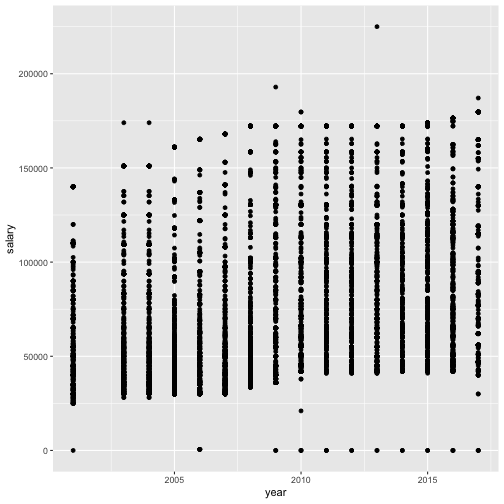
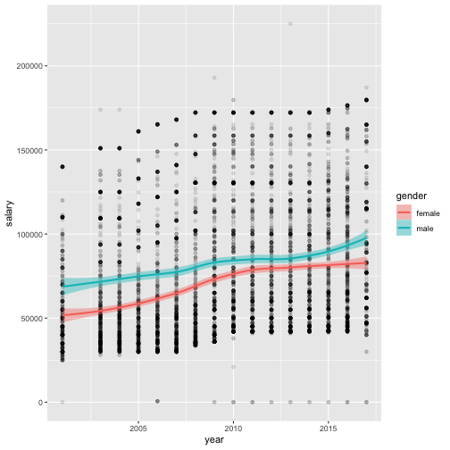
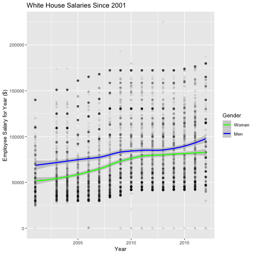
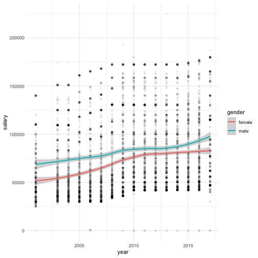
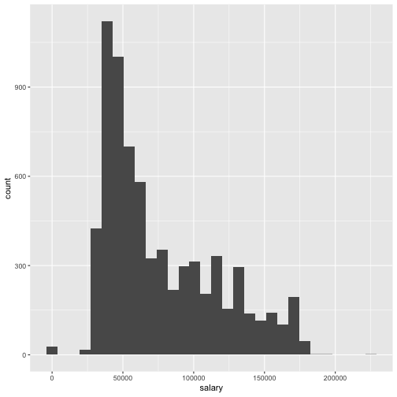
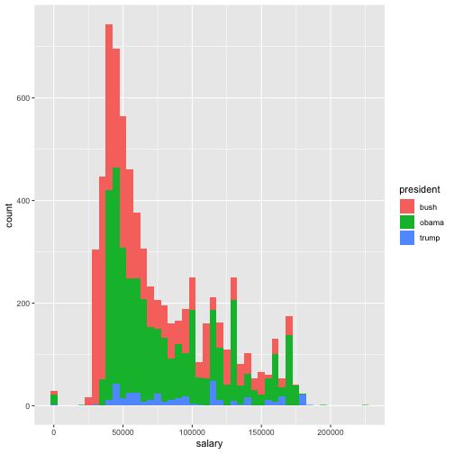
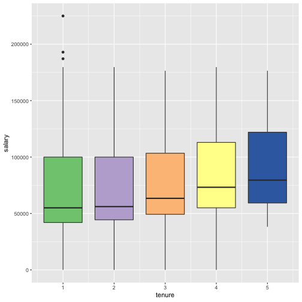
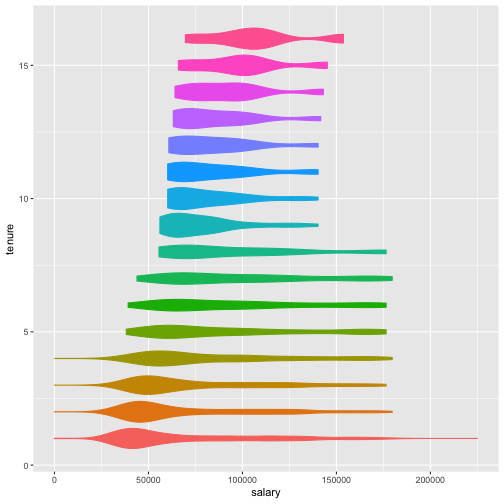
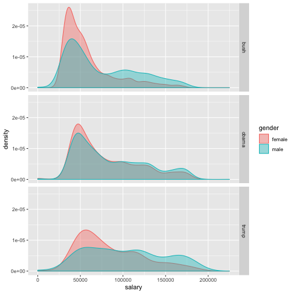

<style>
.small-code pre code {
  font-size: 1em;
}
</style>

ggplot2 - Data Visualization
========================================================
author: Ben Bellman
date: August 29, 2017
autosize: true
incremental: true

Advantages of ggplot2
========================================================

- Standard function and syntax for any plot, regardless of style

- Uses logic similar to dplyr and piping
- Full suite of functions for customizing graphs
- Clean and professional visual styles
- A huge improvement over base graphics capabilities
    - Unintuitive customization and bland look
    - See end of ```dplyr``` slides for examples
- Useful extention for making maps, ```ggmap```

Logic of ggplot2
========================================================

- Every plot is initialzied with ```ggplot()```function
- In this first function, define data and ```aes()``` specs
    - Columns for x and y axes
    - Data groupings, etc.
- Define plot type (geometry), color schemes, labels, etc. with additional functions
    - These can have their own ```aes()``` settings
- String functions together using ```+``` operator, similar to ```%>%``` in ```dplyr```

Setting up
========================================================
class: small-code
We'll start with the White House salaries data from the ```dplyr``` slides

```r
library(tidyverse)

salaries <- read_csv("~/Google Drive/Computer Backup/R Workshop/Data/white-house-salaries.csv")

# create the tenure variable
salaries <- salaries %>%
  rename(name = employee_name) %>%
  arrange(name) %>%
  group_by(name) %>%
  mutate(tenure = rank(year))
```

Building a plot: Starting
========================================================
class: small-code
Once we've initialized with ```ggplot()```, all we need to add is a geometry feature and a plot will generate

```r
ggplot(salaries, aes(x = year, y = salary)) +
  geom_point()
```

Building a plot: Starting
========================================================
class: small-code


Building a plot: Geometry
========================================================
class: small-code
```geom_``` and ```stat_``` functions add graphical features to the plot
- ```ggplot2``` can represent all data, or apply functions to summarize graphically

```r
ggplot(salaries, aes(x = year, y = salary)) +
  geom_line() + 
  geom_smooth(aes(col = gender), 
              method = "loess")
```
- You can add multiple geometries to the same plot
- ```geom_``` and ```stat_``` work the same, but ```stat_``` emphasizes the transformation over visual appearance

Building a plot: Geometry
========================================================
class: small-code



Building a plot: Labels
========================================================
class: small-code
There are functions for changing plot text and axis labels

```r
ggplot(salaries, aes(x = year, y = salary)) +
  geom_point() + 
  geom_smooth(aes(col = gender), method = "loess") +
  xlab("Year") +
  ylab("Employee Salary for Year ($)") +
  ggtitle("White House Salaries Since 2001")
```


Building a plot: Labels
========================================================
class: small-code
There are functions for changing plot text and axis labels


Building a plot: Themes
========================================================
class: small-code
Other functions change the overall look if the grid

```r
ggplot(salaries, aes(x = year, y = salary)) +
  geom_point() + 
  geom_smooth(aes(col = gender), method = "loess") +
  theme_bw()
```
- Also possible to create custom themes

Building a plot: Themes
========================================================
class: small-code



Building a plot: Scales, colors, and more
========================================================
- Functions for defining scales
    - ```scale_x_continuous()```, ```scale_y_discrete()```, ```scale_x_log10()```, ```scale_y_reverse()```, etc.
- Set scale limits
    - ```xlim()``` and ```ylim()```
- Functions for custom color/symbol schemes
    - Customize with ```scale_color_discrete()``` and ```scale_color_manual()```
    - Reliable schemes with ```scale_color_brewer()```
    - ```scale_size_manual()```, ```scale_shape_manual()```, ```scale_alpha_manual()```, etc.

Building a plot: Scales, colors, and more
========================================================
- Add extra lines
    - ```geom_abline()```, ```geom_vline()```, ```geom_hline()```
- Define colorbar and legend
    - ```guide_colorbar()``` and ```guide_legend()```
- Faceting multiple plots into one window
    - ```facet_grid()``` and ```facet_wrap()```

Navigating ggplot2 functions
========================================================
- There is a huge number of functions in ggplot2
    - Can't memorize them all
    - Important to use documentation and experiment
    - http://ggplot2.tidyverse.org/reference/
- If you can dream it, you can built it!
- I'll walk through some different plots
- End with ```ggmap``` and NYC Stop-and-Frisk data
- Questions and independent work

Visualizing Distributions: Histogram
========================================================
class: small-code
Create a histogram of salaries

```r
salaries %>%
ggplot() +
  geom_histogram(aes(salary))
```

Visualizing Distributions: Histogram
========================================================
class: small-code


Visualizing Distributions: Frequency polygon
========================================================
class: small-code
Compare frequencies for men and women

```r
salaries %>%
ggplot() +
  geom_freqpoly(aes(salary, col = gender))
```

Visualizing Distributions: Frequency polygon
========================================================



Visualizing Distributions: Boxplot
========================================================
class: small-code
Look at salaries for 1-5 years of tenure

```r
salaries %>%
  filter(tenure >= 1 & tenure <= 5) %>%
  ggplot(aes(tenure, salary, group = tenure)) +
    geom_boxplot(aes(fill = as.factor(tenure))) +
    scale_fill_brewer(palette = "Accent")
```


Visualizing Distributions: Boxplot
========================================================



Visualizing Distributions: Violin
========================================================
class: small-code
Look at salaries for 1-5 years of tenure

```r
salaries %>%
  filter(tenure >= 1 & tenure <= 5) %>%
  ggplot(aes(tenure, salary, group = tenure)) +
    geom_violin(aes(col = as.factor(tenure),
                    fill = as.factor(tenure)), 
                    show.legend = F) +
    coord_flip()
```


Visualizing Distributions: Violin
========================================================



Visualizing Distributions: Density and facet plots
========================================================
class: small-code
Look at salaries for 1-5 years of tenure

```r
salaries %>%
  ggplot() +
    geom_density(aes(salary, col = gender, group = gender)) +
    facet_grid(. ~ president)
```


Visualizing Distributions: Density and facet plots
========================================================


ggmap: Getting started
========================================================
class: small-code
- Syntax and logic is same as ```ggplot()```
    - Initialized with ```ggmap()```
    - All ```ggplot2``` graphics are compatible
    - ```aes()``` syntax is remains the same
- Plot latitude/longitude coordinates over a basemap image
    - ```get_map``` retrieves a basemap
    - ```ggmap()``` function generates a plot around this map
    - Points represented or summarized with ```geom```

```r
install.packages("ggmap", repos = 0)
library(ggmap)
```


Mapping data
========================================================
class: small-code
- 2014 NYPD Stop, Question, and Frisk data
- Has geocoded location in a different coordinate system
    - Must reproject coordinates with 
- Downloaded in excel file, must use ```readxl```

```r
install.packages("readxl", repos = 0)
library(readxl)
nyc_sqf <- read_xlsx("~/Google Drive/Computer Backup/R Workshop/Data/2014_sqf_web.xlsx")
```

Mapping data
========================================================
class: small-code
- Project coordinates as latitude/longitude

```r
install.packages("rgdal", repos = 0)
library(rgdal)

lon_lat <- nyc_sqf %>% 
  select(xcoord, ycoord) %>%
  as.matrix() %>%
  project(proj = "+proj=lcc +lat_1=40.66666666666666 +lat_2=41.03333333333333 +lat_0=40.16666666666666 +lon_0=-74 +x_0=300000 +y_0=0 +ellps=GRS80 +datum=NAD83 +to_meter=0.3048006096012192 +no_defs", inv = TRUE)

nyc_sqf$lon <- lon_lat[,1]
nyc_sqf$lat <- lon_lat[,2]
```

Mapping Brooklyn
========================================================
class: small-code

```r
get_map(location = "brooklyn", 
        maptype = "toner-lite",
        zoom = 12) %>%
  ggmap() +
  coord_cartesian() +
  geom_hex(data = nyc_sqf, aes(lon, lat), alpha = 0.65, na.rm = TRUE) +
  scale_fill_gradient(low = "#ffffff", high = "#ce1c1c")
```

Mapping Brooklyn
========================================================


Mapping the Bronx
========================================================
class: small-code

```r
get_map(location = "bronx", 
        maptype = "toner-lite",
        zoom = 12) %>%
  ggmap() +
  coord_cartesian() +
  geom_hex(data = nyc_sqf, aes(lon, lat), alpha = 0.65, na.rm = TRUE) +
  scale_fill_gradient(low = "#ffffff", high = "#ce1c1c")
```

Mapping the Bronx
========================================================


Mapping Port Authority
========================================================
class: small-code

```r
get_map(location = "port authority bus terminal", 
        maptype = "roadmap",
        zoom = 16) %>%
  ggmap() +
  geom_point(data = nyc_sqf, aes(lon, lat), col = "#ce1c1c", na.rm = TRUE)
```

Mapping Port Authority
========================================================


Mapping Downtown
========================================================
class: small-code

```r
get_map(location = "washington square park", 
        maptype = "satellite",
        zoom = 14) %>%
  ggmap() +
  geom_density_2d(data = nyc_sqf, aes(lon, lat), col = "#f8c9ca", na.rm = TRUE)
```

Mapping Downtown
========================================================


Questions and Ideas?
========================================================
- That's all the material for today
- Let's spend rest of time working independently or in groups
    - On this data or own data
    - I can answer any questions you run into
- Or work through questions and ideas together?

